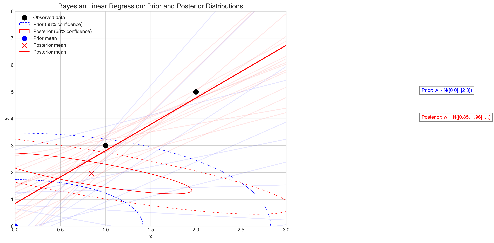
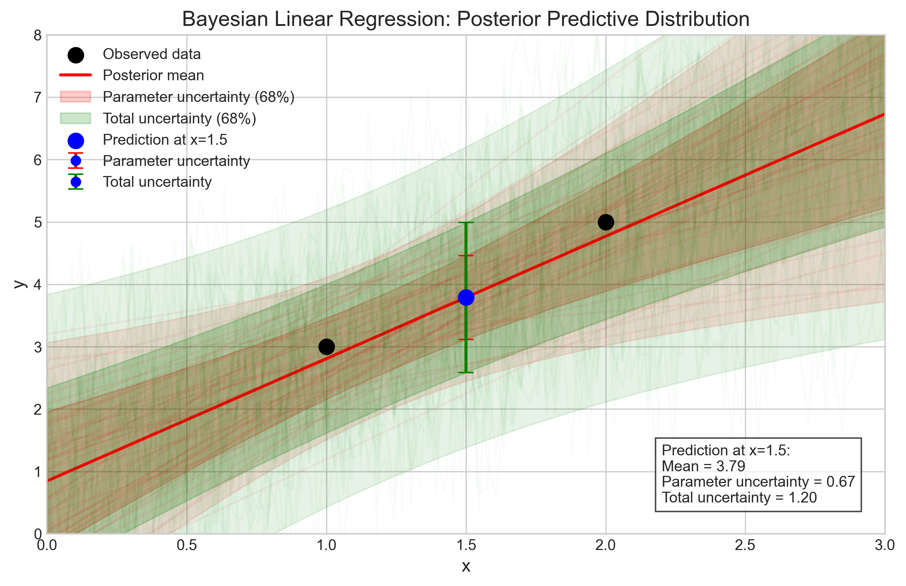
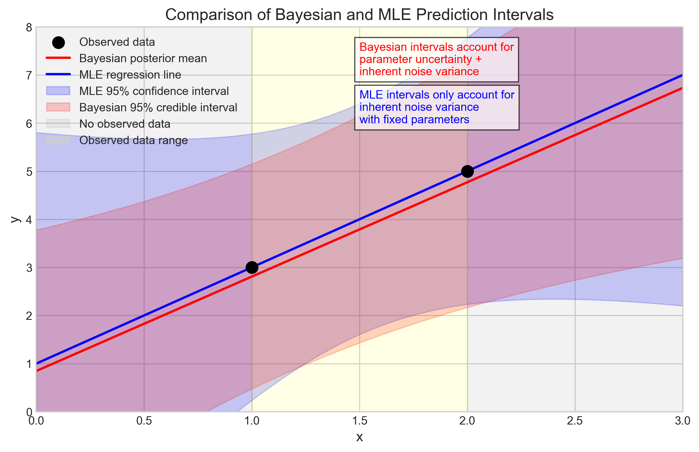
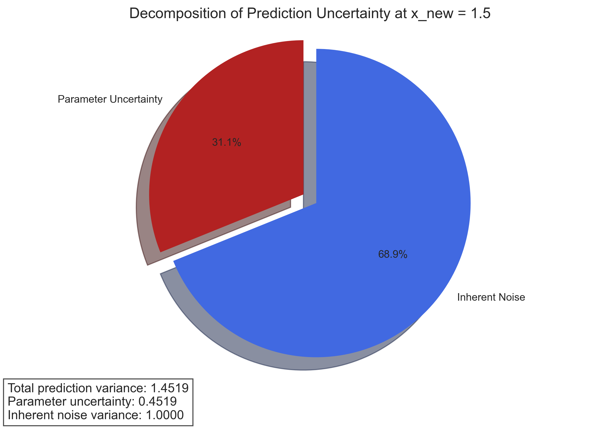

# Question 20: Bayesian Linear Regression with Conjugate Priors

## Problem Statement
Consider a Bayesian approach to linear regression where we use conjugate priors for efficient posterior computations. For a simple linear regression model:
$$y = w_0 + w_1x + \epsilon$$

where $\epsilon \sim \mathcal{N}(0, \sigma^2)$, and assuming $\sigma^2$ is known.

### Task
1. Identify the conjugate prior distribution for the parameter vector $\boldsymbol{w} = [w_0, w_1]^T$ in linear regression with Gaussian noise
2. Given a prior $\boldsymbol{w} \sim \mathcal{N}(\boldsymbol{\mu}_0, \boldsymbol{\Sigma}_0)$ where $\boldsymbol{\mu}_0 = [0, 0]^T$ and $\boldsymbol{\Sigma}_0 = \begin{bmatrix} 2 & 0 \\ 0 & 3 \end{bmatrix}$, derive the posterior distribution after observing the data points $(x^{(1)}, y^{(1)}) = (1, 3)$ and $(x^{(2)}, y^{(2)}) = (2, 5)$
3. Calculate the posterior predictive distribution for a new input $x_{\text{new}} = 1.5$
4. Explain how the posterior uncertainty in parameters affects prediction uncertainty compared to maximum likelihood estimation

## Understanding the Problem
This problem explores Bayesian linear regression, which extends traditional linear regression by incorporating prior knowledge and quantifying uncertainty in parameter estimates. In the Bayesian framework, we treat the model parameters as random variables with prior distributions, update these distributions based on observed data, and make predictions with quantified uncertainty.

The key concept is conjugacy: when the prior distribution is conjugate to the likelihood function, the posterior distribution follows the same parametric form as the prior, making the computations analytically tractable. For linear regression with Gaussian noise, we need to identify the appropriate conjugate prior, derive the posterior distribution after observing data, and understand how parameter uncertainty propagates to prediction uncertainty.

## Solution

### Step 1: Identify the conjugate prior distribution
In Bayesian linear regression with Gaussian noise, the conjugate prior for the parameter vector $\boldsymbol{w} = [w_0, w_1]^T$ is a multivariate Gaussian distribution:

$$\boldsymbol{w} \sim \mathcal{N}(\boldsymbol{\mu}_0, \boldsymbol{\Sigma}_0)$$

where:
- $\boldsymbol{\mu}_0$ is the prior mean vector
- $\boldsymbol{\Sigma}_0$ is the prior covariance matrix

With a Gaussian likelihood and a Gaussian prior, the posterior distribution will also be Gaussian due to conjugacy. This property makes the computations analytically tractable without requiring numerical approximation methods like Markov Chain Monte Carlo (MCMC).

### Step 2: Derive the posterior distribution
Given:
- Prior: $\boldsymbol{w} \sim \mathcal{N}(\boldsymbol{\mu}_0, \boldsymbol{\Sigma}_0)$
- $\boldsymbol{\mu}_0 = [0, 0]^T$
- $\boldsymbol{\Sigma}_0 = \begin{bmatrix} 2 & 0 \\ 0 & 3 \end{bmatrix}$
- Data points: $(x^{(1)}, y^{(1)}) = (1, 3)$ and $(x^{(2)}, y^{(2)}) = (2, 5)$
- Noise variance: $\sigma^2 = 1.0$

First, we construct the design matrix $\mathbf{X}$ (including the bias term):

$$\mathbf{X} = \begin{bmatrix} 1 & 1 \\ 1 & 2 \end{bmatrix}$$

and the target vector $\mathbf{y}$:

$$\mathbf{y} = \begin{bmatrix} 3 \\ 5 \end{bmatrix}$$

For Bayesian linear regression, the posterior distribution is proportional to the product of the prior and the likelihood. Due to conjugacy, the posterior is also a multivariate Gaussian:

$$\boldsymbol{w} | \mathcal{D} \sim \mathcal{N}(\boldsymbol{\mu}_n, \boldsymbol{\Sigma}_n)$$

where the posterior parameters are:

1. The posterior precision matrix (inverse of covariance):
   $$\boldsymbol{\Sigma}_n^{-1} = \boldsymbol{\Sigma}_0^{-1} + \frac{1}{\sigma^2} \mathbf{X}^T \mathbf{X}$$
   
   $$\boldsymbol{\Sigma}_n^{-1} = \begin{bmatrix} 0.5 & 0 \\ 0 & 0.33333333 \end{bmatrix} + \frac{1}{1.0} \begin{bmatrix} 2 & 3 \\ 3 & 5 \end{bmatrix} = \begin{bmatrix} 2.5 & 3 \\ 3 & 5.33333333 \end{bmatrix}$$

2. The posterior covariance matrix:
   $$\boldsymbol{\Sigma}_n = (\boldsymbol{\Sigma}_n^{-1})^{-1} = \begin{bmatrix} 1.23076923 & -0.69230769 \\ -0.69230769 & 0.57692308 \end{bmatrix}$$

3. The posterior mean vector:
   $$\boldsymbol{\mu}_n = \boldsymbol{\Sigma}_n (\boldsymbol{\Sigma}_0^{-1} \boldsymbol{\mu}_0 + \frac{1}{\sigma^2} \mathbf{X}^T \mathbf{y})$$
   
   $$\boldsymbol{\mu}_n = \begin{bmatrix} 1.23076923 & -0.69230769 \\ -0.69230769 & 0.57692308 \end{bmatrix} \left(\begin{bmatrix} 0 \\ 0 \end{bmatrix} + \frac{1}{1.0} \begin{bmatrix} 8 \\ 13 \end{bmatrix}\right) = \begin{bmatrix} 0.84615385 \\ 1.96153846 \end{bmatrix}$$

Therefore, the posterior distribution is:
$$\boldsymbol{w} | \mathcal{D} \sim \mathcal{N}\left(\begin{bmatrix} 0.84615385 \\ 1.96153846 \end{bmatrix}, \begin{bmatrix} 1.23076923 & -0.69230769 \\ -0.69230769 & 0.57692308 \end{bmatrix}\right)$$

### Step 3: Calculate the posterior predictive distribution
For a new input $x_{\text{new}} = 1.5$, we want to calculate the posterior predictive distribution, which is the distribution of the predicted output $y_{\text{new}}$ given the new input and the observed data:

$$p(y_{\text{new}} | x_{\text{new}}, \mathcal{D})$$

In Bayesian linear regression, this predictive distribution follows a normal distribution:

$$y_{\text{new}} | x_{\text{new}}, \mathcal{D} \sim \mathcal{N}(\mu_{\text{pred}}, \sigma^2_{\text{pred}})$$

1. The mean of the posterior predictive distribution:
   $$\mu_{\text{pred}} = \mathbf{x}_{\text{new}}^T \boldsymbol{\mu}_n$$
   
   where $\mathbf{x}_{\text{new}} = [1, 1.5]^T$ (including the bias term)
   
   $$\mu_{\text{pred}} = \begin{bmatrix} 1 & 1.5 \end{bmatrix} \begin{bmatrix} 0.84615385 \\ 1.96153846 \end{bmatrix} = 3.78846154$$

2. The variance of the posterior predictive distribution:
   $$\sigma^2_{\text{pred}} = \mathbf{x}_{\text{new}}^T \boldsymbol{\Sigma}_n \mathbf{x}_{\text{new}} + \sigma^2$$
   
   $$\sigma^2_{\text{pred}} = \begin{bmatrix} 1 & 1.5 \end{bmatrix} \begin{bmatrix} 1.23076923 & -0.69230769 \\ -0.69230769 & 0.57692308 \end{bmatrix} \begin{bmatrix} 1 \\ 1.5 \end{bmatrix} + 1.0 = 0.45192308 + 1.0 = 1.45192308$$

Therefore, the posterior predictive distribution is:
$$y_{\text{new}} | x_{\text{new}} = 1.5, \mathcal{D} \sim \mathcal{N}(3.78846154, 1.45192308)$$

### Step 4: Explain how posterior uncertainty affects prediction uncertainty
In Bayesian linear regression, the total prediction uncertainty has two components:

1. Uncertainty from parameter estimates (epistemic uncertainty): 0.45192308
2. Inherent noise variance (aleatoric uncertainty): 1.0

The total prediction variance is their sum: 1.45192308

Parameter uncertainty accounts for 31.13% of the total prediction variance.

The key differences between Bayesian regression and Maximum Likelihood Estimation (MLE) in terms of prediction uncertainty are:

1. MLE treats parameters as fixed point estimates and ignores parameter uncertainty
2. MLE prediction variance only includes the inherent noise variance ($\sigma^2$)
3. MLE underestimates the total prediction uncertainty by ignoring parameter uncertainty
4. In this case, MLE would underestimate the prediction variance by 31.13%

The Bayesian approach provides more honest uncertainty estimates by accounting for parameter uncertainty. This difference is more pronounced when:
- Sample size is small (as in our example with only 2 data points)
- Predictions are made far from the observed data
- The prior uncertainty is large

## Practical Implementation
Let's explore the practical implications of Bayesian linear regression through visualization and analysis.

### Prior and Posterior Parameter Distributions
First, we visualize the prior and posterior distributions for the parameters $w_0$ and $w_1$:

This figure shows:
- The prior distribution centered at [0, 0] with larger uncertainty (blue ellipses)
- The posterior distribution centered at [0.85, 1.96] with reduced uncertainty (red ellipses)
- Samples of regression lines drawn from both distributions
- The mean regression line from the posterior (solid red line)
- The observed data points (black dots)

The posterior distribution is more concentrated than the prior, reflecting the information gained from the observed data. The negative correlation between $w_0$ and $w_1$ in the posterior (shown by the tilted ellipses) indicates that these parameters are not independent after observing the data.

### Posterior Predictive Distribution
Next, we visualize the posterior predictive distribution:

This figure illustrates:
- The mean prediction line (red)
- Uncertainty bands from parameter uncertainty only (red shaded region)
- Total uncertainty bands including noise (green shaded region)
- The prediction at $x_{\text{new}} = 1.5$ with error bars showing both types of uncertainty

The prediction at $x_{\text{new}} = 1.5$ has a mean of 3.79 with parameter uncertainty of ±0.67 and total uncertainty of ±1.20 (one standard deviation).

### Comparison with Maximum Likelihood Estimation
To highlight the differences between Bayesian and MLE approaches, we compare their prediction intervals:

This figure shows:
- Bayesian mean prediction (red line) vs. MLE regression line (blue line)
- 95% Bayesian credible intervals (red shaded region)
- 95% MLE confidence intervals (blue shaded region)
- Regions with and without observed data (highlighted with different background colors)

The Bayesian intervals are wider, especially in regions far from the observed data, reflecting the increased uncertainty due to parameter uncertainty.

### Decomposition of Prediction Uncertainty
Finally, we visualize the decomposition of prediction uncertainty:

This pie chart shows that for our prediction at $x_{\text{new}} = 1.5$:
- 31.1% of the total uncertainty comes from parameter uncertainty
- 68.9% comes from the inherent noise in the model

## Key Insights

### Theoretical Foundations
- The conjugate prior for linear regression parameters with Gaussian noise is a multivariate Gaussian distribution
- Conjugacy ensures that the posterior distribution is also a multivariate Gaussian, simplifying the calculations
- The posterior precision matrix is the sum of the prior precision matrix and the data precision matrix
- The posterior mean balances the prior mean and the maximum likelihood estimate, weighted by their respective precisions

### Bayesian Inference Properties
- The posterior distribution represents a compromise between prior knowledge and observed data
- As more data is observed, the posterior becomes more concentrated and less dependent on the prior
- The posterior covariance matrix captures not just the uncertainty in individual parameters but also their correlations
- The negative correlation between intercept and slope parameters is typical in linear regression problems

### Prediction Uncertainty
- Total prediction uncertainty consists of two components: parameter uncertainty and inherent noise
- Parameter uncertainty decreases with more data but never completely disappears
- Parameter uncertainty increases as we predict further from the observed data
- Maximum likelihood estimation ignores parameter uncertainty, leading to underestimated prediction intervals

### Practical Implications
- Bayesian methods are particularly valuable when data is limited
- Bayesian prediction intervals are more honest about uncertainty, especially for extrapolation
- The importance of parameter uncertainty relative to noise variance depends on sample size, data distribution, and prior strength
- Bayesian approaches naturally avoid overfitting by accounting for parameter uncertainty

## Conclusion
- The conjugate prior distribution for the parameter vector in linear regression with Gaussian noise is a multivariate Gaussian distribution.
- After observing two data points, the posterior distribution for the parameters is a multivariate Gaussian with mean $[0.85, 1.96]$ and a covariance matrix that shows reduced uncertainty compared to the prior.
- The posterior predictive distribution for a new input $x_{\text{new}} = 1.5$ is a Gaussian with mean 3.79 and variance 1.45.
- Posterior uncertainty in parameters contributes significantly (31.1%) to the total prediction uncertainty, which is completely ignored by maximum likelihood estimation, leading to overly confident predictions.

This Bayesian approach offers a more comprehensive treatment of uncertainty in linear regression, providing not just point estimates but full probability distributions that capture our beliefs about both parameters and predictions. This is especially valuable in low-data settings, when making predictions outside the range of observed data, or when uncertainty quantification is critical for decision-making. 