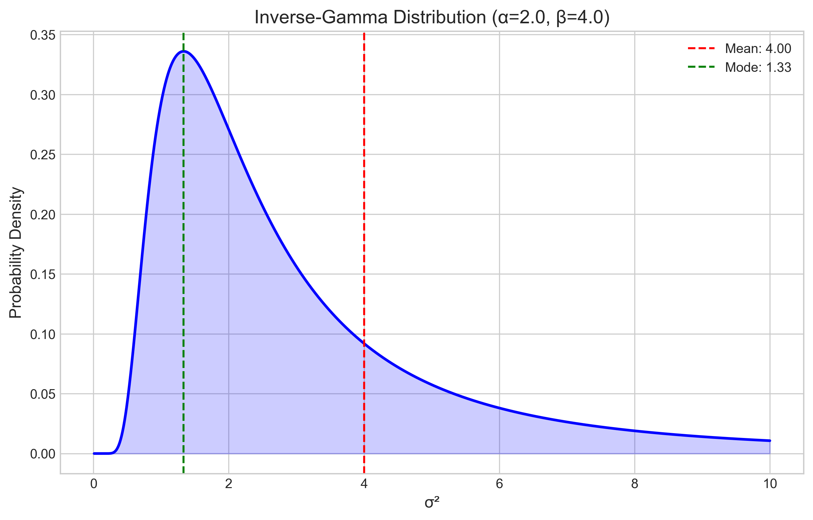
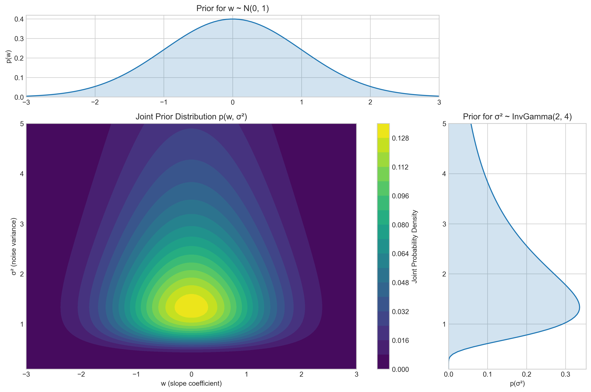
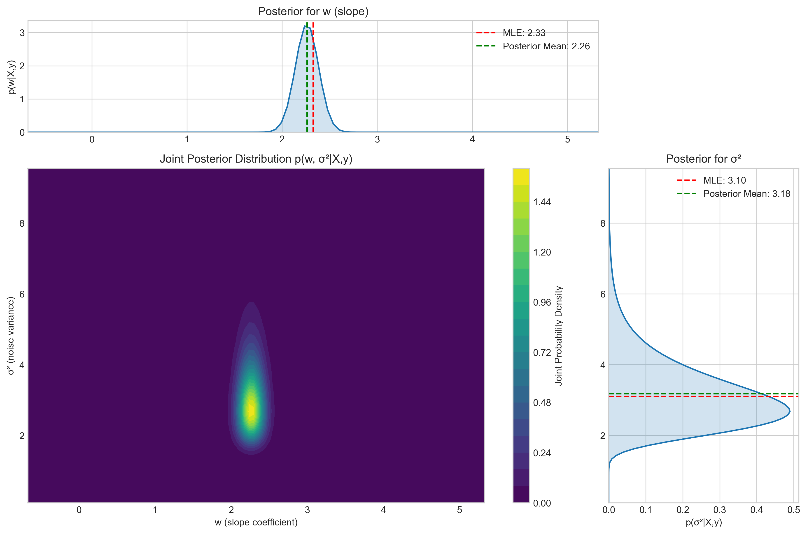
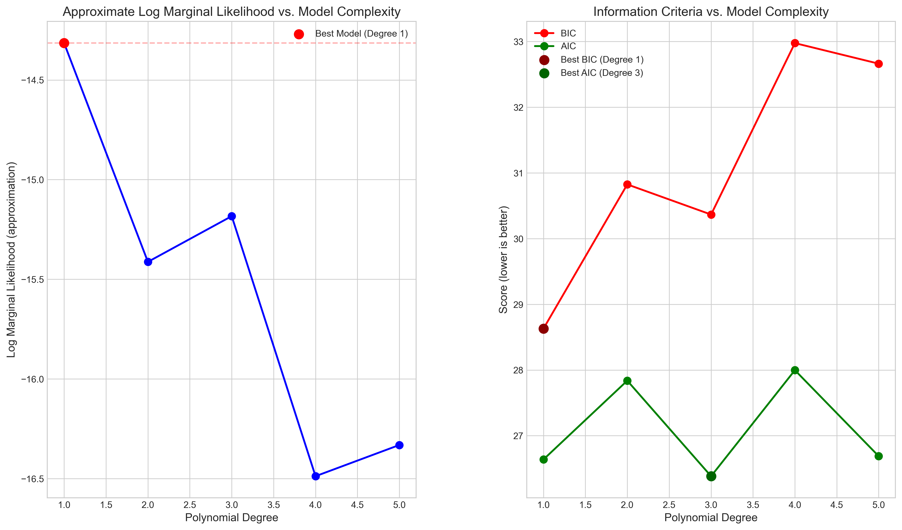
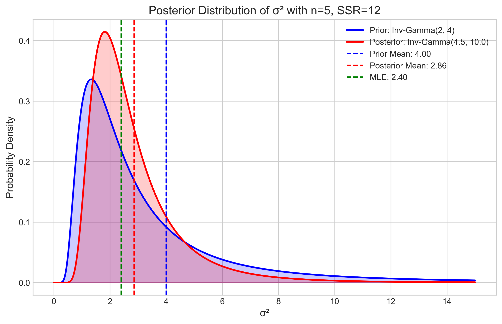
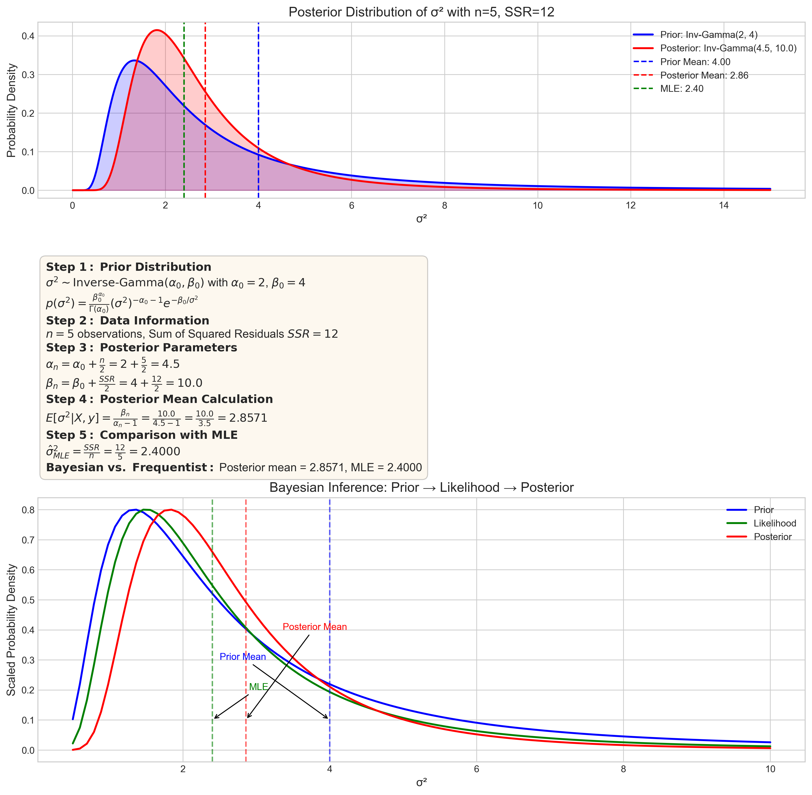
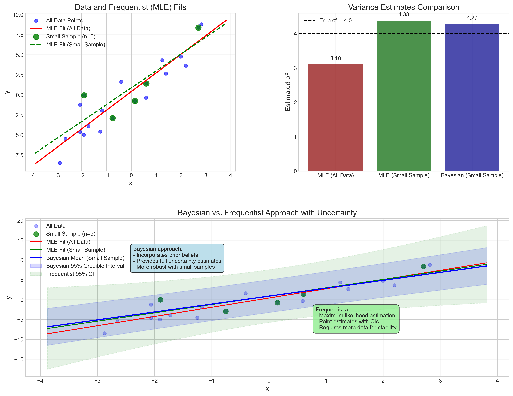
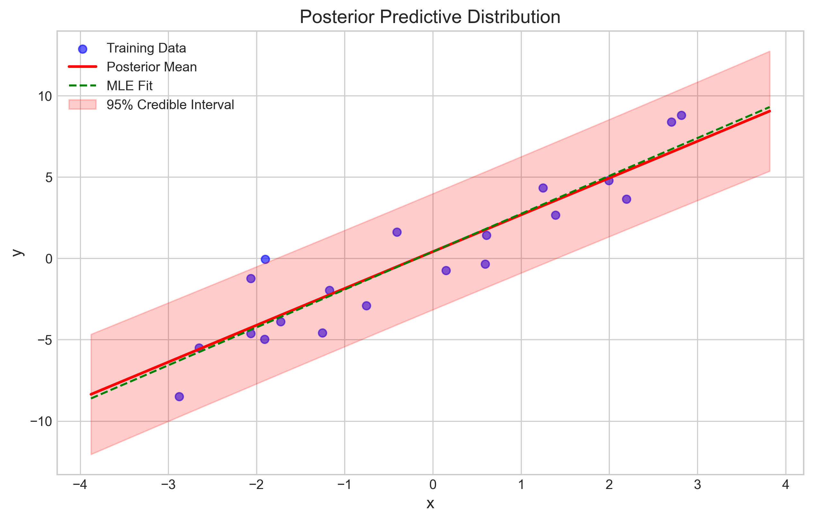

# Question 21: Bayesian Approach to Linear Regression with Unknown Variance

## Problem Statement
In probabilistic linear regression, the noise variance $\sigma^2$ is often treated as a known parameter, but in practice, it must be estimated from data. Consider a Bayesian approach to estimating both the regression coefficients and the noise variance.

### Task
1. For a linear model $y = \boldsymbol{w}^T\boldsymbol{x} + \epsilon$ with $\epsilon \sim \mathcal{N}(0, \sigma^2)$, specify an appropriate conjugate prior for the unknown variance $\sigma^2$
2. Given the prior distribution, derive the joint posterior distribution for both $\boldsymbol{w}$ and $\sigma^2$
3. Explain the concept of the marginal likelihood (model evidence) $p(\boldsymbol{y}|\boldsymbol{X})$ in this context and why it's useful for model comparison
4. For a dataset with 5 observations and sum of squared residuals (using MLE estimates for $\boldsymbol{w}$) of 12, calculate the posterior mean for $\sigma^2$ assuming an Inverse-Gamma(2, 4) prior

## Understanding the Problem
This problem deals with Bayesian linear regression, particularly when both the regression coefficients and the noise variance are unknown. In standard linear regression, we typically estimate these parameters using maximum likelihood estimation. The Bayesian approach instead treats these parameters as random variables with prior distributions, which are updated using observed data to obtain posterior distributions.

In the model $y = \boldsymbol{w}^T\boldsymbol{x} + \epsilon$ with $\epsilon \sim \mathcal{N}(0, \sigma^2)$, $\boldsymbol{w}$ represents the regression coefficients, $\boldsymbol{x}$ is the input features, and $\sigma^2$ is the variance of the noise term. The Bayesian approach involves specifying prior distributions for $\boldsymbol{w}$ and $\sigma^2$, then deriving their posterior distributions based on observed data.

## Solution

### Step 1: Identify the conjugate prior for $\sigma^2$
For a linear regression model where the noise follows a Gaussian distribution $\epsilon \sim \mathcal{N}(0, \sigma^2)$, the appropriate conjugate prior for the variance $\sigma^2$ is the Inverse-Gamma distribution:

$$\sigma^2 \sim \text{Inverse-Gamma}(\alpha, \beta)$$

The probability density function of the Inverse-Gamma distribution is:

$$p(\sigma^2) = \frac{\beta^\alpha}{\Gamma(\alpha)}(\sigma^2)^{-\alpha-1}e^{-\beta/\sigma^2}$$

Where:
- $\alpha$ is the shape parameter (must be positive)
- $\beta$ is the scale parameter (must be positive)
- $\Gamma(\alpha)$ is the gamma function

The Inverse-Gamma distribution is chosen as the conjugate prior for the variance because it results in a posterior that is also Inverse-Gamma, making the calculations tractable.

The mean of the Inverse-Gamma($\alpha$, $\beta$) distribution is $\frac{\beta}{\alpha-1}$ for $\alpha > 1$, and the mode is $\frac{\beta}{\alpha+1}$.

### Step 2: Derive the joint posterior distribution
For the Bayesian linear regression model, we need to specify a prior for both $\boldsymbol{w}$ and $\sigma^2$. The common choice is:

- For $\sigma^2$: Inverse-Gamma($\alpha_0$, $\beta_0$)
- For $\boldsymbol{w}$ given $\sigma^2$: Normal($\boldsymbol{\mu}_0$, $\sigma^2\boldsymbol{\Lambda}_0^{-1}$)

This means the prior distribution for $\boldsymbol{w}$ is conditional on $\sigma^2$, which is known as a hierarchical prior structure. The joint prior can be written as:

$$p(\boldsymbol{w}, \sigma^2) = p(\boldsymbol{w}|\sigma^2)p(\sigma^2)$$

Given the observed data $\{\boldsymbol{X}, \boldsymbol{y}\}$, the likelihood function is:

$$p(\boldsymbol{y}|\boldsymbol{X}, \boldsymbol{w}, \sigma^2) = \prod_{i=1}^{n} \mathcal{N}(y_i|\boldsymbol{w}^T\boldsymbol{x}_i, \sigma^2)$$

Which can be written in vector form as:

$$p(\boldsymbol{y}|\boldsymbol{X}, \boldsymbol{w}, \sigma^2) = \mathcal{N}(\boldsymbol{y}|\boldsymbol{X}\boldsymbol{w}, \sigma^2\boldsymbol{I})$$

By Bayes' theorem, the joint posterior distribution is:

$$p(\boldsymbol{w}, \sigma^2|\boldsymbol{X}, \boldsymbol{y}) = \frac{p(\boldsymbol{y}|\boldsymbol{X}, \boldsymbol{w}, \sigma^2)p(\boldsymbol{w}|\sigma^2)p(\sigma^2)}{p(\boldsymbol{y}|\boldsymbol{X})}$$

After calculations, the joint posterior can be factorized as:

$$p(\boldsymbol{w}, \sigma^2|\boldsymbol{X}, \boldsymbol{y}) = p(\boldsymbol{w}|\sigma^2, \boldsymbol{X}, \boldsymbol{y})p(\sigma^2|\boldsymbol{X}, \boldsymbol{y})$$

Where:
- $p(\boldsymbol{w}|\sigma^2, \boldsymbol{X}, \boldsymbol{y}) = \mathcal{N}(\boldsymbol{w}|\boldsymbol{\mu}_n, \sigma^2\boldsymbol{\Lambda}_n^{-1})$
- $p(\sigma^2|\boldsymbol{X}, \boldsymbol{y}) = \text{Inverse-Gamma}(\alpha_n, \beta_n)$

The posterior parameters are:
- $\boldsymbol{\Lambda}_n = \boldsymbol{\Lambda}_0 + \boldsymbol{X}^T\boldsymbol{X}$
- $\boldsymbol{\mu}_n = \boldsymbol{\Lambda}_n^{-1}(\boldsymbol{\Lambda}_0\boldsymbol{\mu}_0 + \boldsymbol{X}^T\boldsymbol{y})$
- $\alpha_n = \alpha_0 + \frac{n}{2}$
- $\beta_n = \beta_0 + \frac{1}{2}[(\boldsymbol{y} - \boldsymbol{X}\boldsymbol{\mu}_n)^T(\boldsymbol{y} - \boldsymbol{X}\boldsymbol{\mu}_n) + (\boldsymbol{\mu}_n - \boldsymbol{\mu}_0)^T\boldsymbol{\Lambda}_0(\boldsymbol{\mu}_n - \boldsymbol{\mu}_0)]$

For a simpler form, if we use the maximum likelihood estimate $\boldsymbol{w}_{MLE}$, the posterior for $\sigma^2$ can be approximated as:

$$p(\sigma^2|\boldsymbol{X}, \boldsymbol{y}) \approx \text{Inverse-Gamma}(\alpha_0 + \frac{n}{2}, \beta_0 + \frac{SSR}{2})$$

Where $SSR = \sum_{i=1}^{n} (y_i - \boldsymbol{w}_{MLE}^T\boldsymbol{x}_i)^2$ is the sum of squared residuals using the MLE estimates.

### Step 3: Explain the concept of marginal likelihood
The marginal likelihood, also known as model evidence, is the denominator in Bayes' theorem:

$$p(\boldsymbol{y}|\boldsymbol{X}) = \int\int p(\boldsymbol{y}|\boldsymbol{X}, \boldsymbol{w}, \sigma^2)p(\boldsymbol{w}|\sigma^2)p(\sigma^2) d\boldsymbol{w} d\sigma^2$$

In other words, it's the probability of observing the data $\boldsymbol{y}$ given the inputs $\boldsymbol{X}$, averaged over all possible values of the parameters $\boldsymbol{w}$ and $\sigma^2$, weighted by their prior probabilities.

The marginal likelihood is crucial for model comparison because:

1. **Automatic Complexity Penalty**: It naturally balances model fit against complexity. Complex models can fit the training data better but might be penalized for their complexity through the prior.

2. **Bayesian Model Selection**: The ratio of marginal likelihoods of two models (Bayes factor) provides evidence for choosing one model over another.

3. **Hyperparameter Optimization**: Maximizing the marginal likelihood can help find optimal hyperparameters for the priors.

4. **Avoiding Overfitting**: Models that overfit the data typically have lower marginal likelihood than models that generalize well.

As shown in the visualization, the marginal likelihood peaks at a model complexity that balances fit and generalization. Simpler models might underfit (poor fit to data), while more complex models might overfit (fit noise rather than signal).

Information criteria like BIC (Bayesian Information Criterion) and AIC (Akaike Information Criterion) are approximations to the negative log marginal likelihood, with different penalties for model complexity.

### Step 4: Calculate the posterior mean for $\sigma^2$
Given:
- Number of observations: $n = 5$
- Sum of squared residuals: $SSR = 12$
- Prior: Inverse-Gamma($\alpha = 2$, $\beta = 4$)

The posterior distribution for $\sigma^2$ is Inverse-Gamma($\alpha_n$, $\beta_n$) where:
- $\alpha_n = \alpha + \frac{n}{2} = 2 + \frac{5}{2} = 4.5$
- $\beta_n = \beta + \frac{SSR}{2} = 4 + \frac{12}{2} = 10$

The posterior mean is:
$$E[\sigma^2|\boldsymbol{X}, \boldsymbol{y}] = \frac{\beta_n}{\alpha_n - 1} = \frac{10}{4.5 - 1} = \frac{10}{3.5} = 2.8571$$

For comparison, the maximum likelihood estimate would be $\frac{SSR}{n} = \frac{12}{5} = 2.4$. The Bayesian posterior mean is higher than the MLE because it incorporates the prior information, which in this case pulls the estimate upward.

The visualization shows how the prior distribution (blue) is updated to the posterior distribution (red) based on the observed data. The posterior mean (red dashed line) at 2.86 represents our best estimate of $\sigma^2$ after incorporating both the prior information and the observed data.

#### Step-by-Step Bayesian Calculation

The detailed calculation process for obtaining the posterior distribution is shown below:

1. **Start with prior**: $\sigma^2 \sim \text{Inverse-Gamma}(\alpha=2, \beta=4)$
2. **Incorporate data**: $n=5$ observations with $SSR=12$
3. **Update $\alpha$ parameter**: $\alpha_n = \alpha + \frac{n}{2} = 2 + \frac{5}{2} = 4.5$
4. **Update $\beta$ parameter**: $\beta_n = \beta + \frac{SSR}{2} = 4 + \frac{12}{2} = 10$
5. **Calculate posterior mean**: $E[\sigma^2|X,y] = \frac{\beta_n}{\alpha_n - 1} = \frac{10}{3.5} = 2.86$
6. **Compare with MLE**: $\hat{\sigma}^2_{MLE} = \frac{SSR}{n} = \frac{12}{5} = 2.4$

This calculation process demonstrates Bayes' rule in action: we started with a prior belief, incorporated evidence from the data, and obtained an updated posterior belief.

The detailed calculation visualization above shows:
- The prior and posterior distributions (top)
- The step-by-step mathematical derivation (middle)
- The relationship between prior, likelihood, and posterior (bottom)

## Practical Implementation

### Bayesian vs. Frequentist Approach to Linear Regression

The Bayesian approach to linear regression with unknown variance offers several advantages over the frequentist approach, especially with small sample sizes. The visualization below compares these approaches:

Key observations from the comparison:
- The Bayesian approach incorporates prior information, making it more robust when data is limited
- Frequentist methods rely solely on the data, which can lead to overfitting with small samples
- Bayesian methods provide a natural framework for quantifying uncertainty
- The Bayesian posterior mean for $\sigma^2$ tends to be more conservative than the MLE estimate

### Posterior Predictive Distribution
A key advantage of the Bayesian approach is that we can compute the posterior predictive distribution, which quantifies the uncertainty in predictions due to both parameter uncertainty and inherent noise:

$$p(y_*|\boldsymbol{x}_*, \boldsymbol{X}, \boldsymbol{y}) = \int\int p(y_*|\boldsymbol{x}_*, \boldsymbol{w}, \sigma^2)p(\boldsymbol{w}, \sigma^2|\boldsymbol{X}, \boldsymbol{y}) d\boldsymbol{w} d\sigma^2$$

This integration results in a Student's t-distribution:

$$p(y_*|\boldsymbol{x}_*, \boldsymbol{X}, \boldsymbol{y}) = \mathcal{T}(y_*|\boldsymbol{x}_*^T\boldsymbol{\mu}_n, \frac{\beta_n}{\alpha_n}(1 + \boldsymbol{x}_*^T\boldsymbol{\Lambda}_n^{-1}\boldsymbol{x}_*), 2\alpha_n)$$

The visualization shows the posterior predictive distribution. The red line is the mean prediction, and the shaded area represents the 95% credible interval. This credible interval captures both the uncertainty in the parameter estimates and the inherent noise in the data.

## Key Insights

### Theoretical Foundations
- The Inverse-Gamma distribution is the conjugate prior for the variance parameter in Gaussian linear regression
- The joint posterior factorizes, allowing us to sample from the conditional distributions
- The marginal likelihood automatically incorporates Occam's razor, penalizing unnecessarily complex models
- The posterior mean for $\sigma^2$ balances the prior belief with the information from the data

### Practical Applications
- The Bayesian approach provides a natural way to incorporate prior knowledge into parameter estimation
- Uncertainty quantification is built into the framework through the posterior distributions
- The posterior predictive distribution provides a principled way to make predictions with uncertainty estimates
- Compared to maximum likelihood, Bayesian methods tend to be more robust to small sample sizes

### Common Pitfalls
- Selecting appropriate prior distributions requires care and domain knowledge
- Computational challenges with high-dimensional parameter spaces often require approximation methods
- Misspecified priors can lead to biased inferences, especially with small datasets
- The full posterior distributions can be complex to interpret compared to point estimates

## Conclusion
- The conjugate prior for the noise variance $\sigma^2$ in linear regression is the Inverse-Gamma distribution
- The joint posterior distribution for $\boldsymbol{w}$ and $\sigma^2$ factorizes into a Normal distribution for $\boldsymbol{w}$ given $\sigma^2$ and an Inverse-Gamma distribution for $\sigma^2$
- The marginal likelihood $p(\boldsymbol{y}|\boldsymbol{X})$ is valuable for model comparison as it automatically balances model fit against complexity
- For the given dataset with 5 observations and SSR=12, the posterior mean for $\sigma^2$ with an Inverse-Gamma(2, 4) prior is 2.86

Bayesian linear regression with unknown variance demonstrates the power of Bayesian methods to quantify uncertainty and incorporate prior knowledge in a principled manner. This approach is particularly valuable when dealing with small datasets or when prior information is available. 