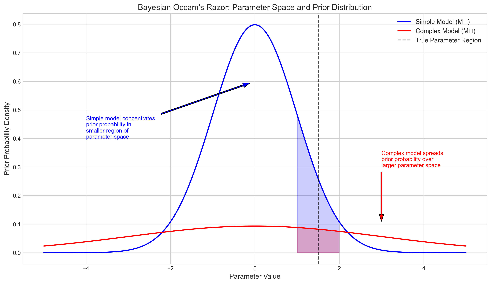
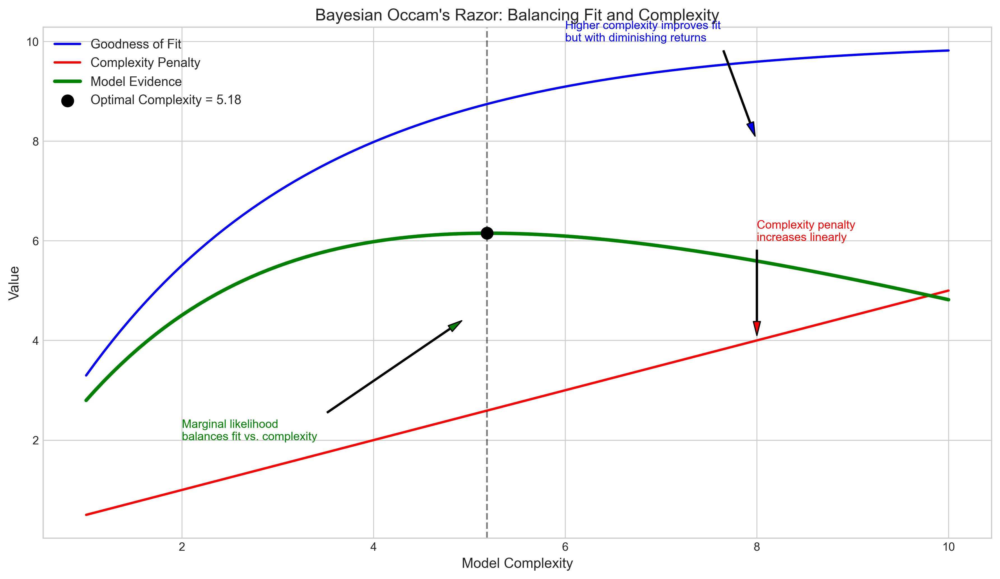
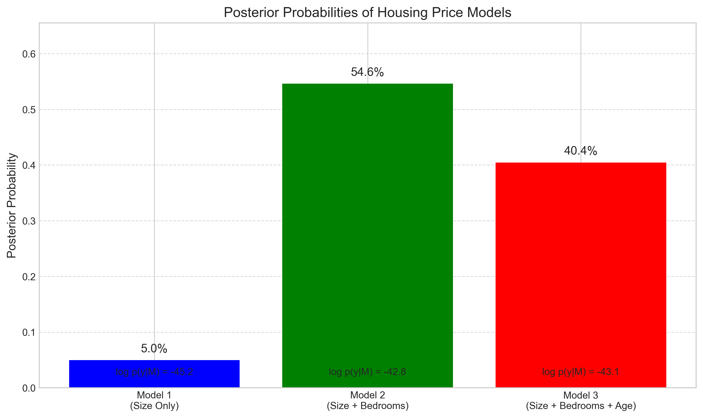
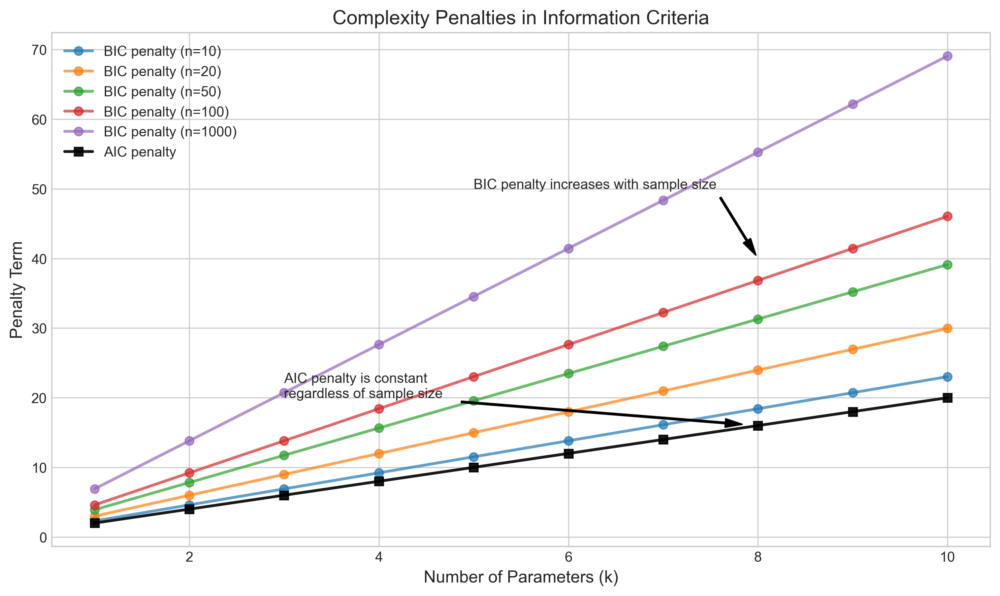
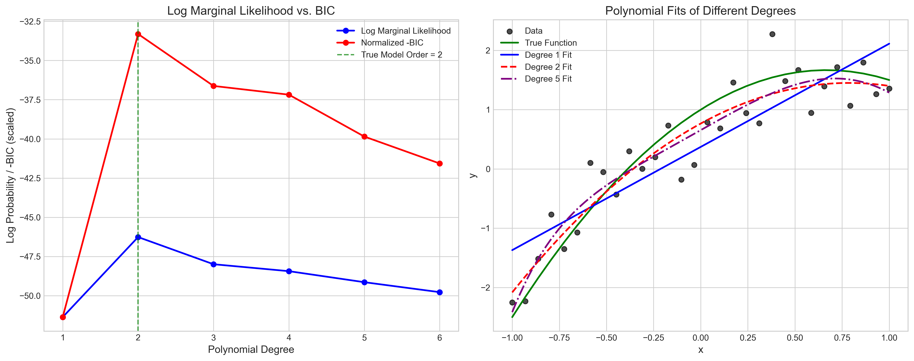
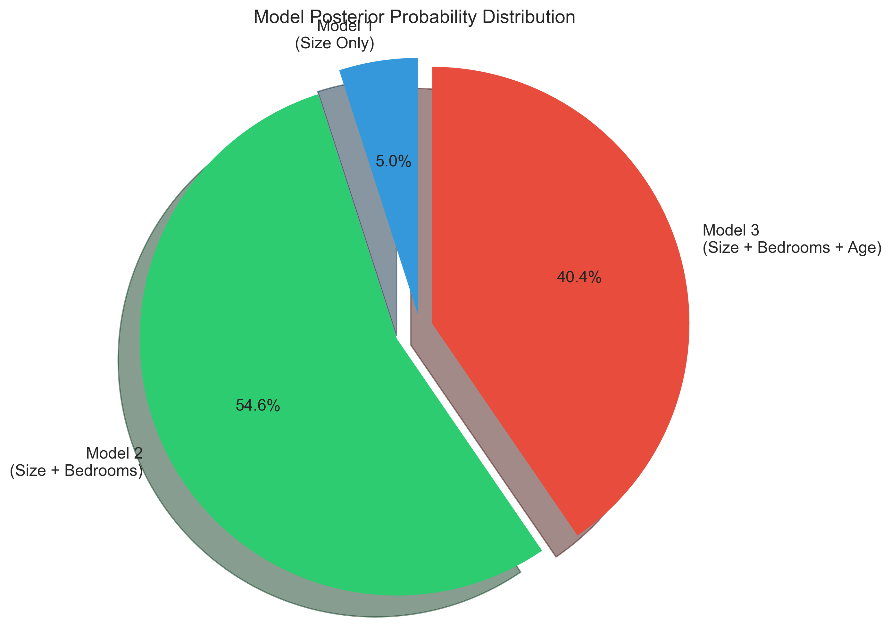
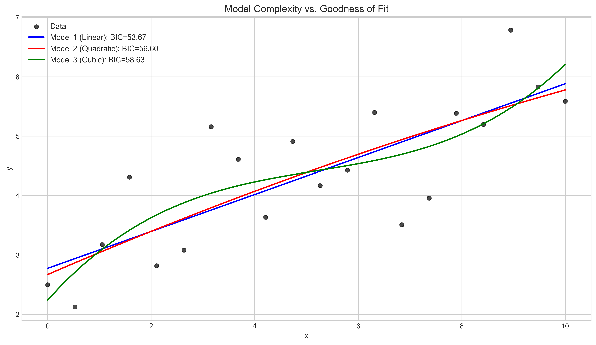

# Question 22: Bayesian Model Selection for Housing Price Models

## Problem Statement
You are analyzing housing price data and need to decide between different linear regression models with varying complexity:
- Model 1: $y = w_0 + w_1x_1 + \epsilon$ (price depends only on house size)
- Model 2: $y = w_0 + w_1x_1 + w_2x_2 + \epsilon$ (price depends on size and number of bedrooms)
- Model 3: $y = w_0 + w_1x_1 + w_2x_2 + w_3x_3 + \epsilon$ (price depends on size, bedrooms, and age)

Where $\epsilon \sim \mathcal{N}(0, \sigma^2)$ for all models.

### Task
1. Explain how to compute the marginal likelihood (model evidence) $p(\boldsymbol{y}|\mathcal{M}_i)$ for model comparison
2. Describe the role of Occam's razor in Bayesian model selection and how it's naturally incorporated in the marginal likelihood
3. Given the following (log) model evidences, compute the posterior probabilities for each model assuming equal prior probabilities:
   - $\log p(\boldsymbol{y}|\mathcal{M}_1) = -45.2$
   - $\log p(\boldsymbol{y}|\mathcal{M}_2) = -42.8$
   - $\log p(\boldsymbol{y}|\mathcal{M}_3) = -43.1$
4. Explain the relationship between Bayesian model selection and information criteria like BIC

## Understanding the Problem
This problem focuses on Bayesian model selection for housing price linear regression models of varying complexity. We need to understand how to evaluate different models from a Bayesian perspective, which involves computing the marginal likelihood (also called model evidence), understanding Occam's razor in model selection, calculating posterior model probabilities, and relating this Bayesian approach to information criteria like BIC.

Bayesian model selection differs from traditional approaches by considering the full parameter space rather than just point estimates, naturally accounting for model complexity through the marginal likelihood. This provides a principled framework for trading off model complexity against goodness of fit to avoid overfitting.

## Solution

### Step 1: Computing the Marginal Likelihood
The marginal likelihood (or model evidence) for a model $\mathcal{M}_i$ is given by:

$$p(\boldsymbol{y}|\mathcal{M}_i) = \int p(\boldsymbol{y}|\boldsymbol{\theta},\mathcal{M}_i) p(\boldsymbol{\theta}|\mathcal{M}_i) d\boldsymbol{\theta}$$

This integral represents the average likelihood of the data over the prior distribution of parameters. It measures how well the model explains the observed data, averaged over all possible parameter values weighted by their prior probability.

For linear regression models, this integral can be computed in several ways:

1. **Analytical solution** (for conjugate priors):
   - For linear regression with Gaussian likelihood and Gaussian prior on weights, the marginal likelihood has a closed-form solution:
   - $p(\boldsymbol{y}|\mathbf{X},\mathcal{M}_i) = \mathcal{N}(\boldsymbol{y}|0, \sigma^2\mathbf{I} + \mathbf{X}\Sigma\mathbf{X}^T)$
   - where $\Sigma$ is the prior covariance matrix of weights.

2. **Laplace approximation**:
   - Approximate the posterior as a Gaussian centered at the MAP estimate $\boldsymbol{\theta}_{\text{MAP}}$:
   - $p(\boldsymbol{y}|\mathcal{M}_i) \approx p(\boldsymbol{y}|\boldsymbol{\theta}_{\text{MAP}},\mathcal{M}_i)p(\boldsymbol{\theta}_{\text{MAP}}|\mathcal{M}_i) \times (2\pi)^{d/2}|\Sigma_{\text{MAP}}|^{1/2}$
   - where $d$ is the dimensionality of $\boldsymbol{\theta}$ and $\Sigma_{\text{MAP}}$ is the inverse Hessian at $\boldsymbol{\theta}_{\text{MAP}}$.

3. **Numerical integration**:
   - For low-dimensional models, direct numerical integration can be used.

4. **Monte Carlo estimation**:
   - Draw samples $\boldsymbol{\theta}^{(j)}$ from the prior $p(\boldsymbol{\theta}|\mathcal{M}_i)$ and estimate:
   - $p(\boldsymbol{y}|\mathcal{M}_i) \approx \frac{1}{J} \sum_j p(\boldsymbol{y}|\boldsymbol{\theta}^{(j)},\mathcal{M}_i)$

5. **Importance sampling**:
   - Use a proposal distribution $q(\boldsymbol{\theta})$ and estimate:
   - $p(\boldsymbol{y}|\mathcal{M}_i) \approx \sum_j \frac{p(\boldsymbol{y}|\boldsymbol{\theta}^{(j)},\mathcal{M}_i)p(\boldsymbol{\theta}^{(j)}|\mathcal{M}_i)}{q(\boldsymbol{\theta}^{(j)})}$
   - where $\boldsymbol{\theta}^{(j)}$ are samples from $q(\boldsymbol{\theta})$.

The choice of method depends on the complexity of the model and the form of the prior and likelihood functions. For linear regression with Gaussian priors, analytical solutions are typically available.

### Step 2: Occam's Razor in Bayesian Model Selection
Occam's razor is the principle that, all else being equal, simpler explanations are generally better than more complex ones. In Bayesian model selection, this principle is naturally incorporated through the marginal likelihood without having to be explicitly added.

The marginal likelihood implements a trade-off between:
1. **Goodness of fit**: How well the model fits the observed data
2. **Model complexity**: How much parameter space the model uses

More complex models are penalized because they spread their prior probability over a larger parameter space, which means they assign lower prior probability to any specific setting of parameters. This automatic penalty for complexity is known as the "Bayesian Occam's Razor."

As illustrated in the figure below, simple models concentrate their prior probability in a smaller region of parameter space, while complex models spread it across a larger space:

While complex models can achieve higher likelihood values at their optimal parameter settings, the marginal likelihood averages the likelihood over all possible parameter values weighted by the prior. Since complex models dilute their prior probability across more parameters, they can end up with lower marginal likelihoods despite potentially better fits at specific points.

This balancing mechanism is visualized conceptually in the following figure:

As model complexity increases, the goodness of fit improves but with diminishing returns, while the complexity penalty increases linearly. The marginal likelihood (model evidence) balances these competing factors, resulting in an optimal complexity level that maximizes the evidence.

### Step 3: Computing Posterior Model Probabilities
Given the log model evidences:
- $\log p(\boldsymbol{y}|\mathcal{M}_1) = -45.2$ (Model 1: size only)
- $\log p(\boldsymbol{y}|\mathcal{M}_2) = -42.8$ (Model 2: size + bedrooms)
- $\log p(\boldsymbol{y}|\mathcal{M}_3) = -43.1$ (Model 3: size + bedrooms + age)

To compute the posterior probabilities assuming equal prior probabilities, we need to:

1. Convert the log evidences to linear scale (being careful with numerical stability):
   - First, find the maximum log evidence to prevent numerical overflow: $\max = -42.8$
   - Normalize by subtracting this maximum value:
     - $p(\boldsymbol{y}|\mathcal{M}_1) \propto \exp(-45.2 - (-42.8)) = \exp(-2.4) \approx 0.090718$
     - $p(\boldsymbol{y}|\mathcal{M}_2) \propto \exp(-42.8 - (-42.8)) = \exp(0) = 1.000000$
     - $p(\boldsymbol{y}|\mathcal{M}_3) \propto \exp(-43.1 - (-42.8)) = \exp(-0.3) \approx 0.740818$

2. Calculate the sum for normalization: 
   - $p(\boldsymbol{y}|\mathcal{M}_1) + p(\boldsymbol{y}|\mathcal{M}_2) + p(\boldsymbol{y}|\mathcal{M}_3) = 0.090718 + 1.000000 + 0.740818 = 1.831536$

3. Calculate posterior probabilities (assuming equal prior probabilities):
   - $p(\mathcal{M}_1|\boldsymbol{y}) = \frac{p(\boldsymbol{y}|\mathcal{M}_1)}{p(\boldsymbol{y}|\mathcal{M}_1) + p(\boldsymbol{y}|\mathcal{M}_2) + p(\boldsymbol{y}|\mathcal{M}_3)} = \frac{0.090718}{1.831536} \approx 0.049531 = 4.95\%$
   - $p(\mathcal{M}_2|\boldsymbol{y}) = \frac{p(\boldsymbol{y}|\mathcal{M}_2)}{p(\boldsymbol{y}|\mathcal{M}_1) + p(\boldsymbol{y}|\mathcal{M}_2) + p(\boldsymbol{y}|\mathcal{M}_3)} = \frac{1.000000}{1.831536} \approx 0.545990 = 54.60\%$
   - $p(\mathcal{M}_3|\boldsymbol{y}) = \frac{p(\boldsymbol{y}|\mathcal{M}_3)}{p(\boldsymbol{y}|\mathcal{M}_1) + p(\boldsymbol{y}|\mathcal{M}_2) + p(\boldsymbol{y}|\mathcal{M}_3)} = \frac{0.740818}{1.831536} \approx 0.404479 = 40.45\%$

This calculation shows that Model 2 (which includes house size and number of bedrooms) has the highest posterior probability at 54.60%, followed by Model 3 (size, bedrooms, and age) at 40.45%, and finally Model 1 (size only) at 4.95%.

These results suggest that adding the number of bedrooms to the model (Model 2) substantially improves its ability to explain the data compared to using only house size (Model 1). However, further adding house age (Model 3) doesn't provide enough additional explanatory power to justify the increased complexity, resulting in a lower posterior probability than Model 2.

### Step 4: Relationship Between Bayesian Model Selection and BIC
The Bayesian Information Criterion (BIC) is an approximation to the log marginal likelihood that is derived from the Laplace approximation of the marginal likelihood integral.

The BIC is defined as:
$$\text{BIC} = -2 \times \ln(L) + k \times \ln(n)$$

where:
- $\ln(L)$ is the maximized log-likelihood of the model
- $k$ is the number of parameters in the model
- $n$ is the number of data points

The relationship to Bayesian model selection can be explained as follows:

1. **Approximation to log marginal likelihood**:
   - $\log p(\boldsymbol{y}|\mathcal{M}_i) \approx \log p(\boldsymbol{y}|\boldsymbol{\theta}_{\text{MAP}},\mathcal{M}_i) - \frac{k}{2} \log(n) + \text{constant terms}$
   - where $\boldsymbol{\theta}_{\text{MAP}}$ is the maximum a posteriori parameter estimate.

2. **BIC as an approximation**:
   - $\text{BIC} = -2 \times \log p(\boldsymbol{y}|\boldsymbol{\theta}_{\text{MLE}},\mathcal{M}_i) + k \times \log(n)$
   - $= -2 \times [\log p(\boldsymbol{y}|\mathcal{M}_i) + \frac{k}{2} \log(n) - \text{constant terms}]$

3. **Model selection implications**:
   - Lower BIC indicates higher marginal likelihood and thus higher posterior probability
   - The $k \times \log(n)$ term acts as a complexity penalty, implementing Occam's razor
   - As sample size $n$ increases, the penalty for complexity becomes stronger

The following figure illustrates how the complexity penalty in BIC increases with the sample size, compared to the constant penalty in AIC (Akaike Information Criterion):

The BIC penalty increases with sample size, making it more conservative about adding parameters as more data is available. This aligns with the Bayesian principle that we should become more confident in our model selection with more data.

The relationship between BIC and the log marginal likelihood can also be seen in the following comparison:

Both BIC and the log marginal likelihood tend to peak at similar model complexities, showing how BIC serves as a practical approximation to the theoretically principled log marginal likelihood.

The advantages of the full Bayesian approach over BIC include:
1. It incorporates prior information about parameters
2. It provides a full posterior distribution, not just a point selection
3. It can handle model uncertainty through Bayesian Model Averaging
4. It is more accurate for small sample sizes

However, BIC is widely used due to its simplicity and the fact that it doesn't require specifying priors or performing potentially complex integrations.

## Practical Implementation
In our housing price example, we used the log model evidences to determine that Model 2 (including house size and number of bedrooms) has the highest posterior probability, suggesting it achieves the best balance between model fit and complexity.

The distribution of posterior probabilities across models is visualized in the pie chart below:

In practice, this means:
1. Model 1 (size only) is too simplistic, failing to capture important factors affecting housing prices
2. Model 2 (size + bedrooms) captures the most important predictors without unnecessary complexity
3. Model 3 (size + bedrooms + age) adds complexity that doesn't substantially improve prediction

This analysis would guide us to select Model 2 for predicting housing prices, as it provides the best trade-off between explanatory power and model complexity according to the Bayesian framework.

## Visual Explanations

### Parameter Space and Prior Distribution

This visualization demonstrates how simple models concentrate their prior probability in a smaller region of parameter space, while complex models spread it over a larger space. When the true parameter lies within the high-probability region of both models, the simpler model assigns higher prior probability to that region, giving it an advantage in the marginal likelihood calculation. This is a key aspect of how Bayesian model selection naturally implements Occam's razor.

### Model Complexity vs. Goodness of Fit

This plot shows how models of increasing complexity (linear, quadratic, cubic) fit a dataset. As complexity increases, the fit to the training data improves, but at the risk of overfitting. The BIC values shown in the legend incorporate both the goodness of fit and a penalty for complexity, helping to identify the optimal model.

### Bayesian Occam's Razor

This conceptual visualization illustrates how the marginal likelihood balances goodness of fit (which increases with diminishing returns as complexity grows) against the complexity penalty (which increases linearly). The model evidence curve peaks at the optimal complexity level, which represents the best trade-off between fit and complexity. This demonstrates how Bayesian model selection automatically implements Occam's razor.

### Posterior Probabilities

This bar chart shows the posterior probabilities of the three housing price models based on the given log evidences. Model 2 (size + bedrooms) has the highest posterior probability at 54.60%, followed by Model 3 (size + bedrooms + age) at 40.45%, and Model 1 (size only) at just 4.95%. These probabilities reflect the relative support for each model given the observed data.

### Complexity Penalties in Information Criteria

This figure compares how BIC and AIC penalize model complexity. BIC's penalty increases with sample size, making it more conservative about adding parameters as more data becomes available. In contrast, AIC's penalty remains constant regardless of sample size. This difference explains why BIC tends to select simpler models than AIC, especially with large sample sizes.

## Key Insights

### Theoretical Foundations
- The marginal likelihood provides a principled way to compare models by averaging the likelihood over the parameter space weighted by the prior.
- Bayesian model selection naturally implements Occam's razor by penalizing complex models that spread prior probability thinly across large parameter spaces.
- The posterior probability of a model given the data combines the marginal likelihood with the prior probability of the model, quantifying our belief in each model after observing the data.
- BIC approximates -2 times the log marginal likelihood, providing a computationally simpler alternative that preserves the complexity penalty.

### Model Selection Strategy
- When comparing models, evaluate them based on posterior probabilities rather than just likelihood or R-squared, which don't account for complexity.
- The model with the highest posterior probability achieves the best balance between fit and complexity.
- For the housing price example, Model 2 (including size and bedrooms) achieves the highest posterior probability, suggesting it's the optimal choice.
- Adding more predictors to a model is only beneficial if they provide enough additional explanatory power to overcome the inherent complexity penalty.

### Practical Applications
- In housing price prediction, focus on the most influential factors (size and bedrooms) rather than including every possible predictor.
- When sample size is small, be particularly cautious about complex models, as the evidence may not support many parameters.
- Consider using BIC for fast model comparison, especially with large datasets or when specifying priors is challenging.
- For more accurate results, especially with small datasets, prefer full Bayesian model comparison using proper marginal likelihood calculations.

### Extensions and Limitations
- Bayesian model averaging (BMA) can be used to make predictions that account for model uncertainty by weighting predictions from each model by its posterior probability.
- The choice of prior can impact model selection, especially with small datasets. Sensitivity analysis with different priors may be advisable.
- Computational challenges can arise when calculating the marginal likelihood for complex models, requiring approximation methods.
- The assumption of equal prior probabilities for all models can be relaxed if there are theoretical reasons to favor certain models a priori.

## Conclusion
- The marginal likelihood $p(\boldsymbol{y}|\mathcal{M}_i)$ is computed by integrating the product of the likelihood and parameter prior over all possible parameter values, providing a principled measure of model evidence.
- Occam's razor is naturally incorporated in Bayesian model selection through the marginal likelihood, which penalizes complex models for spreading their prior probability over larger parameter spaces.
- Given the log model evidences, the posterior probabilities are 4.95% for Model 1, 54.60% for Model 2, and 40.45% for Model 3, indicating that Model 2 (including house size and number of bedrooms) achieves the optimal balance between fit and complexity.
- BIC is an approximation to -2 times the log marginal likelihood plus a constant, implementing Occam's razor through its complexity penalty term and providing a computationally simpler alternative to full Bayesian model comparison.

This Bayesian approach to model selection provides a rigorous framework for balancing model complexity against goodness of fit, helping us avoid both underfitting and overfitting when modeling housing prices or other phenomena. 