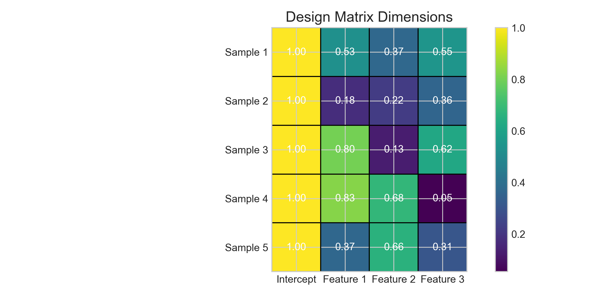
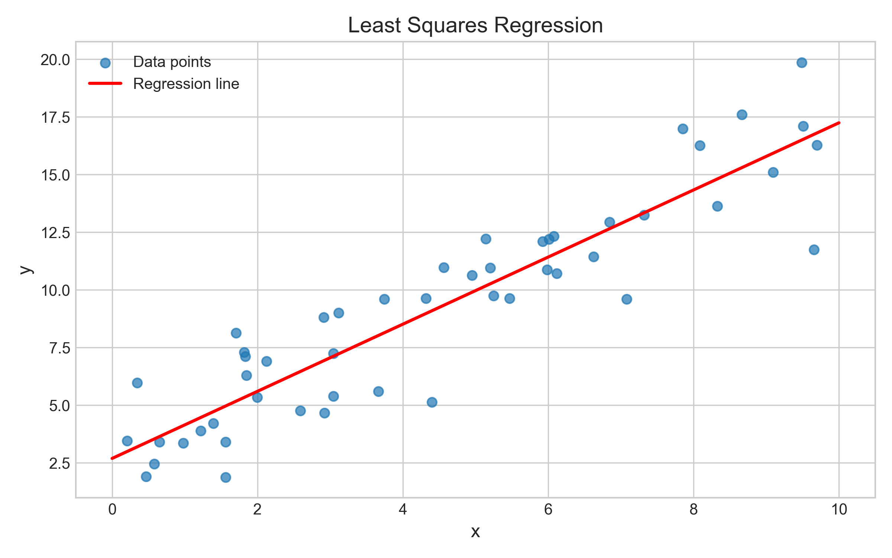
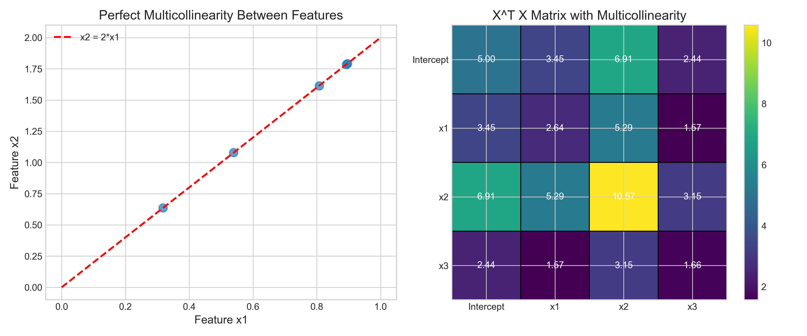
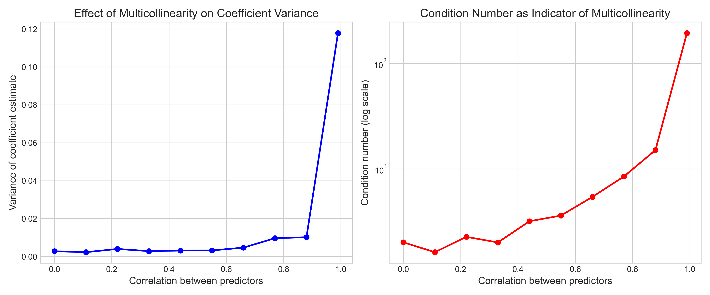
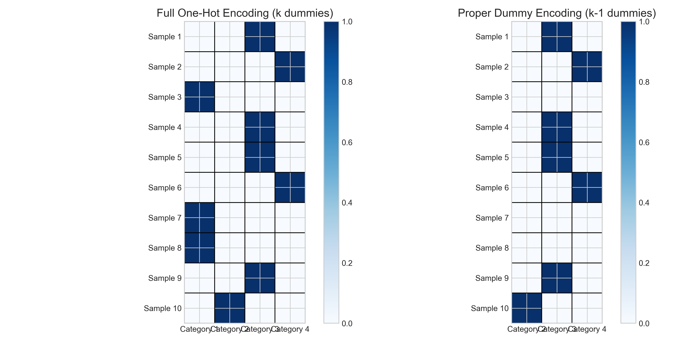
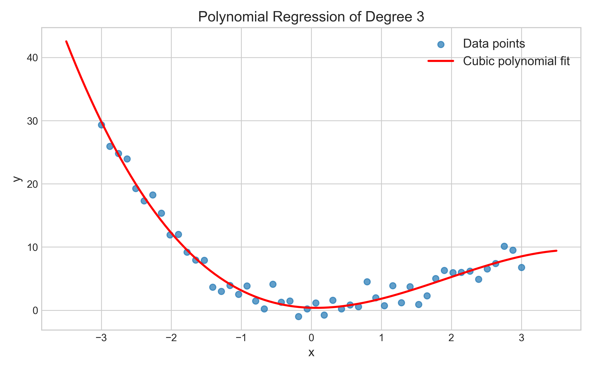
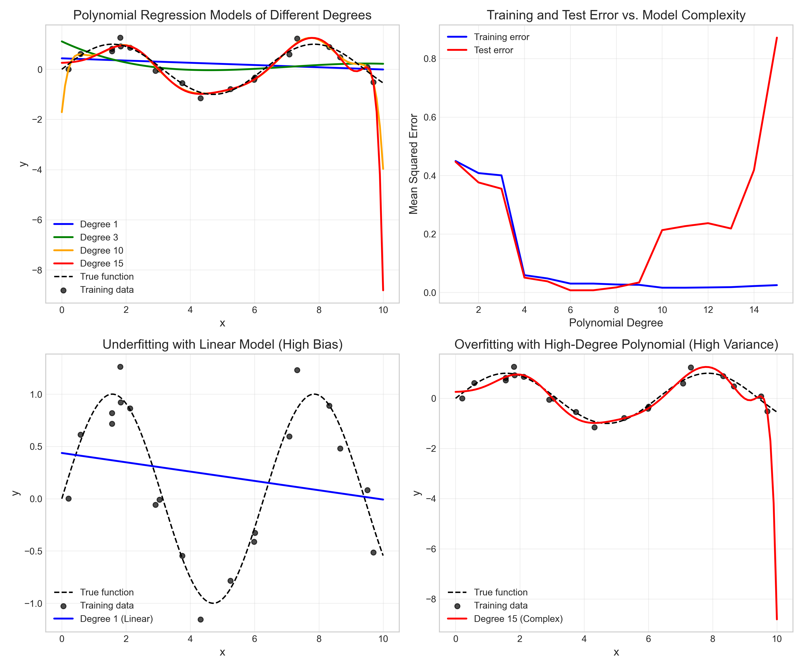
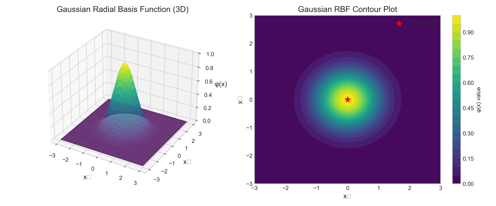
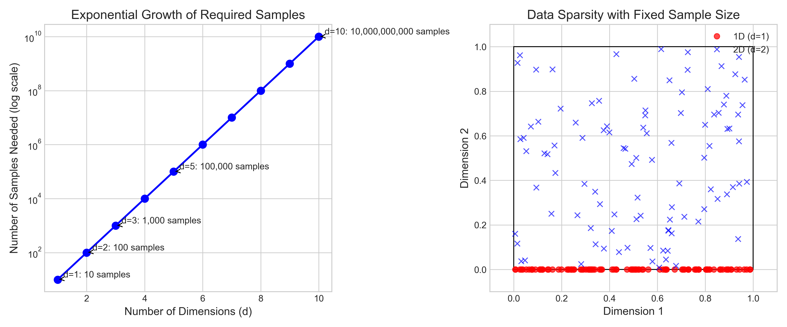

# Question 15: Matrix Form and Properties of Linear Regression

## Problem Statement
Complete each statement with the appropriate term or mathematical expression related to the matrix form and properties of linear regression.

### Task
Fill in each blank with the appropriate term or expression:

1. In a multiple linear regression model with $d$ features, the design matrix $\boldsymbol{X}$ has dimensions $\_\_\_\_\_\_\_\_\_\_\_\_\_\_$.
2. The closed-form solution to the least squares problem in matrix form is given by $\_\_\_\_\_\_\_\_\_\_\_\_\_\_$.
3. When there is perfect multicollinearity among predictors, the matrix $\boldsymbol{X}^T\boldsymbol{X}$ becomes $\_\_\_\_\_\_\_\_\_\_\_\_\_\_$.
4. If a categorical variable has $k$ levels, we typically create $\_\_\_\_\_\_\_\_\_\_\_\_\_\_$ dummy variables to represent it.
5. A polynomial regression model of degree 3 with a single input variable $x$ can be written as $y = \_\_\_\_\_\_\_\_\_\_\_\_\_\_ + \epsilon$.
6. A Gaussian radial basis function can be expressed as $\phi(\boldsymbol{x}) = \_\_\_\_\_\_\_\_\_\_\_\_\_\_$.
7. The "curse of dimensionality" in regression refers to problems that arise when $\_\_\_\_\_\_\_\_\_\_\_\_\_\_$.
8. In matrix form, the predictions of a linear regression model can be written as $\hat{\boldsymbol{y}} = \_\_\_\_\_\_\_\_\_\_\_\_\_\_$.

## Understanding the Problem
This problem focuses on the matrix representations and mathematical properties of linear regression models. These concepts are fundamental in understanding how linear regression works, especially when dealing with multiple features, different types of variables, and various modeling techniques. 

The matrix notation provides a concise way to represent regression models and enables efficient computation of the model parameters. It also helps in understanding the statistical properties of the estimators and the conditions under which the model might fail.

## Solution

### Step 1: Design Matrix Dimensions
In a multiple linear regression model with $d$ features, the design matrix $\boldsymbol{X}$ has dimensions **$n \times (d+1)$**, where:
- $n$ is the number of samples/observations
- $d$ is the number of features/predictors
- The additional column $(+1)$ is for the intercept term (typically a column of ones)

The design matrix $\boldsymbol{X}$ contains all the predictor variables and has the following structure:

$$\boldsymbol{X} = 
\begin{bmatrix}
1 & x_{11} & x_{12} & \cdots & x_{1d} \\
1 & x_{21} & x_{22} & \cdots & x_{2d} \\
\vdots & \vdots & \vdots & \ddots & \vdots \\
1 & x_{n1} & x_{n2} & \cdots & x_{nd}
\end{bmatrix}$$

### Step 2: Closed-Form Solution to Least Squares
The closed-form solution to the least squares problem in matrix form is given by:

**$(\boldsymbol{X}^T\boldsymbol{X})^{-1}\boldsymbol{X}^T\boldsymbol{y}$**

Where:
- $\boldsymbol{X}$ is the design matrix (dimensions: $n \times (d+1)$)
- $\boldsymbol{y}$ is the vector of target values (dimensions: $n \times 1$)
- $\boldsymbol{X}^T$ is the transpose of $\boldsymbol{X}$
- $(\boldsymbol{X}^T\boldsymbol{X})^{-1}$ is the inverse of the matrix $\boldsymbol{X}^T\boldsymbol{X}$
- $\hat{\boldsymbol{\beta}}$ is the vector of estimated coefficients (dimensions: $(d+1) \times 1$)

This formula gives the values of the coefficients that minimize the sum of squared residuals. In our example, for a simple linear regression, we get:

$$\hat{\boldsymbol{\beta}} = 
\begin{bmatrix}
2.69 \\
1.46
\end{bmatrix}$$

Which represents an intercept of 2.69 and a slope of 1.46 for our regression line.

### Step 3: Effect of Perfect Multicollinearity
When there is perfect multicollinearity among predictors (meaning one predictor is a perfect linear combination of others), the matrix $\boldsymbol{X}^T\boldsymbol{X}$ becomes **singular**.

A singular matrix:
- Has a determinant of zero
- Does not have an inverse
- Has at least one eigenvalue equal to zero

Without an inverse of $\boldsymbol{X}^T\boldsymbol{X}$, we cannot compute the closed-form solution for the regression coefficients. This explains why perfect multicollinearity is problematic in regression analysis.

#### Effects of Multicollinearity on Coefficient Estimates
Beyond making the matrix singular in the extreme case, multicollinearity has significant effects on coefficient estimates as the correlation between predictors increases:

1. The variance of coefficient estimates increases dramatically
2. This makes the model unstable - small changes in the data can result in large changes in coefficient values
3. The condition number of $\boldsymbol{X}^T\boldsymbol{X}$ rises sharply as correlation approaches 1
4. While coefficients themselves become unreliable, predictions may still be accurate within the range of the data

### Step 4: Dummy Variables for Categorical Variables
If a categorical variable has $k$ levels (categories), we typically create **$k-1$** dummy variables to represent it.

We use $k-1$ (and not $k$) dummy variables because:
- Using all $k$ dummy variables would create perfect multicollinearity with the intercept term
- The sum of all $k$ dummy variables would be equal to the intercept column (all ones), creating linear dependence
- The omitted category becomes the reference/baseline category

### Step 5: Polynomial Regression of Degree 3
A polynomial regression model of degree 3 with a single input variable $x$ can be written as:

**$\beta_0 + \beta_1 x + \beta_2 x^2 + \beta_3 x^3 + \epsilon$**

Where:
- $\beta_0$ is the intercept
- $\beta_1, \beta_2, \beta_3$ are the coefficients for the linear, quadratic, and cubic terms
- $\epsilon$ is the error term

Polynomial regression allows us to model nonlinear relationships using linear regression techniques by adding polynomial terms as features.

#### Bias-Variance Tradeoff in Polynomial Regression
Polynomial regression provides an excellent demonstration of the bias-variance tradeoff in machine learning:

1. Low-degree models (like linear regression) often show high bias:
   - They fail to capture the true underlying pattern (underfitting)
   - Both training and test errors remain high

2. High-degree models exhibit high variance:
   - They capture noise in the training data (overfitting)
   - Training error approaches zero while test error increases

3. The optimal model complexity balances these opposing forces:
   - It adequately captures the pattern in the data
   - It generalizes well to new, unseen data

### Step 6: Gaussian Radial Basis Function
A Gaussian radial basis function (RBF) can be expressed as:

**$\exp(-\gamma\|\boldsymbol{x} - \boldsymbol{\mu}\|^2)$**

Where:
- $\boldsymbol{x}$ is the input vector
- $\boldsymbol{\mu}$ is the center of the RBF
- $\gamma$ is a parameter controlling the width of the function
- $\|\boldsymbol{x} - \boldsymbol{\mu}\|$ is the Euclidean distance between $\boldsymbol{x}$ and $\boldsymbol{\mu}$

Radial basis functions are commonly used in kernel methods and neural networks to transform the input space, allowing for more complex decision boundaries.

### Step 7: Curse of Dimensionality
The "curse of dimensionality" in regression refers to problems that arise when **the number of features/dimensions becomes large relative to the number of samples**.

These problems include:
1. The volume of the feature space grows exponentially with the number of dimensions
2. Data becomes increasingly sparse in higher-dimensional spaces
3. Distance metrics become less meaningful as dimensionality increases
4. Models require exponentially more data to maintain the same level of performance
5. Risk of overfitting increases due to the increased model complexity

### Step 8: Matrix Form for Predictions
In matrix form, the predictions of a linear regression model can be written as:

**$\boldsymbol{X}\boldsymbol{\beta}$**

Where:
- $\hat{\boldsymbol{y}}$ is the vector of predicted values (dimensions: $n \times 1$)
- $\boldsymbol{X}$ is the design matrix (dimensions: $n \times (d+1)$)
- $\boldsymbol{\beta}$ is the vector of coefficients (dimensions: $(d+1) \times 1$)

This compact notation represents the linear combination of features and coefficients for all samples simultaneously.

For example, with a design matrix $\boldsymbol{X}$:

$$\boldsymbol{X} = 
\begin{bmatrix}
1.00 & 0.37 & 0.95 \\
1.00 & 0.73 & 0.60 \\
1.00 & 0.16 & 0.16 \\
1.00 & 0.06 & 0.87 \\
1.00 & 0.60 & 0.71
\end{bmatrix}$$

And coefficient vector $\boldsymbol{\beta}$:

$$\boldsymbol{\beta} = 
\begin{bmatrix}
3.00 \\
1.50 \\
2.00
\end{bmatrix}$$

The resulting predictions $\hat{\boldsymbol{y}}$ would be:

$$\hat{\boldsymbol{y}} = 
\begin{bmatrix}
5.46 \\
5.30 \\
3.55 \\
4.82 \\
5.32
\end{bmatrix}$$

This matrix multiplication effectively computes the linear combination for each sample in a single operation.

## Key Insights

### Theoretical Foundations
- The matrix representation of linear regression provides a concise way to express the model and derive its properties
- The closed-form solution exists when $\boldsymbol{X}^T\boldsymbol{X}$ is invertible (i.e., no perfect multicollinearity)
- The dimensions of matrices in linear regression are important for understanding the model structure and computations
- As correlation between predictors increases, coefficient estimates become increasingly unstable due to multicollinearity

### Practical Considerations
- Multicollinearity should be addressed before fitting a model to ensure stable coefficient estimates
- Categorical variables require proper encoding (usually with $k-1$ dummy variables)
- The curse of dimensionality emphasizes the importance of feature selection and dimensionality reduction
- Polynomial regression and basis functions allow linear regression to model nonlinear relationships
- The bias-variance tradeoff highlights the importance of selecting appropriate model complexity

### Advanced Applications
- The matrix form of linear regression extends to many advanced techniques like ridge regression, lasso, and elastic net
- Basis functions (like Gaussian RBF) enable kernel methods and more flexible models
- Understanding matrix operations is essential for implementing efficient computational algorithms for regression
- Regularization techniques can be used to address multicollinearity and overfitting in high-dimensional settings

## Conclusion

### Summary of Key Answers
1. In a multiple linear regression model with $d$ features, the design matrix $\boldsymbol{X}$ has dimensions **$n \times (d+1)$**.
2. The closed-form solution to the least squares problem in matrix form is given by **$(\boldsymbol{X}^T\boldsymbol{X})^{-1}\boldsymbol{X}^T\boldsymbol{y}$**.
3. When there is perfect multicollinearity among predictors, the matrix $\boldsymbol{X}^T\boldsymbol{X}$ becomes **singular**.
4. If a categorical variable has $k$ levels, we typically create **$k-1$** dummy variables to represent it.
5. A polynomial regression model of degree 3 with a single input variable $x$ can be written as $y = \textbf{$\beta_0 + \beta_1 x + \beta_2 x^2 + \beta_3 x^3$} + \epsilon$.
6. A Gaussian radial basis function can be expressed as $\phi(\boldsymbol{x}) = \textbf{$\exp(-\gamma\|\boldsymbol{x} - \boldsymbol{\mu}\|^2)$}$.
7. The "curse of dimensionality" in regression refers to problems that arise when **the number of features/dimensions becomes large relative to the number of samples**.
8. In matrix form, the predictions of a linear regression model can be written as $\hat{\boldsymbol{y}} = \textbf{$\boldsymbol{X}\boldsymbol{\beta}$}$.

### Critical Understanding Points
- Matrix formulations provide a powerful framework for expressing and solving regression problems efficiently
- The properties of these matrices directly impact model estimation and performance
- Understanding these concepts helps diagnose and address common issues in regression modeling:
  - Recognizing and addressing multicollinearity
  - Properly handling categorical variables
  - Managing the trade-off between model complexity and generalization
  - Implementing appropriate regularization techniques when needed

These mathematical foundations are not just theoretical but have direct practical implications for building effective regression models and understanding their limitations. By mastering these concepts, you'll be better equipped to implement, troubleshoot, and optimize linear regression models across various domains and applications. 