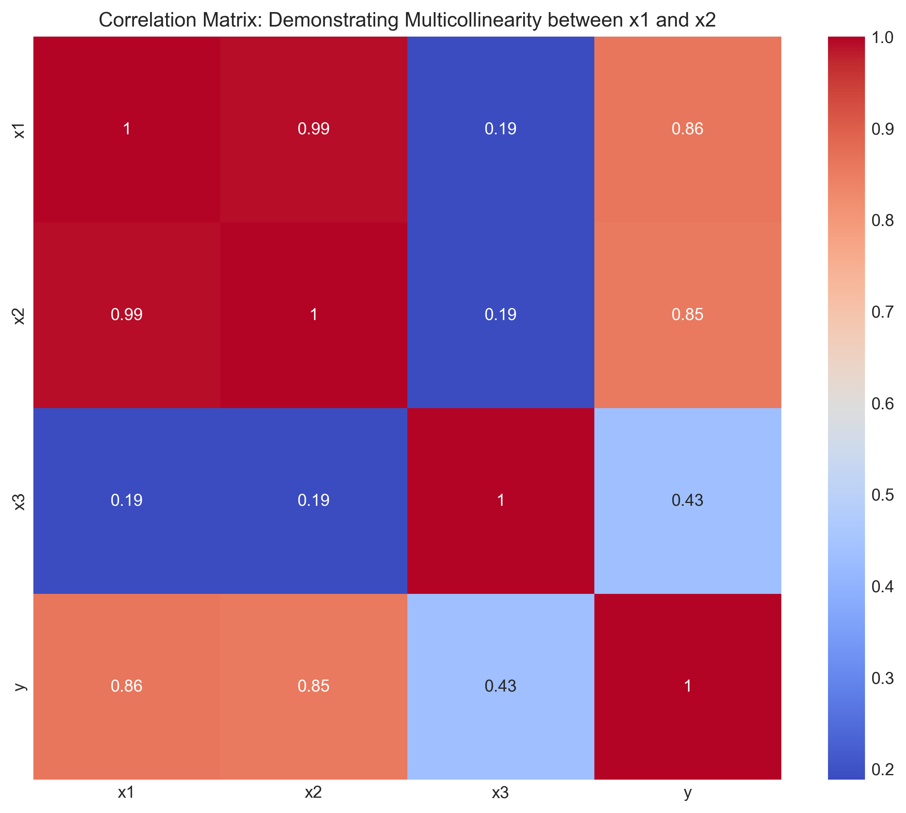
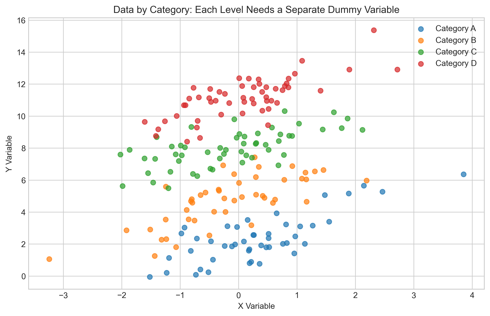
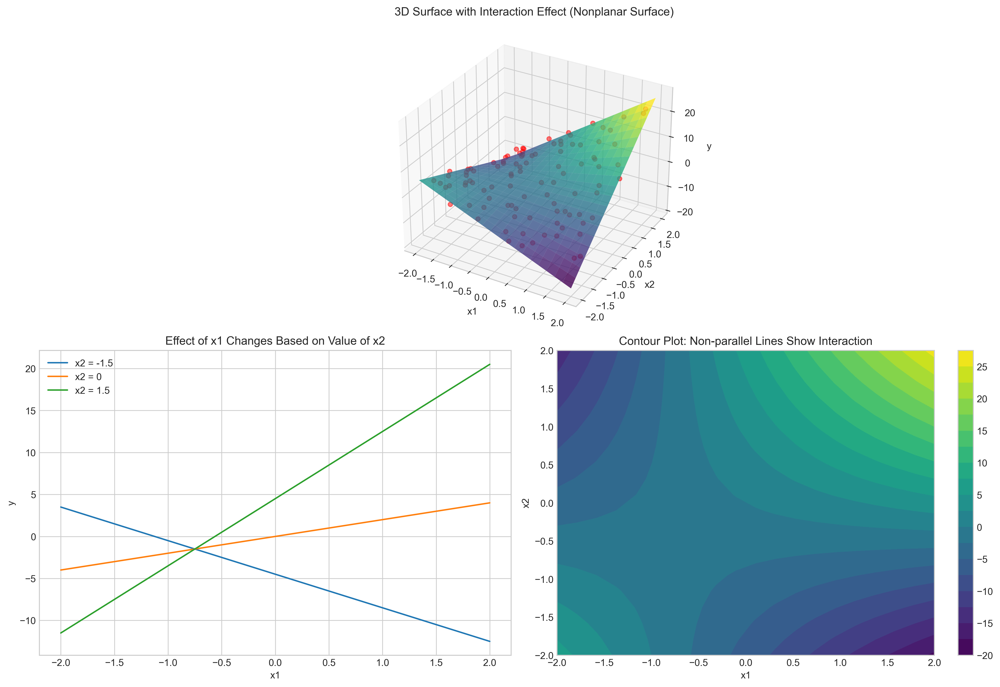
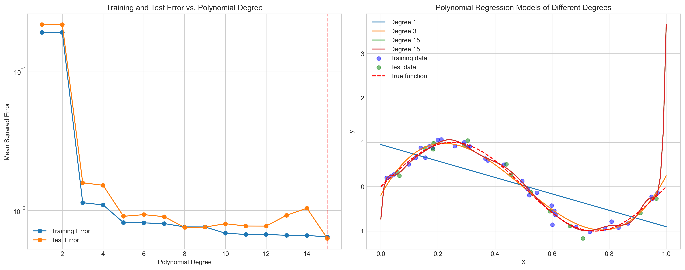
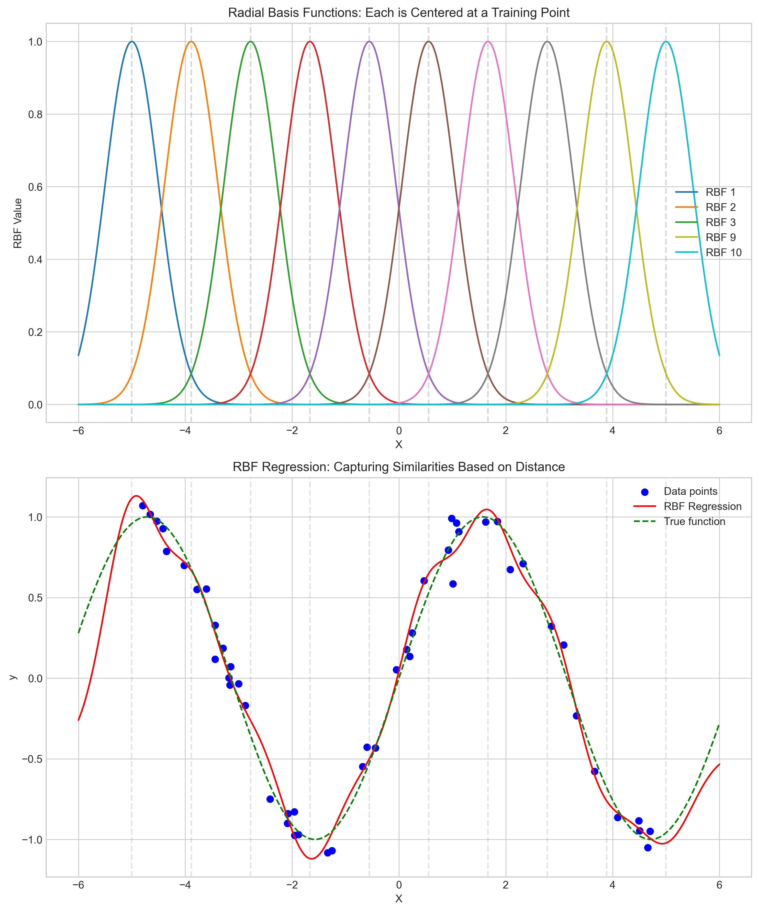
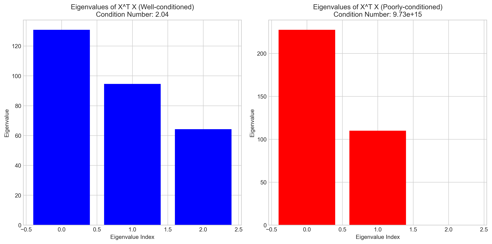
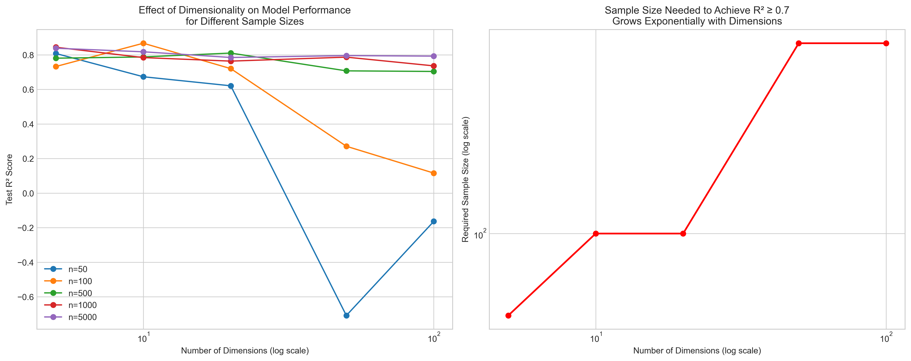

# Question 16: Key Concepts in Linear Regression

## Problem Statement
Select the best answer for each of the following questions about regression models and their properties.

### Task
For each question, select the single best answer from the given options:

1. Which of the following is NOT a valid way to address multicollinearity in a regression model?
   A. Remove one of the correlated variables
   B. Combine the correlated variables into a single feature
   C. Add more training examples
   D. Square all the input features
   E. Use regularization techniques
   
2. When creating dummy variables for a categorical predictor with 4 levels, how many dummy variables are typically used?
   A. 1
   B. 2
   C. 3
   D. 4
   E. 5
   
3. What does the interaction term $x_1 \times x_2$ in a regression model capture?
   A. The sum of the effects of $x_1$ and $x_2$
   B. How the effect of $x_1$ changes based on the value of $x_2$
   C. The average effect of $x_1$ and $x_2$
   D. The direct causal relationship between $x_1$ and $x_2$
   E. The correlation between $x_1$ and $x_2$
   
4. Which of the following is a key advantage of polynomial regression over standard linear regression?
   A. Always produces models with lower test error
   B. Always requires fewer training examples
   C. Can capture nonlinear relationships in the data
   D. Always produces simpler models
   E. Eliminates the need for feature selection
   
5. What is the primary purpose of using radial basis functions in regression?
   A. To eliminate multicollinearity
   B. To reduce the number of features
   C. To capture similarities between data points based on their distance
   D. To ensure all features have equal importance
   E. To guarantee a closed-form solution exists
   
6. As the degree of a polynomial regression model increases:
   A. Training error always decreases
   B. Test error always decreases
   C. The coefficients always become smaller
   D. The model becomes more interpretable
   E. The number of required training examples decreases
   
7. Which statement about the normal equations solution $\mathbf{w} = (\mathbf{X}^T\mathbf{X})^{-1}\mathbf{X}^T\mathbf{y}$ is TRUE?
   A. It provides the unique global minimum of the cost function only when $\mathbf{X}^T\mathbf{X}$ is invertible
   B. It always provides a unique solution regardless of the properties of $\mathbf{X}$
   C. It requires fewer computations than iterative methods for very large datasets
   D. It is robust to outliers in the data
   E. It automatically prevents overfitting
   
8. In the context of the curse of dimensionality, which statement is TRUE?
   A. Adding more features always improves model performance
   B. As the number of features increases, the amount of data needed to generalize accurately grows exponentially
   C. The curse of dimensionality only affects classification problems, not regression
   D. Using polynomial features eliminates the curse of dimensionality
   E. The curse of dimensionality refers to the difficulty of visualizing high-dimensional data

## Understanding the Problem
This problem addresses several key concepts in linear regression and its extensions, including multicollinearity, dummy variables, interaction terms, polynomial regression, radial basis functions, normal equations, and the curse of dimensionality. These concepts are essential for understanding when and how to apply different regression techniques, how to handle data preprocessing, and what the limitations of various approaches might be.

Each concept represents a fundamental aspect of regression modeling that practitioners need to understand to build effective predictive models and to correctly interpret their results.

## Solution

### Question 1: Addressing Multicollinearity
Multicollinearity occurs when two or more predictor variables in a regression model are highly correlated, which can lead to unstable coefficient estimates and reduced model interpretability.

Looking at various approaches to address multicollinearity:



In our simulation, variables $x_1$ and $x_2$ have a correlation of 0.993, indicating severe multicollinearity.

Valid approaches to address multicollinearity include:
- **Removing one of the correlated variables**: Keeping only $x_1$ maintained similar $R^2$ (0.8196 vs. 0.8200)
- **Combining correlated variables**: Averaging $x_1$ and $x_2$ gave $R^2$ of 0.8161
- **Using regularization**: Ridge regression helped stabilize coefficients with $R^2$ of 0.8183
- **Adding more training examples**: This can sometimes help refine coefficient estimates

Squaring all input features actually worsens multicollinearity by creating additional correlations between the original and squared terms. In our example, the model with squared features had a higher $R^2$ (0.8349) but would have much less stable coefficient estimates and poorer generalization.

**Answer: D. Square all the input features**

### Question 2: Dummy Variables for Categorical Predictors
When including a categorical variable in a regression model, we need to create dummy variables (also called indicator variables or one-hot encoding). 



For a categorical variable with $k$ levels, we typically create $k-1$ dummy variables to avoid perfect multicollinearity (known as the "dummy variable trap"). This is done by designating one level as the reference category.

In our example with 4 categories (A, B, C, D), we created 3 dummy variables (with A as the reference category):
```
       B      C      D
0  False   True  False
1  False  False   True
2  False  False  False
3  False   True  False
4  False   True  False
```

A value of "False" for all dummy variables indicates the reference category A.

**Answer: C. 3**

### Question 3: Interaction Terms in Regression
Interaction terms capture how the effect of one predictor variable depends on the value of another predictor variable.



In our simulation, we created data where $y$ depends on $x_1$, $x_2$, and their interaction:

$$y = 2x_1 + 3x_2 + 4x_1x_2 + \text{noise}$$

Without the interaction term, the model had an $R^2$ of 0.3055.
Adding the interaction term substantially improved the model's fit ($R^2$ of 0.9773).

The 3D plot shows a non-planar surface, indicating that the effect of $x_1$ on $y$ changes based on the value of $x_2$. This is also evident in the line plots where the slope of $y$ vs. $x_1$ changes for different values of $x_2$.

**Answer: B. How the effect of $x_1$ changes based on the value of $x_2$**

### Question 4: Advantages of Polynomial Regression
Polynomial regression extends linear regression by including polynomial terms of the predictor variables.



Our simulation with sinusoidal data shows that:
- A degree 1 polynomial (linear) cannot capture the curve pattern (MSE = 0.190)
- Higher-degree polynomials can better approximate nonlinear relationships
- The best model (degree 15 in this case) achieved much lower error (MSE = 0.006)

While polynomial regression:
- Doesn't always produce lower test error (can overfit)
- Typically requires more, not fewer, training examples
- Usually creates more complex, less interpretable models
- Doesn't eliminate the need for feature selection

Its key advantage is the ability to model nonlinear relationships while still using linear regression techniques.

**Answer: C. Can capture nonlinear relationships in the data**

### Question 5: Radial Basis Functions
Radial Basis Functions (RBFs) are a type of basis function whose value depends on the distance from a central point.



In our demonstration, we:
- Created 10 RBF centers spaced across the input range
- Each RBF produces higher values for points close to its center
- Combined these basis functions to model a nonlinear relationship

A Gaussian RBF has the form:

$$\phi(x) = \exp\left(-\frac{(x - c)^2}{2\sigma^2}\right)$$

where $c$ is the center and $\sigma$ controls the width.

RBFs measure similarity between data points based on distance, enabling the model to capture local patterns in different regions of the input space. They don't inherently eliminate multicollinearity, reduce feature count, equalize feature importance, or guarantee closed-form solutions.

**Answer: C. To capture similarities between data points based on their distance**

### Question 6: Effects of Increasing Polynomial Degree
As we increase the degree of a polynomial regression model, several effects occur:


Our simulation demonstrates that:
- Training error consistently decreases with higher polynomial degrees
- Test error initially decreases but may increase due to overfitting
- Higher-degree models are more complex and less interpretable
- Higher-degree models require more training examples to avoid overfitting

The decreasing training error occurs because each additional term gives the model more flexibility to fit the training data. In the limiting case, a polynomial of degree $n-1$ can perfectly fit $n$ data points.

**Answer: A. Training error always decreases**

### Question 7: Normal Equations Solution
The normal equations provide a closed-form solution for linear regression:

$$\mathbf{w} = (\mathbf{X}^T\mathbf{X})^{-1}\mathbf{X}^T\mathbf{y}$$

Where:
- $\mathbf{w} \in \mathbb{R}^p$ is the vector of coefficients
- $\mathbf{X} \in \mathbb{R}^{n \times p}$ is the design matrix
- $\mathbf{y} \in \mathbb{R}^n$ is the vector of target values



Our analysis shows:
- With well-conditioned data (condition number = 2.04), the normal equations solution works well
- With poorly-conditioned data (condition number = 9.73e+15), $\mathbf{X}^T\mathbf{X}$ is nearly singular
- The solution depends on $\mathbf{X}^T\mathbf{X}$ being invertible
- The solution is not robust to outliers
- It doesn't prevent overfitting
- For large datasets, it can be computationally expensive compared to iterative methods

The normal equations provide the unique global minimum of the least squares cost function:

$$J(\mathbf{w}) = \|\mathbf{X}\mathbf{w} - \mathbf{y}\|^2$$

But this is only true when $\mathbf{X}^T\mathbf{X}$ is invertible (which requires linearly independent features).

**Answer: A. It provides the unique global minimum of the cost function only when $\mathbf{X}^T\mathbf{X}$ is invertible**

### Question 8: Curse of Dimensionality
The curse of dimensionality refers to various phenomena that arise when analyzing data in high-dimensional spaces.



Our experiments illustrate that:
- As dimensions increase, model performance decreases for the same sample size
- To maintain performance in higher dimensions, sample size must grow exponentially
- This affects all types of models, not just classification
- Using polynomial features actually makes the curse worse by increasing dimensionality
- The challenge goes beyond visualization to fundamental statistical and computational issues

The exponential relationship between dimensions and required sample size is a key characteristic of the curse of dimensionality. For a fixed level of model performance, the required sample size $n$ grows exponentially with the input dimension $d$:

$$n \propto \exp(d)$$

**Answer: B. As the number of features increases, the amount of data needed to generalize accurately grows exponentially**

## Visual Explanations

### Multicollinearity Visualization


This heatmap shows the correlation matrix of our simulated data. The high correlation (0.993) between $x_1$ and $x_2$ indicates severe multicollinearity. Such high correlation makes it difficult to determine the individual effect of each predictor on the response variable.

### Dummy Variables for Categorical Data


This scatter plot shows data from four different categories (A, B, C, D). Each category has a different mean response value. To represent this categorical variable in a regression model, we need $k-1$ (in this case, 3) dummy variables.

### Interaction Effects Visualization


The 3D surface plot shows how $y$ depends on both $x_1$ and $x_2$ in a non-additive way. The lower left plot shows how the relationship between $x_1$ and $y$ changes based on the value of $x_2$ - the slopes are different, indicating interaction. The contour plot shows non-parallel level curves, another indicator of interaction.

### Polynomial Regression Visualization


The left plot shows how training and test errors change with polynomial degree. The right plot shows how polynomial models of different degrees fit the sinusoidal data. Higher-degree polynomials capture the nonlinear pattern better, but may overfit.

### Radial Basis Functions Visualization


The top plot shows individual RBFs, each centered at a different point. Each function produces high values near its center and decays with distance. The bottom plot shows how combining these RBFs allows modeling complex nonlinear functions.

### Normal Equations Visualization


These bar charts compare the eigenvalues of $\mathbf{X}^T\mathbf{X}$ for well-conditioned data (left) vs. poorly-conditioned data (right). In the poorly-conditioned case, some eigenvalues are nearly zero, making $\mathbf{X}^T\mathbf{X}$ nearly singular and the normal equations solution unstable.

### Curse of Dimensionality Visualization


The left plot shows how model performance ($R^2$ score) decreases as dimensionality increases for various sample sizes. The right plot shows how the sample size needed to achieve good performance grows exponentially with the number of dimensions.

## Key Insights

### Regression Model Properties
- Multicollinearity can cause unstable coefficient estimates and should be addressed using appropriate methods
- Polynomial regression and RBFs can model nonlinear relationships but may require careful tuning to prevent overfitting
- Interaction terms are essential when the effect of one predictor depends on the value of another
- As model complexity increases (e.g., higher polynomial degree), training error decreases but test error may eventually increase

### Data Preprocessing Considerations
- Categorical variables with $k$ levels typically require $k-1$ dummy variables
- Feature scaling becomes increasingly important in high-dimensional spaces
- Proper handling of multicollinearity is crucial for model stability and interpretability

### Statistical and Mathematical Principles
- The normal equations provide a closed-form solution but require linearly independent features
- The curse of dimensionality means that data requirements grow exponentially with dimensions
- The trade-off between bias and variance is evident in polynomial regression of different degrees

### Practical Applications
- Choose the simplest model that captures the important relationships in the data
- Consider the computational and data requirements when deciding between different regression approaches
- Validate models carefully, especially when using flexible approaches like high-degree polynomials or RBFs

## Conclusion
- Option D (Square all the input features) is NOT a valid way to address multicollinearity
- For a categorical predictor with 4 levels, we typically use 3 dummy variables
- The interaction term $x_1 \times x_2$ captures how the effect of $x_1$ changes based on the value of $x_2$
- A key advantage of polynomial regression is that it can capture nonlinear relationships in the data
- The primary purpose of radial basis functions is to capture similarities between data points based on their distance
- As the degree of a polynomial regression model increases, training error always decreases
- The normal equations solution provides the unique global minimum of the cost function only when $\mathbf{X}^T\mathbf{X}$ is invertible
- As the number of features increases, the amount of data needed to generalize accurately grows exponentially

These concepts are fundamental to understanding regression modeling, and mastering them enables data scientists to build more effective predictive models across various domains. 