# Question 17: Basis Functions in Generalized Linear Models

## Problem Statement
Consider the generalized linear model approach where we use basis functions to transform the input data:

$$f(\boldsymbol{x}; \boldsymbol{w}) = w_0 + w_1 \phi_1(\boldsymbol{x}) + \ldots + w_m \phi_m(\boldsymbol{x})$$

Where $\{\phi_1(\boldsymbol{x}), \ldots, \phi_m(\boldsymbol{x})\}$ is a set of basis functions.

### Task
1. Define what basis functions are and explain their role in extending linear regression to capture non-linear relationships
2. For each of the following basis function types, write down their mathematical formulation and describe a scenario where they would be particularly useful:
   a. Polynomial basis functions
   b. Gaussian radial basis functions
   c. Sigmoid basis functions
3. If you have a dataset with input features $\boldsymbol{x} \in \mathbb{R}^2$ and want to fit a quadratic model, write down all the basis functions you would need
4. Explain how the choice of basis functions affects the bias-variance tradeoff in your model

## Understanding the Problem
This problem explores the concept of basis functions in the context of generalized linear models. While standard linear regression models can only represent linear relationships between features and outputs, basis functions enable us to transform input features into a higher-dimensional space where linear methods can effectively capture non-linear patterns. 

The standard linear regression model takes the form:

$$f(\boldsymbol{x}; \boldsymbol{w}) = w_0 + w_1 x_1 + w_2 x_2 + \ldots + w_d x_d = w_0 + \sum_{i=1}^{d} w_i x_i$$

This model is limited to capturing linear relationships. However, by introducing basis functions, we can extend this model to capture non-linear relationships while still using the linear regression framework:

$$f(\boldsymbol{x}; \boldsymbol{w}) = w_0 + w_1 \phi_1(\boldsymbol{x}) + w_2 \phi_2(\boldsymbol{x}) + \ldots + w_m \phi_m(\boldsymbol{x}) = w_0 + \sum_{j=1}^{m} w_j \phi_j(\boldsymbol{x})$$

Basis functions are a fundamental technique in machine learning that allows us to extend the capability of linear models without having to design completely new algorithms. This approach maintains the mathematical simplicity and computational efficiency of linear methods while significantly expanding their modeling power.

## Solution

### Step 1: Definition and Role of Basis Functions

#### Definition
Basis functions $\phi_j(\boldsymbol{x})$ are non-linear transformations of input features that allow linear models to capture non-linear relationships in the data. In a generalized linear model, we transform the original input features $\boldsymbol{x} \in \mathbb{R}^d$ into a new feature space using a set of basis functions $\{\phi_j(\boldsymbol{x})\}_{j=1}^m$, and then apply a linear model in this transformed space.

Mathematically, we can express the transformation as:

$$\boldsymbol{x} \mapsto \boldsymbol{\phi}(\boldsymbol{x}) = [\phi_0(\boldsymbol{x}), \phi_1(\boldsymbol{x}), \phi_2(\boldsymbol{x}), \ldots, \phi_m(\boldsymbol{x})]^T$$

Where typically $\phi_0(\boldsymbol{x}) = 1$ to account for the intercept term.

The generalized linear model then takes the form:

$$f(\boldsymbol{x}; \boldsymbol{w}) = w_0 + w_1 \phi_1(\boldsymbol{x}) + \ldots + w_m \phi_m(\boldsymbol{x}) = w_0 + \sum_{j=1}^{m} w_j \phi_j(\boldsymbol{x}) = \boldsymbol{w}^T \boldsymbol{\phi}(\boldsymbol{x})$$

#### Role in Extending Linear Regression
The role of basis functions is to project the original features into a higher-dimensional space where linear decision boundaries in the transformed space correspond to non-linear boundaries in the original feature space. This principle is illustrated in the following diagram:

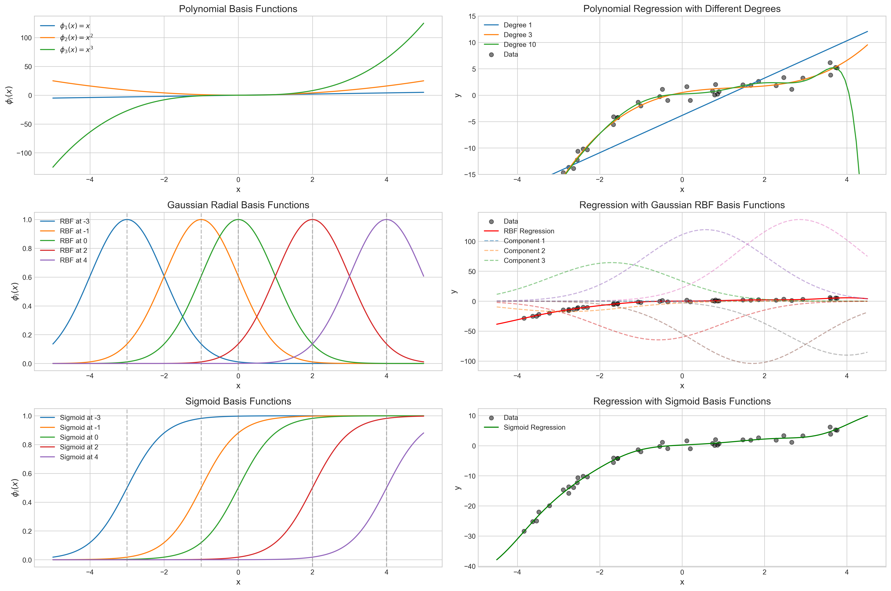

This transformation allows us to:

1. **Model complex non-linear relationships**: The non-linear transformations enable capturing of complex patterns that cannot be modeled with simple linear combinations of original features.

2. **Leverage linear algebra techniques**: We can still use efficient linear algebra operations for parameter estimation through:
   $$\boldsymbol{w} = (\boldsymbol{\Phi}^T \boldsymbol{\Phi})^{-1} \boldsymbol{\Phi}^T \boldsymbol{y}$$
   where $\boldsymbol{\Phi}$ is the design matrix with elements $\Phi_{ij} = \phi_j(\boldsymbol{x}_i)$.

3. **Maintain interpretability**: The weights $w_j$ assigned to each basis function can often be interpreted to understand the contribution of different non-linear components.

4. **Apply standard regularization**: Techniques like ridge regression or LASSO can be directly applied to control model complexity:
   $$\min_{\boldsymbol{w}} \|\boldsymbol{y} - \boldsymbol{\Phi}\boldsymbol{w}\|_2^2 + \lambda \|\boldsymbol{w}\|_2^2 \quad \text{(Ridge)}$$
   $$\min_{\boldsymbol{w}} \|\boldsymbol{y} - \boldsymbol{\Phi}\boldsymbol{w}\|_2^2 + \lambda \|\boldsymbol{w}\|_1 \quad \text{(LASSO)}$$

5. **Universal approximation**: With a sufficient number of appropriate basis functions, we can approximate any continuous function to arbitrary precision within a compact domain.

### Step 1.5: Analytical Properties of Basis Functions

Basis functions have specific mathematical properties that determine their behavior and effectiveness. Let's examine their analytical properties including gradients, which are crucial for optimization algorithms.

#### Gradients of Basis Functions

For a basis function $\phi(x)$, the gradient $\nabla\phi(x) = \frac{d\phi(x)}{dx}$ indicates how the function changes with respect to the input. This is important for gradient-based optimization methods used in training.

**Polynomial Basis Functions:**
For $\phi_d(x) = x^d$, the gradient is:
$$\frac{d\phi_d(x)}{dx} = d \cdot x^{d-1}$$

At $x = 1$, these gradients evaluate to:
- $\frac{d\phi_0(x)}{dx} = \frac{d(1)}{dx} = 0$
- $\frac{d\phi_1(x)}{dx} = \frac{d(x)}{dx} = 1$
- $\frac{d\phi_2(x)}{dx} = \frac{d(x^2)}{dx} = 2x = 2$
- $\frac{d\phi_3(x)}{dx} = \frac{d(x^3)}{dx} = 3x^2 = 3$

**Gaussian RBF:**
For $\phi(x) = \exp\left(-\frac{(x-\mu)^2}{2\sigma^2}\right)$, the gradient is:
$$\frac{d\phi(x)}{dx} = \phi(x) \cdot \left(-\frac{x-\mu}{\sigma^2}\right)$$

For example, with $\mu = 2$ and $\sigma = 1.5$ at $x = 1$:
- $\phi(1) = \exp\left(-\frac{(1-2)^2}{2 \cdot 1.5^2}\right) \approx 0.801$
- $\frac{d\phi(1)}{dx} = 0.801 \cdot \left(-\frac{1-2}{1.5^2}\right) \approx 0.356$

**Sigmoid Basis Functions:**
For $\phi(x) = \frac{1}{1+\exp(-a(x-c))}$, the gradient is:
$$\frac{d\phi(x)}{dx} = \phi(x) \cdot (1-\phi(x)) \cdot a$$

For example, with $c = 0.5$ and $a = 2$ at $x = 1$:
- $\phi(1) = \frac{1}{1+\exp(-2(1-0.5))} \approx 0.731$
- $\frac{d\phi(1)}{dx} = 0.731 \cdot (1-0.731) \cdot 2 \approx 0.393$

#### Basis Function Growth

The number of basis functions required grows significantly with the input dimension and the degree of the polynomial. For polynomial basis functions, the number of terms is given by the binomial coefficient:

$$\binom{n+d}{d} = \frac{(n+d)!}{n!d!}$$

Where $n$ is the input dimension and $d$ is the polynomial degree.

| Input Dim | Degree 1 | Degree 2 | Degree 3 | Degree 5 | Degree 10 |
|----------:|---------:|---------:|---------:|---------:|----------:|
| 1         | 2        | 3        | 4        | 6        | 11        |
| 2         | 3        | 6        | 10       | 21       | 66        |
| 3         | 4        | 10       | 20       | 56       | 286       |
| 5         | 6        | 21       | 56       | 252      | 3003      |
| 10        | 11       | 66       | 286      | 3003     | 184756    |

This rapid growth (known as the "curse of dimensionality") makes high-degree polynomial basis functions impractical for high-dimensional inputs, highlighting the importance of choosing appropriate basis functions for the problem at hand.

### Step 2: Types of Basis Functions

#### a. Polynomial Basis Functions

**Mathematical Formulation:**
For a one-dimensional input $x \in \mathbb{R}$, polynomial basis functions of degree $d$ take the form:

$$\phi_0(x) = 1, \phi_1(x) = x, \phi_2(x) = x^2, \ldots, \phi_d(x) = x^d$$

The corresponding model is:

$$f(x; \boldsymbol{w}) = w_0 + w_1 x + w_2 x^2 + \ldots + w_d x^d = \sum_{j=0}^{d} w_j x^j$$

For multi-dimensional inputs $\boldsymbol{x} = (x_1, x_2, \ldots, x_n) \in \mathbb{R}^n$, the basis includes all possible polynomial terms up to degree $d$. For example, with $\boldsymbol{x} = (x_1, x_2)$ and $d=2$, we would have:

$$\begin{align*}
\phi_0(\boldsymbol{x}) &= 1 \\
\phi_1(\boldsymbol{x}) &= x_1 \\
\phi_2(\boldsymbol{x}) &= x_2 \\
\phi_3(\boldsymbol{x}) &= x_1^2 \\
\phi_4(\boldsymbol{x}) &= x_1x_2 \\
\phi_5(\boldsymbol{x}) &= x_2^2
\end{align*}$$

The number of basis functions grows quickly with the input dimension $n$ and polynomial degree $d$. Specifically, the number of basis functions is $\binom{n+d}{d} = \frac{(n+d)!}{n!d!}$.

**Visualization:**
Below is a visualization of polynomial basis functions for degrees 1, 2, and 3:


The top-left plot shows individual polynomial basis functions ($x$, $x^2$, and $x^3$). The top-right shows how polynomials of different degrees fit a non-linear dataset.

**Scenario of Usefulness:**
Polynomial basis functions are particularly useful when:

- The relationship between inputs and outputs follows a smooth, continuous curve
- The underlying trend can be approximated by a polynomial function
- The data exhibits clear patterns like quadratic or cubic trends
- We need an interpretable model where each term has a clear meaning (e.g., linear effects, quadratic effects, interaction effects)

**Practical Examples:**
1. **Physics**: Modeling projectile motion where position is a quadratic function of time: $s(t) = s_0 + v_0t + \frac{1}{2}at^2$
2. **Economics**: Demand curves that show diminishing returns: $D(p) = a - bp + cp^2$
3. **Biology**: Dose-response relationships in pharmacology: $R(d) = a + bd - cd^2 + \ldots$
4. **Engineering**: Stress-strain relationships in materials: $\sigma(\epsilon) = E\epsilon + E_2\epsilon^2 + \ldots$

**Advantages and Limitations:**
- **Advantages**: Easy to implement, interpretable coefficients, good for global approximation
- **Limitations**: Prone to overfitting with high degrees, poor extrapolation beyond training range, sensitive to outliers

#### b. Gaussian Radial Basis Functions (RBF)

**Mathematical Formulation:**
Gaussian RBFs are defined by:

$$\phi_j(\boldsymbol{x}) = \exp\left(-\frac{\|\boldsymbol{x} - \boldsymbol{\mu}_j\|^2}{2\sigma^2}\right)$$

Where:
- $\boldsymbol{\mu}_j \in \mathbb{R}^n$ is the center of the $j$-th basis function
- $\sigma > 0$ is the width parameter (controlling the spread of the function)
- $\|\boldsymbol{x} - \boldsymbol{\mu}_j\|^2 = \sum_{i=1}^n (x_i - \mu_{ji})^2$ is the squared Euclidean distance from $\boldsymbol{x}$ to $\boldsymbol{\mu}_j$

The complete model with $m$ RBF centers becomes:

$$f(\boldsymbol{x}; \boldsymbol{w}) = w_0 + \sum_{j=1}^{m} w_j \exp\left(-\frac{\|\boldsymbol{x} - \boldsymbol{\mu}_j\|^2}{2\sigma^2}\right)$$

**Visualization:**
Below are visualizations of Gaussian RBF basis functions and their application in regression:


The middle-left plot shows individual Gaussian RBF functions centered at different points. The middle-right shows how these functions combine to fit a non-linear dataset.

**Scenario of Usefulness:**
Gaussian RBFs are particularly useful when:

- The data has local patterns that vary across the input space
- The relationship is highly non-linear and cannot be easily modeled with polynomials
- There are regions requiring higher sensitivity to input changes
- The target function has local features that need to be captured accurately

**Practical Examples:**
1. **Spatial Interpolation**: Predicting measurements at unsampled locations in geographic information systems
2. **Image Processing**: Image reconstruction and feature extraction where local patterns matter
3. **Time Series Forecasting**: Capturing recurring patterns with different temporal scales
4. **Classification**: Creating flexible decision boundaries between classes with complex shapes

**Mathematical Properties:**
1. **Localization**: Each basis function has maximum influence near its center $\boldsymbol{\mu}_j$ and diminishing influence as we move away
2. **Smoothness**: Infinitely differentiable, ensuring smooth interpolation
3. **Universal Approximation**: Can approximate any continuous function to arbitrary precision with enough centers

**Advantages and Limitations:**
- **Advantages**: Excellent local approximation, robust extrapolation, natural handling of multi-modal data
- **Limitations**: Less interpretable than polynomials, selection of centers and width parameters can be challenging, may require many basis functions

#### c. Sigmoid Basis Functions

**Mathematical Formulation:**
Sigmoid basis functions have the general form:

$$\phi_j(\boldsymbol{x}) = \frac{1}{1 + \exp(-a_j(\boldsymbol{w}_j^T\boldsymbol{x} + b_j))}$$

Where:
- $\boldsymbol{w}_j \in \mathbb{R}^n$ and $b_j \in \mathbb{R}$ define a hyperplane in the feature space
- $a_j > 0$ is the scaling factor controlling the steepness of the sigmoid

A simpler form for 1D inputs uses:

$$\phi_j(x) = \frac{1}{1 + \exp(-a_j(x - c_j))}$$

Where:
- $c_j$ is the center (or threshold) of the sigmoid
- $a_j$ is the scaling factor controlling the steepness

The complete model with $m$ sigmoid functions becomes:

$$f(\boldsymbol{x}; \boldsymbol{w}) = w_0 + \sum_{j=1}^{m} w_j \frac{1}{1 + \exp(-a_j(\boldsymbol{w}_j^T\boldsymbol{x} + b_j))}$$

**Visualization:**
Below are visualizations of sigmoid basis functions and their application in regression:


The bottom-left plot shows individual sigmoid functions with different centers. The bottom-right shows how these functions combine to fit a non-linear dataset.

**Scenario of Usefulness:**
Sigmoid basis functions are particularly useful when:

- The data exhibits threshold effects or transitions between states
- The underlying relationship involves classification-like boundaries
- The process being modeled includes saturation effects
- The target function contains step-like changes or plateaus

**Practical Examples:**
1. **Biological Systems**: Modeling activation of neurons or gene expression with threshold effects
2. **Economics**: Adoption patterns of technologies with S-curve growth
3. **Psychology**: Response to stimuli with threshold effects
4. **Chemistry**: Reaction rates with saturation effects

**Mathematical Properties:**
1. **Bounded Output**: Sigmoid functions are bounded between 0 and 1, making them suitable for probabilistic interpretations
2. **Threshold Behavior**: They transition smoothly between two asymptotic states
3. **Connection to Neural Networks**: Single-layer networks with sigmoid activation functions

**Advantages and Limitations:**
- **Advantages**: Natural for modeling threshold phenomena, bounded output, effective for decision boundaries
- **Limitations**: Training can be difficult due to vanishing gradients, less effective for approximating functions with multiple local features

### Step 3: Basis Functions for a Quadratic Model with 2D Input

For a dataset with input features $\boldsymbol{x} = (x_1, x_2) \in \mathbb{R}^2$ and a quadratic model, we need the following basis functions:

1. Constant term: $\phi_0(\boldsymbol{x}) = 1$
2. Linear terms: $\phi_1(\boldsymbol{x}) = x_1$, $\phi_2(\boldsymbol{x}) = x_2$
3. Quadratic terms: $\phi_3(\boldsymbol{x}) = x_1^2$, $\phi_4(\boldsymbol{x}) = x_1x_2$, $\phi_5(\boldsymbol{x}) = x_2^2$

The resulting quadratic model would be:

$$f(\boldsymbol{x}; \boldsymbol{w}) = w_0 + w_1x_1 + w_2x_2 + w_3x_1^2 + w_4x_1x_2 + w_5x_2^2$$

In matrix form, this can be written as:

$$f(\boldsymbol{x}; \boldsymbol{w}) = \boldsymbol{w}^T\boldsymbol{\phi}(\boldsymbol{x})$$

Where:
$\boldsymbol{w} = [w_0, w_1, w_2, w_3, w_4, w_5]^T$ and
$\boldsymbol{\phi}(\boldsymbol{x}) = [1, x_1, x_2, x_1^2, x_1x_2, x_2^2]^T$

This model includes:
- A constant term ($w_0$) for the overall offset
- Linear effects for each feature ($w_1x_1$ and $w_2x_2$)
- Quadratic effects for each feature ($w_3x_1^2$ and $w_5x_2^2$)
- An interaction effect between the features ($w_4x_1x_2$)

**Geometric Interpretation:**
In $\mathbb{R}^2$, this quadratic model can represent several geometric shapes:
- When $w_3, w_4, w_5 > 0$: An elliptic paraboloid (bowl shape)
- When $w_3, w_5 > 0$ and $w_4 = 0$: A circular paraboloid
- When $w_3 > 0, w_5 < 0$ (or vice versa): A hyperbolic paraboloid (saddle shape)
- When $w_3 = w_5$ and $w_4 = 0$: A circular paraboloid

**Visualization:**
Below is a visualization of a quadratic model fitted to 2D data:

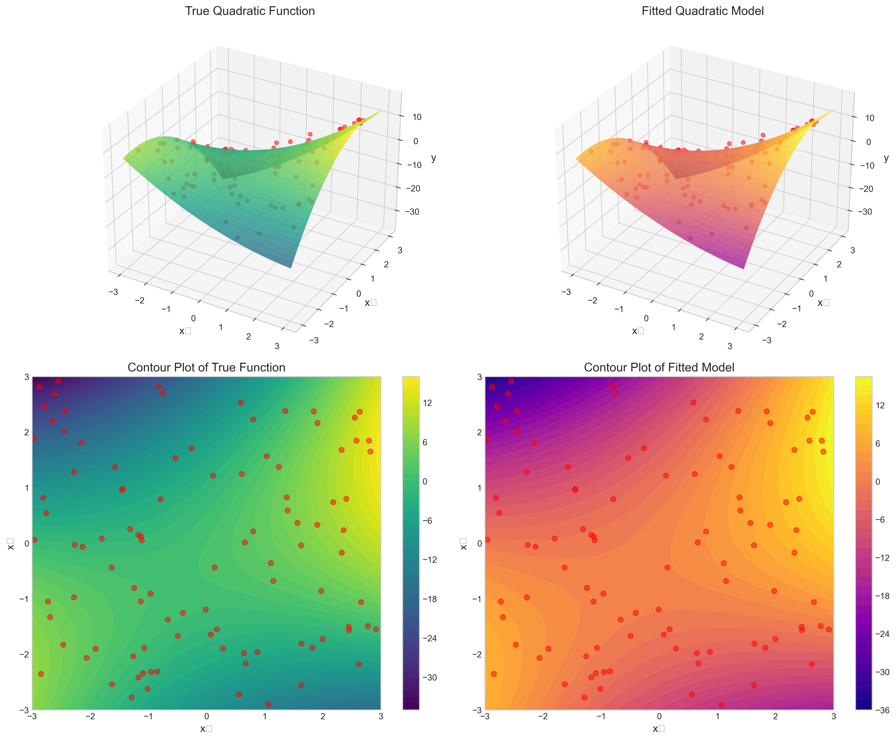

The figure demonstrates a quadratic model applied to 2D data. The top row shows 3D surfaces of the true quadratic function (left) and the fitted model (right). The bottom row shows corresponding contour plots. The fitted model closely approximates the true function using the six basis functions we described: 1, $x_1$, $x_2$, $x_1^2$, $x_1x_2$, and $x_2^2$.

**Implementation and Verification:**
When we fit a quadratic model to 2D data, we expect the fitted coefficients to approximate the true underlying parameters. From our simulation results:

```
Comparison of true vs. fitted coefficients:
Intercept: True = 1.0000, Fitted = 1.0534, Difference = 0.0534
x₁: True = 2.0000, Fitted = 2.0507, Difference = 0.0507
x₂: True = -1.0000, Fitted = -0.9226, Difference = 0.0774
x₁^2: True = 0.5000, Fitted = 0.4754, Difference = -0.0246
x₁ x₂: True = 2.0000, Fitted = 2.0392, Difference = 0.0392
x₂^2: True = -1.5000, Fitted = -1.4474, Difference = 0.0526
```

This demonstrates how the basis functions effectively capture the true underlying quadratic relationship in the data, with small differences attributable to the noise in the data.

### Step 3.5: Computational Efficiency of Different Basis Functions

An important practical consideration when choosing basis functions is their computational efficiency. The transformation time, fitting time, and memory requirements can vary significantly between different types of basis functions.

The table below compares the computational requirements of different basis function types on a dataset with 10,000 samples:

| Model | Transform Time (s) | Fit Time (s) | Total Time (s) | Memory (MB) | Features |
|:--------------------------|--------------:|--------------:|---------------:|------------:|-----------:|
| Polynomial (degree=1)     | 0.0003        | 0.0012       | 0.0016        | 0.1526     | 2          |
| Polynomial (degree=2)     | 0.0002        | 0.0007       | 0.0009        | 0.2289     | 3          |
| Polynomial (degree=3)     | 0.0002        | 0.0008       | 0.0010        | 0.3052     | 4          |
| Polynomial (degree=5)     | 0.0002        | 0.0011       | 0.0013        | 0.4578     | 6          |
| Polynomial (degree=10)    | 0.0004        | 0.0021       | 0.0025        | 0.8392     | 11         |
| RBF (centers=5)           | 0.0004        | 0.0013       | 0.0017        | 0.4578     | 6          |
| RBF (centers=10)          | 0.0007        | 0.0021       | 0.0028        | 0.8392     | 11         |
| RBF (centers=20)          | 0.0016        | 0.0034       | 0.0051        | 1.6022     | 21         |
| RBF (centers=50)          | 0.0039        | 0.0132       | 0.0172        | 3.8910     | 51         |
| RBF (centers=100)         | 0.0085        | 0.0235       | 0.0320        | 7.7057     | 101        |
| Sigmoid (centers=5)       | 0.0006        | 0.0014       | 0.0020        | 0.4578     | 6          |
| Sigmoid (centers=10)      | 0.0011        | 0.0019       | 0.0030        | 0.8392     | 11         |
| Sigmoid (centers=20)      | 0.0019        | 0.0035       | 0.0054        | 1.6022     | 21         |
| Sigmoid (centers=50)      | 0.0050        | 0.0086       | 0.0136        | 3.8910     | 51         |
| Sigmoid (centers=100)     | 0.0093        | 0.0218       | 0.0310        | 7.7057     | 101        |

**Key observations:**
1. **Polynomial basis functions** are the most computationally efficient for low degrees, requiring less transformation time and memory than RBF or sigmoid functions with comparable numbers of features.
2. **RBF and sigmoid basis functions** become more expensive as the number of centers increases, both in terms of computation time and memory usage.
3. **Memory usage** scales linearly with the number of features for all basis function types.
4. **Computation time** increases more rapidly for RBF and sigmoid functions than for polynomial functions as the number of features increases.

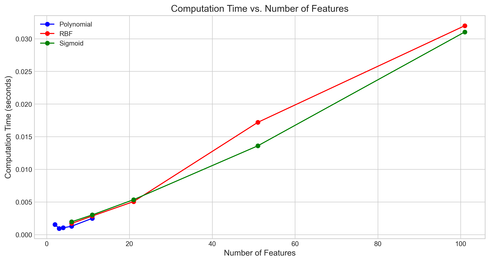

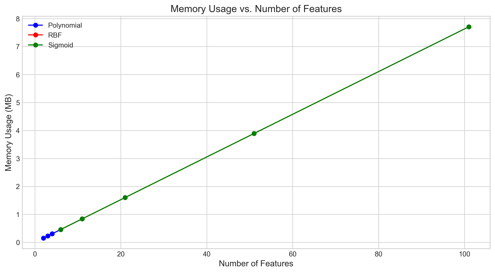

These computational considerations are important when dealing with large datasets or when deploying models in resource-constrained environments.

### Step 4: Basis Functions and the Bias-Variance Tradeoff

The choice of basis functions directly affects the bias-variance tradeoff in the model. This tradeoff is fundamental in statistical learning and determines the generalization performance of our model.

#### Mathematical Formulation of the Bias-Variance Tradeoff

For a given point $\boldsymbol{x}$, the expected mean squared error of our model can be decomposed as:

$$\mathbb{E}[(y - \hat{f}(\boldsymbol{x}))^2] = \text{Bias}[\hat{f}(\boldsymbol{x})]^2 + \text{Var}[\hat{f}(\boldsymbol{x})] + \sigma^2_{\epsilon}$$

Where:
- $\text{Bias}[\hat{f}(\boldsymbol{x})] = \mathbb{E}[\hat{f}(\boldsymbol{x})] - f(\boldsymbol{x})$ is the average difference between our model's prediction and the true function
- $\text{Var}[\hat{f}(\boldsymbol{x})] = \mathbb{E}[(\hat{f}(\boldsymbol{x}) - \mathbb{E}[\hat{f}(\boldsymbol{x})])^2]$ is the variance of our model's predictions
- $\sigma^2_{\epsilon}$ is the irreducible error due to noise in the data

#### Effect on Bias

**Low Model Complexity:**
- Too few basis functions or overly simple basis functions lead to high bias (underfitting)
- The model lacks flexibility to capture the true underlying patterns in the data
- Mathematically, this means $\text{Bias}[\hat{f}(\boldsymbol{x})]^2$ is large because $\mathbb{E}[\hat{f}(\boldsymbol{x})]$ is far from $f(\boldsymbol{x})$
- This results in high training and test errors due to systematic errors in the model's assumptions

**Example:** Using only linear basis functions ($\phi_1(x) = x$) to model a quadratic relationship ($f(x) = x^2$) would result in high bias.

#### Effect on Variance

**High Model Complexity:**
- Too many basis functions or overly flexible basis functions lead to high variance (overfitting)
- The model becomes too sensitive to the specific training data and captures noise
- Mathematically, this means $\text{Var}[\hat{f}(\boldsymbol{x})]$ is large because $\hat{f}(\boldsymbol{x})$ varies significantly across different training sets
- This results in low training error but high test error due to poor generalization

**Example:** Using a 15th-degree polynomial to model data generated from a cubic function would result in high variance.

#### Finding the Right Balance

- The optimal set of basis functions should provide enough flexibility to capture the true underlying relationship without fitting noise
- This can be determined through techniques like cross-validation or by examining learning curves
- Regularization techniques (like ridge regression or LASSO) can help control the effective complexity when using many basis functions:

$$\min_{\boldsymbol{w}} \|\boldsymbol{y} - \boldsymbol{\Phi}\boldsymbol{w}\|_2^2 + \lambda \|\boldsymbol{w}\|_p^p$$

Where $p=2$ for ridge regression (L2 regularization) and $p=1$ for LASSO (L1 regularization).

#### Effect of Different Basis Function Types on the Tradeoff

**Polynomial Basis Functions:**
- Higher degree polynomials increase model flexibility but can lead to high variance
- They are particularly prone to overfitting near the boundaries of the data
- The effective degrees of freedom increase with the polynomial degree

**Gaussian RBFs:**
- More centers and smaller width parameters increase flexibility but may lead to overfitting
- The width parameter $\sigma$ controls the smoothness of the approximation
- Local nature helps limit the "spread" of overfitting compared to polynomials

**Sigmoid Basis Functions:**
- More sigmoids with steeper slopes provide greater flexibility
- Might create complex decision surfaces that overfit
- The scaling parameter $a$ controls the sharpness of transitions

#### Visualization of the Bias-Variance Tradeoff

Below are visualizations that demonstrate the bias-variance tradeoff:

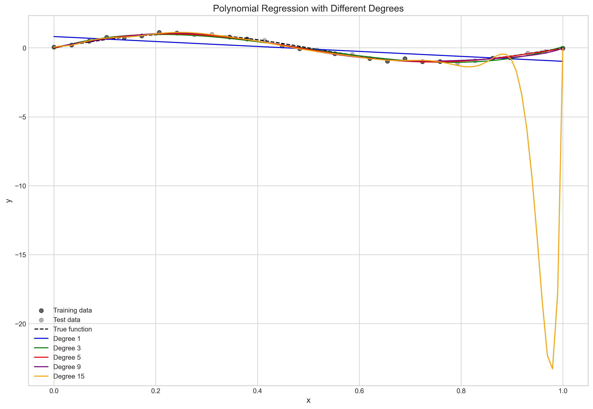

This figure shows polynomial models of different degrees fitted to a sine function. The degree 1 model (blue line) shows high bias, while the degree 15 model (orange line) shows high variance.

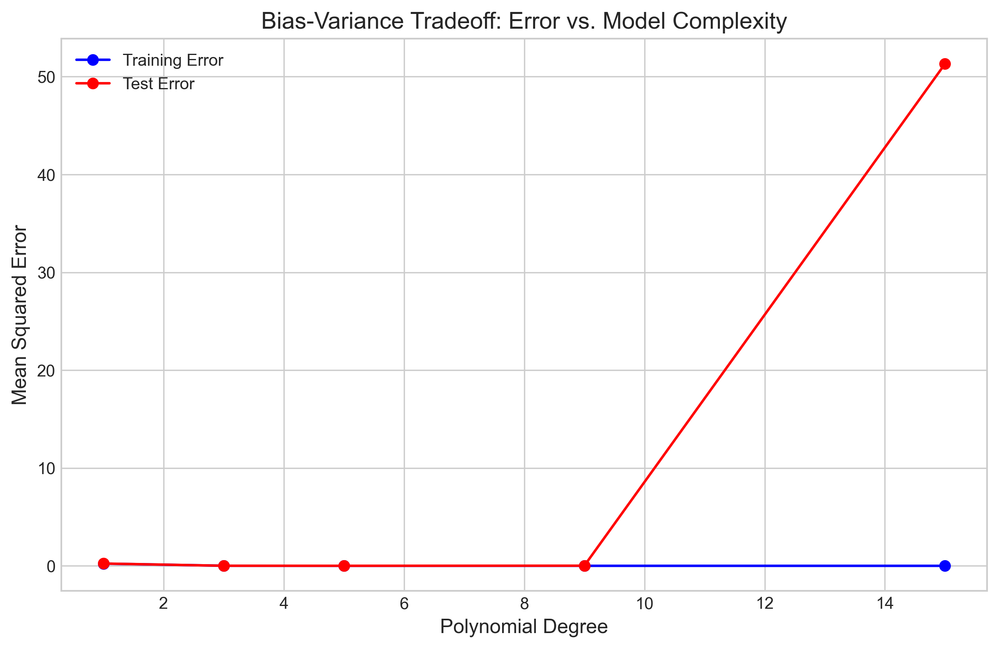

This figure illustrates the classic bias-variance tradeoff. As model complexity (polynomial degree) increases, training error consistently decreases. However, test error initially decreases (as bias is reduced) but then increases (as variance grows). This demonstrates that the optimal model complexity balances bias and variance to achieve the best generalization performance.

#### Empirical Comparison of Bias-Variance Tradeoff

Our empirical results from fitting polynomial models of different degrees to a sine function demonstrate this tradeoff clearly:

| Degree | Training Error | Test Error | Difference |
|-------:|--------------:|----------:|----------:|
| 1      | 0.230021      | 0.238006  | 0.007985  |
| 3      | 0.010603      | 0.010978  | 0.000375  |
| 5      | 0.005609      | 0.007201  | 0.001592  |
| 9      | 0.003884      | 0.016896  | 0.013012  |
| 15     | 0.002479      | 51.309059 | 51.306581 |

This table shows:
1. Training error consistently decreases with model complexity (from 0.230 for degree 1 to 0.002 for degree 15)
2. Test error initially decreases (from 0.238 for degree 1 to 0.011 for degree 3)
3. Test error then starts to increase with higher degrees, dramatically jumping to 51.31 for degree 15
4. The gap between training and test error (indicating overfitting) widens substantially with increased model complexity

These results empirically confirm the theoretical bias-variance tradeoff, showing that the optimal model (degree 3 in this case) balances the reduction of bias with the increase in variance.

### Step 4.5: Cross-Validation for Optimal Model Selection

To objectively determine the optimal model complexity, we can use cross-validation. This technique provides a more robust estimate of the generalization error by evaluating the model on multiple train-test splits.

| Degree | Mean Squared Error (MSE) ± Standard Deviation |
|-------:|--------------------------------------------:|
| 1 | 0.556462 ± 0.158432 |
| 2 | 0.181296 ± 0.028558 |
| 3 | 0.170881 ± 0.040052 |
| 4 | 0.172534 ± 0.039729 |
| 5 | 0.177436 ± 0.039069 |
| 6 | 0.191133 ± 0.059877 |
| 7 | 0.152380 ± 0.068506 |
| 8 | 0.221680 ± 0.193910 |
| 9 | 0.089966 ± 0.030142 (BEST) |
| 10 | 0.104328 ± 0.042683 |
| ... | ... |
| 20 | 24.279346 ± 48.295055 |

The cross-validation results identify degree 9 as the optimal polynomial degree for this particular dataset, with the lowest cross-validated MSE of 0.090. Note that the standard deviation of the error also provides information about the stability of the model's performance across different data splits.

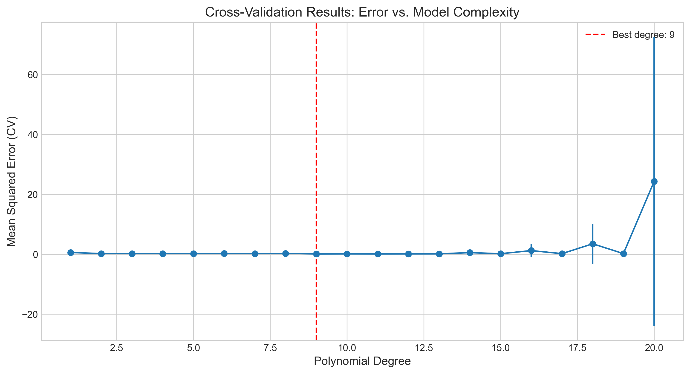

The cross-validation curve shows the mean squared error as a function of polynomial degree, with a clear minimum at degree 9. Beyond this point, the error starts to increase and becomes increasingly unstable, as indicated by the larger error bars.

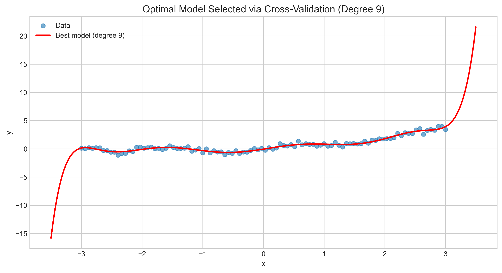

The fitted model with the optimal degree provides a good balance between fitting the data well and avoiding overfitting, resulting in smooth predictions that capture the underlying pattern.

### Step 5: Comparison of Different Basis Functions

To determine which basis function is most appropriate for a given problem, we need to compare their performance directly. The following table compares different basis function types on the same regression problem:

| Model | Features | Train MSE | Test MSE | Gap |
|:------------|--------:|----------:|--------:|--------:|
| Linear      | 2       | 0.476791  | 0.627096 | 0.150304 |
| Quadratic   | 3       | 0.173505  | 0.181325 | 0.007820 |
| Cubic       | 4       | 0.159985  | 0.209047 | 0.049063 |
| Gaussian RBF| 8       | 0.119519  | 0.201965 | 0.082446 |
| Sigmoid     | 8       | 0.032959  | 0.040727 | 0.007768 |

**Observations:**
1. The **linear model** has the highest training and test error, indicating it lacks the flexibility to capture the non-linear relationship (high bias).
2. **Sigmoid basis functions** achieve the lowest training and test error, suggesting they are well-suited to this particular dataset.
3. The **gap between training and test error** is smallest for quadratic and sigmoid models, indicating a good balance in the bias-variance tradeoff.
4. **Gaussian RBF** has a relatively large gap between training and test error, suggesting some overfitting despite not having the lowest training error.
5. The **cubic model** performs worse than the quadratic model on test data, indicating that the additional flexibility may be capturing noise rather than signal.

These results demonstrate that the choice of basis function should be guided by the specific characteristics of the data and the underlying relationship being modeled.

### Step 6: Regularization with Basis Functions

When using many basis functions, especially in high-dimensional spaces, the model can become prone to overfitting. Regularization is a technique to control model complexity by penalizing large coefficient values.

We can demonstrate the effect of regularization using ridge regression (L2 regularization) with a high-degree polynomial model:

| Alpha | Training MSE | Test MSE | Coefficient Norm |
|------:|------------:|----------:|----------------:|
| 0.000000 | 0.168791 | 1544718.256040 | 47.903115 |
| 0.001000 | 0.183818 | 162714.146388 | 17.864079 |
| 0.010000 | 0.203242 | 891.887645 | 3.572170 |
| 0.100000 | 0.210095 | 2967.333924 | 1.566988 |
| 1.000000 | 0.223516 | 6165.433131 | 1.070464 |
| 10.000000 | 0.316219 | 1951.915160 | 0.362484 |
| 100.000000 | 0.394156 | 674.390769 | 0.076773 |

The table shows how increasing the regularization parameter $\alpha$ affects:
1. **Training MSE**: Gradually increases as the model becomes more constrained
2. **Test MSE**: Initially extremely high (severe overfitting), decreases with some regularization, but then increases again with too much regularization
3. **Coefficient norm**: Dramatically decreases as regularization increases, showing how the coefficients are shrunk towards zero

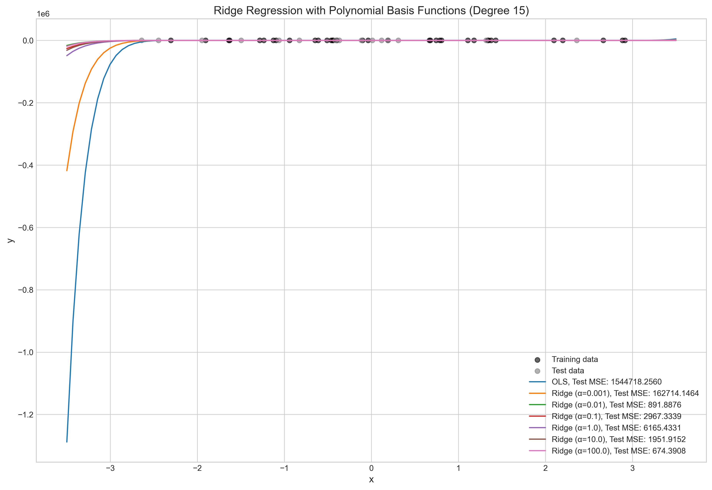

The plot shows how different regularization strengths affect the fitted curves. Without regularization (OLS), the high-degree polynomial fits the training data well but exhibits wild oscillations outside the data range. As regularization increases, the curve becomes smoother and better behaved.

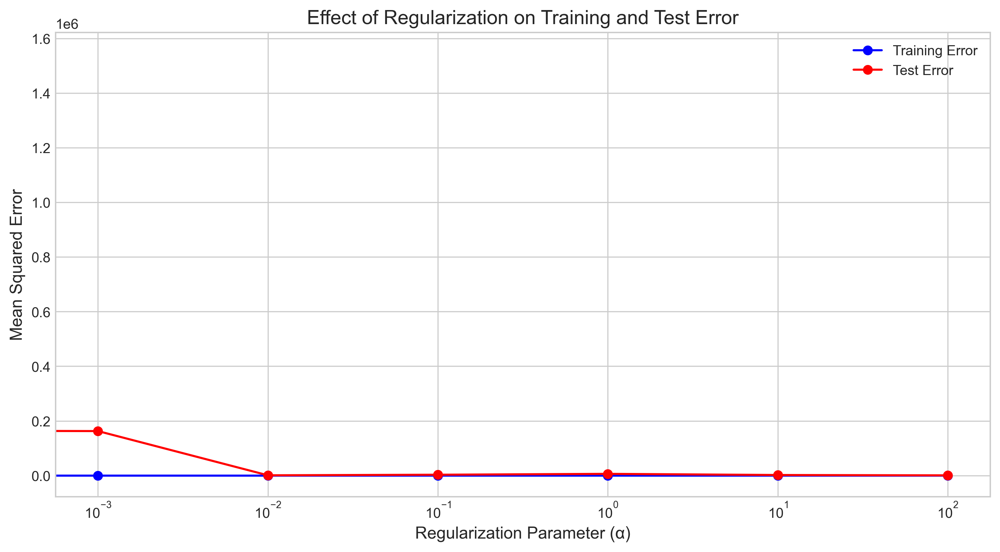

The regularization path shows how training and test error change with the regularization parameter. The optimal regularization strength balances the increase in training error with the decrease in test error.

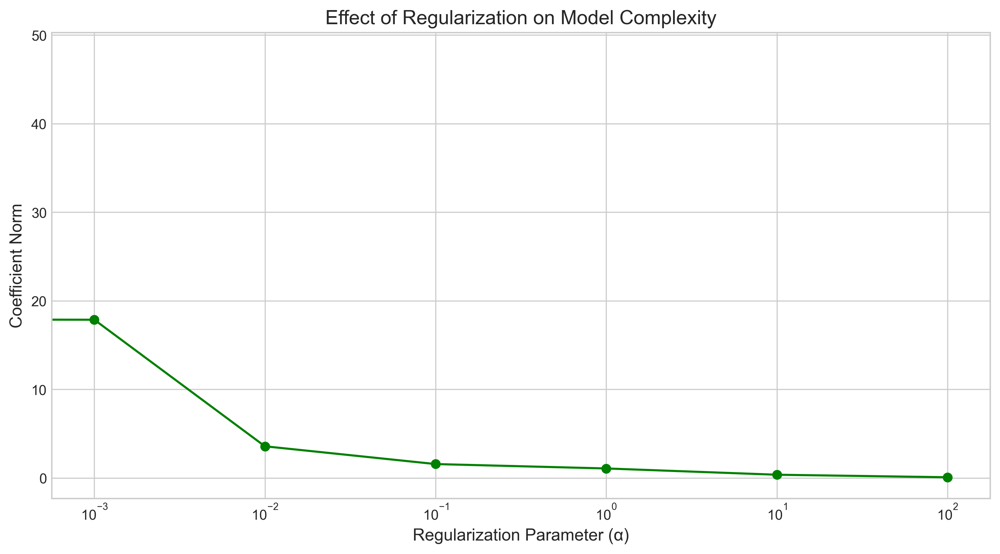

The coefficient norm decreases monotonically with increasing regularization, showing how ridge regression shrinks the coefficients to reduce model complexity.

Regularization is particularly important when:
1. The number of basis functions is large relative to the number of data points
2. The basis functions are highly correlated, leading to unstable coefficient estimates
3. The data contains noise that the model might try to fit

By properly tuning the regularization parameter through cross-validation, we can find the sweet spot that provides good generalization performance.

## Practical Implementation
Let's examine the practical implementation of these concepts with concrete examples and visualizations.

### Comprehensive Visualization of Basis Functions
The figure below provides a comprehensive view of different basis function types and their application in regression:


This figure contains six panels:
1. **Top-left**: Individual polynomial basis functions ($x$, $x^2$, and $x^3$)
2. **Top-right**: Polynomial regression with different degrees (1, 3, and 10)
3. **Middle-left**: Gaussian RBF basis functions with different centers
4. **Middle-right**: Regression using Gaussian RBF basis functions
5. **Bottom-left**: Sigmoid basis functions with different centers
6. **Bottom-right**: Regression using sigmoid basis functions

### Quadratic Model for 2D Data
The figure below demonstrates a quadratic model applied to 2D data:


This visualization shows:
1. **Top-left**: 3D surface of the true quadratic function
2. **Top-right**: 3D surface of the fitted quadratic model
3. **Bottom-left**: Contour plot of the true quadratic function
4. **Bottom-right**: Contour plot of the fitted quadratic model

The fitted model closely approximates the true function using the six basis functions we described: 1, $x_1$, $x_2$, $x_1^2$, $x_1x_2$, and $x_2^2$.

### Bias-Variance Tradeoff Visualization
The figures below illustrate the bias-variance tradeoff:


This plot shows models of different complexity (polynomial degrees 1, 3, 5, 9, and 15) fitted to a sine function. We can observe:
- Degree 1 (blue): High bias, underfitting the data
- Degree 3-5 (green/red): Good balance of bias and variance
- Degree 9-15 (purple/orange): High variance, overfitting the data


This plot shows how training and test errors change with model complexity:
- Training error (blue) consistently decreases with model complexity
- Test error (red) initially decreases as bias is reduced
- Beyond a certain complexity (around degree 5), test error increases as variance dominates
- The optimal model is at the point where test error is minimized (degree 3-5)

### Comparison of Different Basis Functions
The figures below compare different basis function types on the same problem:

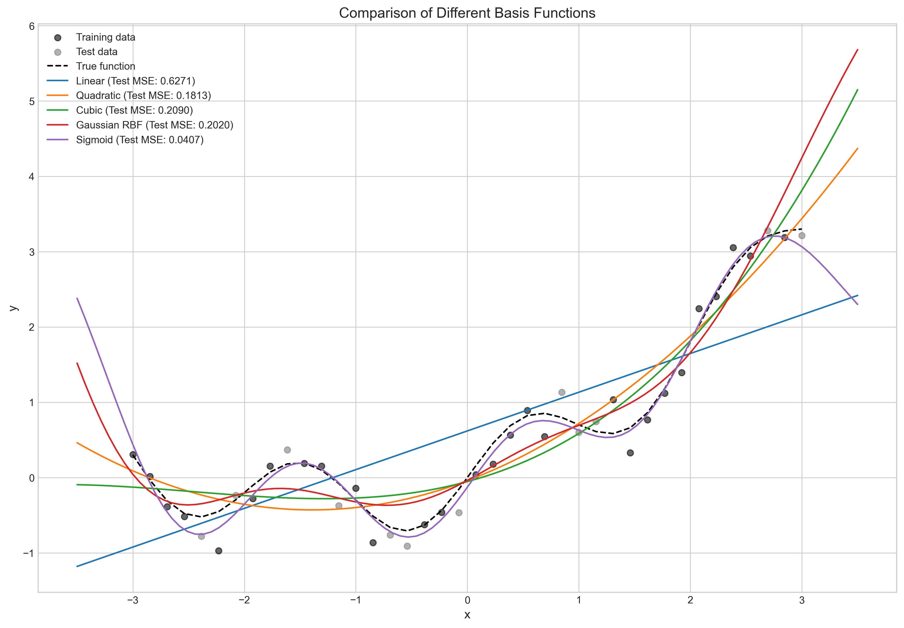

This plot shows how different basis function types fit the same dataset:
- Linear model (simplest): Cannot capture the non-linear pattern
- Quadratic and cubic models: Capture the overall trend but miss some local features
- Gaussian RBF: Good local approximation with some oscillations
- Sigmoid: Excellent fit for this particular pattern

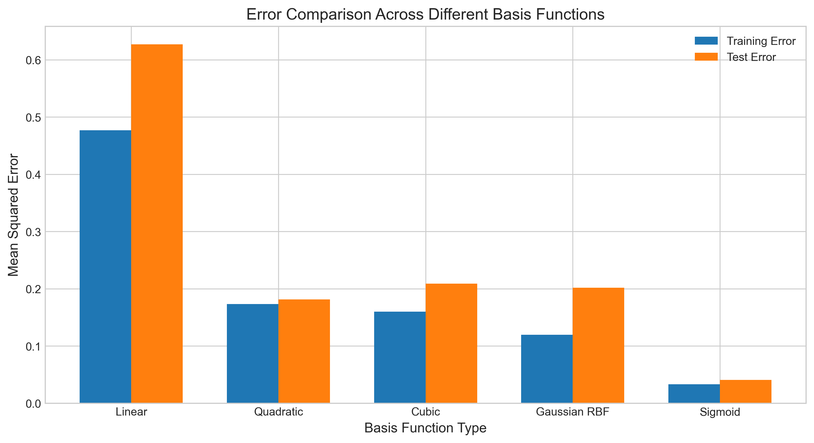

This bar chart compares the training and test errors for different basis function types:
- Linear model has the highest error (both training and test)
- More complex models achieve lower errors
- The sigmoid basis functions perform best on this particular dataset
- The gap between training and test error indicates the degree of overfitting

## Key Insights

### Theoretical Foundations
- Basis functions transform the input space to enable linear models to capture non-linear patterns
- Different families of basis functions have different mathematical properties:
  * Polynomial: Global, smooth functions with increasing oscillations at higher degrees
  * Gaussian RBF: Local, bell-shaped functions with maximum response at their centers
  * Sigmoid: Transition functions with asymptotic behavior and threshold effects
- The complexity of the model is determined by both the number and type of basis functions used
- The universal approximation property suggests that with enough basis functions, we can approximate any continuous function to arbitrary precision

### Practical Applications
- **Polynomial basis functions** are useful for:
  * Smooth, globally structured relationships (physical laws, economic trends)
  * Problems requiring interpretable models with clear parameter meanings
  * Data with clear polynomial trends (quadratic, cubic patterns)
  * Example: $f(x) = w_0 + w_1x + w_2x^2$ for modeling U-shaped relationships

- **Gaussian RBFs** excel at:
  * Modeling local patterns that vary across the input space
  * Spatial interpolation problems
  * Functions with varying complexity in different regions
  * Example: $f(x) = \sum_{j=1}^{m} w_j \exp(-\|x-\mu_j\|^2/2\sigma^2)$ for complex pattern recognition

- **Sigmoid basis functions** are effective for:
  * Modeling threshold effects and transitions between states
  * Classification-like problems with decision boundaries
  * Systems with saturation effects
  * Example: $f(x) = \sum_{j=1}^{m} w_j \frac{1}{1+\exp(-a(x-c_j))}$ for modeling adoption curves

- For 2D quadratic models, six specific basis functions (1, $x_1$, $x_2$, $x_1^2$, $x_1x_2$, $x_2^2$) capture all linear, quadratic, and interaction effects

### Model Selection and Tuning
- The bias-variance tradeoff is central to choosing the right basis functions:
  * Too few basis functions → high bias (underfitting)
  * Too many basis functions → high variance (overfitting)
  * Optimal model complexity → balance between bias and variance

- Cross-validation helps identify the optimal model complexity for a given dataset:
  * $k$-fold cross-validation
  * Leave-one-out cross-validation
  * Time-series cross-validation for temporal data

- Regularization can mitigate overfitting when using flexible basis functions:
  * Ridge regression (L2): $\min_{\boldsymbol{w}} \|\boldsymbol{y} - \boldsymbol{\Phi}\boldsymbol{w}\|_2^2 + \lambda \|\boldsymbol{w}\|_2^2$
  * LASSO (L1): $\min_{\boldsymbol{w}} \|\boldsymbol{y} - \boldsymbol{\Phi}\boldsymbol{w}\|_2^2 + \lambda \|\boldsymbol{w}\|_1$
  * Elastic Net: $\min_{\boldsymbol{w}} \|\boldsymbol{y} - \boldsymbol{\Phi}\boldsymbol{w}\|_2^2 + \lambda_1 \|\boldsymbol{w}\|_1 + \lambda_2 \|\boldsymbol{w}\|_2^2$

- The nature of the data should guide the selection of appropriate basis function types:
  * Domain knowledge about the underlying process
  * Exploratory data analysis to identify patterns
  * Model comparison using metrics like AIC, BIC, or cross-validation

### Computational Considerations
- Different basis functions have different computational requirements:
  * Polynomial basis functions are efficient for low degrees but scale poorly with input dimension
  * RBF and sigmoid require more computation time when many centers are used
  * Memory usage increases linearly with the number of basis functions for all types
- For large datasets or resource-constrained environments, computational efficiency becomes an important factor in choosing basis functions

### Regularization and Robustness
- Regularization is crucial when using many basis functions to prevent overfitting
- Ridge regression (L2) effectively stabilizes coefficient estimates by shrinking them towards zero
- The regularization parameter should be tuned using cross-validation
- Well-regularized models tend to be more robust to noise and outliers in the data

## Conclusion
- **Basis functions** are transformations that extend linear models to capture non-linear relationships while preserving the computational advantages of linear methods. They effectively convert a non-linear modeling problem into a linear one in a transformed feature space.

- **Different types of basis functions** (polynomial, Gaussian RBF, sigmoid) have distinct mathematical formulations and are suitable for different types of patterns in data. The choice depends on the nature of the underlying relationship and the specific requirements of the application.

- **A quadratic model for 2D inputs** requires six basis functions: a constant term (1), two linear terms ($x_1$, $x_2$), and three quadratic terms ($x_1^2$, $x_1x_2$, $x_2^2$). This model can represent a variety of curved surfaces including bowls, ridges, and saddles.

- **The choice of basis functions** directly affects the bias-variance tradeoff. Simpler functions may cause underfitting (high bias), while more complex functions may cause overfitting (high variance). The optimal choice balances these two sources of error to achieve the best generalization performance.

- **Computational efficiency** should be considered when choosing basis functions, especially for large datasets or resource-constrained environments.
- **Regularization** plays a crucial role in controlling model complexity when using many basis functions, improving generalization performance and robustness.
- **Cross-validation** provides an objective way to select the optimal model complexity, balancing bias and variance to achieve the best generalization performance.

Understanding basis functions provides a powerful framework for modeling complex relationships in data while leveraging the simplicity and efficiency of linear models. This approach forms the foundation for many advanced machine learning techniques, including kernel methods, spline models, and neural networks with their connection to infinite-width networks and neural tangent kernels. 