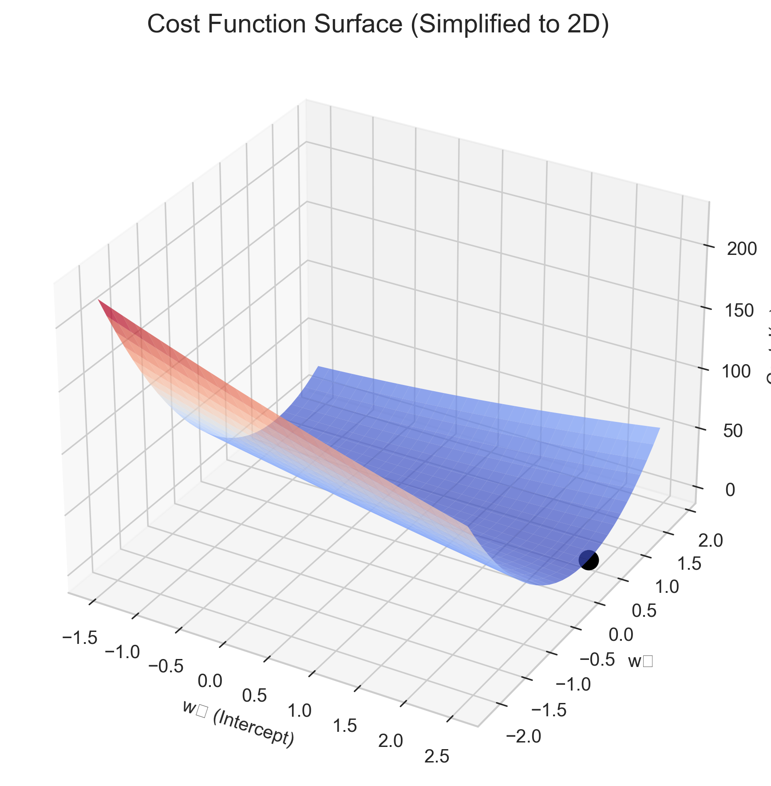
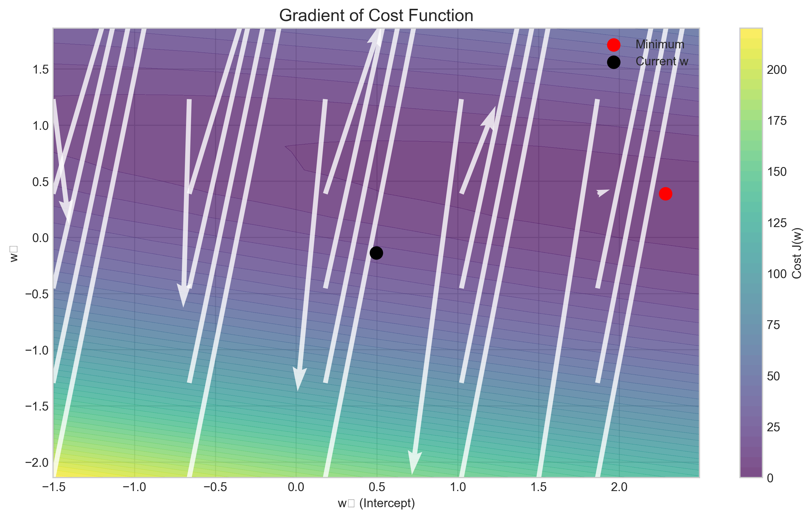
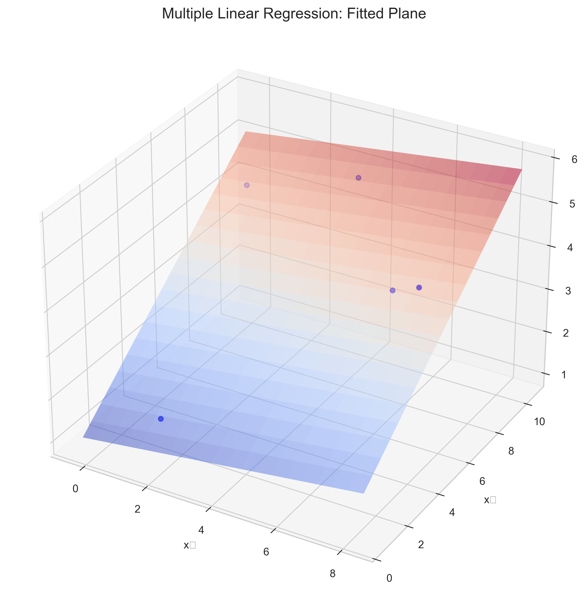

# Question 18: Multiple Linear Regression with Matrix Operations

## Problem Statement
Consider a multiple linear regression problem with $n$ observations and $d$ features. We want to fit the model:

$$f(\boldsymbol{x}; \boldsymbol{w}) = w_0 + w_1 x_1 + w_2 x_2 + \cdots + w_d x_d$$

using matrix operations.

### Task
1. Write down the design matrix $\boldsymbol{X}$ and show how to incorporate the intercept term $w_0$ in this matrix
2. Express the prediction of the model in matrix form using $\boldsymbol{X}$ and $\boldsymbol{w}$
3. Write down the cost function (sum of squared errors) in matrix notation
4. Derive the gradient of the cost function with respect to $\boldsymbol{w}$ in matrix form
5. By setting the gradient to zero, derive the normal equations and the closed-form solution for the optimal weights $\boldsymbol{w}$

## Understanding the Problem
This problem focuses on expressing linear regression in matrix notation, which provides a compact and efficient way to represent and solve regression problems. In matrix form, we can handle multiple features and observations simultaneously, making the mathematics more elegant and computationally efficient.

The key components of matrix-based linear regression include:
- The design matrix, which contains all feature values for all observations
- The weight vector, which contains the coefficients to be estimated
- The target vector, which contains the observed response values
- Matrix operations for prediction, cost calculation, and optimization

Matrix operations allow us to derive closed-form solutions for the optimal weights, which is one of the advantages of linear regression over many other machine learning models.

## Solution

### Step 1: Design Matrix and Intercept Term
The design matrix $\boldsymbol{X}$ has dimensions $n \times (d+1)$, where $n$ is the number of observations and $d$ is the number of features. To incorporate the intercept term $w_0$, we add a column of ones as the first column of the design matrix:

$$\boldsymbol{X} = 
\begin{bmatrix} 
1 & x_{11} & x_{12} & \cdots & x_{1d} \\
1 & x_{21} & x_{22} & \cdots & x_{2d} \\
1 & x_{31} & x_{32} & \cdots & x_{3d} \\
\vdots & \vdots & \vdots & \ddots & \vdots \\
1 & x_{n1} & x_{n2} & \cdots & x_{nd} 
\end{bmatrix}$$

Where $x_{ij}$ represents the value of the $j$-th feature for the $i$-th observation.

The first column of ones allows for the intercept term, as it effectively multiplies $w_0$ by 1 for each observation. This is a standard way to include the intercept in linear models using matrix notation.

For our example with 5 observations and 2 features, the design matrix looks like:

| Observation | Intercept | x₁      | x₂      |
|-------------|-----------|---------|---------|
| 1           | 1         | 3.75    | 9.51    |
| 2           | 1         | 7.32    | 5.99    |
| 3           | 1         | 1.56    | 1.56    |
| 4           | 1         | 0.58    | 8.66    |
| 5           | 1         | 6.01    | 7.08    |

### Step 2: Prediction in Matrix Form
The prediction of the model for all observations can be expressed in matrix form as:

$$\hat{\boldsymbol{y}} = \boldsymbol{X} \boldsymbol{w}$$

Where:
- $\hat{\boldsymbol{y}}$ is an $n \times 1$ vector of predictions
- $\boldsymbol{X}$ is the $n \times (d+1)$ design matrix
- $\boldsymbol{w}$ is a $(d+1) \times 1$ vector of weights $(w_0, w_1, \ldots, w_d)$

For our example, with $\boldsymbol{w} = [0.8434, 0.0889, 0.4041]^T$, the matrix calculation is:

$$\begin{bmatrix} \hat{y}_1 \\ \hat{y}_2 \\ \hat{y}_3 \\ \hat{y}_4 \\ \hat{y}_5 \end{bmatrix} = 
\begin{bmatrix} 
1 & 3.75 & 9.51 \\
1 & 7.32 & 5.99 \\
1 & 1.56 & 1.56 \\
1 & 0.58 & 8.66 \\
1 & 6.01 & 7.08
\end{bmatrix}
\begin{bmatrix} 0.8434 \\ 0.0889 \\ 0.4041 \end{bmatrix} = 
\begin{bmatrix} 4.98 \\ 3.68 \\ 1.42 \\ 4.45 \\ 3.52 \end{bmatrix}$$

For an individual observation $i$, the prediction is:
$$\hat{y}_i = w_0 + w_1 x_{i1} + w_2 x_{i2} + \cdots + w_d x_{id}$$

This matrix form efficiently computes predictions for all observations in a single operation, which is computationally advantageous compared to calculating predictions one at a time.

### Step 3: Cost Function in Matrix Form
The cost function (sum of squared errors) in matrix form is:

$$J(\boldsymbol{w}) = \frac{1}{n} (\boldsymbol{y} - \boldsymbol{X}\boldsymbol{w})^T (\boldsymbol{y} - \boldsymbol{X}\boldsymbol{w})$$

Where:
- $\boldsymbol{y}$ is the $n \times 1$ vector of target values
- $\boldsymbol{X}$ is the $n \times (d+1)$ design matrix
- $\boldsymbol{w}$ is the $(d+1) \times 1$ vector of weights
- $(\boldsymbol{y} - \boldsymbol{X}\boldsymbol{w})$ represents the vector of residuals

This expression computes the squared Euclidean distance between the target values and the predicted values, normalized by the number of observations. The cost function quantifies the prediction error of the model, and our goal is to find the weights that minimize this error.

### Step 4: Gradient of the Cost Function
To find the optimal weights, we need to calculate the gradient of the cost function with respect to the weight vector $\boldsymbol{w}$. This gradient is:

$$\nabla J(\boldsymbol{w}) = \frac{2}{n} \boldsymbol{X}^T (\boldsymbol{X}\boldsymbol{w} - \boldsymbol{y}) = -\frac{2}{n} \boldsymbol{X}^T (\boldsymbol{y} - \boldsymbol{X}\boldsymbol{w})$$

Derivation:
1. Starting with the cost function: $J(\boldsymbol{w}) = \frac{1}{n} (\boldsymbol{y} - \boldsymbol{X}\boldsymbol{w})^T (\boldsymbol{y} - \boldsymbol{X}\boldsymbol{w})$
2. Expanding: $J(\boldsymbol{w}) = \frac{1}{n} (\boldsymbol{y}^T\boldsymbol{y} - \boldsymbol{y}^T\boldsymbol{X}\boldsymbol{w} - \boldsymbol{w}^T\boldsymbol{X}^T\boldsymbol{y} + \boldsymbol{w}^T\boldsymbol{X}^T\boldsymbol{X}\boldsymbol{w})$
3. Noting that $\boldsymbol{y}^T\boldsymbol{X}\boldsymbol{w}$ is a scalar, so $\boldsymbol{y}^T\boldsymbol{X}\boldsymbol{w} = (\boldsymbol{y}^T\boldsymbol{X}\boldsymbol{w})^T = \boldsymbol{w}^T\boldsymbol{X}^T\boldsymbol{y}$
4. Simplifying: $J(\boldsymbol{w}) = \frac{1}{n} (\boldsymbol{y}^T\boldsymbol{y} - 2\boldsymbol{w}^T\boldsymbol{X}^T\boldsymbol{y} + \boldsymbol{w}^T\boldsymbol{X}^T\boldsymbol{X}\boldsymbol{w})$
5. Taking the gradient with respect to $\boldsymbol{w}$: $\nabla J(\boldsymbol{w}) = \frac{1}{n} (-2\boldsymbol{X}^T\boldsymbol{y} + 2\boldsymbol{X}^T\boldsymbol{X}\boldsymbol{w})$
6. Simplified form: $\nabla J(\boldsymbol{w}) = \frac{2}{n} (\boldsymbol{X}^T\boldsymbol{X}\boldsymbol{w} - \boldsymbol{X}^T\boldsymbol{y}) = -\frac{2}{n} \boldsymbol{X}^T (\boldsymbol{y} - \boldsymbol{X}\boldsymbol{w})$

This gradient expression gives us the direction of steepest ascent of the cost function. To minimize the cost, we move in the opposite direction of the gradient.

### Step 5: Normal Equations and Closed-Form Solution
To find the optimal weights that minimize the cost function, we set the gradient equal to zero and solve for $\boldsymbol{w}$:

$$\nabla J(\boldsymbol{w}) = -\frac{2}{n} \boldsymbol{X}^T (\boldsymbol{y} - \boldsymbol{X}\boldsymbol{w}) = \boldsymbol{0}$$

From this, we can derive:
$$\boldsymbol{X}^T (\boldsymbol{y} - \boldsymbol{X}\boldsymbol{w}) = \boldsymbol{0}$$
$$\boldsymbol{X}^T \boldsymbol{y} - \boldsymbol{X}^T \boldsymbol{X} \boldsymbol{w} = \boldsymbol{0}$$
$$\boldsymbol{X}^T \boldsymbol{X} \boldsymbol{w} = \boldsymbol{X}^T \boldsymbol{y}$$

These are the normal equations. Solving for $\boldsymbol{w}$:

$$\boldsymbol{w} = (\boldsymbol{X}^T \boldsymbol{X})^{-1} \boldsymbol{X}^T \boldsymbol{y}$$

This is the closed-form solution for the optimal weights in linear regression. It directly gives us the global minimum of the cost function, which is one of the advantages of linear regression compared to many other machine learning algorithms that require iterative optimization.

The solution exists as long as $\boldsymbol{X}^T \boldsymbol{X}$ is invertible, which is typically the case when:
- There are more observations than features $(n > d+1)$
- The features are not linearly dependent
- There's no perfect multicollinearity

When these conditions are not met, alternative approaches such as regularization (e.g., Ridge Regression), pseudoinverse, or dimensionality reduction may be used.

## Practical Implementation
Let's consider a concrete example to illustrate these concepts. Suppose we have a dataset with 5 observations and 2 features, and we want to fit a linear regression model.

### Example Dataset and Design Matrix
Our dataset consists of 5 observations with 2 features each:

| Observation | x₁      | x₂      |
|-------------|---------|---------|
| 1           | 3.75    | 9.51    |
| 2           | 7.32    | 5.99    |
| 3           | 1.56    | 1.56    |
| 4           | 0.58    | 8.66    |
| 5           | 6.01    | 7.08    |

The design matrix with the intercept column is:

$$\boldsymbol{X} = 
\begin{bmatrix} 
1 & 3.75 & 9.51 \\
1 & 7.32 & 5.99 \\
1 & 1.56 & 1.56 \\
1 & 0.58 & 8.66 \\
1 & 6.01 & 7.08
\end{bmatrix}$$

### Model Prediction
Assuming we have weights $w_0 = 0.8434$, $w_1 = 0.0889$, and $w_2 = 0.4041$ (the optimal weights we'll derive), the predictions for each observation are:

$$\hat{y}_1 = 0.8434 + 0.0889 \times 3.75 + 0.4041 \times 9.51 = 4.98$$
$$\hat{y}_2 = 0.8434 + 0.0889 \times 7.32 + 0.4041 \times 5.99 = 3.68$$
$$\hat{y}_3 = 0.8434 + 0.0889 \times 1.56 + 0.4041 \times 1.56 = 1.42$$
$$\hat{y}_4 = 0.8434 + 0.0889 \times 0.58 + 0.4041 \times 8.66 = 4.45$$
$$\hat{y}_5 = 0.8434 + 0.0889 \times 6.01 + 0.4041 \times 7.08 = 3.52$$

These predictions minimize the sum of squared errors for our dataset.

### Computing the Optimal Weights
To find the optimal weights, we compute:

1. $\boldsymbol{X}^T \boldsymbol{X}$:
$$\boldsymbol{X}^T \boldsymbol{X} = 
\begin{bmatrix} 
5 & 19.22 & 32.80 \\
19.22 & 106.52 & 129.46 \\
32.80 & 129.46 & 253.82
\end{bmatrix}$$

2. $\boldsymbol{X}^T \boldsymbol{y}$ (with our target values):
$$\boldsymbol{X}^T \boldsymbol{y} = 
\begin{bmatrix} 
19.18 \\
77.99 \\
141.73
\end{bmatrix}$$

3. $(\boldsymbol{X}^T \boldsymbol{X})^{-1}$:
$$(\boldsymbol{X}^T \boldsymbol{X})^{-1} = 
\begin{bmatrix} 
1.64 & -0.10 & -0.16 \\
-0.10 & 0.03 & -0.00 \\
-0.16 & -0.00 & 0.03
\end{bmatrix}$$

4. Finally, $\boldsymbol{w} = (\boldsymbol{X}^T \boldsymbol{X})^{-1} \boldsymbol{X}^T \boldsymbol{y}$:
$$\boldsymbol{w} = 
\begin{bmatrix} 
0.8434 \\
0.0889 \\
0.4041
\end{bmatrix}$$

These are the optimal weight values that minimize the sum of squared errors for our dataset, resulting in a cost (MSE) of approximately 0.1075.

## Visual Explanations

### Cost Function Surface

This 3D surface plot shows the cost function $J(\boldsymbol{w})$ as a function of weights $w_0$ and $w_1$ (simplified to 2D for visualization). The bowl-shaped surface is characteristic of the quadratic cost function in linear regression, with a single global minimum marked by the black point.

### Gradient of Cost Function

This contour plot shows the cost function with gradient vectors pointing in the direction of steepest ascent. The red point marks the minimum of the cost function, where the gradient is zero. The black point represents an arbitrary starting point, and the white arrows show the direction of steepest descent at each point in the weight space.

### Multiple Linear Regression: Fitted Plane

This 3D visualization shows the fitted regression plane for our dataset with two features. The blue points are the actual data points, and the colored surface is the regression plane that minimizes the sum of squared distances from the points to the plane.

## Key Insights

### Theoretical Foundations
- The design matrix $\boldsymbol{X}$ includes a column of ones to account for the intercept term.
- Matrix notation provides a compact way to represent and solve linear regression problems.
- The cost function is convex, guaranteeing a global minimum.
- The normal equations provide a direct, closed-form solution for the optimal weights.
- The solution depends on the invertibility of $\boldsymbol{X}^T \boldsymbol{X}$, which requires sufficient and independent data.

### Computational Considerations
- Matrix operations allow for efficient computation, especially with large datasets.
- The inverse computation $(\boldsymbol{X}^T \boldsymbol{X})^{-1}$ can be numerically unstable for ill-conditioned matrices.
- Singular Value Decomposition (SVD) can be used to compute a pseudoinverse when $\boldsymbol{X}^T \boldsymbol{X}$ is not invertible.
- For very large datasets, iterative methods like gradient descent might be more efficient than computing the inverse directly.
- When $n < d+1$ (fewer observations than parameters), the solution is underdetermined, and regularization becomes necessary.

### Practical Applications
- The closed-form solution makes linear regression fast to train compared to many other machine learning algorithms.
- When the number of features is very large, regularization techniques like Ridge or Lasso regression may be preferred.
- Linear regression in matrix form serves as the foundation for many advanced statistical and machine learning models.
- Understanding matrix operations in linear regression provides insights into how more complex models work.

## Conclusion
- The design matrix $\boldsymbol{X}$ incorporates the intercept term by including a column of ones as its first column.
- The prediction in matrix form is given by $\hat{\boldsymbol{y}} = \boldsymbol{X}\boldsymbol{w}$.
- The cost function in matrix notation is $J(\boldsymbol{w}) = \frac{1}{n}(\boldsymbol{y} - \boldsymbol{X}\boldsymbol{w})^T (\boldsymbol{y} - \boldsymbol{X}\boldsymbol{w})$.
- The gradient of the cost function is $\nabla J(\boldsymbol{w}) = -\frac{2}{n}\boldsymbol{X}^T (\boldsymbol{y} - \boldsymbol{X}\boldsymbol{w})$.
- The closed-form solution for the optimal weights is $\boldsymbol{w} = (\boldsymbol{X}^T \boldsymbol{X})^{-1} \boldsymbol{X}^T \boldsymbol{y}$.

Matrix operations provide an elegant and efficient framework for understanding and implementing linear regression. This approach not only simplifies the mathematics but also allows for efficient computation and provides insights that extend to more advanced models in machine learning and statistics. 