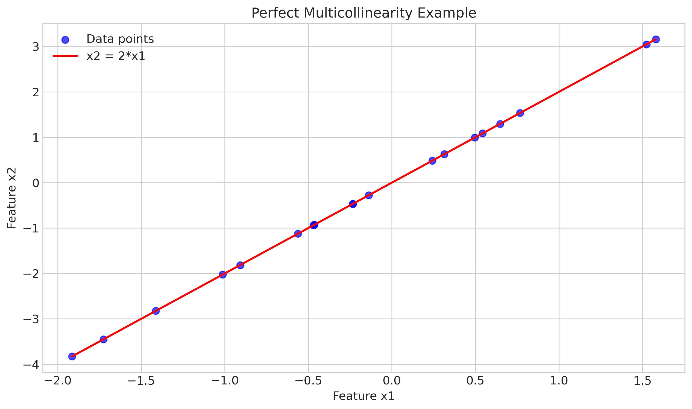
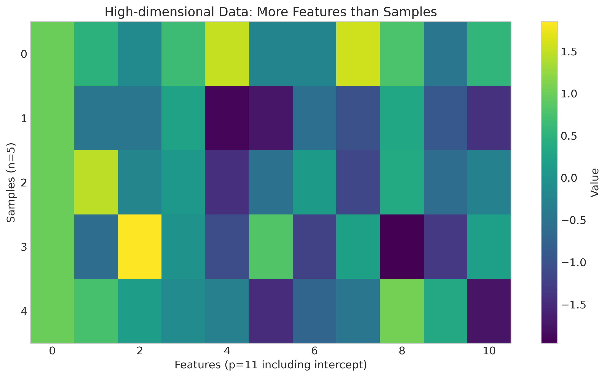
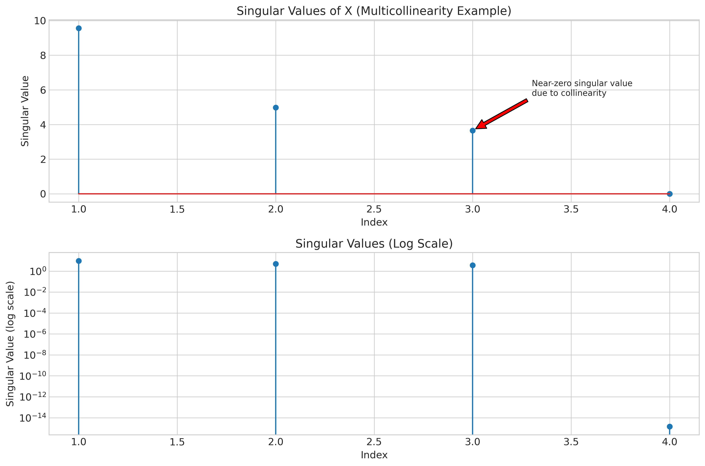
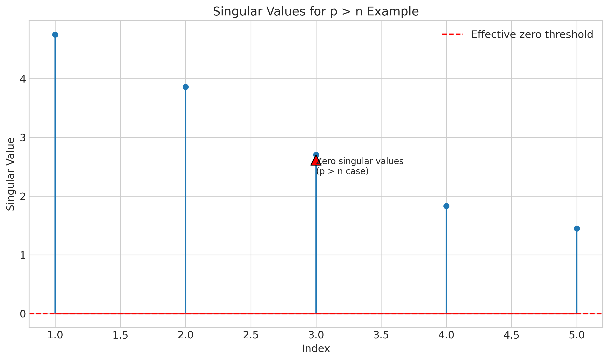
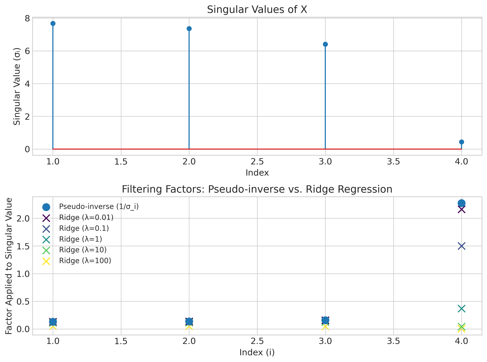
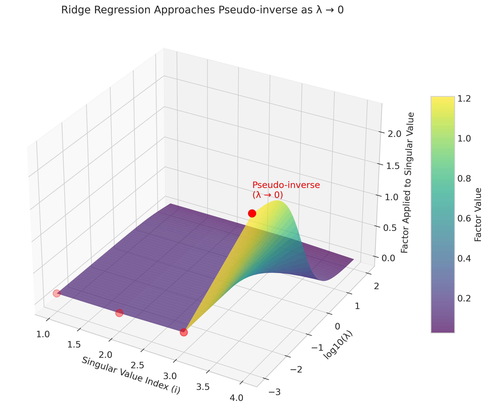
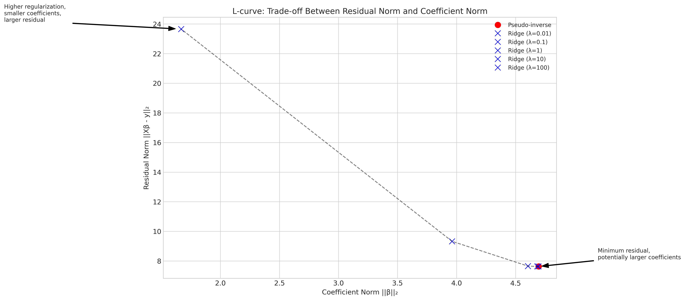

# Question 19: Pseudo-inverse in Linear Regression

## Problem Statement
In linear regression, the pseudo-inverse is an important concept, especially when dealing with singular or non-invertible matrices.

### Task
1. Define what the pseudo-inverse is in the context of linear regression and write down its formula
2. Explain when the pseudo-inverse becomes necessary in linear regression instead of the normal inverse
3. What are two specific scenarios in linear regression that would lead to a non-invertible $\mathbf{X}^T\mathbf{X}$ matrix?
4. Describe how the pseudo-inverse can be calculated using Singular Value Decomposition (SVD)
5. Explain the relationship between ridge regression and the pseudo-inverse approach for handling non-invertible matrices

## Understanding the Problem
In linear regression, we aim to find the relationship between a dependent variable and one or more independent variables. This involves estimating the coefficient parameters by solving a system of linear equations. When working with real-world data, we often encounter situations where the standard approach fails due to singularity issues. The pseudo-inverse provides a mathematical solution to these situations, allowing us to find optimal parameters even when the usual matrix inverse doesn't exist.

The problem asks us to explore the theoretical foundations of the pseudo-inverse, its practical applications in regression contexts, and its relationship with regularization techniques like ridge regression.

## Solution

### Step 1: Define the pseudo-inverse in linear regression
In linear regression, we try to solve the normal equations:

$$(\mathbf{X}^T \mathbf{X})\boldsymbol{\beta} = \mathbf{X}^T \mathbf{y}$$

If $\mathbf{X}^T \mathbf{X}$ is invertible (non-singular), we can directly solve for $\boldsymbol{\beta}$:

$$\boldsymbol{\beta} = (\mathbf{X}^T \mathbf{X})^{-1} \mathbf{X}^T \mathbf{y}$$

However, when $\mathbf{X}^T \mathbf{X}$ is singular or ill-conditioned, the standard inverse doesn't exist or leads to numerical instability. This is where the pseudo-inverse comes in.

The Moore-Penrose pseudo-inverse (denoted as $\mathbf{X}^+$) provides a generalized inverse that works even when the matrix is singular. The formula for the pseudo-inverse in the context of linear regression is:

$$\mathbf{X}^+ = (\mathbf{X}^T \mathbf{X})^+ \mathbf{X}^T$$

Using this pseudo-inverse, we can solve for $\boldsymbol{\beta}$:

$$\boldsymbol{\beta} = \mathbf{X}^+ \mathbf{y}$$

The pseudo-inverse has the following important properties:
1. If $\mathbf{X}$ has full rank, then $\mathbf{X}^+ = (\mathbf{X}^T \mathbf{X})^{-1} \mathbf{X}^T$ (it's equivalent to the standard solution)
2. $\mathbf{X}^+$ minimizes the Euclidean norm $\|\mathbf{X}\boldsymbol{\beta} - \mathbf{y}\|_2$ (gives a least-squares solution)
3. Among all solutions that minimize $\|\mathbf{X}\boldsymbol{\beta} - \mathbf{y}\|_2$, $\mathbf{X}^+ \mathbf{y}$ has the minimum norm $\|\boldsymbol{\beta}\|_2$ (it's the shortest solution)

### Step 2: When the pseudo-inverse becomes necessary
The pseudo-inverse becomes necessary in linear regression when $\mathbf{X}^T \mathbf{X}$ is not invertible (singular), which can happen in several important scenarios:

1. **Multicollinearity**: When features are perfectly correlated (linearly dependent), the matrix $\mathbf{X}^T \mathbf{X}$ becomes rank-deficient and singular. In this case, there are infinitely many solutions that minimize the sum of squared residuals, and the pseudo-inverse selects the one with the smallest norm.

2. **High-dimensional data**: When the number of features ($p$) exceeds the number of samples ($n$), the matrix $\mathbf{X}^T \mathbf{X}$ becomes singular. This is because the rank of $\mathbf{X}^T \mathbf{X}$ is at most $\min(n,p)$, which in this case is less than $p$. This situation is increasingly common in modern data analysis with high-dimensional datasets.

3. **Numerical instability**: Even when $\mathbf{X}^T \mathbf{X}$ is technically invertible, it can be ill-conditioned (have a high condition number), leading to numerical problems when computing the inverse. In such cases, the pseudo-inverse provides a more stable solution.

In all these cases, the standard inverse $(\mathbf{X}^T \mathbf{X})^{-1}$ doesn't exist or is numerically problematic, but the pseudo-inverse $\mathbf{X}^+$ still provides a meaningful solution with desirable properties.

### Step 3: Specific scenarios leading to non-invertible X^T X

#### Scenario 1: Perfect Multicollinearity
One common scenario that leads to a non-invertible $\mathbf{X}^T \mathbf{X}$ matrix is perfect multicollinearity, where two or more features are perfectly linearly related.

To demonstrate this, we created an example with 20 samples and 4 features (including the intercept), where the second feature is perfectly correlated with the first: $x_2 = 2x_1$.



Analysis of the resulting design matrix shows:
- The matrix has shape (20, 4), meaning 20 samples and 4 features
- The rank of $\mathbf{X}^T \mathbf{X}$ is 3 (should be 4 for full rank)
- The smallest eigenvalue is approximately $4.89 \times 10^{-15}$, which is effectively zero
- The condition number is extremely high at $3.95 \times 10^{17}$, indicating singularity

Because $x_2 = 2x_1$, the features are linearly dependent, making $\mathbf{X}^T \mathbf{X}$ singular. In this case, $\text{rank}(\mathbf{X}^T \mathbf{X}) < p$, where $p$ is the number of features.

#### Scenario 2: More Features than Samples (p > n)
Another common scenario is when the number of features exceeds the number of samples, often called the "high-dimensional" or "p > n" problem.

We created an example with 5 samples and 11 features (including the intercept):



Analysis of this design matrix shows:
- The matrix has shape (5, 11), meaning 5 samples and 11 features
- The rank of $\mathbf{X}^T \mathbf{X}$ is 5 (should be 11 for full rank)
- The smallest eigenvalue is effectively zero ($-9.42 \times 10^{-16} - 1.44 \times 10^{-16}j$)
- The condition number is extremely high at $1.94 \times 10^{17}$, indicating singularity

Since $p = 11 > n = 5$, the $\mathbf{X}^T \mathbf{X}$ matrix is singular. The maximum possible rank is 5 (the number of samples), but we have 11 columns. This means that the system is underdetermined, and there are infinitely many solutions.

### Step 4: Calculate pseudo-inverse using SVD
The pseudo-inverse can be elegantly calculated using Singular Value Decomposition (SVD). For a matrix $\mathbf{X}$, the SVD is:

$$\mathbf{X} = \mathbf{U}\mathbf{\Sigma}\mathbf{V}^T$$

where:
- $\mathbf{U}$ is an orthogonal matrix of left singular vectors
- $\mathbf{\Sigma}$ is a diagonal matrix of singular values
- $\mathbf{V}$ is an orthogonal matrix of right singular vectors

Using SVD, the pseudo-inverse $\mathbf{X}^+$ is calculated as:

$$\mathbf{X}^+ = \mathbf{V}\mathbf{\Sigma}^+\mathbf{U}^T$$

Where $\mathbf{\Sigma}^+$ is obtained by taking the reciprocal of each non-zero singular value in $\mathbf{\Sigma}$ and leaving the zeros as zeros, then transposing the resulting matrix. Specifically, if $\mathbf{\Sigma}$ has diagonal elements $\sigma_1, \sigma_2, \ldots, \sigma_r, 0, \ldots, 0$, then $\mathbf{\Sigma}^+$ has diagonal elements $\frac{1}{\sigma_1}, \frac{1}{\sigma_2}, \ldots, \frac{1}{\sigma_r}, 0, \ldots, 0$.

For our multicollinearity example, we computed the SVD and found:



The singular values of $\mathbf{X}$ are:
```
[9.56519609e+00 4.98369593e+00 3.65801005e+00 1.44736461e-15]
```

The last singular value is effectively zero ($1.44736461 \times 10^{-15}$), confirming that the matrix is rank-deficient. When computing the pseudo-inverse, this near-zero singular value is treated as zero, and its reciprocal is set to zero.

For the p > n case, the SVD reveals:



The singular values are:
```
[4.75093731 3.86068778 2.70532832 1.83215312 1.45091509]
```

There are only 5 non-zero singular values, which equals the rank of $\mathbf{X}$. This is limited by the number of samples (5), even though we have 11 columns.

### Step 5: Relationship between ridge regression and pseudo-inverse
Ridge regression and the pseudo-inverse are both approaches to handle non-invertible matrices, but they do so in different ways with different trade-offs.

Ridge regression adds a regularization term $\lambda \mathbf{I}$ to $\mathbf{X}^T \mathbf{X}$:

$$\boldsymbol{\beta}_{\text{ridge}} = (\mathbf{X}^T \mathbf{X} + \lambda \mathbf{I})^{-1} \mathbf{X}^T \mathbf{y}$$

The regularization parameter $\lambda$ ensures that $(\mathbf{X}^T \mathbf{X} + \lambda \mathbf{I})$ is invertible, even when $\mathbf{X}^T \mathbf{X}$ is singular.

The pseudo-inverse and ridge regression can be related through SVD. For $\mathbf{X} = \mathbf{U}\mathbf{\Sigma}\mathbf{V}^T$:

1. Pseudo-inverse solution: $\mathbf{X}^+ = \mathbf{V}\mathbf{\Sigma}^+\mathbf{U}^T$ where $\mathbf{\Sigma}^+$ has $\frac{1}{\sigma_i}$ for non-zero singular values
2. Ridge solution: $(\mathbf{X}^T \mathbf{X} + \lambda \mathbf{I})^{-1} \mathbf{X}^T = \mathbf{V}(\mathbf{\Sigma}^T \mathbf{\Sigma} + \lambda \mathbf{I})^{-1}\mathbf{\Sigma}^T \mathbf{U}^T$

This gives diagonal elements $\frac{1}{\sigma_i}$ for SVD vs. $\frac{\sigma_i}{\sigma_i^2 + \lambda}$ for ridge regression.



As $\lambda \to 0$, ridge regression approaches the pseudo-inverse solution. As $\lambda$ increases, ridge regression increasingly shrinks coefficients toward zero.



We can visualize the trade-off between the residual norm and coefficient norm using the L-curve:



The L-curve shows:
- The pseudo-inverse solution has the minimum residual (it achieves the best fit to the data), but potentially larger coefficients
- As $\lambda$ increases, ridge regression solutions have smaller coefficients but larger residuals
- Ridge regression provides a smooth transition between the pseudo-inverse solution (minimizing residuals) and a solution with small coefficients (more regularized)

This demonstrates how ridge regression provides a continuum of solutions, with the pseudo-inverse as a limiting case.

## Visual Explanations

### Perfect Multicollinearity


This scatter plot demonstrates perfect multicollinearity, where one feature ($x_2$) is a perfect linear function of another feature ($x_1$). In this case, $x_2 = 2 \times x_1$. This linear dependency leads to a singular $\mathbf{X}^T \mathbf{X}$ matrix, making standard inverse methods fail.

### High-dimensional Data


This heatmap visualizes a dataset with more features (columns) than samples (rows). In this case, we have 11 features (including intercept) but only 5 samples. The $\mathbf{X}^T \mathbf{X}$ matrix becomes singular because there are more parameters to estimate than data points available.

### Singular Values in Multicollinearity


This stem plot shows the singular values of $\mathbf{X}$ for the multicollinearity example. The fourth singular value is essentially zero, indicating that the matrix is rank-deficient. This confirms the presence of a linear dependency among the columns of $\mathbf{X}$. The log-scale plot below highlights the magnitude difference between the near-zero singular value and the others.

### Singular Values in p > n Case


This stem plot shows the singular values for the p > n example. There are only 5 non-zero singular values despite having 11 columns in the design matrix. This reflects the fundamental limitation that the rank cannot exceed the number of samples.

### Relationship Between Ridge and Pseudo-inverse


The top panel shows the singular values of $\mathbf{X}$. The bottom panel compares how pseudo-inverse and ridge regression handle these singular values. The pseudo-inverse uses $\frac{1}{\sigma_i}$ factors for non-zero singular values, while ridge regression uses $\frac{\sigma_i}{\sigma_i^2 + \lambda}$ factors that depend on the regularization parameter $\lambda$.

### 3D Visualization of Ridge to Pseudo-inverse


This 3D surface plot shows how ridge regression approaches the pseudo-inverse solution as $\lambda$ approaches zero. The x-axis represents the singular value index, the y-axis represents $\log_{10}(\lambda)$, and the z-axis represents the factor applied to each singular value.

### L-Curve Trade-off


The L-curve visualizes the trade-off between the residual norm ($\|\mathbf{X}\boldsymbol{\beta} - \mathbf{y}\|_2$) and the coefficient norm ($\|\boldsymbol{\beta}\|_2$) for different solutions. The pseudo-inverse (red point) gives the minimum residual, while ridge regression with increasing $\lambda$ (blue points) reduces the coefficient norm at the expense of larger residuals.

## Key Insights

### Theoretical Foundations
- The pseudo-inverse provides a generalized inverse that works even when the standard inverse doesn't exist
- It has unique mathematical properties that make it optimal in a least-squares sense
- For full-rank matrices, the pseudo-inverse solution coincides with the standard least squares solution
- The SVD approach provides a stable and elegant way to compute the pseudo-inverse

### Practical Applications
- The pseudo-inverse allows regression analysis to proceed even with perfect multicollinearity
- It enables parameter estimation in high-dimensional settings where p > n
- It provides stable solutions when matrices are ill-conditioned
- The minimum-norm property helps avoid unreasonably large coefficient values

### Ridge Regression Connection
- Ridge regression provides a smoothly parameterized family of solutions
- The pseudo-inverse solution is the limit of ridge regression as $\lambda \to 0$
- Ridge regression offers more control over the balance between fit and regularization
- For practical applications, ridge regression with cross-validated $\lambda$ often performs better than the pure pseudo-inverse

### Computational Considerations
- SVD provides a numerically stable way to compute the pseudo-inverse
- Modern numerical libraries implement efficient algorithms for calculating the pseudo-inverse
- For large datasets, incremental or randomized SVD methods can be used
- The regularization approach (ridge) can sometimes be more computationally efficient

## Conclusion
- The pseudo-inverse is a powerful mathematical tool for handling singular matrices in linear regression
- It becomes necessary in cases of perfect multicollinearity and when p > n 
- The SVD provides a stable method to compute the pseudo-inverse
- Ridge regression generalizes the pseudo-inverse approach by adding a controllable regularization parameter
- Understanding the relationship between ridge regression and the pseudo-inverse helps in choosing appropriate methods for different regression problems

The pseudo-inverse provides a critical foundation for modern regression techniques, enabling parameter estimation even in challenging scenarios where traditional methods fail. Its connection to ridge regression highlights the important role of regularization in statistical learning and provides a theoretical bridge between least squares estimation and regularized approaches. 