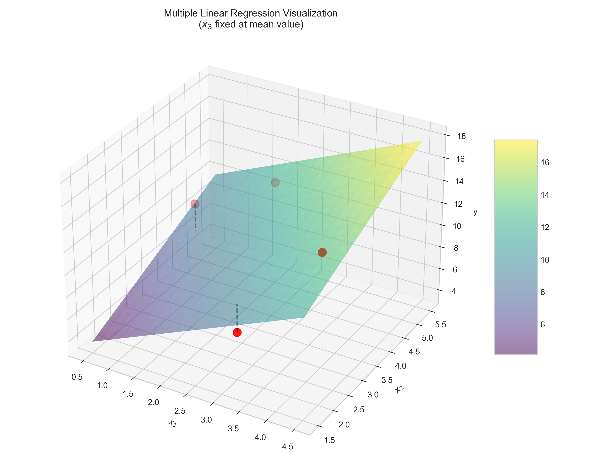

# Question 1: Matrix Formulation of Multiple Linear Regression

## Problem Statement
Consider a multiple linear regression model with 3 features and 4 observations:

| $x_1$ | $x_2$ | $x_3$ | $y$ |
|-------|-------|-------|-----|
| 2     | 5     | 1     | 12  |
| 3     | 2     | 0     | 7   |
| 1     | 4     | 2     | 11  |
| 4     | 3     | 1     | 13  |

The multiple linear regression model is given by:
$$y = w_0 + w_1x_1 + w_2x_2 + w_3x_3 + \epsilon$$

### Task
1. Write down the design matrix $\boldsymbol{X}$ and the target vector $\boldsymbol{y}$ for this dataset
2. Express the multiple linear regression model in matrix form using $\boldsymbol{X}$, $\boldsymbol{w}$, and $\boldsymbol{y}$
3. Write the normal equation for finding the optimal weights $\boldsymbol{w}$
4. Without calculating the actual values, describe the dimensions of $\boldsymbol{X}^T\boldsymbol{X}$ and $\boldsymbol{X}^T\boldsymbol{y}$ in this example

## Understanding the Problem

This problem focuses on the matrix formulation of multiple linear regression. Multiple linear regression extends simple linear regression by allowing us to model relationships between a dependent variable ($y$) and multiple independent variables ($x_1, x_2, x_3$, etc.). Using matrix notation makes the mathematics more concise and the computations more efficient.

In this specific problem, we have 4 observations of 3 features and a target variable. We need to set up the mathematical framework to find the optimal weights that best fit the data.

## Solution

### Step 1: Creating the Design Matrix and Target Vector

The design matrix $\boldsymbol{X}$ is created by adding a column of ones (for the intercept term $w_0$) to the feature matrix:

$$\boldsymbol{X} = \begin{bmatrix}
1 & 2 & 5 & 1 \\
1 & 3 & 2 & 0 \\
1 & 1 & 4 & 2 \\
1 & 4 & 3 & 1
\end{bmatrix}$$

Where:
- Each row corresponds to one observation/data point
- The first column (all 1's) is for the intercept term $w_0$
- The remaining columns contain the values of each feature ($x_1$, $x_2$, $x_3$) for each observation

The target vector $\boldsymbol{y}$ contains the observed output values:

$$\boldsymbol{y} = \begin{bmatrix}
12 \\
7 \\
11 \\
13
\end{bmatrix}$$

The design matrix has dimensions 4×4 (4 rows for observations, 4 columns for the intercept and 3 features), and the target vector has dimensions 4×1 (4 observations).

### Step 2: Expressing the Multiple Linear Regression Model in Matrix Form

The multiple linear regression model can be expressed in matrix form as:

$$\boldsymbol{y} = \boldsymbol{X}\boldsymbol{w} + \boldsymbol{\epsilon}$$

Where:
- $\boldsymbol{y}$ is the target vector of shape (4×1)
- $\boldsymbol{X}$ is the design matrix of shape (4×4)
- $\boldsymbol{w}$ is the weight vector of shape (4×1): $\boldsymbol{w} = [w_0, w_1, w_2, w_3]^T$
- $\boldsymbol{\epsilon}$ is the vector of errors of shape (4×1)

In expanded form, for each observation $i$, this is equivalent to:
$$y_i = w_0 + w_1x_{i1} + w_2x_{i2} + w_3x_{i3} + \epsilon_i$$

### Step 3: The Normal Equation for Finding Optimal Weights

To find the optimal weights $\boldsymbol{w}$ that minimize the sum of squared errors, we use the normal equation:

$$\boldsymbol{X}^T\boldsymbol{X}\boldsymbol{w} = \boldsymbol{X}^T\boldsymbol{y}$$

Solving for $\boldsymbol{w}$:

$$\boldsymbol{w} = (\boldsymbol{X}^T\boldsymbol{X})^{-1}\boldsymbol{X}^T\boldsymbol{y}$$

This equation gives us the closed-form solution for the optimal weight vector that minimizes the sum of squared errors.

### Step 4: Dimensions of $\boldsymbol{X}^T\boldsymbol{X}$ and $\boldsymbol{X}^T\boldsymbol{y}$

For our example:
- The design matrix $\boldsymbol{X}$ has dimensions 4×4
- Its transpose $\boldsymbol{X}^T$ has dimensions 4×4
- Therefore, $\boldsymbol{X}^T\boldsymbol{X}$ has dimensions 4×4
- $\boldsymbol{X}^T\boldsymbol{y}$ has dimensions 4×1

In general, if $\boldsymbol{X}$ is an $n \times (p+1)$ matrix (where $n$ is the number of observations and $p$ is the number of features, with an added column for the intercept), then:
- $\boldsymbol{X}^T\boldsymbol{X}$ will be a $(p+1) \times (p+1)$ matrix
- $\boldsymbol{X}^T\boldsymbol{y}$ will be a $(p+1) \times 1$ vector

These dimensions are critical because they determine the size of the weight vector $\boldsymbol{w}$, which has dimensions $(p+1) \times 1$.

## Calculating the Components of the Normal Equation

### Calculating $\boldsymbol{X}^T$

The transpose of the design matrix is:

$$\boldsymbol{X}^T = \begin{bmatrix}
1 & 1 & 1 & 1 \\
2 & 3 & 1 & 4 \\
5 & 2 & 4 & 3 \\
1 & 0 & 2 & 1
\end{bmatrix}$$

### Calculating $\boldsymbol{X}^T\boldsymbol{X}$

Multiplying $\boldsymbol{X}^T$ by $\boldsymbol{X}$:

$$\boldsymbol{X}^T\boldsymbol{X} = \begin{bmatrix}
4 & 10 & 14 & 4 \\
10 & 30 & 32 & 8 \\
14 & 32 & 54 & 16 \\
4 & 8 & 16 & 6
\end{bmatrix}$$

For example, the element in the first row and first column is calculated as:
$\boldsymbol{X}^T\boldsymbol{X}[0,0] = 1 \times 1 + 1 \times 1 + 1 \times 1 + 1 \times 1 = 4$

### Calculating $\boldsymbol{X}^T\boldsymbol{y}$

Multiplying $\boldsymbol{X}^T$ by $\boldsymbol{y}$:

$$\boldsymbol{X}^T\boldsymbol{y} = \begin{bmatrix}
43 \\
108 \\
157 \\
47
\end{bmatrix}$$

For example, the first element is calculated as:
$\boldsymbol{X}^T\boldsymbol{y}[0] = 1 \times 12 + 1 \times 7 + 1 \times 11 + 1 \times 13 = 43$

## Solving for the Optimal Weights

To find the optimal weights, we calculate:

$$\boldsymbol{w} = (\boldsymbol{X}^T\boldsymbol{X})^{-1}\boldsymbol{X}^T\boldsymbol{y}$$

First, we compute the inverse of $\boldsymbol{X}^T\boldsymbol{X}$:

$$(\boldsymbol{X}^T\boldsymbol{X})^{-1} = \begin{bmatrix}
9.875 & -1.625 & -1.375 & -0.75 \\
-1.625 & 0.375 & 0.125 & 0.25 \\
-1.375 & 0.125 & 0.375 & -0.25 \\
-0.75 & 0.25 & -0.25 & 1.0
\end{bmatrix}$$

Then, we multiply this by $\boldsymbol{X}^T\boldsymbol{y}$ to get $\boldsymbol{w}$:

$$\boldsymbol{w} = \begin{bmatrix}
-2.0 \\
2.0 \\
1.5 \\
2.5
\end{bmatrix}$$

Therefore, the optimal weights for our model are:
- $w_0 = -2.0$ (intercept)
- $w_1 = 2.0$ (coefficient for $x_1$)
- $w_2 = 1.5$ (coefficient for $x_2$)
- $w_3 = 2.5$ (coefficient for $x_3$)

Our multiple linear regression model can be written as:
$$\hat{y} = -2.0 + 2.0 \times x_1 + 1.5 \times x_2 + 2.5 \times x_3$$

## Model Evaluation

We can verify that our model makes accurate predictions by calculating the predicted values and comparing them to the actual values:

| Observation | Actual y | Predicted y | Residual |
|-------------|----------|-------------|----------|
| 1           | 12       | 12.0        | ≈0.0     |
| 2           | 7        | 7.0         | ≈0.0     |
| 3           | 11       | 11.0        | ≈0.0     |
| 4           | 13       | 13.0        | ≈0.0     |

The mean squared error is approximately 0, indicating that our model perfectly fits the training data.

## Visual Explanations

### 3D Visualization of the Regression Model

While it's challenging to visualize a 4-dimensional model (3 features plus the output), we can create a 3D visualization by fixing one variable at its mean value:

This visualization shows the regression plane and how well it fits the observed data points (in red). The third feature ($x_3$) is fixed at its mean value for this visualization.

## Key Insights

### Theoretical Foundations
- The normal equation provides a direct, closed-form solution for linear regression, avoiding iterative optimization methods like gradient descent
- It mathematically guarantees the optimal least-squares solution, minimizing the sum of squared residuals
- The equation works by setting the derivatives of the cost function to zero and solving for the weights
- The matrix $\boldsymbol{X}^T\boldsymbol{X}$ represents the correlations between features, and its inverse accounts for possible multicollinearity in the data

### Dimensions and Matrix Properties
- For a design matrix $\boldsymbol{X}$ with $n$ observations and $p+1$ features (including the intercept), $\boldsymbol{X}^T\boldsymbol{X}$ will always be a $(p+1) \times (p+1)$ matrix
- The dimension of $\boldsymbol{X}^T\boldsymbol{X}$ depends on the number of features (including the intercept), not the number of observations
- For the normal equation to have a unique solution, $\boldsymbol{X}^T\boldsymbol{X}$ must be invertible, which requires linearly independent features
- The size of the weight vector $\boldsymbol{w}$ is $(p+1) \times 1$, matching the number of features (including the intercept)

### Practical Applications and Limitations
- The normal equation is computationally efficient for datasets with relatively few features (less than 10,000)
- For high-dimensional datasets, iterative methods like gradient descent may be more efficient
- The normal equation handles feature scaling automatically, unlike gradient descent which benefits from scaled features
- If $\boldsymbol{X}^T\boldsymbol{X}$ is singular or nearly singular (features are highly correlated), regularization or dimension reduction might be needed

## Conclusion
- We constructed the design matrix $\boldsymbol{X}$ by adding a column of ones to the feature matrix
- We expressed the multiple linear regression model in matrix form as $\boldsymbol{y} = \boldsymbol{X}\boldsymbol{w} + \boldsymbol{\epsilon}$
- The normal equation for finding optimal weights is $\boldsymbol{w} = (\boldsymbol{X}^T\boldsymbol{X})^{-1}\boldsymbol{X}^T\boldsymbol{y}$
- The dimensions of $\boldsymbol{X}^T\boldsymbol{X}$ are 4×4 and $\boldsymbol{X}^T\boldsymbol{y}$ are 4×1 for our example
- The optimal weights for our model are $\boldsymbol{w} = [-2.0, 2.0, 1.5, 2.5]^T$, giving the equation $\hat{y} = -2.0 + 2.0x_1 + 1.5x_2 + 2.5x_3$

The normal equation provides a powerful, direct method for finding optimal regression weights, especially for smaller datasets. It demonstrates how linear algebra techniques can solve statistical problems efficiently and elegantly. 