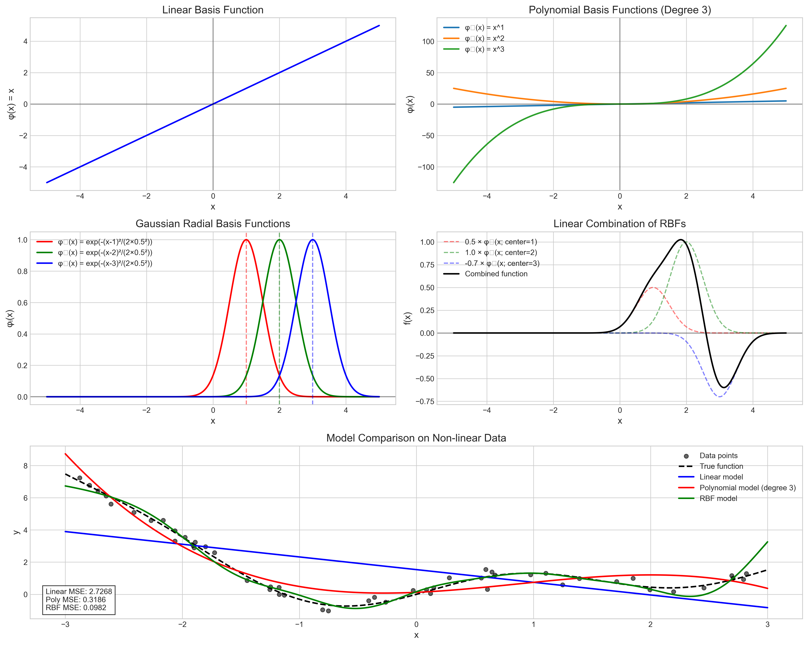
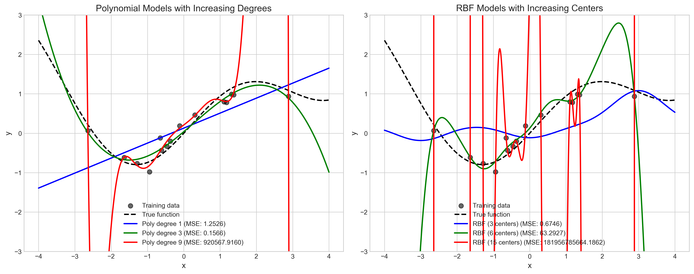
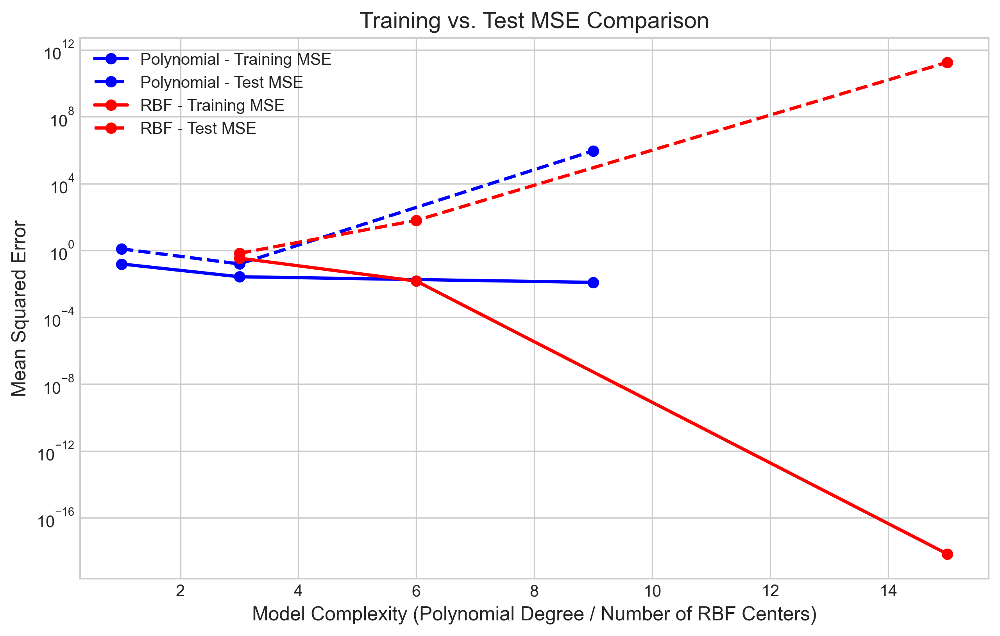

# Question 20: Generalized Linear Models with Basis Functions

## Problem Statement
In this question, we explore how Generalized Linear Models (GLMs) extend basic linear regression through the use of different basis functions. We'll investigate how these basis functions transform the input space to model complex, non-linear relationships while still maintaining the computational benefits of linear models.

### Task
1. Explain how generalized linear models extend basic linear regression.
2. Define and compare at least two different basis functions (linear, polynomial, radial basis functions, etc.).
3. Recommend which basis functions to use for datasets with highly non-linear patterns.

## Understanding the Problem
Generalized Linear Models are an important extension of linear regression that allow us to model non-linear relationships while preserving the computational and analytical benefits of linear methods. The key insight is that by transforming the input features through basis functions, we can perform linear regression in the transformed space to capture non-linear patterns in the original space.

Understanding how different basis functions behave and their relative strengths and weaknesses is crucial for applying GLMs effectively to real-world problems. This knowledge allows us to choose the most appropriate model for a given dataset and avoid issues such as overfitting or underfitting.

## Solution

### Step 1: How Generalized Linear Models Extend Linear Regression
In basic linear regression, we model the target variable as a linear combination of input features:

$$f(x) = w_0 + w_1x_1 + w_2x_2 + \ldots + w_nx_n$$

Generalized Linear Models extend this approach by applying transformations to the inputs through basis functions:

$$f(x) = w_0 + w_1\phi_1(x) + w_2\phi_2(x) + \ldots + w_m\phi_m(x)$$

Where $\phi_i(x)$ are basis functions that transform the input features.

Despite these transformations, GLMs preserve linear optimization techniques because:
1. The model remains linear in the parameters $(w_0, w_1, \ldots, w_m)$
2. The same linear algebra methods can be used for parameter estimation
3. The objective function (like sum of squared errors) maintains the same form
4. The normal equations for finding the optimal weights remain valid

This means we can use the same efficient optimization methods as linear regression while gaining the ability to model non-linear relationships in the original input space.

### Step 2: Defining Different Basis Functions
Let's explore three common types of basis functions used in GLMs:

**a) Linear Basis Function:**
```
φ(x) = x
```
This is the simplest basis function and gives us the standard linear model where the input is used directly.

**b) Polynomial Basis Functions (Degree 3):**
```
φ₁(x) = x
φ₂(x) = x²
φ₃(x) = x³
```
Polynomial basis functions transform the input into powers of x up to a specified degree. This allows the model to capture non-linear relationships with curved shapes.

**c) Gaussian Radial Basis Functions:**
```
φᵢ(x) = exp(-(x-cᵢ)²/(2σ²))
```
Where cᵢ is the center of the basis function and σ is the width parameter. These functions create localized "bumps" centered at specific points with controlled width, allowing the model to capture complex local patterns.

### Step 3: Visualizing the Basis Functions
To better understand how these basis functions behave, we can visualize them:



This visualization shows:
1. The linear basis function as a straight line
2. Polynomial basis functions with increasing curvature for higher powers
3. Gaussian RBFs as localized bell-shaped curves
4. A demonstration of how RBFs can be linearly combined to model complex functions
5. A comparison of different models (linear, polynomial, RBF) on non-linear data

When comparing these models on non-linear data, we observe:
- Linear model (MSE: 2.7268) fails to capture the non-linear pattern
- Polynomial model (MSE: 0.3186) fits the overall trend but struggles with local variations
- RBF model (MSE: 0.0982) captures both global and local patterns effectively

### Step 4: Understanding Overfitting with Different Basis Functions
As we increase the complexity of our basis functions, we risk overfitting to the training data:



For polynomial models:
- Low degree (1): Underfits the data (high bias)
- Medium degree (3): Balances bias and variance
- High degree (9): Overfits severely, especially outside the training range

For RBF models:
- Few centers (3): Provides a smoother fit that generalizes better
- Medium centers (6): Captures more local variations while maintaining generalization
- Many centers (15): Can overfit but tends to be more stable than high-degree polynomials

The relationship between model complexity and error is further illustrated in this chart:



This demonstrates the classic bias-variance tradeoff:
- As complexity increases, training error always decreases
- Test error forms a U-shape: decreases initially, then increases due to overfitting
- RBF models tend to show more graceful degradation with increasing complexity compared to polynomials

### Step 5: Comparing Basis Functions

**Polynomial Basis Functions**

*Advantages:*
1. Simple to implement and interpret
2. Good for smooth, global trends
3. Efficient computation for low degrees
4. Well-studied mathematical properties
5. Can exactly represent many common functions

*Disadvantages:*
1. Prone to severe overfitting with high degrees
2. Poor extrapolation beyond training data
3. Ill-conditioned for high degrees (numerical instability)
4. Global nature means local changes affect the entire curve
5. Not suitable for periodic or highly localized patterns

**Radial Basis Functions**

*Advantages:*
1. Excellent for local patterns and irregularities
2. More stable outside training range (bounded activation)
3. Universal approximation capability for any continuous function
4. Each basis function affects only a local region
5. Robust to outliers with proper center and width selection

*Disadvantages:*
1. Requires choosing centers and widths (hyperparameter selection)
2. Can be computationally expensive with many centers
3. Less interpretable than polynomials
4. May require more parameters for global trends
5. Determining optimal center placement can be challenging

### Step 6: Recommendations for Highly Non-linear Data
For datasets with highly non-linear patterns, the following approach is recommended:

**1. Primary Recommendation: Radial Basis Functions**
- RBFs excel at capturing complex, localized patterns
- They provide more stable extrapolation behavior
- They're less prone to catastrophic overfitting
- Strategies for implementation:
  - Use k-means clustering to determine centers
  - Adjust width parameter based on data density
  - Consider regularization to prevent overfitting

**2. Alternative Approach: Combination of Basis Functions**
- Combine polynomial terms (for global trends) with RBFs (for local patterns)
- This hybrid approach can capture both smooth global behavior and local irregularities
- Example: $f(x) = w_0 + w_1x + w_2x^2 + w_3\phi_1(x) + w_4\phi_2(x) + \ldots$

**3. Implementation Considerations:**
- Start simple and gradually increase complexity
- Use cross-validation to select optimal hyperparameters
- Monitor training vs. validation error to detect overfitting
- Consider regularization techniques (L1/L2) to control model complexity
- For very complex patterns, consider modern approaches like:
  - Gaussian Processes (extension of RBF approach)
  - Spline-based methods
  - Neural networks with appropriate activation functions

## Visual Explanations

### Basis Functions Comparison


This comprehensive visualization shows:
- The top row compares the linear basis function (left) with polynomial basis functions (right)
- The middle row shows individual Gaussian RBFs (left) and how they can be linearly combined (right)
- The bottom row demonstrates how different models perform on non-linear data, with RBF achieving the lowest error

### Overfitting Demonstration


This figure illustrates:
- Left: How polynomial models of different degrees fit to sparse training data
- Right: How RBF models with different numbers of centers fit to the same data
- Both plots show how higher complexity can lead to overfitting, with polynomials showing more extreme behavior

### MSE Comparison


This plot shows:
- The relationship between model complexity and error for both training and test data
- How training error consistently decreases with model complexity
- How test error follows a U-shaped curve, illustrating the bias-variance tradeoff
- That RBF models tend to degrade more gracefully than polynomial models as complexity increases

## Key Insights

### Theoretical Foundations
- GLMs extend linear regression by applying transformations through basis functions
- Despite these transformations, the model remains linear in its parameters
- This preserves the computational and mathematical benefits of linear methods
- The choice of basis functions determines the model's flexibility and capability to capture non-linear patterns
- A model is only as good as its basis functions' ability to represent the underlying pattern

### Practical Considerations
- Polynomial basis functions are simple and work well for smooth, global trends
- RBFs excel at capturing local, complex patterns with better extrapolation behavior
- Higher model complexity increases the risk of overfitting
- The bias-variance tradeoff is central to choosing the right level of model complexity
- Cross-validation is essential for selecting optimal hyperparameters
- For highly non-linear data, RBFs generally outperform polynomial basis functions

### Advanced Applications
- Combining different types of basis functions can leverage the strengths of each
- Modern extensions like Gaussian Processes build on the RBF approach
- Regularization techniques can help control model complexity
- The principles of basis function expansion extend to higher-dimensional inputs
- Many advanced machine learning methods (kernels, splines, neural networks) share conceptual foundations with GLMs

## Conclusion
- Generalized Linear Models with basis functions provide a powerful framework for modeling non-linear relationships while preserving the computational benefits of linear models.
- Polynomial basis functions are simple and effective for smooth trends, but prone to overfitting at high degrees.
- Radial Basis Functions excel at capturing complex local patterns and generally provide better extrapolation behavior.
- For highly non-linear data, RBFs are recommended, potentially combined with low-degree polynomial terms.
- The key to successful application is balancing model complexity through careful selection of basis functions and appropriate regularization.

Understanding these basis function approaches provides a solid foundation for more advanced machine learning techniques and offers practical tools for tackling a wide range of regression problems. 