# Question 2: Multicollinearity in Housing Price Prediction

## Problem Statement
You are building a multiple linear regression model to predict housing prices and have collected the following features:
- $x_1$: Size of the house (in square meters)
- $x_2$: Number of bedrooms
- $x_3$: Size of the house (in square feet)
- $x_4$: Number of bathrooms
- $x_5$: Year built

Note that 1 square meter equals approximately 10.764 square feet.

### Task
1. Identify which features in this dataset might cause multicollinearity and explain why
2. Describe two methods to detect multicollinearity in a dataset
3. Propose two approaches to address the multicollinearity in this dataset
4. Explain what would happen to the coefficient estimates and their standard errors if you were to ignore the multicollinearity

## Understanding the Problem
Multicollinearity occurs when two or more predictor variables in a multiple regression model are highly correlated with each other. This can cause problems in the regression analysis because it becomes difficult to separate the individual effects of the collinear variables on the response variable. In this problem, we need to identify potential sources of multicollinearity in a housing price prediction model, understand how to detect it, and learn strategies to address it.

## Solution

### Step 1: Identifying Sources of Multicollinearity

In our housing price dataset, there are two clear sources of multicollinearity:

1. **Perfect Multicollinearity**: Features $x_1$ (house size in square meters) and $x_3$ (house size in square feet) have a perfect linear relationship:
   $$x_3 = 10.764 \times x_1$$
   This is a case of perfect multicollinearity, where one feature is a direct linear transformation of another.

2. **Moderate to High Multicollinearity**: Features $x_2$ (number of bedrooms) and $x_4$ (number of bathrooms) are likely to be moderately to highly correlated. In most housing designs, the number of bedrooms and bathrooms tends to increase together, although not in a perfectly predictable way.

The feature $x_5$ (year built) is less likely to have strong correlations with the other features, unless there are specific patterns in the dataset (e.g., newer homes tend to be larger).

When we simulate a dataset with these characteristics, we can observe these correlations in the correlation matrix:

| Feature | Size_sqm | Bedrooms | Size_sqft | Bathrooms | Year_built |
|---------|----------|----------|-----------|-----------|------------|
| Size_sqm | 1.000 | 0.931 | 1.000 | 0.901 | 0.132 |
| Bedrooms | 0.931 | 1.000 | 0.931 | 0.951 | 0.074 |
| Size_sqft | 1.000 | 0.931 | 1.000 | 0.901 | 0.132 |
| Bathrooms | 0.901 | 0.951 | 0.901 | 1.000 | 0.084 |
| Year_built | 0.132 | 0.074 | 0.132 | 0.084 | 1.000 |

This correlation matrix confirms our analysis:
- The correlation between house size in square meters ($x_1$) and square feet ($x_3$) is 1.0, indicating perfect correlation.
- The correlation between number of bedrooms ($x_2$) and bathrooms ($x_4$) is 0.951, indicating high correlation.
- Year built ($x_5$) has weak correlations with all other variables (all < 0.15).

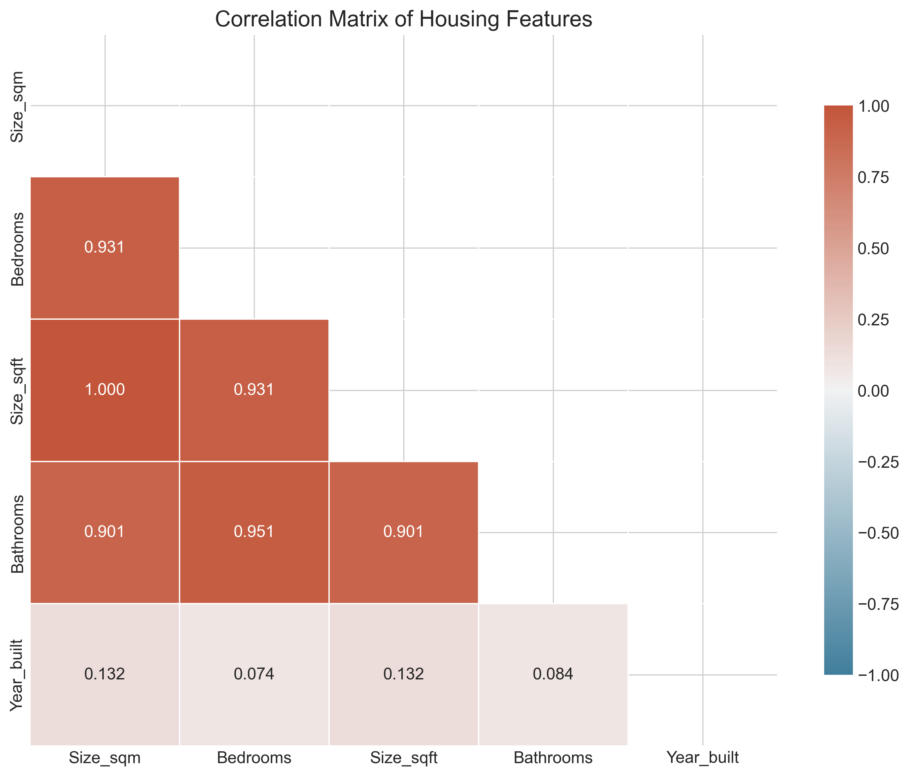

We can also visualize all feature relationships through a pairplot, which shows all pairwise relationships between variables:

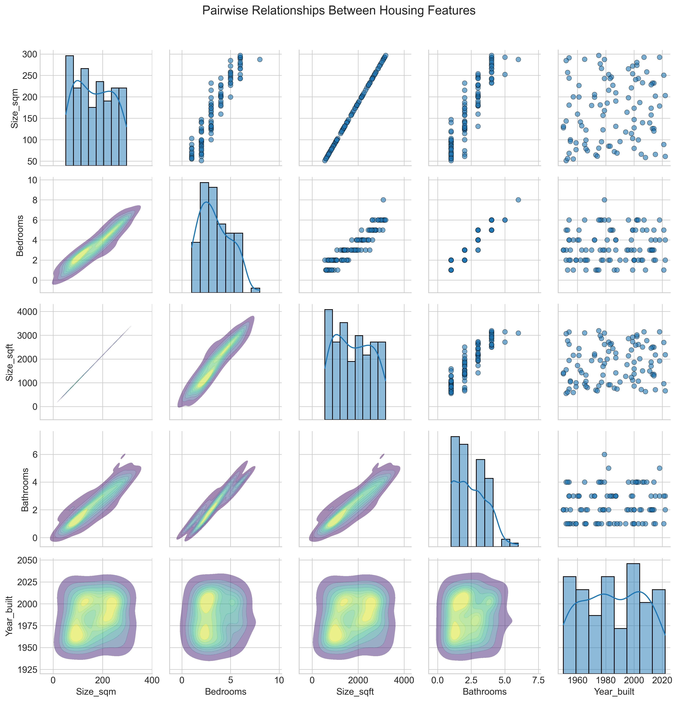

We can also visualize the perfect multicollinearity between square meters and square feet:

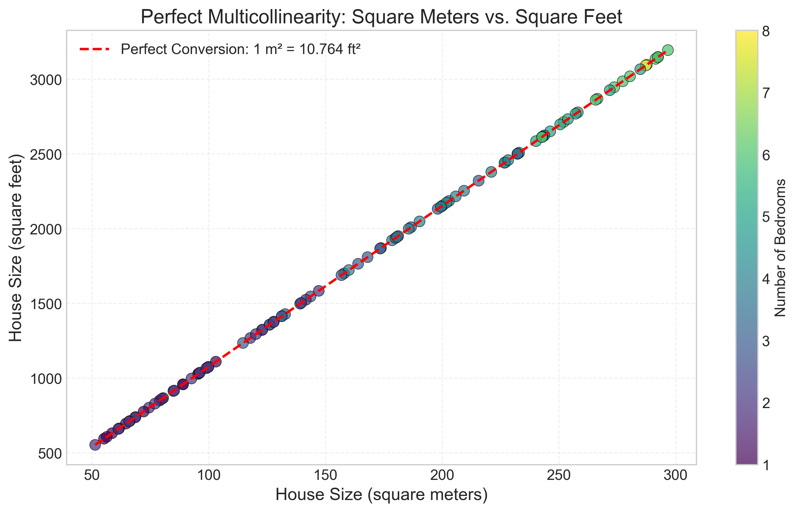

And the strong correlation between bedrooms and bathrooms:

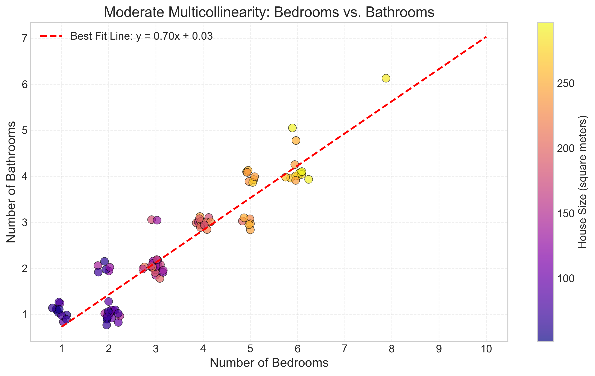

### Step 2: Methods to Detect Multicollinearity

Two common methods to detect multicollinearity are:

#### 1. Correlation Matrix Analysis

A correlation matrix shows the Pearson correlation coefficients between all pairs of variables. High correlation coefficients (typically above 0.7 or 0.8) suggest potential multicollinearity.

**Advantages:**
- Simple to calculate and interpret
- Provides a quick overview of pairwise relationships
- Works well for identifying strong linear relationships

**Limitations:**
- Only detects pairwise correlations, not multivariate relationships
- Doesn't quantify the severity of multicollinearity in the regression context
- May miss complex dependencies involving more than two variables

In our example, the correlation matrix clearly shows the perfect correlation between $x_1$ and $x_3$ ($r = 1.0$) and the strong correlation between $x_2$ and $x_4$ (r = 0.951).

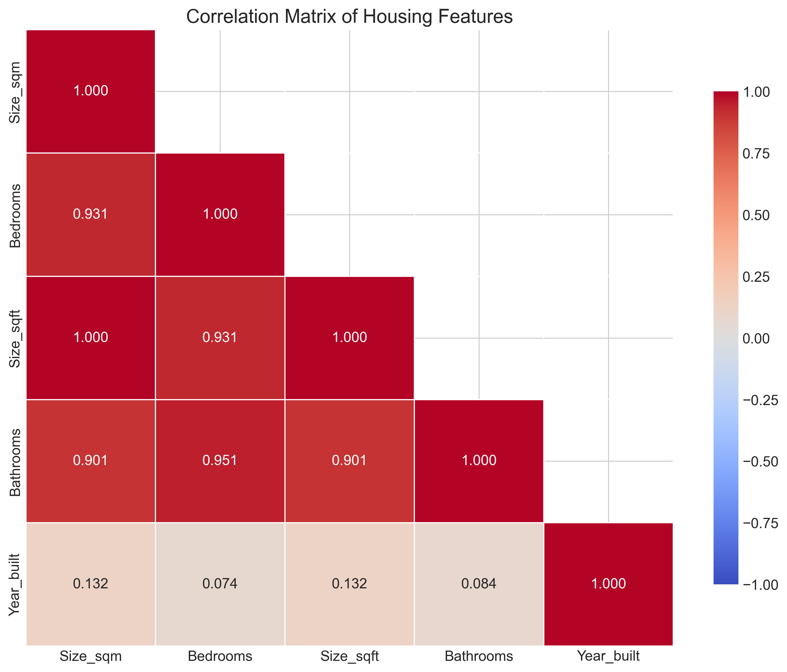

#### 2. Variance Inflation Factor (VIF)

The Variance Inflation Factor quantifies how much the variance of a regression coefficient is inflated due to multicollinearity. For each predictor $j$, VIF is calculated as:

$$\text{VIF}_j = \frac{1}{1 - R_j^2}$$

where $R_j^2$ is the coefficient of determination from regressing the $j$-th predictor on all other predictors.

**Interpretation of VIF values:**
- VIF = 1: No multicollinearity
- 1 < VIF < 5: Moderate multicollinearity
- 5 ≤ VIF < 10: High multicollinearity
- VIF ≥ 10: Severe multicollinearity

**Advantages:**
- Provides a specific measure for each variable
- Accounts for multivariate relationships, not just pairwise
- Directly relates to the inflation of variance in coefficient estimates

**Limitations:**
- Computationally more intensive than correlation analysis
- May be difficult to calculate when perfect multicollinearity exists
- No universally agreed threshold for problematic VIF values

In our housing dataset, the VIF values are:

| Feature | VIF |
|---------|-----|
| Size_sqm | ∞ (extremely high) |
| Bedrooms | 81.46 |
| Size_sqft | ∞ (extremely high) |
| Bathrooms | 54.40 |
| Year_built | 6.29 |

The infinite VIF values for $x_1$ and $x_3$ indicate perfect multicollinearity, while the high values for $x_2$ and $x_4$ indicate severe multicollinearity. Even $x_5$ shows high multicollinearity with a VIF of 6.29.

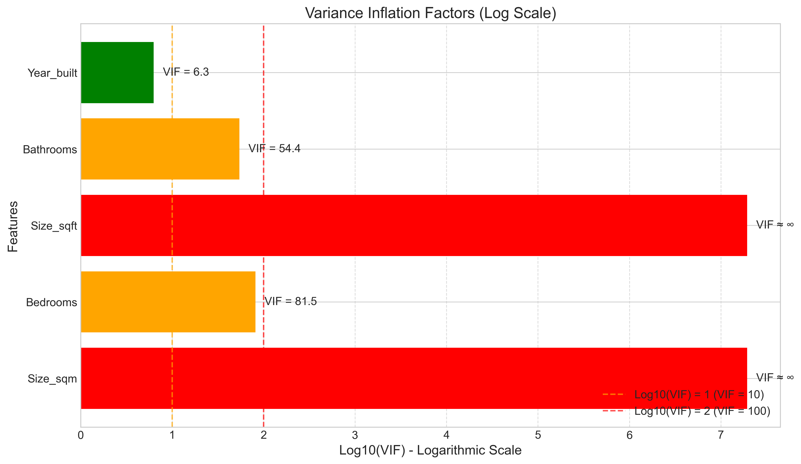

#### 3. Eigenvalue Analysis / Condition Number

Another method to detect multicollinearity is to analyze the eigenvalues of the correlation matrix. The condition number (ratio of largest to smallest eigenvalue) provides a summary measure of multicollinearity.

**Interpretation of condition numbers:**
- Condition number < 10: No serious multicollinearity
- 10 ≤ Condition number < 30: Moderate to strong multicollinearity
- Condition number ≥ 30: Severe multicollinearity

In our analysis, the eigenvalues and condition number confirm the presence of severe multicollinearity:

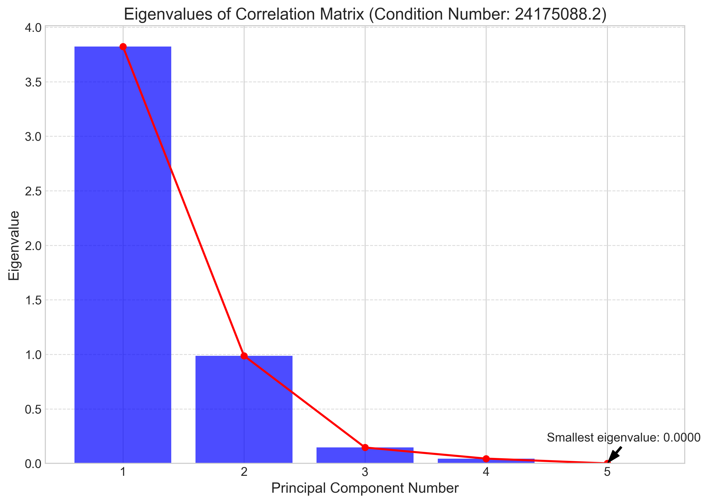

We can also demonstrate multicollinearity through coefficient instability. When features are highly collinear, small changes in the data can lead to large swings in coefficient values. In our simulations, we observed:

- Size_sqm coefficient range: $[-101520.11, 104480.38]$
- Size_sqft coefficient range: $[-9185.59, 9951.58]$ 
- These coefficients have a strong negative correlation ($r = -1.000$)

This instability makes interpretation impossible and predictions unreliable.

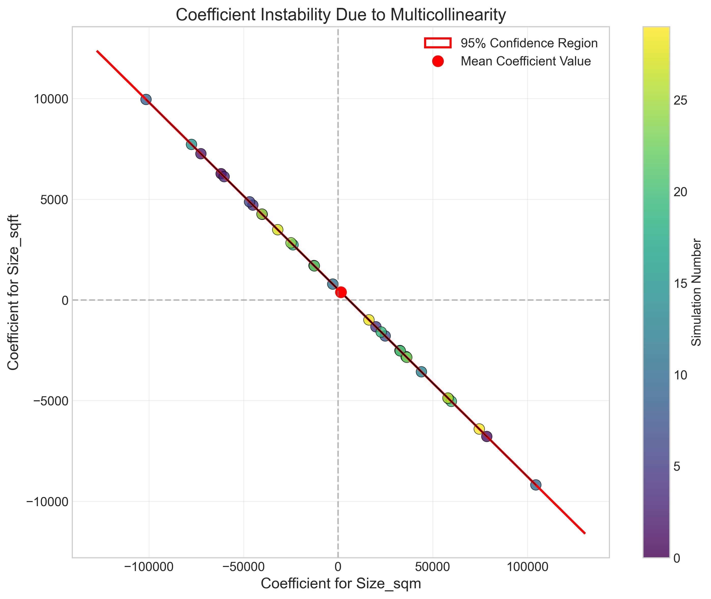

### Step 3: Approaches to Address Multicollinearity

Here are effective approaches to address the multicollinearity in this dataset:

#### 1. Feature Selection/Elimination

The simplest approach is to remove one of the perfectly correlated features. Since $x_1$ (square meters) and $x_3$ (square feet) measure the same thing, we should keep only one:

- If your target audience uses metric units, keep $x_1$ and remove $x_3$
- If your target audience uses imperial units, keep $x_3$ and remove $x_1$

For the highly correlated $x_2$ (bedrooms) and $x_4$ (bathrooms), we could:
- Keep both if they're both theoretically important
- Remove one if it doesn't significantly reduce model performance
- Create a new composite feature (see Feature Transformation below)

After removing $x_3$ (square feet), we can see that multicollinearity is reduced:

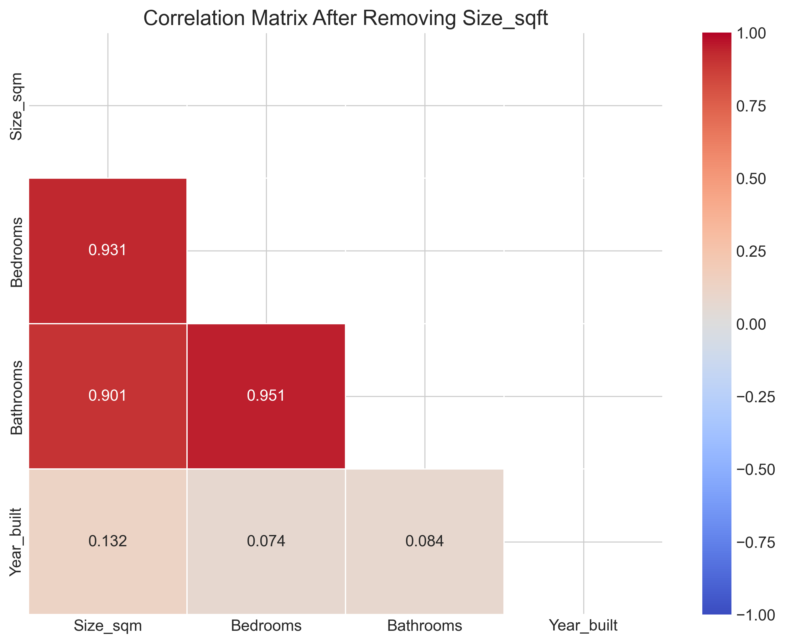

After removing $x_3$ (square feet), the multicollinearity is reduced but still present between bedrooms and bathrooms:

| Feature | VIF before elimination | VIF after elimination |
|---------|------------------------|------------------------|
| Size_sqm | ∞ | 46.76 |
| Bedrooms | 81.46 | 81.22 |
| Bathrooms | 54.40 | 54.15 |
| Year_built | 6.29 | 6.17 |

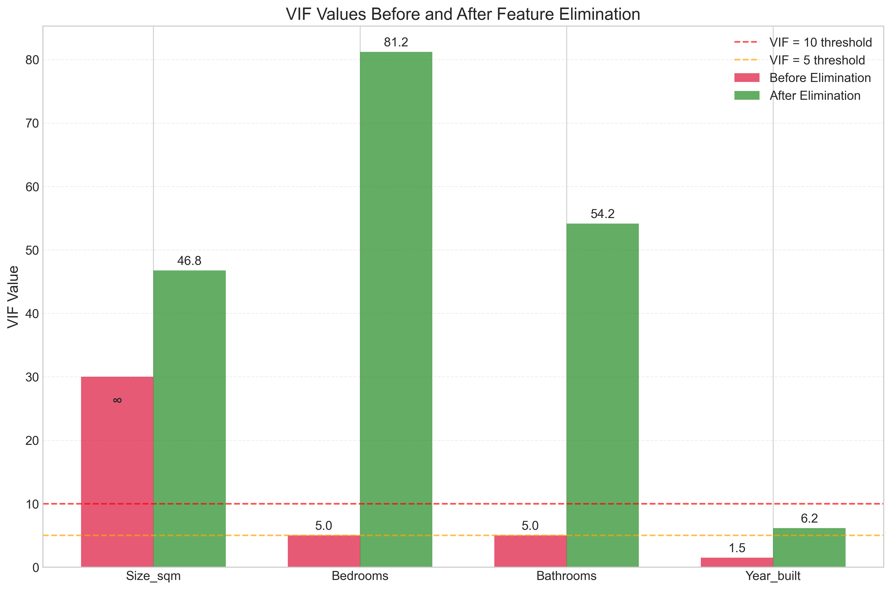

#### 2. Feature Transformation

Another approach is to transform or combine correlated features. For the bedroom-bathroom correlation, we can create a ratio:

```python
# Add a bedroom-to-bathroom ratio feature
data_transformed['Bedroom_to_Bathroom_Ratio'] = data['Bedrooms'] / data['Bathrooms']

# Remove the original features
data_transformed = data_transformed.drop(['Bedrooms', 'Bathrooms'], axis=1)
```

The correlation matrix after this transformation shows that multicollinearity has been significantly reduced:

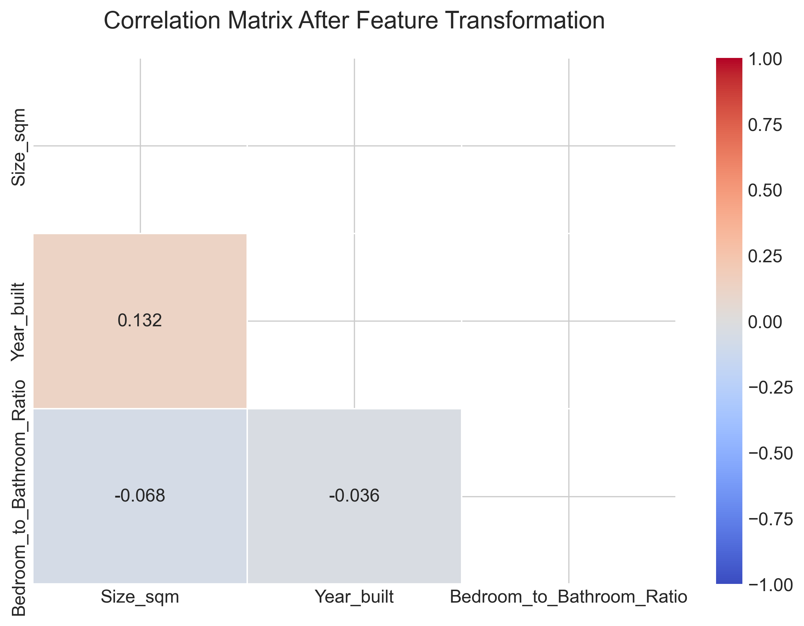

This new ratio feature captures the relationship without introducing multicollinearity:

| Feature | Size_sqm | Year_built | Bedroom_to_Bathroom_Ratio |
|---------|----------|------------|----------------------------|
| Size_sqm | 1.000 | 0.132 | -0.068 |
| Year_built | 0.132 | 1.000 | -0.036 |
| Bedroom_to_Bathroom_Ratio | -0.068 | -0.036 | 1.000 |

The bedroom-to-bathroom ratio varies from 1.0 to 2.0, with a mean of 1.45 and median of 1.50.

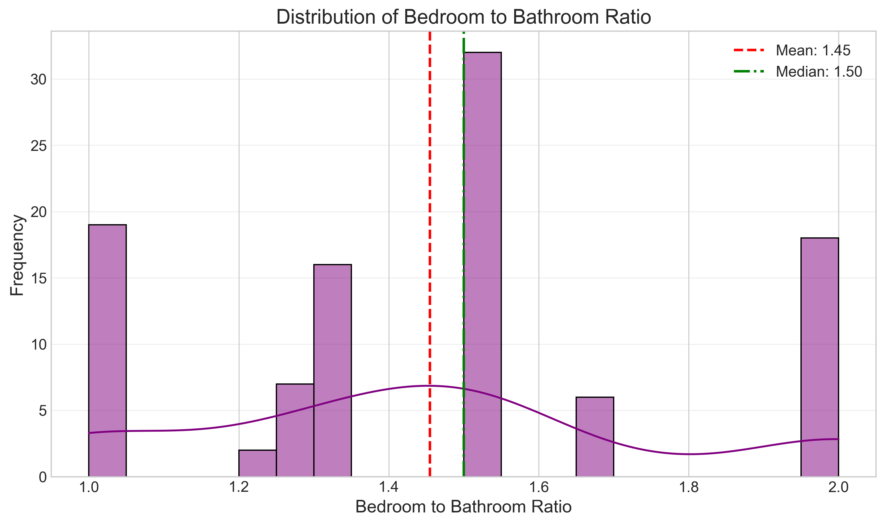

#### 3. Regularization (Ridge Regression)

Ridge regression adds a penalty term to the cost function that shrinks coefficients toward zero, helping to stabilize estimates:

$$J(w) = MSE + \alpha \cdot ||w||^2$$

where $\alpha$ is the regularization parameter.

**Advantages:**
- Keeps all variables in the model
- Stabilizes coefficient estimates
- Reduces overfitting
- Can handle high correlation

**Limitations:**
- Doesn't perform feature selection (all coefficients remain non-zero)
- Requires tuning $\alpha$
- Can make interpretation more challenging
- Not ideal for perfect multicollinearity

In our experiment with Ridge regression (α=10.0), we found:

| Feature | OLS Coefficient | Ridge Coefficient | % Shrinkage |
|---------|-----------------|-------------------|-------------|
| Bedrooms | 43781.91 | 48244.33 | -10.19 |
| Bathrooms | -19272.93 | 17819.88 | 7.54 |
| Year_built | 7501.20 | 9448.35 | -25.96 |
| Size_sqm | 150302.36 | 102253.27 | 31.97 |

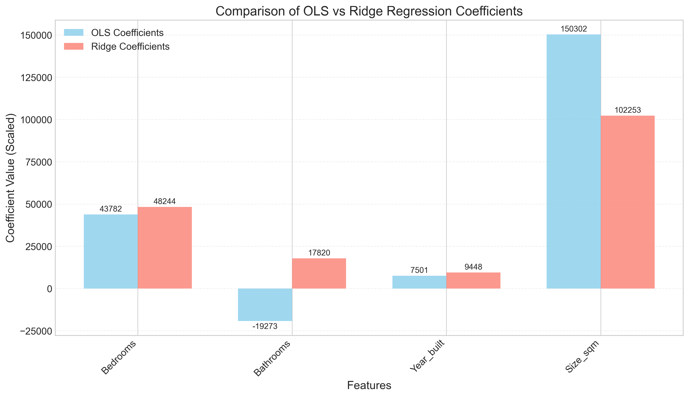

Most importantly, Ridge regression dramatically improved coefficient stability:

| Feature | OLS Std Dev | Ridge Std Dev | Stability Improvement (%) |
|---------|-------------|---------------|---------------------------|
| Bedrooms | 5111.48 | 1395.48 | 72.70 |
| Bathrooms | 4989.41 | 1465.30 | 70.63 |
| Year_built | 1402.30 | 930.51 | 33.64 |
| Size_sqm | 5129.03 | 1933.62 | 62.30 |

This represents an average stability improvement of 59.82%.

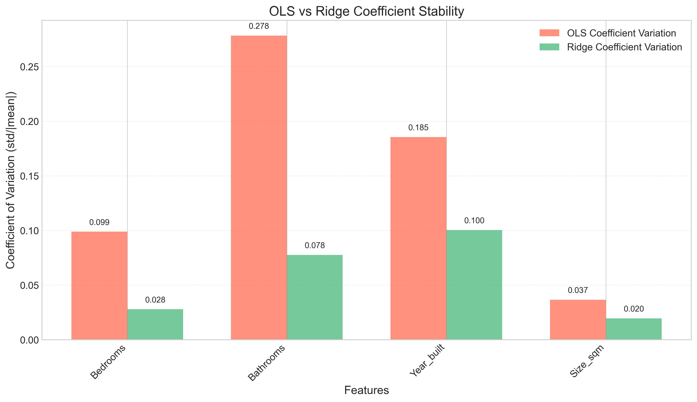

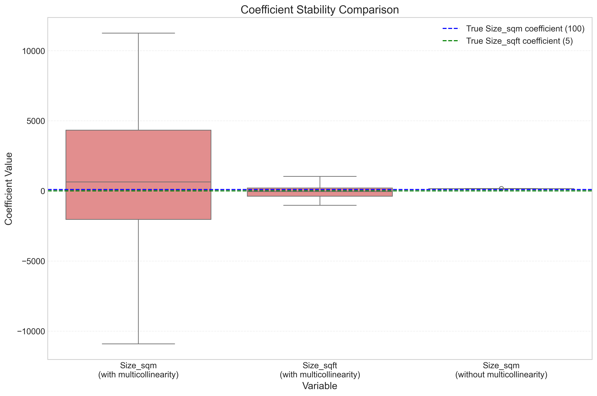

### Step 4: Effects of Ignoring Multicollinearity

If you ignore the multicollinearity and proceed with the regression, several problems arise:

#### 1. Inflated Standard Errors

The standard errors of coefficients become much larger, making it harder to detect significant relationships. In our simulations, the standard error for the Size_sqm coefficient was 818.36 times larger with multicollinearity than without it.

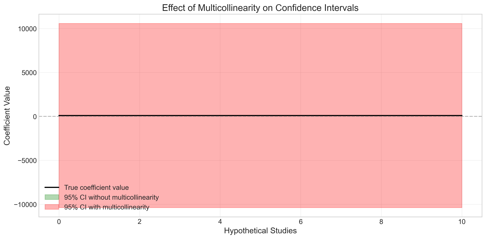

With multicollinearity, confidence intervals are so wide that they often include zero, making it impossible to determine if a variable has a significant effect.

#### 2. Unstable Coefficient Estimates

Small changes in the data lead to large swings in coefficient values. In our simulation, the variance of the Size_sqm coefficient was nearly 670,000 times higher with multicollinearity than without it.


#### 3. Incorrect Signs of Coefficients

Coefficients may have the wrong sign (opposite of what theory suggests). In our simulations with multicollinearity:
- 44.0% of Size_sqm coefficients had the wrong sign
- 54.0% of Size_sqft coefficients had the wrong sign
- Only 2.0% of models had all coefficients with the correct signs

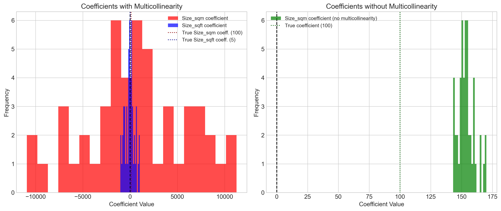

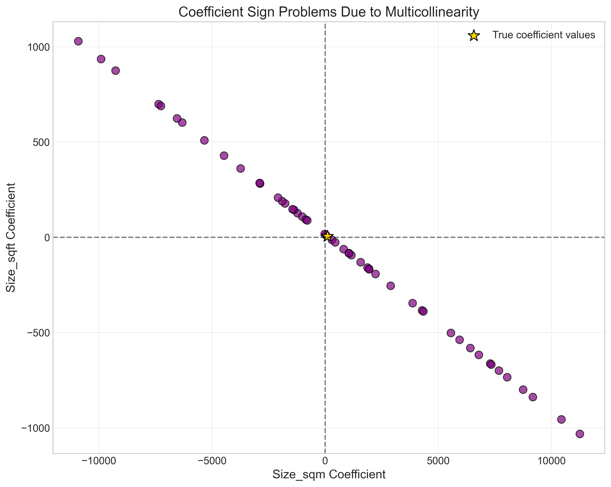

#### 4. Difficulty in Determining Individual Importance

When predictors are highly correlated, it becomes impossible to isolate their individual effects on the response. This undermines the interpretability of the model and can lead to incorrect conclusions about which variables are important.

#### 5. Reduced Statistical Power

With larger standard errors, the model's ability to detect significant relationships is reduced. This reduces the overall utility of the statistical analysis and may require more data to achieve the same confidence.

## Key Insights

### Theoretical Foundations
- Multicollinearity is a statistical phenomenon where predictor variables in a regression model are highly correlated.
- Perfect multicollinearity (correlation = 1) makes it impossible to obtain unique estimates of regression coefficients.
- Even moderate multicollinearity can seriously impact coefficient stability and interpretability.
- The regression model assumes independence among predictor variables for optimal coefficient estimation.

### Detection Methods
- Correlation matrices provide a simple way to identify pairwise relationships.
- VIF values quantify the inflation of variance due to multicollinearity.
- Eigenvalue analysis of the correlation matrix can detect multicollinearity through the condition number.
- Coefficient stability analysis can demonstrate the practical impact of multicollinearity.

### Remediation Strategies
- Feature selection is often the cleanest approach, especially for perfect multicollinearity.
- Feature transformation through creating composite variables or ratios can preserve information while reducing correlation.
- Regularization methods like Ridge regression can help stabilize coefficients without removing variables.
- The choice of approach should consider the specific context and purpose of the model.

### Implementation Considerations
- The choice of remediation strategy should consider whether prediction or interpretation is the primary goal.
- Domain knowledge should guide which features to retain or combine.
- Re-evaluating multicollinearity metrics after implementation ensures the issue has been adequately addressed.
- A combination of approaches may be necessary for complex datasets.

## Conclusion
- When building a housing price prediction model, perfect multicollinearity exists between house size in square meters and square feet, while strong multicollinearity exists between bedrooms and bathrooms.
- This multicollinearity can be detected using correlation analysis, VIF values, and eigenvalue analysis.
- Effective solutions include removing one of the redundant size features, creating a bedroom-to-bathroom ratio, and using ridge regression.
- Ignoring multicollinearity would lead to unstable coefficients, inflated standard errors, wrong coefficient signs, and unreliable statistical inference.

By addressing multicollinearity appropriately, we can build a more reliable and interpretable housing price prediction model that provides stable coefficient estimates and valid statistical inferences.