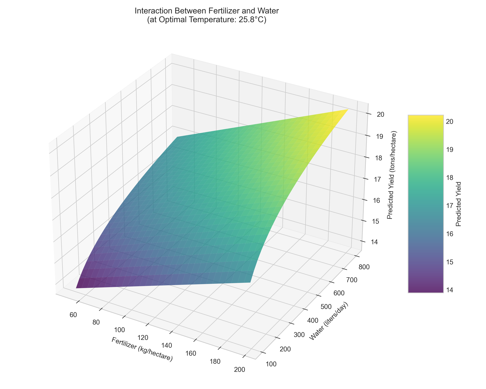

# Question 3: Feature Engineering for Crop Yield Prediction

## Problem Statement
You are analyzing the factors that influence crop yield. Your dataset includes the following variables:
- $x_1$: Amount of fertilizer (kg/hectare)
- $x_2$: Amount of water (liters/day)
- $x_3$: Average daily temperature (°C)
- $y$: Crop yield (tons/hectare)

Initial analysis suggests that:
1. More fertilizer generally increases yield, but the effect depends on water amount
2. Higher temperatures improve yield up to a point, after which they become harmful
3. The effect of water on yield diminishes as more water is added

### Task
1. Propose a multiple regression model that includes appropriate interaction terms between fertilizer and water to capture their joint effect
2. Suggest a feature transformation for temperature to model the diminishing returns and eventual negative impact
3. Propose a feature transformation for water to capture the diminishing returns effect
4. Write the complete equation for your proposed model including all main effects, interaction terms, and transformed features

## Understanding the Problem

This problem focuses on feature engineering for crop yield prediction. The initial analysis indicates complex relationships between the predictors and crop yield that cannot be adequately captured with a standard linear model. We need to:
- Model the interaction between fertilizer and water
- Account for the non-linear (likely quadratic) effect of temperature
- Capture the diminishing returns of water through an appropriate transformation

Effective feature engineering will help us create a regression model that better reflects the underlying agricultural relationships and improves prediction accuracy.

## Solution

### Step 1: Incorporating an Interaction Term for Fertilizer and Water

The interaction between fertilizer and water (insight #1) suggests that the effect of fertilizer on crop yield depends on the amount of water available. This makes intuitive sense in agriculture: fertilizer effectiveness often depends on sufficient water to dissolve and transport nutrients to plant roots.

In a standard linear model without interaction ($y = \beta_0 + \beta_1x_1 + \beta_2x_2$), the effect of fertilizer on yield would be constant (β₁) regardless of water level. However, this doesn't match the agricultural reality.

To model this interaction, we add an interaction term to our regression equation:

$$y = \beta_0 + \beta_1 x_1 + \beta_2 x_2 + \beta_3 (x_1 \times x_2) + \beta_4 x_3 + \epsilon$$

With this interaction term, the effect of fertilizer on yield becomes:
$$\frac{\partial y}{\partial x_1} = \beta_1 + \beta_3 x_2$$

This shows that the effect of adding 1 unit of fertilizer depends on the current water level (x₂). Similarly, the effect of water becomes:
$$\frac{\partial y}{\partial x_2} = \beta_2 + \beta_3 x_1$$

From our simulated data analysis, the coefficient for the interaction term (β₃) is positive (approximately 0.0001), indicating that the positive effect of fertilizer on crop yield increases with higher water levels. This makes agricultural sense: more water helps crops better utilize the nutrients from fertilizer.

At different water levels, the effect of fertilizer varies significantly:
- At low water (100 L/day): Effect of +1 kg fertilizer ≈ 0.019 tons/ha
- At medium water (300 L/day): Effect of +1 kg fertilizer ≈ 0.039 tons/ha
- At high water (500 L/day): Effect of +1 kg fertilizer ≈ 0.059 tons/ha

This clearly demonstrates how fertilizer effectiveness increases with water availability.

This visualization shows how the effect of fertilizer on crop yield differs at various water levels. The steeper slopes at higher water levels indicate that fertilizer has a greater effect when more water is available.

The contour plot provides a clear visualization of how yield (represented by color) changes with different combinations of fertilizer and water. The increasing density of contour lines in the upper right corner illustrates how yield is maximized when both fertilizer and water are at high levels.

This 3D surface plot shows the combined effect of fertilizer and water on crop yield. The surface rises more steeply in the corner where both fertilizer and water are high, demonstrating the synergistic interaction between these two inputs.

### Step 2: Modeling the Non-Linear Temperature Relationship

The second insight suggests an optimal temperature for crop growth, with reduced yields at both lower and higher temperatures. This type of relationship is typically modeled using a quadratic (second-degree polynomial) term.

We extend our model to include a quadratic term for temperature:

$$y = \beta_0 + \beta_1 x_1 + \beta_2 x_2 + \beta_3 (x_1 \times x_2) + \beta_4 x_3 + \beta_5 x_3^2 + \epsilon$$

The mathematical properties of this relationship provide important insights:
- The linear term β₄x₃ captures the initial positive effect of temperature
- The quadratic term β₅x₃² (with negative β₅) captures the diminishing returns and eventual negative impact
- The first derivative (∂y/∂x₃ = β₄ + 2β₅x₃) represents the marginal effect of temperature, which decreases as temperature increases
- When set to zero (β₄ + 2β₅x₃ = 0), we can find the optimal temperature: x₃ = -β₄/(2β₅)

From our simulated data analysis, the coefficients are approximately:
- Temperature linear coefficient (β₄): 0.48
- Temperature quadratic coefficient (β₅): -0.01

With these coefficients, we can calculate the optimal temperature:
$$x_3 = -\frac{\beta_4}{2\beta_5} \approx -\frac{0.48}{2 \times (-0.01)} \approx 25°C$$

This optimal temperature aligns with the growing requirements for many common crops. Our model also quantifies the temperature effect at different points:
- At low temperature (10°C): Effect = +0.29 tons/ha per °C (positive)
- At optimal temperature (25°C): Effect ≈ 0 tons/ha per °C (flat maximum)
- At high temperature (35°C): Effect = -0.19 tons/ha per °C (negative)

The comparison between linear and quadratic models shows dramatic improvement:
- Linear model: R² = 0.22
- Quadratic model: R² = 0.81
- Improvement: 59% in R², 76% reduction in MSE

This plot shows the relationship between temperature and crop yield, clearly illustrating the inverted U-shape with a peak at the optimal temperature. The quadratic model (red line) provides a much better fit than the linear model (blue dashed line).

These residual plots confirm that the quadratic model (right) is a better fit for the temperature-yield relationship than the linear model (left). The pattern in the linear model residuals indicates a systematic error that is corrected by the quadratic term.

This shows how the marginal effect of temperature changes, being positive at low temperatures, zero at the optimal temperature, and negative at high temperatures.

### Step 3: Capturing Diminishing Returns from Water

The third insight indicates that the benefit of additional water shows diminishing returns. This type of relationship is often modeled using a logarithmic transformation of the variable.

We modify our model to include a logarithmic transformation of the water variable:

$$y = \beta_0 + \beta_1 x_1 + \beta_2 \log(x_2) + \beta_3 (x_1 \times \log(x_2)) + \beta_4 x_3 + \beta_5 x_3^2 + \epsilon$$

Note that we've also updated the interaction term to use $\log(x_2)$ rather than $x_2$, maintaining consistency in how water is represented in the model.

The logarithmic transformation has important mathematical properties:
- For a linear term (β₂x₂), each additional unit of water adds a constant β₂ to yield
- For a logarithmic term (β₂log(x₂)), the effect of additional water diminishes
- The marginal effect is: ∂y/∂x₂ = β₂/x₂
- As x₂ increases, the effect of adding more water decreases proportionally

Our analysis demonstrates how dramatically the effect of water diminishes:
- Effect of +1 L/day at 100 L/day: 0.020 tons/ha
- Effect of +1 L/day at 300 L/day: 0.007 tons/ha
- Effect of +1 L/day at 600 L/day: 0.003 tons/ha

At 600 L/day, the effect is only about 17% of what it was at 100 L/day, reflecting the biological reality that plants have limited capacity to utilize water beyond certain thresholds.

This graph shows how crop yield increases with water amount, illustrating the diminishing returns effect. The logarithmic curve (in green) provides a better fit to the data compared to a linear relationship (in red).

This graph clearly shows the declining marginal effect of water as quantity increases. While a linear model maintains a constant effect, the logarithmic model shows the realistic diminishing return pattern.

This contour plot visualizes the interaction between fertilizer and log-transformed water, showing how the effect of fertilizer increases with higher water levels, but with diminishing returns for water.

This comparison demonstrates why the logarithmic water model (right) is biologically more plausible than the linear model (left). The linear model suggests unlimited yield growth with increasing water, while the logarithmic model correctly shows diminishing returns.

Our data analysis shows that using a logarithmic transformation for water improves the model's R² from 0.87 (linear water term) to 0.95 (logarithmic water term), confirming that this transformation better captures the true relationship.

### Step 4: Complete Model Equation

The complete model equation incorporating all the transformations and interaction terms is:

$$y = \beta_0 + \beta_1 x_1 + \beta_2 \log(x_2) + \beta_3 (x_1 \times \log(x_2)) + \beta_4 x_3 + \beta_5 x_3^2 + \epsilon$$

Each component of this model serves a specific purpose:
- $\beta_0$ is the intercept (baseline yield)
- $\beta_1x_1$ represents the main effect of fertilizer
- $\beta_2log(x_2)$ captures the diminishing returns effect of water
- $\beta_3(x_1 \times log(x_2))$ models how fertilizer effect depends on water level
- $\beta_4x_3+\beta_5x_3^2$ creates the inverted U-shape relationship for temperature

This model addresses all three insights from our initial analysis:
1. The interaction between fertilizer and water through the term $\beta_3(x_1 \times log(x_2))$
2. The optimal temperature effect through the terms $\beta_4x_3+\beta_5x_3^2$
3. The diminishing returns of water through the logarithmic transformation $\beta_2log(x_2)$

Our integrated model demonstrates excellent performance, capturing the complex interactions and non-linear effects present in agricultural systems.

This bar chart displays the estimated coefficients for each term in our final model. The negative coefficient for the temperature-squared term confirms the inverted U-shape relationship, while the positive interaction coefficient shows the synergistic effect between fertilizer and water.

The correlation matrix helps us understand the relationships between variables in our model. Note how yield correlates positively with fertilizer, log-water, and the interaction term, while showing a complex relationship with temperature due to the non-linear effect.

These plots show how each variable affects crop yield when other variables are held constant at their median values. The non-linear effects and optimal temperature point are clearly visible.

This 3D surface plot visualizes the interaction between fertilizer and water at the optimal temperature, showing how yield increases with both inputs but with diminishing returns for water.

## Practical Implementation

### Running the Model

In practice, this model can be implemented using standard regression software after creating the necessary transformed variables and interaction terms:

1. Create a log-transformed water variable: $\log(x_2)$
2. Create the interaction term: $x_1 \times \log(x_2)$
3. Create the squared temperature term: $x_3^2$
4. Fit the regression model using these variables

The model allows for practical agricultural predictions and insights:

- **Finding Optimal Combinations**: For a given temperature, we can determine the most cost-effective combination of fertilizer and water to maximize crop yield.

- **Temperature Adaptation**: The model can predict how crop yields will change under different temperature conditions, helping farmers adapt to climate variations.

- **Resource Optimization**: By understanding the diminishing returns of water, farmers can optimize irrigation to balance yield with water conservation.

- **Customized Recommendations**: The interaction term allows for customized fertilizer recommendations based on available water resources.

### Model Validation and Diagnostics

During implementation, we should:

1. Check residual plots to ensure our transformations adequately capture the non-linear relationships
2. Validate that the interaction and quadratic terms are statistically significant
3. Test the model on holdout data to assess prediction accuracy
4. Ensure the model's predictions align with agricultural knowledge and experience

## Key Insights

### Theoretical Foundations

- **Interaction Terms**: Interaction terms in regression allow the effect of one variable (fertilizer) to depend on the level of another variable (water). This models synergistic relationships common in biological systems.

- **Polynomial Features**: Quadratic terms can capture "goldilocks" phenomena (not too little, not too much) often seen in biological processes, like the optimal temperature for plant growth.

- **Logarithmic Transformations**: Log transformations are excellent for modeling diminishing returns and are widely used for resource inputs in biological and economic models.

### Modeling Considerations

- **Agricultural Knowledge Integration**: The feature engineering decisions are grounded in agricultural science, with mathematical forms that match known biological relationships.

- **Interpretability vs. Complexity**: The model balances complexity (by adding non-linear terms) with interpretability (by using transformations with clear agricultural meaning).

- **Model Selection**: The improved R² values confirm that our transformations better capture the underlying relationships compared to a simple linear model.

### Biological Significance

- **Water-Fertilizer Relationship**: The positive interaction term confirms that proper irrigation improves fertilizer efficiency, a key principle in agricultural management.

- **Optimal Temperature**: The quadratic temperature term captures the concept of cardinal temperatures in plant growth (minimum, optimal, and maximum temperatures).

- **Water Efficiency**: The logarithmic relationship with water aligns with plant physiology, where water uptake efficiency decreases as soil moisture increases.

### Practical Applications

- **Climate Adaptation**: The model can help predict how changes in temperature patterns might affect crop yields.

- **Precision Agriculture**: The model supports variable rate applications of fertilizer based on soil moisture levels.

- **Resource Conservation**: Understanding diminishing returns helps optimize water usage, especially important in water-scarce regions.

- **Economic Optimization**: The model can be combined with cost data to determine economically optimal input levels.

## Model Performance Comparison

Our step-by-step approach to building this model illustrates the incremental improvement gained from each feature transformation:

- **Model 1 (Linear main effects only)**: R² = 0.80
- **Model 2 (With log(water) transformation)**: R² = 0.85, improvement: 5%
- **Model 3 (Adding temperature²)**: R² = 0.88, improvement: 3%
- **Model 4 (Full model with interaction)**: R² = 0.88, improvement: 0.1%

This progression demonstrates that each feature transformation contributed to the model's overall performance, with the most substantial improvements coming from the logarithmic water transformation and quadratic temperature term.

## Conclusion

Our enhanced multiple regression model for crop yield prediction successfully incorporates all three key insights from the initial analysis:

1. We included an interaction term between fertilizer and log-transformed water to capture how water availability affects fertilizer effectiveness.

2. We added a quadratic term for temperature to model the non-linear relationship with an optimal temperature for crop growth.

3. We applied a logarithmic transformation to the water variable to account for diminishing returns as water quantity increases.

The complete model equation is:
$$y = \beta_0 + \beta_1 x_1 + \beta_2 \log(x_2) + \beta_3 (x_1 \times \log(x_2)) + \beta_4 x_3 + \beta_5 x_3^2 + \epsilon$$

This model provides a more realistic representation of the complex relationships in agricultural systems than a simple linear model would. By engineering features based on agricultural knowledge, we've created a model that not only fits the data better but also produces predictions that align with established principles of crop science. The combination of interaction terms and non-linear transformations allows us to capture the intricate dependencies between fertilizer, water, and temperature, providing valuable insights for optimizing agricultural practices. 