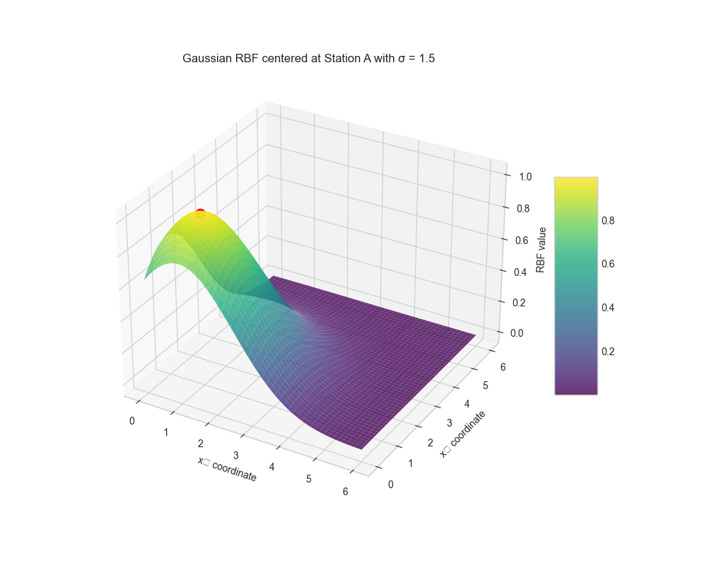
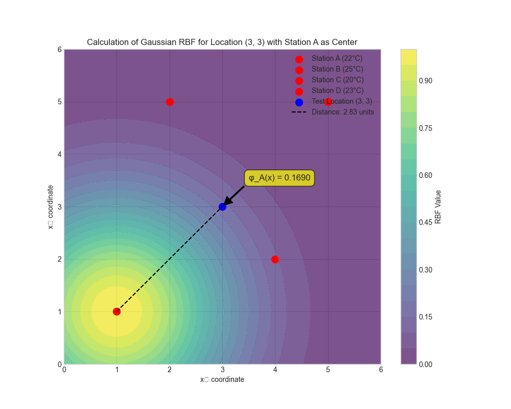
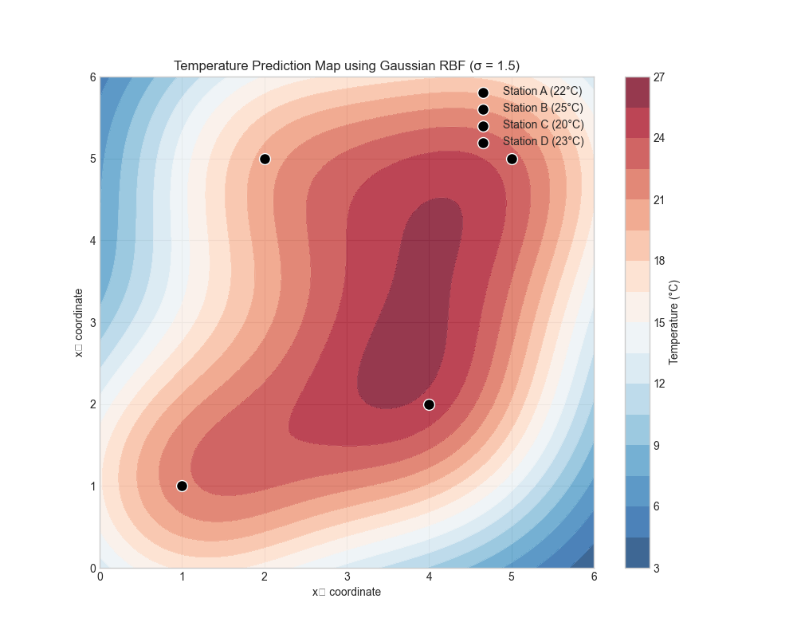
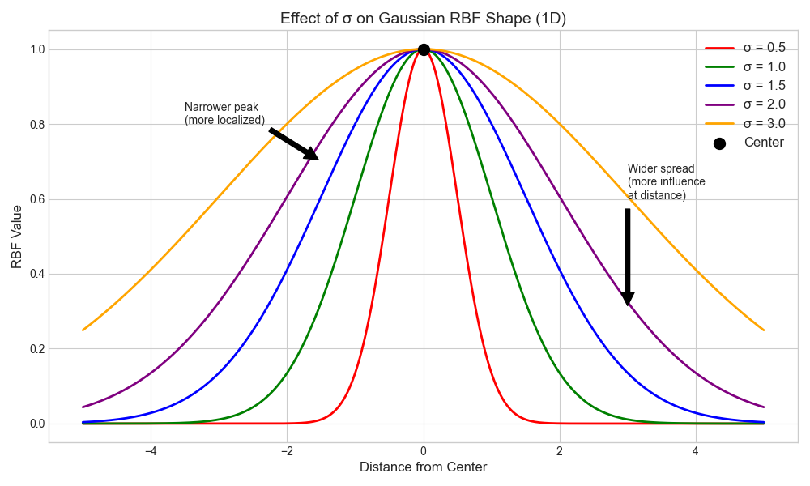
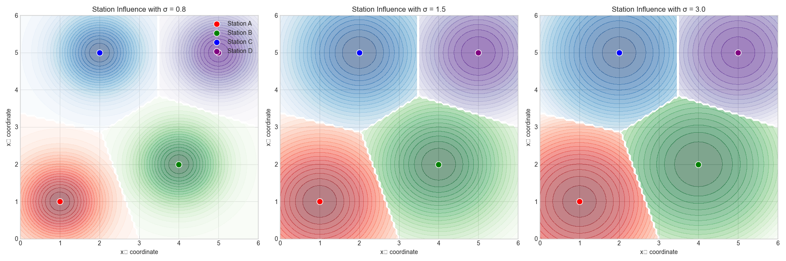

# Question 6: Temperature Prediction with Radial Basis Functions

## Problem Statement
You are developing a model to predict temperature across a city based on data collected from several weather stations. You have data from 4 stations at different locations $(x_1, x_2)$ where $x_1$ and $x_2$ represent the coordinates on a map:

| Station | Location $(x_1, x_2)$ | Temperature (°C) |
|---------|------------------------|------------------|
| A       | (1, 1)                 | 22               |
| B       | (4, 2)                 | 25               |
| C       | (2, 5)                 | 20               |
| D       | (5, 5)                 | 23               |

You decide to use radial basis functions (RBFs) to model the temperature at any location in the city, using the known station locations as centers.

### Task
1. Define a radial basis function and explain why it might be useful for this spatial prediction problem
2. Using a Gaussian RBF with $\sigma = 1.5$, calculate the value of the basis function $\phi_A(x)$ for the location $(3, 3)$ using station A as the center
3. Write the complete model equation using all four stations as centers for the RBFs
4. Explain the role of the parameter $\sigma$ in the Gaussian RBF and how changing it would affect your predictions

## Understanding the Problem
This problem deals with spatial interpolation, which is the process of estimating values at unsampled locations based on known values at nearby points. In this case, we need to predict temperature at any location in a city using measurements from four weather stations. 

Radial basis functions (RBFs) are particularly well-suited for this kind of problem because they naturally handle the concept of distance - allowing closer observations to have more influence on predictions than distant ones. This aligns with our intuitive understanding of spatial phenomena like temperature, which tend to be more similar at nearby locations than at distant ones.

The use of Gaussian RBFs with their centers at the weather stations will allow us to create a smooth temperature surface that exactly passes through our known data points while providing reasonable interpolated values elsewhere.

## Solution

### Step 1: Defining a Radial Basis Function and Its Usefulness

A radial basis function (RBF) is a real-valued function whose value depends only on the distance between the input and some fixed point, called the center. In our context, the centers are the locations of weather stations.

The most common form of RBF is the Gaussian RBF, defined as:

$$\phi(x) = \exp\left(-\frac{\|x - \text{center}\|^2}{2\sigma^2}\right)$$

where:
- $x$ is the input location (a point in our city)
- $\text{center}$ is the fixed center point (a weather station location)
- $\|x - \text{center}\|$ is the Euclidean distance between $x$ and the center
- $\sigma$ is a parameter that controls the width of the Gaussian

RBFs are useful for spatial prediction problems for several reasons:

1. **Distance-based influence**: They naturally incorporate the concept that closer points should have more influence on predictions.
2. **Smooth interpolation**: They provide smooth transitions between known data points.
3. **Non-linear modeling**: They can model complex, non-linear relationships in the data.
4. **Locality principle**: The influence of a data point diminishes with distance, respecting the locality principle common in spatial data.
5. **Exact interpolation**: When used in a RBF network, they can exactly reproduce the values at the training points.

For our temperature prediction problem, these properties are particularly valuable since temperature tends to vary smoothly across space and is influenced by local factors.

### Step 2: Calculating the RBF Value for Location (3, 3) Using Station A

We need to calculate the value of the Gaussian RBF $\phi_A(x)$ for the location $(3, 3)$ using station A (which is at $(1, 1)$) as the center, with $\sigma = 1.5$.

Using the Gaussian RBF formula:

1. First, calculate the squared Euclidean distance:
   $$\|x - \text{center}\|^2 = \|(3, 3) - (1, 1)\|^2 = (3-1)^2 + (3-1)^2 = 2^2 + 2^2 = 4 + 4 = 8$$

2. Now apply the Gaussian RBF formula:
   $$\phi_A(x) = \exp\left(-\frac{\|x - \text{center}\|^2}{2\sigma^2}\right) = \exp\left(-\frac{8}{2 \times 1.5^2}\right) = \exp\left(-\frac{8}{4.5}\right) = \exp(-1.7778) \approx 0.1690$$

Therefore, the value of the basis function $\phi_A(x)$ for the location $(3, 3)$ is approximately 0.1690. This relatively low value indicates that location $(3, 3)$ is somewhat far from station A, so station A has a moderate influence on the temperature prediction at this location.

### Step 3: Complete Model Equation Using All Four Stations

The complete RBF model for predicting temperature at any location $x$ would be a linear combination of the RBFs centered at each station:

$$T(x) = w_A \times \phi_A(x) + w_B \times \phi_B(x) + w_C \times \phi_C(x) + w_D \times \phi_D(x)$$

where:
- $T(x)$ is the predicted temperature at location $x$
- $\phi_i(x)$ is the Gaussian RBF value for station $i$ at location $x$
- $w_i$ is the weight for station $i$

Using the Gaussian RBF with $\sigma = 1.5$:

$$T(x) = w_A \times \exp\left(-\frac{\|x - x_A\|^2}{2\sigma^2}\right) + w_B \times \exp\left(-\frac{\|x - x_B\|^2}{2\sigma^2}\right) + w_C \times \exp\left(-\frac{\|x - x_C\|^2}{2\sigma^2}\right) + w_D \times \exp\left(-\frac{\|x - x_D\|^2}{2\sigma^2}\right)$$

where $x_A = (1,1)$, $x_B = (4,2)$, $x_C = (2,5)$, and $x_D = (5,5)$ are the station locations.

To find the weights $w_i$, we solve a system of equations that ensures the model exactly predicts the known temperatures at each station location. This leads to the following system:

1. For Station A $(1,1)$ with temperature $22°C$:
   $w_A \times 1.0 + w_B \times 0.1084 + w_C \times 0.0229 + w_D \times 0.0008 = 22$

2. For Station B $(4,2)$ with temperature $25°C$:
   $w_A \times 0.1084 + w_B \times 1.0 + w_C \times 0.0556 + w_D \times 0.1084 = 25$

3. For Station C $(2,5)$ with temperature $20°C$:
   $w_A \times 0.0229 + w_B \times 0.0556 + w_C \times 1.0 + w_D \times 0.1353 = 20$

4. For Station D $(5,5)$ with temperature $23°C$:
   $w_A \times 0.0008 + w_B \times 0.1084 + w_C \times 0.1353 + w_D \times 1.0 = 23$

In matrix form, this is $\Phi w = T$, where $\Phi$ is the design matrix of RBF values, $w$ is the weight vector, and $T$ is the temperature vector.

Solving this system, we get the following weights:
- $w_A = 19.4551$
- $w_B = 19.9835$
- $w_C = 15.9172$
- $w_D = 18.6644$

Therefore, the complete model equation is:

$$T(x) = 19.4551 \times \phi_A(x) + 19.9835 \times \phi_B(x) + 15.9172 \times \phi_C(x) + 18.6644 \times \phi_D(x)$$

For example, at the location $(3,3)$, the RBF values are:
- $\phi_A(3,3) = 0.169013$
- $\phi_B(3,3) = 0.641180$
- $\phi_C(3,3) = 0.329193$
- $\phi_D(3,3) = 0.169013$

Substituting these values into our model equation gives a predicted temperature of approximately $24.50°C$ at location $(3,3)$.

### Step 4: The Role of the σ Parameter and Its Effect on Predictions

The parameter $\sigma$ in the Gaussian RBF controls the width or spread of the basis function. It determines how quickly the influence of a station diminishes with distance from that station.

Effects of changing $\sigma$:

1. **Smaller $\sigma$ (e.g., $\sigma = 0.8$)**:
   - Creates narrower, more peaked basis functions
   - Each station has stronger influence in its immediate vicinity
   - Influence diminishes more rapidly with distance
   - Results in more localized predictions with sharper transitions
   - May lead to more "bullseye" patterns around stations

2. **Larger $\sigma$ (e.g., $\sigma = 3.0$)**:
   - Creates wider, more spread-out basis functions
   - Each station's influence extends further
   - Influence diminishes more gradually with distance
   - Results in smoother predictions with more gradual transitions
   - May lead to more averaged or blended predictions

Choosing an appropriate $\sigma$ value is important for the model's performance:
- Too small: May lead to overfitting, where predictions match known points well but fluctuate unrealistically between them
- Too large: May lead to underfitting, where predictions are too smooth and don't capture local variations adequately

The ideal $\sigma$ value depends on various factors:
- The physical properties of the phenomenon being modeled (e.g., how temperature typically varies across a city)
- The density of measurement stations (sparser networks may benefit from larger $\sigma$)
- The scale of the area being modeled

In practice, $\sigma$ is often determined through cross-validation or based on domain knowledge about the spatial correlation structure of the phenomenon being modeled.

## Practical Implementation

To better understand how RBFs work in practice, we can examine the behavior of our temperature prediction model with different parameter values.

### Calculating the Gaussian RBF Value

Let's verify our calculation of the RBF value for location $(3,3)$ using station A as the center:

1. The squared Euclidean distance between $(3,3)$ and $(1,1)$ is:
   $\|(3,3) - (1,1)\|^2 = (3-1)^2 + (3-1)^2 = 4 + 4 = 8$

2. Applying the Gaussian RBF formula with $\sigma = 1.5$:
   $\phi_A(3,3) = \exp(-8/(2 \times 1.5^2)) = \exp(-8/4.5) = \exp(-1.7778) \approx 0.1690$

This means station A has about 16.9% influence on the prediction at location $(3,3)$.

### Comparing the Influence of All Stations

For the location $(3,3)$, the RBF values for all stations are:
- Station A $(1,1)$: $\phi_A(3,3) = 0.169013$
- Station B $(4,2)$: $\phi_B(3,3) = 0.641180$
- Station C $(2,5)$: $\phi_C(3,3) = 0.329193$
- Station D $(5,5)$: $\phi_D(3,3) = 0.169013$

These values indicate that Station B has the highest influence on the prediction at $(3,3)$, which makes intuitive sense because it's the closest station to that location.

### Predicting the Temperature

Using our model equation:
$T(3,3) = 19.4551 \times 0.169013 + 19.9835 \times 0.641180 + 15.9172 \times 0.329193 + 18.6644 \times 0.169013 \approx 24.50°C$

This predicted temperature of $24.50°C$ is a weighted average of the temperatures from all four stations, with weights determined by their distances from the point $(3,3)$ and the chosen $\sigma$ value.

## Visual Explanations

### Visualization of a Gaussian RBF

This 3D visualization shows a Gaussian RBF centered at Station A with $\sigma = 1.5$. The height of the surface represents the RBF value, which is highest at the center (Station A) and decreases with distance. This illustrates how the influence of a station diminishes as we move away from it.

### Calculation of RBF Value at Specific Location

This figure illustrates the calculation of the Gaussian RBF value for the location $(3,3)$ using Station A as the center. The contour lines show the RBF values, which decrease as we move away from Station A. The dashed line shows the distance between Station A and the test location, and the annotation displays the calculated RBF value of approximately 0.169.

### Temperature Prediction Map

This visualization shows the predicted temperature across the entire city using our RBF model with $\sigma = 1.5$. The color represents the predicted temperature, with red indicating higher temperatures and blue indicating lower temperatures. The black dots mark the locations of the four weather stations with their known temperatures. Notice how the model creates a smooth interpolation between the stations while exactly reproducing the known temperatures at the station locations.

### Effect of σ on RBF Shape

This figure demonstrates how changing the $\sigma$ parameter affects the shape of the Gaussian RBF in one dimension. Smaller $\sigma$ values create narrower, more peaked functions that drop off quickly with distance, while larger $\sigma$ values create wider, more spread-out functions that extend their influence over greater distances.

### Station Influence Comparison with Different σ Values

This visualization compares the influence regions of each station with different $\sigma$ values (0.8, 1.5, and 3.0). Each color represents the region where one station has the highest influence on the prediction. With smaller $\sigma$ values, the influence regions are more localized around each station, while with larger $\sigma$ values, the influence extends further and the boundaries between regions become smoother.

## Key Insights

### Theoretical Foundations
- Radial basis functions provide a flexible framework for modeling spatial data by weighting observations based on distance.
- The Gaussian RBF uses the squared Euclidean distance and an exponential function to create a smooth, bell-shaped influence pattern.
- The model guarantees exact interpolation at the known data points (weather stations) while providing reasonable estimates elsewhere.
- The system of linear equations used to find the weights ensures that the model passes exactly through all the known data points.

### Modeling Considerations
- The choice of $\sigma$ significantly impacts the model's behavior and should be selected based on the specific characteristics of the phenomenon being modeled.
- Smaller $\sigma$ values lead to more localized influence and potentially more complex temperature patterns.
- Larger $\sigma$ values create smoother temperature fields with more gradual transitions.
- The balance between overfitting (too small $\sigma$) and underfitting (too large $\sigma$) is crucial for model performance.

### Practical Applications
- This approach is widely used in geospatial modeling, weather forecasting, and environmental monitoring.
- For real-world applications, additional factors like elevation, proximity to water bodies, or urban heat island effects might need to be incorporated.
- When stations are unevenly distributed, adaptive $\sigma$ values might be more appropriate than a fixed $\sigma$ for all stations.
- Cross-validation can help determine the optimal $\sigma$ value for a specific application.

### Extensions and Limitations
- Different types of RBFs (such as multiquadric or thin-plate spline) might be more appropriate for certain spatial phenomena.
- For large datasets, more efficient computational approaches like fast multipole methods might be necessary.
- Additional covariates (such as elevation or land use) could be incorporated for more accurate predictions.
- Uncertainty quantification could be added to provide confidence intervals for the predictions.

## Conclusion
- A Gaussian RBF with $\sigma = 1.5$ yields a value of approximately 0.1690 for location $(3,3)$ using Station A as the center.
- The complete model equation for temperature prediction is $T(x) = 19.4551 \times \phi_A(x) + 19.9835 \times \phi_B(x) + 15.9172 \times \phi_C(x) + 18.6644 \times \phi_D(x)$.
- The parameter $\sigma$ controls the width of the Gaussian RBF, with smaller values creating more localized influence patterns and larger values creating smoother, more widely distributed influence.
- The choice of $\sigma$ should balance the need for fidelity to known data points with the desire for smooth, physically realistic interpolation.

Radial basis functions provide an elegant and intuitive approach to spatial interpolation, making them well-suited for temperature prediction and other spatial modeling tasks where the influence of observations naturally diminishes with distance. 