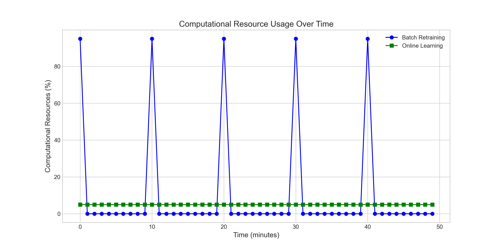
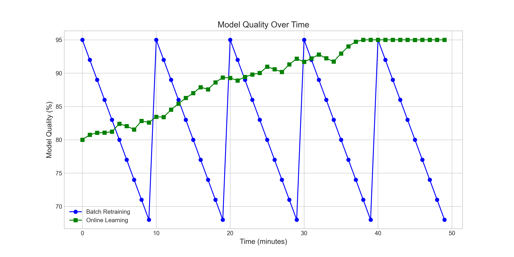
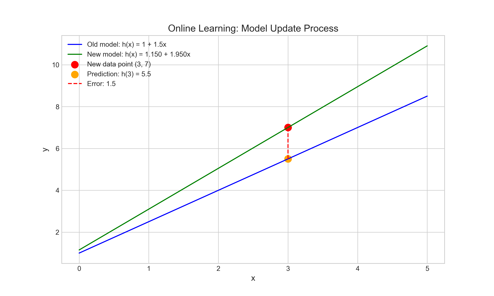

# Question 12: Online Learning for Linear Regression

## Problem Statement
You're implementing online learning for linear regression where data arrives sequentially, and you need to decide how to process it.

In this problem:
- New data points arrive every minute
- You need to make predictions in real-time
- You've trained an initial model on historical data
- You have limited computational resources

### Task
1. Write down the LMS update rule that you would use for online learning
2. A new data point $(x=3, y=7)$ arrives. If your current model is $h(x) = 1 + 1.5x$, calculate the prediction error
3. If you use learning rate $\alpha = 0.1$, calculate the updated parameters after seeing this data point
4. Compare this online learning approach with batch retraining in terms of computational efficiency and model quality

## Understanding the Problem

This problem focuses on online learning for linear regression, a methodology where model parameters are updated incrementally as new data arrives, instead of retraining the entire model with all available data. This approach is particularly useful in settings where:

- Data arrives sequentially over time
- Real-time predictions are needed
- Computational resources are limited
- Data distribution may change over time (concept drift)

Online learning uses stochastic gradient descent or variations like LMS (Least Mean Squares) to update model parameters incrementally. The goal is to adapt the model efficiently without sacrificing too much performance compared to batch retraining.

## Solution

### Step 1: Writing the LMS Update Rule for Online Learning

The Least Mean Squares (LMS) update rule for online learning works by updating model parameters in the direction that reduces the squared error for each new data point.

For a linear regression model with multiple features, the general update rule for each parameter $\theta_j$ is:

$$\theta_j := \theta_j + \alpha (y - h_\theta(x)) x_j$$

Where:
- $\theta_j$ is the $j$-th parameter
- $\alpha$ is the learning rate (step size)
- $y$ is the true target value
- $h_\theta(x)$ is the model's prediction
- $x_j$ is the $j$-th feature (with $x_0 = 1$ for the intercept)

In matrix form for updating all parameters simultaneously:

$$\theta := \theta + \alpha (y - h_\theta(x)) x$$

For our specific case of simple linear regression with one feature, we have parameters $\theta_0$ (intercept) and $\theta_1$ (slope). The model is $h_\theta(x) = \theta_0 + \theta_1 x$, so the update rules are:

$$\theta_0 := \theta_0 + \alpha (y - (\theta_0 + \theta_1 x))$$
$$\theta_1 := \theta_1 + \alpha (y - (\theta_0 + \theta_1 x)) \cdot x$$

### Step 2: Calculating the Prediction Error for the New Data Point

Given:
- Current model: $h(x) = 1 + 1.5x$
- New data point: $(x=3, y=7)$

First, we calculate the model's prediction for the new input $x=3$:

$$h(3) = 1 + 1.5 \cdot 3 = 1 + 4.5 = 5.5$$

Then, we calculate the prediction error:

$$\text{error} = y - h(x) = 7 - 5.5 = 1.5$$

This error of 1.5 represents how far our model's prediction is from the actual value. We'll use this error to update our model parameters.

### Step 3: Calculating the Updated Parameters

Given:
- Learning rate $\alpha = 0.1$
- Error = 1.5
- Current parameters: $\theta_0 = 1$ and $\theta_1 = 1.5$

We apply the LMS update rules:

For $\theta_0$ (intercept):
$$\theta_0 := \theta_0 + \alpha (y - h(x)) = 1 + 0.1 \cdot 1.5 = 1 + 0.15 = 1.15$$

For $\theta_1$ (slope):
$$\theta_1 := \theta_1 + \alpha (y - h(x)) \cdot x = 1.5 + 0.1 \cdot 1.5 \cdot 3 = 1.5 + 0.45 = 1.95$$

Therefore, after incorporating the new data point, our updated model is:
$$h(x) = 1.15 + 1.95x$$

The model has adjusted to better fit the new data point, moving the prediction for $x=3$ closer to the observed value of 7.

### Step 4: Comparing Online Learning with Batch Retraining

#### Computational Efficiency

**Online Learning:**
- **Processing Time**: Fast - $O(d)$ per update, where $d$ is the number of features
- **Memory Usage**: Low - only needs to store model parameters, not the entire dataset
- **Resource Consistency**: Uses minimal resources consistently over time

**Batch Retraining:**
- **Processing Time**: Slow - $O(nd)$ or more per retraining, where $n$ is the number of samples
- **Memory Usage**: High - needs to store the entire dataset for retraining
- **Resource Spikes**: Creates resource usage spikes during periodic retraining

#### Model Quality

**Online Learning:**
- **Adaptability**: Immediately incorporates new information
- **Stability**: Lower - can oscillate or be sensitive to outliers
- **Convergence**: May not reach the exact optimum but approaches it over time
- **Non-Stationary Data**: Good - continuously adapts to changing data distributions

**Batch Retraining:**
- **Adaptability**: Slow - requires complete retraining to incorporate new data
- **Stability**: Higher - less affected by individual outliers
- **Convergence**: Can find the exact optimum for the given data
- **Non-Stationary Data**: Poor - slower to adapt to changing data distributions

#### Implementation Complexity
- **Online Learning**: Simple - straightforward update rule
- **Batch Retraining**: Complex - requires solving full optimization problem

## Practical Implementation

### Example of Model Update Process

Let's visualize how our model changes after incorporating the new data point:

The visualization shows:
1. The original model (blue line): $h(x) = 1 + 1.5x$
2. The prediction for the new data point $x=3$ (orange dot): $h(3) = 5.5$
3. The actual value of the new data point (red dot): $(3, 7)$
4. The error between prediction and actual value (dashed red line): 1.5
5. The updated model after incorporating the new data point (green line): $h(x) = 1.15 + 1.95x$

Notice how the green line (updated model) moves closer to the new data point compared to the blue line (original model).

## Key Insights

### Theoretical Foundations
- Online learning is based on stochastic optimization methods, particularly stochastic gradient descent
- The LMS update rule minimizes the squared error for each incoming data point
- The learning rate $\alpha$ controls the balance between stability and adaptability
- A smaller learning rate means more stable but slower learning
- A larger learning rate means faster adaptation but potential oscillation

### Practical Applications
- Online learning is ideal for systems with continuous data streams
- It's suitable for IoT sensors, user behavior modeling, stock price prediction, and other time-series data
- It enables real-time adaptation in resource-constrained environments like mobile devices
- It's particularly valuable when data distributions change over time

### Common Pitfalls
- Choosing too large a learning rate can cause instability or divergence
- Choosing too small a learning rate can make learning too slow
- Not normalizing features can lead to uneven updates across parameters
- Without occasional retraining or more sophisticated techniques, model may not reach optimal performance
- Sensitive to outliers or noisy data points

## Conclusion
- The LMS update rule for online learning is: $\theta := \theta + \alpha(y - h_\theta(x))x$
- For the given data point $(x=3, y=7)$ and model $h(x) = 1 + 1.5x$, the prediction error is 1.5
- After applying the update with learning rate $\alpha = 0.1$, the new model is $h(x) = 1.15 + 1.95x$
- Online learning is computationally efficient and adaptive but potentially less stable than batch methods
- The choice between online learning and batch retraining depends on specific application requirements for latency, resource constraints, and adaptation speed

Online learning represents a fundamental paradigm in machine learning that trades off some model optimality for significant gains in computational efficiency and adaptability. When implemented properly, it enables intelligent systems to continuously learn and improve from streaming data in resource-constrained environments. 