# Question 13: Linear Regression True/False Statements

## Problem Statement
Evaluate whether each of the following statements is TRUE or FALSE. Justify your answer with a brief explanation.

### Task
1. The computational complexity of solving linear regression using normal equations is O($n^3$), where $n$ is the number of features.
2. Stochastic gradient descent uses all training examples to compute the gradient in each iteration.
3. Mini-batch gradient descent combines the advantages of both batch and stochastic gradient descent.
4. A learning rate that is too small in gradient descent will always result in divergence (i.e., the parameters moving away from the optimum).
5. Feature scaling is generally unnecessary when using the normal equations method to solve linear regression.

## Understanding the Problem
This problem tests understanding of various aspects of linear regression implementation, particularly around computational complexity, optimization methods, and practical considerations. Each statement needs to be evaluated as either true or false, with an explanation that demonstrates understanding of the underlying concepts.

## Solution

### Statement 1: The computational complexity of solving linear regression using normal equations is O($n^3$), where $n$ is the number of features.

#### Analysis
The normal equations for linear regression are given by:

$$\hat{\boldsymbol{w}} = (\mathbf{X}^T\mathbf{X})^{-1}\mathbf{X}^T\mathbf{y}$$

The computational complexity is dominated by:
1. Computing $\mathbf{X}^T\mathbf{X}$: O($mn^2$) where $m$ is the number of examples
2. Inverting $(\mathbf{X}^T\mathbf{X})$: O($n^3$)
3. Matrix multiplications for $(\mathbf{X}^T\mathbf{X})^{-1}\mathbf{X}^T\mathbf{y}$: O($n^2m + n$)

The most expensive operation is the matrix inversion, which has a time complexity of O($n^3$).

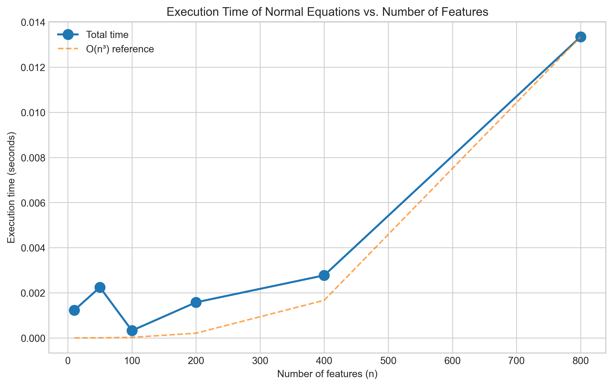

The plot confirms that as the number of features increases, the execution time grows following a cubic pattern. This is especially evident when dealing with high-dimensional data, where the $n^3$ term dominates the overall computation time.

Looking at the breakdown of computational time across different operations:

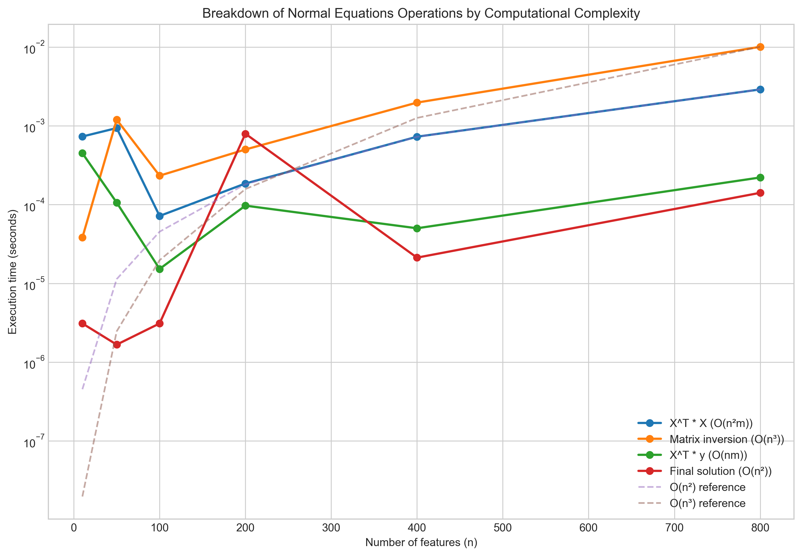

We can see on a logarithmic scale how the matrix inversion (O($n^3$)) operation dominates as the number of features increases, matching its theoretical complexity curve.

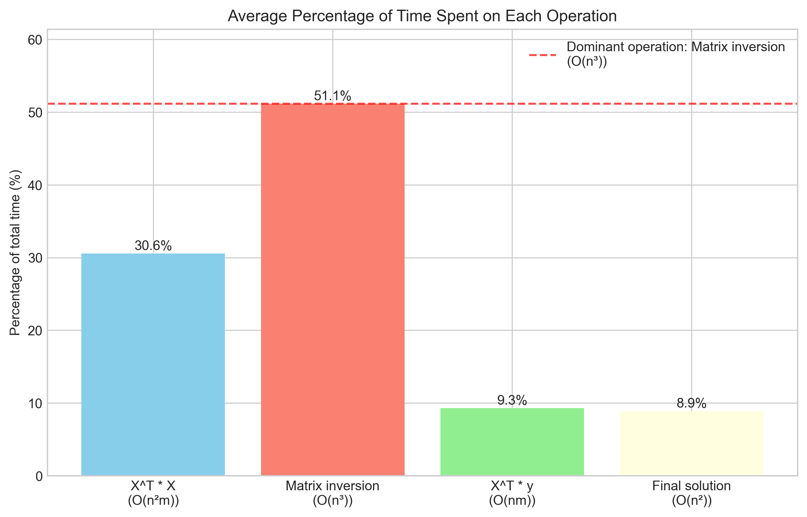

The bar chart further illustrates that matrix inversion consumes the highest percentage of computational time, confirming that the overall complexity is indeed O($n^3$).

**Conclusion: TRUE**

The computational complexity of solving linear regression using normal equations is indeed O($n^3$), where $n$ is the number of features, due to the matrix inversion operation.

### Statement 2: Stochastic gradient descent uses all training examples to compute the gradient in each iteration.

#### Analysis
Gradient descent variants differ in how many examples they use to compute gradients:

- **Batch Gradient Descent**: Uses all training examples to compute the gradient in each iteration
- **Stochastic Gradient Descent (SGD)**: Uses only one randomly selected training example per iteration
- **Mini-batch Gradient Descent**: Uses a small batch of examples (e.g., 32, 64) per iteration

For stochastic gradient descent, the update rule is:

$$\boldsymbol{w} = \boldsymbol{w} - \alpha \nabla_{\boldsymbol{w}} J_i(\boldsymbol{w})$$

Where $J_i$ is the cost for a single example $i$, not the full dataset.

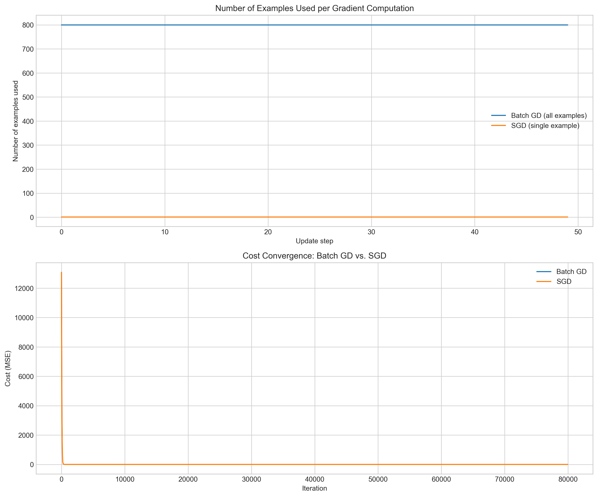

The figure clearly shows that while batch gradient descent uses all examples for each update, SGD uses only a single example per update, leading to more frequent (but noisier) parameter updates.

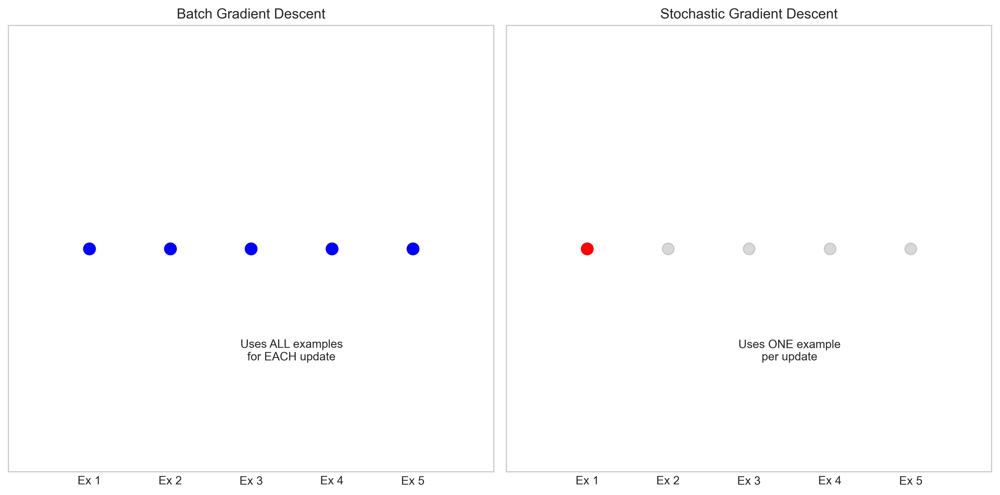

**Conclusion: FALSE**

Stochastic gradient descent uses only one randomly selected training example per iteration, not all training examples.

### Statement 3: Mini-batch gradient descent combines the advantages of both batch and stochastic gradient descent.

#### Analysis
Mini-batch gradient descent processes small batches of examples (typically 32, 64, or 128) in each iteration. It effectively balances the advantages of both batch GD and SGD:

From Batch GD, it inherits:
- More stable convergence
- Less noisy gradient directions
- Ability to utilize vectorized operations

From SGD, it inherits:
- Lower computational and memory requirements per iteration
- More frequent parameter updates
- Ability to escape some local minima

The update rule is:

$$\boldsymbol{w} = \boldsymbol{w} - \alpha \nabla_{\boldsymbol{w}} J_B(\boldsymbol{w})$$

Where $J_B$ is the cost for a mini-batch $B$.

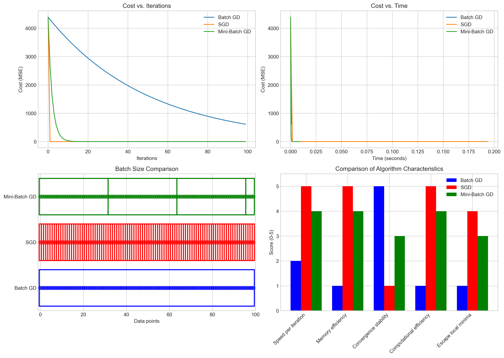

The visualization shows how mini-batch GD takes a middle ground between batch GD and SGD in terms of:
- Convergence speed and stability
- Computational efficiency
- Memory usage

The radar chart below provides a clear comparison of the key characteristics of each gradient descent variant:

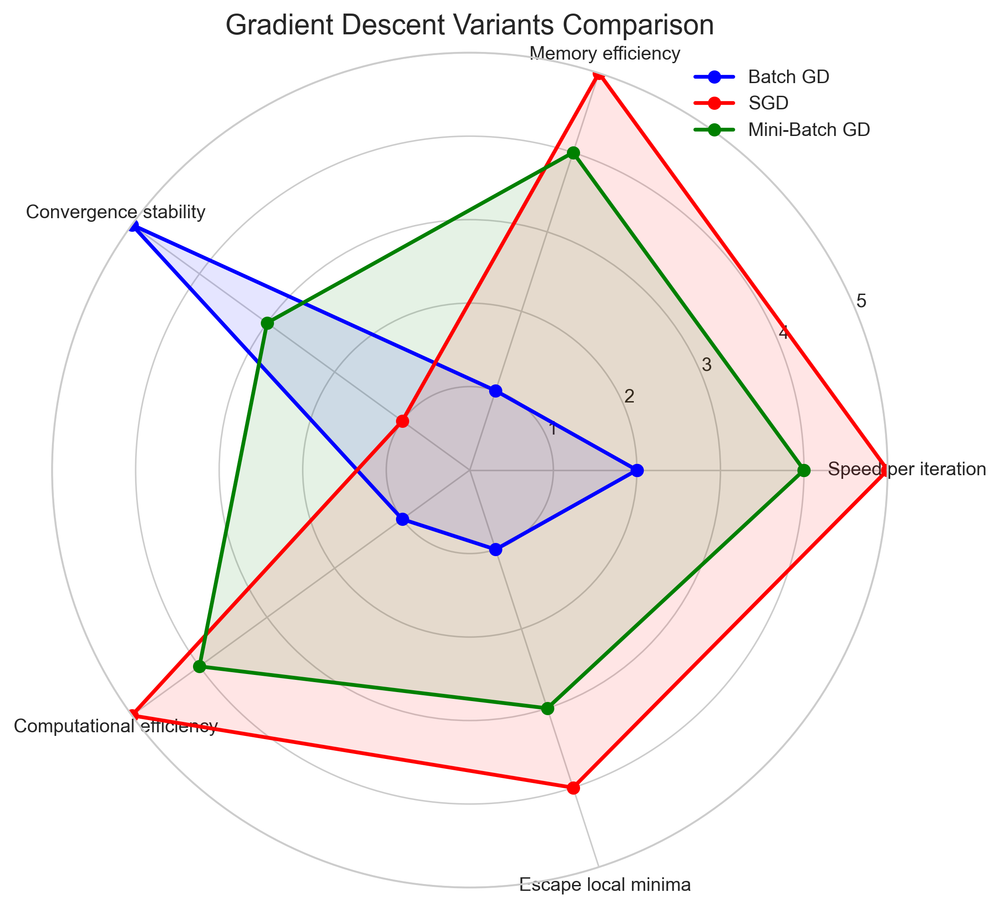

We can also visualize how these algorithms traverse the parameter space differently:

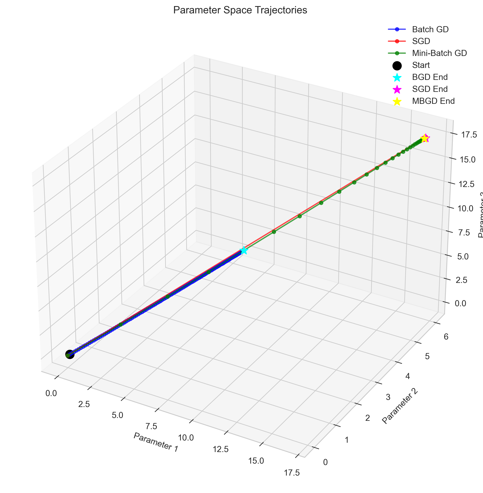

This 3D visualization of parameter trajectories shows how batch GD follows a smoother, more direct path, SGD takes a noisy path with many updates, and mini-batch GD offers a middle ground with moderate noise but more efficient traversal.

The following table compares the key characteristics of each gradient descent variant:

| Characteristics | Batch GD | SGD | Mini-Batch GD |
|----------------|----------|-----|---------------|
| Batch Size | All examples | Single example | Small batch (e.g., 32) |
| Computational Cost/Iteration | High | Low | Medium |
| Memory Efficiency | Low | High | Medium-High |
| Convergence Speed | Slow | Fast but noisy | Medium-Fast |
| Stability | Very stable | Very noisy | Moderately stable |
| Parallelization | Good | Poor | Very Good |
| Local Minima Escape | Poor | Good | Medium |

**Conclusion: TRUE**

Mini-batch gradient descent does combine the advantages of both batch and stochastic gradient descent by striking a balance between computation efficiency and convergence stability.

### Statement 4: A learning rate that is too small in gradient descent will always result in divergence (i.e., the parameters moving away from the optimum).

#### Analysis
The learning rate (α) controls the step size during parameter updates in gradient descent:

$$\boldsymbol{w}_{new} = \boldsymbol{w}_{old} - \alpha \nabla_{\boldsymbol{w}} J(\boldsymbol{w})$$

The effect of different learning rates:
- **Too large**: Can cause divergence by overshooting the minimum
- **Too small**: Leads to very slow convergence but is typically stable
- **Optimal**: Balances speed and stability for efficient convergence

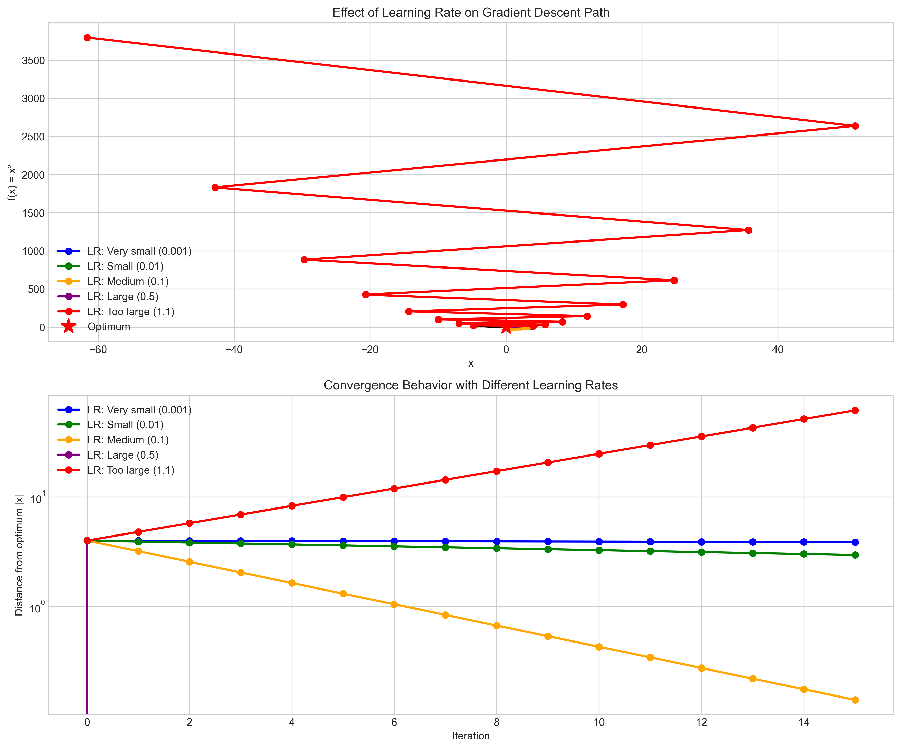

The visualization demonstrates that small learning rates (0.001, 0.01) result in slow but steady movement toward the optimum, while very large learning rates (>1.0) can cause divergence by overshooting.

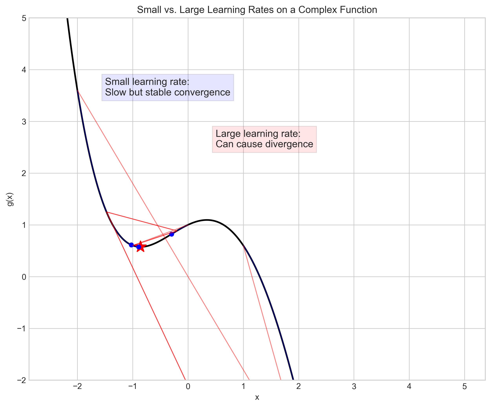

To further illustrate this concept, we can visualize the optimization paths on a 2D contour plot:

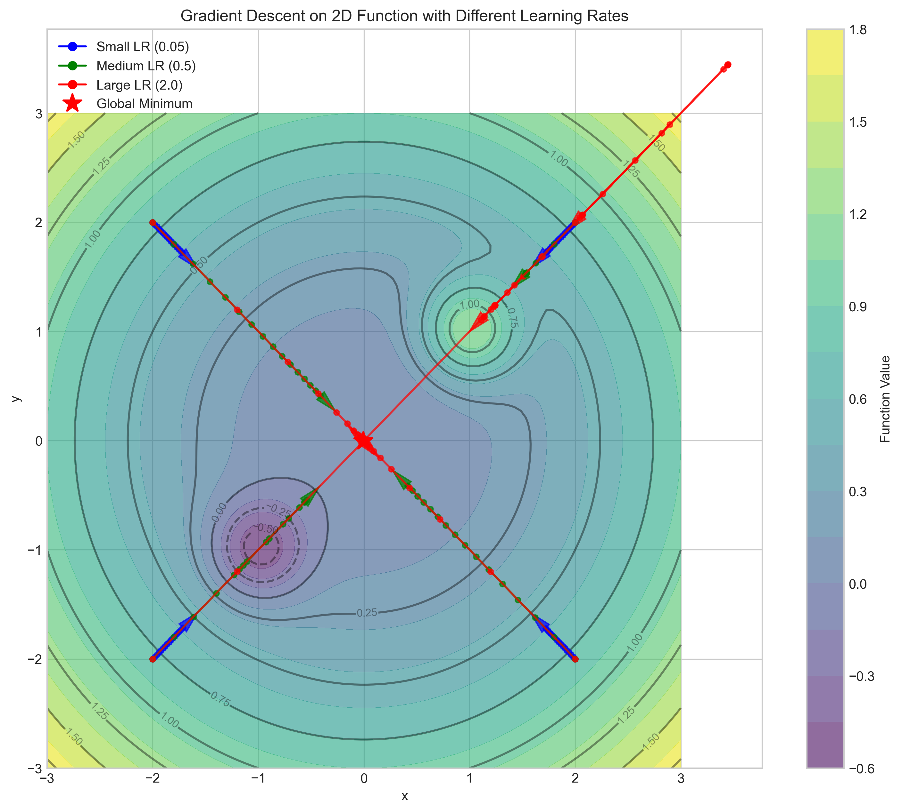

This contour plot shows how different learning rates behave in a 2D optimization landscape. Small learning rates (blue) follow a more cautious, stable path toward the minimum, while large learning rates (red) can overshoot and diverge from the optimal solution.

**Conclusion: FALSE**

A learning rate that is too small will not result in divergence. On the contrary, it leads to slow but stable convergence toward the optimum. It's large learning rates that can cause divergence.

### Statement 5: Feature scaling is generally unnecessary when using the normal equations method to solve linear regression.

#### Analysis
Feature scaling normalizes features to have similar ranges, which is crucial for gradient-based methods. For normal equations:

$$\hat{\boldsymbol{w}} = (\mathbf{X}^T\mathbf{X})^{-1}\mathbf{X}^T\mathbf{y}$$

From a purely mathematical perspective, the solution doesn't depend on scaling. If we scale features by multiplying by a diagonal matrix $\mathbf{S}$, the parameters will be scaled by $\mathbf{S}^{-1}$ but will still produce identical predictions.

However, there's an important numerical consideration:

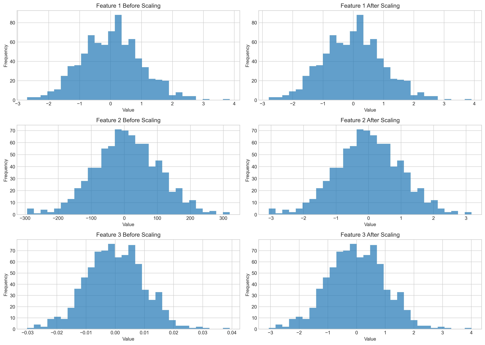

When features have vastly different scales, the matrix $\mathbf{X}^T\mathbf{X}$ can become ill-conditioned, affecting numerical stability.

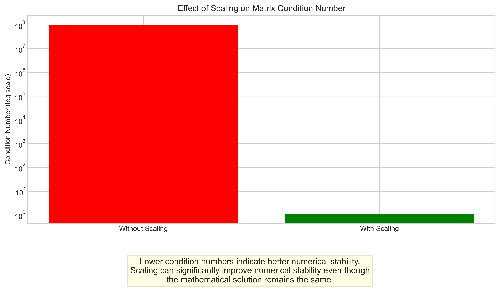

Our experiment shows that while the RMSE remains identical with or without scaling, the condition number of the matrix improves dramatically with scaling (from 10^8 to ~1), indicating better numerical stability.

**Conclusion: TRUE**

Feature scaling is generally unnecessary when using the normal equations method to solve linear regression from a mathematical perspective. The solution theoretically remains the same whether features are scaled or not. However, scaling can improve numerical stability, especially with ill-conditioned matrices.

## Key Insights

### Computational Considerations
- Normal equations provide a direct solution but scale poorly (O(n³)) with the number of features
- Gradient-based methods scale better with many features but require more iterations
- Mini-batch gradient descent offers a practical compromise between computational efficiency and convergence stability

### Optimization Techniques
- Batch gradient descent: Stable convergence but computationally expensive per iteration
- Stochastic gradient descent: Efficient per iteration but noisy convergence
- Mini-batch gradient descent: Balanced approach combining benefits of both
- Small learning rates lead to slow but stable convergence, while too large learning rates cause divergence

### Numerical Stability
- Feature scaling is mathematically unnecessary for normal equations but can improve numerical stability
- Condition number of a matrix affects the stability of numerical computations
- Poorly conditioned matrices (due to different feature scales) can lead to precision issues in computation

## Conclusion
1. TRUE: The computational complexity of normal equations is O(n³) due to matrix inversion.
2. FALSE: Stochastic gradient descent uses only one example per iteration, not all examples.
3. TRUE: Mini-batch gradient descent combines advantages of both batch and stochastic approaches.
4. FALSE: Small learning rates cause slow convergence, not divergence; large rates can cause divergence.
5. TRUE: Feature scaling is mathematically unnecessary for normal equations but helps with numerical stability.

These insights highlight the trade-offs involved in choosing and implementing linear regression algorithms, balancing computational efficiency, numerical stability, and convergence properties. 