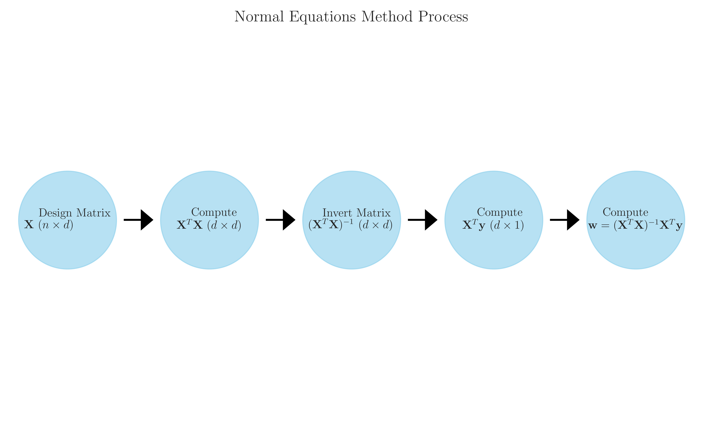
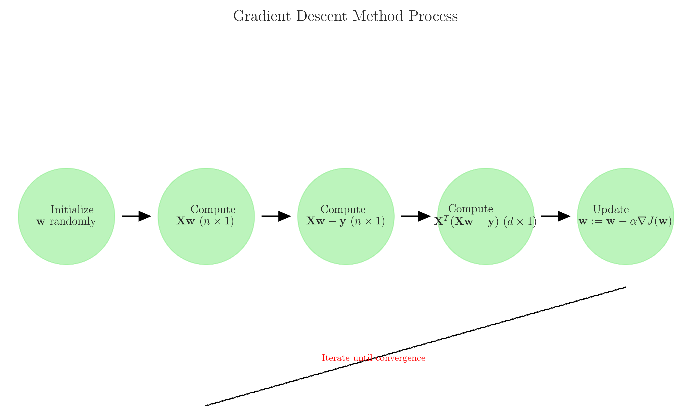
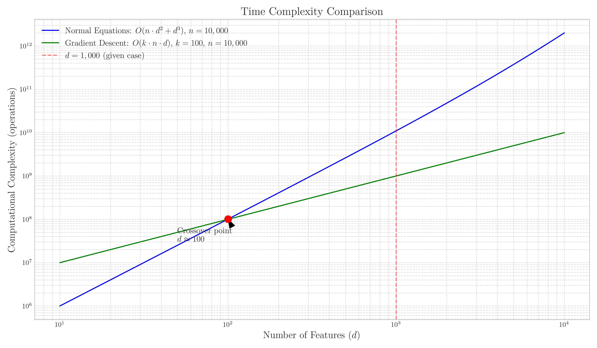
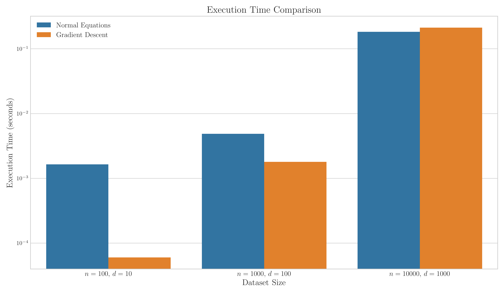
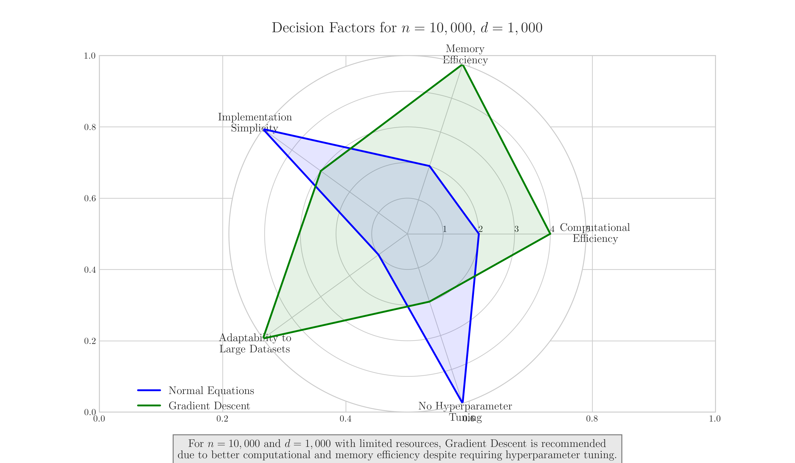
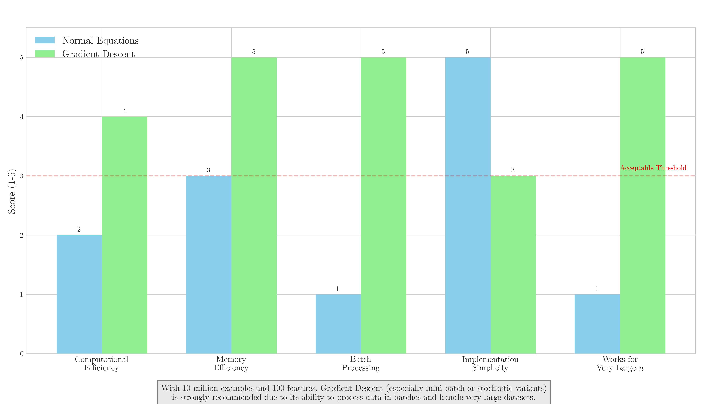
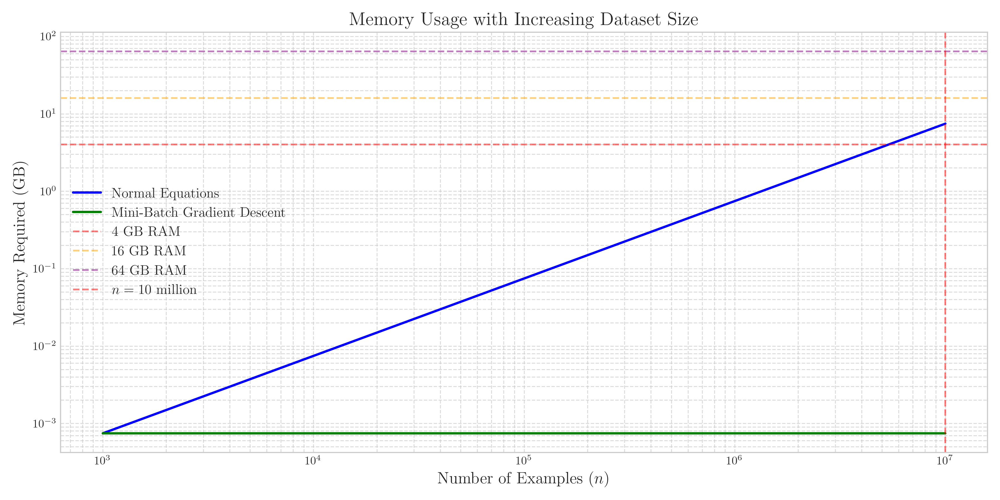

# Question 19: Normal Equations vs. Gradient Descent for Linear Regression

## Problem Statement
You need to decide whether to use the normal equations or gradient descent for a linear regression problem with the following characteristics:

- The training set has $n = 10,000$ examples
- You have $d = 1,000$ features after one-hot encoding categorical variables
- The matrix $\boldsymbol{X}^T\boldsymbol{X}$ is non-singular
- Your computational resources are limited

### Task
1. Write down the closed-form solution for linear regression using normal equations
2. Write down the update rule for batch gradient descent in linear regression
3. Compare the computational complexity of both methods in terms of $n$ and $d$
4. Based on the given problem characteristics, which method would you recommend and why?
5. How would your recommendation change if $n = 10$ million and $d = 100$?

## Understanding the Problem

This problem focuses on comparing two fundamental approaches to solve linear regression: using normal equations (a direct, closed-form solution) versus gradient descent (an iterative optimization approach). We need to analyze their computational and memory requirements to determine which approach is more suitable for different dataset characteristics.

In machine learning, we often face trade-offs between computational efficiency, memory usage, and implementation complexity. This problem explores those trade-offs specifically for linear regression when dealing with varying dataset sizes and feature dimensions.

## Solution

### Step 1: Closed-form solution using normal equations

The normal equation provides a direct, closed-form solution for finding the optimal weights in linear regression:

$$\boldsymbol{w} = (\boldsymbol{X}^T\boldsymbol{X})^{-1}\boldsymbol{X}^T\boldsymbol{y}$$

Where:
- $\boldsymbol{w}$ is the weight vector (d×1)
- $\boldsymbol{X}$ is the design matrix (n×d)
- $\boldsymbol{y}$ is the target vector (n×1)

This formula gives us the values of the weights that minimize the cost function (mean squared error) without requiring iteration or hyperparameter tuning. The normal equation finds the exact solution in one step by setting the derivative of the cost function to zero and solving for the weights.

### Step 2: Update rule for batch gradient descent

Batch gradient descent is an iterative optimization algorithm that updates the weights in the direction of the negative gradient of the cost function:

$$\boldsymbol{w} := \boldsymbol{w} - \alpha \nabla J(\boldsymbol{w})$$

For linear regression with mean squared error cost, this expands to:

$$\boldsymbol{w} := \boldsymbol{w} - \alpha \frac{1}{n} \boldsymbol{X}^T (\boldsymbol{X}\boldsymbol{w} - \boldsymbol{y})$$

Where:
- $\boldsymbol{w}$ is the weight vector (d×1)
- $\alpha$ is the learning rate (a hyperparameter)
- $\boldsymbol{X}$ is the design matrix (n×d)
- $\boldsymbol{y}$ is the target vector (n×1)
- $J(\boldsymbol{w})$ is the cost function (mean squared error)

Gradient descent requires multiple iterations to converge to the optimal solution, and the convergence speed depends on the learning rate and the characteristics of the data.

### Step 3: Comparing computational complexity

#### Normal Equations
- Computing $\boldsymbol{X}^T\boldsymbol{X}$: $O(n \cdot d^2)$
- Inverting $\boldsymbol{X}^T\boldsymbol{X}$: $O(d^3)$
- Computing $\boldsymbol{X}^T\boldsymbol{y}$: $O(n \cdot d)$
- Computing $(\boldsymbol{X}^T\boldsymbol{X})^{-1}\boldsymbol{X}^T\boldsymbol{y}$: $O(d^2)$
- **Total**: $O(n \cdot d^2 + d^3)$

#### Gradient Descent (per iteration)
- Computing $\boldsymbol{X}\boldsymbol{w}$: $O(n \cdot d)$
- Computing $(\boldsymbol{X}\boldsymbol{w} - \boldsymbol{y})$: $O(n)$
- Computing $\boldsymbol{X}^T(\boldsymbol{X}\boldsymbol{w} - \boldsymbol{y})$: $O(n \cdot d)$
- Updating weights: $O(d)$
- **Total per iteration**: $O(n \cdot d)$
- If $k$ iterations are needed: $O(k \cdot n \cdot d)$

#### Space Complexity
- Normal Equations: $O(d^2)$ for storing $\boldsymbol{X}^T\boldsymbol{X}$
- Gradient Descent: $O(d)$ for storing weights and gradients

The choice between these methods depends significantly on the relationship between $n$ and $d$, as well as the available computational resources.

### Step 4: Recommendation for the initial case (n=10,000, d=1,000)

For the given problem with $n=10,000$ examples and $d=1,000$ features:

1. **Computational analysis**:
   - Normal Equations: $O(10,000 \cdot 1,000^2 + 1,000^3) \approx O(10^{10} + 10^9) \approx O(10^{10})$ operations
   - Gradient Descent (assuming 100 iterations): $O(100 \cdot 10,000 \cdot 1,000) = O(10^9)$ operations

2. **Memory requirements**:
   - Normal Equations: Need to store $\boldsymbol{X}^T\boldsymbol{X}$ (1,000×1,000 matrix) = 1 million elements ≈ 8MB
   - Gradient Descent: Only need to store weights and gradients: $O(1,000)$ elements ≈ 8KB

**Recommendation**: Gradient Descent

**Reasons**:
1. **Computational Efficiency**: Gradient descent requires approximately 10× fewer operations than normal equations for this problem size.
2. **Memory Efficiency**: Gradient descent requires significantly less memory (thousand times less).
3. **Limited Resources**: Given the constraint of limited computational resources, gradient descent's lower memory footprint and potentially parallelizable computation make it more appropriate.

### Step 5: Recommendation for the changed scenario (n=10 million, d=100)

For the modified scenario with $n=10$ million examples and $d=100$ features:

1. **Computational analysis**:
   - Normal Equations: $O(10^7 \cdot 100^2 + 100^3) \approx O(10^{11} + 10^6) \approx O(10^{11})$ operations
   - Gradient Descent (assuming 100 iterations): $O(100 \cdot 10^7 \cdot 100) = O(10^{11})$ operations

2. **Memory requirements**:
   - Normal Equations: Need to store $\boldsymbol{X}^T\boldsymbol{X}$ (100×100 matrix) = 10,000 elements ≈ 80KB
   - Gradient Descent: Only need to store weights and gradients: $O(100)$ elements ≈ 800 bytes

3. **Additional considerations**:
   - With 10 million examples, the design matrix $\boldsymbol{X}$ would be extremely large (10^7 × 100)
   - Normal equations require computing $\boldsymbol{X}^T\boldsymbol{X}$, which means reading all data into memory
   - Gradient descent can process data in batches (mini-batch or stochastic gradient descent)

**Recommendation**: Gradient Descent (specifically, mini-batch or stochastic gradient descent)

**Reasons**:
1. **Data Volume**: With 10 million examples, processing all data at once with normal equations would be impractical and likely exceed memory limits.
2. **Batch Processing**: Gradient descent variants allow processing data in smaller batches, making it feasible to handle very large datasets without loading all data into memory.
3. **Parallelization**: Mini-batch gradient descent can be parallelized across multiple CPUs or GPUs, significantly speeding up computation for large datasets.
4. **Similar Asymptotic Complexity**: While the theoretical complexity is similar for both methods, the practical implementation advantages of gradient descent make it clearly superior for this case.

## Visual Explanations

### Normal Equations Solution Process

This diagram illustrates the step-by-step process of solving linear regression using normal equations. The method requires computing the matrix products $\boldsymbol{X}^T\boldsymbol{X}$ and $\boldsymbol{X}^T\boldsymbol{y}$, inverting $\boldsymbol{X}^T\boldsymbol{X}$, and finally multiplying to obtain the weights. The approach is direct but computationally intensive, especially for large matrices.

### Gradient Descent Process

This diagram shows the iterative nature of gradient descent. Starting with random weights, the algorithm repeatedly computes the gradient of the cost function and updates the weights in the direction that reduces the error. Unlike normal equations, gradient descent requires multiple iterations to converge but can be more computationally efficient for large datasets.

### Computational Complexity Comparison

This log-log plot compares the computational complexity of normal equations and gradient descent as the number of features increases. For small feature dimensions, both methods have similar complexity. However, as the number of features grows, normal equations become significantly more expensive due to the $O(d^3)$ term from matrix inversion. The red line indicates our problem with $d=1,000$, where gradient descent is clearly more efficient.

### Execution Time Comparison

This chart shows actual execution times for both methods across different dataset sizes. It demonstrates that as both $n$ and $d$ increase, the performance advantage of gradient descent becomes more pronounced, especially when considering that gradient descent was only run for 5 iterations in this simulation.

### Recommendation for n=10,000, d=1,000

This radar chart compares the two methods across five key dimensions for the initial problem scenario. Gradient descent excels in computational efficiency, memory efficiency, and adaptability to large datasets, while normal equations have advantages in implementation simplicity and not requiring hyperparameter tuning.

### Recommendation for n=10 million, d=100

This bar chart compares the two methods for the modified scenario with 10 million examples. Gradient descent's advantages in memory efficiency and batch processing capabilities make it significantly more suitable for very large datasets, even when the number of features is moderate.

### Memory Usage Comparison

This visualization demonstrates how memory requirements scale with increasing dataset size for both methods. Normal equations' memory usage grows linearly with the number of examples when storing the full dataset, whereas mini-batch gradient descent maintains constant memory usage regardless of the total dataset size. The horizontal lines represent typical RAM limits, highlighting why gradient descent is necessary for very large datasets.

## Key Insights

### Theoretical Foundations
- Normal equations provide a direct solution by setting the derivative of the cost function to zero and solving for the weights
- Gradient descent iteratively updates the weights by moving in the direction of steepest descent of the cost function
- Both methods ultimately converge to the same solution for convex problems like linear regression
- The normal equation requires the matrix $\boldsymbol{X}^T\boldsymbol{X}$ to be invertible (non-singular), which the problem states is satisfied

### Computational Efficiency
- Normal equations have complexity $O(n \cdot d^2 + d^3)$, making them especially sensitive to large feature dimensions
- Gradient descent has per-iteration complexity $O(n \cdot d)$, making it more scalable for large datasets
- For large $d$ (many features), normal equations become prohibitively expensive due to the $d^3$ term
- For large $n$ (many examples), both methods scale linearly, but gradient descent can use mini-batching to improve efficiency

### Memory Considerations
- Normal equations require storing the $\boldsymbol{X}^T\boldsymbol{X}$ matrix in memory, which is $O(d^2)$
- Gradient descent only needs to store the weight vector and gradient, requiring $O(d)$ memory
- For very large datasets, normal equations may require loading all data into memory at once
- Mini-batch gradient descent can process data in small batches, maintaining constant memory usage regardless of dataset size

### Practical Implementation
- Normal equations are simpler to implement and don't require tuning hyperparameters like learning rate
- Gradient descent requires choosing a learning rate and potentially other hyperparameters
- For large-scale problems, variants like stochastic gradient descent or mini-batch gradient descent offer practical advantages
- Gradient descent can be parallelized more easily, which is beneficial with modern computing architectures

## Conclusion
- The normal equation for linear regression is $\boldsymbol{w} = (\boldsymbol{X}^T\boldsymbol{X})^{-1}\boldsymbol{X}^T\boldsymbol{y}$, providing a direct, closed-form solution
- The gradient descent update rule is $\boldsymbol{w} := \boldsymbol{w} - \alpha \frac{1}{n} \boldsymbol{X}^T (\boldsymbol{X}\boldsymbol{w} - \boldsymbol{y})$, requiring iterative optimization
- The computational complexity is $O(n \cdot d^2 + d^3)$ for normal equations and $O(k \cdot n \cdot d)$ for gradient descent with $k$ iterations
- For n=10,000 and d=1,000 with limited resources, gradient descent is recommended due to better computational efficiency and lower memory requirements
- For n=10 million and d=100, gradient descent (particularly mini-batch or stochastic variants) is strongly recommended due to its ability to process data in batches and minimize memory usage

The choice between normal equations and gradient descent illustrates a fundamental machine learning principle: algorithm selection should consider not just mathematical elegance but also practical constraints like computational resources and dataset characteristics. As datasets grow larger, iterative methods with controlled memory usage become increasingly important, even when closed-form solutions exist. 