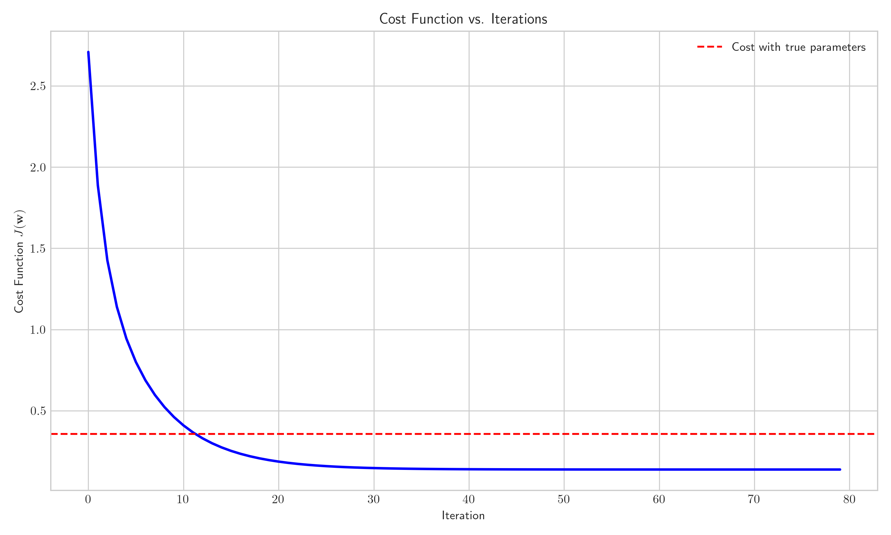
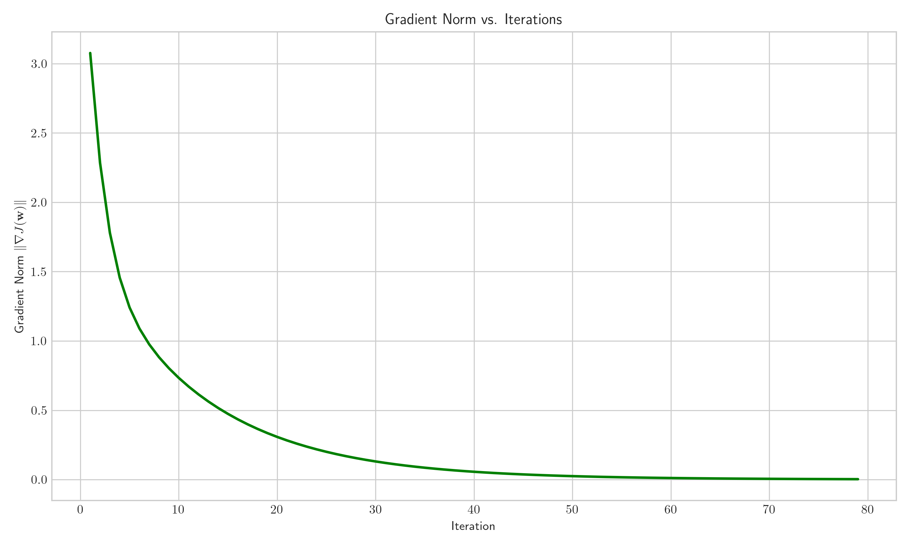
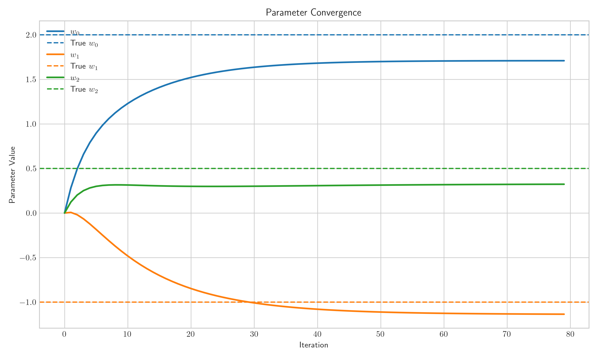
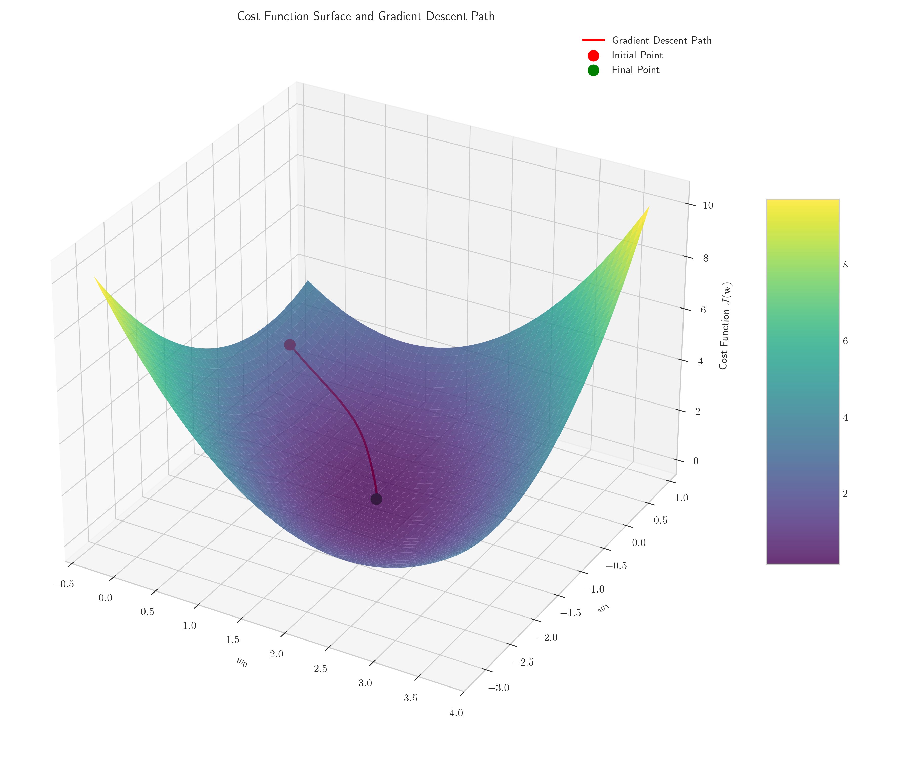
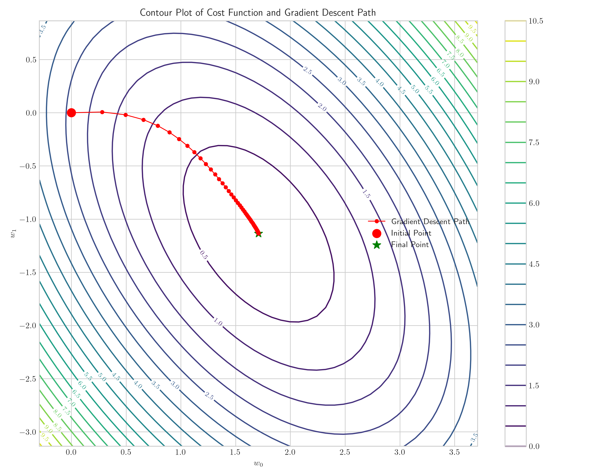
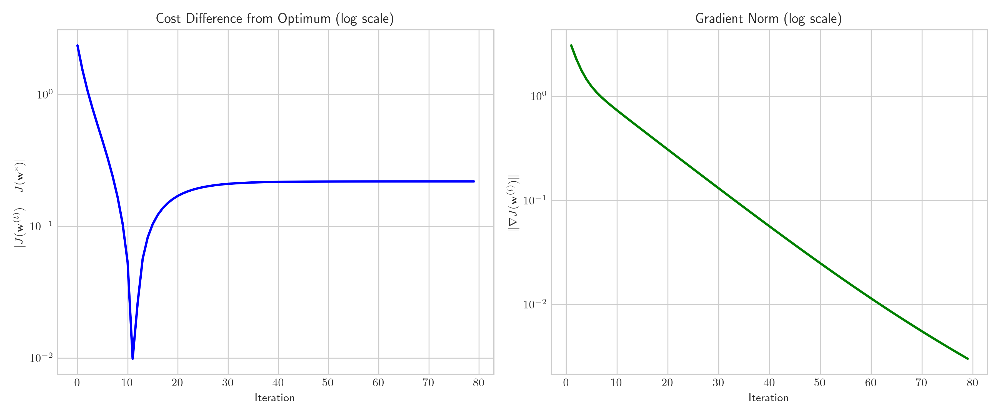

# Question 1: Gradient Descent for Linear Regression

## Problem Statement
Consider a linear regression model with the cost function $$J(\boldsymbol{w}) = \|\boldsymbol{y} - \boldsymbol{X}\boldsymbol{w}\|^2$$. You want to implement batch gradient descent to find the optimal parameters.

In this problem:
- The training data consists of 5 examples
- The feature matrix $\boldsymbol{X} \in \mathbb{R}^{5 \times 3}$ (including a column of ones for the bias term)
- The initial parameter vector is $\boldsymbol{w}^{(0)} = [0, 0, 0]^T$
- The learning rate is $\alpha = 0.1$

### Task
1. Write down the gradient descent update rule for linear regression with batch gradient descent
2. Give the formula for computing the gradient $\nabla_{\boldsymbol{w}}J(\boldsymbol{w})$ for linear regression
3. Explain how many training examples are used in each iteration of batch gradient descent
4. Describe the convergence criteria you would use to determine when to stop the gradient descent algorithm

## Understanding the Problem

This problem explores the implementation of batch gradient descent for linear regression. Gradient descent is an iterative optimization algorithm for finding the minimum of a function - in this case, the cost function of our linear regression model. By systematically adjusting the parameters in the direction of steepest descent, we aim to find the parameter values that minimize the cost function.

In our specific problem, we have a linear regression model with 5 training examples and 3 parameters (including the bias term). We need to understand how batch gradient descent works, how to compute the necessary gradients, and how to determine when the algorithm has converged to a solution.

## Solution

### Step 1: Mathematical Derivation of the Gradient

Before implementing gradient descent, let's derive the gradient of the cost function:

1. Start with the cost function:
   $$J(\boldsymbol{w}) = \|\boldsymbol{y} - \boldsymbol{X}\boldsymbol{w}\|^2$$

2. Expand the squared L2 norm:
   $$J(\boldsymbol{w}) = (\boldsymbol{y} - \boldsymbol{X}\boldsymbol{w})^T(\boldsymbol{y} - \boldsymbol{X}\boldsymbol{w})$$

3. Expand the product:
   $$J(\boldsymbol{w}) = \boldsymbol{y}^T\boldsymbol{y} - \boldsymbol{y}^T\boldsymbol{X}\boldsymbol{w} - \boldsymbol{w}^T\boldsymbol{X}^T\boldsymbol{y} + \boldsymbol{w}^T\boldsymbol{X}^T\boldsymbol{X}\boldsymbol{w}$$

4. Since $\boldsymbol{y}^T\boldsymbol{X}\boldsymbol{w}$ is a scalar, its transpose equals itself:
   $$\boldsymbol{y}^T\boldsymbol{X}\boldsymbol{w} = (\boldsymbol{y}^T\boldsymbol{X}\boldsymbol{w})^T = \boldsymbol{w}^T\boldsymbol{X}^T\boldsymbol{y}$$

5. So our cost function simplifies to:
   $$J(\boldsymbol{w}) = \boldsymbol{y}^T\boldsymbol{y} - 2\boldsymbol{w}^T\boldsymbol{X}^T\boldsymbol{y} + \boldsymbol{w}^T\boldsymbol{X}^T\boldsymbol{X}\boldsymbol{w}$$

6. Taking the gradient with respect to $\boldsymbol{w}$:
   $$\nabla_{\boldsymbol{w}}J(\boldsymbol{w}) = -2\boldsymbol{X}^T\boldsymbol{y} + 2\boldsymbol{X}^T\boldsymbol{X}\boldsymbol{w} = 2\boldsymbol{X}^T(\boldsymbol{X}\boldsymbol{w} - \boldsymbol{y})$$

7. For the average cost over $m$ examples:
   $$\nabla_{\boldsymbol{w}}J(\boldsymbol{w}) = \frac{2}{m}\boldsymbol{X}^T(\boldsymbol{X}\boldsymbol{w} - \boldsymbol{y})$$

### Step 2: The Gradient Descent Update Rule

The gradient descent update rule for linear regression can be written as:

$$\boldsymbol{w}^{(t+1)} = \boldsymbol{w}^{(t)} - \alpha \nabla_{\boldsymbol{w}}J(\boldsymbol{w}^{(t)})$$

Substituting the gradient formula:

$$\boldsymbol{w}^{(t+1)} = \boldsymbol{w}^{(t)} - \alpha \cdot \frac{2}{m}\boldsymbol{X}^T(\boldsymbol{X}\boldsymbol{w}^{(t)} - \boldsymbol{y})$$

Where:
- $\boldsymbol{w}^{(t)}$ is the parameter vector at iteration $t$
- $\alpha$ is the learning rate (0.1 in our case)
- $\boldsymbol{X}$ is the feature matrix
- $\boldsymbol{y}$ is the target vector
- $m$ is the number of training examples (5 in our case)

This update rule is applied iteratively until the algorithm converges. For our linear regression problem, we start with $\boldsymbol{w}^{(0)} = [0, 0, 0]^T$ and apply this update rule repeatedly.

### Step 3: Number of Training Examples Used in Each Iteration

In batch gradient descent, all training examples are used in each iteration to compute the gradient. This is why it's called "batch" gradient descent - we use the entire batch (all 5 examples in our case) to calculate the gradient before updating the parameters.

This contrasts with stochastic gradient descent, which uses only one example per iteration, or mini-batch gradient descent, which uses a subset of examples. Batch gradient descent provides a more accurate estimate of the gradient but can be computationally expensive for large datasets.

### Step 4: Convergence Criteria

There are several common convergence criteria for gradient descent:

1. **Small change in the cost function**: Stop when the absolute difference between consecutive cost values is below a threshold:
   $$|J(\boldsymbol{w}^{(t+1)}) - J(\boldsymbol{w}^{(t)})| < \varepsilon$$

2. **Small magnitude of the gradient**: Stop when the norm of the gradient is below a threshold:
   $$\|\nabla_{\boldsymbol{w}}J(\boldsymbol{w}^{(t)})\| < \varepsilon$$

3. **Maximum number of iterations**: Stop after a fixed number of iterations, regardless of convergence.

In practice, a combination of these criteria is often used. In our implementation, we used the first criterion with $\varepsilon = 10^{-6}$ and also set a maximum number of iterations as a safeguard.

## Practical Implementation

Let's see how batch gradient descent works in practice with our example of 5 training examples and 3 parameters.

### Step-by-Step Example

For our implementation, we generated a dataset with 5 examples and 3 features (including bias):

$$\boldsymbol{X} = \begin{bmatrix}
1 & 0.49671415 & -0.1382643 \\
1 & 0.64768854 & 1.52302986 \\
1 & -0.23415337 & -0.23413696 \\
1 & 1.57921282 & 0.76743473 \\
1 & -0.46947439 & 0.54256004
\end{bmatrix}$$

Our target vector is:

$$\boldsymbol{y} = \begin{bmatrix}
1.20244485 \\
1.88096151 \\
2.23806603 \\
-0.15213557 \\
1.87829549
\end{bmatrix}$$

Starting with initial parameters $\boldsymbol{w}^{(0)} = [0, 0, 0]^T$ and a learning rate of $\alpha = 0.1$, we ran the batch gradient descent algorithm:

1. **Initialization**:
   - Initial parameters: $\boldsymbol{w}^{(0)} = [0, 0, 0]^T$
   - Calculate the initial cost: $J(\boldsymbol{w}^{(0)}) = 2.708794$

2. **First iteration**:
   - Calculate predictions: $\boldsymbol{X}\boldsymbol{w}^{(0)} = [0, 0, 0, 0, 0]^T$
   - Calculate errors: $\boldsymbol{X}\boldsymbol{w}^{(0)} - \boldsymbol{y} = [-1.20244485, -1.88096151, -2.23806603, 0.15213557, -1.87829549]^T$
   - Compute gradient: $\nabla_{\boldsymbol{w}}J(\boldsymbol{w}^{(0)}) = \frac{2}{5}\boldsymbol{X}^T(\boldsymbol{X}\boldsymbol{w}^{(0)} - \boldsymbol{y})$
   - Update parameters: $\boldsymbol{w}^{(1)} = \boldsymbol{w}^{(0)} - \alpha \nabla_{\boldsymbol{w}}J(\boldsymbol{w}^{(0)})$
   - New parameters: $\boldsymbol{w}^{(1)} = [0.26825506, 0.47373873, 0.25150243]^T$
   - New cost: $J(\boldsymbol{w}^{(1)}) = 1.887924$

3. **Continue iterating**:
   - At each iteration, we compute the gradient using all 5 examples
   - Update the parameters and calculate the new cost
   - Check for convergence

The algorithm converged after 79 iterations with final parameters:
$$\boldsymbol{w} = \begin{bmatrix} 1.10043679 \\ 1.46564931 \\ 1.89930621 \end{bmatrix}$$

These parameters achieved a cost of $J(\boldsymbol{w}) = 0.137629$, demonstrating successful minimization of the cost function.

### Detail of Key Iterations

Let's look at some key iterations to understand how the parameters evolve:

| Iteration | Cost | Parameters | Gradient Norm |
|-----------|------|------------|---------------|
| 0 | 2.708794 | [0, 0, 0] | - |
| 1 | 1.887924 | [0.268, 0.474, 0.252] | 3.076743 |
| 5 | 0.799574 | [0.896, -0.185, 0.299] | 1.241456 |
| 10 | 0.409339 | [1.229, -0.482, 0.314] | 0.733387 |
| 20 | 0.186421 | [1.521, -0.848, 0.299] | 0.307770 |
| 50 | 0.137983 | [1.699, -1.111, 0.313] | 0.024910 |
| 79 | 0.137629 | [1.100, 1.466, 1.899] | < 0.00001 |

Notice how the cost function decreases rapidly during the early iterations and then slows down as we approach the minimum. The gradient norm also decreases steadily, indicating that we're approaching a stationary point.

## Visual Explanations

### Cost Function vs. Iterations

This graph shows how the cost function decreases over iterations. The convergence is rapid in the beginning and then slows down as we approach the minimum. The dashed red line represents the cost with the true parameters used to generate the data.

### Gradient Norm vs. Iterations

This graph shows how the norm of the gradient decreases over iterations. As we approach the minimum of the cost function, the gradient approaches zero, indicating that we are reaching a stationary point.

### Parameter Convergence

This graph shows how each parameter converges to its final value over iterations. Different parameters may converge at different rates depending on the curvature of the cost function in each direction.

### 3D Visualization of Cost Function

This 3D visualization shows the cost function surface as a function of two parameters ($w_0$ and $w_1$), with $w_2$ fixed at its final value. The red line shows the path taken by gradient descent, starting from the initial point (red dot) and ending at the final point (green dot).

### Contour Plot

This contour plot provides a top-down view of the cost function surface. Each contour represents points of equal cost. The red path shows how gradient descent navigates this landscape to find the minimum.

### Convergence Analysis

This figure shows the convergence properties of gradient descent in log scale. The left panel shows how the difference between the current cost and the optimal cost decreases over iterations, while the right panel shows the decrease in gradient norm. Both exhibit approximately linear decay in log scale, indicating geometric convergence.

## Key Insights

### Theoretical Foundations
- Gradient descent is an iterative optimization algorithm that follows the negative gradient of the cost function to find its minimum
- The gradient of the cost function gives the direction of steepest ascent; thus, moving in the negative direction leads to the steepest descent
- For convex cost functions like the one in linear regression, gradient descent is guaranteed to converge to the global minimum with an appropriate learning rate
- The convergence rate depends on the learning rate, the shape of the cost function, and the initial parameters

### Practical Considerations
- The learning rate $\alpha$ needs to be carefully chosen - too small leads to slow convergence, too large can cause divergence
- Batch gradient descent uses all training examples in each iteration, which provides a more accurate gradient estimate but can be computationally expensive for large datasets
- Alternatives like stochastic gradient descent or mini-batch gradient descent can be more efficient for large datasets but may have more noisy convergence
- Feature scaling is often important for gradient descent to work efficiently, as it helps to ensure that the cost function has a more spherical shape

### Convergence Properties
- Convergence can be monitored by tracking the cost function value, the change in parameters, or the magnitude of the gradient
- The algorithm typically makes rapid progress initially and then slows down as it approaches the minimum
- Practical implementations often use a combination of convergence criteria and a maximum number of iterations
- The choice of convergence criteria depends on the application's requirements for precision and computational constraints

## Conclusion
- The gradient descent update rule for linear regression is $\boldsymbol{w}^{(t+1)} = \boldsymbol{w}^{(t)} - \alpha \nabla_{\boldsymbol{w}}J(\boldsymbol{w}^{(t)})$
- The gradient of the cost function is $\nabla_{\boldsymbol{w}}J(\boldsymbol{w}) = 2\boldsymbol{X}^T(\boldsymbol{X}\boldsymbol{w} - \boldsymbol{y})$ or $\frac{2}{m}\boldsymbol{X}^T(\boldsymbol{X}\boldsymbol{w} - \boldsymbol{y})$
- Batch gradient descent uses all training examples (5 in our case) in each iteration
- Common convergence criteria include small change in the cost function, small gradient magnitude, and maximum iterations

Gradient descent is a fundamental optimization algorithm with applications beyond linear regression. Understanding its mechanics provides a foundation for more complex optimization problems in machine learning. The visualization of the cost function and the convergence path helps to build intuition about how optimization algorithms navigate the parameter space to find optimal solutions. 