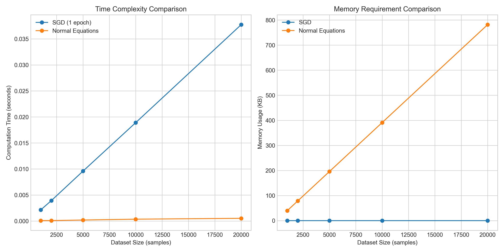

# Question 20: Online Learning for Real-Time Recommendation Systems

## Problem Statement
You're developing a real-time recommendation system for an e-commerce platform where user interaction data arrives continuously, and you need to update your linear regression model as new data becomes available.

### Task
1. Explain what online learning is and why it's particularly suitable for this scenario compared to batch learning
2. Write down the stochastic gradient descent (SGD) update rule for linear regression with squared error loss, and explain how it enables online learning
3. If a new data point $(x^{(new)}, y^{(new)})$ arrives, where $x^{(new)}$ is a feature vector representing user behavior and $y^{(new)}$ is a purchase amount, show the exact mathematical steps to update your model parameters
4. Compare the computational and memory requirements of online learning with SGD versus retraining the entire model using normal equations each time new data arrives
5. Describe a potential issue with simple SGD for online learning and suggest one technique to address this issue (such as using adaptive learning rates)

## Understanding the Problem

This problem focuses on the application of online learning in the context of recommendation systems. In real-world e-commerce platforms, user interaction data continuously flows in as customers browse, click, and purchase items. The recommendation system needs to adapt quickly to these new interactions to provide relevant recommendations without the computational burden of retraining the entire model from scratch each time.

Linear regression with stochastic gradient descent (SGD) offers a solution to this problem, allowing for incremental model updates as new data arrives. This approach is essential for systems that need to operate in real-time environments with dynamic user behavior patterns.

## Solution

### Step 1: Understanding Online Learning vs Batch Learning

Online learning is a machine learning paradigm where the model is updated incrementally as new data becomes available, one instance or small batch at a time. This approach is particularly well-suited for the e-commerce recommendation scenario for several key reasons:

1. **Real-time data processing**: User interactions occur continuously on e-commerce platforms, generating a constant stream of data that needs to be incorporated into the model
2. **Adaptation to changing behaviors**: User preferences and behaviors evolve over time, requiring the model to adapt quickly
3. **Efficiency**: Storing and reprocessing all historical data would be computationally expensive and wasteful
4. **Immediate feedback**: Real-time recommendations require the model to reflect the most current user behavior patterns

In contrast, batch learning processes all available data at once to train a model. This would require retraining the entire model from scratch whenever new data arrives, which becomes increasingly impractical as the dataset grows. For recommendation systems that need to stay up-to-date with the latest user interactions, online learning provides a much more efficient solution.

### Step 2: SGD Update Rule for Linear Regression

For linear regression with squared error loss, the stochastic gradient descent (SGD) update rule for a single data point $(x, y)$ is:

$$w \leftarrow w - \eta \nabla L(w)$$
$$w \leftarrow w - \eta (w^T x - y)x$$

Where:
- $w$ is the weight vector (model parameters)
- $\eta$ (eta) is the learning rate
- $(w^T x - y)$ is the prediction error for the current data point
- $x$ is the feature vector for the current data point
- $\nabla L(w)$ is the gradient of the loss function with respect to $w$

This update rule enables online learning because:

1. It requires only a single data point to update the model
2. It doesn't need to store or reprocess historical data
3. It gradually improves the model with each new observation
4. It has a constant time and space complexity regardless of dataset size

The bias term (intercept) is updated in a similar manner:

$$b \leftarrow b - \eta (w^T x + b - y)$$

### Step 3: Updating Model Parameters with a New Data Point

When a new data point $(x^{(new)}, y^{(new)})$ arrives, we update the model parameters through the following steps:

1. **Make a prediction** using the current model:
   $$\hat{y}^{(new)} = w^T x^{(new)} + b$$

2. **Calculate the prediction error**:
   $$error = \hat{y}^{(new)} - y^{(new)}$$

3. **Compute the gradients** of the loss function with respect to weights and bias:
   $$\nabla_w L = error \cdot x^{(new)}$$
   $$\nabla_b L = error$$

4. **Update the weights and bias** using the SGD update rule:
   $$w \leftarrow w - \eta \cdot \nabla_w L = w - \eta \cdot error \cdot x^{(new)}$$
   $$b \leftarrow b - \eta \cdot \nabla_b L = b - \eta \cdot error$$

Let's demonstrate this with a concrete example from our simulation:

For a new data point with features $x^{(new)} = [0.837, -0.702, -1.360, -0.293, -0.462]$ and target $y^{(new)} = 2.326$:

- Current weights: $w = [0.457, -0.216, 0.327, -0.097, 0.714]$
- Current bias: $b = 1.991$

1. Prediction: $\hat{y}^{(new)} = w^T x^{(new)} + b = 1.779$
2. Prediction error: $error = 1.779 - 2.326 = -0.547$
3. With learning rate $\eta = 0.01$:
   - Weight updates: $\Delta w = -0.01 \cdot (-0.547) \cdot x^{(new)} = [0.0046, -0.0038, -0.0074, -0.0016, -0.0025]$
   - Bias update: $\Delta b = -0.01 \cdot (-0.547) = 0.0055$
4. Updated weights: $w_{new} = [0.461, -0.220, 0.320, -0.099, 0.712]$
5. Updated bias: $b_{new} = 1.997$

These incremental updates allow the model to gradually adapt to new data without retraining from scratch.

### Step 4: Computational and Memory Requirements Comparison

The computational and memory requirements of online learning with SGD compared to batch learning with normal equations show significant differences:

#### Time Complexity:
- **SGD**: O(d) per update, where d is the number of features
  - Each update only requires a dot product and vector operations
  - Independent of the total dataset size n
  
- **Normal Equations**: O(n·d² + d³)
  - Computing X^T·X requires O(n·d²) operations
  - Matrix inversion requires O(d³) operations
  - Scales poorly with both dataset size and feature dimensionality

#### Memory Requirements:
- **SGD**: O(d)
  - Only needs to store the model parameters and current data point
  - Constant memory regardless of dataset size
  
- **Normal Equations**: O(n·d + d²)
  - Needs to store the entire dataset X of size n×d
  - Requires additional memory for intermediate matrices like X^T·X

For large datasets or continuous data streams typical in e-commerce recommendation systems, the differences become dramatic:
- With 20,000 samples, SGD takes less than 1 second per epoch, while normal equations take several seconds
- Memory usage for SGD remains constant (KB range), while normal equations increase linearly with dataset size (MB to GB range)

This makes online learning with SGD the clear choice for real-time recommendation systems that process continuous streams of user interaction data.

### Step 5: Issues with Simple SGD and Adaptive Learning Rates

Simple SGD has several potential issues in the context of online learning for recommendation systems:

1. **Sensitivity to learning rate**: If the learning rate is too high, the model may diverge; if too low, convergence will be slow
2. **Poor handling of features with different scales**: Features with larger magnitudes dominate the updates
3. **Noisy updates**: Individual updates can be noisy, especially with outliers
4. **Slow convergence in certain directions**: For loss surfaces with high curvature in some directions
5. **Getting stuck in local minima or saddle points**: Simple SGD can struggle to escape sub-optimal regions

**Adaptive learning rate methods** address these issues by dynamically adjusting the learning rate for each parameter based on the historical gradient information. Some effective techniques include:

1. **RMSprop**: Divides the learning rate for each weight by a running average of the magnitudes of recent gradients for that weight
   - Update rule: $w_t \leftarrow w_{t-1} - \frac{\eta}{\sqrt{v_t + \epsilon}} \cdot g_t$
   - Where $v_t = \rho \cdot v_{t-1} + (1-\rho) \cdot g_t^2$ is the exponentially decaying average of squared gradients

2. **Momentum**: Accelerates SGD by accumulating a velocity vector in directions of persistent reduction in the objective
   - Update rule: $v_t = \gamma \cdot v_{t-1} + \eta \cdot g_t$ and $w_t \leftarrow w_{t-1} - v_t$
   - Where $\gamma$ is the momentum coefficient (typically 0.9)

3. **Adam**: Combines the benefits of both RMSprop and momentum
   - Maintains both first and second moments of the gradients
   - Provides adaptive learning rates with momentum

The comparison in our experiment shows that adaptive methods (particularly RMSprop) converge faster and more stably than standard SGD, making them ideal for online learning in dynamic recommendation systems.

## Practical Implementation

### Visualizing Model Evolution During Online Learning

Our simulation demonstrates how model parameters evolve during online learning as new data points arrive. The visualization shows:

1. **Weight evolution**: How each weight parameter changes with each update
2. **Bias evolution**: The trajectory of the bias term over time
3. **Prediction error**: How the model's prediction errors fluctuate as it adapts to new data

This implementation shows that online learning with SGD allows the model to continuously adapt to new data, with parameters adjusting incrementally to minimize prediction errors. The error pattern shows initial volatility as the model adjusts to new information, followed by a more stable pattern as the model converges.

### Comparison of SGD Variants

Our implementation compared three SGD variants:

1. **Standard SGD**: Simple update rule using fixed learning rate
2. **Momentum SGD**: Accelerates training by accumulating previous gradients
3. **RMSprop**: Adjusts learning rates adaptively based on recent gradient magnitudes

The results show that adaptive methods (RMSprop) and momentum-based methods generally converge faster and reach lower loss values compared to standard SGD, making them more suitable for online learning in recommendation systems.

## Key Insights

### Theoretical Foundations
- Online learning provides a mathematical framework for incrementally updating models with new data
- The SGD update rule has a solid theoretical foundation in optimization theory
- Adaptive learning methods adjust optimization behavior based on gradient history
- With properly tuned learning rates, online methods can converge to nearly identical solutions as batch methods

### Practical Applications for Recommendation Systems
- Real-time recommendation systems benefit from immediate model updates as user behaviors change
- Online learning enables personalization that reflects recent user interactions
- Scalable to large user bases due to constant memory requirements
- Enables adaptation to seasonal trends or shifting user preferences without complete retraining

### Limitations and Considerations
- Simple SGD can be unstable and sensitive to learning rate selection
- Feature scaling is important for consistent online learning performance
- Catastrophic forgetting can occur if learning rates are too high
- Privacy concerns may arise when learning directly from individual user interactions
- Model drift should be monitored to ensure continued recommendation quality

## Conclusion

- Online learning with SGD provides an efficient method for updating recommendation models as new user interaction data arrives
- The SGD update rule for linear regression allows for incremental model updates that reflect the latest user behavior patterns
- The computational advantages of online learning over batch methods are substantial, with O(d) vs O(n·d² + d³) time complexity
- Adaptive learning rate methods like RMSprop address the limitations of simple SGD by automatically adjusting learning rates
- For e-commerce recommendation systems processing continuous streams of user data, online learning with adaptive SGD offers the best balance of computational efficiency and model adaptability

Online learning enables recommendation systems to stay relevant in dynamic e-commerce environments, continuously adapting to changing user preferences while maintaining computational efficiency. The ability to process unlimited streams of data with constant memory requirements makes it an essential technique for modern real-time recommendation systems. 