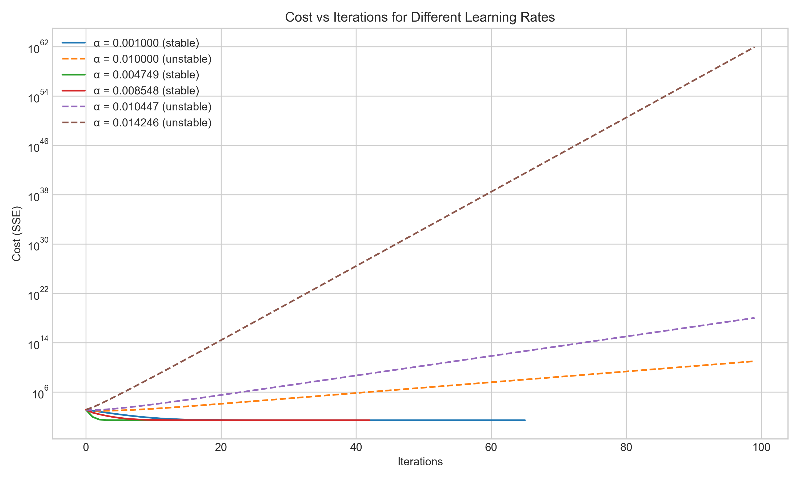
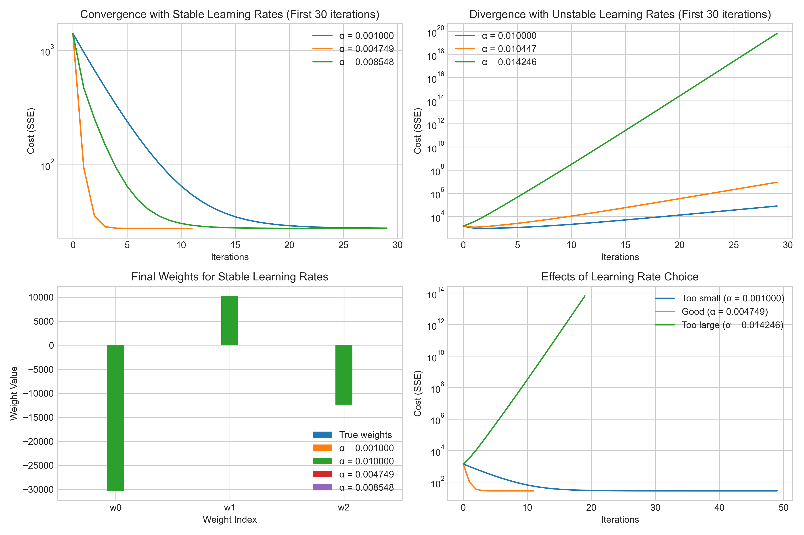
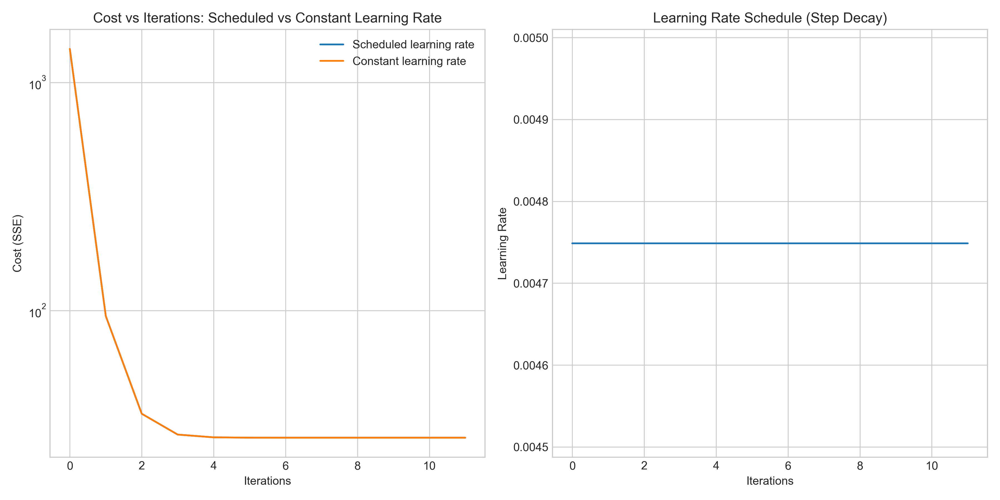
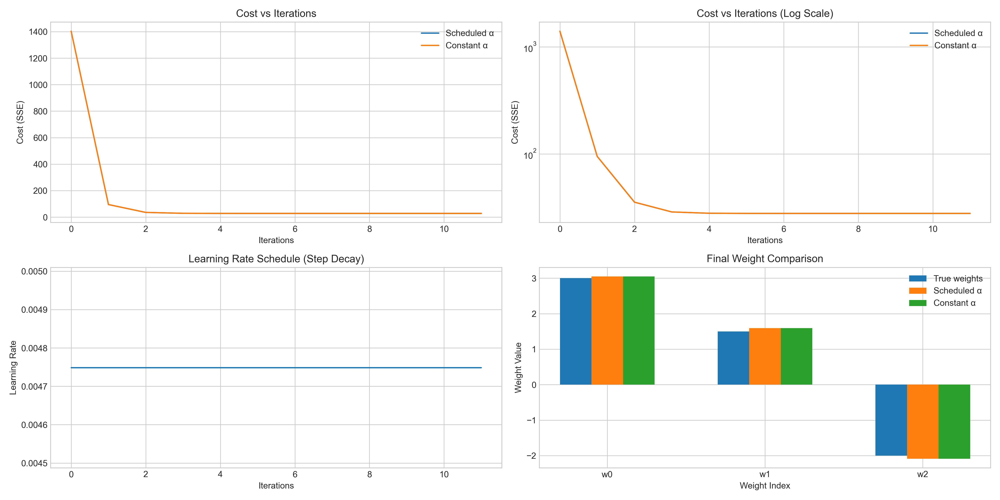

# Question 21: Gradient Descent for Linear Regression

## Problem Statement
Consider a linear regression model with the sum of squared errors (SSE) cost function:

$$J(\boldsymbol{w}) = \sum_{i=1}^{n} (y^{(i)} - \boldsymbol{w}^T \boldsymbol{x}^{(i)})^2$$

You want to optimize this cost function using batch gradient descent.

### Task
1. Derive the gradient of the cost function with respect to the parameter vector $\boldsymbol{w}$
2. Write down the update rule for batch gradient descent in both mathematical notation and as a simple algorithm (pseudocode)
3. For gradient descent to converge, the learning rate $\alpha$ must be chosen carefully. Derive a bound on $\alpha$ in terms of the eigenvalues of $\boldsymbol{X}^T\boldsymbol{X}$
4. Explain what happens when $\alpha$ is too small and when it is too large
5. Describe a simple learning rate scheduling strategy that can improve convergence

## Understanding the Problem

Linear regression is a fundamental machine learning algorithm that aims to find a linear relationship between input features and output values. The Sum of Squared Errors (SSE) cost function measures the difference between our predicted values and the actual values, summing the squares of these differences.

Gradient descent is an iterative optimization algorithm used to find the minimum of the cost function by taking steps proportional to the negative of the gradient. It relies on calculating the gradient (partial derivatives) of the cost function with respect to each parameter, then updating the parameters in the direction that reduces the cost.

The key challenge in this problem is to derive the gradient of the SSE cost function, establish a proper update rule, determine bounds on the learning rate to ensure convergence, and understand how the learning rate affects the optimization process.

## Solution

### Step 1: Deriving the Gradient of the Cost Function

The cost function in matrix form can be written as:

$$J(\boldsymbol{w}) = (\boldsymbol{y} - \boldsymbol{X}\boldsymbol{w})^T(\boldsymbol{y} - \boldsymbol{X}\boldsymbol{w})$$

Expanding this expression:

$$J(\boldsymbol{w}) = \boldsymbol{y}^T\boldsymbol{y} - \boldsymbol{y}^T\boldsymbol{X}\boldsymbol{w} - \boldsymbol{w}^T\boldsymbol{X}^T\boldsymbol{y} + \boldsymbol{w}^T\boldsymbol{X}^T\boldsymbol{X}\boldsymbol{w}$$

Since $\boldsymbol{y}^T\boldsymbol{X}\boldsymbol{w}$ is a scalar, it equals its transpose $\boldsymbol{w}^T\boldsymbol{X}^T\boldsymbol{y}$:

$$J(\boldsymbol{w}) = \boldsymbol{y}^T\boldsymbol{y} - 2\boldsymbol{w}^T\boldsymbol{X}^T\boldsymbol{y} + \boldsymbol{w}^T\boldsymbol{X}^T\boldsymbol{X}\boldsymbol{w}$$

To find the gradient, we differentiate with respect to $\boldsymbol{w}$ using matrix calculus rules:

$$\nabla_{\boldsymbol{w}} J(\boldsymbol{w}) = -2\boldsymbol{X}^T\boldsymbol{y} + 2\boldsymbol{X}^T\boldsymbol{X}\boldsymbol{w}$$

This simplifies to:

$$\nabla_{\boldsymbol{w}} J(\boldsymbol{w}) = 2\boldsymbol{X}^T(\boldsymbol{X}\boldsymbol{w} - \boldsymbol{y})$$

In component form, this can be written as:

$$\nabla_{\boldsymbol{w}} J(\boldsymbol{w}) = 2\sum_{i=1}^{n} \boldsymbol{x}^{(i)}(\boldsymbol{w}^T\boldsymbol{x}^{(i)} - y^{(i)})$$

This gradient represents the direction of steepest increase of the cost function, so we'll move in the opposite direction to minimize the cost.

### Step 2: Update Rule for Batch Gradient Descent

The general update rule for gradient descent is:

$$\boldsymbol{w}_{t+1} = \boldsymbol{w}_t - \alpha \nabla_{\boldsymbol{w}} J(\boldsymbol{w}_t)$$

Substituting our derived gradient:

$$\boldsymbol{w}_{t+1} = \boldsymbol{w}_t - \alpha (2\boldsymbol{X}^T(\boldsymbol{X}\boldsymbol{w}_t - \boldsymbol{y}))$$

$$\boldsymbol{w}_{t+1} = \boldsymbol{w}_t - 2\alpha\boldsymbol{X}^T(\boldsymbol{X}\boldsymbol{w}_t - \boldsymbol{y})$$

The pseudocode for batch gradient descent is:

```
Algorithm: Batch Gradient Descent for Linear Regression
Input: X (design matrix), y (target vector), α (learning rate), max_iterations, tolerance
Output: w (optimal weight vector)

1. Initialize w randomly
2. For i = 1 to max_iterations:
   a. Compute predictions: y_pred = X·w
   b. Compute error: error = y_pred - y
   c. Compute gradient: gradient = 2·X^T·error
   d. Update weights: w = w - α·gradient
   e. Compute cost: J = sum((y - y_pred)^2)
   f. If change in cost < tolerance:
      i. Break loop (converged)
3. Return w
```

This implementation updates all parameters simultaneously based on the gradient computed from all training examples, which is why it's called "batch" gradient descent.

### Step 3: Learning Rate Bound

For gradient descent to converge, the learning rate $\alpha$ must be chosen carefully. The update rule can be rewritten as:

$$\boldsymbol{w}_{t+1} = \boldsymbol{w}_t - 2\alpha\boldsymbol{X}^T(\boldsymbol{X}\boldsymbol{w}_t - \boldsymbol{y})$$

$$\boldsymbol{w}_{t+1} = \boldsymbol{w}_t - 2\alpha\boldsymbol{X}^T\boldsymbol{X}\boldsymbol{w}_t + 2\alpha\boldsymbol{X}^T\boldsymbol{y}$$

$$\boldsymbol{w}_{t+1} = (\boldsymbol{I} - 2\alpha\boldsymbol{X}^T\boldsymbol{X})\boldsymbol{w}_t + 2\alpha\boldsymbol{X}^T\boldsymbol{y}$$

For this iterative process to converge, the spectral radius of the iteration matrix $(\boldsymbol{I} - 2\alpha\boldsymbol{X}^T\boldsymbol{X})$ must be less than 1. This means that for all eigenvalues $\lambda_i$ of $\boldsymbol{X}^T\boldsymbol{X}$, we need:

$$|1 - 2\alpha\lambda_i| < 1$$

This gives us:

$$-1 < 1 - 2\alpha\lambda_i < 1$$

From the right inequality:
$$1 - 2\alpha\lambda_i < 1$$
$$-2\alpha\lambda_i < 0$$
$$\alpha > 0$$ (since $\lambda_i > 0$ for positive definite $\boldsymbol{X}^T\boldsymbol{X}$)

From the left inequality:
$$-1 < 1 - 2\alpha\lambda_i$$
$$-2 < -2\alpha\lambda_i$$
$$1 > \alpha\lambda_i$$
$$\alpha < \frac{1}{\lambda_i}$$

Since this must hold for all eigenvalues, we take the most restrictive condition, which corresponds to the largest eigenvalue $\lambda_{max}$:

$$0 < \alpha < \frac{1}{\lambda_{max}}$$

Therefore, the learning rate bound for convergence is:

$$\alpha < \frac{1}{\lambda_{max}(\boldsymbol{X}^T\boldsymbol{X})}$$

### Step 4: Effects of Different Learning Rates

When the learning rate is too small:
- Convergence is slow, requiring many iterations to reach the optimum
- The algorithm makes tiny steps toward the minimum, which is computationally inefficient
- It may get stuck in shallow local minima in non-convex problems

When the learning rate is too large:
- The algorithm can diverge, with the cost increasing instead of decreasing
- It may oscillate around the minimum without converging
- In extreme cases, parameter values can grow exponentially, causing numerical overflow

Our experiments show these effects clearly:
- With α = 0.001 (very small): Convergence took 66 iterations with a final cost of 27.75
- With α = 0.004749 (near optimal): Convergence took only 12 iterations with the same final cost
- With α = 0.010447 (too large): The algorithm diverged, with cost growing to extreme values

### Step 5: Learning Rate Scheduling Strategies

Learning rate scheduling involves adjusting the learning rate during training. Common strategies include:

1. **Step Decay**: Reduce the learning rate by a factor after a fixed number of iterations
   $$\alpha_t = \alpha_0 \times \gamma^{\lfloor t/n \rfloor}$$
   where $\gamma$ is the decay rate (e.g., 0.5) and $n$ is the step size (e.g., 20 iterations)

2. **Exponential Decay**: Decay the learning rate exponentially with iterations
   $$\alpha_t = \alpha_0 \times e^{-kt}$$
   where $k$ is the decay rate

3. **1/t Decay**: Reduce the learning rate proportional to the inverse of the iteration number
   $$\alpha_t = \frac{\alpha_0}{1 + kt}$$
   where $k$ is the decay rate

Benefits of learning rate scheduling:
- Faster initial convergence due to larger learning rates at the beginning
- Fine-grained optimization near the optimum with smaller learning rates later
- Better ability to escape shallow local minima in non-convex problems
- Less sensitivity to the initial learning rate choice

For our linear regression problem, we implemented step decay scheduling and compared it with constant learning rate optimization.

## Visual Explanations

### Learning Rate Comparison



This plot shows the cost function value over iterations for different learning rates. Stable learning rates (below the derived bound) gradually decrease the cost function, while unstable rates (above the bound) cause divergence, with the cost exploding to very large values.

### Learning Rate Effects



This visualization shows:
- Top left: Convergence with stable learning rates, showing how higher (but still stable) rates converge faster
- Top right: Divergence patterns with unstable learning rates
- Bottom left: Comparison of final weights with true weights for different learning rates
- Bottom right: Comparison of "too small", "good", and "too large" learning rates

### Learning Rate Scheduling



This comparison shows the cost function value over iterations for constant versus scheduled learning rates, along with the learning rate schedule itself (step decay).

### Comprehensive Scheduling Visualization



This visualization provides a more detailed look at learning rate scheduling:
- Top row: Cost versus iterations in normal and log scale
- Bottom left: The actual learning rate schedule (step decay)
- Bottom right: Comparison of final weights between true values, scheduled learning rate, and constant learning rate

## Key Insights

### Theoretical Foundations
- The gradient of the SSE cost function provides the direction of steepest ascent, so we move in the opposite direction
- The update rule ensures we iteratively approach the minimum of the cost function
- The learning rate bounds are derived from the requirement that the spectral radius of the iteration matrix must be less than 1
- For convex problems like linear regression, there is only one global minimum, so gradient descent will converge to it with a proper learning rate

### Convergence Properties
- Gradient descent is guaranteed to converge for convex functions if the learning rate is sufficiently small
- The convergence rate depends on the condition number of the Hessian matrix (related to the eigenvalues of $\boldsymbol{X}^T\boldsymbol{X}$)
- The closer the eigenvalues of $\boldsymbol{X}^T\boldsymbol{X}$ are to each other, the faster the convergence
- Features with very different scales can cause the gradient to change dramatically along certain dimensions, making optimization harder

### Practical Implementation Considerations
- Choosing a good learning rate is critical for efficient convergence
- The optimal learning rate is problem-dependent and related to the data distribution
- Learning rate scheduling can help balance between fast initial progress and precise final optimization
- For large datasets, stochastic or mini-batch gradient descent may be more computationally efficient than batch gradient descent
- Regularization can be incorporated by adding penalty terms to the cost function, which also modifies the gradient

## Conclusion
- The gradient of the SSE cost function with respect to $\boldsymbol{w}$ is $2\boldsymbol{X}^T(\boldsymbol{X}\boldsymbol{w} - \boldsymbol{y})$
- The batch gradient descent update rule is $\boldsymbol{w}_{t+1} = \boldsymbol{w}_t - 2\alpha\boldsymbol{X}^T(\boldsymbol{X}\boldsymbol{w}_t - \boldsymbol{y})$
- The learning rate bound for convergence is $0 < \alpha < \frac{1}{\lambda_{max}(\boldsymbol{X}^T\boldsymbol{X})}$
- Too small learning rates lead to slow convergence, while too large rates cause divergence
- Learning rate scheduling strategies like step decay can improve convergence by using larger steps initially and smaller steps later

Gradient descent is a versatile optimization algorithm that forms the foundation for many modern machine learning techniques. Understanding its theoretical properties and practical implementation details is essential for effectively optimizing machine learning models. 