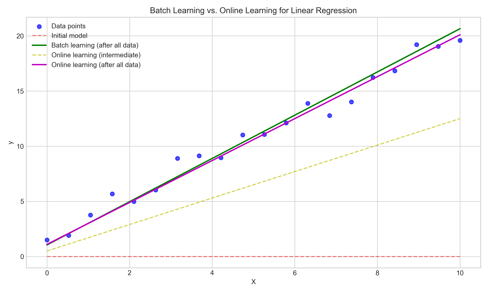
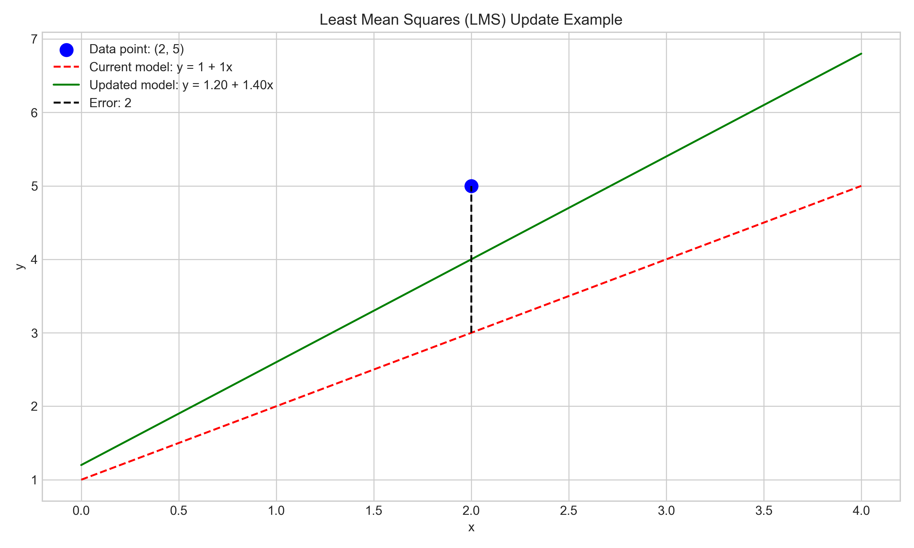
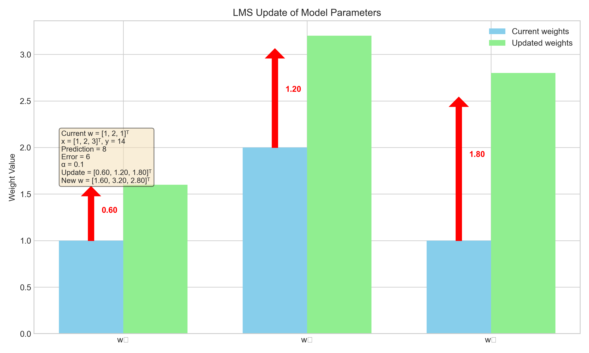
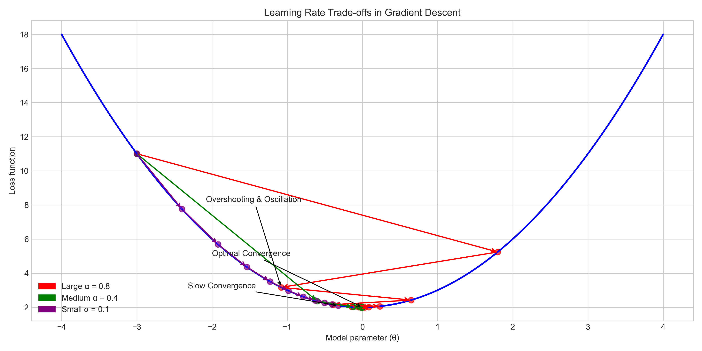
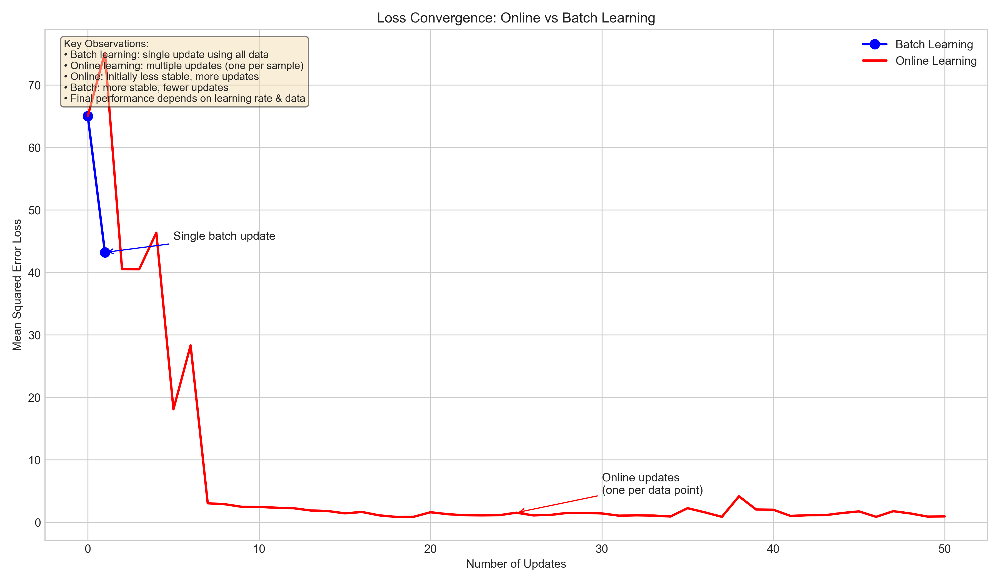
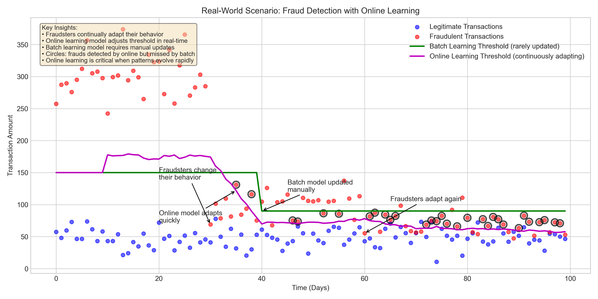

# Question 22: Online Learning for Linear Regression

## Problem Statement
Consider a scenario where data arrives sequentially in a stream, and you need to update your linear regression model in real-time.

### Task
1. Explain what online learning is and how it differs from batch learning
2. Write down the Least Mean Squares (LMS) update rule for online learning of linear regression
3. A new data point arrives with features $\boldsymbol{x}^{(new)} = [1, 2, 3]^T$ and target $y^{(new)} = 14$. If your current model parameters are $\boldsymbol{w} = [1, 2, 1]^T$ and you use a learning rate of $\alpha = 0.1$, calculate the updated parameters after processing this data point
4. Discuss the trade-offs between:
   a) A large learning rate vs. a small learning rate
   b) Online learning vs. batch learning
5. Describe a real-world scenario where online learning would be particularly valuable

## Understanding the Problem

This problem focuses on online learning for linear regression models. In traditional machine learning, we often train models on a fixed dataset (batch learning). However, in many real-world scenarios, data arrives continuously in streams, and we need methods to update our models incrementally without retraining from scratch.

Online learning is particularly important for scenarios with large datasets, streaming data, or when data distributions change over time. The problem asks us to understand how online learning works, how to update model parameters with each new data point, and to analyze the trade-offs involved in the learning approach.

## Solution

### Step 1: Understanding Online Learning vs. Batch Learning

**Batch Learning:**
- Processes all training data at once
- Updates model parameters after seeing all examples
- Requires storing the entire dataset in memory
- More computationally intensive for large datasets
- Generally more stable parameter updates

**Online Learning:**
- Processes data points one at a time as they arrive
- Updates model parameters after each example
- Only needs to store the current data point
- More efficient for large or streaming datasets
- May have less stable updates but adapts quickly to new patterns

The visualization shows how batch learning processes all data at once to reach a final model, while online learning updates the model incrementally with each data point. The final models may differ slightly due to the different learning approaches.

### Step 2: Least Mean Squares (LMS) Update Rule

The Least Mean Squares (LMS) update rule for online learning in linear regression is:

$$\boldsymbol{w} \leftarrow \boldsymbol{w} + \alpha(y - \boldsymbol{w}^T\boldsymbol{x})\boldsymbol{x}$$

Where:
- $\boldsymbol{w}$ is the weight vector
- $\alpha$ is the learning rate
- $y$ is the actual target value
- $\boldsymbol{x}$ is the feature vector
- $(y - \boldsymbol{w}^T\boldsymbol{x})$ is the prediction error

The figure illustrates how the LMS update rule adjusts the model based on the prediction error. The current model (red dashed line) makes a prediction, and based on the error (difference between the predicted and actual value), the model parameters are updated to create a new model (green line) that better fits the data point.

### Step 3: Calculating Updated Parameters for a New Data Point

Given:
- Current model parameters: $\boldsymbol{w} = [1, 2, 1]^T$
- New data point: $\boldsymbol{x}^{(new)} = [1, 2, 3]^T$, $y^{(new)} = 14$
- Learning rate: $\alpha = 0.1$

Step-by-step calculation:

1. **Current prediction**:
   $\boldsymbol{w}^T\boldsymbol{x} = 1 \times 1 + 2 \times 2 + 1 \times 3 = 1 + 4 + 3 = 8$

2. **Error calculation**:
   $y - \boldsymbol{w}^T\boldsymbol{x} = 14 - 8 = 6$

3. **Update term**:
   $\alpha(y - \boldsymbol{w}^T\boldsymbol{x})\boldsymbol{x} = 0.1 \times 6 \times [1, 2, 3]^T = [0.6, 1.2, 1.8]^T$

4. **Updated weights**:
   $\boldsymbol{w}_{new} = \boldsymbol{w} + \alpha(y - \boldsymbol{w}^T\boldsymbol{x})\boldsymbol{x} = [1, 2, 1]^T + [0.6, 1.2, 1.8]^T = [1.6, 3.2, 2.8]^T$

Therefore, the updated weight vector after processing the new data point is $\boldsymbol{w}_{new} = [1.6, 3.2, 2.8]^T$.

The visualization shows how each weight is updated based on the error and learning rate. The blue bars represent the current weights, and the green bars show the updated weights after applying the LMS update rule.

### Step 4: Trade-offs in Online Learning

#### A. Large Learning Rate vs. Small Learning Rate

**Large Learning Rate (α):**

*Advantages:*
- Faster initial convergence
- Adapts quickly to new patterns
- Can escape shallow local minima

*Disadvantages:*
- Risk of overshooting the minimum
- May not converge (oscillate around the minimum)
- Less stable updates, higher variance
- Can be more sensitive to outliers

**Small Learning Rate (α):**

*Advantages:*
- More stable updates, lower variance
- More likely to converge
- Less sensitive to noisy data or outliers

*Disadvantages:*
- Slower convergence
- May get stuck in local minima
- May take too long to adapt to new patterns

The visualization demonstrates how different learning rates affect convergence in gradient descent. With a large learning rate (red), the algorithm can overshoot and oscillate. A medium learning rate (green) often provides optimal convergence, while a small learning rate (purple) converges more slowly but steadily.

#### B. Online Learning vs. Batch Learning Trade-offs

**Online Learning Advantages:**
- Memory efficiency: only stores current data point
- Computational efficiency for large datasets
- Can handle streaming data and adapt to changes
- Works well when data is non-stationary (distribution changes over time)
- Can be more robust to redundant data points

**Online Learning Disadvantages:**
- Potentially less stable parameter updates
- Sensitive to the order of data points
- May converge to a suboptimal solution
- More sensitive to learning rate selection
- Performance can degrade with noisy data

**Batch Learning Advantages:**
- More stable and optimal parameter updates
- Not affected by the order of data presentation
- Generally more accurate for fixed datasets
- Better utilization of vectorization and parallelization
- Better theoretical guarantees of convergence

**Batch Learning Disadvantages:**
- High memory requirements for large datasets
- Computationally intensive for large datasets
- Cannot adapt to changing data distributions without retraining
- Not suitable for streaming data scenarios

The graph illustrates the convergence patterns of online vs batch learning. Batch learning makes a single update using all data, while online learning makes multiple updates (one per sample), which may initially be less stable but can eventually reach similar performance.

### Step 5: Real-World Scenario for Online Learning

A particularly valuable real-world application of online learning is **fraud detection** in financial transactions:

- **Why it's suitable for online learning:**
  - Fraudsters continuously adapt their strategies and behavior
  - Transaction data arrives in real-time streams
  - Patterns of fraud evolve quickly
  - Immediate adaptation to new fraud patterns is critical
  - Historical data may become less relevant as fraud tactics change

- **How online learning would work:**
  - New transaction data is processed as it arrives
  - Model parameters are updated with each transaction or small batch
  - Detection thresholds adapt to changing patterns of legitimate and fraudulent behavior
  - System can quickly respond to new fraud tactics without full retraining

The visualization demonstrates how online learning can adapt to changing fraud patterns. As fraudsters change their behavior (red dots), the online learning model (magenta line) quickly adjusts its detection threshold, while a batch learning model (green line) requires manual updates and misses fraudulent transactions during adaptation periods.

## Practical Implementation

The fraud detection example above demonstrates a practical implementation of online learning:

1. **Initial Model Setup:**
   - Start with a model trained on historical data
   - Set an initial detection threshold based on known patterns

2. **Real-time Processing:**
   - As new transactions arrive, calculate features and make predictions
   - Flag transactions that exceed the current threshold

3. **Continuous Learning:**
   - For each confirmed legitimate or fraudulent transaction:
   - Apply the LMS update rule: $\boldsymbol{w} \leftarrow \boldsymbol{w} + \alpha(y - \boldsymbol{w}^T\boldsymbol{x})\boldsymbol{x}$
   - Adjust thresholds based on recent data patterns

4. **Adaptation to New Patterns:**
   - As fraud patterns change, the model gradually adjusts
   - System becomes more sensitive to emerging fraud tactics
   - No need for complete retraining when patterns shift

This approach allows the fraud detection system to maintain effectiveness even as fraudsters change their tactics.

## Key Insights

### Mathematical Foundations
- The LMS update rule is a form of stochastic gradient descent, updating parameters based on a single data point at a time
- The update is proportional to both the error magnitude and the feature values
- The learning rate controls how quickly the model adapts to new information
- Online learning converges to the optimal solution under certain conditions (convex loss, decreasing learning rate schedule)

### Learning Rate Selection
- The learning rate is a critical hyperparameter in online learning
- Too large: risk of instability, oscillation, or divergence
- Too small: very slow adaptation to new patterns
- Optimal learning rates often decrease over time (learning rate schedules)
- Adaptive learning rate methods (like AdaGrad, RMSProp, Adam) can automatically adjust learning rates

### Practical Considerations
- Online learning is ideal for scenarios with continuous data streams
- It's well-suited for environments where patterns change over time (non-stationary)
- The order of data presentation can significantly impact model quality
- Regularization techniques can help stabilize online learning
- Mini-batch approaches (updating after small groups of examples) can balance stability and adaptivity

## Conclusion
- Online learning processes data sequentially, updating model parameters with each new data point
- The LMS update rule for linear regression is $\boldsymbol{w} \leftarrow \boldsymbol{w} + \alpha(y - \boldsymbol{w}^T\boldsymbol{x})\boldsymbol{x}$
- For the given example, the updated weights are $\boldsymbol{w}_{new} = [1.6, 3.2, 2.8]^T$
- Learning rate choice involves balancing speed of adaptation vs. stability
- Online learning trades off some stability for improved efficiency and adaptability
- Real-world applications like fraud detection benefit significantly from online learning's ability to adapt to changing patterns

Online learning represents a powerful approach for scenarios with streaming data or evolving patterns, allowing models to continuously adapt without the computational burden of full retraining. The ability to process data incrementally makes it ideal for applications with memory constraints, high data volume, or time-sensitive adaptation requirements. 