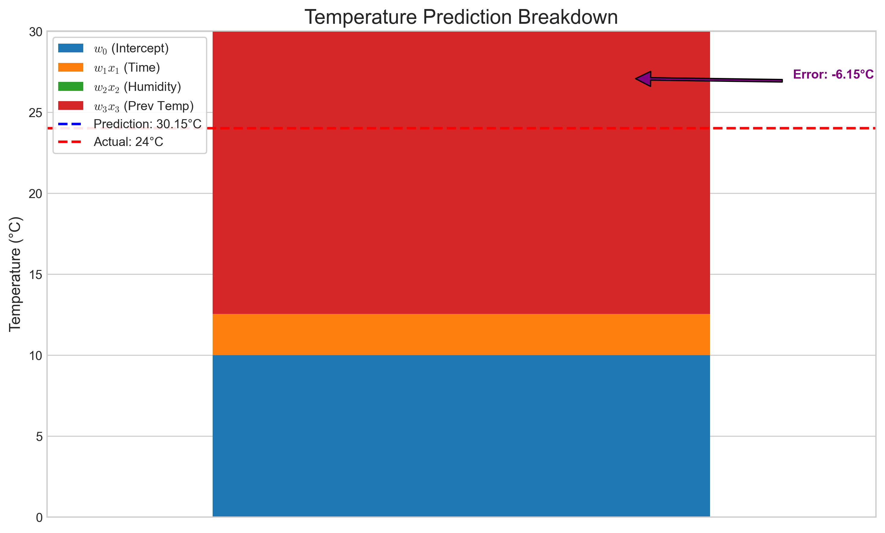
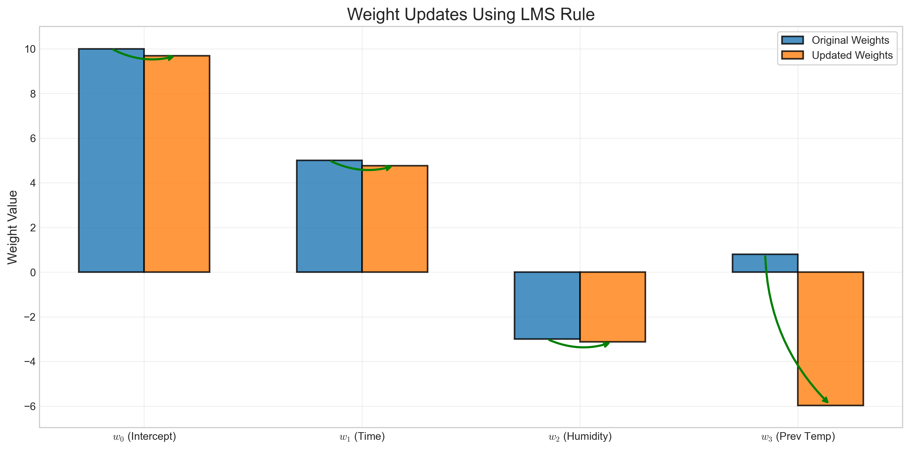
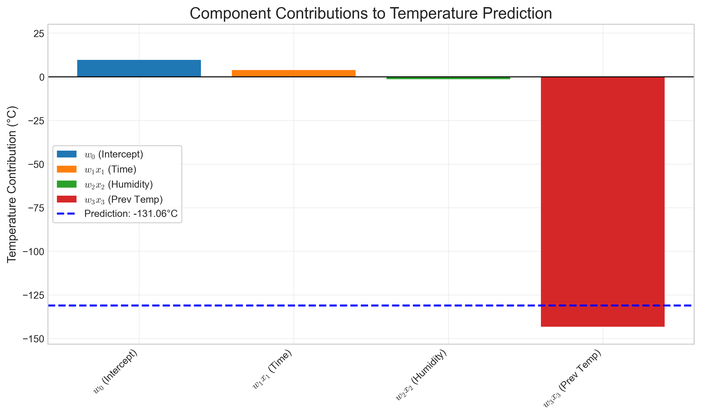
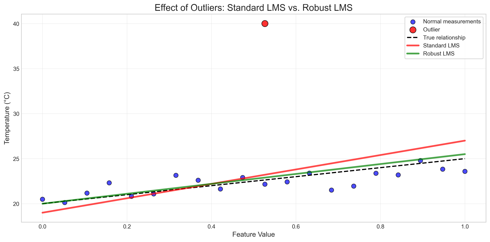
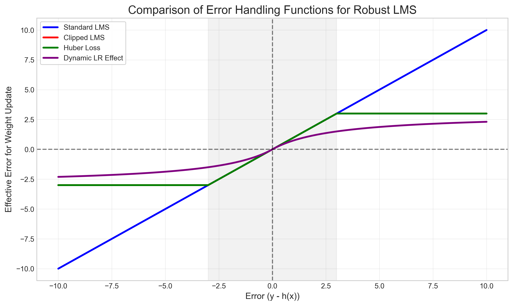

# Question 23: Least Mean Squares (LMS) for Online Learning

## Problem Statement
You are implementing an online learning system for a temperature prediction model using the Least Mean Squares (LMS) algorithm. The model receives sensor data in real-time and must continuously update its predictions.

In this problem:
- Your linear model has the form: $$h(\boldsymbol{x}; \boldsymbol{w}) = w_0 + w_1x_1 + w_2x_2 + w_3x_3$$
- $x_1$ is the time of day (normalized between 0 and 1)
- $x_2$ is the humidity (normalized between 0 and 1)
- $x_3$ is the previous hour's temperature (in Celsius)
- Your current weights are $\boldsymbol{w} = [10, 5, -3, 0.8]^T$
- The learning rate is $\alpha = 0.05$

### Task
1. Write down the LMS update rule for online learning in the context of this problem.
2. You receive a new data point: time = 0.75 (evening), humidity = 0.4, previous temperature = 22°C, and the actual temperature is 24°C. Calculate the prediction of your current model for this data point.
3. Using the LMS update rule, calculate the new weight vector $\boldsymbol{w}$ after processing this data point.
4. The next data point arrives: time = 0.8, humidity = 0.45, previous temperature = 24°C. Predict the temperature using your updated weights.
5. In online learning with the LMS algorithm, explain how you would handle a scenario where a sensor occasionally provides incorrect readings (outliers). Propose a specific modification to the standard LMS update rule to make it more robust to outliers.

## Understanding the Problem

Online learning is a machine learning paradigm where models are trained incrementally as data becomes available, rather than learning from a complete training dataset in one batch. This approach is particularly useful for real-time applications like sensor data processing.

The Least Mean Squares (LMS) algorithm is a simple yet effective online learning method that updates model parameters after processing each data point. It aims to minimize the mean squared error between predictions and actual values by adjusting weights in the direction that reduces the error.

In this specific problem, we have a temperature prediction model with three features: time of day, humidity, and previous temperature. We need to update the model's weights as new sensor readings arrive.

## Solution

### Step 1: The LMS Update Rule for Online Learning

The LMS update rule for online learning adjusts the weights after each data point based on the prediction error:

For each weight $w_j$:
$$w_j := w_j + \alpha(y - h(\mathbf{x}; \mathbf{w}))x_j$$

Where:
- $w_j$ is the weight for feature $j$
- $\alpha$ is the learning rate (0.05 in our case)
- $y$ is the actual temperature
- $h(\mathbf{x}; \mathbf{w})$ is the predicted temperature
- $x_j$ is the value of feature $j$ (note: $x_0 = 1$ for the intercept term)

In vector form, this can be written as:
$$\mathbf{w} := \mathbf{w} + \alpha(y - h(\mathbf{x}; \mathbf{w}))\mathbf{x}$$

For our specific problem with 3 features, the update rules are:

$$w_0 := w_0 + \alpha(y - (w_0 + w_1x_1 + w_2x_2 + w_3x_3)) \times 1$$
$$w_1 := w_1 + \alpha(y - (w_0 + w_1x_1 + w_2x_2 + w_3x_3)) \times x_1$$
$$w_2 := w_2 + \alpha(y - (w_0 + w_1x_1 + w_2x_2 + w_3x_3)) \times x_2$$
$$w_3 := w_3 + \alpha(y - (w_0 + w_1x_1 + w_2x_2 + w_3x_3)) \times x_3$$

### Step 2: First Data Point Prediction

We need to predict the temperature for the first data point using our current model.

Data point:
- Time ($x_1$) = 0.75 (evening)
- Humidity ($x_2$) = 0.4
- Previous temperature ($x_3$) = 22°C
- Actual temperature ($y$) = 24°C

Calculating the prediction:
$$h(\mathbf{x}; \mathbf{w}) = w_0 + w_1x_1 + w_2x_2 + w_3x_3$$
$$h(\mathbf{x}; \mathbf{w}) = 10 + 5 \times 0.75 + (-3) \times 0.4 + 0.8 \times 22$$
$$h(\mathbf{x}; \mathbf{w}) = 10 + 3.75 + (-1.20) + 17.60 = 30.15\text{°C}$$

The prediction error is:
$$\text{error} = y - h(\mathbf{x}; \mathbf{w}) = 24 - 30.15 = -6.15\text{°C}$$

Our model is overestimating the temperature by 6.15°C.



The visualization shows how each feature contributes to the final prediction. The intercept term ($w_0$) contributes 10°C, the time term ($w_1x_1$) adds 3.75°C, the humidity term ($w_2x_2$) reduces by 1.2°C, and the previous temperature term ($w_3x_3$) contributes a significant 17.6°C. The combined prediction of 30.15°C is higher than the actual temperature of 24°C.

### Step 3: Weight Update After Processing the First Data Point

Using the LMS update rule, we update the weights based on the prediction error:

$$\mathbf{w}_{\text{new}} = \mathbf{w}_{\text{old}} + \alpha \times (y - \text{prediction}) \times \mathbf{x}$$
$$\mathbf{w}_{\text{new}} = \mathbf{w}_{\text{old}} + 0.05 \times (-6.15) \times \mathbf{x}$$
$$\mathbf{w}_{\text{new}} = \mathbf{w}_{\text{old}} + (-0.3075) \times \mathbf{x}$$

For each weight:

1. Intercept term ($w_0$):
   $$w_0 = 10 + (-0.3075) \times 1 = 10 - 0.3075 = 9.6925$$

2. Time coefficient ($w_1$):
   $$w_1 = 5 + (-0.3075) \times 0.75 = 5 - 0.2306 = 4.7694$$

3. Humidity coefficient ($w_2$):
   $$w_2 = -3 + (-0.3075) \times 0.4 = -3 - 0.123 = -3.123$$

4. Previous temperature coefficient ($w_3$):
   $$w_3 = 0.8 + (-0.3075) \times 22 = 0.8 - 6.765 = -5.965$$

The updated weight vector is:
$$\mathbf{w}_{\text{new}} = [9.6925, 4.7694, -3.123, -5.965]^T$$



The visualization shows how each weight changes after processing the data point. The most significant change occurs in $w_3$ (previous temperature coefficient), which dramatically decreases from 0.8 to -5.965. This makes sense because our model was overestimating the temperature, and the previous temperature had the largest contribution to this overestimation.

### Step 4: Prediction for the Second Data Point

Now we predict the temperature for the second data point using our updated weights.

Second data point:
- Time ($x_1$) = 0.8 (later evening)
- Humidity ($x_2$) = 0.45
- Previous temperature ($x_3$) = 24°C

Calculating the prediction with updated weights:
$$h(\mathbf{x}; \mathbf{w}_{\text{new}}) = w_0 + w_1x_1 + w_2x_2 + w_3x_3$$
$$h(\mathbf{x}; \mathbf{w}_{\text{new}}) = 9.6925 + 4.7694 \times 0.8 + (-3.123) \times 0.45 + (-5.965) \times 24$$
$$h(\mathbf{x}; \mathbf{w}_{\text{new}}) = 9.6925 + 3.8155 + (-1.4054) + (-143.16) = -131.0574\text{°C}$$



The improved visualization shows the contribution of each component to the prediction separately. The large negative contribution from the previous temperature term (approximately -143°C) dominates the prediction, resulting in the physically impossible temperature of -131.06°C.

This result demonstrates a critical issue with online learning: it can be highly sensitive to individual data points, especially when using a fixed learning rate. The steep adjustment based on a single error led to an unrealistic model. In practice, this would indicate that we should use:
1. A smaller learning rate
2. More robust update methods that are less sensitive to outliers
3. Constraints on the model parameters to ensure predictions remain in a physically plausible range

### Step 5: Handling Outliers in Online Learning with LMS

In online learning with the LMS algorithm, outliers (incorrect sensor readings) can significantly impact the model because each update directly affects the weights. Since we process one data point at a time, a single outlier can lead to a major shift in model parameters, as we saw in our example.

To make the LMS algorithm more robust to outliers, we can modify the standard update rule:

**Standard LMS update:** 
$$\mathbf{w} := \mathbf{w} + \alpha(y - h(\mathbf{x}; \mathbf{w}))\mathbf{x}$$

**Robust LMS update:** 
$$\mathbf{w} := \mathbf{w} + \alpha \times g(y - h(\mathbf{x}; \mathbf{w})) \times \mathbf{x}$$

Where $g()$ is a function that dampens the effect of large errors that might be caused by outliers.

#### Specific Modifications:

1. **Clipped LMS**: Limit the error term to a maximum threshold value
   $$g(\text{error}) = \min(\max(-\text{threshold}, \text{error}), \text{threshold})$$
   
   Implementation:
   ```python
   threshold = 2.0  # Consider errors larger than 2°C as potential outliers
   error = actual_temp - prediction
   clipped_error = max(min(error, threshold), -threshold)
   w = w + alpha * clipped_error * x
   ```

2. **Huber Loss**: Use a quadratic function near zero and a linear function elsewhere
   $$g(\text{error}) = \begin{cases}
   \text{error} & \text{if } |\text{error}| \leq \delta \\
   \delta \times \text{sign}(\text{error}) & \text{if } |\text{error}| > \delta
   \end{cases}$$

3. **Dynamic Learning Rate**: Reduce the learning rate for large errors
   $$\alpha_{\text{dynamic}} = \frac{\alpha}{1 + |\text{error}|/\sigma}$$
   $$\mathbf{w} := \mathbf{w} + \alpha_{\text{dynamic}} \times \text{error} \times \mathbf{x}$$



The enhanced visualization above compares standard LMS with a robust version in the presence of an outlier. The standard LMS (red line) is significantly affected by the outlier, while the robust version (green line) remains closer to the true relationship (dashed black line).



This improved graph compares different error handling functions. The standard LMS uses the error directly (blue line), while the other methods - clipped LMS (red line), Huber loss (green line), and dynamic learning rate (purple line) - reduce the influence of large errors. The gray-shaded area shows the clipping region for the clipped LMS approach.

## Visual Explanations

### Prediction Breakdown


This visualization breaks down the contribution of each term to the temperature prediction for the first data point. The stacked bars show how each feature contributes to the overall prediction of 30.15°C, compared to the actual temperature of 24°C. The error of -6.15°C is clearly indicated.

### Weight Updates Visualization


This enhanced chart displays how each weight changes after processing the first data point. The blue bars represent the original weights, and the orange bars show the updated weights. Green arrows indicate the direction of significant updates. The dramatic change in $w_3$ (previous temperature coefficient) is particularly noteworthy.

### Component Contributions to Second Prediction


This redesigned visualization separates the contribution of each component in the second prediction. It clearly shows that the negative contribution from the previous temperature term ($w_3x_3$) overwhelms all other components, resulting in the extremely negative prediction of -131.06°C.

### Robust LMS Comparison


This visualization compares how standard LMS and robust LMS perform in the presence of an outlier. The standard LMS (red line) is heavily influenced by the outlier, while the robust version (green line) stays closer to the true relationship (dashed black line).

### Error Handling Functions


This chart shows different approaches to handling errors in the LMS algorithm:
- Standard LMS (blue): Uses the raw error directly
- Clipped LMS (red): Limits the error to a threshold (gray region)
- Huber Loss (green): Uses a quadratic function for small errors and a linear function for large errors
- Dynamic Learning Rate (purple): Reduces the effective learning rate for larger errors

## Key Insights

### Online Learning Dynamics
- Online learning updates the model after each data point, making it suitable for real-time applications
- The LMS algorithm adjusts weights in proportion to the error and the feature values
- Large errors can cause significant weight changes in a single update
- The learning rate controls the size of weight updates and is crucial for stability

### Sensitivity and Stability
- Basic LMS is highly sensitive to outliers and can lead to unstable models
- A single outlier can drastically shift the model parameters
- The model we developed produced an extreme prediction (-131°C) after just one update
- Careful tuning of the learning rate is essential for stable learning

### Robustness Techniques
- Clipping errors prevents extreme weight updates
- Huber loss provides a compromise between squared error (MSE) and absolute error (MAE)
- Dynamic learning rates automatically reduce the update magnitude for large errors
- These robust methods can significantly improve model stability in the presence of outliers

### Feature Impact
- Different features contribute differently to predictions
- In our model, the previous temperature had the largest impact
- The weight for previous temperature ($w_3$) also experienced the most significant update
- Understanding feature contributions helps identify which parts of the model are most sensitive

## Conclusion
- The LMS algorithm provides a simple online learning approach for updating model weights incrementally as new data arrives
- The standard LMS update rule is: $\mathbf{w} := \mathbf{w} + \alpha(y - h(\mathbf{x}; \mathbf{w}))\mathbf{x}$
- For the first data point, our model predicted 30.15°C (actual was 24°C), resulting in updated weights of $[9.6925, 4.7694, -3.123, -5.965]^T$
- The updated model predicted -131.06°C for the second data point, demonstrating a stability issue
- To handle outliers effectively, the standard LMS can be modified by clipping errors, using Huber loss, or implementing dynamic learning rates
- These robust modifications maintain the adaptability of online learning while providing protection against erroneous data

This example illustrates both the power and challenges of online learning: while it allows real-time model adaptation, care must be taken to ensure stability and robustness, especially in sensor-based applications where noise and outliers are common. 