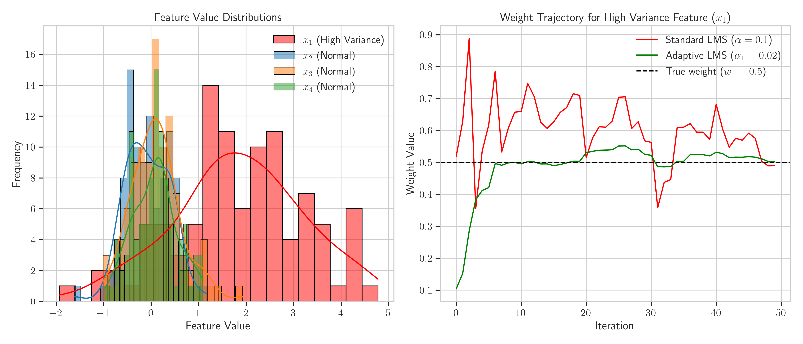

# Question 24: LMS Algorithm for Financial Prediction System

## Problem Statement
You're developing a real-time financial prediction system that uses the Least Mean Squares (LMS) algorithm to update a linear regression model as new market data arrives every minute.

In this problem:
- Your feature vector includes 5 market indicators: $\boldsymbol{x} = [1, x_1, x_2, x_3, x_4]^T$ (where 1 is for the bias term)
- Your target variable $y$ is the price change of a particular stock
- The LMS update rule is: $$\boldsymbol{w}^{t+1} = \boldsymbol{w}^t + \alpha(y^{(i)} - \boldsymbol{w}^T\boldsymbol{x}^{(i)})\boldsymbol{x}^{(i)}$$

### Task
1. Suppose you observe that your model's predictions tend to lag behind rapid market movements. Would you increase or decrease the learning rate $\alpha$, and why? Explain the tradeoff involved.
2. If your current weight vector is $\boldsymbol{w} = [0.1, 0.5, -0.3, 0.2, 0.4]^T$ and you receive a new data point $\boldsymbol{x} = [1, 0.8, 0.6, 0.4, 0.7]^T$ with actual price change $y = 0.15$, calculate:
   a) Your model's prediction for this data point
   b) The prediction error
   c) The updated weight vector using learning rate $\alpha = 0.1$
3. In practice, financial data often contains noise and outliers. Derive a modified version of the LMS update rule that uses a "gradient clipping" approach, where gradients larger than a threshold value $\tau$ are scaled down. Write the mathematical formula for this modified update rule.
4. Through experimentation, you find that indicator $x_1$ has high variance and causes your weights to oscillate. Propose a per-feature learning rate approach for the LMS algorithm and write out the modified update equation.
5. Draw a diagram illustrating how the standard LMS algorithm update would behave differently from your modified approaches from tasks 3 and 4 when encountering an outlier data point.

## Understanding the Problem

This problem focuses on the Least Mean Squares (LMS) algorithm, which is an online learning algorithm for updating linear regression models incrementally as new data arrives. In a financial context, this is particularly valuable because markets are dynamic and models need to adapt quickly to changing conditions.

The LMS algorithm performs gradient descent updates one sample at a time, making it suitable for real-time applications. The key parameter in LMS is the learning rate $\alpha$, which controls how quickly the model adapts to new information.

The tasks involve understanding how the learning rate affects model behavior, calculating updates based on new data, and modifying the LMS algorithm to handle challenges like noise, outliers, and high-variance features.

## Solution

### Task 1: Learning Rate Impact on Rapid Market Movements

When model predictions lag behind rapid market movements, we need to **increase** the learning rate $\alpha$.

A higher learning rate allows the model to adapt more quickly to new data and changing market conditions. The current lagging behavior suggests the model is updating too slowly to capture rapid changes in the market.

The trade-offs involved are:
- **Advantage**: Faster adaptation to new market conditions and trends
- **Risk**: Higher sensitivity to noise and potential instability
- **Risk**: May lead to overshooting the optimal weights

The graph illustrates how different learning rates affect the model's ability to adapt to a sudden market shift. With a low learning rate ($\alpha = 0.1$), the model takes longer to adapt to the change. With a higher learning rate ($\alpha = 0.7$), the model responds much more quickly but may exhibit more oscillation. A medium learning rate ($\alpha = 0.3$) offers a balance between responsiveness and stability.

### Task 2: Calculating Prediction and Weight Updates

Given:
- Current weight vector: $\boldsymbol{w} = [0.1, 0.5, -0.3, 0.2, 0.4]^T$
- New data point: $\boldsymbol{x} = [1, 0.8, 0.6, 0.4, 0.7]^T$
- Actual price change: $y = 0.15$
- Learning rate: $\alpha = 0.1$

#### Step 2a: Calculate the model's prediction
The prediction is computed as the dot product of the weight vector and the feature vector:

$$\hat{y} = \boldsymbol{w}^T \boldsymbol{x}$$

Expanding this calculation term by term:
$$
\begin{align*}
\hat{y} &= w_0 \cdot x_0 + w_1 \cdot x_1 + w_2 \cdot x_2 + w_3 \cdot x_3 + w_4 \cdot x_4 \\
&= 0.1 \times 1.0 + 0.5 \times 0.8 + (-0.3) \times 0.6 + 0.2 \times 0.4 + 0.4 \times 0.7 \\
&= 0.1 + 0.4 + (-0.18) + 0.08 + 0.28 \\
&= 0.68
\end{align*}
$$

#### Step 2b: Calculate the prediction error
The error is the difference between the actual value and the predicted value:

$$
\begin{align*}
\text{error} &= y - \hat{y} \\
&= 0.15 - 0.68 \\
&= -0.53
\end{align*}
$$

#### Step 2c: Calculate the updated weight vector
1. Calculate the gradient:

$$
\begin{align*}
\text{gradient} &= \text{error} \times \boldsymbol{x} \\
&= -0.53 \times [1, 0.8, 0.6, 0.4, 0.7]^T
\end{align*}
$$

Computing each component:
$$
\begin{align*}
\text{gradient}_0 &= -0.53 \times 1.0 = -0.53 \\
\text{gradient}_1 &= -0.53 \times 0.8 = -0.424 \\
\text{gradient}_2 &= -0.53 \times 0.6 = -0.318 \\
\text{gradient}_3 &= -0.53 \times 0.4 = -0.212 \\
\text{gradient}_4 &= -0.53 \times 0.7 = -0.371
\end{align*}
$$

Thus, $\text{gradient} = [-0.53, -0.424, -0.318, -0.212, -0.371]^T$

2. Calculate weight updates using the learning rate:

$$
\begin{align*}
\Delta \boldsymbol{w} &= \alpha \times \text{gradient} \\
&= 0.1 \times [-0.53, -0.424, -0.318, -0.212, -0.371]^T
\end{align*}
$$

Computing each component:
$$
\begin{align*}
\Delta w_0 &= 0.1 \times (-0.53) = -0.053 \\
\Delta w_1 &= 0.1 \times (-0.424) = -0.0424 \\
\Delta w_2 &= 0.1 \times (-0.318) = -0.0318 \\
\Delta w_3 &= 0.1 \times (-0.212) = -0.0212 \\
\Delta w_4 &= 0.1 \times (-0.371) = -0.0371
\end{align*}
$$

Thus, $\Delta \boldsymbol{w} = [-0.053, -0.0424, -0.0318, -0.0212, -0.0371]^T$

3. Update weights:

$$
\begin{align*}
\boldsymbol{w}^{t+1} &= \boldsymbol{w}^t + \Delta \boldsymbol{w} \\
&= [0.1, 0.5, -0.3, 0.2, 0.4]^T + [-0.053, -0.0424, -0.0318, -0.0212, -0.0371]^T
\end{align*}
$$

Computing each component:
$$
\begin{align*}
w_0^{t+1} &= 0.1 + (-0.053) = 0.047 \\
w_1^{t+1} &= 0.5 + (-0.0424) = 0.4576 \\
w_2^{t+1} &= -0.3 + (-0.0318) = -0.3318 \\
w_3^{t+1} &= 0.2 + (-0.0212) = 0.1788 \\
w_4^{t+1} &= 0.4 + (-0.0371) = 0.3629
\end{align*}
$$

Thus, $\boldsymbol{w}^{t+1} = [0.047, 0.4576, -0.3318, 0.1788, 0.3629]^T$

The visualization shows the feature values, the comparison between current and updated weights, and the prediction error. The model predicted a larger price change (0.68) than actually occurred (0.15), resulting in a negative error that caused all weights to decrease.

### Task 3: Gradient Clipping for Noise and Outliers

The standard LMS update rule is:
$$\boldsymbol{w}^{t+1} = \boldsymbol{w}^t + \alpha(y^{(i)} - \boldsymbol{w}^T\boldsymbol{x}^{(i)})\boldsymbol{x}^{(i)}$$

To derive the modified LMS update rule with gradient clipping:

1. The gradient in the LMS algorithm is: 
   $$\boldsymbol{g} = (y^{(i)} - \boldsymbol{w}^T\boldsymbol{x}^{(i)})\boldsymbol{x}^{(i)} = \text{error} \times \boldsymbol{x}^{(i)}$$

2. With gradient clipping, we cap the gradient if its magnitude exceeds a threshold $\tau$:
   $$
   \boldsymbol{g}_{\text{clipped}} = 
   \begin{cases} 
   \boldsymbol{g} & \text{if } \|\boldsymbol{g}\| \leq \tau \\
   \tau \frac{\boldsymbol{g}}{\|\boldsymbol{g}\|} & \text{if } \|\boldsymbol{g}\| > \tau
   \end{cases}
   $$

3. The modified LMS update rule with gradient clipping is:
   $$\boldsymbol{w}^{t+1} = \boldsymbol{w}^t + \alpha \boldsymbol{g}_{\text{clipped}}$$

When expanded:
- If $\|(y^{(i)} - \boldsymbol{w}^T\boldsymbol{x}^{(i)})\boldsymbol{x}^{(i)}\| \leq \tau$:
  $$\boldsymbol{w}^{t+1} = \boldsymbol{w}^t + \alpha(y^{(i)} - \boldsymbol{w}^T\boldsymbol{x}^{(i)})\boldsymbol{x}^{(i)}$$

- If $\|(y^{(i)} - \boldsymbol{w}^T\boldsymbol{x}^{(i)})\boldsymbol{x}^{(i)}\| > \tau$:
  $$\boldsymbol{w}^{t+1} = \boldsymbol{w}^t + \alpha \tau \frac{(y^{(i)} - \boldsymbol{w}^T\boldsymbol{x}^{(i)})\boldsymbol{x}^{(i)}}{\|(y^{(i)} - \boldsymbol{w}^T\boldsymbol{x}^{(i)})\boldsymbol{x}^{(i)}\|}$$

The gradient clipping approach preserves the direction of the gradient but limits its magnitude, effectively reducing the influence of outliers while maintaining the direction of the update.

The graph shows how gradient clipping limits the effect of outliers. For normal error ranges (within the threshold $\tau$), the updates behave the same as standard LMS. However, when encountering outliers with large errors (the yellow regions), the gradient clipping approach caps the update magnitude, preventing extreme weight changes.

### Task 4: Per-Feature Learning Rate Approach

When a specific feature like $x_1$ has high variance and causes weight oscillations, we can use different learning rates for different features.

The standard LMS update rule (element-wise) is:
$$w_j^{t+1} = w_j^t + \alpha(y^{(i)} - \boldsymbol{w}^T\boldsymbol{x}^{(i)})x_j^{(i)}$$

The modified LMS update rule with per-feature learning rates is:
$$w_j^{t+1} = w_j^t + \alpha_j(y^{(i)} - \boldsymbol{w}^T\boldsymbol{x}^{(i)})x_j^{(i)}$$

In vector form:
$$\boldsymbol{w}^{t+1} = \boldsymbol{w}^t + (\boldsymbol{\alpha} \odot (y^{(i)} - \boldsymbol{w}^T\boldsymbol{x}^{(i)})\boldsymbol{x}^{(i)})$$

where $\odot$ represents element-wise multiplication (Hadamard product).

For our problem with high variance in $x_1$, we would set:
$$\boldsymbol{\alpha} = [\alpha_0, \alpha_1, \alpha_2, \alpha_3, \alpha_4]$$

where $\alpha_1 < \alpha_0, \alpha_2, \alpha_3, \alpha_4$ to reduce oscillations in $w_1$.

For example, we might use:
$$\boldsymbol{\alpha} = [0.1, 0.02, 0.1, 0.1, 0.1]$$

This assigns a smaller learning rate (0.02) to the high-variance feature $x_1$ while maintaining the standard learning rate (0.1) for all other features.

The left panel shows the difference in distribution between the high-variance feature $x_1$ and other normal features. The right panel demonstrates how using a lower learning rate specifically for the high-variance feature (green line) leads to a more stable convergence compared to using the same learning rate for all features (red line), which exhibits more oscillation.

### Task 5: Comparison of LMS Approaches with Outliers

The diagram illustrates how the three approaches behave when encountering an outlier:

1. **Standard LMS (top left)**: The outlier causes a large update to the weights, significantly changing the model's behavior. This can destabilize a previously well-performing model.

   Mathematically, when encountering an outlier with a large error, the update magnitude becomes:
   $$\Delta \boldsymbol{w} = \alpha \times \text{(large error)} \times \boldsymbol{x}$$
   
   With no constraints, this can lead to dramatic changes in the model.

2. **Gradient Clipping (top right)**: By capping the magnitude of the gradient, this approach makes a much smaller weight update when encountering the outlier, maintaining more stability.

   The update magnitude is limited to:
   $$\Delta \boldsymbol{w} = \alpha \times \min(\|\text{gradient}\|, \tau) \times \frac{\text{gradient}}{\|\text{gradient}\|}$$
   
   This preserves the direction but limits the step size.

3. **Per-Feature Learning Rate (bottom left)**: By using a lower learning rate for features with high values, this approach reduces the impact of the outlier, resulting in a more moderate update.

   For high-variance features or features with large values in the outlier point:
   $$\Delta w_j = \alpha_j \times \text{error} \times x_j$$
   
   Where $\alpha_j$ is smaller for potentially problematic features.

4. **Weight Trajectory Comparison (bottom right)**: This shows how all three approaches behave over time with an outlier at iteration 25. The standard LMS shows a dramatic change, while both modified approaches demonstrate more resilience to the outlier.

   - Standard LMS: Large deviation after outlier, slow recovery
   - Gradient Clipping: Moderate deviation, quicker recovery
   - Per-Feature Learning Rate: Smallest deviation, most stable trajectory

## Key Insights

### Learning Rate Selection
- Higher learning rates lead to faster adaptation but increased sensitivity to noise
- Lower learning rates provide stability but slower adaptation to changes
- The optimal learning rate balances responsiveness and stability based on market dynamics
- For rapidly changing markets, higher learning rates are generally preferred

### Handling Outliers and Noise
- Financial data contains numerous outliers due to market events, errors, or anomalies
- Standard LMS is highly sensitive to outliers as they can cause large gradient updates
- Gradient clipping effectively limits the influence of outliers while preserving normal updates
- The threshold parameter $\tau$ provides a tunable way to control outlier influence

### Feature-Specific Adaptations
- Different features in financial data have varying characteristics (volatility, scale, etc.)
- High-variance features like $x_1$ can cause weight oscillations when using a uniform learning rate
- Per-feature learning rates allow for tailored adaptation based on feature characteristics
- Lower learning rates for high-variance features reduce oscillations without sacrificing adaptivity

### Algorithm Modifications and Tradeoffs
- Both gradient clipping and per-feature learning rates improve model stability
- These modifications add complexity and hyperparameters that need tuning
- The combination of both approaches might yield the best results for financial data
- Model monitoring is crucial to adjust these parameters as market conditions change

## Conclusion

- For models lagging behind rapid market movements, **increasing the learning rate** improves responsiveness at the cost of potential instability
- A single update step with the given data results in a prediction of **0.68**, an error of **-0.53**, and updated weights of **[0.047, 0.4576, -0.3318, 0.1788, 0.3629]**
- Gradient clipping provides robustness against outliers by scaling down large gradients according to threshold $\tau$
- Per-feature learning rates tackle the oscillation problem caused by high-variance features
- Both modified approaches significantly improve the stability of the LMS algorithm when dealing with financial data characteristics
- The visualizations clearly show that standard LMS is most vulnerable to outliers, while gradient clipping and per-feature learning rates maintain better stability

These modifications to the LMS algorithm are crucial for financial applications where data quality varies and market conditions change rapidly. By implementing these improvements, the real-time financial prediction system can become more robust while maintaining adaptivity to genuine market trends. 