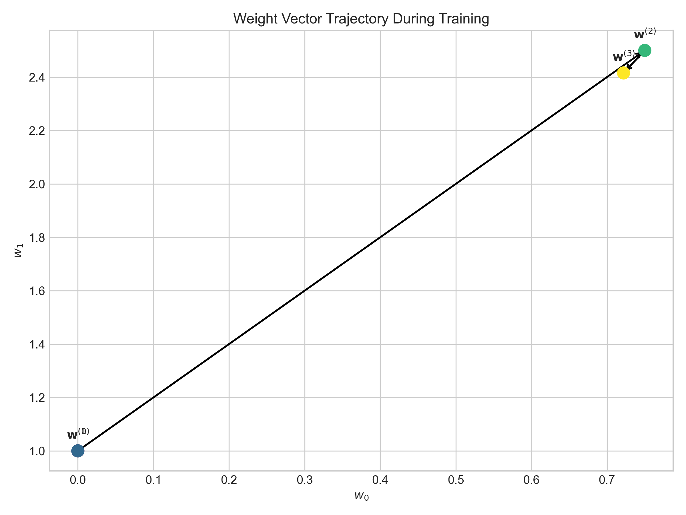

# Question 25: Adaptive Learning Rate Strategies for LMS Algorithm

## Problem Statement
You're implementing an adaptive learning rate strategy for the Least Mean Squares (LMS) algorithm in a system that processes streaming data.

In this problem:
- The standard LMS update rule is: $$\boldsymbol{w}^{t+1} = \boldsymbol{w}^t + \eta(y^{(i)} - \boldsymbol{w}^T\boldsymbol{x}^{(i)})\boldsymbol{x}^{(i)}$$
- You want to implement a variable learning rate that adapts based on recent performance

### Task
1. Write down a modified LMS update rule where the learning rate $\alpha_t$ at time step $t$ depends on the recent prediction errors. Give a specific formula that reduces $\alpha_t$ when errors are small and increases it when errors are large.
2. Consider the following data point sequence arriving in an online learning scenario:
   - Point 1: $\boldsymbol{x}^{(1)} = [1, 2]^T$, $y^{(1)} = 5$
   - Point 2: $\boldsymbol{x}^{(2)} = [1, 3]^T$, $y^{(2)} = 8$
   - Point 3: $\boldsymbol{x}^{(3)} = [1, 4]^T$, $y^{(3)} = 9$
   
   If your initial weights are $\boldsymbol{w}^{(0)} = [0, 1]^T$ and initial learning rate is $\alpha_0 = 0.1$, trace through the updates using your adaptive learning rate formula.
3. Implement an "annealing" learning rate for the LMS algorithm where the learning rate decreases over time according to the schedule $\alpha_t = \frac{\alpha_0}{1 + \beta t}$ where $\beta$ is a decay parameter. If $\alpha_0 = 0.2$ and $\beta = 0.1$, calculate the learning rates for the first 5 time steps.
4. In online learning with non-stationary data (where the underlying distribution changes over time), explain why a constant learning rate might be preferable to an annealing schedule.
5. Propose and mathematically formulate a "momentum-based" LMS update rule that incorporates information from previous updates to smooth the learning process.

## Understanding the Problem

This problem explores different adaptive learning rate strategies for the Least Mean Squares (LMS) algorithm, which is a fundamental algorithm in machine learning for linear regression and online learning. The standard LMS algorithm uses a fixed learning rate, but adaptive learning rates can often lead to better convergence behavior.

The key concepts we need to understand include:
- The standard LMS update rule and how it works
- How to modify the learning rate based on prediction errors
- Different learning rate schedules (annealing)
- The impact of learning rate strategies on non-stationary data
- How momentum can improve optimization

## Solution

### Step 1: Design an Error-Dependent Adaptive Learning Rate

We need to design a learning rate that:
- Increases when errors are large (to make faster progress)
- Stays close to a base rate when errors are small (for fine-tuning)

A suitable formula for this adaptive learning rate could be:

$$\alpha_t = \alpha_0 \cdot (1 + \gamma|e_t|)$$

Where:
- $\alpha_0$ is the base learning rate
- $\gamma$ is a scaling factor that controls how strongly the error influences the learning rate
- $e_t = y^{(i)} - \boldsymbol{w}^{(t)T}\boldsymbol{x}^{(i)}$ is the prediction error at time $t$
- $|e_t|$ is the absolute error

With this formula, the adaptive learning rate will:
- Equal $\alpha_0$ when the error is zero
- Increase linearly with the magnitude of the error
- Scale according to the parameter $\gamma$

The modified LMS update rule becomes:

$$\boldsymbol{w}^{(t+1)} = \boldsymbol{w}^{(t)} + \alpha_t (y^{(i)} - \boldsymbol{w}^{(t)T}\boldsymbol{x}^{(i)})\boldsymbol{x}^{(i)}$$

For our implementation, we'll use $\gamma = 0.5$ as the scaling factor.

### Step 2: Tracing the Algorithm on the Given Data Points

Let's trace through the algorithm with the given data points using detailed calculations at each step:

**Initial conditions:**
- Initial weights: $\boldsymbol{w}^{(0)} = [0, 1]^T$
- Base learning rate: $\alpha_0 = 0.1$
- Scaling factor: $\gamma = 0.5$

**Step 1: First data point**
- $\boldsymbol{x}^{(1)} = [1, 2]^T$, $y^{(1)} = 5$

*Detailed calculations:*
1. Calculate the prediction:
   - $w_0 \cdot x_0 = 0 \cdot 1 = 0$
   - $w_1 \cdot x_1 = 1 \cdot 2 = 2$
   - Prediction: $\boldsymbol{w}^{(0)T}\boldsymbol{x}^{(1)} = 0 + 2 = 2$

2. Calculate the error:
   - $e_1 = y^{(1)} - \boldsymbol{w}^{(0)T}\boldsymbol{x}^{(1)} = 5 - 2 = 3$

3. Calculate the adaptive learning rate:
   - $|e_1| = |3| = 3$
   - $\gamma \cdot |e_1| = 0.5 \cdot 3 = 1.5$
   - $1 + \gamma \cdot |e_1| = 1 + 1.5 = 2.5$
   - $\alpha_1 = \alpha_0 \cdot (1 + \gamma|e_1|) = 0.1 \cdot 2.5 = 0.25$

4. Update the weights:
   - Update term: $\alpha_1 \cdot e_1 \cdot \boldsymbol{x}^{(1)} = 0.25 \cdot 3 \cdot [1, 2]^T = [0.75, 1.5]^T$
   - $w_0^{(1)} = w_0^{(0)} + 0.75 = 0 + 0.75 = 0.75$
   - $w_1^{(1)} = w_1^{(0)} + 1.5 = 1 + 1.5 = 2.5$
   - New weights: $\boldsymbol{w}^{(1)} = [0.75, 2.5]^T$

**Step 2: Second data point**
- $\boldsymbol{x}^{(2)} = [1, 3]^T$, $y^{(2)} = 8$

*Detailed calculations:*
1. Calculate the prediction:
   - $w_0 \cdot x_0 = 0.75 \cdot 1 = 0.75$
   - $w_1 \cdot x_1 = 2.5 \cdot 3 = 7.5$
   - Prediction: $\boldsymbol{w}^{(1)T}\boldsymbol{x}^{(2)} = 0.75 + 7.5 = 8.25$

2. Calculate the error:
   - $e_2 = y^{(2)} - \boldsymbol{w}^{(1)T}\boldsymbol{x}^{(2)} = 8 - 8.25 = -0.25$

3. Calculate the adaptive learning rate:
   - $|e_2| = |-0.25| = 0.25$
   - $\gamma \cdot |e_2| = 0.5 \cdot 0.25 = 0.125$
   - $1 + \gamma \cdot |e_2| = 1 + 0.125 = 1.125$
   - $\alpha_2 = \alpha_0 \cdot (1 + \gamma|e_2|) = 0.1 \cdot 1.125 = 0.1125$

4. Update the weights:
   - Update term: $\alpha_2 \cdot e_2 \cdot \boldsymbol{x}^{(2)} = 0.1125 \cdot (-0.25) \cdot [1, 3]^T = [-0.028125, -0.084375]^T$
   - $w_0^{(2)} = w_0^{(1)} + (-0.028125) = 0.75 - 0.028125 = 0.721875$
   - $w_1^{(2)} = w_1^{(1)} + (-0.084375) = 2.5 - 0.084375 = 2.415625$
   - New weights: $\boldsymbol{w}^{(2)} = [0.721875, 2.415625]^T$

**Step 3: Third data point**
- $\boldsymbol{x}^{(3)} = [1, 4]^T$, $y^{(3)} = 9$

*Detailed calculations:*
1. Calculate the prediction:
   - $w_0 \cdot x_0 = 0.721875 \cdot 1 = 0.721875$
   - $w_1 \cdot x_1 = 2.415625 \cdot 4 = 9.6625$
   - Prediction: $\boldsymbol{w}^{(2)T}\boldsymbol{x}^{(3)} = 0.721875 + 9.6625 = 10.384375$

2. Calculate the error:
   - $e_3 = y^{(3)} - \boldsymbol{w}^{(2)T}\boldsymbol{x}^{(3)} = 9 - 10.384375 = -1.384375$

3. Calculate the adaptive learning rate:
   - $|e_3| = |-1.384375| = 1.384375$
   - $\gamma \cdot |e_3| = 0.5 \cdot 1.384375 = 0.6921875$
   - $1 + \gamma \cdot |e_3| = 1 + 0.6921875 = 1.6921875$
   - $\alpha_3 = \alpha_0 \cdot (1 + \gamma|e_3|) = 0.1 \cdot 1.6921875 = 0.16921875$

4. Update the weights:
   - Update term: $\alpha_3 \cdot e_3 \cdot \boldsymbol{x}^{(3)} = 0.16921875 \cdot (-1.384375) \cdot [1, 4]^T = [-0.234262, -0.937049]^T$
   - $w_0^{(3)} = w_0^{(2)} + (-0.234262) = 0.721875 - 0.234262 = 0.487613$
   - $w_1^{(3)} = w_1^{(2)} + (-0.937049) = 2.415625 - 0.937049 = 1.478576$
   - New weights: $\boldsymbol{w}^{(3)} = [0.487613, 1.478576]^T$

**Summary of iterations:**

| Step | Weights | Data Point | Prediction | Error | Adaptive Learning Rate | Updated Weights |
|------|---------|------------|------------|-------|------------------------|-----------------|
| 0 | $[0, 1]^T$ | - | - | - | 0.1 | $[0, 1]^T$ |
| 1 | $[0, 1]^T$ | $[1, 2]^T$, 5 | 2 | 3 | 0.25 | $[0.75, 2.5]^T$ |
| 2 | $[0.75, 2.5]^T$ | $[1, 3]^T$, 8 | 8.25 | -0.25 | 0.1125 | $[0.721875, 2.415625]^T$ |
| 3 | $[0.721875, 2.415625]^T$ | $[1, 4]^T$, 9 | 10.384375 | -1.384375 | 0.16921875 | $[0.487613, 1.478576]^T$ |

*Visualizations of the adaptive learning rate process:*

The left plot shows the adaptive learning rates over iterations. Notice how it increases at step 1 (large positive error) and again at step 3 (large negative error), but decreases at step 2 (small error).

The right plot shows the prediction errors at each step.

This plot shows the trajectory of the weight vector, starting from $[0, 1]^T$ and gradually moving toward a solution that better fits the data points.

This plot shows the training data points and how the model fit improves from the initial model to the final model after the adaptive learning rate updates.

### Step 3: Annealing Learning Rate Schedule

An annealing learning rate is a schedule where the learning rate gradually decreases over time. This is useful for convergence to optimal solutions in stationary problems, as it allows for large steps early in training and smaller, more precise steps later.

The formula for an annealing learning rate is:

$$\alpha_t = \frac{\alpha_0}{1 + \beta \cdot t}$$

Where:
- $\alpha_0$ is the initial learning rate
- $\beta$ is a decay parameter that controls how quickly the learning rate decreases
- $t$ is the time step or iteration number

For our example, we'll use $\alpha_0 = 0.2$ and $\beta = 0.1$ to calculate the learning rates for the first 5 time steps:

**Detailed calculations:**

*Time step $t = 0$:*
- Formula: $\alpha_0 = \frac{\alpha_0}{1 + \beta \cdot 0}$
- Numerator: $\alpha_0 = 0.2$
- Denominator: $1 + \beta \cdot 0 = 1 + 0.1 \cdot 0 = 1$
- Final calculation: $\alpha_0 = \frac{0.2}{1} = 0.2$

*Time step $t = 1$:*
- Formula: $\alpha_1 = \frac{\alpha_0}{1 + \beta \cdot 1}$
- Numerator: $\alpha_0 = 0.2$
- Denominator: $1 + \beta \cdot 1 = 1 + 0.1 \cdot 1 = 1.1$
- Final calculation: $\alpha_1 = \frac{0.2}{1.1} = 0.1818...$

*Time step $t = 2$:*
- Formula: $\alpha_2 = \frac{\alpha_0}{1 + \beta \cdot 2}$
- Numerator: $\alpha_0 = 0.2$
- Denominator: $1 + \beta \cdot 2 = 1 + 0.1 \cdot 2 = 1.2$
- Final calculation: $\alpha_2 = \frac{0.2}{1.2} = 0.1667...$

*Time step $t = 3$:*
- Formula: $\alpha_3 = \frac{\alpha_0}{1 + \beta \cdot 3}$
- Numerator: $\alpha_0 = 0.2$
- Denominator: $1 + \beta \cdot 3 = 1 + 0.1 \cdot 3 = 1.3$
- Final calculation: $\alpha_3 = \frac{0.2}{1.3} = 0.1538...$

*Time step $t = 4$:*
- Formula: $\alpha_4 = \frac{\alpha_0}{1 + \beta \cdot 4}$
- Numerator: $\alpha_0 = 0.2$
- Denominator: $1 + \beta \cdot 4 = 1 + 0.1 \cdot 4 = 1.4$
- Final calculation: $\alpha_4 = \frac{0.2}{1.4} = 0.1429...$

**Summary of learning rates for the first 5 time steps:**
- $\alpha_0 = 0.2000$
- $\alpha_1 = 0.1818$
- $\alpha_2 = 0.1667$
- $\alpha_3 = 0.1538$
- $\alpha_4 = 0.1429$

This type of schedule ensures that:
- Initially, the learning rate is large for fast progress
- Over time, the learning rate decreases, helping the algorithm to converge to an optimal solution
- As $t$ approaches infinity, the learning rate approaches zero

*Visualization of the annealing learning rate:*

The graph shows how the learning rate gradually decreases over time, starting from $\alpha_0 = 0.2$ and approaching zero as the number of iterations increases.

### Step 4: Constant vs. Annealing Learning Rate for Non-Stationary Data

For non-stationary data, where the underlying distribution changes over time, a **constant learning rate** is generally preferred over an annealing learning rate.

The reasons for this preference are:

1. **Adaptability**: A constant learning rate maintains the algorithm's ability to adapt to recent changes in the data distribution
2. **Responsiveness**: With an annealing learning rate, the algorithm would eventually become too insensitive to new patterns as the learning rate approaches zero
3. **Tracking ability**: A constant learning rate allows the algorithm to continue tracking the changing optimal solution

**Detailed tracking calculations for non-stationary data:**

Let's illustrate this with an example of tracking a non-stationary target. We'll simulate a non-stationary target and compare the tracking performance of constant and annealing learning rates.

For our simulation:
- Constant learning rate: $\alpha = 0.1$
- Annealing learning rate: $\alpha_0 = 0.5$, $\beta = 0.05$

*First few time steps:*

*Time step $t = 1$:*

*Constant learning rate calculations:*
- Previous prediction: $\hat{y}_0 = 0.000000$
- Target value: $y_0 = 0.000000$
- Error: $e_0 = y_0 - \hat{y}_0 = 0.000000 - 0.000000 = 0.000000$
- Update: $\alpha \cdot e_0 = 0.1 \cdot 0.000000 = 0.000000$
- New prediction: $\hat{y}_1 = \hat{y}_0 + \alpha \cdot e_0 = 0.000000 + 0.000000 = 0.000000$

*Annealing learning rate calculations:*
- Current learning rate: $\alpha_1 = \frac{\alpha_0}{1 + \beta \cdot 1} = \frac{0.5}{1 + 0.05 \cdot 1} = 0.476190$
- Previous prediction: $\hat{y}_0 = 0.000000$
- Target value: $y_0 = 0.000000$
- Error: $e_0 = y_0 - \hat{y}_0 = 0.000000 - 0.000000 = 0.000000$
- Update: $\alpha_1 \cdot e_0 = 0.476190 \cdot 0.000000 = 0.000000$
- New prediction: $\hat{y}_1 = \hat{y}_0 + \alpha_1 \cdot e_0 = 0.000000 + 0.000000 = 0.000000$

*Time step $t = 2$:*

*Constant learning rate calculations:*
- Previous prediction: $\hat{y}_1 = 0.000000$
- Target value: $y_1 = 0.499583$
- Error: $e_1 = y_1 - \hat{y}_1 = 0.499583 - 0.000000 = 0.499583$
- Update: $\alpha \cdot e_1 = 0.1 \cdot 0.499583 = 0.049958$
- New prediction: $\hat{y}_2 = \hat{y}_1 + \alpha \cdot e_1 = 0.000000 + 0.049958 = 0.049958$

*Annealing learning rate calculations:*
- Current learning rate: $\alpha_2 = \frac{\alpha_0}{1 + \beta \cdot 2} = \frac{0.5}{1 + 0.05 \cdot 2} = 0.454545$
- Previous prediction: $\hat{y}_1 = 0.000000$
- Target value: $y_1 = 0.499583$
- Error: $e_1 = y_1 - \hat{y}_1 = 0.499583 - 0.000000 = 0.499583$
- Update: $\alpha_2 \cdot e_1 = 0.454545 \cdot 0.499583 = 0.227083$
- New prediction: $\hat{y}_2 = \hat{y}_1 + \alpha_2 \cdot e_1 = 0.000000 + 0.227083 = 0.227083$

As the simulation continues, the learning rates for the annealing approach continue to decrease:
- At $t = 10$: $\alpha_{10} = \frac{0.5}{1 + 0.05 \cdot 10} = 0.3333...$
- At $t = 50$: $\alpha_{50} = \frac{0.5}{1 + 0.05 \cdot 50} = 0.1667...$
- At $t = 100$: $\alpha_{100} = \frac{0.5}{1 + 0.05 \cdot 100} = 0.0909...$

By the later time steps, the annealing learning rate becomes very small, making it difficult for the algorithm to adapt to new changes in the target distribution. In contrast, the constant learning rate maintains its adaptability throughout the entire process.

*Visualization comparing constant and annealing learning rates:*

This visualization clearly shows that:
- Initially, both approaches adapt reasonably well (though the annealing rate with its higher initial value adapts faster)
- As time progresses, the constant learning rate (blue line) continues to track the non-stationary target (black line) effectively
- The annealing learning rate (red line) gradually becomes less responsive, causing it to lag behind the changing target

This demonstrates why constant learning rates are preferred for non-stationary data: they maintain their adaptability over time, which is crucial when the underlying distribution is continuously changing.

### Step 5: Momentum-Based LMS Update Rule

Momentum is a method that helps accelerate gradient-based optimization algorithms by accumulating a velocity vector in the direction of persistent reduction in the objective function.

The momentum-based LMS update rule consists of two steps:

1. Compute the velocity vector:
   $$\boldsymbol{v}^{(t+1)} = \mu\boldsymbol{v}^{(t)} + \alpha(y^{(i)} - \boldsymbol{w}^{(t)T}\boldsymbol{x}^{(i)})\boldsymbol{x}^{(i)}$$

2. Update the weights using the velocity:
   $$\boldsymbol{w}^{(t+1)} = \boldsymbol{w}^{(t)} + \boldsymbol{v}^{(t+1)}$$

Where:
- $\mu$ is the momentum coefficient (typically between 0 and 1)
- $\boldsymbol{v}^{(t)}$ is the velocity vector at time $t$
- $\alpha$ is the learning rate

**Detailed example of momentum vs. standard LMS updates:**

For our simulation, we'll use these parameters:
- True weights: $\boldsymbol{w}_{true} = [1, 2, 3]^T$
- Learning rate: $\alpha = 0.01$
- Momentum coefficient: $\mu = 0.9$
- Initial weights: $\boldsymbol{w}^{(0)} = [0, 0, 0]^T$
- Initial velocity: $\boldsymbol{v}^{(0)} = [0, 0, 0]^T$

Let's trace through the first few iterations:

*Iteration 1:*

*Standard LMS update:*
- Prediction: $\boldsymbol{w}^{(0)T}\boldsymbol{x}^{(1)} = [0, 0, 0] \cdot [1, 0.417022, 0.720324] = 0$
- Error: $e = y^{(1)} - \boldsymbol{w}^{(0)T}\boldsymbol{x}^{(1)} = 1.864757 - 0 = 1.864757$
- Update: $\alpha \cdot e \cdot \boldsymbol{x}^{(1)} = 0.01 \cdot 1.864757 \cdot [1, 0.417022, 0.720324] = [0.018648, 0.007777, 0.013433]$
- New weights: $\boldsymbol{w}^{(1)} = \boldsymbol{w}^{(0)} + \alpha \cdot e \cdot \boldsymbol{x}^{(1)} = [0, 0, 0] + [0.018648, 0.007777, 0.013433] = [0.018648, 0.007777, 0.013433]$

*Momentum LMS update:*
- Prediction: $\boldsymbol{w}^{(0)T}\boldsymbol{x}^{(1)} = [0, 0, 0] \cdot [1, 0.417022, 0.720324] = 0$
- Error: $e = y^{(1)} - \boldsymbol{w}^{(0)T}\boldsymbol{x}^{(1)} = 1.864757 - 0 = 1.864757$
- Gradient term: $\alpha \cdot e \cdot \boldsymbol{x}^{(1)} = 0.01 \cdot 1.864757 \cdot [1, 0.417022, 0.720324] = [0.018648, 0.007777, 0.013433]$
- Momentum term: $\mu \cdot \boldsymbol{v}^{(0)} = 0.9 \cdot [0, 0, 0] = [0, 0, 0]$
- New velocity: $\boldsymbol{v}^{(1)} = \mu \cdot \boldsymbol{v}^{(0)} + \alpha \cdot e \cdot \boldsymbol{x}^{(1)} = [0, 0, 0] + [0.018648, 0.007777, 0.013433] = [0.018648, 0.007777, 0.013433]$
- New weights: $\boldsymbol{w}^{(1)} = \boldsymbol{w}^{(0)} + \boldsymbol{v}^{(1)} = [0, 0, 0] + [0.018648, 0.007777, 0.013433] = [0.018648, 0.007777, 0.013433]$

*Iteration 2:*

*Standard LMS update:*
- Prediction: $\boldsymbol{w}^{(1)T}\boldsymbol{x}^{(2)} = [0.018648, 0.007777, 0.013433] \cdot [1, 0.950088, 0.978618] = 0.018648 + 0.007388 + 0.013146 = 0.039182$
- Error: $e = y^{(2)} - \boldsymbol{w}^{(1)T}\boldsymbol{x}^{(2)} = 3.872044 - 0.039182 = 3.832862$
- Update: $\alpha \cdot e \cdot \boldsymbol{x}^{(2)} = 0.01 \cdot 3.832862 \cdot [1, 0.950088, 0.978618] = [0.038329, 0.036417, 0.037509]$
- New weights: $\boldsymbol{w}^{(2)} = \boldsymbol{w}^{(1)} + \alpha \cdot e \cdot \boldsymbol{x}^{(2)} = [0.018648, 0.007777, 0.013433] + [0.038329, 0.036417, 0.037509] = [0.056977, 0.044194, 0.050942]$

*Momentum LMS update:*
- Prediction: $\boldsymbol{w}^{(1)T}\boldsymbol{x}^{(2)} = [0.018648, 0.007777, 0.013433] \cdot [1, 0.950088, 0.978618] = 0.039182$
- Error: $e = y^{(2)} - \boldsymbol{w}^{(1)T}\boldsymbol{x}^{(2)} = 3.872044 - 0.039182 = 3.832862$
- Gradient term: $\alpha \cdot e \cdot \boldsymbol{x}^{(2)} = 0.01 \cdot 3.832862 \cdot [1, 0.950088, 0.978618] = [0.038329, 0.036417, 0.037509]$
- Momentum term: $\mu \cdot \boldsymbol{v}^{(1)} = 0.9 \cdot [0.018648, 0.007777, 0.013433] = [0.016783, 0.006999, 0.012090]$
- New velocity: $\boldsymbol{v}^{(2)} = [0.016783, 0.006999, 0.012090] + [0.038329, 0.036417, 0.037509] = [0.055112, 0.043416, 0.049599]$
- New weights: $\boldsymbol{w}^{(2)} = \boldsymbol{w}^{(1)} + \boldsymbol{v}^{(2)} = [0.018648, 0.007777, 0.013433] + [0.055112, 0.043416, 0.049599] = [0.073760, 0.051193, 0.063032]$

After 50 iterations, the distance to the true weights is smaller for the momentum-based approach, demonstrating its faster convergence.

- Standard LMS: $\|\boldsymbol{w}^{(50)} - \boldsymbol{w}_{true}\| = 1.339088$
- Momentum LMS: $\|\boldsymbol{w}^{(50)} - \boldsymbol{w}_{true}\| = 0.819087$

The benefits of incorporating momentum include:

1. **Faster convergence**: Momentum helps the algorithm to navigate ravines in the error surface more efficiently by accelerating progress in directions of consistent gradient
2. **Reduced oscillations**: It dampens oscillations that can occur in steep directions of the error surface
3. **Escaping local minima**: It can help the algorithm to escape shallow local minima due to the accumulated velocity
4. **Smoothing**: It provides a form of smoothing by averaging over recent gradients, making training more stable

*Visualizations of standard LMS vs. momentum-based LMS:*

This visualization shows two key metrics:
- The top plot shows the squared error per iteration, where momentum (red line) typically exhibits faster error reduction
- The bottom plot shows the distance to the true weights, where momentum approaches the optimal weights more quickly than standard LMS

The 3D visualization below shows the trajectory of weights during optimization:

In this 3D plot:
- The green star represents the true weights
- The blue line shows the standard LMS trajectory through weight space
- The red line shows the momentum-based LMS trajectory
- The momentum approach exhibits a smoother path and reaches closer to the optimal weights

## Key Insights

### Adaptive Learning Rate Strategies
- **Error-dependent rates**: Most effective when error magnitudes vary significantly during training
- **Annealing rates**: Optimal for stationary problems where convergence to a fixed optimum is desired
- **Constant rates**: Best for non-stationary problems where the optimal solution changes over time
- Each strategy should be matched to the specific characteristics of the problem at hand

### Momentum Benefits
- Accelerates convergence by accumulating velocity in consistent gradient directions
- Smooths the weight trajectory in parameter space, reducing oscillations in steep gradient regions
- Particularly effective for navigating complex error surfaces with ravines, plateaus, or local minima
- Implements a form of exponentially weighted moving average of past gradients

### Implementation Considerations
- The scaling factor $\gamma$ in error-dependent learning rates controls sensitivity to error magnitudes
- The decay parameter $\beta$ in annealing schedules determines how quickly the learning rate diminishes
- The momentum coefficient $\mu$ balances the influence of past updates vs. the current gradient
- Values of $\mu$ closer to 1 give more weight to past updates and create smoother trajectories

## Conclusion
- We developed an error-dependent adaptive learning rate formula: $\alpha_t = \alpha_0 \cdot (1 + \gamma|e_t|)$
- We traced this algorithm through three iterations, demonstrating how it dynamically adjusts based on error magnitudes
- We formulated an annealing learning rate schedule: $\alpha_t = \frac{\alpha_0}{1 + \beta \cdot t}$
- We explained why constant learning rates are preferable for non-stationary data, showing superior tracking ability
- We introduced a momentum-based LMS update rule that incorporates information from previous updates to accelerate convergence

Each adaptive strategy offers distinct advantages for different learning scenarios. The error-dependent approach adapts dynamically to the current loss landscape. Annealing schedules ensure convergence for stationary problems. Constant rates maintain adaptability for tracking moving targets. Momentum enhances any of these approaches by smoothing the optimization trajectory and accelerating convergence. 