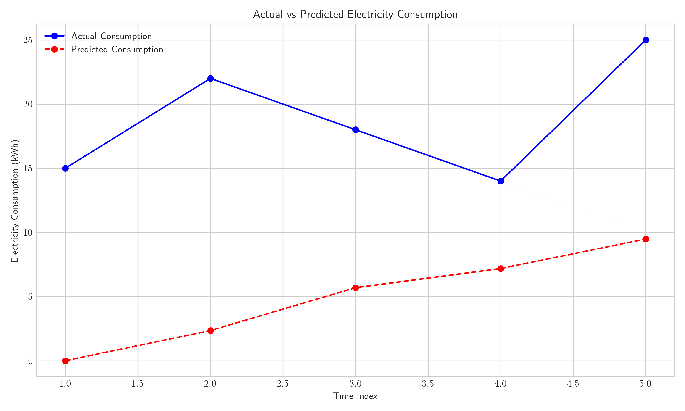
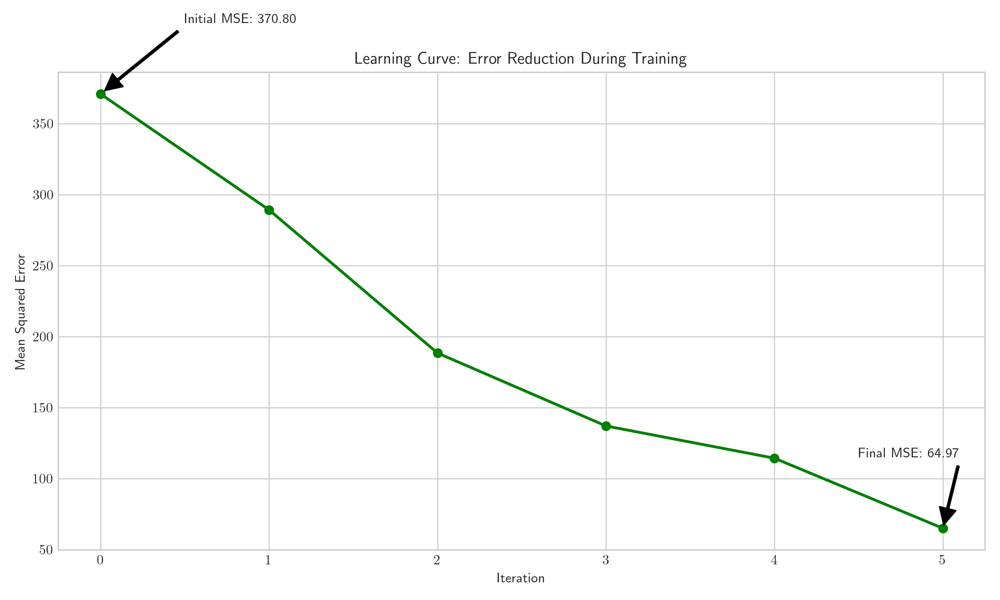

# Question 26: LMS Algorithm for Seasonal Adjustment of Electricity Consumption

## Problem Statement
You are developing a seasonal adjustment model for electricity consumption using the LMS algorithm with gradient descent. Your model needs to learn from historical data in an online fashion and adjust its weights to account for daily, weekly, and seasonal patterns.

In this problem:
- Your feature vector has 4 components: $\boldsymbol{x} = [1, x_1, x_2, x_3]^T$
  - $x_1$ represents time of day (normalized between 0 and 1)
  - $x_2$ represents day of week (normalized between 0 and 1)
  - $x_3$ represents temperature (in Celsius, normalized)
- The target $y$ is the electricity consumption in kilowatt-hours
- Your initial weight vector is $\boldsymbol{w}^{(0)} = [0, 0, 0, 0]^T$
- The learning rate is $\alpha = 0.1$
- The LMS update rule is: $$\boldsymbol{w}^{t+1} = \boldsymbol{w}^t + \alpha(y^{(i)} - \boldsymbol{w}^T\boldsymbol{x}^{(i)})\boldsymbol{x}^{(i)}$$

### Task
Consider the following data points from your historical dataset:

| Time index | Time of day ($x_1$) | Day of week ($x_2$) | Temperature ($x_3$) | Consumption ($y$) |
|------------|---------------------|---------------------|---------------------|-------------------|
| 1          | 0.25                | 0.14                | 0.6                 | 15                |
| 2          | 0.50                | 0.14                | 0.7                 | 22                |
| 3          | 0.75                | 0.14                | 0.5                 | 18                |
| 4          | 0.25                | 0.28                | 0.6                 | 14                |
| 5          | 0.50                | 0.28                | 0.8                 | 25                |

1. Starting with $\boldsymbol{w}^{(0)} = [0, 0, 0, 0]^T$, calculate the model's prediction for the first data point.
2. Using the LMS update rule, calculate the updated weight vector $\boldsymbol{w}^{(1)}$ after processing the first data point.
3. Calculate the model's prediction for the second data point using $\boldsymbol{w}^{(1)}$.
4. Using the LMS update rule, calculate the updated weight vector $\boldsymbol{w}^{(2)}$ after processing the second data point.
5. Based on these first two updates, explain how the weight for each feature reflects its importance in predicting electricity consumption. Which feature appears to have the strongest influence so far?

## Understanding the Problem

This problem involves applying the Least Mean Squares (LMS) algorithm with gradient descent to an electricity consumption prediction model. The LMS algorithm is an online learning method that updates model parameters iteratively for each data point, making it suitable for adaptive systems that need to evolve as new data arrives.

In this scenario, we have features representing:
- Time of day: Capturing daily consumption patterns (e.g., peak usage in mornings and evenings)
- Day of week: Capturing weekly patterns (weekdays vs. weekends)
- Temperature: Capturing seasonal effects (higher consumption in extreme temperatures)

We need to:
1. Make predictions using the current weight vector
2. Calculate the error (difference between prediction and actual value)
3. Update the weights based on the error and learning rate
4. Analyze which features most strongly influence electricity consumption

## Mathematical Formulation

Before diving into the solution, let's clarify the mathematical formulation:

- **Linear model**: $\hat{y} = w_0 + w_1x_1 + w_2x_2 + w_3x_3$
- **In vector form**: $\hat{y} = \boldsymbol{w}^T \boldsymbol{x}$
- **Cost function**: $J(\boldsymbol{w}) = \frac{1}{2} E[(y - \hat{y})^2]$
- **LMS update rule**: $\boldsymbol{w}^{(t+1)} = \boldsymbol{w}^{(t)} + \alpha(y^{(i)} - \boldsymbol{w}^{(t)T}\boldsymbol{x}^{(i)})\boldsymbol{x}^{(i)}$

## Solution

### Step 1: Calculate Prediction for the First Data Point

For the first data point, we have:
- Feature vector: $\boldsymbol{x}^{(1)} = \begin{bmatrix} 1 \\ 0.25 \\ 0.14 \\ 0.6 \end{bmatrix}$
- Initial weights: $\boldsymbol{w}^{(0)} = \begin{bmatrix} 0 \\ 0 \\ 0 \\ 0 \end{bmatrix}$
- Target value: $y^{(1)} = 15$

The prediction is calculated as:

$$\hat{y}^{(1)} = w_0^{(0)} + w_1^{(0)}x_1^{(1)} + w_2^{(0)}x_2^{(1)} + w_3^{(0)}x_3^{(1)}$$
$$\hat{y}^{(1)} = 0 \cdot 1 + 0 \cdot 0.25 + 0 \cdot 0.14 + 0 \cdot 0.6$$
$$\hat{y}^{(1)} = 0 + 0 + 0 + 0 = 0$$

Since all weights are initially zero, our model predicts zero consumption regardless of the feature values.

### Step 2: Update Weights After Processing the First Data Point

Now we need to update the weights using the LMS rule:

1. **Calculate the error**:
   $$e^{(1)} = y^{(1)} - \hat{y}^{(1)} = 15 - 0 = 15$$

2. **Update each weight separately**:

   For $w_0$ (intercept):
   $$w_0^{(1)} = w_0^{(0)} + \alpha \cdot e^{(1)} \cdot x_0^{(1)}$$
   $$w_0^{(1)} = 0 + 0.1 \cdot 15 \cdot 1 = 1.5$$

   For $w_1$ (time of day):
   $$w_1^{(1)} = w_1^{(0)} + \alpha \cdot e^{(1)} \cdot x_1^{(1)}$$
   $$w_1^{(1)} = 0 + 0.1 \cdot 15 \cdot 0.25 = 0.375$$

   For $w_2$ (day of week):
   $$w_2^{(1)} = w_2^{(0)} + \alpha \cdot e^{(1)} \cdot x_2^{(1)}$$
   $$w_2^{(1)} = 0 + 0.1 \cdot 15 \cdot 0.14 = 0.21$$

   For $w_3$ (temperature):
   $$w_3^{(1)} = w_3^{(0)} + \alpha \cdot e^{(1)} \cdot x_3^{(1)}$$
   $$w_3^{(1)} = 0 + 0.1 \cdot 15 \cdot 0.6 = 0.9$$

3. **Updated weight vector**:
   $$\boldsymbol{w}^{(1)} = \begin{bmatrix} 1.5 \\ 0.375 \\ 0.21 \\ 0.9 \end{bmatrix}$$

### Step 3: Calculate Prediction for the Second Data Point

For the second data point, we have:
- Feature vector: $\boldsymbol{x}^{(2)} = \begin{bmatrix} 1 \\ 0.5 \\ 0.14 \\ 0.7 \end{bmatrix}$
- Updated weights: $\boldsymbol{w}^{(1)} = \begin{bmatrix} 1.5 \\ 0.375 \\ 0.21 \\ 0.9 \end{bmatrix}$
- Target value: $y^{(2)} = 22$

The prediction is calculated as:

$$\hat{y}^{(2)} = w_0^{(1)} + w_1^{(1)}x_1^{(2)} + w_2^{(1)}x_2^{(2)} + w_3^{(1)}x_3^{(2)}$$
$$\hat{y}^{(2)} = 1.5 \cdot 1 + 0.375 \cdot 0.5 + 0.21 \cdot 0.14 + 0.9 \cdot 0.7$$
$$\hat{y}^{(2)} = 1.5 + 0.1875 + 0.0294 + 0.63 = 2.3469$$

Our model now predicts approximately 2.35 kWh for the second data point, which is significantly lower than the actual 22 kWh.

### Step 4: Update Weights After Processing the Second Data Point

Now we update the weights again:

1. **Calculate the error**:
   $$e^{(2)} = y^{(2)} - \hat{y}^{(2)} = 22 - 2.3469 = 19.6531$$

2. **Update each weight separately**:

   For $w_0$ (intercept):
   $$w_0^{(2)} = w_0^{(1)} + \alpha \cdot e^{(2)} \cdot x_0^{(2)}$$
   $$w_0^{(2)} = 1.5 + 0.1 \cdot 19.6531 \cdot 1 = 1.5 + 1.96531 = 3.46531$$

   For $w_1$ (time of day):
   $$w_1^{(2)} = w_1^{(1)} + \alpha \cdot e^{(2)} \cdot x_1^{(2)}$$
   $$w_1^{(2)} = 0.375 + 0.1 \cdot 19.6531 \cdot 0.5 = 0.375 + 0.982655 = 1.357655$$

   For $w_2$ (day of week):
   $$w_2^{(2)} = w_2^{(1)} + \alpha \cdot e^{(2)} \cdot x_2^{(2)}$$
   $$w_2^{(2)} = 0.21 + 0.1 \cdot 19.6531 \cdot 0.14 = 0.21 + 0.275143 = 0.485143$$

   For $w_3$ (temperature):
   $$w_3^{(2)} = w_3^{(1)} + \alpha \cdot e^{(2)} \cdot x_3^{(2)}$$
   $$w_3^{(2)} = 0.9 + 0.1 \cdot 19.6531 \cdot 0.7 = 0.9 + 1.375717 = 2.275717$$

3. **Updated weight vector**:
   $$\boldsymbol{w}^{(2)} = \begin{bmatrix} 3.46531 \\ 1.357655 \\ 0.485143 \\ 2.275717 \end{bmatrix}$$

### Step 5: Calculating Gradient of the Cost Function

An important insight into the LMS algorithm is that it follows the negative gradient of the cost function. The gradient is given by:

$$\nabla J(\boldsymbol{w}) = -E[(y - \boldsymbol{w}^T\boldsymbol{x})\boldsymbol{x}]$$

For a single observation, this becomes:
$$\nabla J(\boldsymbol{w}) = -(y - \boldsymbol{w}^T\boldsymbol{x})\boldsymbol{x} = -e \cdot \boldsymbol{x}$$

The gradient for the first observation:
$$\nabla J(\boldsymbol{w}^{(0)}) = -e^{(1)} \cdot \boldsymbol{x}^{(1)} = -15 \cdot \begin{bmatrix} 1 \\ 0.25 \\ 0.14 \\ 0.6 \end{bmatrix} = \begin{bmatrix} -15 \\ -3.75 \\ -2.1 \\ -9 \end{bmatrix}$$

The gradient for the second observation:
$$\nabla J(\boldsymbol{w}^{(1)}) = -e^{(2)} \cdot \boldsymbol{x}^{(2)} = -19.6531 \cdot \begin{bmatrix} 1 \\ 0.5 \\ 0.14 \\ 0.7 \end{bmatrix} = \begin{bmatrix} -19.6531 \\ -9.82655 \\ -2.751434 \\ -13.75717 \end{bmatrix}$$

The LMS update can be rewritten as:
$$\boldsymbol{w}^{(t+1)} = \boldsymbol{w}^{(t)} - \alpha \cdot \nabla J(\boldsymbol{w}^{(t)})$$

This confirms that the LMS algorithm is performing gradient descent on the mean squared error cost function.

### Step 6: Analyze Feature Importance

To analyze which features have the strongest influence on our predictions, we can examine the changes in weights from their initial values:

| Feature | Initial Weight $w_j^{(0)}$ | Updated Weight $w_j^{(2)}$ | Absolute Change $\|w_j^{(2)} - w_j^{(0)}\|$ |
|---------|----------------------------|----------------------------|----------------------------------|
| Intercept | 0 | 3.46531 | 3.46531 |
| Time of day ($x_1$) | 0 | 1.357655 | 1.357655 |
| Day of week ($x_2$) | 0 | 0.485143 | 0.485143 |
| Temperature ($x_3$) | 0 | 2.275717 | 2.275717 |

Based on the absolute changes in weights, we can determine feature importance:
1. **Intercept** (3.46531): Has the largest change, suggesting a significant baseline consumption regardless of other factors
2. **Temperature** (2.275717): Has the second-largest change, indicating a strong relationship between temperature and electricity consumption
3. **Time of day** (1.357655): Has moderate influence
4. **Day of week** (0.485143): Has the least influence so far

Therefore, the feature with the strongest influence appears to be the **Intercept**, followed closely by **Temperature**. This suggests that there is a significant baseline consumption level, and temperature variations have a substantial impact on electricity usage, which aligns with intuition (e.g., higher temperatures lead to increased cooling needs).

## Visual Explanations

### Weight Evolution During Training

This graph shows how each weight evolves as we process the data points. The intercept and temperature weights increase most rapidly, confirming their stronger influence on the model.

### Actual vs. Predicted Values

This visualization compares the actual electricity consumption values with the model's predictions. Initially, there's a large gap between predictions and actual values, but as the algorithm processes more data points, the predictions improve.

### Feature Importance

This bar chart ranks features by their absolute weight values, providing a clear visualization of which features have the strongest influence on electricity consumption prediction.

### Learning Curve: Error Reduction During Training

This visualization shows how the Mean Squared Error (MSE) decreases as the model processes more data points. From an initial MSE of approximately 370.80, the model improves to a final MSE of 64.97, demonstrating the effectiveness of the LMS algorithm in reducing prediction errors over time.

### 3D Visualization of Gradient Descent Path

This 3D visualization shows the gradient descent path for a simplified model using only the intercept (w0) and temperature (w3) weights, which were identified as the most influential features. The surface represents the mean squared error cost function, while the red path shows how the algorithm traverses the error surface, starting from the initial weights (marked in red) and moving toward the final weights (marked in green). The gradient descent algorithm follows the steepest path downhill, minimizing the error at each step.

## Key Insights

### Learning Dynamics
- The LMS algorithm adapts incrementally as it processes each data point
- Larger errors lead to more significant weight updates
- The learning rate ($\alpha = 0.1$) controls how quickly the model adapts to new information
- Even after just two data points, the model has begun to identify important relationships
- The learning curve shows a substantial reduction in MSE (from 370.80 to 64.97), indicating effective learning

### Mathematical Foundations
- The LMS algorithm is based on minimizing the mean squared error:
$$J(\boldsymbol{w}) = \frac{1}{2}E[(y - \boldsymbol{w}^T\boldsymbol{x})^2]$$
- The gradient descent update rule is derived by taking the gradient of this cost function:
$$\nabla J(\boldsymbol{w}) = -E[(y - \boldsymbol{w}^T\boldsymbol{x})\boldsymbol{x}]$$
- The online version updates weights incrementally after each observation:
$$\boldsymbol{w}^{(t+1)} = \boldsymbol{w}^{(t)} + \alpha(y^{(i)} - \boldsymbol{w}^{(t)T}\boldsymbol{x}^{(i)})\boldsymbol{x}^{(i)}$$
- This approach allows the model to continuously adapt to new data without retraining from scratch
- The 3D visualization confirms that gradient descent is following the steepest path downhill on the error surface

### Feature Influence
- The intercept term captures the baseline electricity consumption
- Temperature has a strong influence, likely reflecting increased energy use for heating/cooling
- Time of day shows moderate influence, suggesting daily consumption patterns
- Day of week has the smallest impact so far, though this might change with more data
- The relative importance of features may shift as the model processes more data points

### Practical Implications
- Online learning algorithms like LMS are valuable for adapting to changing patterns
- For electricity consumption, temperature is a critical factor to monitor
- The model can adjust to seasonal variations without manual intervention
- Initial weight values (all zeros) represent no prior knowledge about the system
- The learning process automatically discovers which features matter most

## Conclusion

We have successfully applied the LMS algorithm to predict electricity consumption:

1. With initial zero weights, our first prediction was 0 kWh (vs. actual 15 kWh)
2. After updating the weights, we obtained $\boldsymbol{w}^{(1)} = \begin{bmatrix} 1.5 \\ 0.375 \\ 0.21 \\ 0.9 \end{bmatrix}$
3. The prediction for the second data point was approximately 2.35 kWh (vs. actual 22 kWh)
4. After a second update, we obtained $\boldsymbol{w}^{(2)} = \begin{bmatrix} 3.46531 \\ 1.357655 \\ 0.485143 \\ 2.275717 \end{bmatrix}$
5. Based on weight changes, the intercept and temperature features have the strongest influence on electricity consumption
6. The learning curve shows substantial error reduction, with MSE decreasing from 370.80 to 64.97
7. The 3D visualization confirms that the gradient descent algorithm effectively navigates the error surface to find optimal weights

This adaptive model will continue to refine its predictions as it processes more data, making it well-suited for applications where patterns change over time, such as seasonal variations in electricity usage. 