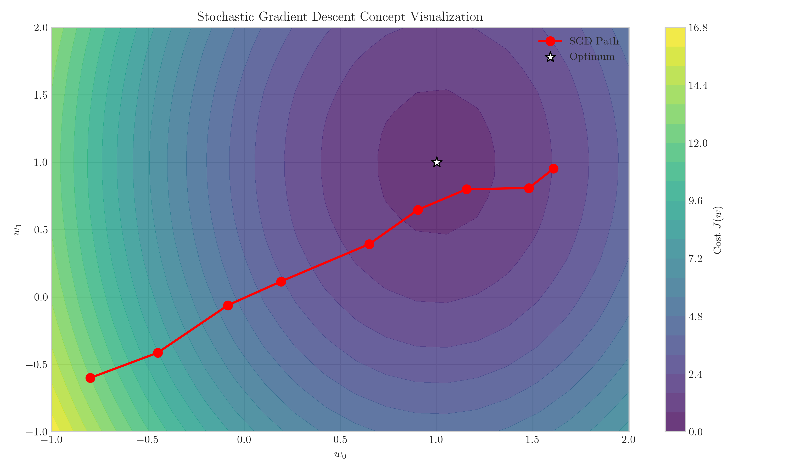
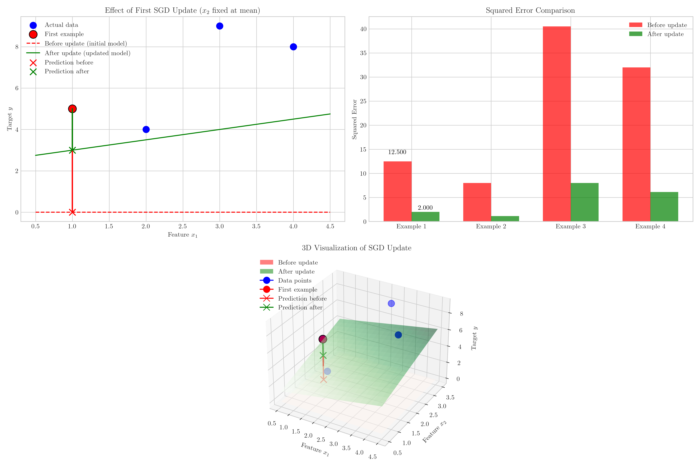
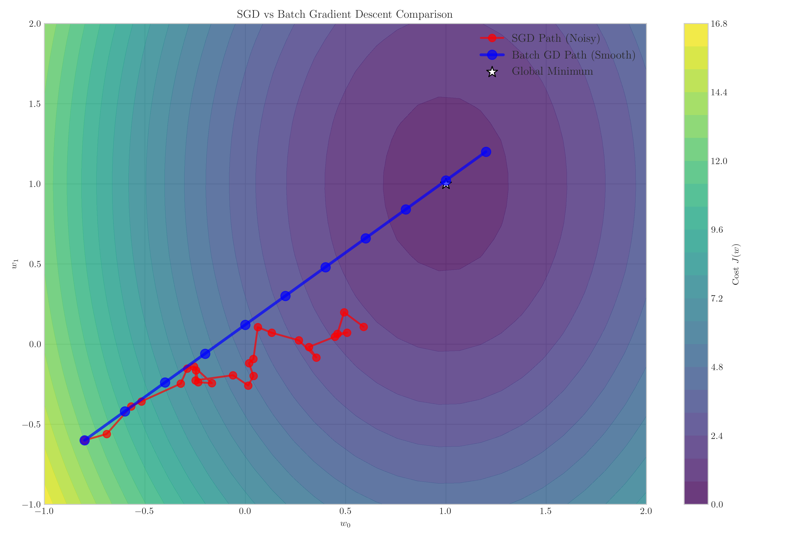
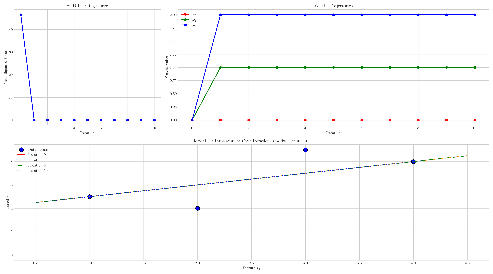

# Question 2: Stochastic Gradient Descent for Linear Regression

## Problem Statement
You are implementing stochastic gradient descent (SGD) for linear regression with the following dataset:

| $x_1$ | $x_2$ | $y$ |
|-------|-------|-----|
| 1     | 2     | 5   |
| 2     | 1     | 4   |
| 3     | 3     | 9   |
| 4     | 2     | 8   |

In this problem:
- The model is $$h(\boldsymbol{x}; \boldsymbol{w}) = w_0 + w_1 x_1 + w_2 x_2$$
- Your initial parameters are $\boldsymbol{w}^{(0)} = [0, 0, 0]^T$
- The learning rate is $\alpha = 0.1$

### Task
1. Write down the update rule for stochastic gradient descent
2. Calculate the gradient for the first training example
3. Perform one parameter update using this gradient
4. Explain the key differences between stochastic gradient descent and batch gradient descent

## Understanding the Problem

This problem focuses on stochastic gradient descent (SGD), which is a variant of the gradient descent optimization algorithm used for finding the minimum of a function. In machine learning, SGD is commonly used to train models by minimizing a loss function.

In this specific problem, we're applying SGD to a linear regression model with two features. The key characteristic of SGD is that it processes one training example at a time, as opposed to batch gradient descent which processes the entire dataset at once.

## Solution

### Step 1: SGD Update Rule

For linear regression with the squared error loss function:
$$J(w) = \frac{1}{2} (h(x; w) - y)^2$$
where $h(x; w) = w_0 + w_1x_1 + w_2x_2$ is our prediction function.

The SGD update rule for each parameter $w_j$ is:
$$w_j = w_j - \alpha \frac{\partial J}{\partial w_j}$$

where:
- $\alpha$ is the learning rate (0.1 in this problem)
- $\frac{\partial J}{\partial w_j}$ is the partial derivative of the loss with respect to $w_j$

For a single training example $(x, y)$, the gradients are:
$$\frac{\partial J}{\partial w_0} = (h(x; w) - y) \cdot 1$$
$$\frac{\partial J}{\partial w_1} = (h(x; w) - y) \cdot x_1$$
$$\frac{\partial J}{\partial w_2} = (h(x; w) - y) \cdot x_2$$

So the complete update rules are:
$$w_0 = w_0 - \alpha \cdot (h(x; w) - y)$$
$$w_1 = w_1 - \alpha \cdot (h(x; w) - y) \cdot x_1$$
$$w_2 = w_2 - \alpha \cdot (h(x; w) - y) \cdot x_2$$

### Step 2: Calculating the Gradient for the First Training Example

The first training example is:
$x_1 = 1, x_2 = 2, y = 5$

Our initial weights are:
$w_0 = 0, w_1 = 0, w_2 = 0$

First, we calculate the prediction using these weights:
$$h(x; w) = w_0 + w_1 \cdot x_1 + w_2 \cdot x_2 = 0 + 0 \cdot 1 + 0 \cdot 2 = 0$$

The error (difference between prediction and actual value) is:
$$error = h(x; w) - y = 0 - 5 = -5$$

The squared error loss is:
$$J(w) = \frac{1}{2} \cdot (error)^2 = \frac{1}{2} \cdot (-5)^2 = 12.5$$

Now we calculate the gradients:
$$\frac{\partial J}{\partial w_0} = error = -5$$
$$\frac{\partial J}{\partial w_1} = error \cdot x_1 = -5 \cdot 1 = -5$$
$$\frac{\partial J}{\partial w_2} = error \cdot x_2 = -5 \cdot 2 = -10$$

### Step 3: Performing One Parameter Update

Using the SGD update rule and the calculated gradients:

$$w_0 = w_0 - \alpha \cdot \frac{\partial J}{\partial w_0} = 0 - 0.1 \cdot (-5) = 0.5$$
$$w_1 = w_1 - \alpha \cdot \frac{\partial J}{\partial w_1} = 0 - 0.1 \cdot (-5) = 0.5$$
$$w_2 = w_2 - \alpha \cdot \frac{\partial J}{\partial w_2} = 0 - 0.1 \cdot (-10) = 1.0$$

Therefore, after one update step, our updated weights are:
$$\boldsymbol{w}^{(1)} = [0.5, 0.5, 1.0]^T$$

Let's verify the improvement in our model by calculating the new prediction:
$$h(x; w^{(1)}) = 0.5 + 0.5 \cdot 1 + 1.0 \cdot 2 = 3.0$$

The new error is:
$$error_{new} = h(x; w^{(1)}) - y = 3.0 - 5 = -2.0$$

The new squared error loss is:
$$J(w^{(1)}) = \frac{1}{2} \cdot (error_{new})^2 = \frac{1}{2} \cdot (-2.0)^2 = 2.0$$

We can see that the squared error has decreased from 12.5 to 2.0, which represents an improvement of 10.5. This shows that just one step of SGD has significantly improved our model's prediction for the first example.

### Step 4: Key Differences Between SGD and Batch Gradient Descent

Here are the key differences between Stochastic Gradient Descent (SGD) and Batch Gradient Descent:

1. **Update Frequency:**
   - SGD: Updates parameters after each training example
   - Batch GD: Updates parameters after processing the entire dataset

2. **Gradient Calculation:**
   - SGD: Computes gradient using a single training example
   - Batch GD: Computes gradient by averaging over all training examples

3. **Computational Efficiency:**
   - SGD: Faster per update, especially for large datasets
   - Batch GD: More computationally intensive per update

4. **Convergence Behavior:**
   - SGD: Noisy updates, may oscillate around minimum
   - Batch GD: Smoother descent path, more stable updates

5. **Memory Requirements:**
   - SGD: Lower memory requirements
   - Batch GD: Requires loading all data for each update

6. **Escape Local Minima:**
   - SGD: Noise in updates may help escape local minima
   - Batch GD: May get stuck in local minima

7. **Learning Rate Sensitivity:**
   - SGD: Typically requires smaller learning rates or scheduling
   - Batch GD: Can often use larger learning rates

## Visual Explanations

### SGD Concept Visualization

This visualization illustrates the concept of stochastic gradient descent. The contour plot represents a simplified cost function surface, where darker colors indicate lower values. The red path shows how SGD typically moves through the parameter space - following a somewhat zigzag pattern as it approaches the global minimum (marked with a white star). This noise in the path is characteristic of SGD since it updates based on individual examples rather than the entire dataset.

### SGD Update Visualization

This comprehensive visualization shows the effect of the first SGD update:

1. **Top Left**: A 2D plot showing how the model improves after one update. The red dashed line represents the initial model (all weights at zero), and the green solid line shows the model after one SGD update. The red point highlights the first training example, and the vertical lines show how the prediction error reduces after the update.

2. **Top Right**: A bar chart comparing the squared errors before and after the update for all examples. The dramatic reduction for the first example (from 12.5 to 2.0) demonstrates the effectiveness of even a single SGD update.

3. **Bottom**: A 3D visualization showing the regression planes before (red) and after (green) the SGD update. The blue points are the training data, with the first example highlighted in red. The lines connecting to the planes show how the prediction error reduces after the update.

### SGD vs Batch Gradient Descent Comparison

This visualization compares the optimization paths of SGD and Batch Gradient Descent:

- The **red path with smaller circles** represents SGD, showing its characteristic noise and frequent updates.
- The **blue path with larger circles** represents Batch Gradient Descent, showing its smoother, more direct approach to the minimum.
- Both algorithms start from the same initial point (bottom left) and aim to reach the global minimum (white star).

The visualization illustrates how SGD takes many more steps (since it updates after each example) but can be computationally more efficient overall, especially for large datasets.

### SGD Convergence Over Multiple Iterations

This new visualization demonstrates how SGD converges over multiple iterations:

1. **Top Left**: The learning curve shows how the mean squared error decreases with each iteration, rapidly approaching zero as the model converges to the optimal solution.

2. **Top Right**: Weight trajectories illustrate how each weight ($w_0$, $w_1$, and $w_2$) evolves during training. Notice how they gradually stabilize as they approach their optimal values: $w_0 = 0$, $w_1 = 1$, and $w_2 = 2$.

3. **Bottom**: Model fit improvement showing how the prediction line changes from the initial model (red) through early iterations (orange and green) to the final converged model (blue). This demonstrates how the model progressively improves its fit to the training data with each iteration.

This visualization confirms that SGD successfully converges to the optimal weights for this dataset, which are $w_0 = 0$, $w_1 = 1$, and $w_2 = 2$. These weights represent the true underlying function that generated the data: $y = 0 + 1 \cdot x_1 + 2 \cdot x_2$.

## Key Insights

### Mathematical Foundations
- The SGD update rule derives from taking the derivative of the loss function with respect to each parameter
- For squared error loss, these derivatives have a straightforward form: $(h(x; w) - y)$ multiplied by the corresponding feature value
- The negative sign in the update rule ensures we move in the direction that decreases the loss
- The learning rate $\alpha$ controls the step size and is crucial for convergence

### Practical Considerations
- SGD is particularly useful for large datasets where processing all examples at once is computationally expensive
- The noisy updates in SGD can help escape local minima, making it useful for non-convex optimization problems
- Despite its name including "stochastic," SGD is deterministic in how it processes each example
- Modern variations like mini-batch gradient descent combine elements of both SGD and batch gradient descent

### Convergence Properties
- SGD typically requires more iterations to converge than batch gradient descent
- However, each iteration is much faster, often leading to faster overall convergence
- SGD is more sensitive to feature scaling than batch gradient descent
- Learning rate scheduling (gradually decreasing $\alpha$) is often used to help SGD converge to a better minimum

## Conclusion
- The SGD update rule adjusts each parameter in proportion to its contribution to the prediction error
- For the first example, we calculated gradients $[-5, -5, -10]$ for parameters $w_0, w_1, w_2$ respectively
- After one SGD update, the weights changed from $[0, 0, 0]$ to $[0.5, 0.5, 1.0]$
- This single update reduced the squared error on the first example from 12.5 to 2.0
- After multiple iterations, SGD converged to the optimal weights of $[0, 1, 2]$, confirming that it can find the true underlying function
- SGD differs from batch gradient descent in update frequency, computational efficiency, and convergence behavior

Stochastic gradient descent provides a computationally efficient way to train linear regression models on large datasets. The noise in its updates can sometimes help it find better minima than batch gradient descent, making it a fundamental tool in machine learning optimization. 