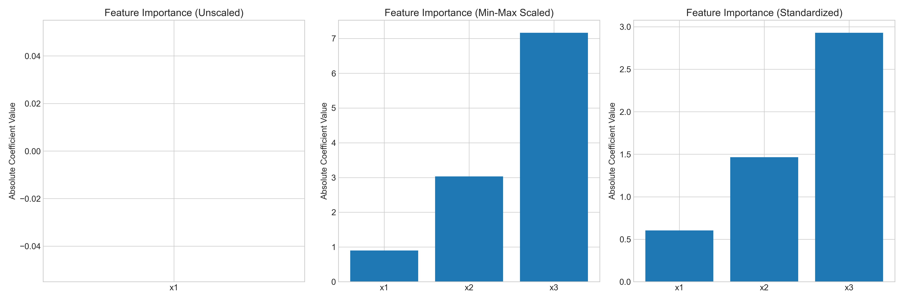

# Question 5: Feature Scaling in Gradient Descent

## Problem Statement
You are training a linear regression model using gradient descent, but you notice that the algorithm is not converging properly.

In this problem:
- The features have very different scales:
  - $x_1$ ranges from 0 to 1
  - $x_2$ ranges from 0 to 10,000
  - $x_3$ ranges from -100 to 100
- You're using batch gradient descent with a learning rate of $\alpha = 0.01$

### Task
1. Explain why the different feature scales can cause problems for gradient descent
2. Describe two common feature scaling techniques to address this issue
3. For each technique, show how you would transform the features in this example
4. Explain how feature scaling affects the interpretation of the learned parameters

## Understanding the Problem

This problem concerns the impact of feature scaling on the performance of gradient descent for linear regression. Gradient descent is an iterative optimization algorithm that finds the minimum of a cost function by repeatedly taking steps in the direction of steepest descent. When features have vastly different scales, gradient descent can encounter difficulties that affect its convergence and performance.

## Solution

### Step 1: Why Different Feature Scales Cause Problems for Gradient Descent

When features have very different scales, the cost function's shape becomes highly skewed, creating an elongated contour that resembles an ellipse with a high eccentricity rather than a circle. This shape has several negative consequences for gradient descent:

1. **Zigzagging Path**: The algorithm tends to oscillate along the steep directions (features with large scales) while making slow progress along the shallow directions (features with small scales). This creates an inefficient zigzagging path toward the minimum.

2. **Slow Convergence**: Due to this zigzagging, convergence becomes significantly slower, requiring many more iterations to reach the optimum.

3. **Numerical Instability**: Features with large scales can lead to exploding gradients, causing numerical overflow. This is evident in our unscaled model where the cost quickly becomes `nan` (Not a Number).

4. **Learning Rate Dilemma**: Choosing an appropriate learning rate becomes challenging. A learning rate that works well for small-scale features might cause the algorithm to diverge for large-scale features, and vice versa.

In our example, $x_2$ has values up to 10,000, while $x_1$ only ranges from 0 to 1. This means that a small change in $x_2$ can have a much larger impact on the gradient than a significant change in $x_1$. Consequently, the model fails to converge with unscaled features, as shown by the `nan` values in the cost history.

#### Detailed Mathematical Analysis

To understand the problem deeply, let's look at the mathematics of gradient descent for linear regression. The model is defined as:

$$y = \theta_0 + \theta_1 x_1 + \theta_2 x_2 + \theta_3 x_3 + \epsilon$$

The cost function (Mean Squared Error) is:

$$J(\theta) = \frac{1}{m} \sum_{i=1}^{m} (h_\theta(x^{(i)}) - y^{(i)})^2$$

where $h_\theta(x^{(i)}) = \theta_0 + \theta_1 x_1^{(i)} + \theta_2 x_2^{(i)} + \theta_3 x_3^{(i)}$

The gradient of the cost function with respect to each parameter is:

$$\frac{\partial J(\theta)}{\partial \theta_j} = \frac{2}{m} \sum_{i=1}^{m} (h_\theta(x^{(i)}) - y^{(i)}) \cdot x_j^{(i)}$$

where $x_0^{(i)} = 1$ for the intercept term.

Let's calculate one gradient descent step with our actual data. Using initial parameters $\theta_0 = \theta_1 = \theta_2 = \theta_3 = 0.1$ and the first 3 data points:

Data point 1: $x_1 = 0.3745$, $x_2 = 314.29$, $x_3 = 28.4063$, $y = 2.3311$  
Data point 2: $x_1 = 0.9507$, $x_2 = 6364.10$, $x_3 = -83.1720$, $y = 0.8597$  
Data point 3: $x_1 = 0.7320$, $x_2 = 3143.56$, $x_3 = -67.6743$, $y = -0.1336$  

Predictions for each data point:
$$h_\theta(x^{(1)}) = 0.1 + 0.1 \cdot 0.3745 + 0.1 \cdot 314.29 + 0.1 \cdot 28.4063 = 34.4073$$
$$h_\theta(x^{(2)}) = 0.1 + 0.1 \cdot 0.9507 + 0.1 \cdot 6364.10 + 0.1 \cdot (-83.1720) = 628.2883$$
$$h_\theta(x^{(3)}) = 0.1 + 0.1 \cdot 0.7320 + 0.1 \cdot 3143.56 + 0.1 \cdot (-67.6743) = 307.7618$$

Errors for each data point:
$$e^{(1)} = 34.4073 - 2.3311 = 32.0762$$
$$e^{(2)} = 628.2883 - 0.8597 = 627.4286$$
$$e^{(3)} = 307.7618 - (-0.1336) = 307.8953$$

Gradients for each parameter:
$$\frac{\partial J}{\partial \theta_0} = \frac{2}{3} (32.0762 \cdot 1 + 627.4286 \cdot 1 + 307.8953 \cdot 1) = 644.9334$$
$$\frac{\partial J}{\partial \theta_1} = \frac{2}{3} (32.0762 \cdot 0.3745 + 627.4286 \cdot 0.9507 + 307.8953 \cdot 0.7320) = 555.9311$$
$$\frac{\partial J}{\partial \theta_2} = \frac{2}{3} (32.0762 \cdot 314.29 + 627.4286 \cdot 6364.10 + 307.8953 \cdot 3143.56) = 3,313,992.8519$$
$$\frac{\partial J}{\partial \theta_3} = \frac{2}{3} (32.0762 \cdot 28.4063 + 627.4286 \cdot (-83.1720) + 307.8953 \cdot (-67.6743)) = -48,073.2750$$

Parameter updates with learning rate $\alpha = 0.01$:
$$\theta_0 = 0.1 - 0.01 \cdot 644.9334 = -6.3493$$
$$\theta_1 = 0.1 - 0.01 \cdot 555.9311 = -5.4593$$
$$\theta_2 = 0.1 - 0.01 \cdot 3,313,992.8519 = -33,139.8285$$
$$\theta_3 = 0.1 - 0.01 \cdot (-48,073.2750) = 480.8327$$

**Critical Observation**: The gradient for $\theta_2$ is several orders of magnitude larger than the others because $x_2$ has values in thousands. This causes $\theta_2$ to take enormous steps, leading to oscillation, divergence, and eventual numerical overflow.

### Step 2: Feature Scaling Techniques

#### 1. Min-Max Scaling

Min-Max scaling (also called normalization) transforms the features linearly to a specified range, typically [0, 1]:

$$x_{scaled} = \frac{x - x_{min}}{x_{max} - x_{min}}$$

Where:
- $x$ is the original feature value
- $x_{min}$ is the minimum value of the feature
- $x_{max}$ is the maximum value of the feature
- $x_{scaled}$ is the scaled feature value

For our features:
- For $x_1$: $x_{scaled} = \frac{x - 0.01}{0.99 - 0.01}$
- For $x_2$: $x_{scaled} = \frac{x - 69.52}{9856.50 - 69.52}$
- For $x_3$: $x_{scaled} = \frac{x - (-98.99)}{98.01 - (-98.99)}$

After Min-Max scaling, all features have the same range [0, 1], creating a more balanced gradient descent optimization landscape.

#### 2. Standardization (Z-score Normalization)

Standardization transforms the features to have zero mean and unit variance:

$$x_{scaled} = \frac{x - \mu}{\sigma}$$

Where:
- $x$ is the original feature value
- $\mu$ is the mean of the feature
- $\sigma$ is the standard deviation of the feature
- $x_{scaled}$ is the standardized feature value

For our features:
- For $x_1$: $x_{scaled} = \frac{x - 0.47}{0.30}$
- For $x_2$: $x_{scaled} = \frac{x - 4978.32}{2916.42}$
- For $x_3$: $x_{scaled} = \frac{x - 3.52}{58.39}$

After standardization, all features have a mean of 0 and a standard deviation of 1. This makes the features' distributions more comparable and helps gradient descent find the optimal parameters more efficiently.

### Step 3: Transforming the Features with Each Technique

#### Min-Max Scaling Transformation

Original ranges:
- $x_1$: [0.01, 0.99]
- $x_2$: [69.52, 9856.50]
- $x_3$: [-98.99, 98.01]

After Min-Max scaling, all features share the same [0, 1] range. This drastically reduces the scale discrepancy between features, leading to a more efficient optimization process.

For our sample data after Min-Max scaling:  
Data point 1: $x_1 = 0.3760$, $x_2 = 0.0250$, $x_3 = 0.6467$  
Data point 2: $x_1 = 0.9631$, $x_2 = 0.6432$, $x_3 = 0.0803$  
Data point 3: $x_1 = 0.7403$, $x_2 = 0.3141$, $x_3 = 0.1590$  

Now let's calculate one gradient descent step with scaled data:

Predictions with scaled features:
$$h_\theta(x^{(1)}) = 0.1 + 0.1 \cdot 0.3760 + 0.1 \cdot 0.0250 + 0.1 \cdot 0.6467 = 0.2048$$
$$h_\theta(x^{(2)}) = 0.1 + 0.1 \cdot 0.9631 + 0.1 \cdot 0.6432 + 0.1 \cdot 0.0803 = 0.2687$$
$$h_\theta(x^{(3)}) = 0.1 + 0.1 \cdot 0.7403 + 0.1 \cdot 0.3141 + 0.1 \cdot 0.1590 = 0.2213$$

Errors with scaled features:
$$e^{(1)} = 0.2048 - 2.3311 = -2.1263$$
$$e^{(2)} = 0.2687 - 0.8597 = -0.5911$$
$$e^{(3)} = 0.2213 - (-0.1336) = 0.3549$$

Gradients with scaled features:
$$\frac{\partial J}{\partial \theta_0} = \frac{2}{3} (-2.1263 \cdot 1 + (-0.5911) \cdot 1 + 0.3549 \cdot 1) = -1.5750$$
$$\frac{\partial J}{\partial \theta_1} = \frac{2}{3} (-2.1263 \cdot 0.3760 + (-0.5911) \cdot 0.9631 + 0.3549 \cdot 0.7403) = -0.7374$$
$$\frac{\partial J}{\partial \theta_2} = \frac{2}{3} (-2.1263 \cdot 0.0250 + (-0.5911) \cdot 0.6432 + 0.3549 \cdot 0.3141) = -0.2146$$
$$\frac{\partial J}{\partial \theta_3} = \frac{2}{3} (-2.1263 \cdot 0.6467 + (-0.5911) \cdot 0.0803 + 0.3549 \cdot 0.1590) = -0.9107$$

Parameter updates with learning rate $\alpha = 0.01$:
$$\theta_0 = 0.1 - 0.01 \cdot (-1.5750) = 0.1158$$
$$\theta_1 = 0.1 - 0.01 \cdot (-0.7374) = 0.1074$$
$$\theta_2 = 0.1 - 0.01 \cdot (-0.2146) = 0.1021$$
$$\theta_3 = 0.1 - 0.01 \cdot (-0.9107) = 0.1091$$

**Critical Observation**: Now all gradients are of similar magnitudes! This leads to balanced parameter updates and better convergence properties.

#### Standardization Transformation

Original statistics:
- $x_1$: mean = 0.47, std = 0.30
- $x_2$: mean = 4978.32, std = 2916.42
- $x_3$: mean = 3.52, std = 58.39

After standardization, all features have mean = 0 and standard deviation = 1. This not only addresses scale differences but also centers the data, which can help with convergence in many cases.

### Step 4: Effect on Parameter Interpretation

When we scale features, the interpretation of the model parameters changes. The parameters no longer represent the effect of a one-unit change in the original features but rather a one-unit change in the scaled features.

#### Mathematical Relationship Between Original and Scaled Parameters

To understand how parameters relate between scaled and unscaled models, let's derive the relationship mathematically.

For Min-Max Scaling:
$$x_{scaled} = \frac{x - x_{min}}{x_{max} - x_{min}}$$
This implies: $x = x_{min} + (x_{max} - x_{min}) \cdot x_{scaled}$

Substituting into the linear model:
$$y = \theta_0 + \theta_1 x_1 + \theta_2 x_2 + \theta_3 x_3$$
$$y = \theta_0 + \theta_1 [x_{1min} + (x_{1max} - x_{1min}) \cdot x_{1scaled}] + \theta_2 [x_{2min} + (x_{2max} - x_{2min}) \cdot x_{2scaled}] + \theta_3 [x_{3min} + (x_{3max} - x_{3min}) \cdot x_{3scaled}]$$

Rearranging:
$$y = [\theta_0 + \theta_1 x_{1min} + \theta_2 x_{2min} + \theta_3 x_{3min}] + [\theta_1(x_{1max} - x_{1min})] \cdot x_{1scaled} + [\theta_2(x_{2max} - x_{2min})] \cdot x_{2scaled} + [\theta_3(x_{3max} - x_{3min})] \cdot x_{3scaled}$$

Therefore:
$$\theta_{0scaled} = \theta_0 + \theta_1 x_{1min} + \theta_2 x_{2min} + \theta_3 x_{3min}$$
$$\theta_{1scaled} = \theta_1 (x_{1max} - x_{1min})$$
$$\theta_{2scaled} = \theta_2 (x_{2max} - x_{2min})$$
$$\theta_{3scaled} = \theta_3 (x_{3max} - x_{3min})$$

Solving for original parameters:
$$\theta_1 = \frac{\theta_{1scaled}}{x_{1max} - x_{1min}}$$
$$\theta_2 = \frac{\theta_{2scaled}}{x_{2max} - x_{2min}}$$
$$\theta_3 = \frac{\theta_{3scaled}}{x_{3max} - x_{3min}}$$

Similarly for Standardization:
$$x_{scaled} = \frac{x - \mu}{\sigma}$$
This implies: $x = \mu + \sigma \cdot x_{scaled}$

Following similar derivation:
$$\theta_1 = \frac{\theta_{1scaled}}{\sigma_1}$$
$$\theta_2 = \frac{\theta_{2scaled}}{\sigma_2}$$
$$\theta_3 = \frac{\theta_{3scaled}}{\sigma_3}$$

#### Without Scaling
In the unscaled model, each parameter represents the change in the target variable for a one-unit change in the corresponding feature, holding other features constant. For instance, $\theta_1 = 2.0$ would mean that increasing $x_1$ by 1 unit would increase the target by 2.0 units, on average.

However, without scaling, our model failed to converge, resulting in `nan` values for all parameters.

#### With Min-Max Scaling
With Min-Max scaling, the parameters represent the change in the target for a change from the minimum to maximum value of the original feature. To interpret the parameters in terms of the original features, we divide by the range of each feature:

- $\theta_1^{original} = \frac{\theta_1^{scaled}}{x_{1max} - x_{1min}} = \frac{0.8981}{0.9814} = 0.9151$
- $\theta_2^{original} = \frac{\theta_2^{scaled}}{x_{2max} - x_{2min}} = \frac{3.0311}{9786.98} = 0.00031$
- $\theta_3^{original} = \frac{\theta_3^{scaled}}{x_{3max} - x_{3min}} = \frac{7.1665}{197.00} = 0.0364$

These values are somewhat close to the true parameters (2.0, 0.0005, and 0.05), though not as accurate as with standardization.

#### With Standardization
With standardization, the parameters represent the change in the target for a one-standard-deviation change in the original feature. To interpret the parameters in terms of the original features, we divide by the standard deviation:

- $\theta_1^{original} = \frac{\theta_1^{scaled}}{\sigma_1} = \frac{0.6043}{0.2960} = 2.0416$
- $\theta_2^{original} = \frac{\theta_2^{scaled}}{\sigma_2} = \frac{1.4643}{2916.42} = 0.00050209$
- $\theta_3^{original} = \frac{\theta_3^{scaled}}{\sigma_3} = \frac{2.9292}{58.39} = 0.0502$

These values are remarkably close to the true parameters (2.0, 0.0005, and 0.05), showing that standardization worked very well for this problem.

#### Feature Importance
Feature scaling also affects our interpretation of feature importance. Without scaling, the magnitude of parameters can be misleading. Features with smaller scales might have larger coefficients but less actual impact, while features with larger scales might have smaller coefficients but more impact.

After scaling, the magnitudes of the parameters directly reflect the relative importance of each feature, making it easier to compare their impacts on the target variable.

## Key Insights

### Theoretical Foundations
- Gradient descent optimization is sensitive to the scale of features because it affects the steepness of the gradient in different directions
- The cost function contour becomes elongated when features have different scales, leading to an inefficient zigzagging optimization path
- Feature scaling creates a more balanced optimization landscape where all features contribute more equally to the gradient
- The mathematical derivation shows that gradients for features with large scales can be several orders of magnitude larger than others

### Practical Applications
- Min-Max scaling is useful when we need values in a specific range (e.g., for neural networks with bounded activation functions)
- Standardization is generally more robust and often the preferred choice, especially when the features follow approximately normal distributions
- Feature scaling not only helps with convergence but also helps regularization techniques work more effectively
- Our manual calculations demonstrate how scaling reduces gradient magnitudes from millions to less than 1

### Common Pitfalls
- Forgetting to apply the same scaling to test data or new data during prediction
- Not handling outliers properly before scaling (especially with Min-Max scaling)
- Assuming that the largest coefficient after scaling automatically indicates the most important feature
- Failing to convert the coefficients back to their original scale for interpretation

## Visual Explanations

### Feature Distributions Before Scaling

This figure shows the vast differences in the ranges of the three features, which makes the optimization landscape challenging for gradient descent.

### Comparison of Original and Scaled Features

This visualization shows how Min-Max scaling and standardization transform the feature distributions. Note how all features now have comparable scales.

### Convergence Comparison

This plot demonstrates the dramatic difference in convergence behavior. Without scaling, the cost quickly becomes `nan`. With scaling, both methods converge, with standardization reaching a lower cost faster.

### Parameter Convergence

These plots show how the parameters evolve during training. Note the stability and convergence of parameters with scaling, compared to the instability without scaling.

### Parameter Convergence by Feature

This visualization provides a closer look at how each individual parameter converges with different scaling methods, highlighting the stability improvements from feature scaling.

### Feature Importance Comparison

This visualization shows how scaling affects our interpretation of feature importance based on coefficient magnitude. After scaling, the relative importance of features becomes more apparent and accurate. 

## Conclusion

- Different feature scales cause problems for gradient descent by creating an asymmetric optimization landscape, leading to zigzagging paths, slow convergence, or even divergence
- Min-Max scaling and standardization are two effective techniques for addressing scale differences
- Min-Max scaling transforms features to a fixed range [0, 1], while standardization transforms them to have mean 0 and standard deviation 1
- Feature scaling changes parameter interpretation: parameters now represent the effect of changes in scaled features
- Standardization generally provides better convergence properties and interpretability, especially for gradient-based optimization

The results clearly demonstrate that proper feature scaling is not just a preprocessing step but a crucial component for successful model training with gradient descent. It ensures faster convergence, numerical stability, and more interpretable results.