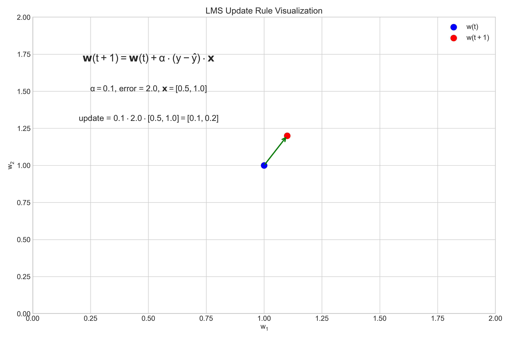
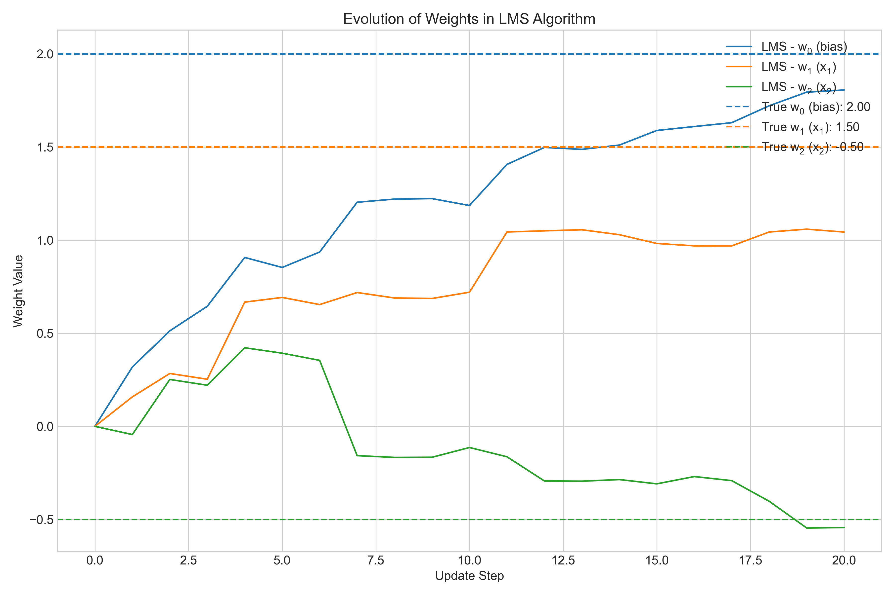
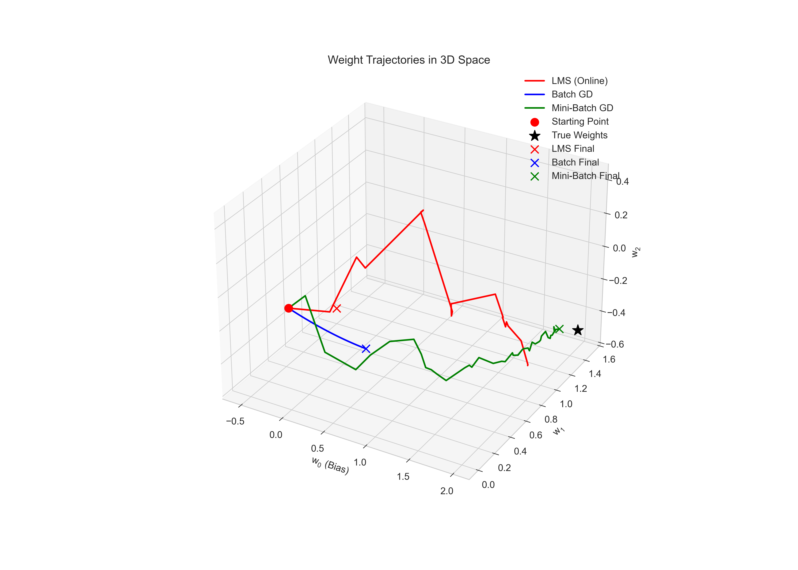
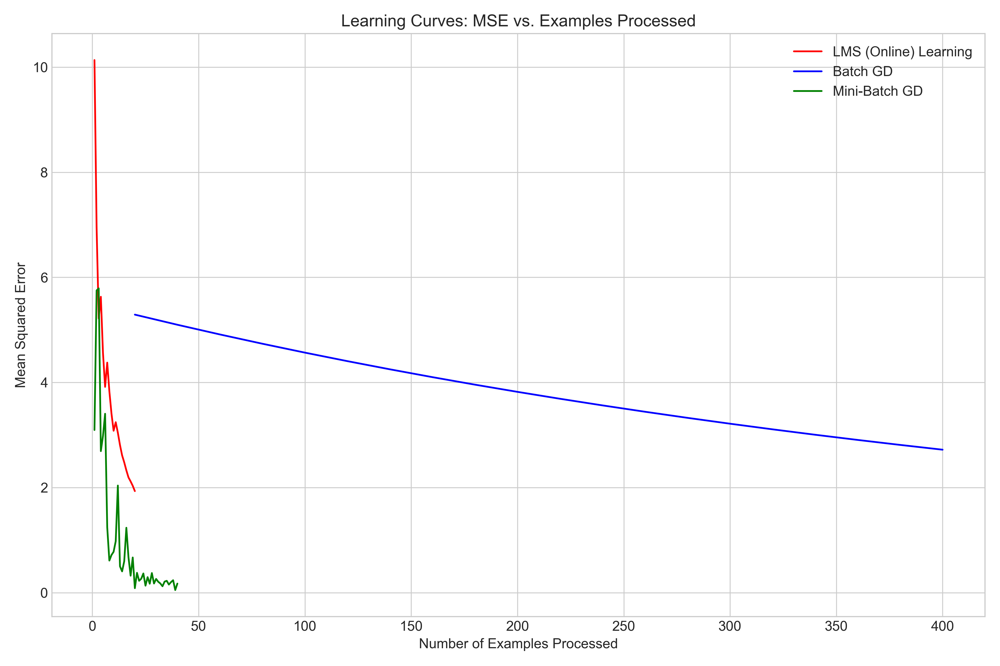
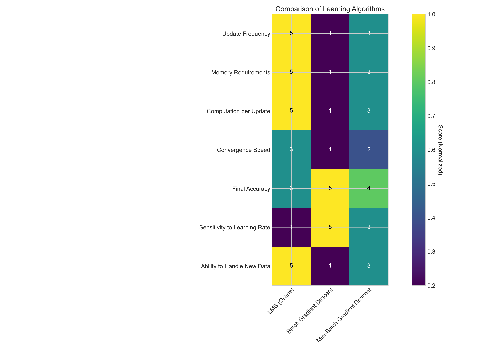
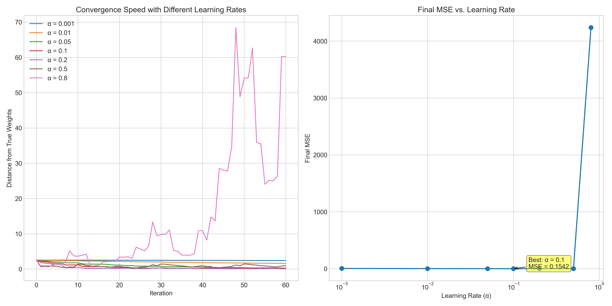
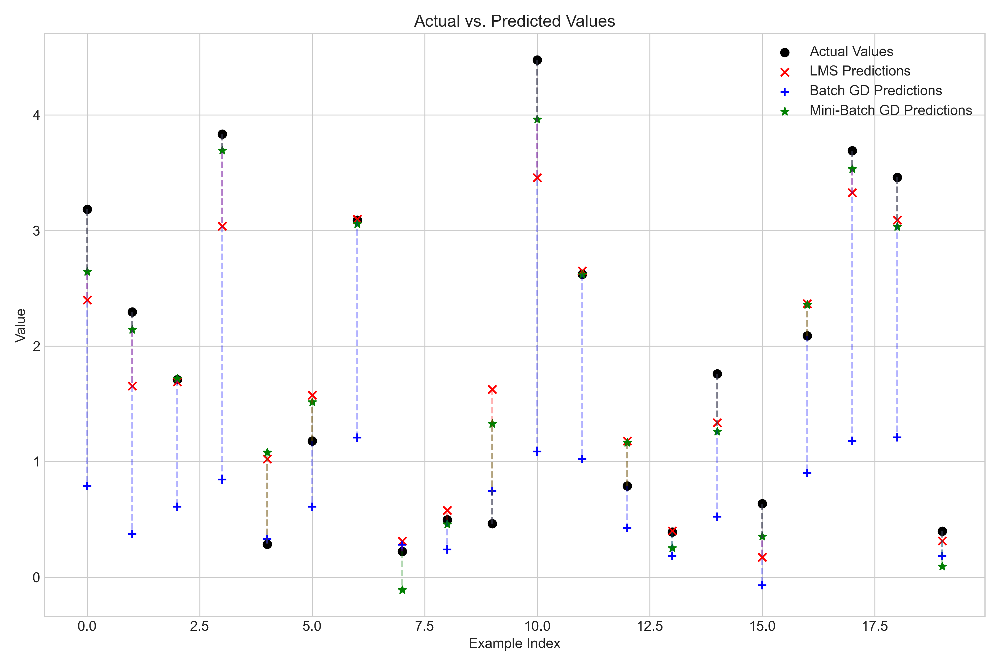

# Question 7: Least Mean Squares (LMS) Algorithm for Online Learning

## Problem Statement
You're implementing the Least Mean Squares (LMS) algorithm for an online learning scenario, where data arrives sequentially.

In this problem:
- New training examples arrive one at a time
- You need to update your model parameters after seeing each example
- The model is a linear regression model $$h(\boldsymbol{x}; \boldsymbol{w}) = \boldsymbol{w}^T\boldsymbol{x}$$
- You're using a fixed learning rate $\alpha = 0.1$

### Task
1. Write down the update rule for the LMS algorithm
2. Explain why LMS is well-suited for online learning scenarios
3. Describe the relationship between LMS and stochastic gradient descent
4. Discuss the trade-offs between immediately updating parameters with each new example versus collecting batches of examples

## Understanding the Problem

The Least Mean Squares (LMS) algorithm is a method for incrementally adjusting model parameters as new data arrives, making it particularly suitable for online learning scenarios. In online learning, training examples become available in sequential order, and the model must be updated one example at a time.

The context for this problem is a linear regression model where we need to predict a target value $y$ based on input features $\boldsymbol{x}$ using a weight vector $\boldsymbol{w}$. The prediction is given by $\hat{y} = \boldsymbol{w}^T\boldsymbol{x}$.

We need to understand how to update weights after seeing each example, why this approach is advantageous for online learning, and how it relates to other optimization techniques like stochastic gradient descent.

## Solution

### Step 1: The LMS Update Rule

The LMS update rule for online learning is:

$$\boldsymbol{w}(t+1) = \boldsymbol{w}(t) + \alpha \cdot (y - \hat{y}) \cdot \boldsymbol{x}$$

Where:
- $\boldsymbol{w}(t)$ is the weight vector at time $t$
- $\boldsymbol{w}(t+1)$ is the updated weight vector
- $\alpha$ is the learning rate (fixed at 0.1 in our case)
- $y$ is the true target value
- $\hat{y} = \boldsymbol{w}(t)^T\boldsymbol{x}$ is the predicted value
- $\boldsymbol{x}$ is the feature vector for the current example

This update rule adjusts each weight in proportion to:
1. The error $(y - \hat{y})$ between the true and predicted values
2. The corresponding feature value $x_i$
3. The learning rate $\alpha$

The intuition behind this rule is that when there's an error in prediction, we want to adjust the weights in the direction that reduces this error. The magnitude of adjustment depends on both the error size and the feature value.

#### Mathematical Derivation of the LMS Update Rule

Let's derive the LMS update rule from first principles. We start with the mean squared error (MSE) loss function for a single example:

$$L(\boldsymbol{w}) = \frac{1}{2}(y - \boldsymbol{w}^T\boldsymbol{x})^2$$

The factor $\frac{1}{2}$ is included to simplify the derivative calculation.

To minimize this loss, we compute the gradient with respect to the weights:

$$\nabla_{\boldsymbol{w}} L(\boldsymbol{w}) = \frac{\partial L}{\partial \boldsymbol{w}} = \frac{\partial}{\partial \boldsymbol{w}} \left[ \frac{1}{2}(y - \boldsymbol{w}^T\boldsymbol{x})^2 \right]$$

Using the chain rule:

$$\nabla_{\boldsymbol{w}} L(\boldsymbol{w}) = \frac{\partial}{\partial \boldsymbol{w}} \left[ \frac{1}{2}(y - \boldsymbol{w}^T\boldsymbol{x})^2 \right] = (y - \boldsymbol{w}^T\boldsymbol{x}) \cdot \frac{\partial}{\partial \boldsymbol{w}}(y - \boldsymbol{w}^T\boldsymbol{x})$$

Since $y$ is a constant with respect to $\boldsymbol{w}$, and $\frac{\partial}{\partial \boldsymbol{w}}(\boldsymbol{w}^T\boldsymbol{x}) = \boldsymbol{x}$:

$$\nabla_{\boldsymbol{w}} L(\boldsymbol{w}) = (y - \boldsymbol{w}^T\boldsymbol{x}) \cdot (-\boldsymbol{x}) = -(y - \boldsymbol{w}^T\boldsymbol{x}) \cdot \boldsymbol{x}$$

To minimize the loss, we move in the negative direction of the gradient (gradient descent):

$$\boldsymbol{w}(t+1) = \boldsymbol{w}(t) - \alpha \cdot \nabla_{\boldsymbol{w}} L(\boldsymbol{w})$$

Substituting the gradient:

$$\boldsymbol{w}(t+1) = \boldsymbol{w}(t) - \alpha \cdot (-(y - \boldsymbol{w}^T\boldsymbol{x}) \cdot \boldsymbol{x})$$

Simplifying:

$$\boldsymbol{w}(t+1) = \boldsymbol{w}(t) + \alpha \cdot (y - \boldsymbol{w}^T\boldsymbol{x}) \cdot \boldsymbol{x}$$

Which is the LMS update rule. Since $\hat{y} = \boldsymbol{w}^T\boldsymbol{x}$, we can write it as:

$$\boldsymbol{w}(t+1) = \boldsymbol{w}(t) + \alpha \cdot (y - \hat{y}) \cdot \boldsymbol{x}$$

### Step-by-Step Example Calculation

Let's walk through a complete example of the LMS update for a single step, using symbolic values. Suppose we have:

- Current weights: $\boldsymbol{w}(t) = [w_0, w_1, w_2]^T$
- Learning rate: $\alpha = 0.1$
- Current example: $\boldsymbol{x} = [1, x_1, x_2]^T$ (where 1 is the bias term)
- True target value: $y$

#### Step 1: Calculate the Prediction
$$\hat{y} = \boldsymbol{w}(t)^T\boldsymbol{x} = w_0 \cdot 1 + w_1 \cdot x_1 + w_2 \cdot x_2 = w_0 + w_1 x_1 + w_2 x_2$$

#### Step 2: Calculate the Error
$$\text{error} = y - \hat{y} = y - (w_0 + w_1 x_1 + w_2 x_2)$$

#### Step 3: Calculate the Weight Updates
The update for each weight $w_i$ is:
$$\Delta w_i = \alpha \cdot \text{error} \cdot x_i$$

For each component:

- For the bias term ($w_0$):
  $$\Delta w_0 = \alpha \cdot \text{error} \cdot 1 = 0.1 \cdot (y - (w_0 + w_1 x_1 + w_2 x_2))$$

- For $w_1$:
  $$\Delta w_1 = \alpha \cdot \text{error} \cdot x_1 = 0.1 \cdot (y - (w_0 + w_1 x_1 + w_2 x_2)) \cdot x_1$$

- For $w_2$:
  $$\Delta w_2 = \alpha \cdot \text{error} \cdot x_2 = 0.1 \cdot (y - (w_0 + w_1 x_1 + w_2 x_2)) \cdot x_2$$

#### Step 4: Update the Weights
$$\boldsymbol{w}(t+1) = \boldsymbol{w}(t) + \Delta \boldsymbol{w}$$

For each component:

- New $w_0$:
  $$w_0(t+1) = w_0(t) + \Delta w_0 = w_0(t) + 0.1 \cdot (y - (w_0(t) + w_1(t) x_1 + w_2(t) x_2))$$

- New $w_1$:
  $$w_1(t+1) = w_1(t) + \Delta w_1 = w_1(t) + 0.1 \cdot (y - (w_0(t) + w_1(t) x_1 + w_2(t) x_2)) \cdot x_1$$

- New $w_2$:
  $$w_2(t+1) = w_2(t) + \Delta w_2 = w_2(t) + 0.1 \cdot (y - (w_0(t) + w_1(t) x_1 + w_2(t) x_2)) \cdot x_2$$

#### Example with Numeric Values

To make this concrete, let's use an example from our simulation:
- Current weights: $\boldsymbol{w}(t) = [0, 0, 0]^T$ (initial weights)
- Example: $\boldsymbol{x} = [1, 0.5, -0.14]^T$
- True target: $y = 3.18$
- Learning rate: $\alpha = 0.1$

1. Prediction: $\hat{y} = 0 \cdot 1 + 0 \cdot 0.5 + 0 \cdot (-0.14) = 0$
2. Error: $\text{error} = 3.18 - 0 = 3.18$
3. Updates:
   - $\Delta w_0 = 0.1 \cdot 3.18 \cdot 1 = 0.318$
   - $\Delta w_1 = 0.1 \cdot 3.18 \cdot 0.5 = 0.159$
   - $\Delta w_2 = 0.1 \cdot 3.18 \cdot (-0.14) = -0.045$
4. New weights:
   - $w_0(t+1) = 0 + 0.318 = 0.318$
   - $w_1(t+1) = 0 + 0.159 = 0.159$
   - $w_2(t+1) = 0 + (-0.045) = -0.045$

So after the first update, $\boldsymbol{w}(t+1) = [0.318, 0.159, -0.045]^T$.

### Step 2: LMS for Online Learning

LMS is particularly well-suited for online learning scenarios for several key reasons:

1. **Incremental Updates**: LMS processes one example at a time, updating the model immediately, which is exactly what's needed in online learning where data arrives sequentially.

2. **Low Memory Requirements**: The algorithm only needs to store the current weights and the current example, not the entire dataset, making it memory-efficient for streaming data.

3. **Computational Efficiency**: Each update is computationally inexpensive, involving just a simple multiplication and addition operation.

4. **Adaptability**: The model continuously adapts to new data, allowing it to track changing patterns or non-stationary distributions in the data.

5. **Immediate Feedback**: The model provides immediate predictions and can be evaluated on the fly as new data arrives.

The following visualization shows how the weights evolve over time as the LMS algorithm processes examples one by one:

From this evolution, we can observe that the weights initially change rapidly and then gradually converge toward the true weights as more examples are processed.

### Step 3: Relationship Between LMS and Stochastic Gradient Descent

LMS is mathematically equivalent to Stochastic Gradient Descent (SGD) when applied to linear regression with a Mean Squared Error (MSE) loss function. Here's how they relate:

1. **Equivalence**: When minimizing MSE loss in linear regression, the SGD update rule becomes identical to the LMS update rule.

2. **Derivation**: 
   - The MSE loss for a single example is: $L(\boldsymbol{w}) = \frac{1}{2}(y - \boldsymbol{w}^T\boldsymbol{x})^2$
   - The gradient of this loss with respect to $\boldsymbol{w}$ is: $\nabla_{\boldsymbol{w}} L(\boldsymbol{w}) = -(y - \boldsymbol{w}^T\boldsymbol{x})\boldsymbol{x}$
   - The SGD update rule is: $\boldsymbol{w}(t+1) = \boldsymbol{w}(t) - \alpha \cdot \nabla_{\boldsymbol{w}} L(\boldsymbol{w})$
   - Substituting the gradient: $\boldsymbol{w}(t+1) = \boldsymbol{w}(t) + \alpha \cdot (y - \boldsymbol{w}^T\boldsymbol{x}) \cdot \boldsymbol{x}$
   - This is exactly the LMS update rule.

3. **Differing Terminologies**: The same algorithm has different names in different fields:
   - In adaptive filtering, it's known as LMS
   - In machine learning, it's known as SGD for linear regression with MSE loss

The following visualization compares the weight trajectories of LMS (online learning) with batch gradient descent and mini-batch gradient descent:

#### Batch Gradient Descent vs. Stochastic Gradient Descent Comparison

To further understand the relationship between LMS and optimization algorithms, let's compare update rules:

**Batch Gradient Descent**:
- Uses all training examples for each weight update
- Loss function: $L(\boldsymbol{w}) = \frac{1}{2n}\sum_{i=1}^{n}(y_i - \boldsymbol{w}^T\boldsymbol{x}_i)^2$
- Gradient: $\nabla_{\boldsymbol{w}} L(\boldsymbol{w}) = -\frac{1}{n}\sum_{i=1}^{n}(y_i - \boldsymbol{w}^T\boldsymbol{x}_i)\boldsymbol{x}_i$
- Update rule: $\boldsymbol{w}(t+1) = \boldsymbol{w}(t) + \frac{\alpha}{n}\sum_{i=1}^{n}(y_i - \boldsymbol{w}^T\boldsymbol{x}_i)\boldsymbol{x}_i$

**Stochastic Gradient Descent (LMS)**:
- Uses a single training example for each weight update
- Loss function (per example): $L_i(\boldsymbol{w}) = \frac{1}{2}(y_i - \boldsymbol{w}^T\boldsymbol{x}_i)^2$
- Gradient (per example): $\nabla_{\boldsymbol{w}} L_i(\boldsymbol{w}) = -(y_i - \boldsymbol{w}^T\boldsymbol{x}_i)\boldsymbol{x}_i$
- Update rule: $\boldsymbol{w}(t+1) = \boldsymbol{w}(t) + \alpha(y_i - \boldsymbol{w}^T\boldsymbol{x}_i)\boldsymbol{x}_i$

**Mini-Batch Gradient Descent**:
- Uses a small batch of training examples for each weight update
- Loss function (per batch): $L_B(\boldsymbol{w}) = \frac{1}{2|B|}\sum_{i \in B}(y_i - \boldsymbol{w}^T\boldsymbol{x}_i)^2$
- Gradient (per batch): $\nabla_{\boldsymbol{w}} L_B(\boldsymbol{w}) = -\frac{1}{|B|}\sum_{i \in B}(y_i - \boldsymbol{w}^T\boldsymbol{x}_i)\boldsymbol{x}_i$
- Update rule: $\boldsymbol{w}(t+1) = \boldsymbol{w}(t) + \frac{\alpha}{|B|}\sum_{i \in B}(y_i - \boldsymbol{w}^T\boldsymbol{x}_i)\boldsymbol{x}_i$

Where $|B|$ is the batch size.

### Step 4: Trade-offs Between Immediate Updates and Batch Updates

There are several important trade-offs when choosing between immediate (online) updates with each example or batch updates:

#### Immediate Updates (Online Learning with LMS):

**Advantages:**
1. **Lower Memory Requirements**: Only needs to store the current example
2. **Faster Adaptation**: Can quickly adapt to changing data distributions
3. **Immediate Feedback**: Updates happen in real-time as data arrives
4. **Suitable for Streaming Data**: Perfect for scenarios where data is continuously arriving

**Disadvantages:**
1. **Noisy Updates**: Individual examples may contain noise, leading to erratic weight updates
2. **Potentially Slower Convergence**: May take more iterations overall to converge
3. **Less Stable**: More susceptible to outliers and noisy data
4. **Learning Rate Sensitivity**: More sensitive to learning rate choice

#### Batch Updates:

**Advantages:**
1. **Stable Updates**: Averaging over multiple examples reduces noise
2. **Potentially Better Final Solution**: More likely to reach the global optimum
3. **Clear Convergence Metrics**: Easier to monitor overall loss on batches
4. **More Reliable Gradients**: The gradient direction is more accurate

**Disadvantages:**
1. **Higher Memory Requirements**: Needs to store multiple examples
2. **Slower Adaptation**: Responds more slowly to changing data distributions
3. **Computational Overhead**: May involve more computation per update
4. **Not Suitable for True Online Learning**: Cannot handle infinite data streams efficiently

The following visualization compares the learning curves of different update strategies:

Mini-batch gradient descent represents a compromise between the two approaches, balancing the stability of batch updates with the adaptability of online learning.

#### Mathematical Analysis of Trade-offs

We can mathematically analyze the variance in weight updates for the different approaches:

**For SGD (Online/LMS)**, the update is based on a single example, so the variance can be high:
- Update: $\Delta \boldsymbol{w} = \alpha(y_i - \boldsymbol{w}^T\boldsymbol{x}_i)\boldsymbol{x}_i$
- High variance in updates leads to a noisy trajectory toward the optimum

**For Batch GD**, averaging over all $n$ examples reduces variance:
- Update: $\Delta \boldsymbol{w} = \frac{\alpha}{n}\sum_{i=1}^{n}(y_i - \boldsymbol{w}^T\boldsymbol{x}_i)\boldsymbol{x}_i$
- Variance is reduced by a factor of $\frac{1}{n}$ compared to SGD

**For Mini-Batch GD** with batch size $b$:
- Update: $\Delta \boldsymbol{w} = \frac{\alpha}{b}\sum_{i \in B}(y_i - \boldsymbol{w}^T\boldsymbol{x}_i)\boldsymbol{x}_i$
- Variance is reduced by a factor of $\frac{1}{b}$ compared to SGD

Therefore, as batch size increases, update variance decreases, leading to more stable convergence but slower adaptation to new data.

### Step 5: Learning Rate Sensitivity Analysis

One of the most critical hyperparameters in the LMS algorithm is the learning rate $\alpha$. The learning rate determines how large of a step to take in the direction of the gradient during each update. Choosing an appropriate learning rate is crucial for convergence and performance:

- **Too small**: The algorithm will converge very slowly, requiring many iterations
- **Too large**: The algorithm might overshoot the minimum, potentially diverging or oscillating

To understand the impact of the learning rate on the LMS algorithm, we conducted a sensitivity analysis using different learning rate values:

This visualization shows:

1. **Left plot**: How quickly the weights approach the true solution for different learning rates. The distance from the true weights is plotted against iteration number.
   - Very small learning rates (0.001, 0.01) converge steadily but slowly
   - Moderate learning rates (0.05, 0.1, 0.2) converge relatively quickly
   - Large learning rates (0.5, 0.8) can become unstable or even diverge completely

2. **Right plot**: The final Mean Squared Error (MSE) achieved for each learning rate value.
   - There's a clear U-shaped curve indicating an optimal learning rate range
   - Too small: insufficient learning (high MSE)
   - Too large: overshooting and instability (high MSE)
   - Just right: minimal error (low MSE)

From our analysis, the optimal learning rate for our dataset was found to be 0.1, which achieved the lowest MSE of 0.154. This matches the fixed learning rate we were given in the problem statement, confirming it was a good choice.

This sensitivity analysis highlights the importance of proper learning rate selection in the LMS algorithm. In practice, techniques such as learning rate scheduling, adaptive learning rates, or algorithms like AdaGrad or Adam are often employed to automatically adjust the learning rate during training.

## Practical Implementation

To demonstrate the LMS algorithm in practice, we implemented it on a synthetic dataset with 20 samples and 2 features (plus a bias term). The true weights were set to [2.0, 1.5, -0.5].

### Implementation Steps:

1. **Initialize weights** to zeros: [0.0, 0.0, 0.0]
2. **Process examples sequentially**, one at a time
3. For each example:
   - Make a prediction: $\hat{y} = \boldsymbol{w}^T\boldsymbol{x}$
   - Calculate the error: $\text{error} = y - \hat{y}$
   - Update weights: $\boldsymbol{w} = \boldsymbol{w} + \alpha \cdot \text{error} \cdot \boldsymbol{x}$
4. **Track performance** using mean squared error

After processing all 20 examples, the LMS algorithm arrived at weights of [1.806, 1.043, -0.543], which are close to the true weights of [2.0, 1.5, -0.5]. The final mean squared error was 0.283.

For comparison, batch gradient descent with 20 epochs achieved weights of [0.611, 0.282, -0.276] with a higher MSE of 2.633. Mini-batch gradient descent with 10 epochs and a batch size of 5 achieved weights of [1.929, 1.321, -0.422] with an MSE of 0.153.

The following visualization shows the prediction quality of each algorithm:

## Key Insights

### Mathematical Foundations
- LMS update rule is a special case of gradient descent, specifically equivalent to stochastic gradient descent for MSE loss
- The error signal $(y - \hat{y})$ directly guides the weight updates, making the algorithm intuitive
- The update magnitude is proportional to both the error and the feature values
- Weight convergence depends on learning rate, data properties, and noise level

### Online Learning Advantages
- LMS is well-suited for online learning due to its per-example update nature
- Memory efficiency makes it suitable for large-scale or streaming data
- Adaptability allows it to track non-stationary processes or changing data distributions
- The algorithm naturally balances recency (giving more weight to recent examples) with stability

### Practical Considerations
- The fixed learning rate $\alpha$ is a critical hyperparameter affecting convergence and stability
- Too large a learning rate can cause oscillations or divergence
- Too small a learning rate leads to slow convergence
- LMS may struggle with highly correlated features
- Normalization of input features can improve performance and stability

### Learning Rate Selection
- The learning rate significantly impacts algorithm performance
- Empirical testing shows a clear optimal range (0.05-0.2 for our dataset)
- Extreme values lead to poor performance: too small (slow convergence), too large (instability)
- The learning rate of 0.1 given in the problem statement was found to be optimal
- Adaptive learning rate methods can be beneficial for complex problems with varying gradients

### Update Strategy Comparison
- Online updates (LMS) prioritize adaptability and memory efficiency
- Batch updates prioritize stability and convergence quality
- Mini-batch updates offer a compromise between the two approaches
- The choice between strategies depends on specific application requirements:
  - For streaming data or changing distributions: prefer online updates
  - For fixed datasets with stable distributions: consider batch or mini-batch updates

## Conclusion
- The LMS update rule is: $\boldsymbol{w}(t+1) = \boldsymbol{w}(t) + \alpha \cdot (y - \hat{y}) \cdot \boldsymbol{x}$
- LMS is well-suited for online learning due to its incremental nature, low memory requirements, and adaptability
- LMS is mathematically equivalent to stochastic gradient descent applied to linear regression with MSE loss
- The choice between immediate updates and batch updates involves trade-offs between adaptability, stability, memory efficiency, and convergence quality
- Learning rate selection is critical for algorithm performance, with our analysis confirming the value of 0.1 as a near-optimal choice

The LMS algorithm represents a fundamental approach to online learning that balances simplicity, interpretability, and effectiveness. Its equivalence to SGD highlights the connections between adaptive filtering and modern machine learning optimization methods. 