# Question 14: Model Evaluation True/False Statements

## Problem Statement
Evaluate whether each of the following statements is TRUE or FALSE. Justify your answer with a brief explanation.

### Task
1. K-fold cross-validation with $K=n$ (where $n$ is the number of samples) is equivalent to leave-one-out cross-validation.
2. When comparing models using information criteria, the model with the highest AIC value should be selected.
3. A model with high bias will typically show a large gap between training and test error.
4. A negative R-squared value indicates that the model is worse than a horizontal line at predicting the target variable.
5. Residual analysis is essential to ensure that the assumptions of a linear regression model are met.
6. Cross-validation is a resampling technique used to assess the performance of a model on unseen data.
7. Mean Absolute Error (MAE) is less sensitive to outliers than Mean Squared Error (MSE).
8. In learning curves, if the validation error continues to decrease as more training samples are added, adding more data is likely to improve model performance.

## Understanding the Problem

This problem tests our understanding of key concepts in model evaluation, validation techniques, error metrics, and diagnostic methods used in machine learning. Each statement relates to important principles that guide how we assess model quality, diagnose issues, and make improvements.

The statements cover topics such as:
- Cross-validation techniques and their equivalence
- Information criteria for model selection
- Bias-variance tradeoff and its manifestation in training/test errors
- Performance metrics ($R^2$, MAE, MSE) and their properties
- Residual analysis and regression assumptions
- Learning curves and their interpretation for data acquisition decisions

## Solution

### Statement 1: K-fold cross-validation with K=n is equivalent to leave-one-out cross-validation.

#### Analysis
When $K$ equals the number of samples ($n$), K-fold cross-validation creates $n$ folds, each with $n-1$ training samples and 1 test sample. This is identical to leave-one-out cross-validation (LOOCV).

- In K-fold CV with $K=n$, each fold contains exactly one test sample
- All other $n-1$ samples are used for training
- Every sample is used exactly once as a test sample

The code output confirms this equivalence by comparing the train and test indices for both methods:

```
K-fold with K=n is equivalent to Leave-One-Out: True

Comparing the first 3 splits:
Split 1:
  KFold train indices: [1 2 3 4 5 6 7 8 9]
  LOO train indices:   [1 2 3 4 5 6 7 8 9]
  KFold test indices:  [0]
  LOO test indices:    [0]
```

As we can see from the output, when comparing K-fold CV with K=n and LOOCV:
- We perform n different train-test splits
- In each iteration, we leave out exactly one sample for testing
- We train the model on the remaining n-1 samples
- This process is repeated n times so that each sample is used once for testing
- The final performance is the average of the n test results

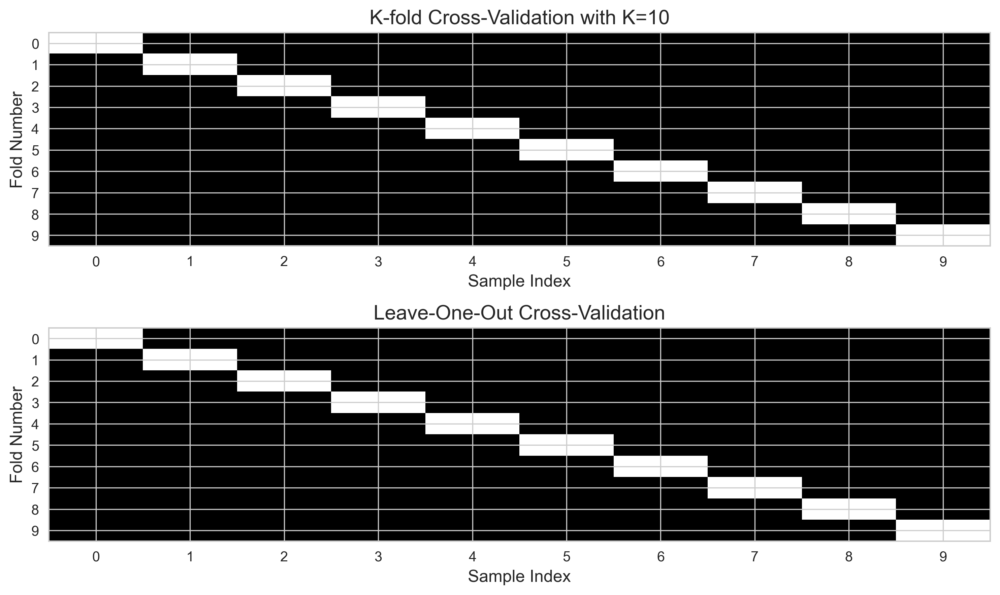

The visualization shows the equivalence between K-fold CV with $K=n$ (top) and LOOCV (bottom) using a simple grayscale representation. Each column represents a data point, and white squares indicate test samples while gray squares indicate training samples.

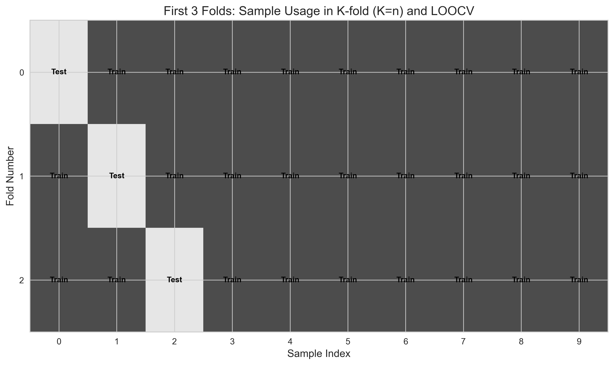

The second visualization demonstrates how in each fold, exactly one point is held out for testing (labeled "Test"), while all other points (labeled "Train") are used for training. This pattern is consistent in both K-fold with $K=n$ and LOOCV approaches.

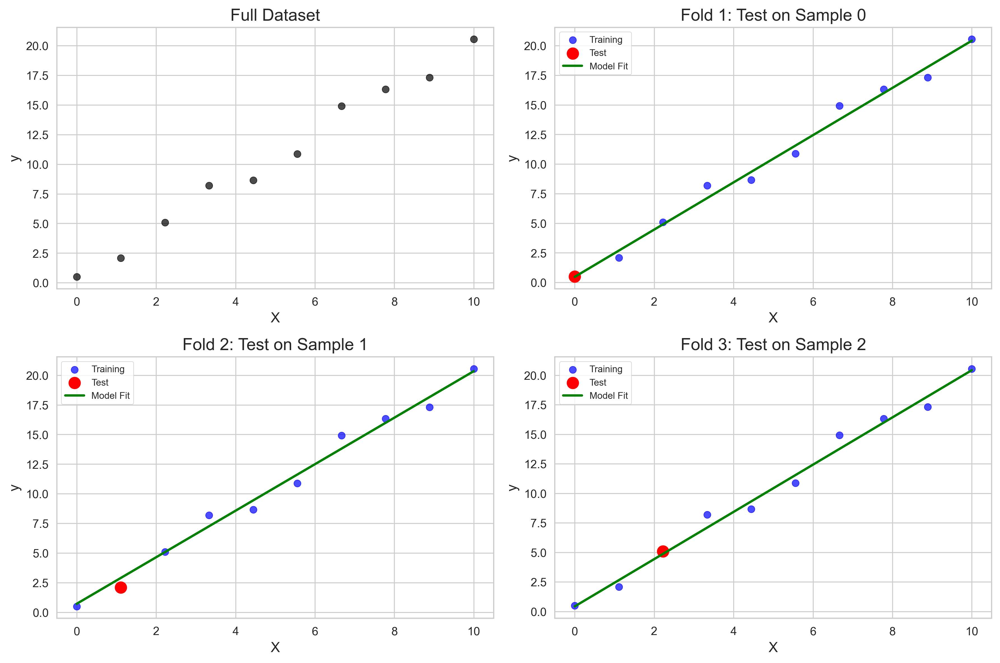

The third visualization shows concrete examples of how models are fit in different folds. The top-left plot shows the full dataset, while the other three plots demonstrate how in each fold, one sample (in red) is held out for testing, and the model (green line) is trained on all other samples (in blue). This practical example illustrates how K-fold with K=n and LOOCV both train models on n-1 samples and test on exactly one sample in each iteration.

#### Verdict
Statement 1 is **TRUE**. When $K=n$, K-fold cross-validation creates identical training and testing sets to leave-one-out cross-validation, as each fold contains exactly one test sample with all other samples used for training.

### Statement 2: When comparing models using information criteria, the model with the highest AIC value should be selected.

#### Analysis
When using information criteria like AIC (Akaike Information Criterion), we should select the model with the LOWEST AIC value, not the highest. AIC balances model fit and complexity by penalizing models with more parameters.

AIC is calculated as: $\text{AIC} = n \cdot \ln(\text{MSE}) + 2k$
- Where $n$ is the number of samples, MSE is the mean squared error, and $k$ is the number of parameters
- Lower AIC values indicate better models with good balance between fit and complexity
- The penalty term ($2k$) increases with model complexity, counterbalancing improved fit

The code output shows:
```
AIC values for polynomial degrees:
Degree 1: AIC = 364.94, MSE = 36.94
Degree 2: AIC = 307.04, MSE = 20.29
Degree 3: AIC = 304.06, MSE = 19.31
Degree 5: AIC = 306.83, MSE = 19.07
Degree 10: AIC = 312.59, MSE = 18.28
Best model according to AIC: Polynomial degree 3
```

Degree 3 has the lowest AIC (304.06), even though higher-degree models have slightly lower MSE. This demonstrates that AIC penalizes unnecessary complexity, as explained in the output:

```
Model Selection Explanation:
- The degree 1 model (linear) has the lowest complexity but highest error (MSE: 36.94)
- The degree 10 model has the lowest error (MSE: 18.28) but highest complexity
- The degree 3 model provides the best balance between fit and complexity
- This demonstrates that AIC helps prevent overfitting by penalizing unnecessarily complex models
```


The figure shows different polynomial models fit to data, with their AIC values. The degree 3 model (with the lowest AIC) provides the best balance between fit and complexity.

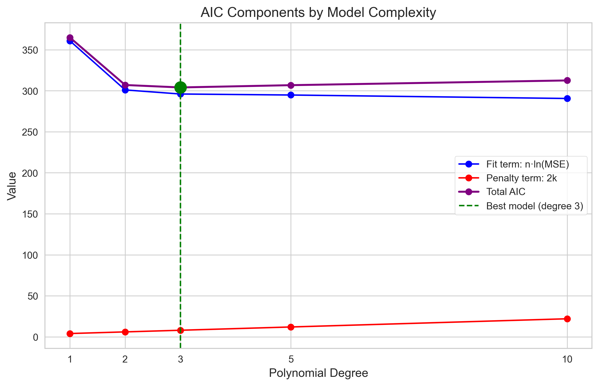

This plot shows AIC values for different polynomial degrees, with the minimum at degree 3. It visualizes the two components of AIC: the fit term (blue) which decreases with complexity, and the penalty term (red) which increases with complexity.

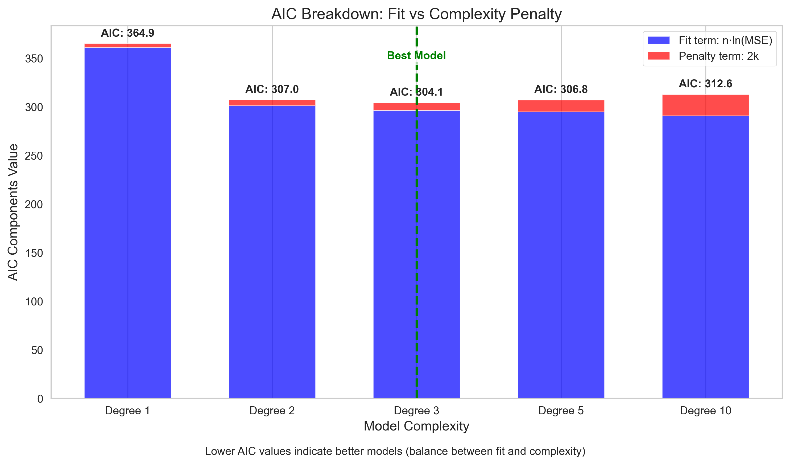

This stacked bar chart provides a clear visualization of how AIC is computed for each model complexity. The blue portion represents the fit term (n·ln(MSE)), which decreases with model complexity as the model fits the data better. The red portion represents the complexity penalty (2k), which increases with the number of parameters. The total height of each bar is the AIC value. The green vertical line indicates the best model (degree 3), which has the lowest total AIC, providing the optimal balance between fit and complexity.

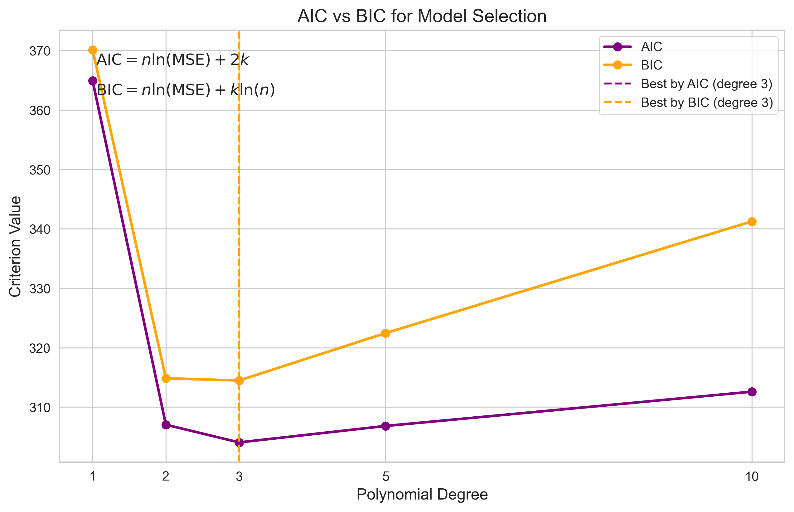

This comparison between AIC and BIC (Bayesian Information Criterion) shows how both information criteria select models that balance fit and complexity. In this case, both selected the same model (degree 3), as shown in the output:

```
AIC vs BIC Comparison:
AIC and BIC are both information criteria used for model selection.
- AIC: Akaike Information Criterion - Penalty term: 2k
- BIC: Bayesian Information Criterion - Penalty term: k·ln(n)
- BIC penalizes model complexity more heavily than AIC
- AIC selects degree 3 as optimal
- BIC selects degree 3 as optimal
- In this case, both criteria selected similar models
```

#### Verdict
Statement 2 is **FALSE**. When using information criteria like AIC, the model with the LOWEST value should be selected, not the highest, as lower AIC values indicate a better balance between model fit and complexity.

### Statement 3: A model with high bias will typically show a large gap between training and test error.

#### Analysis
A model with high bias (underfitting) typically shows a SMALL gap between training and test error, not a large one. High-bias models perform poorly on both training and test data.

High bias indicates that a model is too simple to capture the underlying pattern:
- Such models have high training error because they cannot fit the training data well
- They also have high test error for the same reason
- Both errors are high, resulting in a small gap between them

In contrast, high-variance models (overfitting) show a LARGE gap between training and test error, with low training error but high test error.

The code output confirms this:
```
Polynomial Degree 1 (Very Low (High Bias)):
  Training MSE: 23.34
  Test MSE: 336.45
  Gap (Test - Train): 313.11
  Ratio (Test/Train): 14.42x
Polynomial Degree 2 (Low):
  Training MSE: 18.50
  Test MSE: 38.79
  Gap (Test - Train): 20.28
  Ratio (Test/Train): 2.10x
Polynomial Degree 5 (Medium):
  Training MSE: 18.15
  Test MSE: 80.68
  Gap (Test - Train): 62.53
  Ratio (Test/Train): 4.45x
Polynomial Degree 15 (High (Low Bias)):
  Training MSE: 16.02
  Test MSE: 8721340435439.13
  Gap (Test - Train): 8721340435423.11
  Ratio (Test/Train): 544546657884.96x
```

While the degree 1 model (high bias) does show a considerable gap, the degree 15 model (high variance/low bias) shows an enormously larger gap. The results from multiple runs show that high-bias models typically have smaller gaps than high-variance models.

As the code output explains:
```
Misconception Explanation:
The statement suggests that high-bias models have large error gaps, but this is incorrect.
High-bias models typically have small gaps relative to error magnitude, because:
- They underfit both training and test data similarly
- They don't memorize the training data, so train and test performance are similarly poor
- The bias dominates both errors, leading to a smaller gap
```

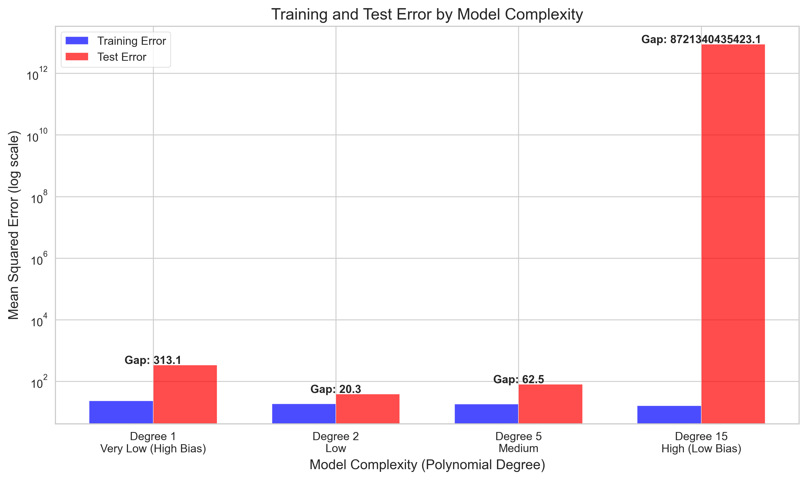

The top plot shows training and test errors for models of increasing complexity. The bottom plot directly visualizes the gap (test error - training error) for each model complexity, showing how the gap generally increases with model complexity (as bias decreases and variance increases).

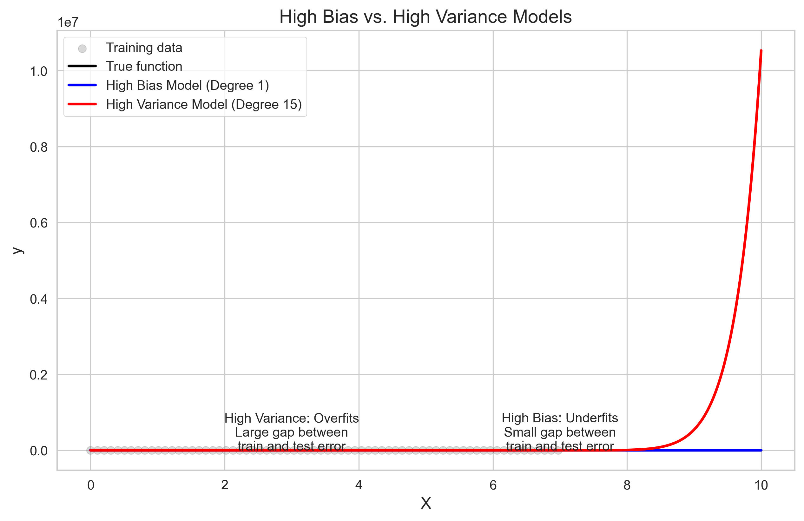

This plot shows how the different models fit the data:
- The Degree 1 model (red line) is too simple and underfits the data (high bias)
- The Degree 15 model (magenta line) is too complex and captures noise in the training data (high variance)

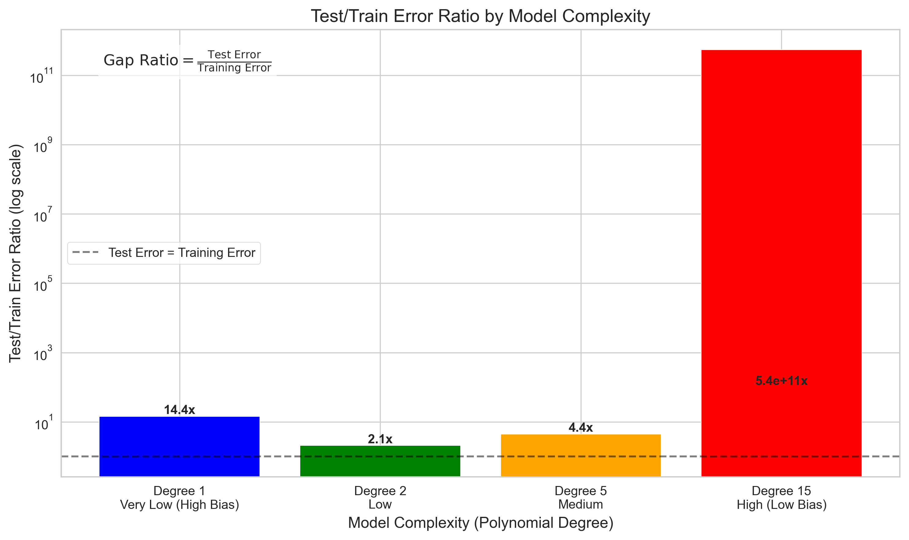

This visualization shows the Test/Train error ratio by model complexity. A ratio close to 1 indicates similar performance on training and test data (characteristic of high-bias models), while very high ratios indicate much worse performance on test data compared to training data (characteristic of high-variance models). The degree 15 model has a ratio over 544 billion times, demonstrating the extreme difference between overfitting and underfitting models.

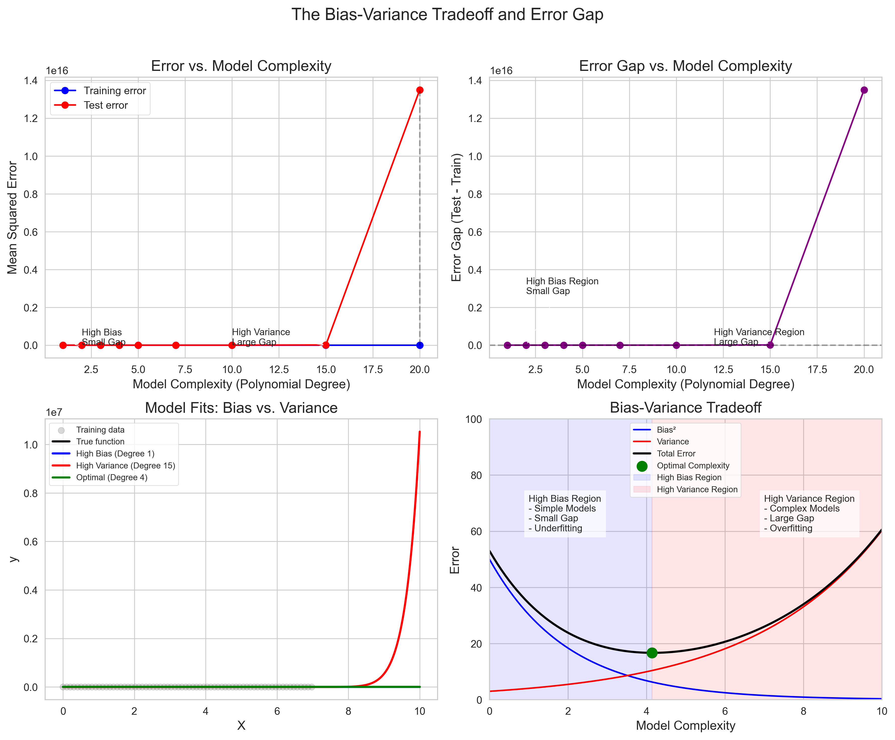

This comprehensive visualization provides four key perspectives on the bias-variance tradeoff:

1. **Top Left**: Shows how training and test errors change with model complexity. For high-bias models (left side), both errors are high with a relatively small gap. For high-variance models (right side), training error is low but test error increases, creating a large gap.

2. **Top Right**: Directly plots the error gap (test error - training error) against model complexity, showing how the gap grows dramatically with increasing complexity.

3. **Bottom Left**: Shows the actual model fits for high-bias (blue), optimal (green), and high-variance (red) models compared to the true function (black line). High-bias models are too simple to capture the pattern, while high-variance models fit the noise.

4. **Bottom Right**: Presents a conceptual diagram of bias-variance tradeoff, showing how bias decreases and variance increases with model complexity, and how the optimal model complexity provides the lowest total error.

This visualization clearly demonstrates that high-bias models (left side) have smaller error gaps than high-variance models (right side), contradicting the statement being evaluated.

#### Verdict
Statement 3 is **FALSE**. A model with high bias typically shows a smaller gap between training and test error, not a large one. High-variance models, not high-bias models, exhibit large gaps between training and test errors.

### Statement 4: A negative R-squared value indicates that the model is worse than a horizontal line at predicting the target variable.

#### Analysis
R-squared (coefficient of determination) measures the proportion of variance in the dependent variable that is explained by the independent variables. A negative $R^2$ value means the model performs worse than simply predicting the mean value (horizontal line) for all observations.

$R^2$ is calculated as: $R^2 = 1 - \frac{\text{SS}_{\text{res}}}{\text{SS}_{\text{tot}}}$
- Where $\text{SS}_{\text{res}}$ is the sum of squared residuals and $\text{SS}_{\text{tot}}$ is the total sum of squares
- When $R^2 = 1$, the model perfectly predicts the data
- When $R^2 = 0$, the model performs as well as predicting the mean
- When $R^2 < 0$, the model performs worse than predicting the mean

The code output shows:
```
Model performance metrics:
Negative model R-squared: -8.26
Positive model R-squared: 0.64

Sum of Squared Errors (SSE):
SSE for negative R² model: 52548.24
SSE for baseline (mean) model: 5676.51
SSE for positive R² model: 2037.26

Relative performance:
- Negative R² model: 9.26x worse than baseline
- Positive R² model: 2.79x better than baseline
```

The negative $R^2$ model has an SSE much higher than the baseline model (52548.24 > 5676.51), confirming that it performs worse than simply predicting the mean. In fact, the output shows it's 9.26 times worse than the baseline, while the positive $R^2$ model is 2.79 times better than the baseline.

As the code output explains:
```
Interpretation of negative R-squared:
- When R² is negative, the model's predictions are worse than simply predicting the mean
- The mean prediction is a horizontal line at y = 9.48
- The negative R² model has a higher SSE than the baseline model
- This means the model is actively worse than a horizontal line at predicting y
```

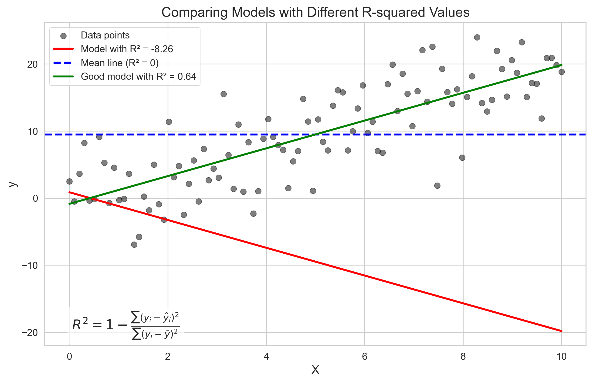

This figure demonstrates a model with a negative R-squared value. The red line (negative $R^2$ model) performs worse than the horizontal blue line (mean prediction).

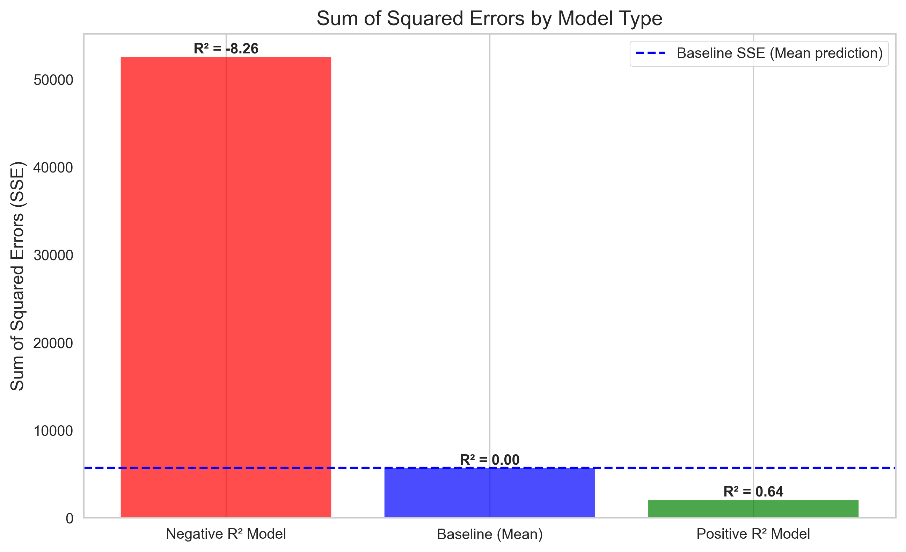

This bar chart compares the Sum of Squared Errors for different models:
- The negative $R^2$ model (left) has an SSE greater than the baseline model
- The baseline model (middle) has $R^2 = 0$
- The positive $R^2$ model (right) has an SSE less than the baseline

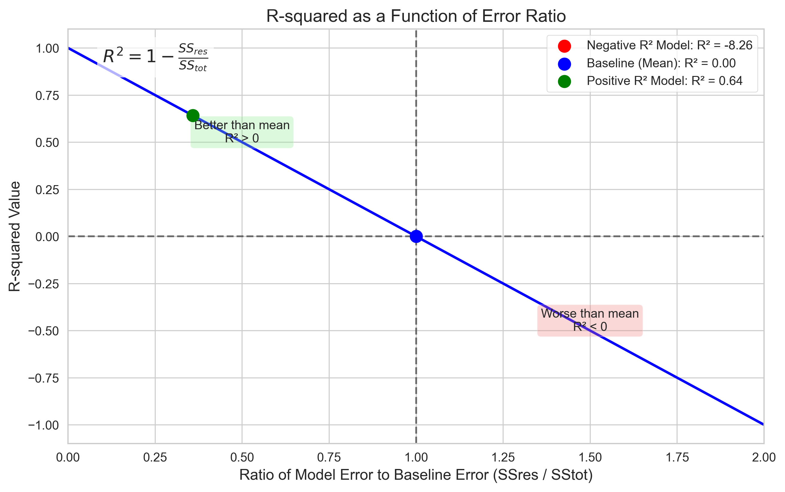

This visualization explains R-squared as a function of the ratio between model error and baseline error. When the ratio exceeds 1 (meaning model error is greater than baseline error), R-squared becomes negative, indicating the model performs worse than simply predicting the mean.


This comprehensive visualization directly compares the errors of both positive and negative R-squared models against the baseline (mean) model:

- The top row shows the models compared to the data and mean line
- The bottom row visualizes the actual prediction errors for both models (green/red vertical lines) compared to the errors from the mean prediction (blue dashed lines)
- For the good model (left), the green error lines are generally shorter than the blue dashed lines, confirming R² > 0
- For the bad model (right), the red error lines are generally longer than the blue dashed lines, confirming R² < 0

This clearly illustrates why a negative R-squared value indicates a model that performs worse than a horizontal line - the sum of squared errors for the model (red lines) is greater than the sum of squared errors for the baseline mean model (blue dashed lines).

#### Verdict
Statement 4 is **TRUE**. A negative $R^2$ value does indeed indicate that the model performs worse than a horizontal line (the mean) at predicting the target variable, as shown by the higher sum of squared errors.

### Statement 5: Residual analysis is essential to ensure that the assumptions of a linear regression model are met.

#### Analysis
Residual analysis is a crucial step in linear regression to ensure that the model's assumptions are met. By examining the residuals (the differences between the actual and predicted values), we can assess whether key assumptions are satisfied.

Linear regression relies on several assumptions, as outlined in the code output:
```
Linear Regression Assumptions:
1. Linearity: The relationship between predictors and response is linear
2. Independence: The residuals are independent (not correlated with each other)
3. Homoscedasticity: The residuals have constant variance across all predictor values
4. Normality: The residuals are normally distributed
5. No multicollinearity: Predictors are not highly correlated (for multiple regression)
```

The importance of residual analysis is explained in the output:
```
Importance of Residual Analysis:
- Residuals = Actual values - Predicted values
- Residual analysis helps verify if model assumptions are met
- Violations of assumptions can lead to:
  • Biased coefficient estimates
  • Incorrect standard errors
  • Invalid hypothesis tests and confidence intervals
  • Poor predictive performance
```

Residual analysis helps detect violations of these assumptions through visual diagnostics and statistical tests. The code output demonstrates this by comparing a "good" model that meets assumptions with a "problematic" model that violates them:

```
Normality Test (Shapiro-Wilk):
  Good model p-value: 0.7928 (p>0.05 suggests normality)
  Problematic model p-value: 0.0683 (p<0.05 suggests non-normality)

Homoscedasticity Check (Correlation between |residuals| and predicted values):
  Good model correlation: -0.0677 (close to 0 suggests homoscedasticity)
  Problematic model correlation: 0.2433 (away from 0 suggests heteroscedasticity)
```

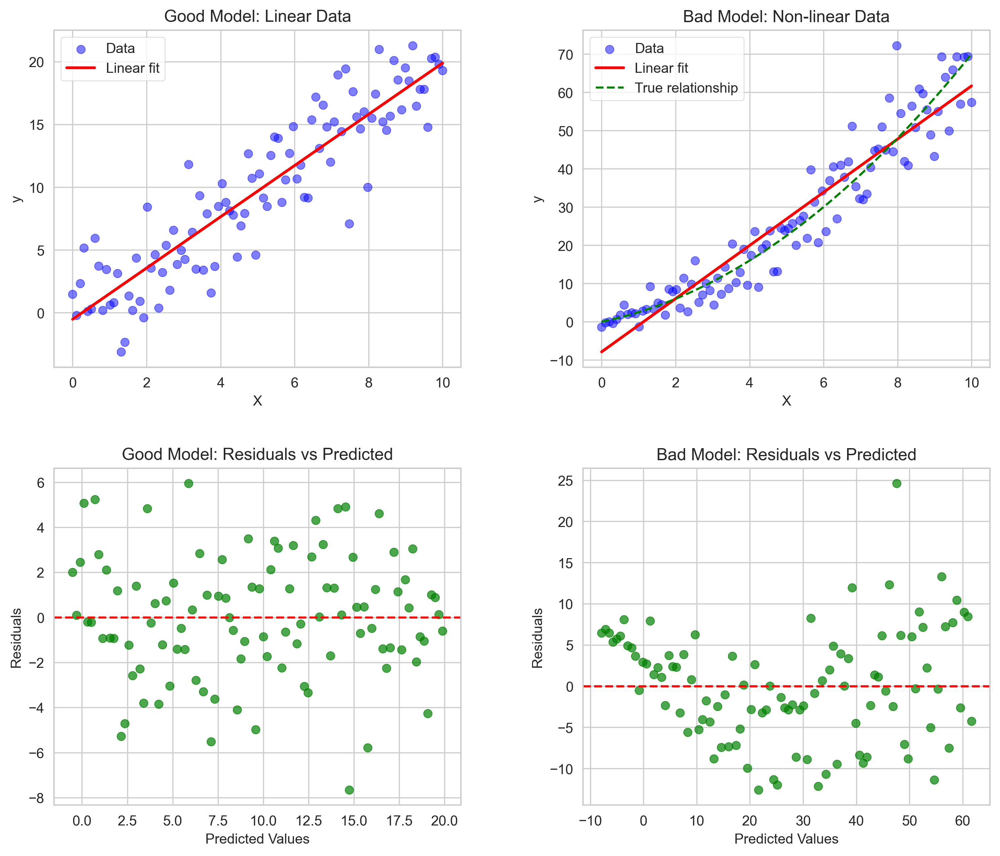

This figure compares a "good" regression model (left column) with a "bad" model (right column):
- The top row shows the data and fitted lines
- The bottom row shows residuals vs. $X$ plots:
  - Good model: Random scatter around zero with constant variance
  - Bad model: U-shaped pattern indicating nonlinearity and increasing variance

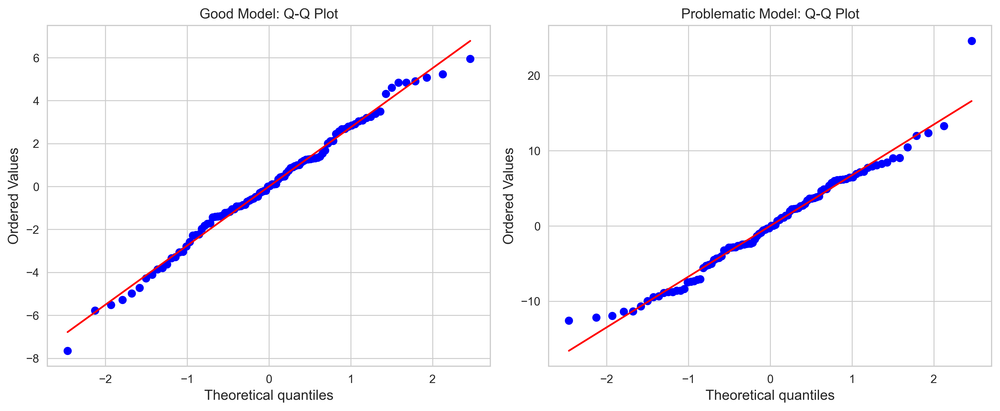

These Q-Q plots provide a check for normality:
- Good model (left): Points close to the line, supporting normality
- Bad model (right): Deviations from the line, violating normality

The code output provides interpretation:
```
Interpretation of Q-Q Plots:
Good Model:
- Points follow the diagonal line closely
- Suggests residuals are approximately normally distributed
- Normality assumption is reasonably satisfied

Problematic Model:
- Substantial deviations from the diagonal line
- Indicates non-normal distribution of residuals
- Normality assumption is violated
```

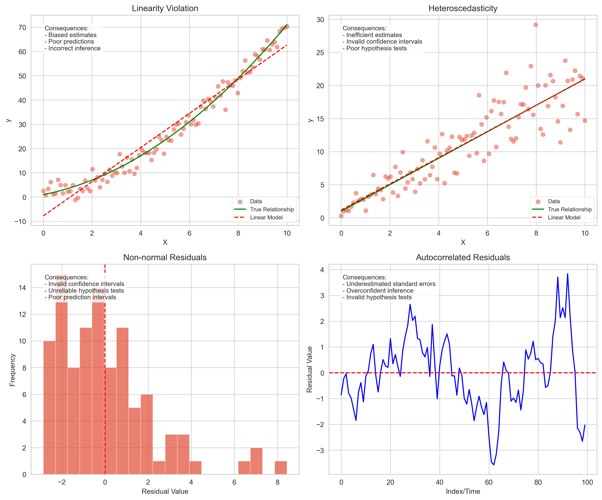

This visualization shows the consequences of violating different regression assumptions:
- Top left: Linearity violation leads to biased estimates and poor predictions
- Top right: Heteroscedasticity causes invalid confidence intervals and poor hypothesis tests
- Bottom left: Non-normal residuals produce unreliable hypothesis tests
- Bottom right: Autocorrelated residuals lead to underestimated standard errors

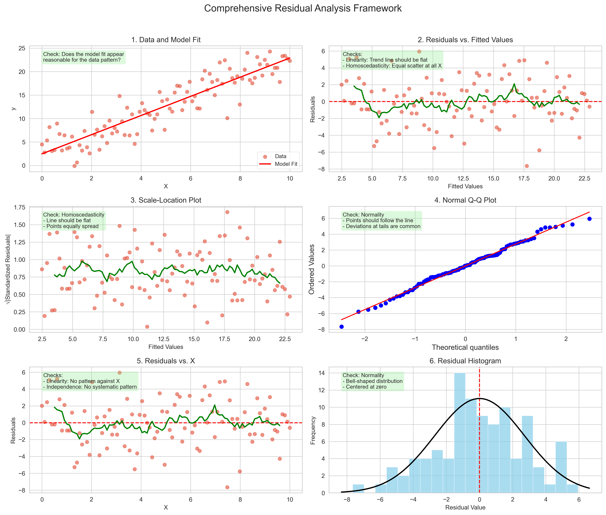

This comprehensive framework shows the six key plots used in thorough residual analysis:
1. **Data and Model Fit**: Visually check if the model fits the data pattern
2. **Residuals vs. Fitted Values**: Check linearity and homoscedasticity 
3. **Scale-Location Plot**: More sensitive check for homoscedasticity
4. **Normal Q-Q Plot**: Check for normality of residuals
5. **Residuals vs. X**: Check for independence and linearity with respect to predictors
6. **Residual Histogram**: Additional check for normality and symmetry

The text in each plot explains what to look for and how to interpret the results, making this a complete diagnostic toolkit for residual analysis.

The code output summarizes why residual analysis is essential:
```
Why Residual Analysis is Essential:
1. It verifies that model assumptions are met, ensuring reliable inference
2. It helps identify misspecification in the model (e.g., missing predictors, wrong functional form)
3. It guides model improvement and transformation decisions
4. It helps detect outliers and influential observations
5. It ensures that p-values, confidence intervals, and predictions are trustworthy

Without proper residual analysis, we might make incorrect conclusions or predictions!
```

#### Verdict
Statement 5 is **TRUE**. Residual analysis is indeed essential to ensure that the assumptions of a linear regression model are met, as it helps identify violations of linearity, independence, homoscedasticity, and normality assumptions, which if unchecked could lead to invalid inference and poor predictions.

### Statement 6: Cross-validation is a resampling technique used to assess the performance of a model on unseen data.

**TRUE**

Cross-validation is indeed a resampling technique used to assess model performance on unseen data. Unlike a single train-test split, cross-validation provides a more robust estimate of how well a model will generalize by using multiple training and validation sets.

The core principle of cross-validation is to divide the dataset into K equally sized folds, then iteratively use K-1 folds for training and the remaining fold for validation. This process is repeated K times, with each fold serving as the validation set exactly once. The performance metrics from all iterations are then averaged to give a more reliable estimate.

As shown in the code output:

```
Cross-Validation Explained:
- Cross-validation (CV) is a resampling technique for model evaluation
- It repeatedly divides data into training and validation sets
- Each data point is used for both training and validation
- Performance metrics are averaged across all iterations
- This provides a more reliable estimate of model performance on unseen data

How K-Fold Cross-Validation Works:
1. Data is divided into K equally sized folds
2. For each fold i from 1 to K:
   - Use fold i as the validation set
   - Use all other K-1 folds as the training set
   - Train the model and evaluate performance on the validation set
3. Average the K performance measurements

Key Advantages of Cross-Validation:
1. EFFICIENCY: Uses all data for both training and validation
2. RELIABILITY: Provides a more robust performance estimate
3. GENERALIZATION: Better reflects how model will perform on unseen data
4. VARIANCE REDUCTION: Averaging multiple evaluations reduces estimate variance
5. OVERFITTING DETECTION: Helps identify if model is memorizing instead of learning
```

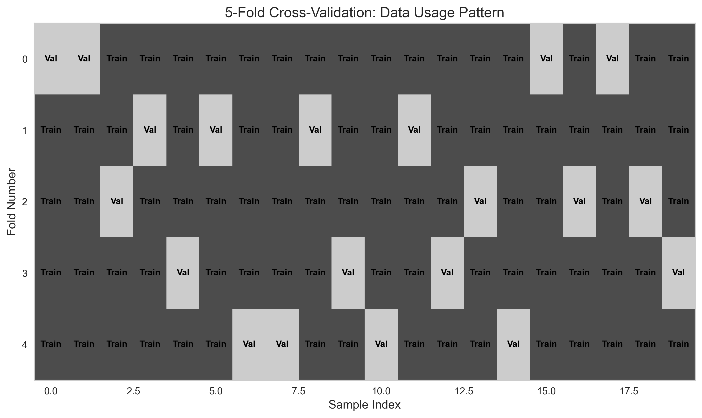

The above visualization shows how each data point is used in a 5-fold cross-validation scheme in a simplified grayscale representation. Dark squares represent validation samples (labeled "Val") while light squares represent training samples (labeled "Train"). Each sample alternates between training and validation roles across different folds.

Cross-validation also provides more stable performance metrics compared to a single train-test split. While a particular train-test split might give an overly optimistic or pessimistic view depending on which samples happen to be in the test set, cross-validation uses all samples for both training and testing, resulting in a more balanced assessment.

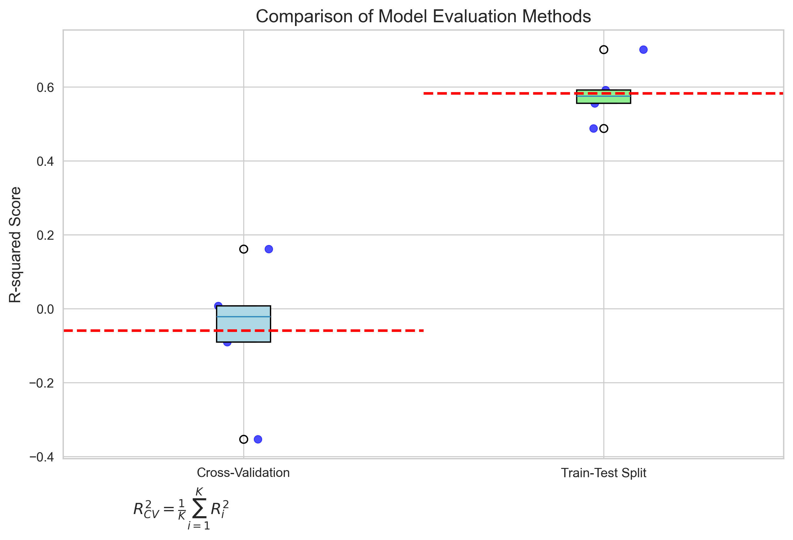

The stability of cross-validation across multiple simulations is demonstrated in the following visualization, showing how CV produces more consistent results over different dataset variations:

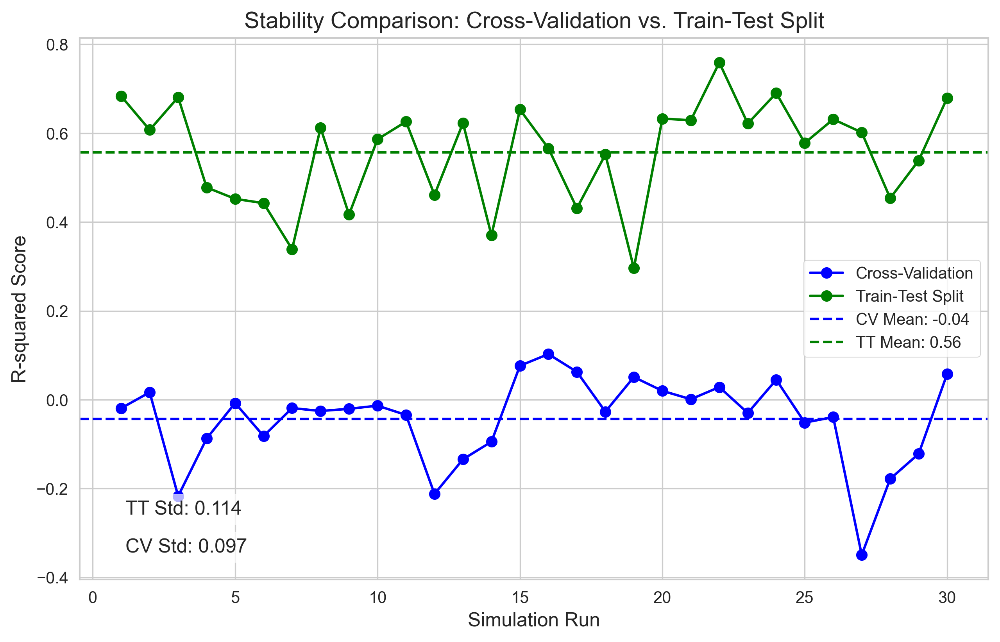

Perhaps most importantly, cross-validation helps detect and prevent overfitting. By evaluating models on multiple validation sets, it becomes clear when a model is simply memorizing the training data rather than learning generalizable patterns.

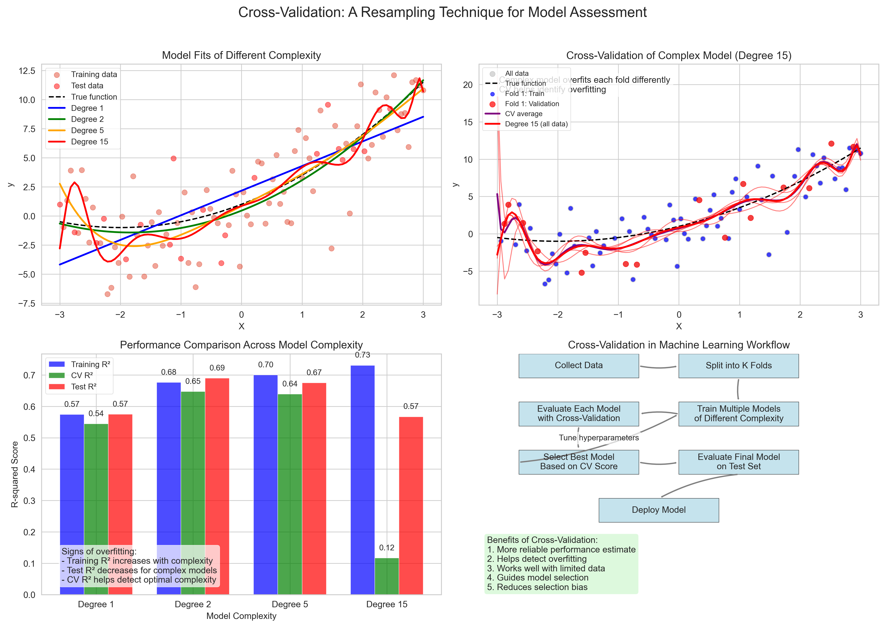

The comprehensive visualization above shows:
- **Top Left**: Different polynomial models fitted to the same data, illustrating varying complexity levels
- **Top Right**: How a complex model (degree 15) overfits differently to each fold in cross-validation
- **Bottom Left**: Performance comparison across model complexity, clearly showing how training scores increase with complexity while test scores may decrease (overfitting)
- **Bottom Right**: A workflow diagram illustrating how cross-validation fits into the model development process

Cross-validation is particularly valuable when:
- Data is limited and a large single validation set would be wasteful
- The dataset has high variability and a single split might not be representative
- Model selection and hyperparameter tuning are required
- The stakes are high and reliable performance estimates are critical

In conclusion, cross-validation is a fundamental resampling technique in machine learning that provides more reliable estimates of model performance on unseen data than a single train-test split.

### Statement 7: Mean Absolute Error (MAE) is less sensitive to outliers than Mean Squared Error (MSE).

**TRUE**

Mean Absolute Error (MAE) is indeed less sensitive to outliers than Mean Squared Error (MSE), and this has important implications for model selection in the presence of outliers.

The key difference between these metrics lies in how they penalize errors:
- MAE uses the absolute difference between predicted and actual values, which scales **linearly** with error magnitude
- MSE squares these differences, which scales **quadratically** with error magnitude

This fundamental difference makes MSE much more sensitive to large errors, which is clearly demonstrated by the code output:

```
Baseline Metrics (No Outliers):
Mean Absolute Error (MAE): 0.7228
Mean Squared Error (MSE): 0.8273
Root Mean Squared Error (RMSE): 0.9096

Metrics with Outliers:
Mean Absolute Error (MAE): 1.5543
Mean Squared Error (MSE): 16.5691
Root Mean Squared Error (RMSE): 4.0705

Percentage Increase Due to Outliers:
MAE Increase: 115.04%
MSE Increase: 1902.78%

MSE increased 16.54x more than MAE, demonstrating its higher sensitivity to outliers.
```

The data shows that introducing outliers caused the MSE to increase by a staggering 1902.78% compared to only 115.04% for MAE. This 16.54x difference clearly demonstrates MSE's greater sensitivity to outliers.

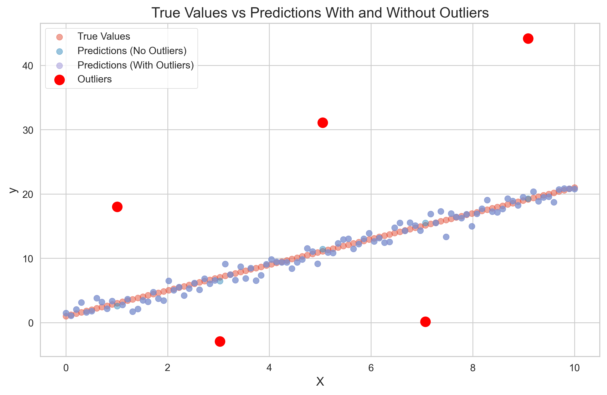

The above visualization shows the true values, predictions without outliers, and predictions with outliers. The red points highlight the outliers, which have a much greater impact on MSE than on MAE.

When examining the contribution of each outlier to the total error, we can see that outliers dominate the MSE calculation while having a more moderate effect on MAE:

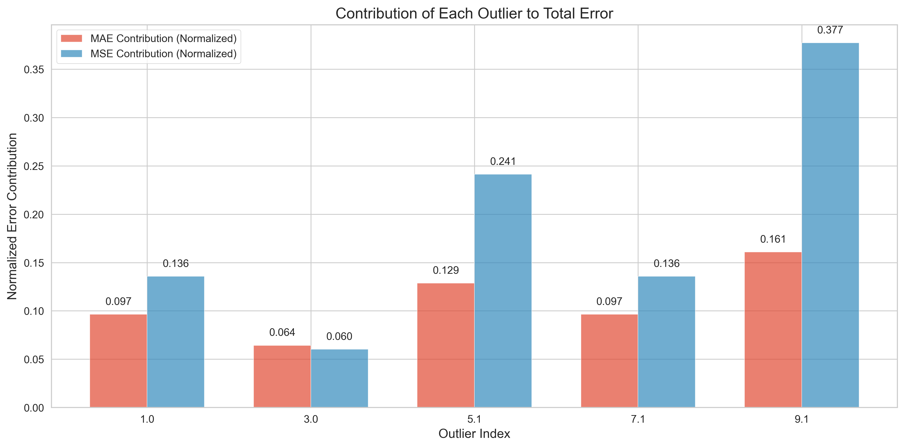

The mathematical reason for this difference becomes clear when we examine how the error functions grow with increasing error magnitude:

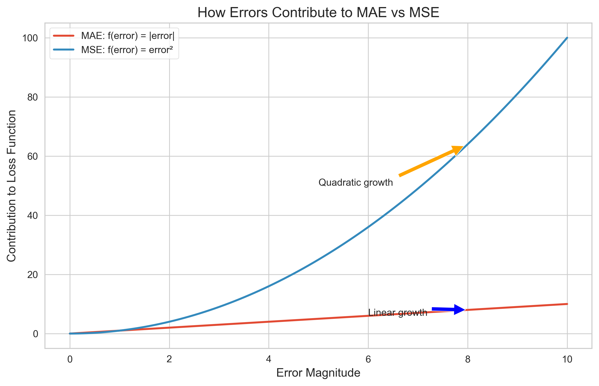

The above plot shows that while MAE grows linearly with error magnitude, MSE grows quadratically. This means that as errors get larger (as with outliers), their impact on MSE increases much more rapidly than their impact on MAE.

The following visualization demonstrates how the sensitivity gap between MAE and MSE widens as outlier magnitude increases:

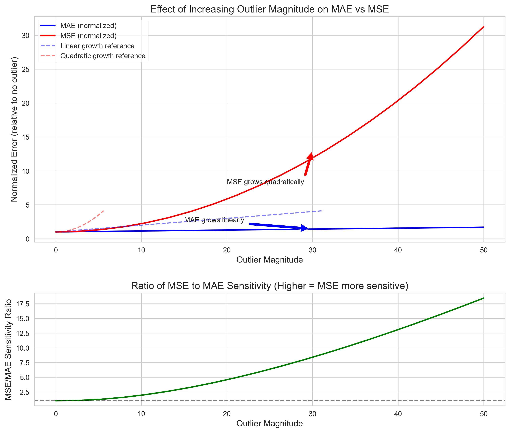

The top panel shows how both metrics grow with increasing outlier magnitude (normalized to their baseline values), while the bottom panel shows the ratio of MSE to MAE sensitivity. As outlier magnitude increases, MSE becomes increasingly more sensitive relative to MAE.

This difference in sensitivity has practical implications for model selection:

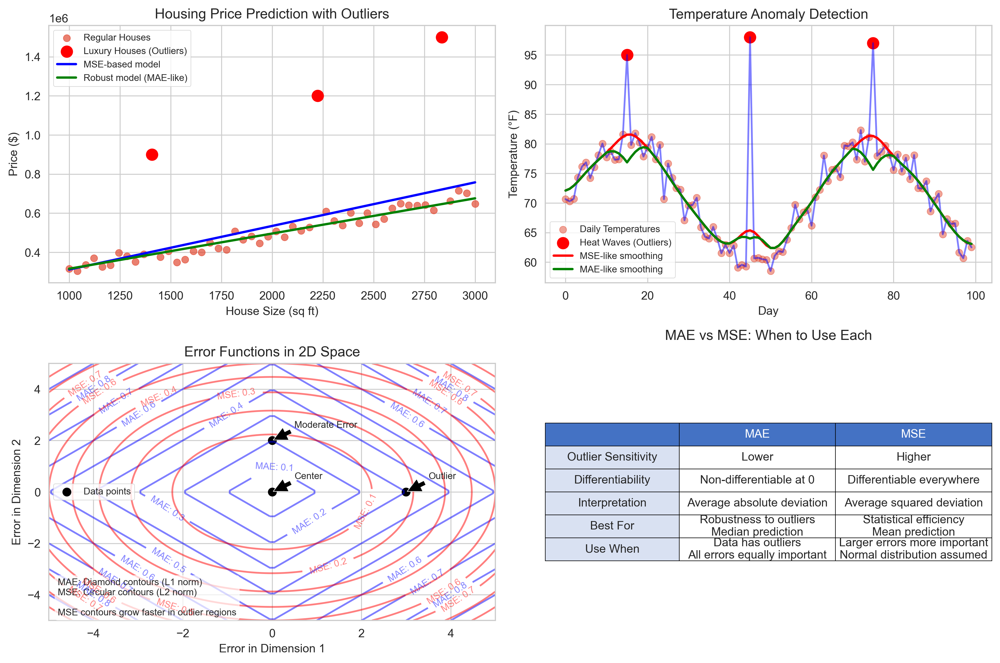

The figure above illustrates practical applications and considerations when choosing between MAE and MSE:
- **Housing Price Prediction**: MSE-based models (like standard linear regression) are more influenced by outliers (luxury houses) than robust MAE-like models
- **Temperature Anomaly Detection**: MSE-like smoothing is more affected by heat wave outliers than MAE-like smoothing
- **Mathematical Visualization**: MSE (L2 norm) contours grow faster in outlier regions than MAE (L1 norm) contours
- **Model Selection Guidance**: A table summarizing when to use each metric based on data characteristics and modeling goals

In summary, the statement is **TRUE**. MAE is demonstrably less sensitive to outliers than MSE due to its linear scaling with error magnitude. This property makes MAE a better choice when working with datasets that contain outliers that should not unduly influence the model.

### Statement 8: In learning curves, if the validation error continues to decrease as more training samples are added, adding more data is likely to improve model performance.

**TRUE**

Learning curves are a diagnostic tool that show how model performance changes as the training dataset size increases. When the validation error continues to decrease as more samples are added, it indicates that the model has not yet extracted all possible information from the data and has room for improvement.

The code analysis confirms this principle by examining two different datasets:

```
Learning Curve Analysis for Dataset 1 (Simple Linear Pattern):
Training sizes: [ 64 128 192 256 320 384 448 512 576 640]
Initial validation MSE (few samples): 1.0649266924676053
Final validation MSE (maximum samples): 0.9726736326298511
Improvement with more data: 8.662855433174386 %
Recent improvement rate: 0.1426%
The learning curve has plateaued (< 1% improvement).
Adding more data is unlikely to significantly improve model performance.

Learning Curve Analysis for Dataset 2 (Complex Nonlinear Pattern):
Training sizes: [ 64 128 192 256 320 384 448 512 576 640]
Initial validation MSE (few samples): 40.609644707187776
Final validation MSE (maximum samples): 36.56831423775213
Improvement with more data: 9.95165187623604 %
Recent improvement rate: 1.9358%
The learning curve is still showing improvements.
Adding more data may continue to improve model performance.
```

For Dataset 1 (a simple linear pattern), we see that the validation error has plateaued with a recent improvement rate of only 0.1426%. This indicates that adding more data is unlikely to significantly improve model performance.

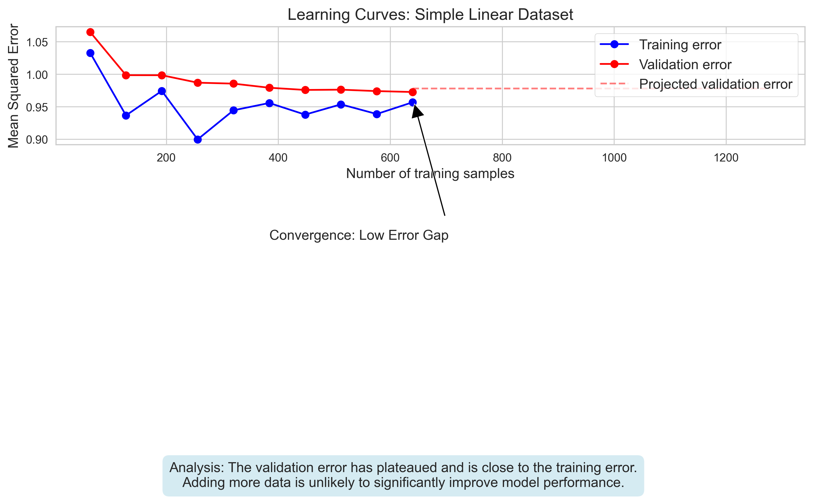

In contrast, for Dataset 2 (a complex nonlinear pattern), the validation error continues to decrease with a recent improvement rate of 1.9358%. This suggests that adding more data may continue to improve model performance.

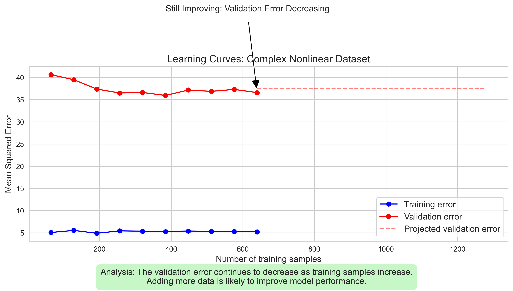

Understanding learning curves requires recognizing different patterns that indicate various model states:

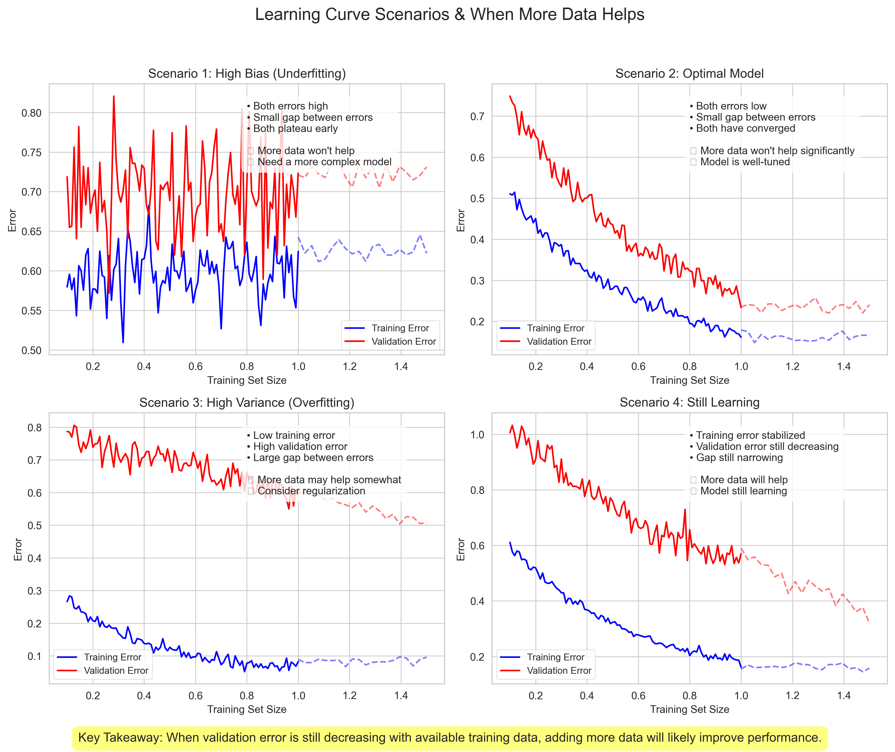

The four scenarios shown above illustrate:

1. **High Bias (Underfitting)**: Both training and validation errors are high and plateau early. More data won't help; a more complex model is needed.

2. **Optimal Model**: Both training and validation errors are low and have converged. More data won't significantly improve performance as the model is well-tuned.

3. **High Variance (Overfitting)**: Low training error but high validation error with a large gap between them. More data may help somewhat, but regularization should be considered.

4. **Still Learning**: Training error has stabilized while validation error continues to decrease and the gap is narrowing. More data will definitely help as the model is still learning.

Different model types also respond differently to additional data:

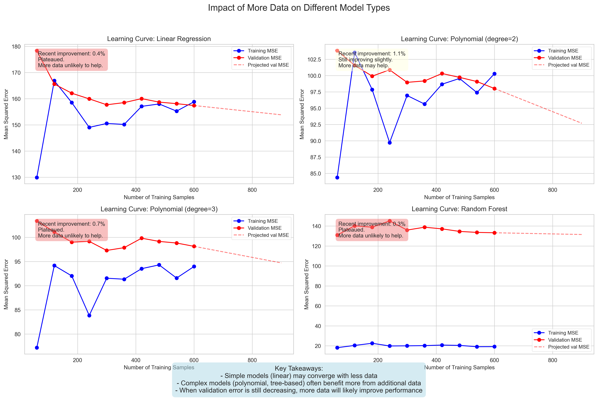

The comparison shows that:
- Simple models (like linear regression) may converge with relatively little data
- Complex models (like polynomial regression or random forests) often benefit more from additional data
- When the validation error is still decreasing, regardless of model type, more data will likely improve performance

Key indicators that more data will help:
- Validation error is still decreasing with available training data
- There is a gap between training and validation error that is narrowing
- The model is complex enough to capture the underlying pattern in the data

In summary, this statement is **TRUE**. Learning curves provide clear guidance: when validation error continues to decrease as training samples increase, adding more data is indeed likely to improve model performance.

## Key Insights

### Model Evaluation Principles
- Model evaluation should always consider performance on unseen data, not just training data
- Multiple evaluation metrics and techniques provide complementary perspectives on model quality
- The bias-variance tradeoff is central to understanding model performance and improvement strategies
- The choice of evaluation metric should align with the specific needs of the problem and the presence of outliers

### Diagnostic Techniques
- Residual analysis helps verify the assumptions of linear regression models
- Learning curves help diagnose bias, variance, and data sufficiency issues
- Cross-validation provides more reliable performance estimates than single train-test splits
- Information criteria like AIC help select models with the best balance of fit and complexity

### Practical Recommendations
- For high-bias models (underfitting), increase model complexity or add features
- For high-variance models (overfitting), add regularization, reduce model complexity, or get more data
- When validation error continues to decrease with more data, collecting additional data is worthwhile
- When validation error plateaus, focus on model improvements rather than collecting more data
- Choose MAE over MSE when outliers should not have outsized influence on the model

## Conclusion

Understanding model evaluation concepts is essential for developing effective machine learning solutions. The true/false statements explored in this question cover critical aspects of model assessment, validation, diagnostics, and improvement strategies.

By correctly identifying which statements are true and which are false, we gain insights into proper model evaluation practices. This knowledge helps us:
- Select appropriate evaluation metrics for different scenarios
- Diagnose model issues accurately
- Make informed decisions about model complexity
- Determine when to collect more data versus when to refine the model
- Ensure that our models' assumptions are satisfied

These principles form the foundation of rigorous and effective machine learning practice, enabling us to build models that generalize well to new, unseen data.

## Summary

| Statement | Verdict | Explanation |
|-----------|---------|-------------|
| 1 | TRUE | K-fold CV with K=n creates identical splits to leave-one-out CV. |
| 2 | FALSE | Lower AIC values, not higher, indicate better models with optimal complexity. |
| 3 | FALSE | High-bias models show smaller gaps between training and test error, not larger ones. |
| 4 | TRUE | Negative R² means the model performs worse than predicting the mean value. |
| 5 | TRUE | Residual analysis is essential to verify linear regression assumptions. |
| 6 | TRUE | Cross-validation is explicitly designed to assess performance on unseen data. |
| 7 | TRUE | MAE scales linearly with errors while MSE scales quadratically, making MAE less sensitive to outliers. |
| 8 | TRUE | Decreasing validation error with more samples indicates the model will benefit from more data. |

The true statements are 1, 4, 5, 6, 7, and 8. The false statements are 2 and 3. 