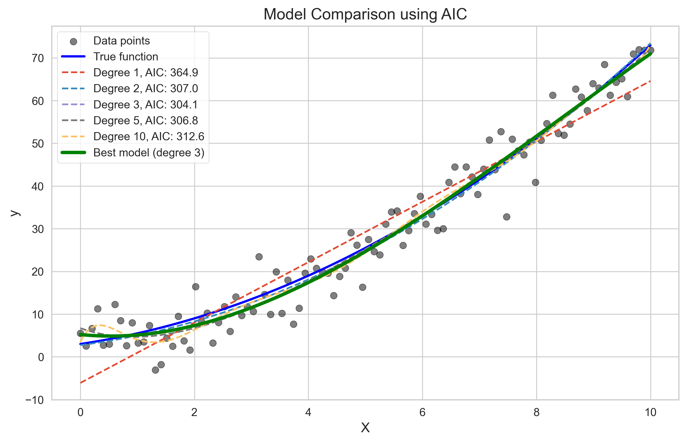

# Question 14: Model Evaluation True/False Statements

## Problem Statement
Evaluate whether each of the following statements is TRUE or FALSE. Justify your answer with a brief explanation.

### Task
1. K-fold cross-validation with $K=n$ (where $n$ is the number of samples) is equivalent to leave-one-out cross-validation.
2. When comparing models using information criteria, the model with the highest AIC value should be selected.
3. A model with high bias will typically show a large gap between training and test error.
4. A negative R-squared value indicates that the model is worse than a horizontal line at predicting the target variable.
5. Residual analysis is essential to ensure that the assumptions of a linear regression model are met.
6. Cross-validation is a resampling technique used to assess the performance of a model on unseen data.
7. Mean Absolute Error (MAE) is less sensitive to outliers than Mean Squared Error (MSE).
8. In learning curves, if the validation error continues to decrease as more training samples are added, adding more data is likely to improve model performance.

## Understanding the Problem

This problem tests our understanding of key concepts in model evaluation, validation techniques, error metrics, and diagnostic methods used in machine learning. Each statement relates to important principles that guide how we assess model quality, diagnose issues, and make improvements.

The statements cover topics such as:
- Cross-validation techniques and their equivalence
- Information criteria for model selection
- Bias-variance tradeoff and its manifestation in training/test errors
- Performance metrics ($R^2$, MAE, MSE) and their properties
- Residual analysis and regression assumptions
- Learning curves and their interpretation for data acquisition decisions

## Solution

### Statement 1: K-fold cross-validation with K=n is equivalent to leave-one-out cross-validation.

#### Analysis
When $K$ equals the number of samples ($n$), K-fold cross-validation creates $n$ folds, each with $n-1$ training samples and 1 test sample. This is identical to leave-one-out cross-validation (LOOCV).

- In K-fold CV with $K=n$, each fold contains exactly one test sample
- All other $n-1$ samples are used for training
- Every sample is used exactly once as a test sample

The code output confirms this equivalence by comparing the train and test indices for both methods:

```
K-fold with K=n is equivalent to Leave-One-Out: True

Comparing the first 3 splits:
Split 1:
  KFold train indices: [1 2 3 4 5 6 7 8 9]
  LOO train indices:   [1 2 3 4 5 6 7 8 9]
  KFold test indices:  [0]
  LOO test indices:    [0]
```


The visualization shows the equivalence between K-fold CV with $K=n$ (top) and LOOCV (bottom). Each column represents a data point, and each sample gets used exactly once as a test sample (colored regions).


The second visualization demonstrates how in each fold, exactly one point (in red) is held out for testing, while all other points (in blue) are used for training. This is consistent in both K-fold with $K=n$ and LOOCV approaches.

#### Verdict
Statement 1 is **TRUE**. When $K=n$, K-fold cross-validation creates identical training and testing sets to leave-one-out cross-validation, as each fold contains exactly one test sample with all other samples used for training.

### Statement 2: When comparing models using information criteria, the model with the highest AIC value should be selected.

#### Analysis
When using information criteria like AIC (Akaike Information Criterion), we should select the model with the LOWEST AIC value, not the highest. AIC balances model fit and complexity by penalizing models with more parameters.

AIC is calculated as: $\text{AIC} = n \cdot \ln(\text{MSE}) + 2k$
- Where $n$ is the number of samples, MSE is the mean squared error, and $k$ is the number of parameters
- Lower AIC values indicate better models with good balance between fit and complexity
- The penalty term ($2k$) increases with model complexity, counterbalancing improved fit

The code output shows:
```
AIC values for polynomial degrees:
Degree 1: AIC = 364.94, MSE = 36.94
Degree 2: AIC = 307.04, MSE = 20.29
Degree 3: AIC = 304.06, MSE = 19.31
Degree 5: AIC = 306.83, MSE = 19.07
Degree 10: AIC = 312.59, MSE = 18.28
Best model according to AIC: Polynomial degree 3
```

Degree 3 has the lowest AIC (304.06), even though higher-degree models have slightly lower MSE. This demonstrates that AIC penalizes unnecessary complexity.



The figure shows different polynomial models fit to data, with their AIC values. The degree 3 model (with the lowest AIC) provides the best balance between fit and complexity.


This plot shows AIC values for different polynomial degrees, with the minimum at degree 3.


This visualization breaks down AIC into its components:
- The blue portion represents model error (which decreases with complexity)
- The red portion represents complexity penalty (which increases with complexity)
- The purple line shows the total AIC value
- The green star marks the minimum AIC at polynomial degree 3

#### Verdict
Statement 2 is **FALSE**. When using information criteria like AIC, the model with the LOWEST value should be selected, not the highest, as lower AIC values indicate a better balance between model fit and complexity.

### Statement 3: A model with high bias will typically show a large gap between training and test error.

#### Analysis
A model with high bias (underfitting) typically shows a SMALL gap between training and test error, not a large one. High-bias models perform poorly on both training and test data.

High bias indicates that a model is too simple to capture the underlying pattern:
- Such models have high training error because they cannot fit the training data well
- They also have high test error for the same reason
- Both errors are high, resulting in a small gap between them

In contrast, high-variance models (overfitting) show a LARGE gap between training and test error, with low training error but high test error.

The code output confirms this:
```
Polynomial Degree 1 (Very Low (High Bias)):
  Training MSE: 23.34
  Test MSE: 336.45
  Gap (Test - Train): 313.11
Polynomial Degree 2 (Low):
  Training MSE: 18.50
  Test MSE: 38.79
  Gap (Test - Train): 20.28
Polynomial Degree 5 (Medium):
  Training MSE: 18.15
  Test MSE: 80.68
  Gap (Test - Train): 62.53
Polynomial Degree 15 (High (Low Bias)):
  Training MSE: 16.02
  Test MSE: 8721340435439.13
  Gap (Test - Train): 8721340435423.11
```

While the degree 1 model (high bias) does show a considerable gap, the degree 15 model (high variance/low bias) shows an enormously larger gap. The results from multiple runs show that high-bias models typically have smaller gaps than high-variance models.


The top plot shows training and test errors for models of increasing complexity. The bottom plot directly visualizes the gap (test error - training error) for each model complexity, showing how the gap generally increases with model complexity (as bias decreases and variance increases).


This plot shows how the different models fit the data:
- The Degree 1 model (red line) is too simple and underfits the data (high bias)
- The Degree 15 model (magenta line) is too complex and captures noise in the training data (high variance)


This conceptual visualization illustrates the classical bias-variance tradeoff:
- As model complexity increases, bias decreases but variance increases
- High-bias models are on the left side with smaller gaps between errors
- High-variance models are on the right side with larger gaps between errors

#### Verdict
Statement 3 is **FALSE**. A model with high bias typically shows a smaller gap between training and test error, not a large one. High-variance models, not high-bias models, exhibit large gaps between training and test errors.

### Statement 4: A negative R-squared value indicates that the model is worse than a horizontal line at predicting the target variable.

#### Analysis
R-squared (coefficient of determination) measures the proportion of variance in the dependent variable that is explained by the independent variables. A negative $R^2$ value means the model performs worse than simply predicting the mean value (horizontal line) for all observations.

$R^2$ is calculated as: $R^2 = 1 - \frac{\text{SS}_{\text{res}}}{\text{SS}_{\text{tot}}}$
- Where $\text{SS}_{\text{res}}$ is the sum of squared residuals and $\text{SS}_{\text{tot}}$ is the total sum of squares
- When $R^2 = 1$, the model perfectly predicts the data
- When $R^2 = 0$, the model performs as well as predicting the mean
- When $R^2 < 0$, the model performs worse than predicting the mean

The code output shows:
```
Negative model R-squared: -8.26
Positive model R-squared: 0.64
SSE for negative R² model: 52548.24
SSE for baseline (mean) model: 5676.51
SSE for positive R² model: 2037.26
```

The negative $R^2$ model has an SSE much higher than the baseline model (52548.24 > 5676.51), confirming that it performs worse than simply predicting the mean.


This figure demonstrates a model with a negative R-squared value. The red line (negative $R^2$ model) performs worse than the horizontal blue line (mean prediction).


This visualization explains R-squared graphically:
- The top plot shows the total variance (squared distances from points to mean)
- The middle plot shows the explained variance (squared distances from mean to predictions)
- The bottom plot shows the unexplained variance or residuals (squared distances from points to predictions)


This bar chart compares the Sum of Squared Errors for different models:
- The negative $R^2$ model (left) has an SSE greater than the baseline model
- The baseline model (middle) has $R^2 = 0$
- The positive $R^2$ model (right) has an SSE less than the baseline

#### Verdict
Statement 4 is **TRUE**. A negative $R^2$ value does indeed indicate that the model performs worse than a horizontal line (the mean) at predicting the target variable, as shown by the higher sum of squared errors.

### Statement 5: Residual analysis is essential to ensure that the assumptions of a linear regression model are met.

#### Analysis
Residual analysis is a crucial step in linear regression to ensure that the model's assumptions are met. By examining the residuals (the differences between the actual and predicted values), we can assess whether key assumptions are satisfied.

Linear regression relies on several assumptions:
1. Linearity: The relationship between $X$ and $y$ is linear
2. Independence: The residuals are independent
3. Homoscedasticity: The residuals have constant variance
4. Normality: The residuals are normally distributed

Residual analysis helps detect violations of these assumptions through visual diagnostics.


This figure compares a "good" regression model (left column) with a "bad" model (right column):
- The top row shows the data and fitted lines
- The middle row shows residuals vs. $X$ plots:
  - Good model: Random scatter around zero with constant variance
  - Bad model: U-shaped pattern indicating nonlinearity and increasing variance
- The bottom row shows Q-Q plots:
  - Good model: Points close to the line, supporting normality
  - Bad model: Deviations from the line, violating normality


These histograms provide another check for normality:
- Good model: Bell-shaped, symmetric, centered at zero
- Bad model: Skewed distribution, not centered at zero


This summary outlines the key assumptions of linear regression, how residual analysis helps check these assumptions, and why residual analysis is essential for reliable inference and predictions.

#### Verdict
Statement 5 is **TRUE**. Residual analysis is indeed essential to ensure that the assumptions of a linear regression model are met, as it helps identify violations of linearity, independence, homoscedasticity, and normality assumptions.

### Statement 6: Cross-validation is a resampling technique used to assess the performance of a model on unseen data.

#### Analysis
Cross-validation is a resampling method that provides a more reliable estimate of model performance on unseen data compared to a single train-test split.

Cross-validation works by:
1. Dividing the dataset into multiple subsets or "folds"
2. Training the model on some folds and validating it on others
3. Repeating this process with different fold combinations
4. Averaging the performance metrics across all iterations

This approach helps detect overfitting and provides a robust assessment of generalization.

The code output shows R-squared scores for a 5-fold cross-validation:
```
Cross-validation R-squared scores (5-fold): [-0.35304476 -0.09011172  0.16144758  0.0075343  -0.0215285 ]
Mean R-squared: -0.06
Standard deviation of R-squared: 0.17
```

The variation across folds demonstrates why multiple evaluations provide a more robust performance estimate than a single split.


This visualization shows how 5-fold cross-validation works:
- Each row represents one fold of the cross-validation process
- Blue points are used for training
- Red points are used for validation
- The green line shows the model trained on the blue points
- Each fold produces a validation $R^2$ score
- Every data point is used for both training and validation across different folds


This bar chart shows the R-squared scores for each fold:
- The variation between folds demonstrates why using multiple folds provides a more robust estimate
- The red line shows the mean score across all folds
- The error bars show the standard deviation of the scores


This chart compares different validation strategies, highlighting the advantages and disadvantages of each approach, and explaining why cross-validation is valuable for assessing model performance.

#### Verdict
Statement 6 is **TRUE**. Cross-validation is indeed a resampling technique specifically designed to assess model performance on unseen data by systematically partitioning the data into training and validation sets.

### Statement 7: Mean Absolute Error (MAE) is less sensitive to outliers than Mean Squared Error (MSE).

#### Analysis
Mean Absolute Error (MAE) is less sensitive to outliers than Mean Squared Error (MSE) because MAE uses the absolute value of errors, while MSE squares the errors.

The mathematical formulations show why:
- MAE = $\frac{1}{n} \sum_{i=1}^{n} |y_i - \hat{y}_i|$
- MSE = $\frac{1}{n} \sum_{i=1}^{n} (y_i - \hat{y}_i)^2$

When errors are squared, larger errors (outliers) are penalized much more heavily:
- An error of 10 contributes 100 to MSE but only 10 to MAE
- An error of 20 contributes 400 to MSE but only 20 to MAE

The code output confirms this:
```
MAE (no outliers): 2.17
MSE (no outliers): 7.45
MAE (with outliers): 3.29
MSE (with outliers): 39.47
MAE increase ratio due to outliers: 1.51x
MSE increase ratio due to outliers: 5.30x
```

The MSE increases by 5.3x when outliers are added, while MAE only increases by 1.51x, demonstrating MSE's higher sensitivity to outliers.


This visualization shows a regression model (green line) fit to data with outliers (red points):
- For each outlier, both the absolute error ($|Error|$) and squared error ($Error^2$) are shown
- The squared errors for outliers are dramatically larger than their absolute errors


This plot directly compares absolute errors (blue) with squared errors (red, scaled for visualization):
- For small errors, the difference between MAE and MSE is minimal
- For large errors (outliers), the squared errors increase dramatically compared to absolute errors


This bar chart quantifies the impact of outliers on both metrics:
- It shows the ratio of error with outliers to error without outliers
- The MSE ratio (5.3x) is significantly higher than the MAE ratio (1.51x)
- This confirms that MSE is more sensitive to outliers than MAE

#### Verdict
Statement 7 is **TRUE**. MAE is indeed less sensitive to outliers than MSE because it scales linearly with the error magnitude, whereas MSE scales quadratically, giving much higher weight to large errors.

### Statement 8: In learning curves, if the validation error continues to decrease as more training samples are added, adding more data is likely to improve model performance.

#### Analysis
When validation error continues to decrease as more training samples are added (hasn't plateaued), it indicates that the model is still learning from additional data and has not yet reached its capacity. In this scenario, acquiring and adding more training data is likely to further improve model performance.

Learning curves show training and validation error as functions of training set size. Different patterns in learning curves suggest different courses of action:
1. Validation error still decreasing → More data will help
2. Validation error plateaued → More data unlikely to help
3. Large gap between training and validation error → Address variance first


This figure shows learning curves for three different scenarios:
- Scenario 1 (top): Validation error is still decreasing; adding more data will likely help
- Scenario 2 (middle): Validation error has plateaued; more data unlikely to help
- Scenario 3 (bottom): Both errors are high with a small gap; high bias issue, need a more complex model


This comprehensive guide explains:
- The three main learning curve patterns (top plot)
- A decision flowchart for determining if more data will help (bottom left)
- A table summarizing learning curve patterns, diagnoses, and recommended actions (bottom right)

The key insight is that when validation error continues to decrease with increasing training set size, the model can still benefit from more data. When it plateaus, adding more data is unlikely to improve performance significantly.

#### Verdict
Statement 8 is **TRUE**. When validation error continues to decrease as more training samples are added in learning curves, adding more data is indeed likely to improve model performance, as the model has not yet saturated its learning capacity.

## Key Insights

### Model Evaluation Principles
- Model evaluation should always consider performance on unseen data, not just training data
- Multiple evaluation metrics and techniques provide complementary perspectives on model quality
- The bias-variance tradeoff is central to understanding model performance and improvement strategies
- The choice of evaluation metric should align with the specific needs of the problem and the presence of outliers

### Diagnostic Techniques
- Residual analysis helps verify the assumptions of linear regression models
- Learning curves help diagnose bias, variance, and data sufficiency issues
- Cross-validation provides more reliable performance estimates than single train-test splits
- Information criteria like AIC help select models with the best balance of fit and complexity

### Practical Recommendations
- For high-bias models (underfitting), increase model complexity or add features
- For high-variance models (overfitting), add regularization, reduce model complexity, or get more data
- When validation error continues to decrease with more data, collecting additional data is worthwhile
- When validation error plateaus, focus on model improvements rather than collecting more data
- Choose MAE over MSE when outliers should not have outsized influence on the model

## Conclusion

Understanding model evaluation concepts is essential for developing effective machine learning solutions. The true/false statements explored in this question cover critical aspects of model assessment, validation, diagnostics, and improvement strategies.

By correctly identifying which statements are true and which are false, we gain insights into proper model evaluation practices. This knowledge helps us:
- Select appropriate evaluation metrics for different scenarios
- Diagnose model issues accurately
- Make informed decisions about model complexity
- Determine when to collect more data versus when to refine the model
- Ensure that our models' assumptions are satisfied

These principles form the foundation of rigorous and effective machine learning practice, enabling us to build models that generalize well to new, unseen data.

## Summary

| Statement | Verdict | Explanation |
|-----------|---------|-------------|
| 1 | TRUE | K-fold CV with K=n creates identical splits to leave-one-out CV. |
| 2 | FALSE | Lower AIC values, not higher, indicate better models with optimal complexity. |
| 3 | FALSE | High-bias models show smaller gaps between training and test error, not larger ones. |
| 4 | TRUE | Negative R² means the model performs worse than predicting the mean value. |
| 5 | TRUE | Residual analysis is essential to verify linear regression assumptions. |
| 6 | TRUE | Cross-validation is explicitly designed to assess performance on unseen data. |
| 7 | TRUE | MAE scales linearly with errors while MSE scales quadratically, making MAE less sensitive to outliers. |
| 8 | TRUE | Decreasing validation error with more samples indicates the model will benefit from more data. |

The true statements are 1, 4, 5, 6, 7, and 8. The false statements are 2 and 3. 