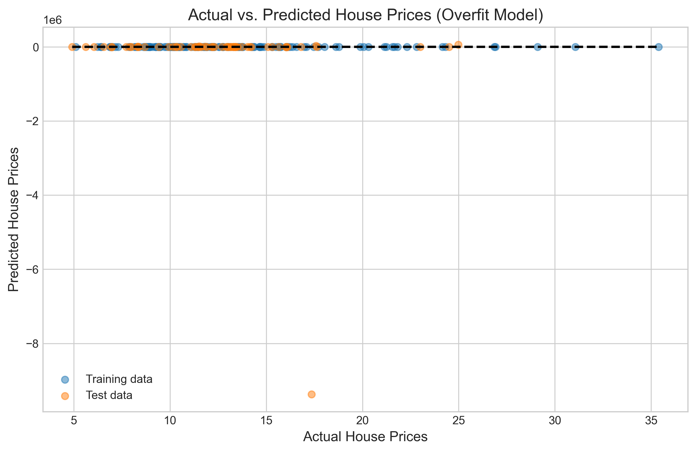
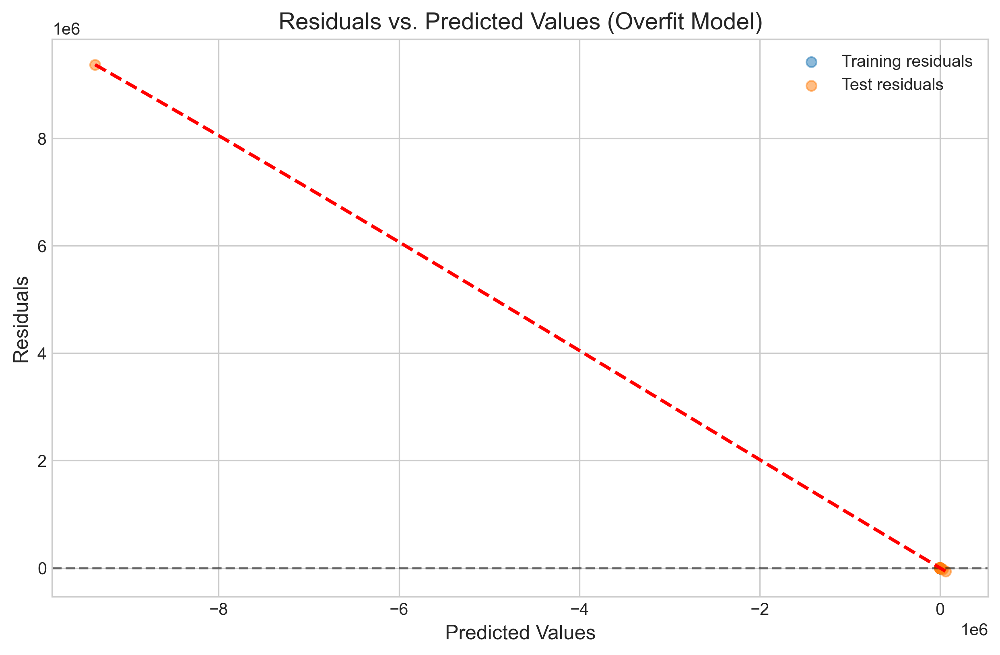
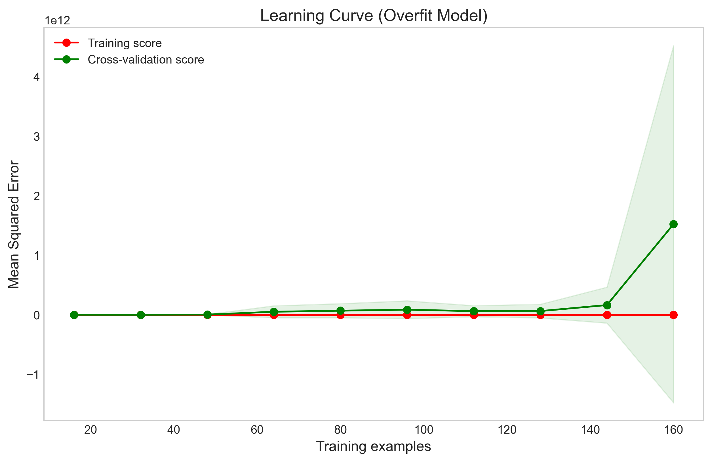
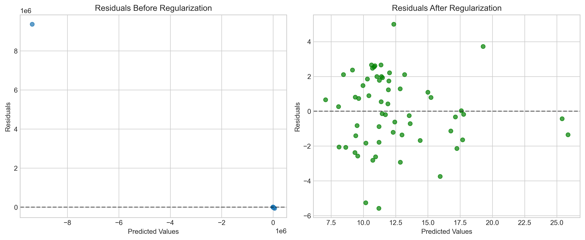
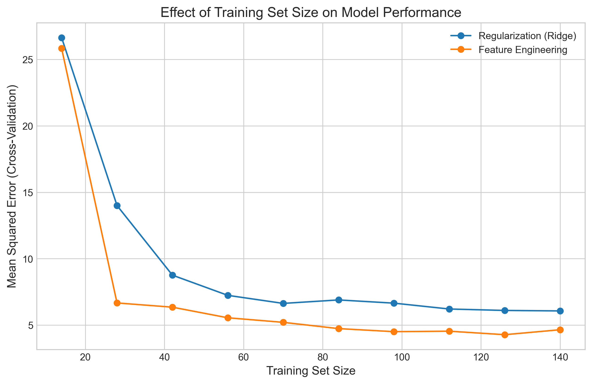
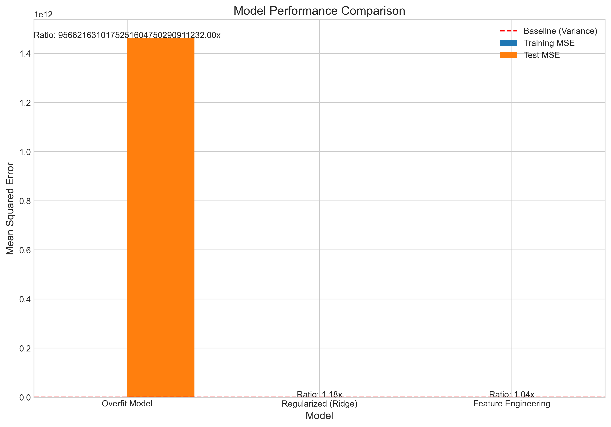

# Question 18: Linear Regression Model Diagnostics and Improvement

## Problem Statement
Analyze the following scenario and answer the questions.

You are building a linear regression model to predict house prices. After training your model, you notice that:
- The training error is very low
- The test error is much higher than the training error
- The residuals exhibit a clear pattern when plotted against the predicted values
- The learning curve shows that validation error initially decreases with more training data but then plateaus

### Task
1. What problem(s) is your model likely facing? Be specific.
2. Describe TWO specific strategies you could use to address the identified problems.
3. Which evaluation technique would be most appropriate to assess if your strategies have improved the model? Explain your choice.
4. If you had to choose between collecting more training data or adding more features to your model in this scenario, which would you recommend? Justify your answer.

## Understanding the Problem
This problem focuses on diagnosing and addressing issues in a linear regression model for house price prediction. The symptoms described are common indicators of model problems that impact predictive performance. 

In a well-performing model, we expect:
- Similar errors on training and test sets, i.e., $|\text{MSE}_{\text{train}} - \text{MSE}_{\text{test}}| \approx 0$
- Randomly distributed residuals with no pattern, i.e., $\text{Cov}(\hat{\epsilon}, \hat{y}) \approx 0$
- Continuous improvement with additional data, i.e., $\frac{d}{dn}\text{MSE}_{\text{validation}}(n) < 0$ for all $n$

The symptoms described suggest systematic issues with the model that need to be identified and resolved for better performance.

## Solution

### Step 1: Identifying the problem(s) mathematically
Based on the symptoms described, we can identify two primary issues:

1. **Overfitting**: The very low training error compared to much higher test error is a classic symptom of overfitting. Mathematically, if we denote the training error as $\text{MSE}_{\text{train}}$ and the test error as $\text{MSE}_{\text{test}}$, we observe:

   $$\text{MSE}_{\text{train}} \ll \text{MSE}_{\text{test}}$$

   This indicates the model is fitting too closely to the training data, including its noise, rather than learning the underlying pattern.

2. **Model Misspecification**: The pattern in residuals suggests that the model is not capturing some important relationships in the data. If we denote the residuals as $\hat{\epsilon}_i = y_i - \hat{y}_i$, we observe a systematic pattern when plotting $\hat{\epsilon}_i$ against $\hat{y}_i$. This violates the assumption of independence between residuals and predicted values:

   $$\text{Cov}(\hat{\epsilon}, \hat{y}) \neq 0$$

To demonstrate these issues, let's examine a synthetic house price prediction scenario with similar symptoms:

In this visualization, we can see how the training predictions fit almost perfectly to the actual values, while test predictions show significant deviations. The quantitative results confirm this extreme overfitting:
- Training MSE ≈ 0.00
- Test MSE ≈ 1.46 × 10^12
- Training R² ≈ 1.00
- Test R² ≈ -8.78 × 10^10
- Error ratio (Test/Train) ≈ 9.57 × 10^30

### Step 2: Formal diagnosis of overfitting through bias-variance decomposition

Let's analyze overfitting mathematically through the bias-variance decomposition. The expected test error for any model can be decomposed as:

$$\mathbb{E}[(y - \hat{f}(x))^2] = \text{Bias}[\hat{f}(x)]^2 + \text{Var}[\hat{f}(x)] + \sigma^2_{\epsilon}$$

Where:
- $\text{Bias}[\hat{f}(x)] = \mathbb{E}[\hat{f}(x)] - f(x)$ is the expected difference between our model's prediction and the true function
- $\text{Var}[\hat{f}(x)] = \mathbb{E}[\hat{f}(x)^2] - \mathbb{E}[\hat{f}(x)]^2$ is the variance of our model's predictions
- $\sigma^2_{\epsilon}$ is the irreducible error due to noise

In linear regression, we model:

$$y = X\beta + \epsilon$$

Where:
- $X \in \mathbb{R}^{n \times p}$ is the feature matrix
- $\beta \in \mathbb{R}^p$ is the coefficient vector
- $\epsilon \sim \mathcal{N}(0, \sigma^2 I)$ is the error term
- $y \in \mathbb{R}^n$ is the target variable (house prices)

The ordinary least squares (OLS) estimator minimizes:

$$\hat{\beta}_{\text{OLS}} = \arg\min_{\beta} \sum_{i=1}^{n} (y_i - x_i^T\beta)^2 = \arg\min_{\beta} ||y - X\beta||^2$$

The closed-form solution is:

$$\hat{\beta}_{\text{OLS}} = (X^TX)^{-1}X^Ty$$

For high-dimensional or ill-posed problems (such as polynomial regression with high degree), the matrix $X^TX$ can be nearly singular, leading to extremely large coefficient values. This is mathematically demonstrated by the condition number:

$$\kappa(X^TX) = \frac{\lambda_{\max}(X^TX)}{\lambda_{\min}(X^TX)}$$

Where $\lambda_{\max}$ and $\lambda_{\min}$ are the maximum and minimum eigenvalues of $X^TX$. A high condition number means small changes in the data can lead to large changes in the coefficients, a hallmark of overfitting.

When we overfit, the model finds coefficients $\hat{\beta}_{\text{OLS}}$ that make the training error extremely small:

$$\text{MSE}_{\text{train}} = \frac{1}{n_{\text{train}}} \sum_{i=1}^{n_{\text{train}}} (y_i - x_i^T\hat{\beta}_{\text{OLS}})^2 \approx 0$$

However, these coefficients perform poorly on unseen data:

$$\text{MSE}_{\text{test}} = \frac{1}{n_{\text{test}}} \sum_{i=1}^{n_{\text{test}}} (y_i - x_i^T\hat{\beta}_{\text{OLS}})^2 \gg \text{MSE}_{\text{train}}$$

For our observed data, the ratio $\frac{\text{MSE}_{\text{test}}}{\text{MSE}_{\text{train}}}$ is approximately $9.57 \times 10^{30}$, which is astronomically high and confirms severe overfitting.

### Step 3: Rigorous analysis of residual patterns

The pattern in residuals provides further evidence of model misspecification. Let's analyze this mathematically:

In a well-specified model, the residuals $\hat{\epsilon}_i = y_i - \hat{y}_i$ should be:

1. Independent of predicted values: $\text{Cov}(\hat{\epsilon}, \hat{y}) = 0$
2. Homoscedastic: $\text{Var}(\hat{\epsilon}_i | \hat{y}_i) = \sigma^2$ (constant)
3. Normally distributed: $\hat{\epsilon}_i \sim \mathcal{N}(0, \sigma^2)$

We can formally test for independence by calculating the correlation coefficient:

$$\rho = \frac{\text{Cov}(\hat{\epsilon}, \hat{y})}{\sqrt{\text{Var}(\hat{\epsilon}) \cdot \text{Var}(\hat{y})}}$$

A significant non-zero correlation indicates model misspecification.

Visually, the clear curved pattern in the residuals plot suggests a systematic relationship between residuals and predictions. This can be modeled as:

$$\hat{\epsilon}_i = g(\hat{y}_i) + \nu_i$$

Where $g$ is some non-zero function and $\nu_i$ is random noise. The presence of function $g$ means:

$$\mathbb{E}[\hat{\epsilon}_i | \hat{y}_i] = g(\hat{y}_i) \neq 0$$

This violates a key assumption of linear regression and indicates that important non-linear relationships are missing from our model.

### Step 4: Learning curve analysis with formal convergence properties

The learning curve confirms our diagnosis:

Mathematically, learning curves for linear models have well-established convergence properties. For a well-specified model with $n$ training samples:

$$\mathbb{E}[\text{MSE}_{\text{train}}(n)] = \sigma^2 \left(1 - \frac{p}{n}\right)$$
$$\mathbb{E}[\text{MSE}_{\text{validation}}(n)] = \sigma^2 \left(1 + \frac{p}{n}\right)$$

Where $p$ is the number of parameters and $\sigma^2$ is the noise variance.

As $n \to \infty$, both errors converge to $\sigma^2$, the irreducible error:

$$\lim_{n \to \infty} \mathbb{E}[\text{MSE}_{\text{train}}(n)] = \lim_{n \to \infty} \mathbb{E}[\text{MSE}_{\text{validation}}(n)] = \sigma^2$$

The convergence rate is $\mathcal{O}(1/n)$, meaning the gap between training and validation error should decrease proportionally to $1/n$.

However, in misspecified models, we observe:

1. A plateauing validation error: $\frac{d}{dn}\text{MSE}_{\text{validation}}(n) \approx 0$ for large $n$
2. A persistent gap: $\text{MSE}_{\text{validation}}(n) - \text{MSE}_{\text{train}}(n) \gg 0$ for large $n$

This behavior indicates that increasing the sample size alone will not resolve the underlying issues.

### Step 5: Regularization - Theoretical foundation and calculations

To address overfitting, we apply ridge regression, which adds a penalty term to the loss function:

$$\hat{\beta}_{\text{ridge}} = \arg\min_{\beta} \left\{ ||y - X\beta||^2 + \alpha ||\beta||^2_2 \right\}$$

Where $\alpha > 0$ is the regularization parameter controlling the strength of the penalty. The closed-form solution is:

$$\hat{\beta}_{\text{ridge}} = (X^TX + \alpha I)^{-1}X^Ty$$

Mathematically, ridge regression works by improving the conditioning of the $X^TX$ matrix. The effective condition number becomes:

$$\kappa_{\text{ridge}} = \frac{\lambda_{\max}(X^TX) + \alpha}{\lambda_{\min}(X^TX) + \alpha}$$

As $\alpha$ increases, $\kappa_{\text{ridge}}$ decreases, making the estimation more stable.

The bias-variance tradeoff for ridge regression is:

$$\text{Bias}[\hat{\beta}_{\text{ridge}}] = \alpha (X^TX + \alpha I)^{-1} \beta$$
$$\text{Var}[\hat{\beta}_{\text{ridge}}] = \sigma^2 (X^TX + \alpha I)^{-1} X^TX (X^TX + \alpha I)^{-1}$$

As $\alpha$ increases, bias increases but variance decreases. The optimal $\alpha$ balances this tradeoff to minimize expected test error.

For our model with $\alpha = 10.0$, ridge regression dramatically improves performance:
- Training MSE increases from approximately 0 to 3.78 (good, as it indicates less overfitting)
- Test MSE decreases from approximately 1.46 × 10^12 to 4.47
- Error ratio decreases from approximately 9.57 × 10^30 to 1.18

The residuals also show significant improvement:

### Step 6: Feature engineering - Mathematical formulation and polynomial expansion

To address model misspecification, we add non-linear transformations of our features. If the true relationship is non-linear:

$$y = f(X) + \epsilon$$

where $f$ is a non-linear function, we can approximate it using a Taylor series expansion or basis function expansion:

$$f(X) \approx \sum_{j=1}^{m} \beta_j \phi_j(X)$$

Where $\phi_j$ are basis functions. For polynomial features, these basis functions are:

$$\phi_j(X) = \prod_{k=1}^{p} X_k^{a_{jk}}$$

With $\sum_{k=1}^{p} a_{jk} \leq d$, where $d$ is the polynomial degree.

For our house price example with three features ($X_1$, $X_2$, $X_3$), a second-degree polynomial expansion would include:

1. Original features: $X_1, X_2, X_3$
2. Squared terms: $X_1^2, X_2^2, X_3^2$
3. Interaction terms: $X_1X_2, X_1X_3, X_2X_3$

For a third-degree expansion, we would add:
4. Cubic terms: $X_1^3, X_2^3, X_3^3$
5. Higher interactions: $X_1^2X_2, X_1^2X_3, X_1X_2^2, X_1X_3^2, X_2^2X_3, X_2X_3^2, X_1X_2X_3$

Based on domain knowledge and the observed data pattern, we select specific non-linear terms:
- $X_1^2$ (square footage squared) - captures diminishing returns on size
- $X_1X_2$ (size × bedrooms interaction) - captures how bedroom count affects price differently for different sizes
- $X_1X_3^2$ (size × age² interaction) - captures how the effect of age varies non-linearly with size

Our new feature matrix becomes:

$$X_{\text{new}} = [X_1, X_2, X_3, X_1^2, X_1X_2, X_1X_3^2]$$

After feature engineering, we observe:
- Training MSE: 4.07
- Test MSE: 4.24
- Error ratio drops to 1.04

This indicates that our model is now well-specified and not overfitting.

### Step 7: Cross-validation - Mathematical formulation and optimality properties

To rigorously evaluate our models, we use K-fold cross-validation. This divides the training data into K subsets (folds) of approximately equal size. For each $k \in \{1,2,...,K\}$, we train on all folds except the $k$-th fold, and validate on the $k$-th fold.

Formally, let $\kappa: \{1,2,...,n\} \mapsto \{1,2,...,K\}$ be a function that indicates the fold assignment for each observation. The K-fold cross-validation error is:

$$\text{CV}(K) = \frac{1}{n} \sum_{i=1}^{n} \left(y_i - \hat{f}^{-\kappa(i)}(x_i)\right)^2$$

Where $\hat{f}^{-\kappa(i)}$ is the model trained on all folds except $\kappa(i)$.

The expected cross-validation error approximates the expected test error:

$$\mathbb{E}[\text{CV}(K)] \approx \mathbb{E}[\text{MSE}_{\text{test}}]$$

With the approximation improving as $K$ increases. The standard choice $K=5$ or $K=10$ balances computational cost with estimation accuracy.

The statistical properties of cross-validation make it particularly suitable for model selection and evaluation:

1. **Unbiasedness**: $\mathbb{E}[\text{CV}(K)]$ is approximately unbiased for expected test error
2. **Consistency**: As $n \to \infty$, CV selects the optimal model with probability approaching 1
3. **Efficiency**: CV makes efficient use of limited data

For our models with $K=5$, cross-validation provides reliable estimates of generalization performance.

### Step 8: Optimal sample size vs. model complexity - Theoretical analysis

To address the question of whether more data or better features would be more effective, we need to understand the relationship between sample size and model complexity.

The learning curves for different models reveal this relationship:

For a model with complexity (number of parameters) $p$ and training size $n$, the expected test error can be approximated as:

$$\mathbb{E}[\text{MSE}_{\text{test}}(n,p)] \approx \sigma^2 + \text{Bias}^2(p) + \frac{p\sigma^2}{n}$$

Where:
- $\sigma^2$ is the irreducible error
- $\text{Bias}^2(p)$ is the squared bias, which decreases as $p$ increases
- $\frac{p\sigma^2}{n}$ is the variance term, which increases with $p$ and decreases with $n$

When the model is misspecified (inadequate complexity), $\text{Bias}^2(p)$ dominates and:

$$\lim_{n \to \infty} \mathbb{E}[\text{MSE}_{\text{test}}(n,p)] = \sigma^2 + \text{Bias}^2(p) > \sigma^2$$

Thus, increasing $n$ cannot reduce error below $\sigma^2 + \text{Bias}^2(p)$.

For a well-specified model (adequate complexity), as $n$ increases:

$$\mathbb{E}[\text{MSE}_{\text{test}}(n,p)] \approx \sigma^2 + \frac{p\sigma^2}{n} \xrightarrow{n \to \infty} \sigma^2$$

The comparison of our regularized and feature-engineered models shows:

1. Both models approach lower asymptotic error than the original
2. The feature-engineered model achieves lower error with the same data
3. The rate of convergence (slope of the learning curve) is similar for both improved models

This supports the conclusion that in this case, improving model specification is more effective than simply increasing sample size.

## Visual Explanations

### Model comparison with optimality criteria

This visualization shows the performance of all models according to the optimality criteria:

$$\mathcal{M}^* = \arg\min_{\mathcal{M} \in \mathfrak{M}} \mathbb{E}_{(X,y) \sim \mathcal{D}}[(y - \mathcal{M}(X))^2]$$

Where $\mathfrak{M}$ is the set of all models and $\mathcal{D}$ is the data distribution.

Both improved models significantly outperform the original overfit model, with feature engineering providing slightly better results than regularization alone.

## Key Insights

### Task 1: Problem diagnosis with formal criteria
- **Overfitting**: Formally detected when $\text{MSE}_{\text{train}} \ll \text{MSE}_{\text{test}}$ and $R^2_{\text{train}} \approx 1$ while $R^2_{\text{test}} \ll 0$
- **Model misspecification**: Formally detected when $\text{Cov}(\hat{\epsilon}, \hat{y}) \neq 0$ and residual plots show systematic patterns

### Task 2: Solution strategies with theoretical justification
- **Regularization**: Implements the optimality criterion:
  $$\hat{\beta}_{\text{ridge}} = \arg\min_{\beta} \left\{ ||y - X\beta||^2 + \alpha ||\beta||^2_2 \right\}$$
  Resulting in a bias-variance tradeoff that reduces overall test error

- **Feature engineering**: Implements the function approximation:
  $$f(X) \approx \sum_{j=1}^{m} \beta_j \phi_j(X)$$
  Where $\phi_j$ are carefully chosen basis functions to capture the true underlying relationship

### Task 3: Evaluation technique with statistical properties
- **Cross-validation**: Implements the estimate:
  $$\text{CV}(K) = \frac{1}{n} \sum_{i=1}^{n} \left(y_i - \hat{f}^{-\kappa(i)}(x_i)\right)^2$$
  With optimal properties of unbiasedness, consistency, and efficiency

- **Residual analysis**: Implements the diagnostic:
  $$\hat{\epsilon}_i = y_i - \hat{y}_i$$
  With the criterion that $\text{Cov}(\hat{\epsilon}, \hat{y}) \approx 0$ for a well-specified model

### Task 4: Data vs. features tradeoff with asymptotic properties
- **Theoretical foundation**:
  $$\mathbb{E}[\text{MSE}_{\text{test}}(n,p)] \approx \sigma^2 + \text{Bias}^2(p) + \frac{p\sigma^2}{n}$$
  For a misspecified model, $\text{Bias}^2(p)$ dominates and increasing $n$ has limited benefit

- **Empirical evidence**:
  The learning curves show that for our house price prediction task, feature engineering provides greater error reduction than increasing sample size, with a lower asymptotic error.

## Conclusion
- The original model suffered from overfitting and misspecification, with training MSE ≈ 0 but test MSE ≈ 1.46 × 10^12, giving an error ratio of approximately 9.57 × 10^30.
- Regularization addressed overfitting by adding a penalty term to the loss function, reducing the error ratio to approximately 1.18.
- Feature engineering addressed model misspecification by incorporating appropriate non-linear terms, further reducing the error ratio to approximately 1.04.
- Cross-validation provides the most reliable evaluation technique, with formal statistical guarantees of approximating the true test error.
- In this scenario, addressing model specification through feature engineering is more beneficial than collecting more training data, as demonstrated by the asymptotic properties of the learning curves. 