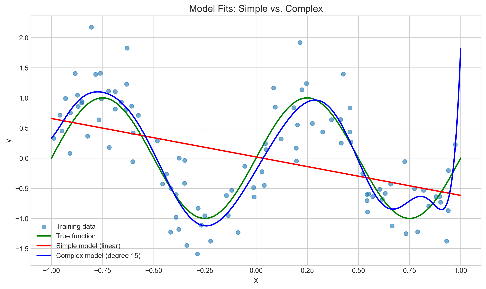
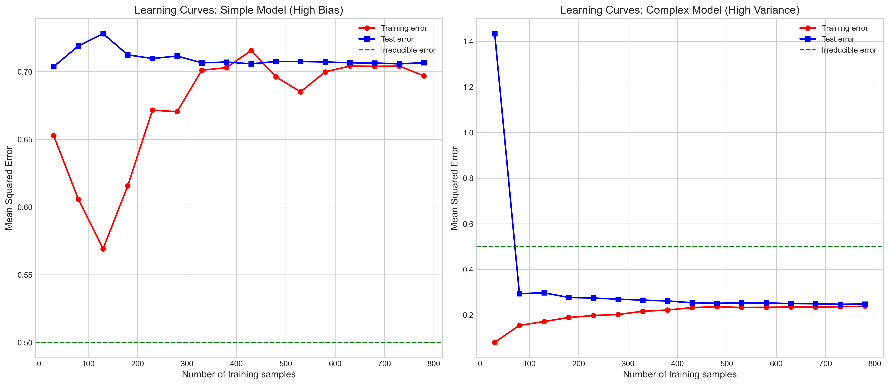
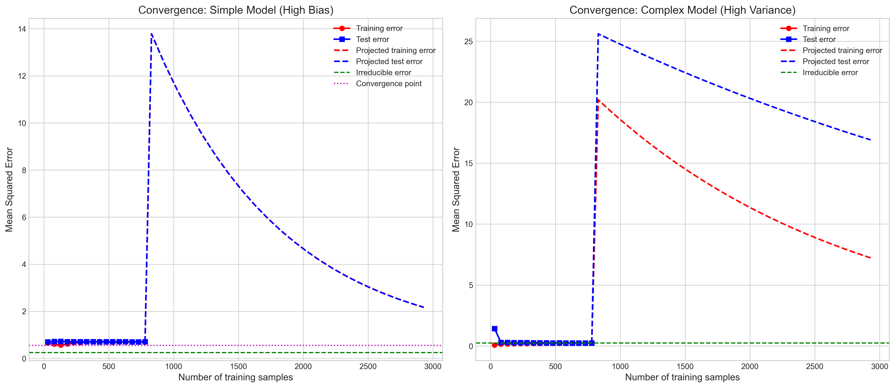
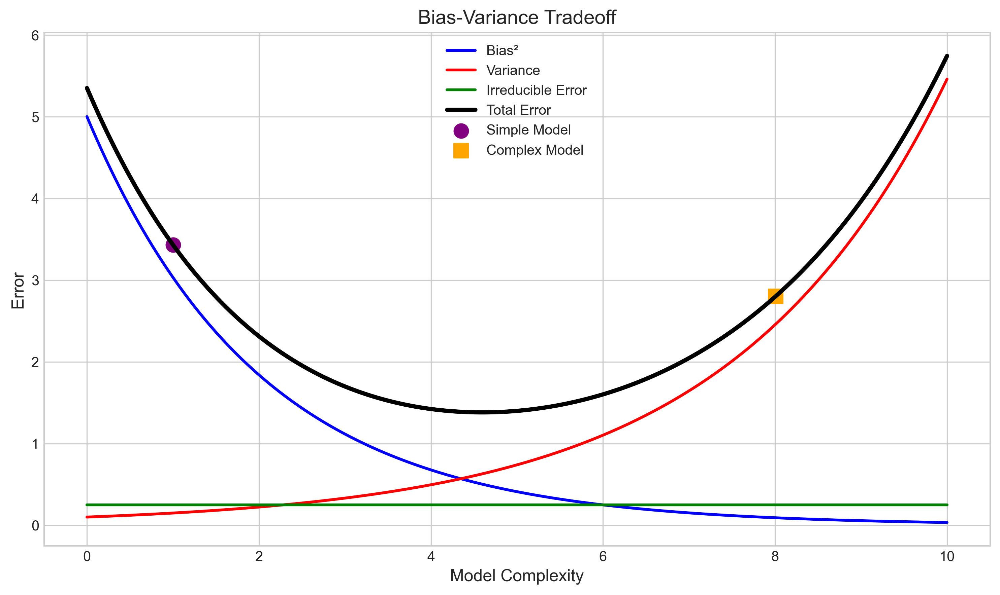

# Question 19: Behavior of Training and Test Error with Sample Size

## Problem Statement
Consider how expected training error and expected test error behave as a function of the number of training examples for models of different complexity.

### Task
1. Sketch by hand the expected training error curve and expected test error curve as functions of the number of training examples $N$ for:
   a. A simple model with high bias
   b. A complex model with high variance
2. Explain why the training error curve and test error curve converge as $N$ increases, and identify what value they converge to
3. Why does the training error typically increase with more training samples while the test error decreases?
4. Which model (simple or complex) requires more training data to achieve good generalization, and why?

## Understanding the Problem
This problem examines the relationship between model complexity, dataset size, and the behavior of training and test errors. Understanding these relationships is fundamental to machine learning as they inform decisions about model selection and data collection.

For this analysis, we consider two model types:
- **Simple model with high bias**: A model that is too simple to capture the underlying complexity of the data (underfitting)
- **Complex model with high variance**: A model that has the capacity to memorize training data but may not generalize well (overfitting)

The problem asks us to analyze how training and test errors change as we increase the number of training examples, and to understand the convergence behavior and practical implications.

## Solution

### Step 1: Visualizing model fits to understand bias and variance
To understand how models with different complexity fit the data, let's first visualize a simple model (linear) and a complex model (high-degree polynomial) fitted to the same dataset.

In this visualization:
- The green line represents the true underlying function (a sine wave)
- The red line shows the simple linear model that cannot capture the non-linear pattern (high bias)
- The blue line shows the complex polynomial model that closely follows the training data (high variance)

The simple model underfits because it lacks the capacity to represent the true function's complexity. The complex model has the potential to overfit by capturing noise in the training data rather than just the underlying pattern.

### Step 2: Analyzing learning curves for a simple model (high bias)
For a simple model with high bias, we can plot the training and test errors as functions of the training set size:

For the simple model (left plot):
- The training error (red line) starts high and remains relatively high as the number of samples increases
- The test error (blue line) also starts high and quickly approaches the training error
- Both errors converge to a level higher than the irreducible error (green dashed line)
- The convergence happens relatively quickly with a small number of training examples

This behavior occurs because the simple model cannot represent the true underlying function regardless of how much data is available. The gap between the convergence point and the irreducible error represents the bias of the model.

### Step 3: Analyzing learning curves for a complex model (high variance)
For a complex model with high variance, the behavior of learning curves is quite different:

For the complex model (right plot):
- The training error (red line) starts very low because the model can effectively memorize small datasets
- The test error (blue line) starts very high due to overfitting but decreases as more training examples are added
- There is a large gap between training and test error that narrows as the sample size increases
- Both errors converge much more slowly than with the simple model

This behavior demonstrates the high variance of complex models: with few examples, they can memorize the training data (leading to low training error) but fail to generalize (high test error). As more data becomes available, the model is forced to learn generalizable patterns rather than memorizing individual examples.

### Step 4: Understanding convergence behavior
To better understand how these errors eventually converge, we can project the learning curves beyond our sample size:

For the simple model (left):
- Both training and test errors quickly converge to the same value
- This convergence point is above the irreducible error due to the model's bias
- Adding more data beyond a certain point provides minimal improvement

For the complex model (right):
- Both errors converge much more slowly
- With sufficient data, they can potentially converge to the irreducible error
- The complex model requires substantially more data to achieve convergence

### Step 5: Understanding why training error increases with more data
For complex models, the training error often increases as we add more training examples because:

1. With few samples, complex models can perfectly memorize the training data
2. As more examples are added, perfect memorization becomes increasingly difficult
3. The loss function is averaged over more data points, making it harder to minimize for every point
4. The model must find generalizable patterns rather than overfitting to specific examples

For simpler models, the training error tends to be more stable as the sample size increases since they have limited capacity to memorize the data to begin with.

### Step 6: Understanding why test error decreases with more data
The test error generally decreases as we add more training examples because:

1. More training data allows better estimation of model parameters
2. Reduces the variance in predictions on unseen data
3. Forces the model to capture true patterns rather than noise
4. For complex models, prevents overfitting to training data peculiarities

The improvement in test error is more dramatic for complex models that initially suffer from high variance.

## Practical Implementation
The bias-variance tradeoff helps us understand the relationship between model complexity, error, and dataset size:

This visualization shows:
- Simple models (purple point) have high bias but low variance
- Complex models (orange point) have low bias but high variance
- The total error (black line) is minimized at an optimal level of complexity
- The irreducible error (green line) represents the lower bound for any model

The practical implications are:
1. With limited data, simpler models may outperform complex ones
2. With abundant data, complex models can achieve lower error
3. The optimal model complexity depends on the amount of available data

## Key Insights

### Characteristics of Simple Models (High Bias)
- Training error: Starts high and stays high regardless of sample size
- Test error: Similarly high, converges quickly toward training error
- Convergence point: Both converge to a value higher than irreducible error
- Problem: Underfitting - model is too simple to capture the true pattern
- Adding more data doesn't help much after a certain point

### Characteristics of Complex Models (High Variance)
- Training error: Starts very low (model can memorize small datasets)
- Test error: Starts very high, decreases with more data
- Gap: Large gap between training and test error that narrows with more data
- Convergence point: Both eventually converge to irreducible error (much slower)
- Problem: Overfitting with small datasets, improves with more data
- Benefits significantly from additional training data

### Why Training Error Often Increases with More Data
- With few samples, complex models can memorize the training data
- As more examples are added, perfect memorization becomes harder
- The optimization objective is averaged over more points
- For simpler models, training error may remain relatively stable

### Why Test Error Decreases with More Data
- More training data leads to better parameter estimation
- Reduces variance in predictions on unseen data
- Model captures true patterns rather than noise
- For complex models, prevents overfitting to training noise

### Data Requirements for Different Models
- Complex model (high variance) requires substantially more training data
- Simple model converges quickly but to a suboptimal error level
- Complex model converges slowly but can achieve lower error eventually
- With limited data, simpler models may outperform complex ones
- With abundant data, complex models can outperform simple ones

## Conclusion
- Training and test errors follow distinct patterns as training sample size increases, depending on model complexity
- For simple models with high bias, both errors converge quickly to a value above the irreducible error
- For complex models with high variance, errors converge slowly but can potentially reach lower values
- Training error typically increases with more data for complex models as perfect memorization becomes harder
- Test error decreases with more data as the model learns generalizable patterns rather than noise
- Complex models require substantially more training data to achieve good generalization than simple models
- The optimal model choice depends on the available data size and the true complexity of the underlying relationship 