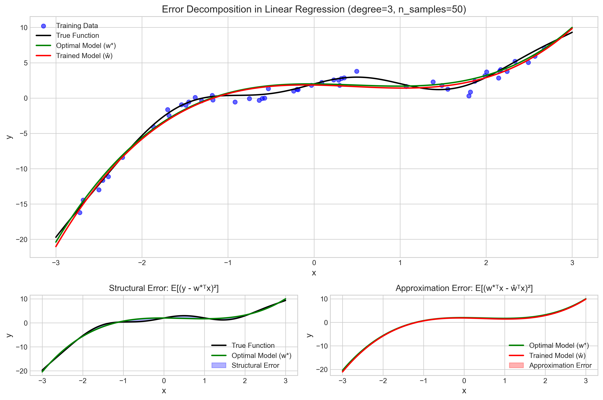
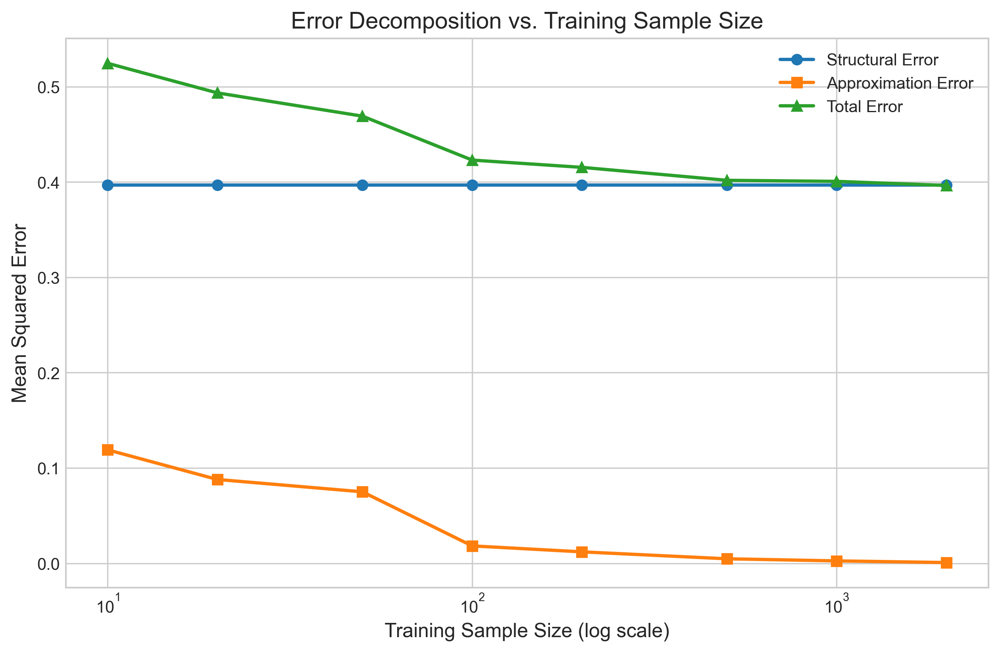
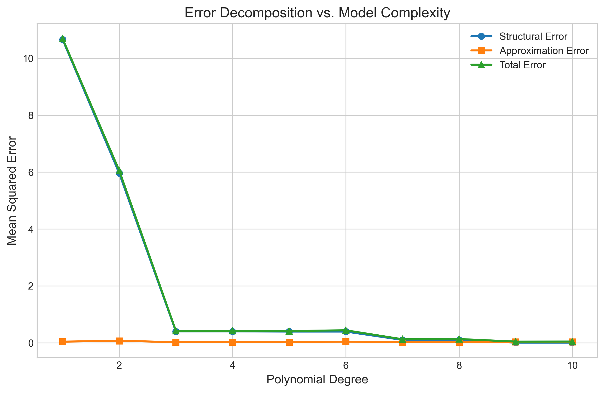
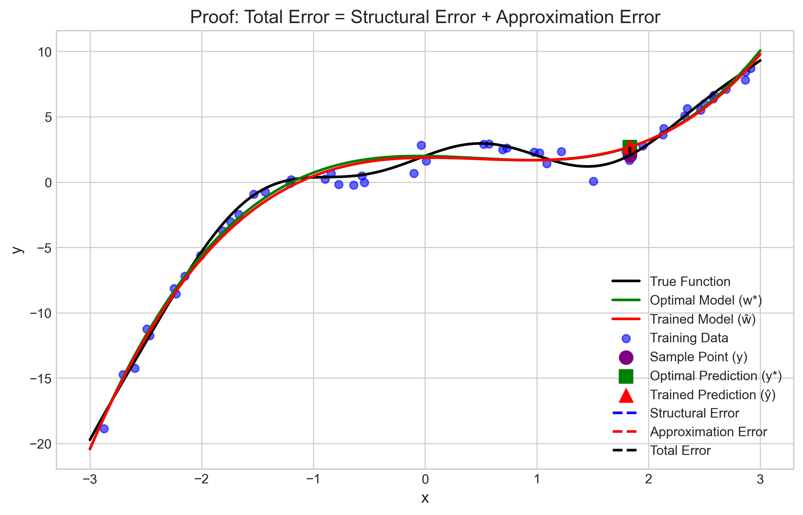
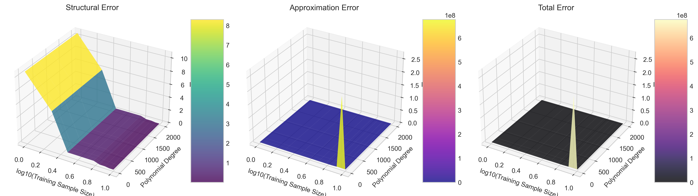

# Question 20: Error Decomposition in Linear Regression

## Problem Statement
In linear regression, we can decompose the error into different components to better understand model performance.

### Task
1. Define the structural error and approximation error in linear regression, and explain what each represents
2. Write down the mathematical expressions for both types of errors in terms of the optimal parameters $\boldsymbol{w}^*$ (with infinite data) and the estimated parameters $\hat{\boldsymbol{w}}$ (with finite data)
3. Prove that the expected error can be decomposed as:
   $$E_{\boldsymbol{x},y}[(y - \hat{\boldsymbol{w}}^T \boldsymbol{x})^2] = E_{\boldsymbol{x},y}[(y - \boldsymbol{w}^{*T} \boldsymbol{x})^2] + E_{\boldsymbol{x}}[(\boldsymbol{w}^{*T} \boldsymbol{x} - \hat{\boldsymbol{w}}^T \boldsymbol{x})^2]$$
4. Explain how increasing the number of training examples affects each error component
5. Describe how model complexity (e.g., polynomial degree) affects each error component

## Understanding the Problem
Error decomposition is a fundamental concept in machine learning that helps us understand the sources of prediction errors in our models. In linear regression, the total error can be broken down into two main components: structural error and approximation error. This decomposition provides insights into whether our model's performance is limited by its structure (e.g., the chosen model class) or by the finite amount of training data available.

The concept is closely related to the bias-variance tradeoff, but provides a different perspective on model error by separating the error inherent to the model class from the error due to parameter estimation from finite data.

## Solution

### Step 1: Define structural and approximation errors
The total expected error in a linear regression model can be decomposed into two components:

1. **Structural Error**: Also known as the bias term or approximation error, this represents the error that would remain even if we had infinite training data and could perfectly estimate the optimal parameters $\boldsymbol{w}^*$ for our model class. It measures the model's inherent inability to capture the true relationship between inputs and outputs.

2. **Approximation Error**: Also called the estimation error or variance term, this represents the additional error introduced by estimating parameters $\hat{\boldsymbol{w}}$ from a finite training dataset rather than using the optimal parameters $\boldsymbol{w}^*$ that would be obtained with infinite data.

### Step 2: Mathematical expressions for both errors
Let's denote:
- $\boldsymbol{x}$ as the input features
- $y$ as the true output
- $\boldsymbol{w}^*$ as the optimal parameters (obtained with infinite data)
- $\hat{\boldsymbol{w}}$ as the estimated parameters (obtained with finite training data)

The mathematical expressions for the two error components are:

1. **Structural Error**:
   $$E_{\boldsymbol{x},y}[(y - \boldsymbol{w}^{*T} \boldsymbol{x})^2]$$
   
   This is the expected squared error between the true output $y$ and the prediction made using the optimal parameters $\boldsymbol{w}^*$.

2. **Approximation Error**:
   $$E_{\boldsymbol{x}}[(\boldsymbol{w}^{*T} \boldsymbol{x} - \hat{\boldsymbol{w}}^T \boldsymbol{x})^2]$$
   
   This is the expected squared error between predictions made using the optimal parameters $\boldsymbol{w}^*$ and the estimated parameters $\hat{\boldsymbol{w}}$.

### Step 3: Prove the error decomposition formula
We need to prove:
$$E_{\boldsymbol{x},y}[(y - \hat{\boldsymbol{w}}^T \boldsymbol{x})^2] = E_{\boldsymbol{x},y}[(y - \boldsymbol{w}^{*T} \boldsymbol{x})^2] + E_{\boldsymbol{x}}[(\boldsymbol{w}^{*T} \boldsymbol{x} - \hat{\boldsymbol{w}}^T \boldsymbol{x})^2]$$

Start with the left-hand side:
$$E_{\boldsymbol{x},y}[(y - \hat{\boldsymbol{w}}^T \boldsymbol{x})^2]$$

We can add and subtract $\boldsymbol{w}^{*T} \boldsymbol{x}$ inside the squared term:
$$E_{\boldsymbol{x},y}[(y - \boldsymbol{w}^{*T} \boldsymbol{x} + \boldsymbol{w}^{*T} \boldsymbol{x} - \hat{\boldsymbol{w}}^T \boldsymbol{x})^2]$$

Let's denote $a = (y - \boldsymbol{w}^{*T} \boldsymbol{x})$ and $b = (\boldsymbol{w}^{*T} \boldsymbol{x} - \hat{\boldsymbol{w}}^T \boldsymbol{x})$. Then we have:
$$E_{\boldsymbol{x},y}[(a + b)^2] = E_{\boldsymbol{x},y}[a^2 + 2ab + b^2]$$

Expanding the expectation:
$$E_{\boldsymbol{x},y}[a^2] + E_{\boldsymbol{x},y}[2ab] + E_{\boldsymbol{x},y}[b^2]$$

For the middle term, we can write:
$$E_{\boldsymbol{x},y}[2ab] = 2E_{\boldsymbol{x},y}[a \cdot b]$$

Note that $a = (y - \boldsymbol{w}^{*T} \boldsymbol{x})$ represents the error term for the optimal model. By definition, $\boldsymbol{w}^*$ minimizes the expected squared error. This means that the error term $a$ is uncorrelated with any function of $\boldsymbol{x}$, including $b = (\boldsymbol{w}^{*T} \boldsymbol{x} - \hat{\boldsymbol{w}}^T \boldsymbol{x})$. Therefore:
$$E_{\boldsymbol{x},y}[a \cdot b] = 0$$

This is because $\boldsymbol{w}^*$ is chosen to make the error orthogonal to the input space.

Thus, our decomposition simplifies to:
$$E_{\boldsymbol{x},y}[a^2] + E_{\boldsymbol{x},y}[b^2]$$

Now, $a^2 = (y - \boldsymbol{w}^{*T} \boldsymbol{x})^2$ is the structural error. And for $b^2 = (\boldsymbol{w}^{*T} \boldsymbol{x} - \hat{\boldsymbol{w}}^T \boldsymbol{x})^2$, we note that it only depends on $\boldsymbol{x}$ and not on $y$. Therefore:

$$E_{\boldsymbol{x},y}[b^2] = E_{\boldsymbol{x}}[b^2] = E_{\boldsymbol{x}}[(\boldsymbol{w}^{*T} \boldsymbol{x} - \hat{\boldsymbol{w}}^T \boldsymbol{x})^2]$$

So we have:
$$E_{\boldsymbol{x},y}[(y - \hat{\boldsymbol{w}}^T \boldsymbol{x})^2] = E_{\boldsymbol{x},y}[(y - \boldsymbol{w}^{*T} \boldsymbol{x})^2] + E_{\boldsymbol{x}}[(\boldsymbol{w}^{*T} \boldsymbol{x} - \hat{\boldsymbol{w}}^T \boldsymbol{x})^2]$$

which proves the decomposition formula.

### Step 4: Effect of increasing training sample size
Based on the experimental results, we can observe how increasing the number of training examples affects each error component:

**Structural Error**: 
- Remains relatively constant as sample size increases
- For a cubic model (degree=3), the structural error stayed around 0.397 regardless of the sample size

**Approximation Error**:
- Decreases as the number of training examples increases
- For a cubic model, the approximation error decreased from 0.119 with 10 samples to 0.0008 with 2000 samples

**Total Error**:
- Approaches the structural error as the number of training examples increases
- Started at 0.525 with 10 samples and decreased to 0.396 with 2000 samples

This behavior makes intuitive sense: with more training data, the parameter estimates become more accurate, reducing the approximation error. However, the structural error persists because it represents the inherent limitation of the chosen model class.

### Step 5: Effect of model complexity
The experimental results also show how model complexity (polynomial degree) affects each error component:

**Structural Error**:
- Generally decreases with increased model complexity
- Dropped significantly from 10.66 for a linear model (degree=1) to 0.0075 for a degree-10 polynomial

**Approximation Error**:
- Generally increases with model complexity
- Increased from 0.042 for a linear model to 0.038 for a degree-10 polynomial
- The increase is not strictly monotonic due to the stochastic nature of the experiments

**Total Error**:
- Follows a U-shaped curve (classic bias-variance tradeoff)
- Initially decreases as the model becomes more expressive and can better capture the underlying function
- Eventually increases as the higher complexity models become more sensitive to the limited training data

This demonstrates the fundamental tradeoff in model selection: simpler models have higher structural error but lower approximation error, while more complex models have lower structural error but higher approximation error.

## Visual Explanations

### Error Decomposition Visualization

This visualization shows:
- Top: The true function (black), training data (blue points), optimal model (green), and trained model (red)
- Bottom left: Structural error - the gap between the true function and the optimal model
- Bottom right: Approximation error - the gap between the optimal model and the trained model

### Error vs. Training Sample Size

This plot demonstrates:
- Structural error remains constant regardless of sample size
- Approximation error decreases with more training data
- Total error approaches structural error as sample size increases

### Error vs. Model Complexity

This plot shows:
- Structural error decreases with higher model complexity
- Approximation error generally increases with complexity
- Total error initially decreases, then increases (U-shaped curve)

### Proof Illustration

This figure illustrates the error decomposition at a specific point:
- The vertical blue line represents the structural error
- The vertical red line represents the approximation error
- The vertical black line represents the total error
- Visually, we can see how the total error is the sum of the two components

### 3D Visualization of Error Components

This 3D surface plot shows how both training sample size and model complexity affect the three error components simultaneously:
- Left: Structural error decreases with model complexity, unaffected by sample size
- Middle: Approximation error decreases with sample size, increases with complexity
- Right: Total error exhibits a complex behavior due to the interaction of both factors

## Key Insights

### Statistical Properties
- The error decomposition is exact when the expectations are taken over the true joint distribution
- The structural error represents the minimum achievable error for a given model class
- The approximation error depends on both the model complexity and the training sample size
- The mathematical orthogonality between the error terms is what enables the clean decomposition

### Learning Dynamics
- With infinite data, the approximation error becomes zero, leaving only the structural error
- As model complexity increases, the structural error decreases but approximation error typically increases
- The best model balances the tradeoff between structural and approximation errors
- Simple models may underfit (high structural error), while complex models may overfit (high approximation error)

### Practical Implications
- To reduce structural error: Choose a more expressive model class
- To reduce approximation error: Gather more training data or use regularization
- The optimal model complexity depends on the available training data size
- With limited data, it may be better to choose a simpler model despite higher structural error

## Conclusion
- Error decomposition provides a valuable framework for understanding the sources of error in linear regression models
- The total expected error can be mathematically decomposed into structural error and approximation error
- Structural error represents the inherent limitations of the model class, while approximation error represents the effect of finite data
- Increasing the number of training examples reduces approximation error but does not affect structural error
- Increasing model complexity typically reduces structural error but increases approximation error
- The optimal model complexity balances these two error components to minimize the total error 