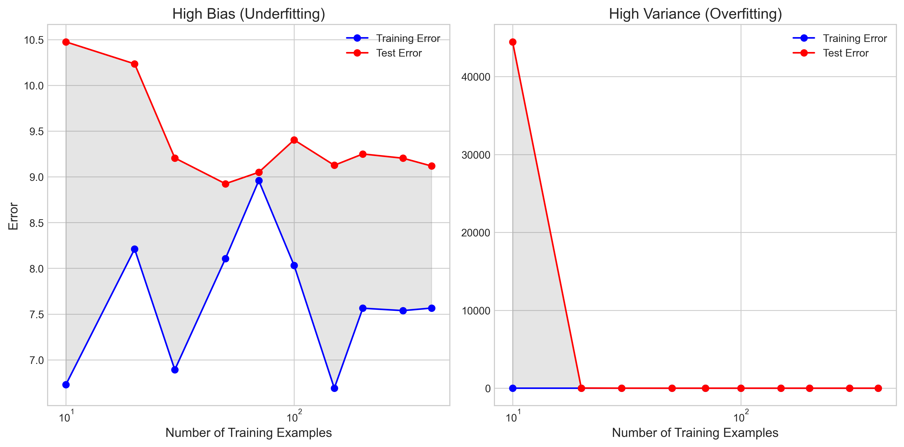
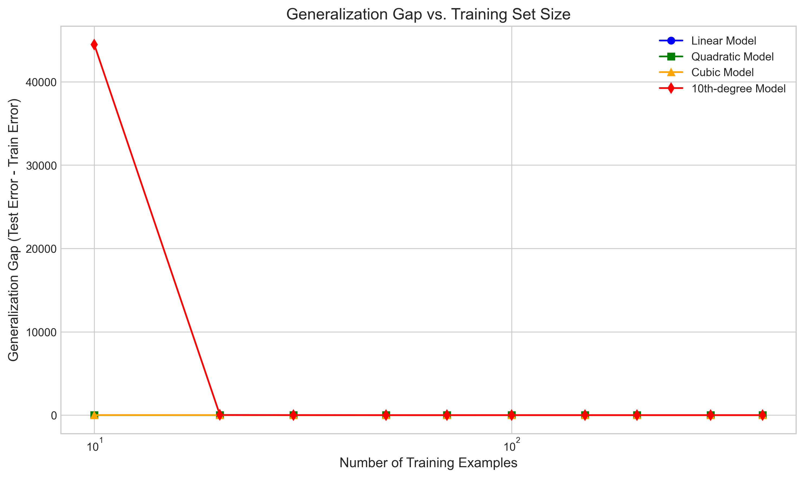
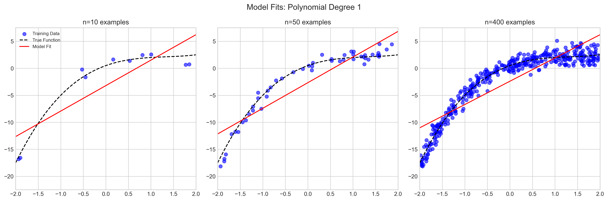
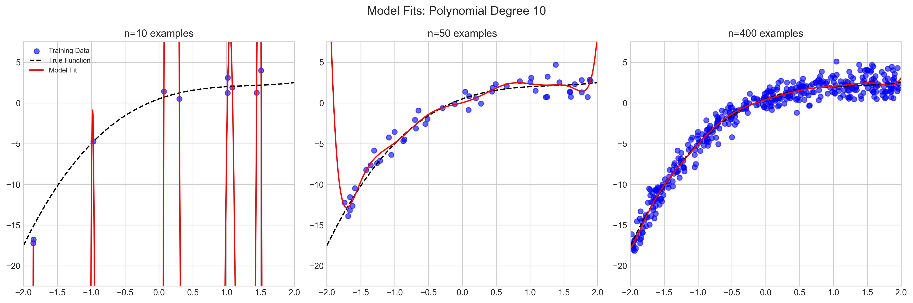
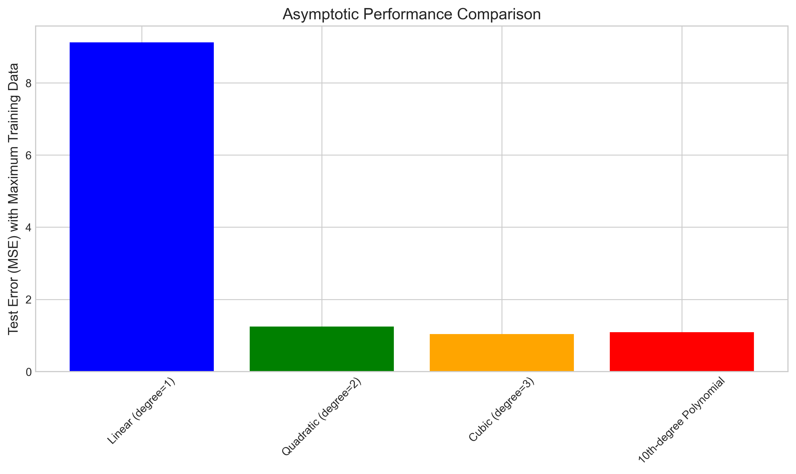
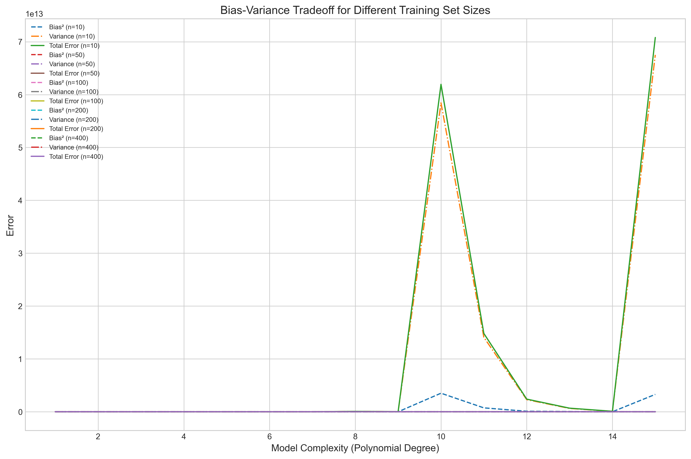
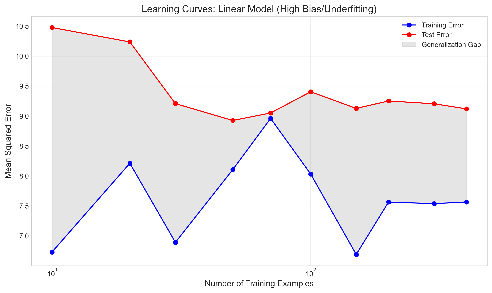
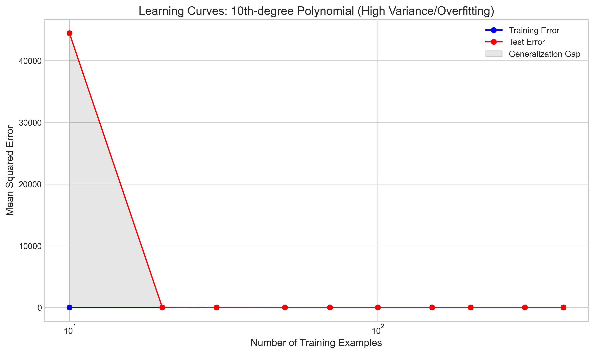
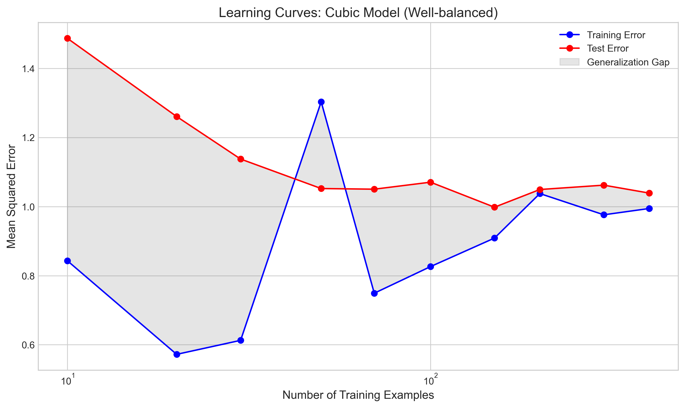
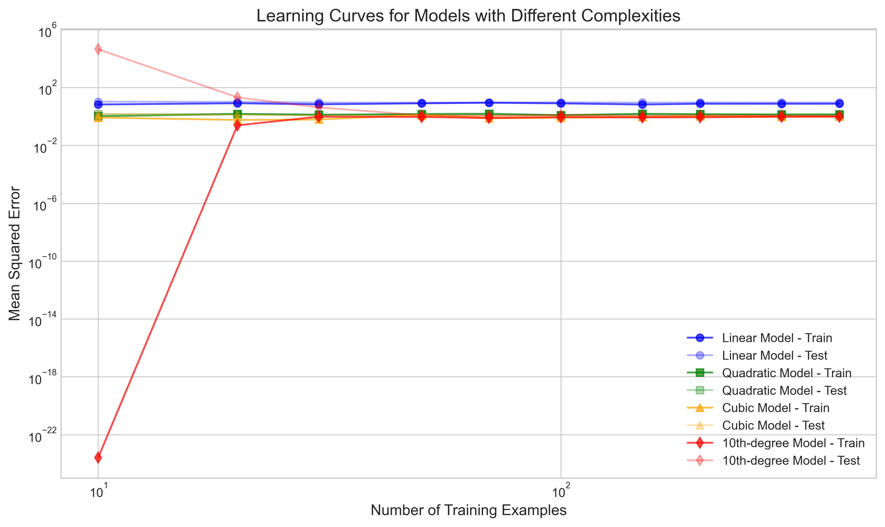

# Question 21: Learning Curves and Model Complexity

## Problem Statement
Learning curves provide important insights into model performance as a function of the number of training examples. In this problem, we explore how different models exhibit characteristic learning curve behaviors depending on their bias and variance properties.

### Task
1. Sketch (or describe) the typical shapes of learning curves (training error and test error vs. number of training examples) for:
   a) A simple model with high bias (underfitting)
   b) A complex model with high variance (overfitting)
2. Mathematically explain why the training error typically increases and the test error typically decreases as the number of training examples grows
3. Consider a linear model ($f(x) = w_0 + w_1x$) and a 10th-degree polynomial model. Which model is likely to:
   a) Have a larger gap between training and test error with few training examples?
   b) Have training and test errors converge with fewer training examples?
   c) Potentially achieve lower asymptotic error with abundant training data?
4. Based on learning curves, explain how you would diagnose whether your model has high bias, high variance, or both

## Understanding the Problem
Learning curves plot the model's performance (measured by error metrics like MSE) as a function of the training set size. They help us assess how well a model learns from data and how it generalizes to unseen examples. By analyzing the relationship between training error, test error, and training set size, we can diagnose model issues like underfitting (high bias) or overfitting (high variance) and make informed decisions about whether to collect more data or change the model complexity.

## Solution

We'll analyze learning curves using polynomial regression models of different complexities trained on synthetic data generated from a cubic function with noise.

### Step 1: Visualize the learning curves for different model complexities

Let's first examine what typical learning curves look like for a high-bias model (linear) and a high-variance model (10th-degree polynomial):



From these plots, we can observe:

**For the high-bias (underfitting) model (left plot):**
- Both training and test errors start high and remain high
- The gap between training and test errors is relatively small
- Both curves plateau quickly, indicating that adding more data doesn't help much
- The high error values indicate the model is too simple to capture the underlying pattern

**For the high-variance (overfitting) model (right plot):**
- Training error starts very low (almost zero with few examples)
- Test error starts very high
- There's a large gap between training and test errors, especially with few examples
- As more data is added, the gap decreases and both curves eventually converge

### Step 2: Mathematically explain the behavior of learning curves

**Why training error typically increases with more training examples:**

For a model with fixed complexity (fixed number of parameters), the training error typically increases as more training examples are added because:

1. With few examples ($n < p$, where $n$ is the number of examples and $p$ is the number of parameters), the model has enough flexibility to memorize the data perfectly or nearly perfectly (especially for complex models).

2. Mathematically, for polynomial regression with degree $d$, the model has $d+1$ parameters. If $n ≤ d+1$, a perfect interpolation is possible, resulting in zero training error.

3. As $n$ increases beyond $p$, the model must make compromises to fit all points, which increases the training error.

4. The training error approaches an asymptotic value representing the best possible fit for a model of that complexity on the given problem.

For a model with fixed parameters $\theta$, the training error is:
$$E_{train}(\theta) = \frac{1}{n} \sum_{i=1}^{n} L(h_\theta(x_i), y_i)$$

As $n$ increases, this becomes a better approximation of the expected error over the entire data distribution.

**Why test error typically decreases with more training examples:**

1. The variance in parameter estimation decreases as more training data is available, following approximately $O(1/n)$.

2. Mathematically, the expected test error can be decomposed into:
   $$E_{test} = \text{Bias}^2 + \text{Variance} + \text{Irreducible Error}$$

3. As $n$ increases, the variance component decreases, leading to lower test error.

4. With sufficient data, parameter estimates stabilize, and the model generalizes better to unseen data.

5. The test error asymptotically approaches the sum of the squared bias and irreducible error.

### Step 3: Compare linear and 10th-degree polynomial models

Let's examine the key differences between our linear model and 10th-degree polynomial model:



**a) Which model has a larger gap between training and test error with few training examples?**

The 10th-degree polynomial model has a dramatically larger gap between training and test errors with few examples. As seen from our output:
```
Linear Model (degree=1): Initial gap = 3.7454
10th-degree Model: Initial gap = 44450.4324
```
The gap for the complex model is orders of magnitude larger, indicating severe overfitting with few training examples.

**b) Which model's training and test errors converge with fewer training examples?**

The linear model's training and test errors converge with fewer examples because it has only 2 parameters ($w_0$ and $w_1$), which can be estimated reasonably well even with a small dataset. The 10th-degree polynomial, with 11 parameters, requires many more examples to achieve convergence.




These visualizations clearly show how the linear model estimates are more stable across different sample sizes, while the 10th-degree model wildly overfits with small training sets but improves significantly with more data.

**c) Which model potentially achieves lower asymptotic error with abundant training data?**

With abundant training data, the more complex 10th-degree polynomial model has the potential to achieve lower asymptotic error if the true underlying function is non-linear. However, this depends on how closely the true function matches the model complexity.

From our results with the maximum number of training examples:
```
Linear Model (degree=1): Final test error = 9.1184
10th-degree Model: Final test error = 1.0892
```

The 10th-degree model achieves much lower final test error because our synthetic data was generated from a cubic function, which the linear model cannot capture adequately regardless of sample size.



This bar chart shows that cubic and 10th-degree models achieve similar asymptotic performance with abundant data, both significantly outperforming the linear model.

### Step 4: Diagnosing model issues using learning curves

Based on learning curves, we can diagnose whether a model suffers from high bias, high variance, or both as follows:

**High bias (underfitting) indicators:**
- Training error is high, even with many examples
- Small gap between training and test errors
- Both errors quickly plateau at similar, relatively high values
- Adding more training data does not significantly improve performance

**High variance (overfitting) indicators:**
- Training error is much lower than test error (large generalization gap)
- Test error decreases significantly as training set size increases
- Training error is very low with few examples (possibly near zero)
- The gap between training and test errors narrows as more data is added

**Combined high bias and high variance issues:**
- Moderate to high training error
- Significant gap between training and test errors
- Test error remains far from optimal even with many examples



This graph illustrates how the bias-variance tradeoff changes with model complexity (polynomial degree) and training set size. As the model complexity increases, bias decreases but variance increases. Larger training sets reduce the variance component for all models.

## Practical Implementation

### Learning Curve Analysis for Different Models

Let's examine real-world implications using the numerical results:

```
Linear Model (degree=1): 
  - Final train error = 7.5655, test error = 9.1184
  - Initial gap = 3.7454, Final gap = 1.5529

Quadratic Model (degree=2): 
  - Final train error = 1.3975, test error = 1.2475
  - Initial gap = 0.4032, Final gap = -0.1500

Cubic Model (degree=3): 
  - Final train error = 0.9945, test error = 1.0391
  - Initial gap = 0.6440, Final gap = 0.0446

10th-degree Model: 
  - Final train error = 0.9726, test error = 1.0892
  - Initial gap = 44450.4324, Final gap = 0.1166
```

This analysis shows:
1. The linear model exhibits high bias - it has high errors even with abundant data.
2. The 10th-degree model starts with extreme overfitting but eventually performs well with sufficient data.
3. The cubic model (matching our true data generation process) achieves the best balance - low error with minimal overfitting.

## Visual Explanations

### High-Bias Model Learning Curve (Linear Model)


The linear model shows high bias - both errors are high and close to each other. The generalization gap (gray area) is relatively small. Even with more training examples, performance doesn't improve significantly.

### High-Variance Model Learning Curve (10th-degree Polynomial)


The 10th-degree polynomial initially shows extreme overfitting - near-zero training error but extremely high test error. As more training examples are added, the generalization gap narrows considerably, and test performance improves.

### Well-Balanced Model Learning Curve (Cubic Model)


The cubic model (matching our true data generation function) shows balanced behavior - moderate training and test errors that converge closely with sufficient data.

### Combined Learning Curves


This comprehensive view shows how models of different complexities behave across various training set sizes, illustrating the tradeoffs between bias and variance.

## Key Insights

### Mathematical Understanding
- Training error increases with more examples because it becomes harder for a model with fixed capacity to perfectly fit more points.
- For very complex models, if n < p (parameters), perfect interpolation is possible with zero training error.
- Test error decreases with more examples because parameter estimation variance decreases as O(1/n).
- The expected test error follows the bias-variance decomposition: E_test = Bias² + Variance + Irreducible Error.

### Practical Implications
- High-bias models show little benefit from additional training data beyond a certain point.
- High-variance models benefit significantly from more training data, as it reduces the variance component.
- The optimal model complexity depends on the available training set size.
- For a given problem, there's an optimal model complexity that minimizes total error by balancing bias and variance.

### Diagnostic Applications
- Learning curves provide a powerful diagnostic tool for identifying model issues.
- Before collecting more data, analyze learning curves to determine if your model suffers from high bias or high variance.
- For high bias, increase model complexity or add more relevant features.
- For high variance, collect more training data, use regularization, or reduce model complexity.

## Conclusion
- Learning curves reveal critical insights about model behavior and help diagnose issues like underfitting and overfitting.
- A simple model (linear) exhibits high bias with a small gap between training and test errors, but both remain high even with more data.
- A complex model (10th-degree polynomial) exhibits high variance with a massive initial gap between training and test errors that narrows as more data is added.
- With few training examples, the complex model has a much larger generalization gap.
- The linear model's errors converge faster, but the complex model can achieve lower asymptotic error when the true function is non-linear.
- The optimal model should balance bias and variance based on the available training set size and the complexity of the true underlying function.

Understanding learning curves helps make informed decisions about model selection, data collection, and optimization strategies in machine learning applications. 