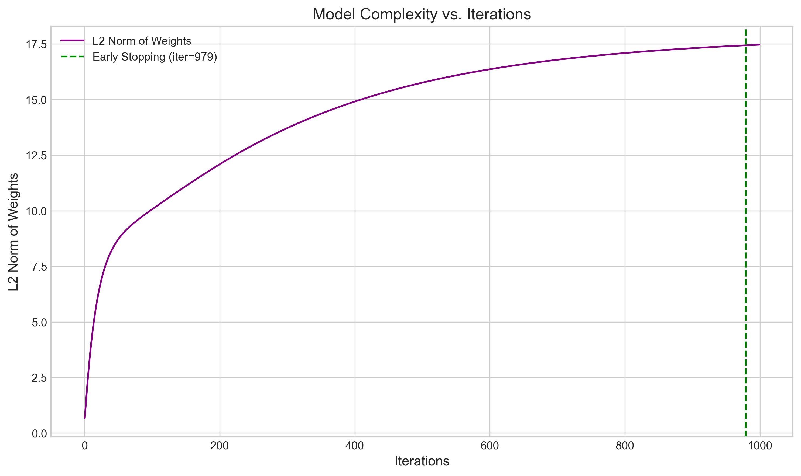
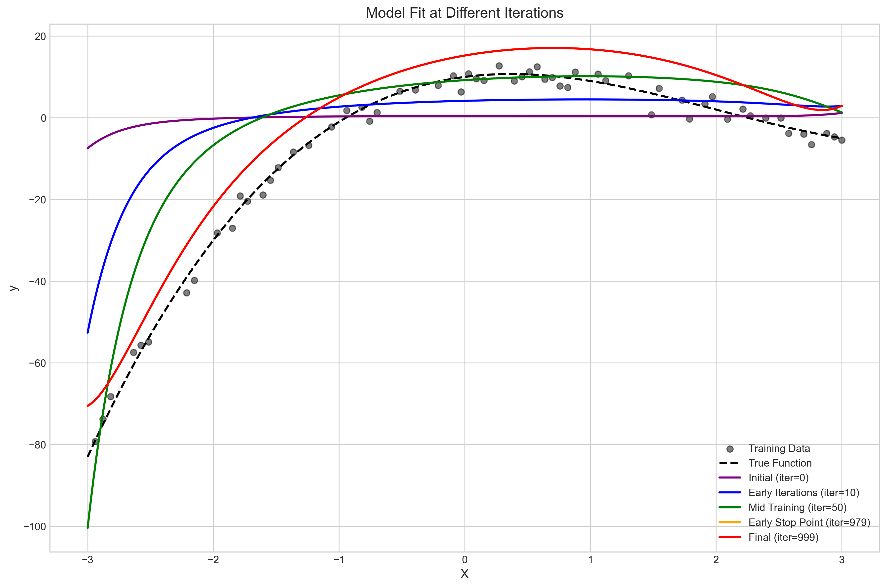
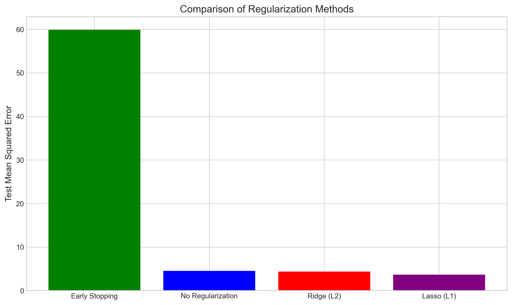
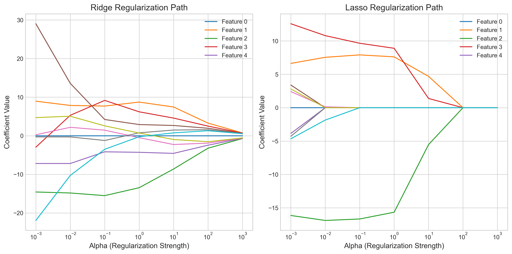
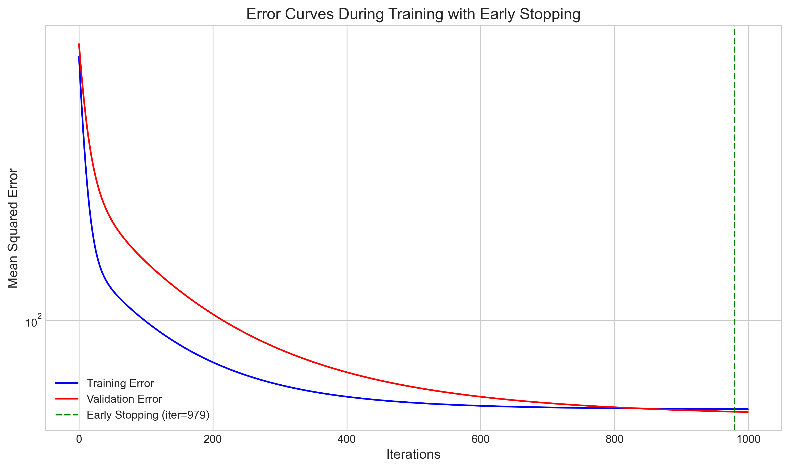
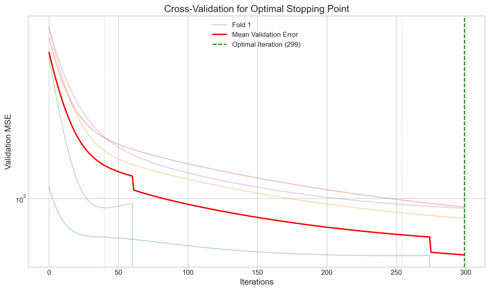
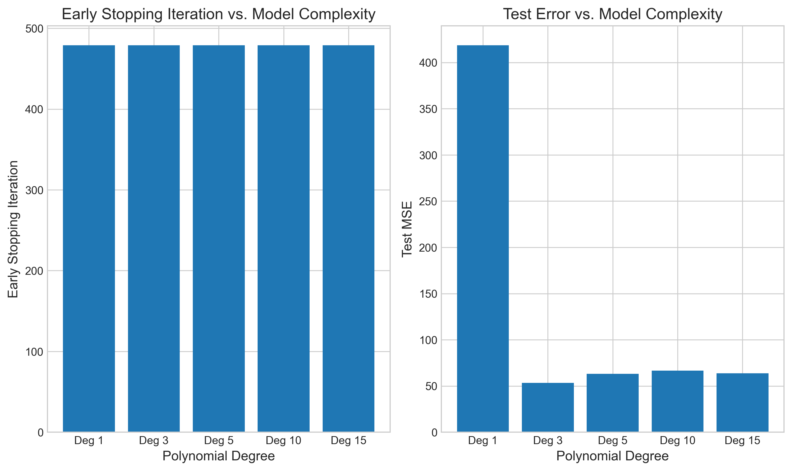
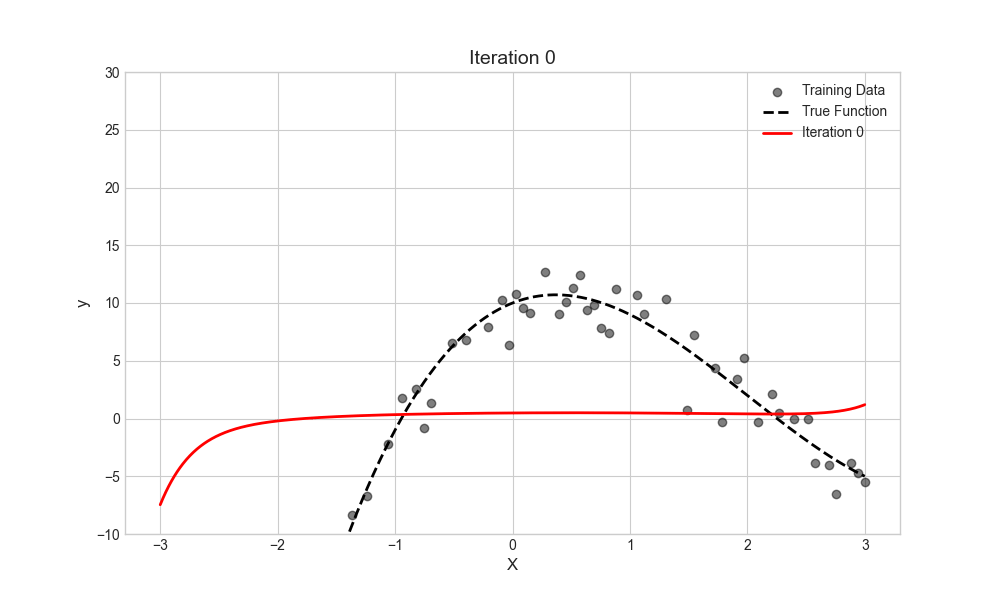

# Question 10: Early Stopping as Implicit Regularization

## Problem Statement
Early stopping in iterative optimization methods (like gradient descent) can be viewed as a form of implicit regularization.

### Task
1. Explain how early stopping acts as a regularization technique
2. Compare early stopping to explicit regularization methods like Ridge and Lasso
3. Describe the relationship between the number of iterations and the effective model complexity
4. Explain how you would determine the optimal stopping point in practice

## Understanding the Problem
Regularization in machine learning refers to techniques used to prevent overfitting by imposing constraints on model parameters. While explicit regularization methods like Ridge (L2) and Lasso (L1) add penalty terms to the loss function, early stopping is an implicit regularization technique that terminates the training process before the model converges to the minimum of the training loss.

Early stopping is particularly relevant in iterative optimization methods such as gradient descent, which is widely used for training neural networks and other complex models. Understanding how early stopping works as a regularization technique helps us build more generalizable models without explicitly modifying the loss function.

## Solution

### Step 1: How Early Stopping Acts as Regularization

Early stopping works as a regularization technique by preventing the model from overfitting to the training data. In iterative optimization methods like gradient descent, the model parameters are updated incrementally to minimize the training error. As training progresses, the model gradually fits the training data better, but at some point, it starts fitting the noise in the data rather than the underlying pattern.

The key insight is that during training, the model's complexity effectively increases with the number of iterations. This happens because the weights can grow in magnitude and develop more complex patterns over time. By stopping the training process early—before the model fully converges on the training data—we limit this effective complexity.

### Step 2: Relationship Between Iterations and Model Complexity

To understand how iterations relate to model complexity, we can examine the progression of weight magnitudes during training. As shown in the following visualization, the L2 norm of the weights (a measure of model complexity) increases with the number of iterations:



The green vertical line indicates the early stopping point determined by validation performance. We can observe that:

1. The weight magnitudes (L2 norm) grow progressively larger with more iterations
2. Early in training, the model has smaller weights, corresponding to a simpler model
3. Later in training, the model's weights grow larger, increasing its complexity
4. Early stopping effectively constrains the model to have smaller weights, similar to L2 regularization

The following figure shows how the model's fit evolves with the number of iterations:



We can observe that:
- Initial iterations (purple): The model is too simple and underfits
- Mid training (green): The model improves and starts fitting the underlying pattern
- Early stopping point (orange): The model achieves good generalization
- Final iterations (red): The model starts to overfit, capturing noise in the training data

### Step 3: Comparison with Explicit Regularization Methods

Early stopping can be compared with explicit regularization methods like Ridge (L2) and Lasso (L1):



| Method | Mechanism | Effect | Implementation |
|--------|-----------|--------|----------------|
| **Early Stopping** | Terminates training before convergence | Limits effective complexity by keeping weights smaller | Requires validation set to monitor performance |
| **Ridge (L2)** | Adds penalty proportional to sum of squared weights | Shrinks all weights toward zero, but rarely to exactly zero | Adds λ‖w‖² to loss function |
| **Lasso (L1)** | Adds penalty proportional to sum of absolute weights | Shrinks some weights exactly to zero, performing feature selection | Adds λ‖w‖₁ to loss function |

Ridge and Lasso regularization produce different weight trajectories as the regularization strength (α) changes:



As shown, Ridge gradually shrinks all weights, while Lasso tends to drive some weights exactly to zero.

Early stopping can be viewed as approximating L2 regularization in many cases. This connection can be formalized mathematically for linear models, where early stopping effectively constrains the weights to lie within a ball around the initialization point, similar to how L2 regularization constrains weights around zero.

### Step 4: Error Dynamics and Early Stopping

The key principle of early stopping is to monitor both training and validation error during training:



The figure shows:
- Training error (blue): Continuously decreases with more iterations
- Validation error (red): Initially decreases, but eventually starts increasing
- Early stopping point (green vertical line): The point where validation error starts to increase

This pattern demonstrates the classic bias-variance tradeoff:
- Too few iterations: High bias (underfitting)
- Too many iterations: High variance (overfitting)
- Optimal number of iterations: Best balance between bias and variance

### Step 5: Determining Optimal Stopping Point in Practice

In practice, the optimal stopping point can be determined using several methods:

1. **Validation-based stopping**: Monitor validation performance during training and stop when it stops improving or starts degrading. To avoid stopping too early due to noise, a "patience" parameter is often used, which means training continues for a certain number of iterations after the validation error starts increasing.

2. **Cross-validation**: Use k-fold cross-validation to find the optimal number of iterations across multiple dataset splits:



This figure shows validation errors across 5 different cross-validation folds (light lines) and their mean (red line). The green vertical line indicates the optimal stopping point based on average validation performance.

3. **Model complexity adaptation**: The optimal stopping point varies with model complexity. More complex models typically require earlier stopping:



The left plot shows that higher-degree polynomial models (more complex) often benefit from earlier stopping, while the right plot shows the resulting test errors after early stopping is applied.

## Practical Implementation

### Implementation of Early Stopping in Gradient Descent

Here's how early stopping is implemented in practice with gradient descent:

```python
def gradient_descent_with_early_stopping(X_train, y_train, X_val, y_val, max_iterations=1000):
    # Initialize weights
    weights = initialize_weights()
    
    # Keep track of best validation performance
    best_val_error = float('inf')
    best_weights = None
    no_improvement_count = 0
    patience = 20  # Number of iterations to wait for improvement
    
    for iteration in range(max_iterations):
        # Update weights based on training data
        weights = update_weights(weights, X_train, y_train)
        
        # Compute validation error
        val_error = compute_error(X_val, y_val, weights)
        
        # Early stopping logic
        if val_error < best_val_error:
            best_val_error = val_error
            best_weights = weights.copy()
            no_improvement_count = 0
        else:
            no_improvement_count += 1
        
        # If no improvement for 'patience' iterations, stop
        if no_improvement_count >= patience:
            print(f"Early stopping at iteration {iteration}")
            break
    
    return best_weights
```

The key components are:
1. Maintaining the best weights found based on validation performance
2. Implementing a "patience" parameter to avoid stopping due to noise
3. Tracking how many iterations have passed without improvement

### Visualization of Training Evolution with Early Stopping

The following animation shows how the model fit evolves during training, with the early stopping point highlighted:



## Visual Explanations

### Training and Validation Error Curves


This visualization shows the training error (blue) and validation error (red) throughout the training process. The vertical green line marks the early stopping point, which occurs when the validation error has not improved for a specified number of iterations (patience). Note that the training error continues to decrease after this point, but the validation error starts to increase, indicating overfitting.

### Model Complexity Growth During Training


This visualization shows how the model complexity, measured as the L2 norm of the weights, increases with more iterations. Early stopping (green vertical line) prevents the weights from growing too large, effectively constraining the model complexity similar to L2 regularization.

### Cross-Validation for Optimal Stopping Point


This visualization shows validation error curves for multiple cross-validation folds (light lines) and their average (red line). The vertical dotted lines show the optimal stopping points for individual folds, while the green vertical line shows the overall optimal stopping point. The variation in optimal stopping points across folds highlights the importance of robust methods for determining when to stop.

## Key Insights

### Theoretical Connections
- Early stopping approximates L2 regularization for many models, especially linear models
- The number of iterations acts as an implicit regularization parameter
- For linear models with quadratic loss, early stopping is equivalent to adding a specific form of L2 regularization
- Early stopping constrains the effective capacity of the model without changing the model architecture

### Practical Considerations
- Early stopping requires less hyperparameter tuning than explicit regularization
- It naturally adapts to different dataset sizes and model complexities
- It generally leads to faster training times by reducing the number of iterations
- It serves as a "free" regularization method that can be combined with other techniques
- It requires a validation set, reducing the amount of data available for training

### Common Pitfalls
- Setting patience too low can cause premature stopping due to noise in validation metrics
- Setting patience too high can lead to overfitting
- Learning rate affects the optimal stopping point: higher learning rates may require earlier stopping
- Local fluctuations in validation error can mislead early stopping criteria
- Multiple local minima can make the determination of an optimal stopping point challenging

## Conclusion
- Early stopping functions as an implicit regularization technique by limiting the effective complexity of the model
- It approximates L2 regularization by constraining the growth of weight magnitudes during training
- The optimal number of iterations has an inverse relationship with model complexity: more complex models often require earlier stopping
- In practice, the optimal stopping point can be determined using validation-based monitoring or cross-validation
- Early stopping provides computational benefits by reducing training time while improving generalization

Early stopping serves as a simple yet powerful regularization technique that requires minimal additional computation and can be combined with other regularization methods. Its theoretical connections to explicit regularization provide deeper insight into why it works, while its practical benefits make it a staple in machine learning pipelines. 