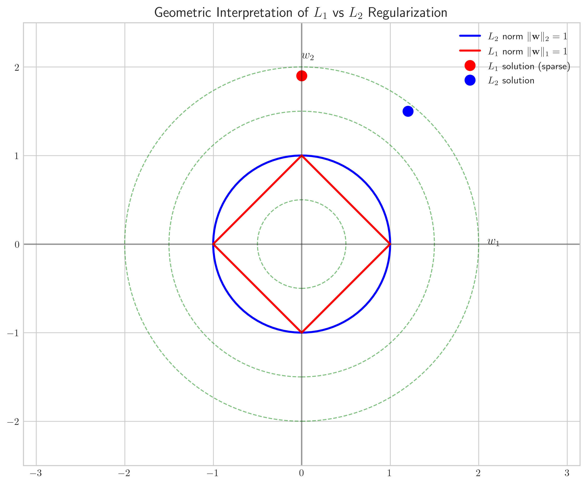
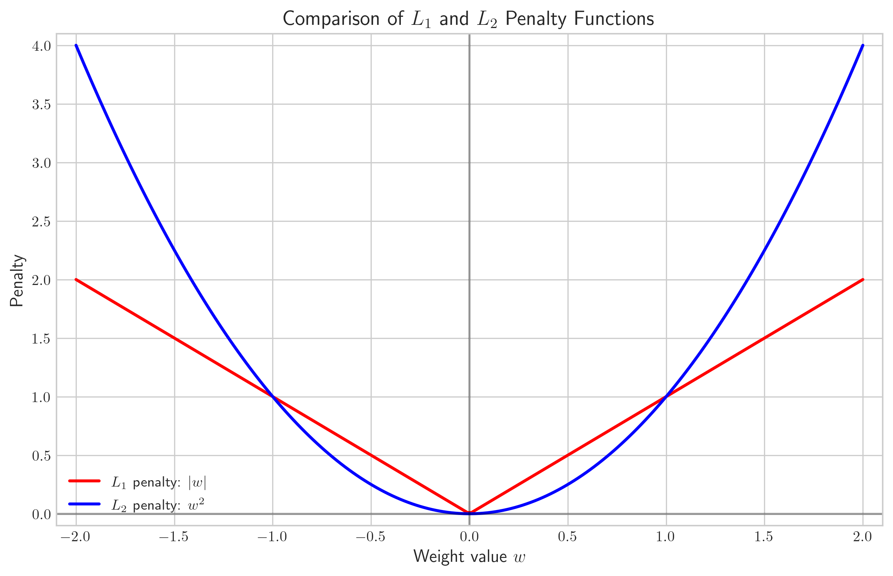
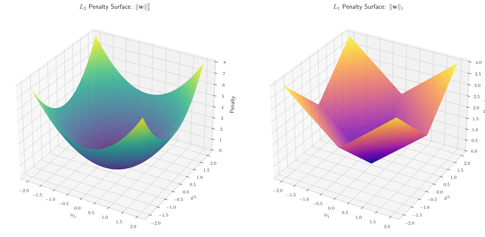
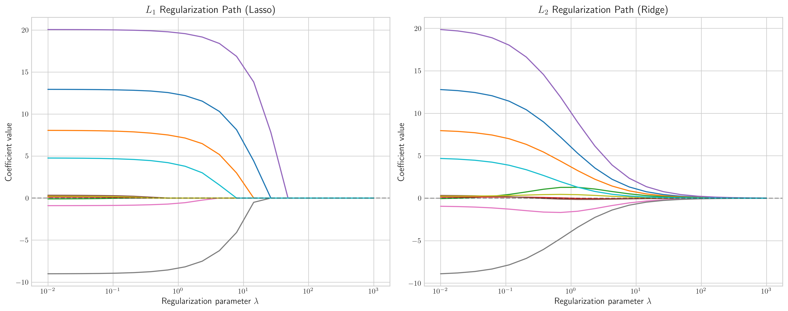
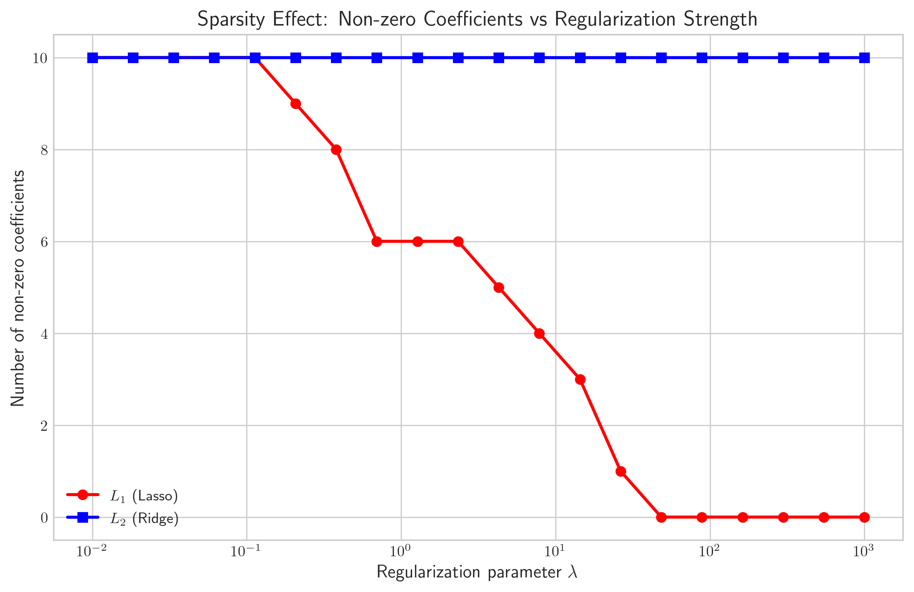

# Question 13: Regularization in Linear Regression

## Problem Statement
Consider the following regularized cost functions with parameter $\lambda = 2$:

$$J_A(\boldsymbol{w}) = \sum_{i=1}^{n} (y^{(i)} - \boldsymbol{w}^T \boldsymbol{x}^{(i)})^2 + 2\|\boldsymbol{w}\|_2^2$$

$$J_B(\boldsymbol{w}) = \sum_{i=1}^{n} (y^{(i)} - \boldsymbol{w}^T \boldsymbol{x}^{(i)})^2 + 2\|\boldsymbol{w}\|_1$$

### Task
1. If we have a weight vector $\boldsymbol{w} = [0.5, -1.5, 2.0]$, calculate the penalty term for both Models A and B
2. Which model would likely produce more zero coefficients and why?
3. Describe one advantage of Model A over Model B
4. If we double $\lambda$ to 4, how would the penalty terms change for both models?

## Understanding the Problem
This problem explores two different regularization techniques in linear regression: L2 regularization (Ridge regression) in Model A and L1 regularization (Lasso regression) in Model B. Both models have the same loss function (sum of squared errors), but they differ in their penalty terms.

Regularization is a technique used to prevent overfitting by adding a penalty term to the cost function. The parameter $\lambda$ controls the strength of the regularization – larger values of $\lambda$ increase the impact of the penalty term relative to the error term.

- In Model A (Ridge regression), the penalty term is the squared L2 norm of the weight vector multiplied by $\lambda$.
- In Model B (Lasso regression), the penalty term is the L1 norm of the weight vector multiplied by $\lambda$.

These different penalty terms lead to different geometric interpretations and have distinct effects on the model coefficients.

## Solution

### Step 1: Calculate the L1 and L2 norms for the given weight vector
We have the weight vector $\boldsymbol{w} = [0.5, -1.5, 2.0]$.

The L1 norm is the sum of the absolute values of the elements:
$$\|\boldsymbol{w}\|_1 = |0.5| + |-1.5| + |2.0| = 0.5 + 1.5 + 2.0 = 4.0$$

The L2 norm squared is the sum of the squared elements:
$$\|\boldsymbol{w}\|_2^2 = 0.5^2 + (-1.5)^2 + 2.0^2 = 0.25 + 2.25 + 4.0 = 6.5$$

### Step 2: Calculate the penalty terms for both models with λ = 2
For Model A (L2 regularization), the penalty term is:
$$\text{Penalty}_A = \lambda \|\boldsymbol{w}\|_2^2 = 2 \times 6.5 = 13.0$$

For Model B (L1 regularization), the penalty term is:
$$\text{Penalty}_B = \lambda \|\boldsymbol{w}\|_1 = 2 \times 4.0 = 8.0$$

### Step 3: Determine which model would produce more zero coefficients
Model B (Lasso regression with L1 regularization) is more likely to produce zero coefficients.

This is due to the geometric properties of the L1 norm. The L1 penalty creates sharp corners at zero points in the parameter space, making it more likely for the optimization process to find solutions where some coefficients are exactly zero.

In contrast, the L2 penalty (Model A) is smooth and symmetric around zero, leading to a tendency to shrink all coefficients toward zero, but rarely setting them exactly to zero.

### Step 4: Identify an advantage of Model A over Model B
Model A (Ridge regression) has several advantages over Model B:

1. It has a unique, stable solution even with correlated features
2. It handles multicollinearity better by shrinking correlated features together
3. It has a closed-form solution, making it computationally more efficient

When predictors are highly correlated, Lasso tends to arbitrarily select one variable from each correlated group, whereas Ridge shrinks correlated predictors toward each other, preserving their relationships.

### Step 5: Calculate how the penalty terms change when λ = 4
When $\lambda$ is doubled from 2 to 4, the penalty terms will also double because they are directly proportional to $\lambda$.

For Model A (L2 regularization):
$$\text{Penalty}_A = \lambda \|\boldsymbol{w}\|_2^2 = 4 \times 6.5 = 26.0$$

For Model B (L1 regularization):
$$\text{Penalty}_B = \lambda \|\boldsymbol{w}\|_1 = 4 \times 4.0 = 16.0$$

Both penalty terms double when $\lambda$ doubles, but the relative relationship between them remains the same.

## Visual Explanations

### Geometric Interpretation of L1 vs L2 Regularization

This visualization shows the geometric constraints imposed by L1 and L2 norms. The L1 norm (red diamond) has corners that coincide with the axes, making it more likely to produce sparse solutions where some coefficients are exactly zero. In contrast, the L2 norm (blue circle) is smooth and encourages small but non-zero coefficients in all dimensions.

### Penalty Functions Comparison

This plot shows how the L1 and L2 penalties behave for a single coefficient. The L1 penalty (red) has a sharp corner at zero, creating a discontinuity in the derivative that encourages exact zeros. The L2 penalty (blue) is smooth and increases quadratically, resulting in stronger penalties for large coefficients but a gentler approach near zero.

### 3D Penalty Surfaces

These 3D surfaces show how the L1 and L2 penalties behave in a 2D weight space. The L2 penalty surface (left) is a paraboloid that increases smoothly in all directions, while the L1 penalty surface (right) has a pyramid shape with sharp ridges along the axes.

### Regularization Paths

These plots show how coefficients change as the regularization parameter λ increases. For L1 regularization (left), coefficients are more likely to become exactly zero as λ increases. For L2 regularization (right), coefficients approach zero asymptotically but rarely reach exactly zero.

### Sparsity Effect

This plot directly compares how the number of non-zero coefficients changes with increasing regularization strength (λ) for both methods. The L1 regularization (Lasso) shows a dramatic decrease in non-zero coefficients as λ increases, while L2 regularization (Ridge) tends to maintain all features with small but non-zero coefficients.

## Key Insights

### Mathematical Properties
- L1 norm: Sum of absolute values of coefficients ($\|\boldsymbol{w}\|_1 = \sum_i |w_i|$)
- L2 norm squared: Sum of squared values of coefficients ($\|\boldsymbol{w}\|_2^2 = \sum_i w_i^2$)
- Penalty terms scale linearly with the regularization parameter λ
- Both regularization methods shrink coefficients, but in different ways

### Geometric Interpretation
- L1 constraint region (diamond shape) has corners along the axes, promoting sparsity
- L2 constraint region (circular shape) is smooth with no corners, promoting small but non-zero values
- The optimization process finds the point where the error contours touch the constraint region
- For L1, this intersection often occurs at corners (where some coefficients are zero)

### Practical Applications
- L1 regularization (Lasso) is useful for feature selection due to its sparsity-inducing property
- L2 regularization (Ridge) is better for handling multicollinearity among predictors
- Increasing λ strengthens the regularization effect at the expense of potentially underfitting
- The choice between L1 and L2 depends on whether feature selection or stable coefficient estimation is more important

## Conclusion
- For a weight vector $\boldsymbol{w} = [0.5, -1.5, 2.0]$, the L2 penalty term (Model A) is 13.0 and the L1 penalty term (Model B) is 8.0 when λ = 2.
- Model B (Lasso regression) is more likely to produce zero coefficients due to the geometric properties of the L1 norm penalty.
- Model A (Ridge regression) has advantages including better handling of multicollinearity, unique solutions, and computational efficiency.
- When λ is doubled to 4, both penalty terms double to 26.0 for Model A and 16.0 for Model B.

The choice between L1 and L2 regularization depends on the specific needs of the modeling task. L1 regularization is preferable when feature selection or a sparse model is desirable, while L2 regularization is better when all features are potentially relevant and stability in the presence of correlated features is important. 