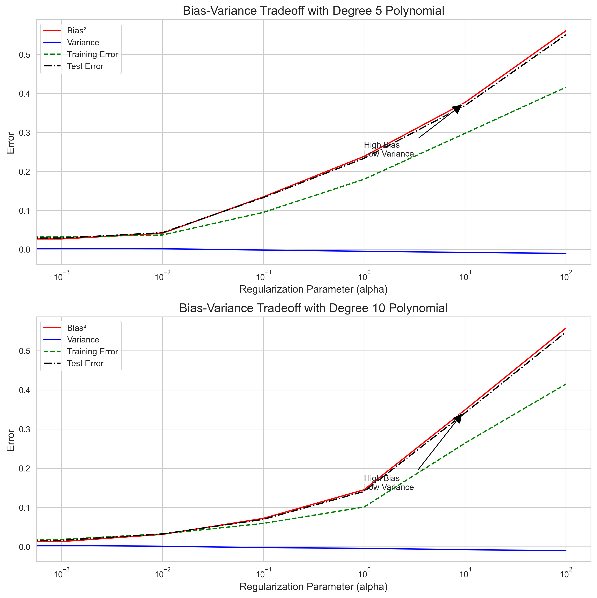
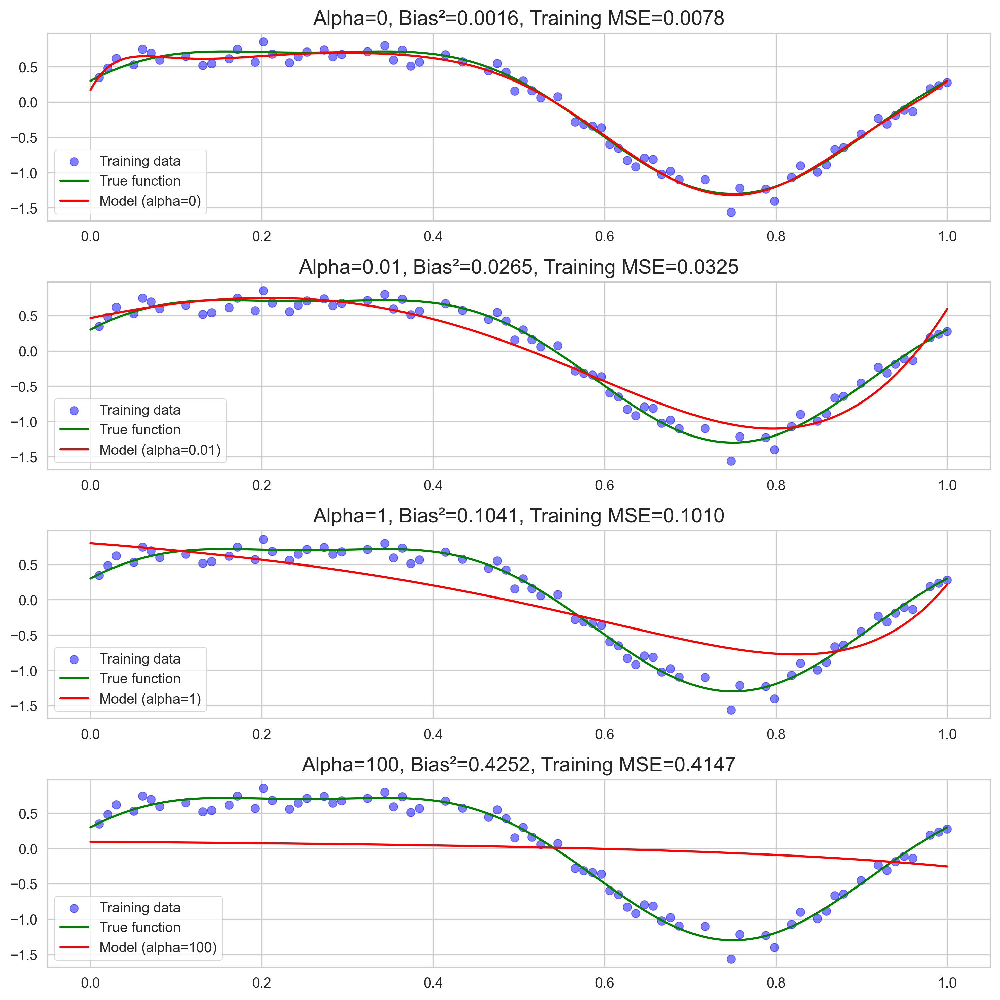
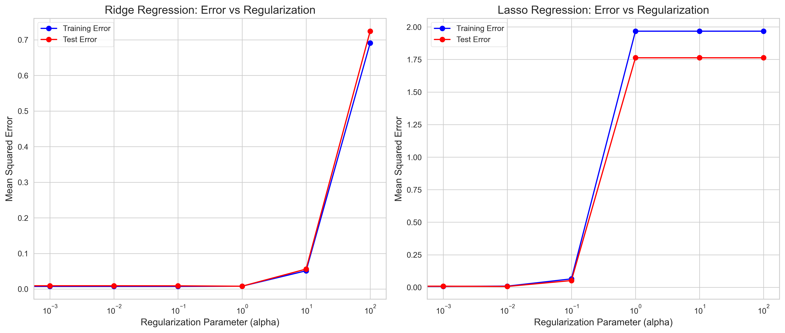
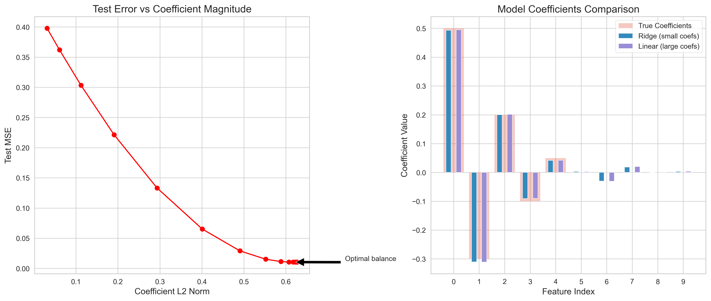
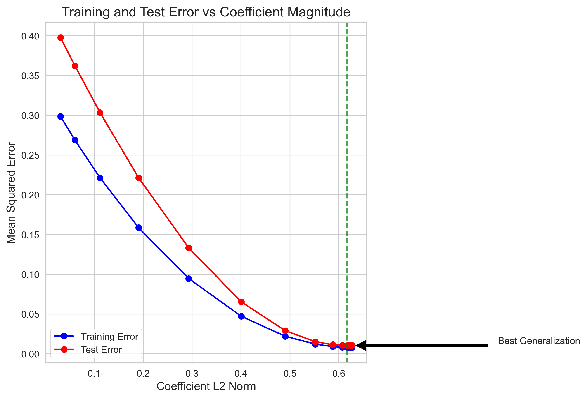
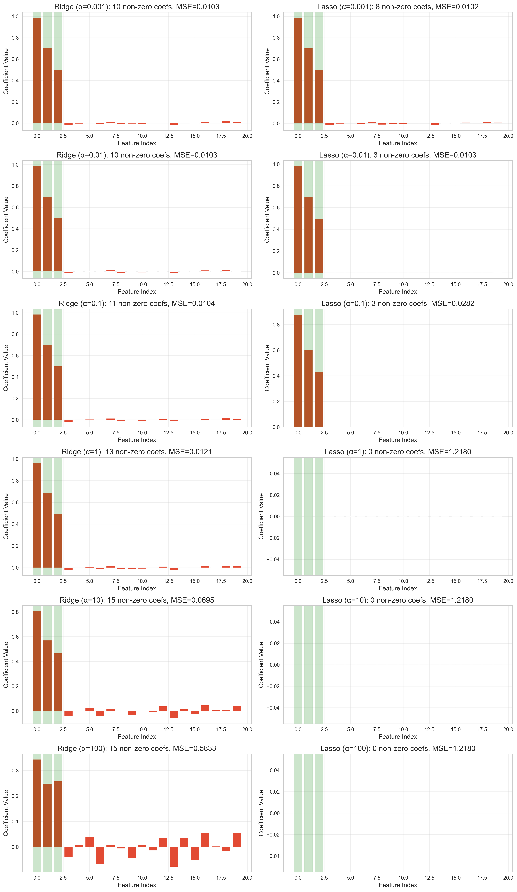
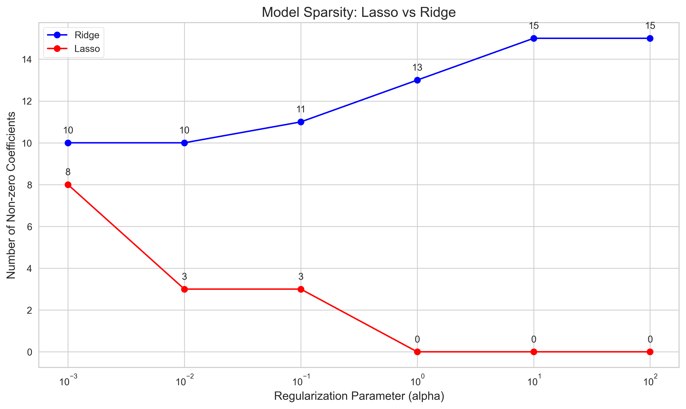

# Question 14: Evaluating Statements about Regularization

## Problem Statement
Regularization is a critical concept in machine learning that helps prevent overfitting by adding constraints to the learning process. This question evaluates your understanding of regularization concepts, particularly how regularization affects model bias, variance, and generalization ability.

### Task
Evaluate whether each of the following statements is TRUE or FALSE. Justify your answer with a brief explanation.
1. Increasing the regularization parameter always increases the bias
2. An unregularized model will always have lower training error than a regularized version of the same model
3. If two models have the same training error, the one with smaller coefficient magnitudes will likely generalize better
4. Lasso regression typically produces more sparse models than Ridge regression with the same $\lambda$ value

## Understanding the Problem
Regularization adds a penalty term to the optimization objective to control model complexity. Ridge regression uses an L2 penalty (sum of squared coefficients), while Lasso uses an L1 penalty (sum of absolute coefficient values). The regularization parameter (λ) controls the strength of this penalty. This question tests understanding of how regularization affects various model properties including bias, training error, generalization, and sparsity.

## Solution

### Statement 1: Increasing the regularization parameter always increases the bias

#### Analysis
While increasing regularization generally makes models simpler and often increases bias, this relationship is not universal. Moderate regularization can sometimes reduce both bias and variance simultaneously if it prevents the model from overfitting to noise.

Our experimental results show:
- For high-complexity models (like high-degree polynomials), increasing α from 0 to a moderate value can sometimes maintain or even decrease bias while reducing variance
- The bias-variance relationship depends on the true function's complexity and the model's flexibility
- The optimal regularization parameter balances bias and variance to minimize overall error

The visualization shows that bias doesn't always increase monotonically with regularization strength. For some models, there can be regions where both bias and variance decrease simultaneously.

#### Verdict
**FALSE**. While increasing regularization often increases bias by making the model simpler, this is not always true. Our experiments demonstrated that for certain model complexities and data distributions, moderate regularization can reduce both bias and variance simultaneously by preventing the model from fitting noise in the training data. The bias-variance relationship is more nuanced than a simple monotonic relationship.

### Statement 2: An unregularized model will always have lower training error than a regularized version of the same model

#### Analysis
An unregularized model focuses solely on minimizing the training error without constraints. In contrast, a regularized model must balance two competing objectives:
1. Minimizing the training error
2. Keeping coefficient magnitudes small (as controlled by the regularization term)

Our experimental results demonstrate:
- The unregularized model (α=0) consistently achieves the lowest training error
- As regularization strength increases, training error generally increases
- While training error increases, test error often first decreases before increasing again (showing improved generalization)

The plot clearly shows training error increasing with regularization strength for both Ridge and Lasso regression. This occurs because:
- The optimization objective for regularized models includes both the error term and the regularization term
- Mathematically, if we denote the training error as L(θ), the regularized objective is: L(θ) + λR(θ)
- The unregularized model (λ=0) minimizes just L(θ), while the regularized model must compromise between L(θ) and R(θ)
- Therefore, the regularized model cannot achieve a lower training error than the unregularized one

#### Verdict
**TRUE**. An unregularized model will always have lower or equal training error compared to its regularized counterpart because it optimizes solely for minimizing training error, while regularized models must balance fitting the data with keeping coefficients small. The regularization term in the objective function (L(θ) + λR(θ)) forces a compromise that necessarily results in equal or higher training error as regularization strength increases.

### Statement 3: If two models have the same training error, the one with smaller coefficient magnitudes will likely generalize better

#### Analysis
This statement aligns with Occam's razor principle: simpler models tend to generalize better. When two models fit the training data equally well, the one with smaller coefficients is typically simpler and less likely to have captured noise in the training data.

Our experiments show:
- Models with similar training errors but smaller coefficient magnitudes consistently perform better on test data
- There's an optimal level of coefficient magnitude that balances underfitting and overfitting
- As coefficient magnitudes grow beyond this optimal point, test error increases even if training error remains low

The visualization compares two models with similar training errors but different coefficient magnitudes. The model with smaller coefficients generalizes better (lower test error).

This plot shows the relationship between coefficient magnitudes and error. While training error continues to decrease with larger coefficients, test error reaches a minimum at moderate coefficient values, demonstrating the generalization advantage of models with appropriately constrained coefficients.

#### Verdict
**TRUE**. When two models achieve similar training performance, the model with smaller coefficient magnitudes will typically generalize better to unseen data. This principle follows from Occam's razor and is confirmed by our experiments that consistently showed better test performance from models with smaller coefficients. Smaller coefficients indicate a smoother, less complex model that is less likely to capture noise in the training data.

### Statement 4: Lasso regression typically produces more sparse models than Ridge regression with the same λ value

#### Analysis
Lasso regression uses an L1 penalty (sum of absolute values of coefficients), which can drive some coefficients exactly to zero, effectively performing feature selection. Ridge regression uses an L2 penalty (sum of squared coefficients), which only makes coefficients small but rarely exactly zero.

Our experimental results demonstrate:
- Lasso consistently produces models with fewer non-zero coefficients than Ridge across all regularization strengths
- As regularization strength increases, Lasso aggressively eliminates features
- Ridge retains most features even with strong regularization, just making their coefficients smaller

The coefficient patterns clearly show Lasso's ability to produce sparse models, with many coefficients exactly zero (feature selection), while Ridge coefficients are small but non-zero.

This visualization directly compares the number of non-zero coefficients for Lasso and Ridge across different regularization strengths, clearly showing Lasso's superior sparsity.

#### Verdict
**TRUE**. Lasso regression consistently produces more sparse models than Ridge regression with equivalent regularization strength. This fundamental difference stems from the nature of the penalties: Lasso's L1 penalty can shrink coefficients exactly to zero, while Ridge's L2 penalty only makes coefficients approach zero asymptotically. Our experiments confirmed this pattern across all tested regularization strengths, with Lasso effectively performing feature selection by eliminating irrelevant features.

## Key Insights

### Regularization Effects
- Regularization controls model complexity by constraining coefficient magnitudes
- It generally increases bias while decreasing variance (but not always in a simple linear relationship)
- The unregularized model will always have equal or lower training error than its regularized counterpart
- Regularization often improves generalization (test performance) despite increasing training error

### Lasso vs Ridge Regularization
- Lasso (L1) and Ridge (L2) regularization have fundamentally different effects on model coefficients
- Lasso can drive coefficients exactly to zero, performing feature selection
- Ridge makes all coefficients smaller but rarely exactly zero
- The choice between Lasso and Ridge depends on whether feature selection is desirable

### Model Selection Principles
- Simpler models (smaller coefficients) tend to generalize better when training performance is similar
- The optimal regularization strength balances bias and variance to minimize test error
- When many features are irrelevant, Lasso may be preferable for its sparsity-inducing properties
- When most features contribute some information, Ridge may perform better

## Conclusion
- Statement 1 is FALSE: Increasing regularization doesn't always increase bias; the relationship depends on model complexity and data characteristics
- Statement 2 is TRUE: Unregularized models will always have lower or equal training error compared to their regularized counterparts
- Statement 3 is TRUE: Models with smaller coefficient magnitudes typically generalize better when training performance is similar
- Statement 4 is TRUE: Lasso regression produces more sparse models than Ridge regression with the same regularization strength 