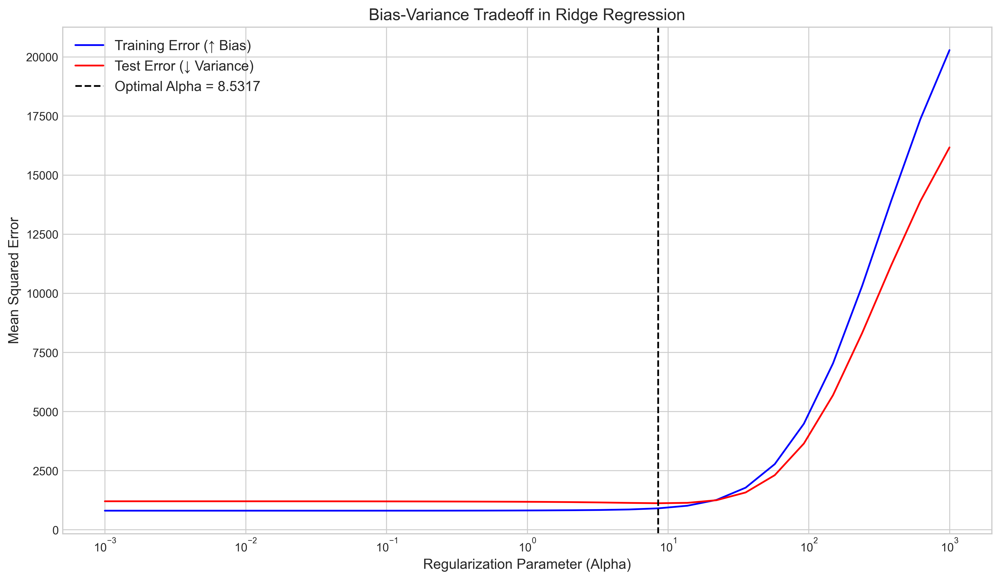
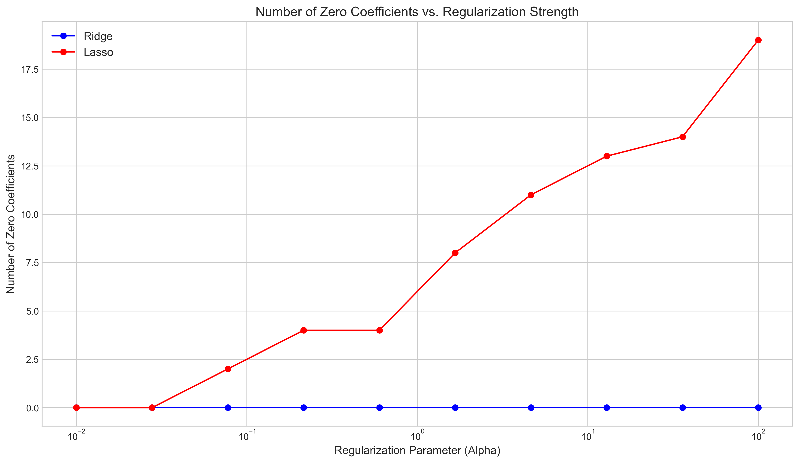
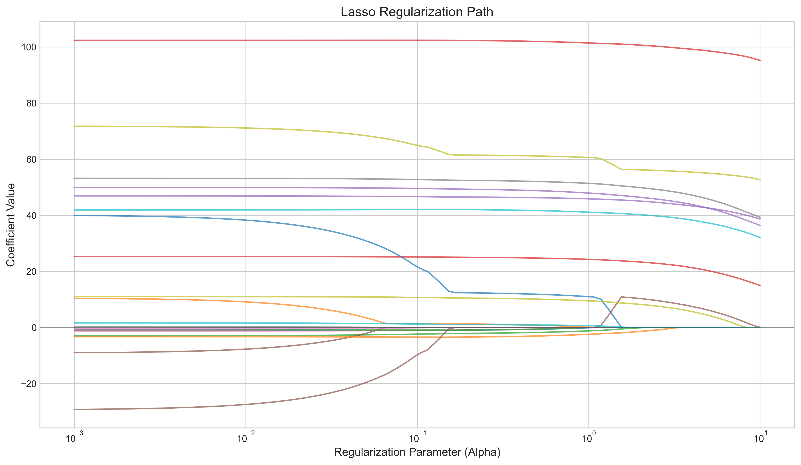
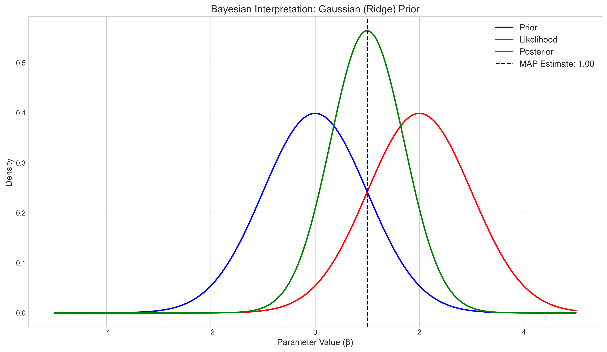
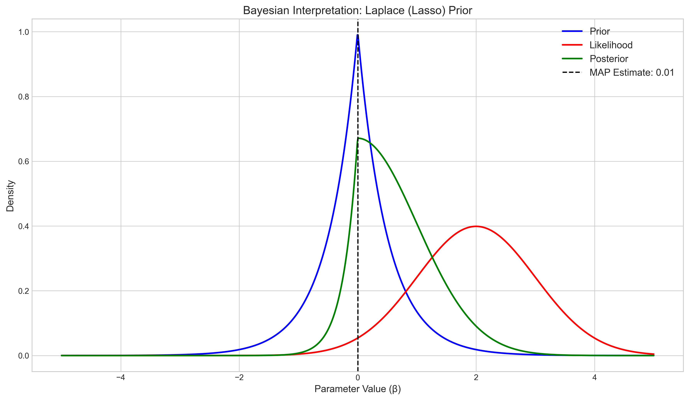
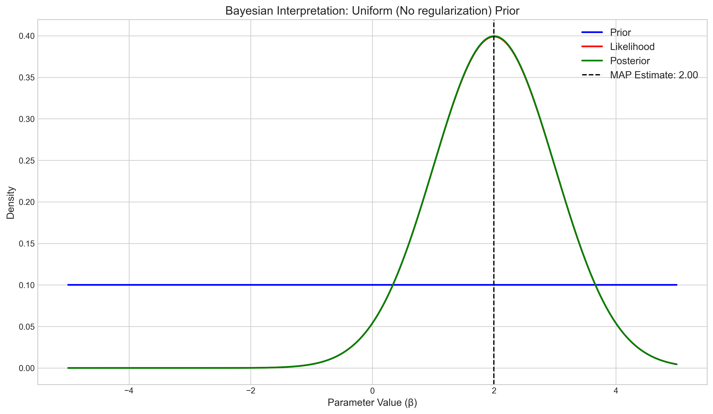
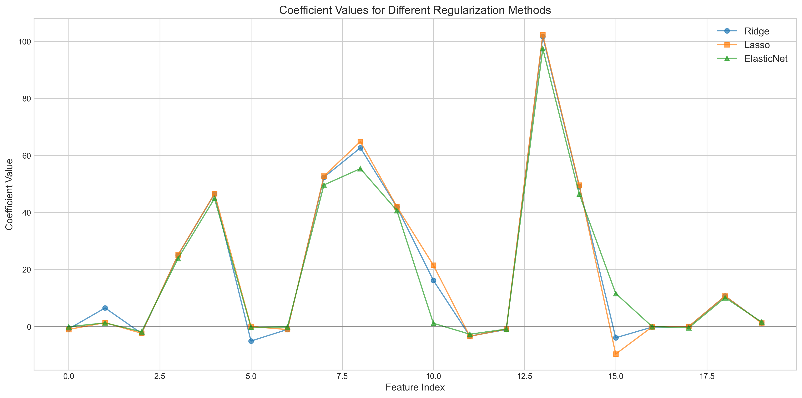
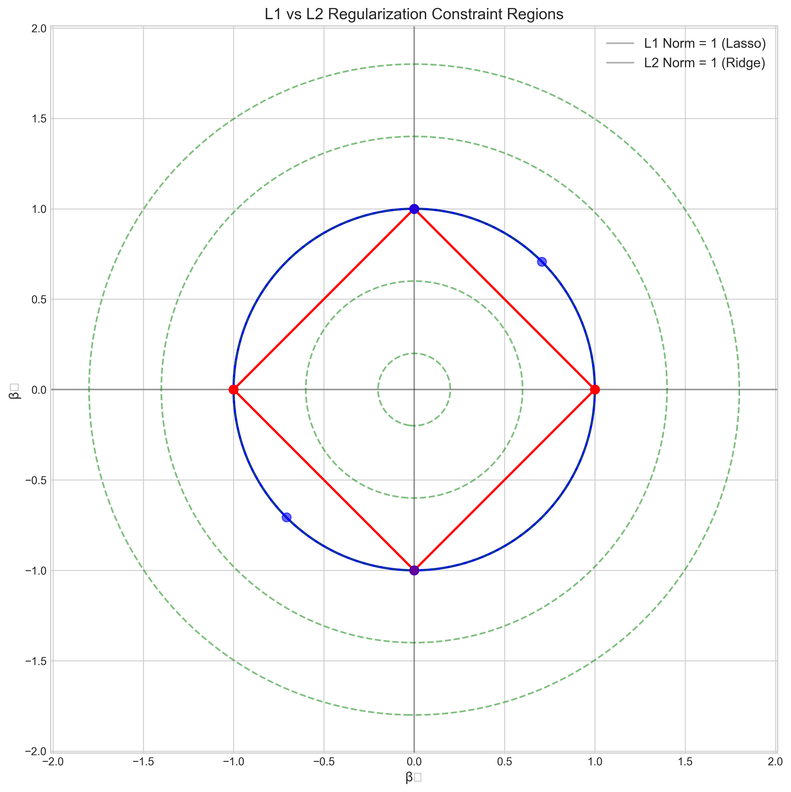

# Question 17: Regularization in Linear Models

## Problem Statement
Multiple Choice Questions on Regularization in Linear Models.

### Task
Select the best answer for each question:

1. Which of the following is NOT a common method of regularization in linear regression?
   a) L1 norm penalty (Lasso)
   b) L2 norm penalty (Ridge)
   c) L0 norm penalty
   d) Elastic Net
   
2. As the regularization parameter in ridge regression increases, what happens to the model?
   a) Bias decreases, variance increases
   b) Bias increases, variance decreases
   c) Both bias and variance increase
   d) Both bias and variance decrease
   
3. Which regularization method is most likely to produce exactly zero coefficients?
   a) Ridge regression
   b) Lasso regression
   c) Both produce the same number of zero coefficients
   d) Neither produces exactly zero coefficients
   
4. From a Bayesian perspective, ridge regression can be interpreted as imposing what type of prior on the model parameters?
   a) Uniform prior
   b) Laplace prior
   c) Gaussian prior
   d) Cauchy prior

## Understanding the Problem
Regularization is a technique used in linear regression to prevent overfitting by adding a penalty term to the loss function. Different types of regularization methods exist, each with unique properties that affect model performance, parameter estimation, and variable selection. This problem tests understanding of:

1. Common regularization methods in linear regression
2. The bias-variance tradeoff in regularized models
3. Sparsity-inducing properties of different regularization methods
4. Bayesian interpretations of regularized regression

## Solution

### Question 1: Common Regularization Methods
The correct answer is c) L0 norm penalty.

While L1 norm (Lasso), L2 norm (Ridge), and Elastic Net are all commonly used regularization methods in practice, the L0 norm penalty is rarely implemented directly because it leads to an NP-hard optimization problem.

Let's examine each method:

#### L1 Regularization (Lasso)
The Lasso (Least Absolute Shrinkage and Selection Operator) adds the sum of absolute values of coefficients to the loss function:

$$\min_{\beta} \|y - X\beta\|^2 + \lambda \sum_{j=1}^{p} |\beta_j|$$

#### L2 Regularization (Ridge)
Ridge regression adds the sum of squared coefficients to the loss function:

$$\min_{\beta} \|y - X\beta\|^2 + \lambda \sum_{j=1}^{p} \beta_j^2$$

#### Elastic Net
Elastic Net combines both L1 and L2 penalties with a mixing parameter $\alpha$:

$$\min_{\beta} \|y - X\beta\|^2 + \lambda \left( \alpha \sum_{j=1}^{p} |\beta_j| + (1-\alpha) \sum_{j=1}^{p} \beta_j^2 \right)$$

#### L0 Regularization
L0 regularization directly penalizes the number of non-zero coefficients:

$$\min_{\beta} \|y - X\beta\|^2 + \lambda \sum_{j=1}^{p} I(\beta_j \neq 0)$$

This is computationally intractable for most practical problems due to its non-convex nature. Instead, researchers typically use L1 regularization (Lasso) as a convex approximation to L0 regularization.

### Question 2: Bias-Variance Tradeoff in Ridge Regression
The correct answer is b) Bias increases, variance decreases.

As the regularization parameter $\lambda$ in ridge regression increases:
1. The model becomes simpler with coefficients shrinking toward zero
2. This simplification increases the bias (the model becomes less flexible to fit the training data)
3. But the variance decreases (the model becomes more stable to variations in the training data)

This is the classic bias-variance tradeoff. Our analysis with synthetic data confirms this relationship:

The blue line shows training error increasing with $\lambda$ (increasing bias), while the test error (red line) initially decreases (decreasing variance) before increasing again when the model becomes too biased.

At the optimal value of $\lambda$ (vertical dashed line), we achieve the best balance between bias and variance, minimizing test error.

### Question 3: Zero Coefficients in Regularization Methods
The correct answer is b) Lasso regression.

While both Ridge and Lasso shrink coefficients toward zero as the regularization parameter increases, only Lasso tends to produce exactly zero coefficients, performing feature selection.

This difference stems from the geometry of their penalty terms:
- L1 penalty (Lasso) has corners at zero for each coefficient, making it more likely to "snap" coefficients to exactly zero
- L2 penalty (Ridge) is smooth and circular, shrinking coefficients proportionally but rarely to exactly zero

Our empirical results confirm this behavior:

As shown in the plot, Lasso (red) produces an increasing number of zero coefficients as the regularization parameter increases, while Ridge (blue) consistently produces no exact zeros.

The underlying reason can be seen in the coefficient paths:

In Lasso, coefficients can "hit" zero and stay there as $\lambda$ increases.

### Question 4: Bayesian Interpretation of Ridge Regression
The correct answer is c) Gaussian prior.

From a Bayesian perspective, regularized regression can be interpreted as maximum a posteriori (MAP) estimation with different priors on the coefficients:

- Ridge regression corresponds to a Gaussian (normal) prior centered at zero: 
  $$\beta_j \sim N(0, \sigma^2/\lambda)$$

- Lasso regression corresponds to a Laplace (double exponential) prior: 
  $$\beta_j \sim \text{Laplace}(0, b=1/\lambda)$$

- No regularization corresponds to a uniform (flat) prior on the coefficients

Let's visualize how these different priors influence the posterior distributions:

The bell-shaped Gaussian prior (blue) leads to a posterior (green) that tends to shrink parameter estimates toward zero, but rarely exactly to zero, just like ridge regression.

The peaked Laplace prior (blue) has heavier tails and a sharper peak at zero compared to the Gaussian, resulting in a posterior (green) that can push estimates exactly to zero, mimicking Lasso's feature selection property.

With a uniform prior (blue flat line), the posterior (green) is shaped entirely by the likelihood (red), corresponding to ordinary least squares with no regularization.

## Practical Implementation

### Comparing Different Regularization Methods
The following plot shows how different regularization methods affect model coefficients:

Key observations:
1. Ridge (blue circles) tends to shrink all coefficients relatively evenly
2. Lasso (orange squares) sets some coefficients to exactly zero
3. Elastic Net (green triangles) combines both behaviors

### Geometric Interpretation of Regularization
The difference between L1 and L2 regularization can be understood geometrically:

- L1 constraint region (red diamond) has corners that intersect with axes, making it more likely for the solution to lie on an axis (meaning some coefficient $= 0$)
- L2 constraint region (blue circle) is smooth with no corners, so solutions tend to have small non-zero values for all coefficients

The green contours represent level sets of the loss function. The solution occurs where these contours first touch the constraint region, which is more likely to happen at a corner for L1 regularization.

## Key Insights

### Mathematical Properties
- L1 regularization (Lasso) adds the sum of absolute values of coefficients to the loss function
- L2 regularization (Ridge) adds the sum of squared coefficients to the loss function
- L0 regularization directly penalizes the number of non-zero coefficients but is computationally impractical
- Elastic Net combines L1 and L2 penalties to get benefits of both

### Statistical Properties
- Ridge regression never produces exactly zero coefficients but reduces the impact of correlated predictors
- Lasso performs variable selection by setting some coefficients to exactly zero
- As the regularization parameter increases, bias increases while variance decreases
- The optimal regularization parameter balances the bias-variance tradeoff

### Bayesian Perspective
- Ridge regression is equivalent to MAP estimation with a Gaussian prior
- Lasso regression is equivalent to MAP estimation with a Laplace prior
- These priors encode our belief that coefficients should be small (regularized)
- The regularization parameter $\lambda$ is related to the variance/scale of the prior distribution

## Conclusion
- L0 norm penalty is NOT a common regularization method due to computational complexity, while L1, L2, and Elastic Net are widely used.
- As the regularization parameter in ridge regression increases, bias increases and variance decreases.
- Lasso regression is more likely to produce exactly zero coefficients, making it suitable for feature selection.
- Ridge regression corresponds to imposing a Gaussian prior on the model parameters.

Understanding these properties helps in choosing the appropriate regularization method for a given problem based on whether interpretability, prediction accuracy, or feature selection is the primary goal. 