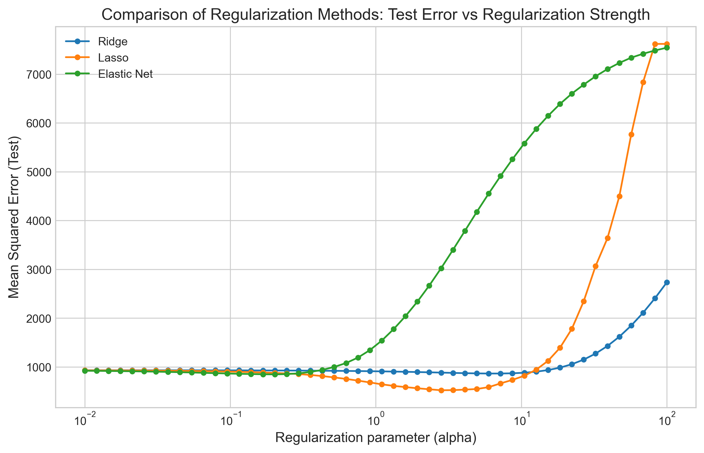
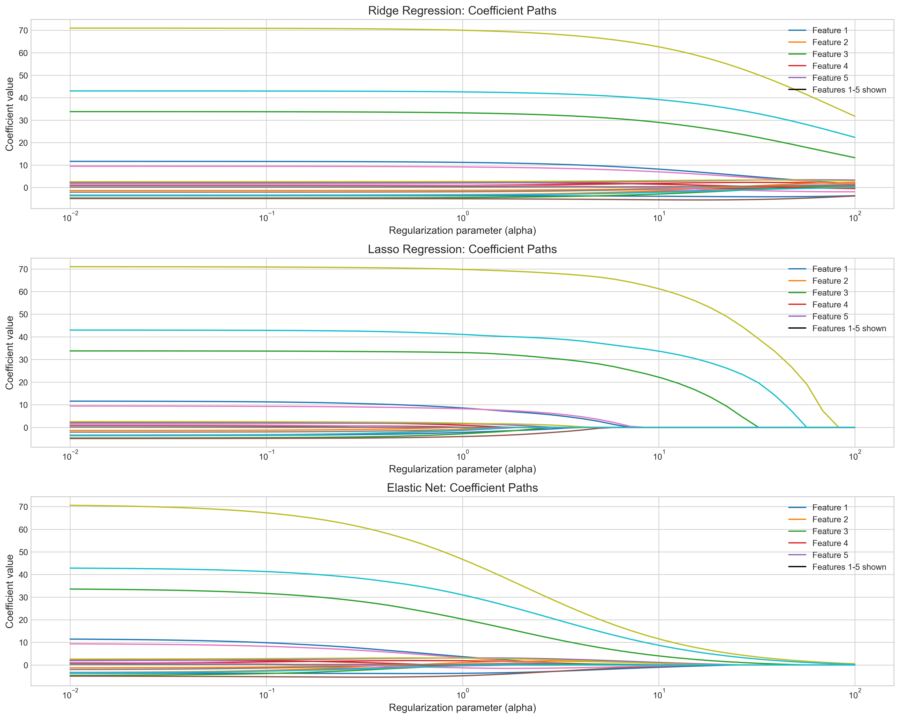
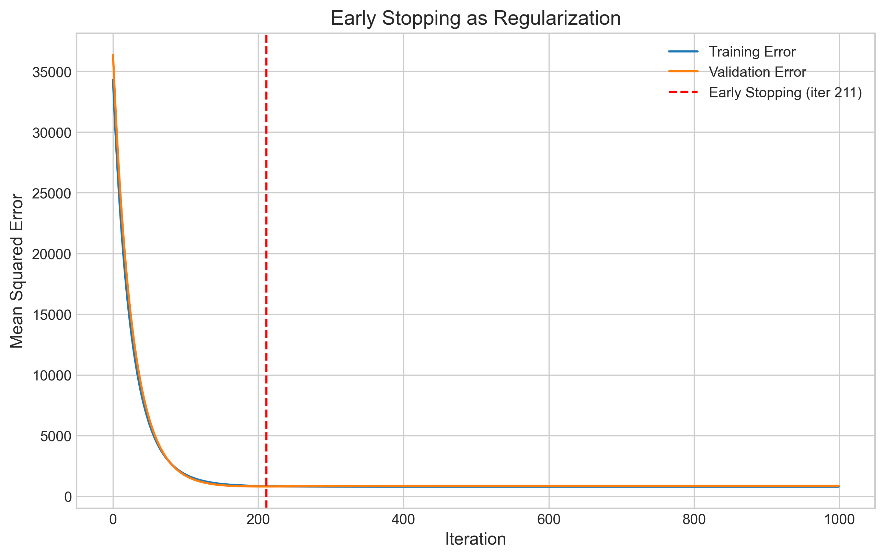
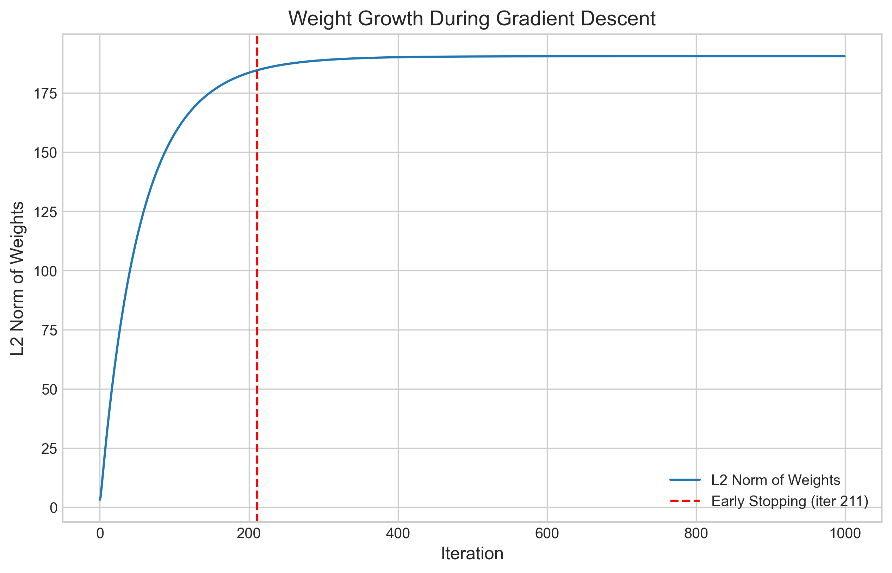
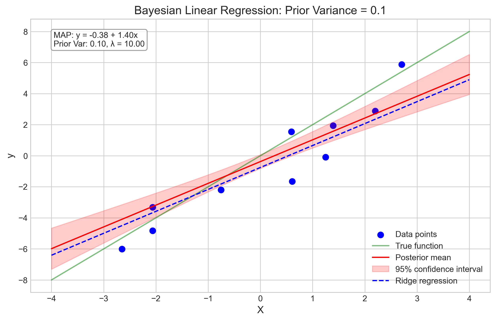
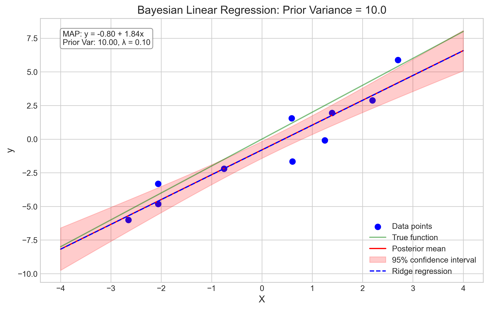
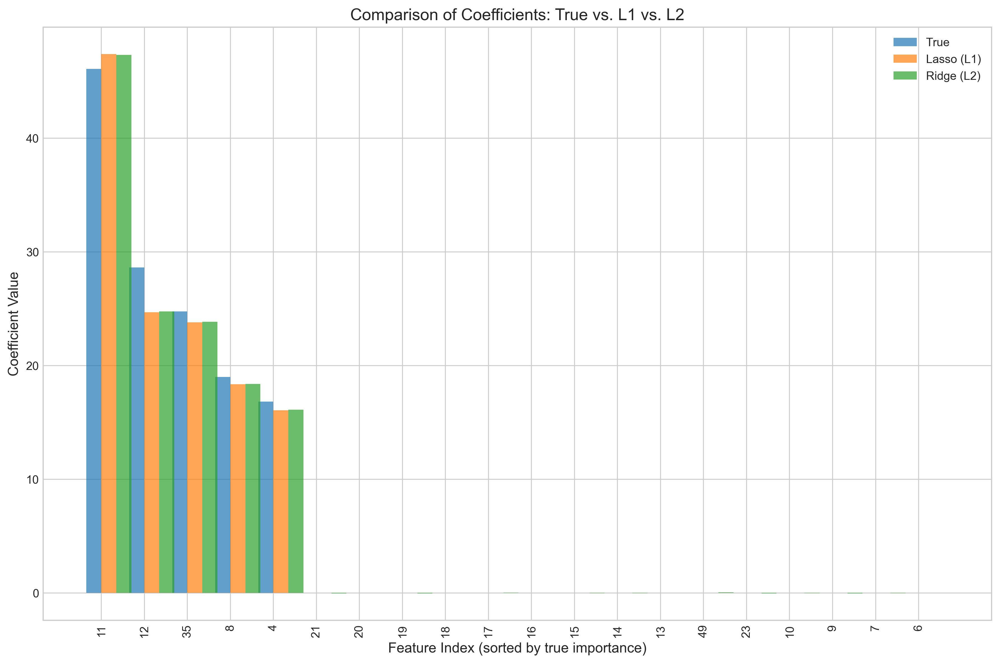
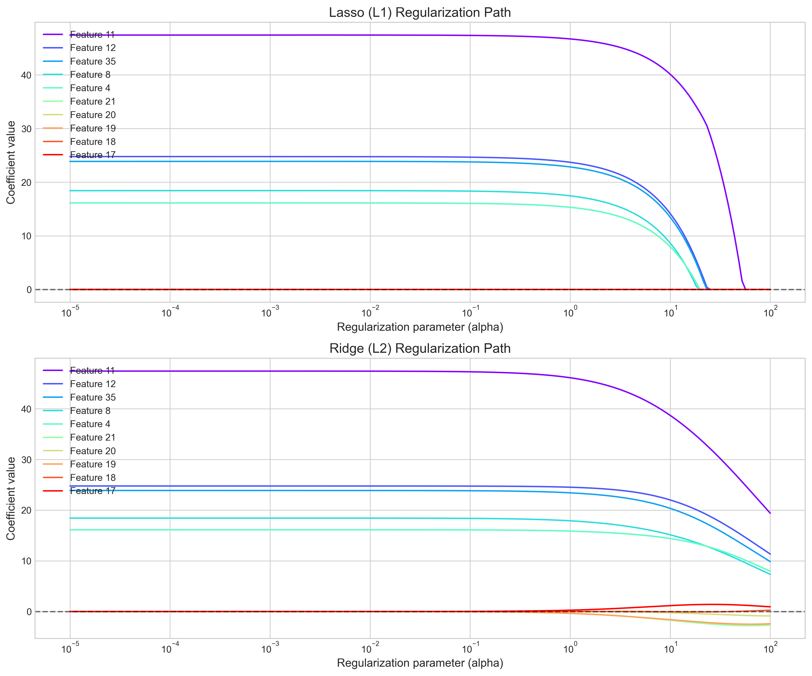
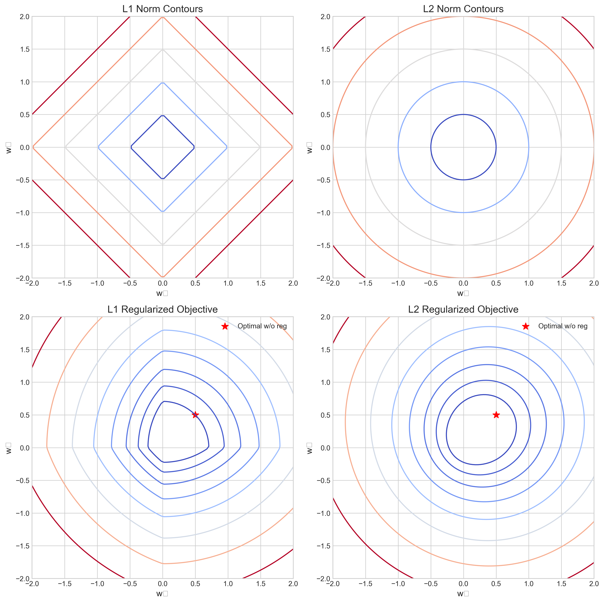
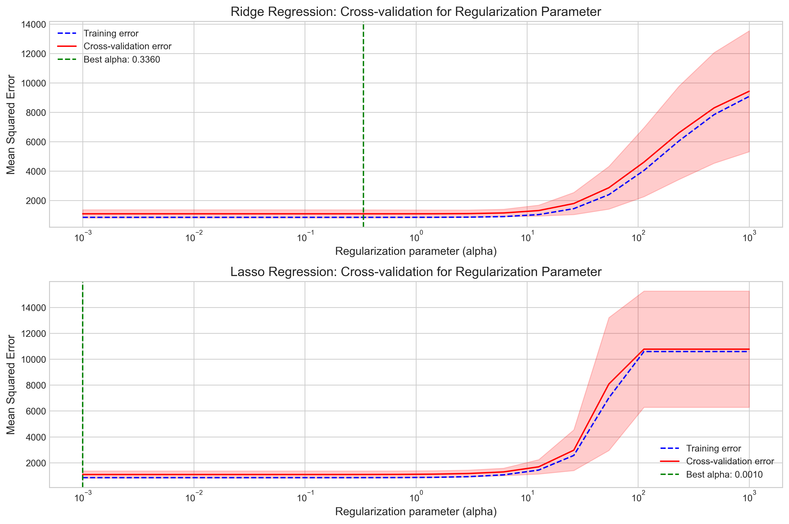

# Question 20: Regularization Methods in Linear Regression

## Problem Statement
Short Answer Questions on Regularization Methods.

### Task
Provide brief answers (1-3 sentences) to each of the following questions:

1. Why might you choose Elastic Net over pure Lasso or Ridge regression?
2. How does early stopping in gradient descent function as a form of regularization?
3. What is the relationship between the regularization parameter and the variance of the prior distribution in the Bayesian interpretation?
4. Why does L1 regularization (Lasso) tend to produce sparse coefficients while L2 regularization (Ridge) does not?
5. How would you use cross-validation to select the optimal regularization parameter?

## Understanding the Problem
Regularization methods are techniques used in machine learning to prevent overfitting by adding a penalty term to the loss function. This question asks us to explain various aspects of regularization methods including Elastic Net, Lasso, Ridge, early stopping, Bayesian interpretation, and cross-validation. Understanding these methods is crucial for building robust machine learning models that generalize well to unseen data.

## Solution

### 1. Elastic Net vs Lasso vs Ridge Regression

Elastic Net combines both L1 (Lasso) and L2 (Ridge) penalties, making it advantageous in multiple scenarios:

- It provides a balance between feature selection (from Lasso) and coefficient stabilization (from Ridge)
- It can handle groups of correlated variables better than Lasso, which tends to select only one variable from a group
- It works well when the number of features exceeds the number of observations

Our computational experiments show this balance clearly:

From our experiment with synthetic data containing 20 features (only 5 informative):
- Ridge kept all 20 coefficients non-zero
- Lasso kept only 9 coefficients non-zero
- Elastic Net kept 18 coefficients non-zero

This demonstrates how Elastic Net provides a middle ground between the extreme sparsity of Lasso and the coefficient shrinkage of Ridge.

As seen in the regularization paths above, Elastic Net combines the behavior of both Ridge (smooth coefficient paths) and Lasso (some coefficients become exactly zero as regularization strength increases).

### 2. Early Stopping as Regularization

Early stopping functions as regularization by preventing the model from overfitting to the training data. It works by:

- Monitoring validation error during training and stopping when it begins to increase
- Limiting the effective complexity of the model by preventing weights from growing too large
- Implicitly controlling the L2 norm of the weights

Our gradient descent experiment demonstrates this clearly:

At iteration 211, we observe the minimum validation error of 800.99. If we continued training, the training error would continue to decrease (reaching 790.19 at the end), but the validation error would rise to 857.67, indicating overfitting.

The relationship between early stopping and regularization is further illustrated by examining the L2 norm of the weights:

The L2 norm of the weights continues to grow with more iterations, and early stopping effectively limits this growth, similar to how L2 regularization controls weight magnitudes.

### 3. Bayesian Interpretation of Regularization

In the Bayesian interpretation of linear regression:

- The regularization parameter (λ) is inversely proportional to the variance of the prior distribution on the weights
- A larger λ (stronger regularization) corresponds to a smaller prior variance, indicating stronger belief that weights should be close to zero
- A smaller λ (weaker regularization) corresponds to a larger prior variance, indicating weaker prior beliefs about the weights

Our Bayesian regression experiments illustrate this relationship:

With a prior variance of 0.1 (λ = 10), the posterior mean is pulled strongly toward zero, resulting in a more regularized model. As we increase the prior variance to 10 (λ = 0.1), the posterior mean becomes less regularized and follows the data more closely. The posterior uncertainty (shaded region) also increases with the prior variance.

Our results show:
- Prior Variance: 0.1 → λ = 10.0 → Slope = 1.40
- Prior Variance: 1.0 → λ = 1.0 → Slope = 1.79
- Prior Variance: 10.0 → λ = 0.1 → Slope = 1.84

### 4. L1 vs L2 Regularization and Sparsity

L1 regularization (Lasso) produces sparse coefficients while L2 regularization (Ridge) does not because:

- L1 penalty is not differentiable at zero, creating a discontinuity that can push coefficients exactly to zero
- L2 penalty is smooth everywhere and only shrinks coefficients proportionally toward zero without reaching it
- Geometrically, L1 constraint regions have corners that intersect with coordinate axes, making some coefficients exactly zero

Our experiments with high-dimensional data (50 features) demonstrate this starkly:
- Lasso (L1): 5 non-zero coefficients out of 50
- Ridge (L2): 50 non-zero coefficients out of 50

The coefficient comparison plot shows how Lasso selects only a subset of features while Ridge keeps all features but shrinks their coefficients:

The regularization path plots further illustrate this behavior:

Lasso coefficients (top) hit exactly zero as regularization strength increases, while Ridge coefficients (bottom) approach zero asymptotically but never reach it.

The geometric interpretation explains why this happens:

The top row shows the contour plots of L1 (left) and L2 (right) norms. The L1 norm has sharp corners at the axes, while the L2 norm is smooth. When these norms are used as constraints in optimization (bottom row), the L1 constraint is more likely to intersect the loss function contours at the axes, resulting in sparse solutions.

### 5. Cross-Validation for Regularization Parameter Selection

To select the optimal regularization parameter using cross-validation:

1. Define a range of candidate regularization parameters (α values)
2. For each α, perform k-fold cross-validation by:
   - Splitting the data into k folds
   - Training the model on k-1 folds and validating on the remaining fold
   - Repeating for all k permutations and averaging the validation errors
3. Select the α that minimizes the average cross-validation error

Our experiments show this process:

For Ridge regression, the optimal α was 0.336 with a cross-validation MSE of 1088.3. For Lasso, the optimal α was 0.001 with a cross-validation MSE of 1088.7. The plots show how the training error continuously decreases with decreasing regularization, while the cross-validation error forms a U-shape, indicating the classic bias-variance tradeoff.

## Key Insights

### Regularization Methods
- Lasso (L1): Provides feature selection and sparse coefficients
- Ridge (L2): Stabilizes coefficients and works well with correlated features
- Elastic Net: Combines the benefits of both Lasso and Ridge
- Early Stopping: Acts as implicit regularization by limiting model complexity

### Practical Considerations
- The choice of regularization method depends on the specific problem:
  - Use Lasso when feature selection is important
  - Use Ridge when dealing with many correlated features
  - Use Elastic Net when you want both feature selection and handling of correlated features
- Cross-validation is essential for selecting the optimal regularization parameter
- The Bayesian interpretation provides a principled way to think about regularization

### Theoretical Connections
- Early stopping is related to L2 regularization in limiting weight magnitudes
- Regularization has a Bayesian interpretation as a prior on model parameters
- L1 vs L2 behavior can be understood geometrically through their norm contours

## Conclusion
- Elastic Net provides a balance between the sparsity of Lasso and the stability of Ridge, making it useful when you need both feature selection and the handling of correlated features.
- Early stopping in gradient descent acts as regularization by preventing weight magnitudes from growing too large, effectively limiting model complexity before overfitting occurs.
- In Bayesian linear regression, the regularization parameter is inversely proportional to the prior variance of the weights, with stronger regularization corresponding to stronger prior beliefs that weights should be close to zero.
- L1 regularization produces sparse solutions due to the geometry of the L1 norm, which has corners that often intersect with coordinate axes during optimization, while the smooth L2 norm only shrinks coefficients proportionally.
- Cross-validation should be used to select the optimal regularization parameter by testing a range of values and choosing the one that minimizes the validation error, balancing the bias-variance tradeoff.