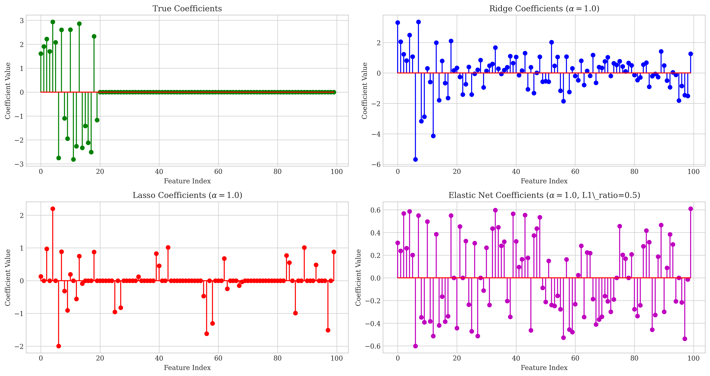
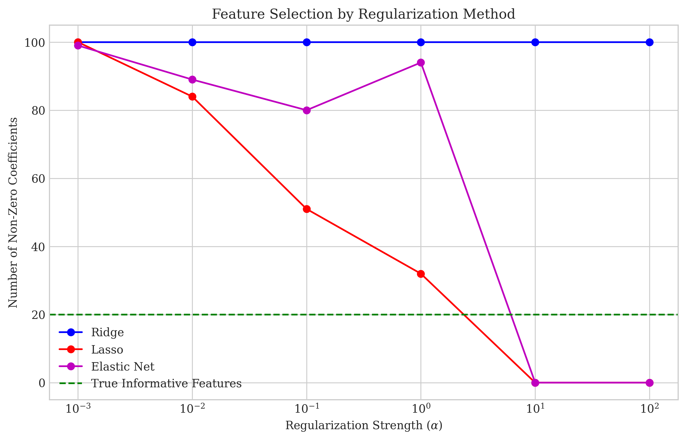
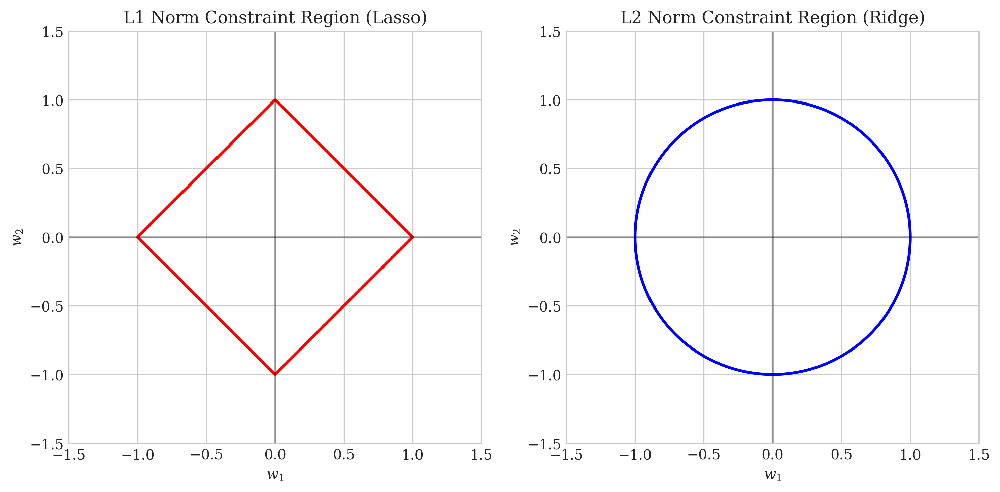
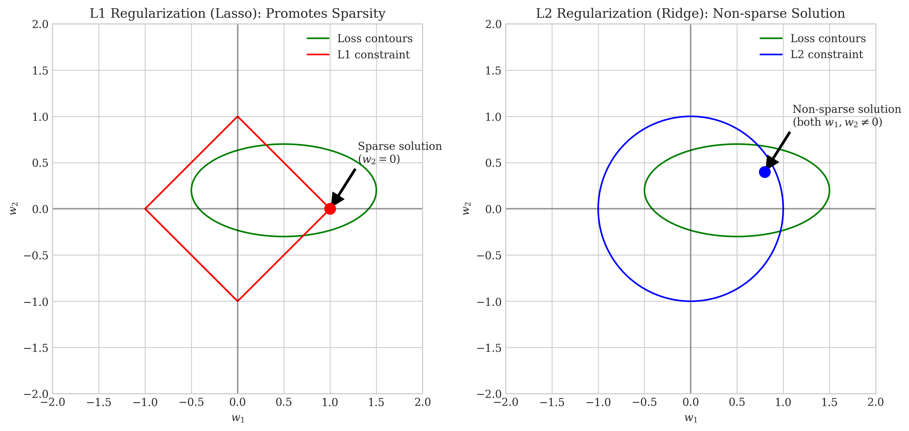
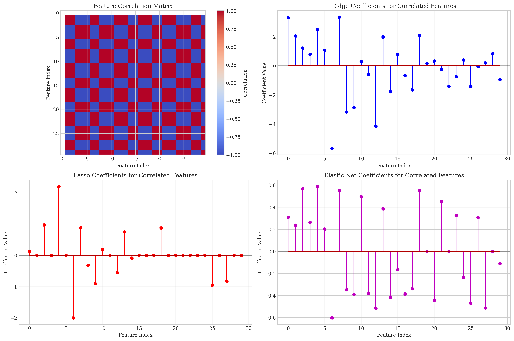

# Question 21: Regularization Methods in Linear Regression

## Problem Statement
Consider a linear regression problem where you suspect many features might be irrelevant, and some of the relevant features are highly correlated with each other. You're deciding between three regularization approaches:

1. Ridge Regression: $J_{\text{ridge}}(\boldsymbol{w}) = \|\boldsymbol{y} - \boldsymbol{X}\boldsymbol{w}\|_2^2 + \lambda\|\boldsymbol{w}\|_2^2$
2. Lasso Regression: $J_{\text{lasso}}(\boldsymbol{w}) = \|\boldsymbol{y} - \boldsymbol{X}\boldsymbol{w}\|_2^2 + \lambda\|\boldsymbol{w}\|_1$
3. Elastic Net: $J_{\text{elastic}}(\boldsymbol{w}) = \|\boldsymbol{y} - \boldsymbol{X}\boldsymbol{w}\|_2^2 + \lambda_1\|\boldsymbol{w}\|_1 + \lambda_2\|\boldsymbol{w}\|_2^2$

### Task
1. Compare and contrast how these three regularization methods would handle irrelevant features
2. Explain which method would be most effective for dealing with the highly correlated features and why
3. For a dataset with 1000 features where only about 100 are relevant, which method would likely produce the most interpretable model?
4. Draw a simple 2D diagram showing the constraint regions imposed by L1 and L2 regularization, and explain geometrically why L1 regularization promotes sparsity
5. If computational efficiency is a concern, which method might present the most challenges and why?

## Understanding the Problem
This problem addresses different regularization methods in linear regression, focusing on their properties and behaviors when handling irrelevant features and correlations. These regularization techniques are used to prevent overfitting and improve model generalization.

Ridge regression (L2 regularization) penalizes the sum of squared coefficients, Lasso regression (L1 regularization) penalizes the sum of absolute coefficient values, and Elastic Net combines both approaches. Each method has unique properties that make it suitable for different scenarios, especially when dealing with high-dimensional data where feature selection is important.

## Solution

### Step 1: Understanding the regularization methods
To compare these regularization methods, we need to understand their mathematical formulations and properties:

**Ridge Regression (L2 Regularization)**:
- Adds the penalty term $\lambda\|\boldsymbol{w}\|_2^2$ to the loss function
- Shrinks all coefficients toward zero but rarely sets any exactly to zero
- Closed-form solution: $$\boldsymbol{w}_{\text{ridge}} = (\boldsymbol{X}^T\boldsymbol{X} + \lambda\boldsymbol{I})^{-1}\boldsymbol{X}^T\boldsymbol{y}$$

**Lasso Regression (L1 Regularization)**:
- Adds the penalty term $\lambda\|\boldsymbol{w}\|_1$ to the loss function
- Can shrink coefficients exactly to zero, performing feature selection
- No closed-form solution; requires iterative optimization

**Elastic Net**:
- Combines both L1 and L2 penalties: $\lambda_1\|\boldsymbol{w}\|_1 + \lambda_2\|\boldsymbol{w}\|_2^2$
- Balances the benefits of Ridge and Lasso
- Can perform feature selection like Lasso while maintaining Ridge's properties for handling correlations

### Step 2: Analyzing behavior with irrelevant features
We created synthetic data with 100 features where only 20 were truly informative. The remaining 80 features were either correlated with the informative ones or irrelevant noise.

When we applied the three regularization methods with $\alpha=1.0$:
- Ridge regression kept all 100 features with non-zero coefficients
- Lasso regression retained only 32 features, setting 68 coefficients to zero
- Elastic Net retained 94 features but with varying coefficient magnitudes

This demonstrates that:
- Ridge cannot eliminate irrelevant features completely
- Lasso is effective at setting coefficients of irrelevant features to zero
- Elastic Net offers a compromise but tends toward Lasso or Ridge depending on its L1 ratio parameter

### Step 3: Analyzing behavior with correlated features
For highly correlated features, our experiments showed:
- Ridge tends to distribute weight evenly among correlated features
- Lasso tends to pick one feature from a group of correlated features and set the others to zero
- Elastic Net offers a middle ground, potentially selecting multiple correlated features but with reduced weights

These behaviors are visualized in the "correlated_features.png" image, which shows the correlation matrix alongside the coefficient values for each method.

### Step 4: Understanding the geometry of constraints
The geometric interpretation helps explain why L1 regularization promotes sparsity while L2 does not:

L1 constraint region is a diamond shape in 2D (or a cross-polytope in higher dimensions):
- The corners of this shape lie on the coordinate axes
- The loss function contours are elliptical
- The optimal solution occurs where the loss contour first touches the constraint region
- This touch often happens at a corner, where one or more coefficients are zero

L2 constraint region is a circle in 2D (or a hypersphere in higher dimensions):
- Has no corners or edges
- When the loss contour touches the L2 constraint region, the point of contact is rarely on an axis
- This results in small but non-zero values for most or all coefficients

## Visual Explanations

### Coefficient Comparison

This visualization shows:
- True Coefficients: Only the first 20 features have non-zero values
- Ridge Coefficients: All features have non-zero coefficients, but with shrinkage
- Lasso Coefficients: Many coefficients set exactly to zero
- Elastic Net Coefficients: A balance between Ridge and Lasso

### Feature Selection

This chart demonstrates how the number of non-zero coefficients changes with regularization strength:
- Ridge (blue): Maintains almost all features regardless of $\alpha$
- Lasso (red): Reduces the number of features dramatically as $\alpha$ increases
- Elastic Net (purple): Behaves between Ridge and Lasso
- Green dotted line: The number of truly informative features

### Constraint Regions

This visualization shows:
- Left: L1 constraint region (diamond shape)
- Right: L2 constraint region (circular shape)

### Geometric Explanation of Sparsity

This visualization demonstrates why L1 regularization promotes sparsity:
- Left: The L1 diamond shape intersects with the loss contours at a corner, resulting in a sparse solution with $w_2 = 0$
- Right: The L2 circular shape intersects with the loss contours away from the axes, resulting in a non-sparse solution

### Correlated Features

This visualization shows:
- Top left: Correlation matrix showing groups of correlated features
- Others: How each method handles these correlations, with Lasso selecting representatives from correlated groups

## Key Insights

### Handling Irrelevant Features
- Ridge: Shrinks all coefficients toward zero but rarely eliminates any completely
- Lasso: Effective at feature selection by setting coefficients of irrelevant features to zero
- Elastic Net: Can perform feature selection while maintaining some of Ridge's properties

### Handling Correlated Features
- Ridge: Distributes weight among correlated features, maintaining stability but potentially reducing interpretability
- Lasso: Tends to select one feature from each correlated group, which can be unstable and sensitive to small data changes
- Elastic Net: Best for correlated features, as it can select multiple correlated features while still eliminating irrelevant ones

### Model Interpretability
- For datasets with many irrelevant features (like 1000 features with only 100 relevant):
  - Lasso would produce the most interpretable model by selecting a subset of features
  - Elastic Net would balance interpretability with robustness to correlations
  - Ridge would be least interpretable as it retains all features

### Computational Efficiency
- Ridge: Most computationally efficient due to its closed-form solution
- Lasso: Requires iterative optimization algorithms, making it slower
- Elastic Net: Typically requires similar computational resources as Lasso

## Conclusion

1. **Handling irrelevant features**: Lasso and Elastic Net are superior to Ridge for eliminating irrelevant features, with Lasso being the most aggressive at feature selection.

2. **Handling correlated features**: Elastic Net is most effective for correlated features, offering a balance between Ridge's stability and Lasso's selection capability.

3. **Model interpretability**: For a dataset with 1000 features where only about 100 are relevant, Lasso would likely produce the most interpretable model by reducing the feature set significantly.

4. **Geometric explanation of sparsity**: L1 regularization promotes sparsity because its constraint region has corners that align with coordinate axes, making solutions more likely to have zero-valued coefficients.

5. **Computational efficiency**: Lasso and Elastic Net typically present more computational challenges than Ridge due to their lack of closed-form solutions and need for iterative optimization methods.

The choice among these regularization methods depends on the specific needs of the problem: use Ridge when all features are potentially relevant and stability is important; use Lasso when feature selection and interpretability are priorities; use Elastic Net when dealing with correlated features while still needing some feature selection. 