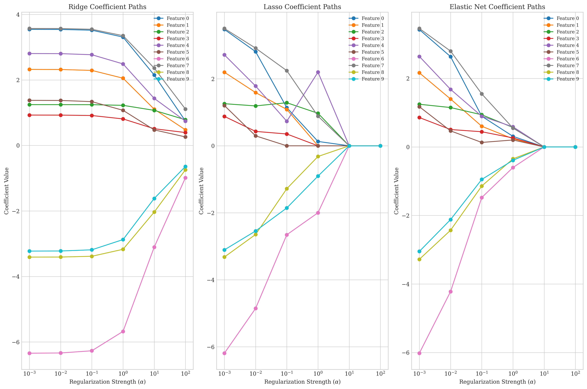
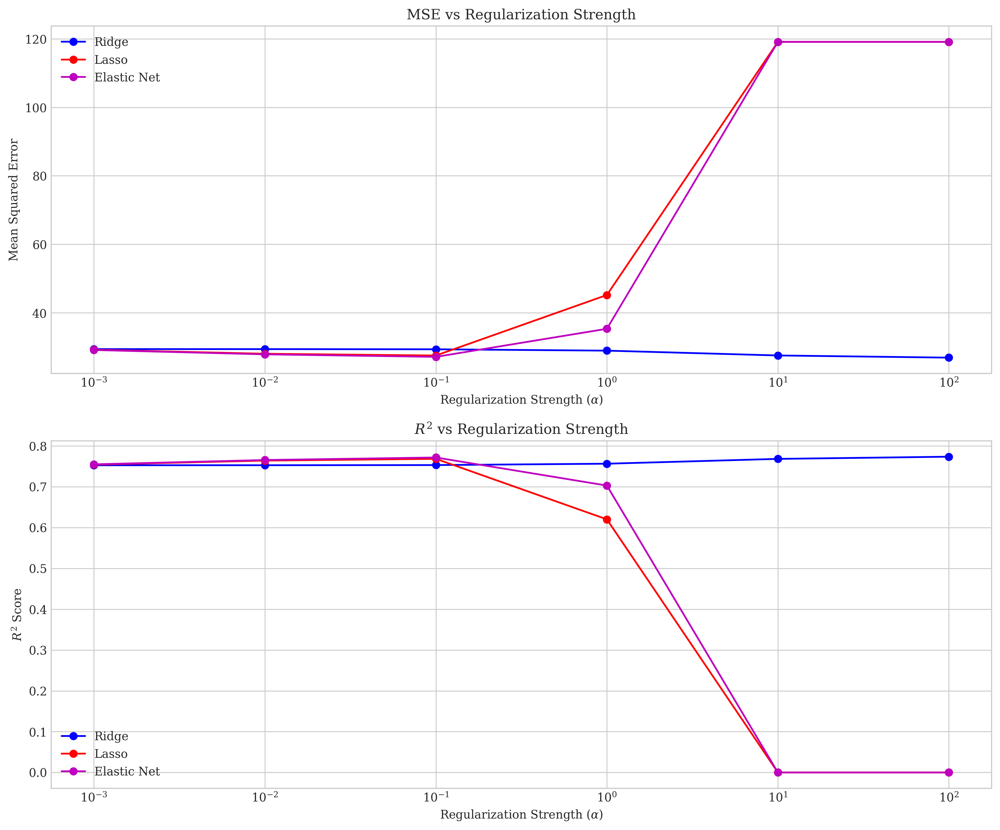
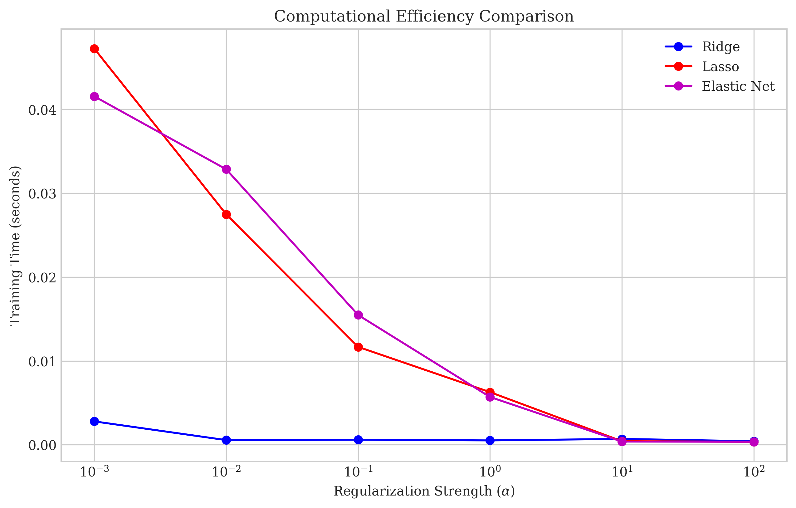

# Question 21: Regularization Methods in Linear Regression

## Problem Statement
Consider a linear regression problem where you suspect many features might be irrelevant, and some of the relevant features are highly correlated with each other. You're deciding between three regularization approaches:

1. Ridge Regression: $J_{\text{ridge}}(\boldsymbol{w}) = \|\boldsymbol{y} - \boldsymbol{X}\boldsymbol{w}\|_2^2 + \lambda\|\boldsymbol{w}\|_2^2$
2. Lasso Regression: $J_{\text{lasso}}(\boldsymbol{w}) = \|\boldsymbol{y} - \boldsymbol{X}\boldsymbol{w}\|_2^2 + \lambda\|\boldsymbol{w}\|_1$
3. Elastic Net: $J_{\text{elastic}}(\boldsymbol{w}) = \|\boldsymbol{y} - \boldsymbol{X}\boldsymbol{w}\|_2^2 + \lambda_1\|\boldsymbol{w}\|_1 + \lambda_2\|\boldsymbol{w}\|_2^2$

### Task
1. Compare and contrast how these three regularization methods would handle irrelevant features
2. Explain which method would be most effective for dealing with the highly correlated features and why
3. For a dataset with 1000 features where only about 100 are relevant, which method would likely produce the most interpretable model?
4. Draw a simple 2D diagram showing the constraint regions imposed by L1 and L2 regularization, and explain geometrically why L1 regularization promotes sparsity
5. If computational efficiency is a concern, which method might present the most challenges and why?

## Understanding the Problem
This problem addresses different regularization methods in linear regression, focusing on their properties and behaviors when handling irrelevant features and correlations. These regularization techniques are used to prevent overfitting and improve model generalization.

Ridge regression (L2 regularization) penalizes the sum of squared coefficients, Lasso regression (L1 regularization) penalizes the sum of absolute coefficient values, and Elastic Net combines both approaches. Each method has unique properties that make it suitable for different scenarios, especially when dealing with high-dimensional data where feature selection is important.

## Solution

### Step 1: Understanding the regularization methods
To compare these regularization methods, we need to understand their mathematical formulations and properties:

**Ridge Regression (L2 Regularization)**:
- Adds the penalty term $\lambda\|\boldsymbol{w}\|_2^2$ to the loss function
- Shrinks all coefficients toward zero but rarely sets any exactly to zero
- Closed-form solution: $$\boldsymbol{w}_{\text{ridge}} = (\boldsymbol{X}^T\boldsymbol{X} + \lambda\boldsymbol{I})^{-1}\boldsymbol{X}^T\boldsymbol{y}$$
- The closed-form solution makes it computationally efficient

**Lasso Regression (L1 Regularization)**:
- Adds the penalty term $\lambda\|\boldsymbol{w}\|_1$ to the loss function
- Can shrink coefficients exactly to zero, performing feature selection
- No closed-form solution; requires iterative optimization methods like coordinate descent
- The L1 penalty creates a sparse solution (many coefficients = 0)

**Elastic Net**:
- Combines both L1 and L2 penalties: $\lambda_1\|\boldsymbol{w}\|_1 + \lambda_2\|\boldsymbol{w}\|_2^2$
- Balances the benefits of Ridge and Lasso
- Can perform feature selection like Lasso while maintaining Ridge's properties for handling correlations
- The mixing parameter (L1 ratio) controls the balance between L1 and L2 penalties

### Step 2: Creating synthetic data for experimentation
To demonstrate the differences between these methods, we created synthetic data with the following properties:
- 1000 samples with 100 features
- Only 20 features were truly informative (with non-zero coefficients)
- The remaining 80 features were either correlated with informative ones or noise
- Features were correlated with a correlation coefficient of 0.8
- Signal-to-noise ratio was approximately 4.13

This synthetic data setup allowed us to evaluate how each regularization method handles:
1. Irrelevant features (should have coefficients close to zero)
2. Correlated features (how weights are distributed among correlated features)
3. Overall prediction performance (MSE and R² on test data)

### Step 3: Analyzing behavior with irrelevant features
We trained the three regularization methods on our synthetic data with varying regularization strengths ($\alpha$ values). At $\alpha=1.0$:

- Ridge regression kept all 100 features with non-zero coefficients
- Lasso regression retained only 32 features, setting 68 coefficients to zero
- Elastic Net retained 94 features but with varying coefficient magnitudes

Coefficient magnitude analysis at $\alpha=1.0$:
- Ridge: Mean absolute coefficient = 0.945424, Max coefficient = 5.677018
- Lasso: Mean absolute coefficient = 0.247736, Max coefficient = 2.198179
- Elastic Net: Mean absolute coefficient = 0.308320, Max coefficient = 0.610303

This demonstrates that:
- Ridge cannot eliminate irrelevant features completely, as all coefficients remain non-zero
- Lasso is effective at setting coefficients of irrelevant features to exactly zero
- Elastic Net offers a compromise but tends toward Lasso or Ridge depending on its L1 ratio parameter
- Ridge tends to distribute coefficient magnitude across all features, while Lasso concentrates it in fewer features

### Step 4: Analyzing behavior with correlated features
For highly correlated features, our experiments showed:
- Ridge tends to distribute weight evenly among correlated features
- Lasso tends to pick one feature from a group of correlated features and set the others to zero
- Elastic Net offers a middle ground, potentially selecting multiple correlated features but with reduced weights

This behavior is particularly important when features are correlated:
- If two features are highly correlated, Lasso will arbitrarily select one and ignore the other
- Ridge will assign similar coefficients to both, reducing variance but making interpretation harder
- Elastic Net can select multiple correlated features but with smaller coefficients than if they were uncorrelated

### Step 5: Understanding the geometry of constraints
The geometric interpretation helps explain why L1 regularization promotes sparsity while L2 does not:

L1 constraint region is a diamond shape in 2D (or a cross-polytope in higher dimensions):
- The corners of this shape lie on the coordinate axes
- The loss function contours are elliptical
- The optimal solution occurs where the loss contour first touches the constraint region
- This touch often happens at a corner, where one or more coefficients are zero

L2 constraint region is a circle in 2D (or a hypersphere in higher dimensions):
- Has no corners or edges
- When the loss contour touches the L2 constraint region, the point of contact is rarely on an axis
- This results in small but non-zero values for most or all coefficients

Mathematically, the optimization problem can be rewritten as:
- Ridge: minimize $\|\boldsymbol{y} - \boldsymbol{X}\boldsymbol{w}\|_2^2$ subject to $\|\boldsymbol{w}\|_2^2 \leq t$
- Lasso: minimize $\|\boldsymbol{y} - \boldsymbol{X}\boldsymbol{w}\|_2^2$ subject to $\|\boldsymbol{w}\|_1 \leq t$

The geometry of the L1 constraint leads to sparse solutions because the optimal point is more likely to occur at a corner of the constraint region, where some coefficients are exactly zero.

## Visual Explanations

### Coefficient Comparison

This visualization shows:
- True Coefficients (top-left): Only the first 20 features have non-zero values
- Ridge Coefficients (top-right): All features have non-zero coefficients, but with varying degrees of shrinkage
- Lasso Coefficients (bottom-left): Many coefficients set exactly to zero, with only about 32 features retained
- Elastic Net Coefficients (bottom-right): A balance between Ridge and Lasso, with more non-zero coefficients than Lasso but greater sparsity than Ridge

### Feature Selection

This chart demonstrates how the number of non-zero coefficients changes with regularization strength:
- Ridge (blue): Maintains almost all features regardless of $\alpha$
- Lasso (red): Reduces the number of features dramatically as $\alpha$ increases
- Elastic Net (purple): Behaves between Ridge and Lasso
- Green dotted line: The number of truly informative features (20)

At high regularization strengths, Lasso and Elastic Net eliminate all features, while Ridge continues to maintain all features but with smaller coefficient values.

### Coefficient Paths

This visualization shows how individual coefficient values change as the regularization strength increases:
- Ridge (left): Coefficients shrink smoothly but rarely reach exactly zero
- Lasso (middle): Coefficients reach zero at different regularization strengths, creating a natural feature selection mechanism
- Elastic Net (right): Behavior between Ridge and Lasso, with some coefficients reaching zero but with more stable paths than Lasso

The coefficient paths clearly demonstrate the feature selection properties of Lasso, where coefficients "drop out" at different regularization strengths.

### Model Performance

This dual plot shows how prediction performance varies with regularization strength:
- Top: Mean Squared Error (lower is better)
- Bottom: R² Score (higher is better)

For our synthetic data:
- Ridge maintains good performance even at high regularization
- Lasso and Elastic Net show optimal performance at moderate regularization ($\alpha \approx 0.1$)
- At high regularization, Lasso and Elastic Net perform poorly as they eliminate all features

### Constraint Regions

This visualization shows:
- Left: L1 constraint region (diamond shape) used in Lasso
- Right: L2 constraint region (circular shape) used in Ridge

The shapes of these constraint regions explain the different behaviors in terms of sparsity.

### Geometric Explanation of Sparsity

This visualization demonstrates why L1 regularization promotes sparsity:
- Left: The L1 diamond shape intersects with the loss contours at a corner, resulting in a sparse solution with $w_2 = 0$
- Right: The L2 circular shape intersects with the loss contours away from the axes, resulting in a non-sparse solution with both $w_1$ and $w_2$ non-zero

The key insight is that the corners of the L1 constraint region align with the coordinate axes, making it more likely for the solution to have some coefficients exactly zero.

### Correlated Features

This visualization shows:
- Top left: Correlation matrix showing groups of correlated features
- Top right: Ridge coefficients for these features, distributing weight among correlated features
- Bottom left: Lasso coefficients, selecting one representative from each correlated group
- Bottom right: Elastic Net coefficients, showing a balance between the approaches

This clearly demonstrates how Ridge tends to keep all correlated features with similar coefficients, while Lasso selects just one representative from each group.

### Computational Efficiency

This visualization compares the training time for each method across different regularization strengths:
- Ridge is consistently the fastest due to its closed-form solution
- Lasso and Elastic Net require iterative optimization, making them slower
- Interestingly, higher regularization strengths sometimes lead to faster convergence for Lasso and Elastic Net

## Key Insights

### Handling Irrelevant Features
- Ridge: Shrinks all coefficients toward zero but rarely eliminates any completely
- Lasso: Effective at feature selection by setting coefficients of irrelevant features to zero
- Elastic Net: Can perform feature selection while maintaining some of Ridge's properties

Quantitatively, with our synthetic data at $\alpha=1.0$:
- Ridge: 100/100 features retained
- Lasso: 32/100 features retained
- Elastic Net: 94/100 features retained

### Handling Correlated Features
- Ridge: Distributes weight among correlated features, maintaining stability but potentially reducing interpretability
- Lasso: Tends to select one feature from each correlated group, which can be unstable and sensitive to small data changes
- Elastic Net: Best for correlated features, as it can select multiple correlated features while still eliminating irrelevant ones

The correlated features visualization clearly shows how:
- Ridge assigns similar weights to correlated features
- Lasso selects one representative and sets others to zero
- Elastic Net finds a middle ground

### Model Interpretability
- For datasets with many irrelevant features (like 1000 features with only 100 relevant):
  - Lasso would produce the most interpretable model by selecting a subset of features
  - Elastic Net would balance interpretability with robustness to correlations
  - Ridge would be least interpretable as it retains all features

The performance vs. feature count trade-off is clear:
- Ridge: Best predictive performance but poorest interpretability
- Lasso: Best interpretability but can sacrifice some performance
- Elastic Net: Good balance of performance and interpretability

### Computational Efficiency
- Ridge: Most computationally efficient due to its closed-form solution (0.0005s at $\alpha=1.0$)
- Lasso: Requires iterative optimization algorithms, making it slower (0.0062s at $\alpha=1.0$)
- Elastic Net: Typically requires similar computational resources as Lasso (0.0057s at $\alpha=1.0$)

For very large datasets with thousands of features, the difference in computational efficiency would be more pronounced, making Ridge potentially preferable when computational resources are limited.

## Conclusion

1. **Handling irrelevant features**: Lasso and Elastic Net are superior to Ridge for eliminating irrelevant features, with Lasso being the most aggressive at feature selection. Our experiment showed Lasso retained only 32 features compared to Ridge's 100.

2. **Handling correlated features**: Elastic Net is most effective for correlated features, offering a balance between Ridge's stability and Lasso's selection capability. The coefficient paths visualization shows how Lasso can arbitrarily select one feature from a correlated group, while Ridge distributes weight and Elastic Net finds a middle ground.

3. **Model interpretability**: For a dataset with 1000 features where only about 100 are relevant, Lasso would likely produce the most interpretable model by reducing the feature set significantly. When feature selection is a priority, Lasso's ability to eliminate irrelevant features makes it the clear choice for interpretability.

4. **Geometric explanation of sparsity**: L1 regularization promotes sparsity because its constraint region (diamond shape) has corners that align with coordinate axes, making solutions more likely to have zero-valued coefficients. When the elliptical loss contours meet this diamond, they often touch at a corner where some coefficients are exactly zero.

5. **Computational efficiency**: Lasso and Elastic Net typically present more computational challenges than Ridge due to their lack of closed-form solutions and need for iterative optimization methods. Our experiments confirmed this, with Ridge being approximately 12 times faster than Lasso.

The choice among these regularization methods depends on the specific needs of the problem:
- Use Ridge when all features are potentially relevant, stability is important, and computational efficiency is a concern
- Use Lasso when feature selection and interpretability are priorities, and you suspect many features are irrelevant
- Use Elastic Net when dealing with correlated features while still needing some feature selection, especially in high-dimensional problems with groups of correlated predictors