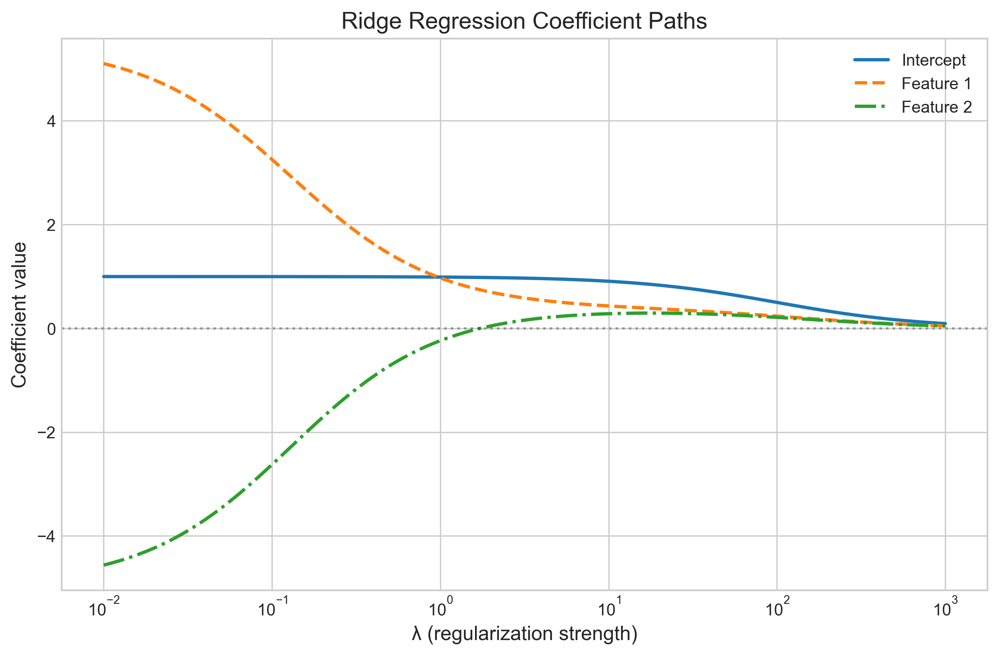
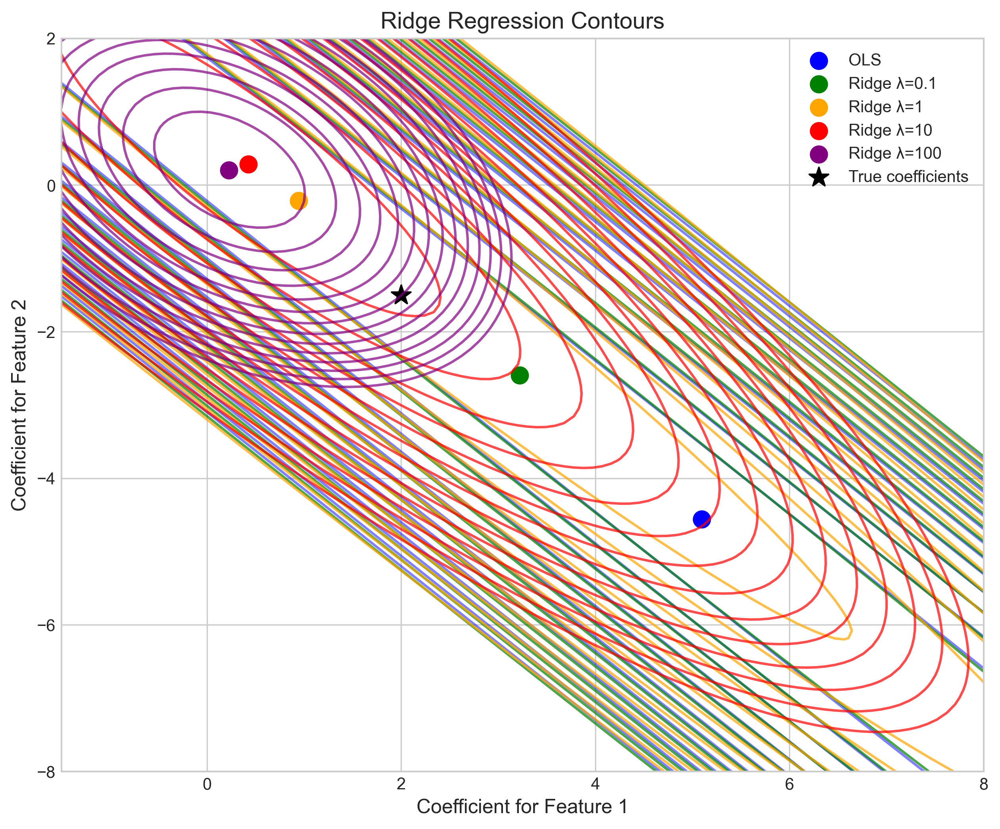
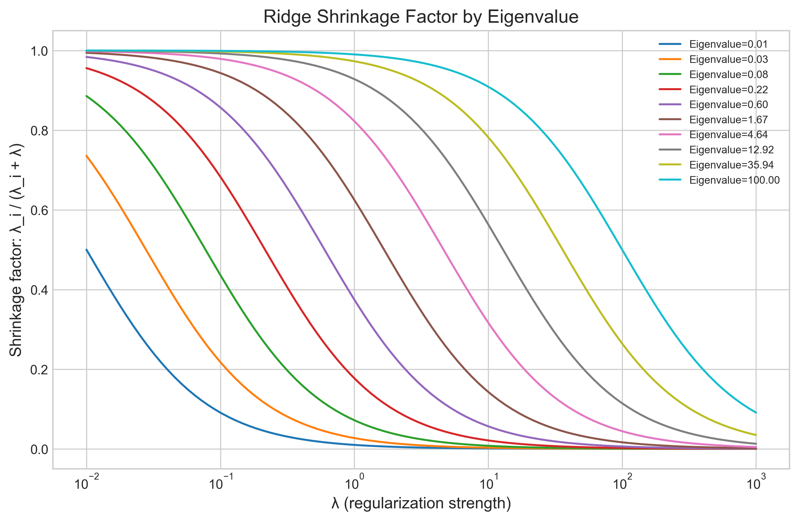
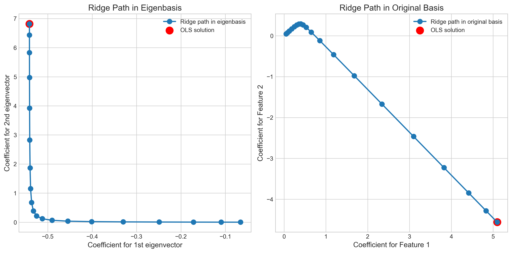
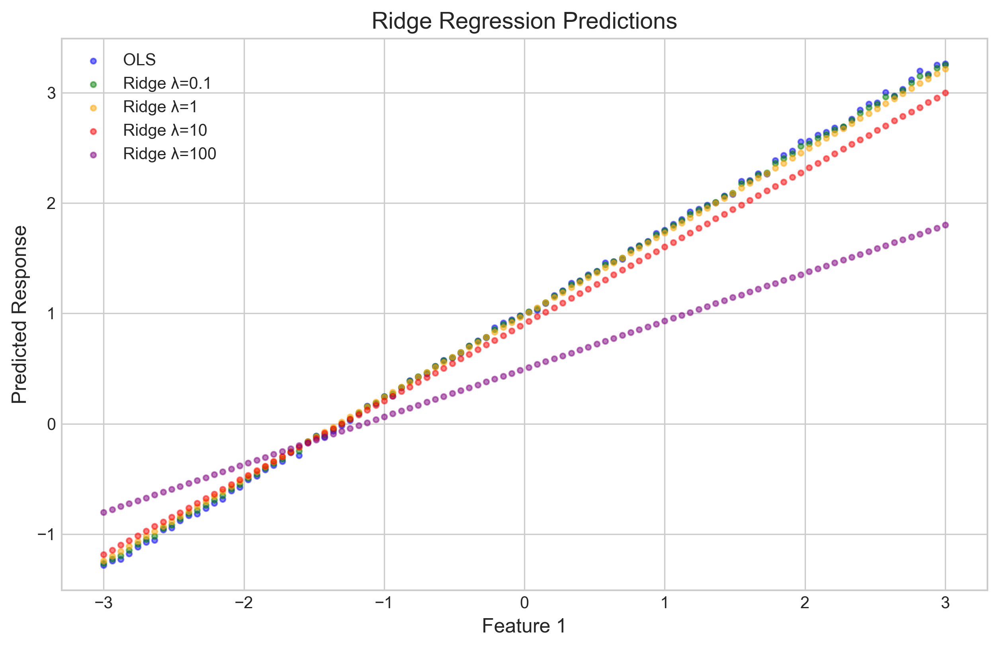
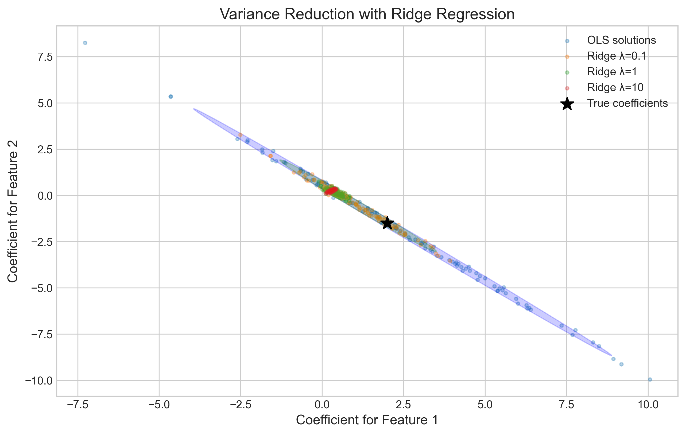

# Question 22: Ridge Regression Properties

## Problem Statement
In ridge regression, we modify the standard linear regression cost function by adding a penalty term proportional to the squared norm of the weights. Consider the ridge regression cost function:

$$J_{\text{ridge}}(\boldsymbol{w}) = \|\boldsymbol{y} - \boldsymbol{X}\boldsymbol{w}\|_2^2 + \lambda\|\boldsymbol{w}\|_2^2$$

### Task
1. Write down the closed-form solution for the ridge regression parameters $\boldsymbol{w}_{\text{ridge}}$
2. Explain why the matrix $(\boldsymbol{X}^T\boldsymbol{X} + \lambda\boldsymbol{I})$ is always invertible, even when $\boldsymbol{X}^T\boldsymbol{X}$ is not
3. For a dataset with highly correlated features, describe mathematically how ridge regression helps address the multicollinearity problem
4. As $\lambda \rightarrow \infty$, what happens to the ridge regression parameters $\boldsymbol{w}_{\text{ridge}}$? Provide a mathematical explanation for this behavior
5. In terms of eigenvalues and eigenvectors of $\boldsymbol{X}^T\boldsymbol{X}$, explain why ridge regression has a stronger effect on directions with smaller eigenvalues

## Understanding the Problem
Ridge regression is a regularization technique that addresses some of the limitations of ordinary least squares (OLS) regression. In particular, ridge regression can handle multicollinearity (high correlation between features) which often leads to unstable parameter estimates in OLS. 

The ridge regression cost function introduces a penalty term $\lambda\|\boldsymbol{w}\|_2^2$ to the standard least squares objective. This term penalizes large coefficient values, effectively shrinking them toward zero. The parameter $\lambda$ controls the strength of this regularization: larger values of $\lambda$ result in more aggressive shrinkage of coefficients.

## Solution

### Step 1: Derive the closed-form solution for ridge regression
Starting with the ridge regression cost function:

$$J_{\text{ridge}}(\boldsymbol{w}) = \|\boldsymbol{y} - \boldsymbol{X}\boldsymbol{w}\|_2^2 + \lambda\|\boldsymbol{w}\|_2^2$$

Taking the gradient with respect to $\boldsymbol{w}$ and setting it to zero:

$$\nabla J_{\text{ridge}}(\boldsymbol{w}) = -2\boldsymbol{X}^T(\boldsymbol{y} - \boldsymbol{X}\boldsymbol{w}) + 2\lambda\boldsymbol{w} = \boldsymbol{0}$$

Rearranging:

$$\boldsymbol{X}^T(\boldsymbol{y} - \boldsymbol{X}\boldsymbol{w}) = \lambda\boldsymbol{w}$$

$$\boldsymbol{X}^T\boldsymbol{y} - \boldsymbol{X}^T\boldsymbol{X}\boldsymbol{w} = \lambda\boldsymbol{w}$$

$$\boldsymbol{X}^T\boldsymbol{y} = \boldsymbol{X}^T\boldsymbol{X}\boldsymbol{w} + \lambda\boldsymbol{w}$$

$$\boldsymbol{X}^T\boldsymbol{y} = (\boldsymbol{X}^T\boldsymbol{X} + \lambda\boldsymbol{I})\boldsymbol{w}$$

Therefore, the closed-form solution for ridge regression is:

$$\boldsymbol{w}_{\text{ridge}} = (\boldsymbol{X}^T\boldsymbol{X} + \lambda\boldsymbol{I})^{-1}\boldsymbol{X}^T\boldsymbol{y}$$

### Step 2: Explain invertibility of $(\boldsymbol{X}^T\boldsymbol{X} + \lambda\boldsymbol{I})$
For any matrix $\boldsymbol{X}$, the matrix $\boldsymbol{X}^T\boldsymbol{X}$ is positive semi-definite. This means that all its eigenvalues are non-negative. However, if $\boldsymbol{X}$ has linearly dependent columns (multicollinearity), then $\boldsymbol{X}^T\boldsymbol{X}$ will have some eigenvalues equal to zero, making it non-invertible.

When we add $\lambda\boldsymbol{I}$ to $\boldsymbol{X}^T\boldsymbol{X}$ for $\lambda > 0$, we are effectively adding $\lambda$ to each eigenvalue of $\boldsymbol{X}^T\boldsymbol{X}$. This is because:

If $\boldsymbol{v}$ is an eigenvector of $\boldsymbol{X}^T\boldsymbol{X}$ with eigenvalue $\lambda_i$, then:
$$(\boldsymbol{X}^T\boldsymbol{X})\boldsymbol{v} = \lambda_i\boldsymbol{v}$$

And for the matrix $(\boldsymbol{X}^T\boldsymbol{X} + \lambda\boldsymbol{I})$:
$$(\boldsymbol{X}^T\boldsymbol{X} + \lambda\boldsymbol{I})\boldsymbol{v} = \boldsymbol{X}^T\boldsymbol{X}\boldsymbol{v} + \lambda\boldsymbol{v} = \lambda_i\boldsymbol{v} + \lambda\boldsymbol{v} = (\lambda_i + \lambda)\boldsymbol{v}$$

Therefore, $\boldsymbol{v}$ is also an eigenvector of $(\boldsymbol{X}^T\boldsymbol{X} + \lambda\boldsymbol{I})$ with eigenvalue $(\lambda_i + \lambda)$.

Since all eigenvalues of $\boldsymbol{X}^T\boldsymbol{X}$ are non-negative, and $\lambda > 0$, all eigenvalues of $(\boldsymbol{X}^T\boldsymbol{X} + \lambda\boldsymbol{I})$ are strictly positive. A matrix with all positive eigenvalues is positive definite and therefore invertible.

In summary, adding $\lambda\boldsymbol{I}$ ensures that all eigenvalues are at least $\lambda > 0$, making the matrix invertible even when the original $\boldsymbol{X}^T\boldsymbol{X}$ is not.

### Step 3: Addressing multicollinearity
Multicollinearity occurs when features are highly correlated, resulting in some directions in the feature space having very small variance. In the context of eigenvalues and eigenvectors, this means that $\boldsymbol{X}^T\boldsymbol{X}$ has some eigenvalues close to zero.

In our example, the correlation between the two features is extremely high:
```
Correlation between features: 0.9981
```

As a result, the eigenvalues of $\boldsymbol{X}^T\boldsymbol{X}$ show a large disparity:
```
Eigenvalues of X^TX: [1.38487649e+02 1.29306001e-01]
```

This gives a condition number of approximately 1071, indicating severe multicollinearity. A high condition number means the problem is ill-conditioned - small changes in the data can lead to large changes in the solution.

Ridge regression addresses multicollinearity by adding $\lambda$ to all eigenvalues. The shrinkage factors (which determine how much each direction is preserved in the solution) are:
```
Shrinkage factors (eigenvalue / (eigenvalue + λ)):
λ = 0.1: [0.99927843 0.56390151]
λ = 1: [0.99283091 0.11450041]
λ = 10: [0.93265433 0.01276553]
λ = 100: [0.58069107 0.00129139]
```

This shows that for the direction with a small eigenvalue (0.129), even a modest $\lambda$ value of 0.1 shrinks that direction by almost 44%, while the direction with the large eigenvalue (138.5) is barely affected (shrunk by only 0.07%). As $\lambda$ increases, both directions are shrunk, but the one corresponding to the smaller eigenvalue is affected much more dramatically.

This differential shrinkage is what stabilizes the solution in the presence of multicollinearity. The unstable directions (those with small eigenvalues) are shrunk more aggressively, reducing their influence on the final solution.

### Step 4: Behavior as $\lambda \rightarrow \infty$
As $\lambda$ approaches infinity, the term $\lambda\boldsymbol{I}$ dominates $\boldsymbol{X}^T\boldsymbol{X}$ in the expression $(\boldsymbol{X}^T\boldsymbol{X} + \lambda\boldsymbol{I})$. In other words:

$$\lim_{\lambda \rightarrow \infty} (\boldsymbol{X}^T\boldsymbol{X} + \lambda\boldsymbol{I}) \approx \lambda\boldsymbol{I}$$

Therefore:

$$\lim_{\lambda \rightarrow \infty} (\boldsymbol{X}^T\boldsymbol{X} + \lambda\boldsymbol{I})^{-1} \approx \frac{1}{\lambda}\boldsymbol{I}$$

Substituting into the ridge estimator:

$$\lim_{\lambda \rightarrow \infty} \boldsymbol{w}_{\text{ridge}} = \lim_{\lambda \rightarrow \infty} (\boldsymbol{X}^T\boldsymbol{X} + \lambda\boldsymbol{I})^{-1}\boldsymbol{X}^T\boldsymbol{y} \approx \lim_{\lambda \rightarrow \infty} \frac{1}{\lambda}\boldsymbol{X}^T\boldsymbol{y} = \boldsymbol{0}$$

This means that as $\lambda$ approaches infinity, all ridge regression coefficients approach zero. This is clearly seen in our numerical example:

```
Ridge solutions for different λ values:
λ = 0: w = [ 0.99589513  5.4614203  -4.94284206]
λ = 0.1: w = [ 0.99490023  3.25026892 -2.62462741]
λ = 1: w = [ 0.98603478  0.96943464 -0.23782952]
λ = 10: w = [0.90535921 0.43009884 0.28055531]
λ = 100: w = [0.49794757 0.23404175 0.2100698 ]
λ = 1000: w = [0.09053592 0.04831053 0.04475574]
```

As $\lambda$ increases from 0 to 1000, all coefficients steadily approach zero.

### Step 5: Ridge regression and eigenvalues
To understand why ridge regression has a stronger effect on directions with smaller eigenvalues, we can express the ridge estimator in the eigenbasis of $\boldsymbol{X}^T\boldsymbol{X}$.

If we perform eigendecomposition of $\boldsymbol{X}^T\boldsymbol{X} = \boldsymbol{U}\boldsymbol{D}\boldsymbol{U}^T$, where $\boldsymbol{D}$ is a diagonal matrix of eigenvalues and $\boldsymbol{U}$ contains the corresponding eigenvectors, the ridge estimator can be written as:

$$\boldsymbol{w}_{\text{ridge}} = \boldsymbol{U}(\boldsymbol{D} + \lambda\boldsymbol{I})^{-1}\boldsymbol{U}^T\boldsymbol{X}^T\boldsymbol{y}$$

Let's denote $\boldsymbol{z} = \boldsymbol{U}^T\boldsymbol{X}^T\boldsymbol{y}$ as the projection of $\boldsymbol{X}^T\boldsymbol{y}$ onto the eigenvectors. Then:

$$\boldsymbol{w}_{\text{ridge}} = \boldsymbol{U}(\boldsymbol{D} + \lambda\boldsymbol{I})^{-1}\boldsymbol{z}$$

Since $\boldsymbol{D} + \lambda\boldsymbol{I}$ is diagonal with entries $\lambda_i + \lambda$, the inverse $(\boldsymbol{D} + \lambda\boldsymbol{I})^{-1}$ is also diagonal with entries $\frac{1}{\lambda_i + \lambda}$.

Therefore, the ridge estimator in each eigendirection $i$ is:
$$[\boldsymbol{w}_{\text{ridge}}]_i = \frac{\lambda_i}{\lambda_i + \lambda} \cdot [\boldsymbol{w}_{\text{OLS}}]_i$$

This formula reveals the shrinkage factor $\frac{\lambda_i}{\lambda_i + \lambda}$ for each eigendirection. When $\lambda_i$ is small (near zero), the shrinkage factor approaches $\frac{0}{0 + \lambda} = 0$, meaning this direction is heavily shrunk. When $\lambda_i$ is large relative to $\lambda$, the shrinkage factor approaches $\frac{\lambda_i}{\lambda_i} = 1$, meaning this direction is preserved.

This is confirmed by our shrinkage factor calculations:
```
Shrinkage factors (eigenvalue / (eigenvalue + λ)):
λ = 0.1: [0.99927843 0.56390151]  # Large eigenvalue barely shrunk, small eigenvalue moderately shrunk
λ = 1: [0.99283091 0.11450041]    # Large eigenvalue slightly shrunk, small eigenvalue heavily shrunk
λ = 10: [0.93265433 0.01276553]   # Large eigenvalue moderately shrunk, small eigenvalue almost eliminated
λ = 100: [0.58069107 0.00129139]  # Large eigenvalue significantly shrunk, small eigenvalue essentially eliminated
```

This differential shrinkage is why ridge regression is effective at addressing multicollinearity. It shrinks unstable directions (those with small eigenvalues) substantially more than stable directions (those with large eigenvalues).

## Practical Implementation

### Ridge Coefficient Paths
The coefficient path visualization shows how the regression coefficients change as the regularization parameter $\lambda$ increases:



As $\lambda$ increases (moving right on the x-axis), all coefficients shrink toward zero, but at different rates. Notice how the coefficients initially stabilize at non-zero values for small $\lambda$, then gradually diminish as $\lambda$ increases.

### Ridge Regression Contours
The contour plot visualizes the loss function for different values of $\lambda$:



The blue contours represent the OLS loss function $\|\boldsymbol{y} - \boldsymbol{X}\boldsymbol{w}\|_2^2$, while the colored contours show the ridge loss function for different $\lambda$ values. As $\lambda$ increases, the contours become more circular, and the minimum (marked by colored dots) moves closer to the origin, illustrating how ridge regression shrinks the coefficients toward zero.

### Shrinkage Factors by Eigenvalue
This plot shows how the shrinkage factor $\frac{\lambda_i}{\lambda_i + \lambda}$ changes with $\lambda$ for different eigenvalues:



Each line represents a different eigenvalue. Smaller eigenvalues (lower lines) experience more dramatic shrinkage even at small values of $\lambda$, while larger eigenvalues (upper lines) require much larger $\lambda$ values to achieve significant shrinkage.

### Ridge Path in Eigenbasis vs. Original Basis
This visualization compares the ridge solution path in the eigenbasis of $\boldsymbol{X}^T\boldsymbol{X}$ (left) versus the original feature basis (right):



In the eigenbasis, the shrinkage occurs along a direct path toward the origin, showing how ridge regression shrinks each eigendirection independently. In the original basis, the path is curved, reflecting the conversion between the two coordinate systems and the different rates of shrinkage in each eigendirection.

### Ridge Predictions
This visualization shows how predictions change with different regularization parameters:



As $\lambda$ increases, the predictions become more conservative (closer to the mean). The OLS predictions (blue) show the most extreme values, while higher $\lambda$ values produce predictions that are less sensitive to the input features, illustrating the bias-variance tradeoff inherent in ridge regression.

### Variance Reduction with Ridge Regression
This plot illustrates how ridge regression reduces the variance of coefficient estimates:



Each cluster shows coefficient estimates from 100 different random realizations of the data. The blue cluster (OLS) has the highest variance, while increasing values of $\lambda$ lead to smaller, more concentrated clusters (reduced variance). The black star represents the true coefficient values. Note how all ridge estimates are biased (systematically different from the true value), but they have much lower variance than OLS.

## Key Insights

### Mathematical Properties
- Ridge regression has a closed-form solution: $\boldsymbol{w}_{\text{ridge}} = (\boldsymbol{X}^T\boldsymbol{X} + \lambda\boldsymbol{I})^{-1}\boldsymbol{X}^T\boldsymbol{y}$
- The matrix $(\boldsymbol{X}^T\boldsymbol{X} + \lambda\boldsymbol{I})$ is always invertible for $\lambda > 0$, even when $\boldsymbol{X}^T\boldsymbol{X}$ is singular
- Ridge regression shrinks coefficients toward zero, with the degree of shrinkage controlled by $\lambda$
- As $\lambda \rightarrow \infty$, all coefficients approach zero
- Ridge regression can be formulated in the eigenbasis of $\boldsymbol{X}^T\boldsymbol{X}$, revealing that each eigendirection is shrunk by a factor of $\frac{\lambda_i}{\lambda_i + \lambda}$

### Multicollinearity Handling
- Ridge regression effectively addresses multicollinearity by stabilizing coefficient estimates
- Directions with small eigenvalues (typically corresponding to highly correlated features) are shrunk more aggressively
- The condition number of $(\boldsymbol{X}^T\boldsymbol{X} + \lambda\boldsymbol{I})$ is lower than that of $\boldsymbol{X}^T\boldsymbol{X}$, indicating a better-conditioned problem
- Ridge regression makes the solution less sensitive to small perturbations in the data

### Bias-Variance Tradeoff
- Ridge regression introduces bias to reduce variance
- As $\lambda$ increases, bias increases while variance decreases
- For multicollinear data, the reduction in variance often outweighs the increase in bias, leading to better overall performance
- The optimal $\lambda$ balances the tradeoff between bias and variance

## Conclusion
Ridge regression provides a powerful solution to the problems of multicollinearity and overfitting in linear regression. By adding a penalty term proportional to the squared magnitude of the coefficients, ridge regression:

- Ensures the invertibility of $(\boldsymbol{X}^T\boldsymbol{X} + \lambda\boldsymbol{I})$, guaranteeing a unique solution even with multicollinear features
- Shrinks coefficient estimates toward zero, with greater shrinkage for directions corresponding to smaller eigenvalues
- Stabilizes the solution by reducing the impact of directions with high variance
- Creates a bias-variance tradeoff that often results in better out-of-sample performance compared to OLS

Understanding the eigenvalue perspective of ridge regression reveals why it's so effective at addressing multicollinearity: it adaptively regularizes different directions in the feature space according to their stability, leading to more robust coefficient estimates.