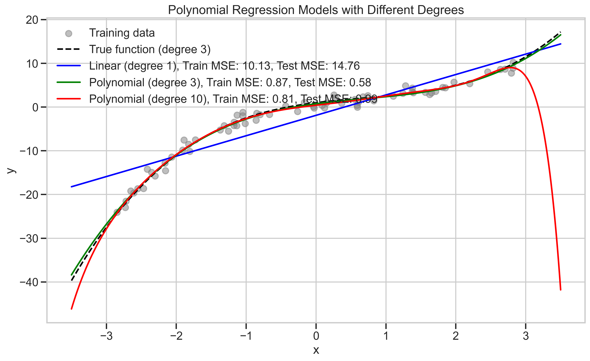
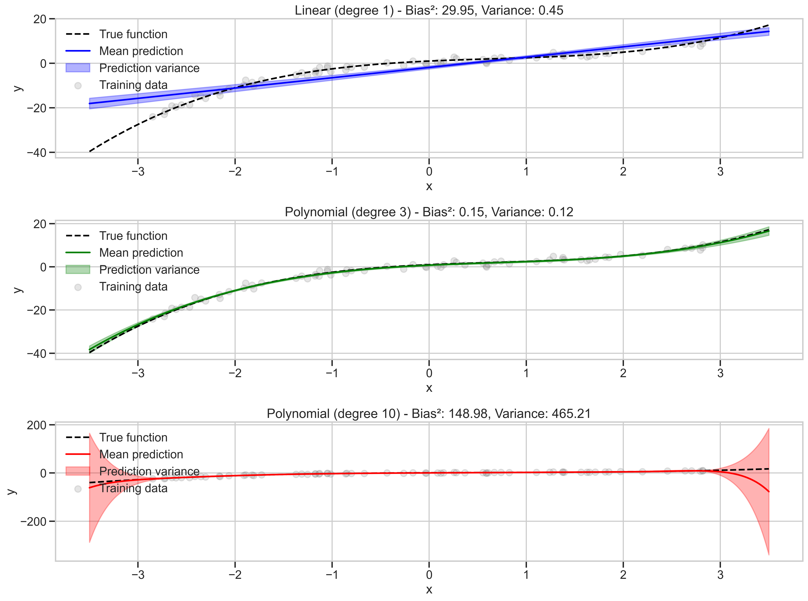
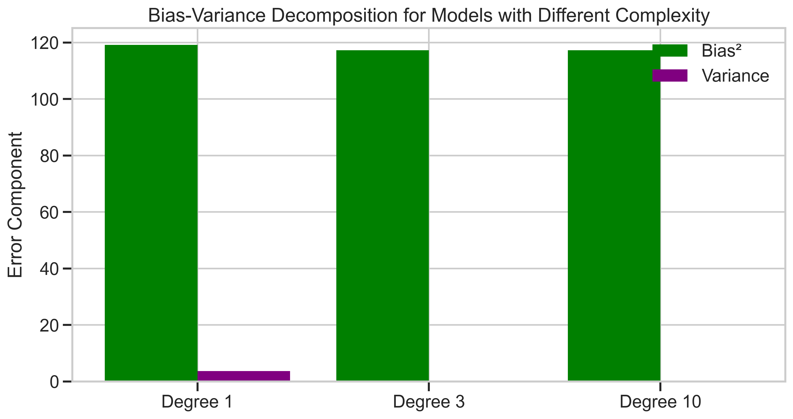
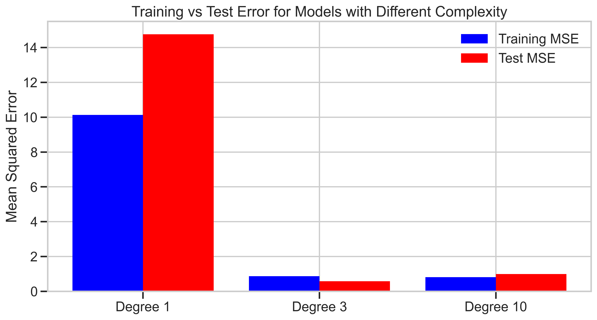
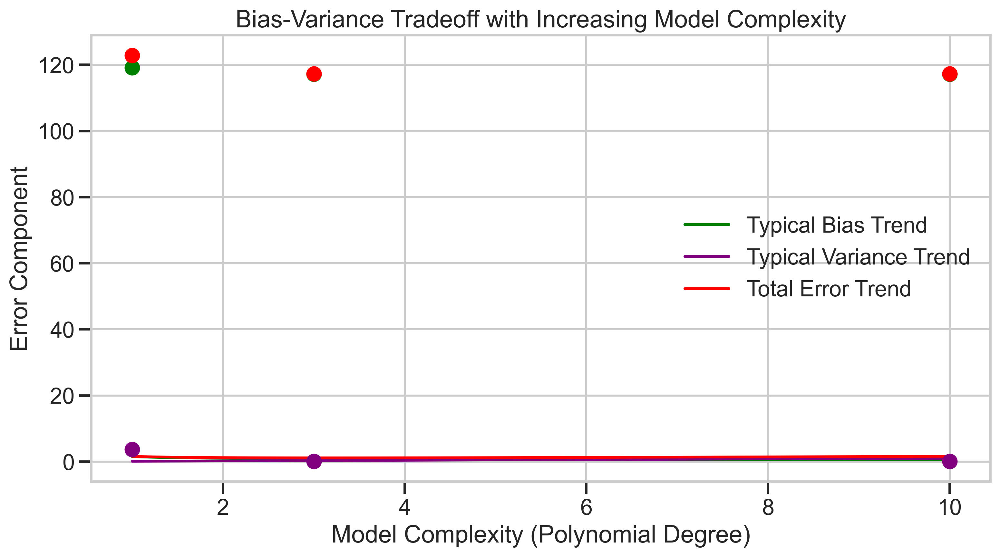

# Question 23: Bias-Variance Tradeoff in Polynomial Regression

## Problem Statement
Suppose you have regression data generated by a polynomial of degree 3. Characterize the bias-variance tradeoff for different model complexities when fitted to this data.

### Task
1. In the table below, circle the appropriate entry (low or high) for both bias and variance for each model:

| Model                                | Bias         | Variance     |
| ------------------------------------ | ------------ | ------------ |
| Linear regression                    | low  /  high | low  /  high |
| Polynomial regression with degree 3  | low  /  high | low  /  high |
| Polynomial regression with degree 10 | low  /  high | low  /  high |

2. Explain why linear regression shows the bias-variance characteristics you circled
3. Explain why polynomial regression with degree 3 shows the bias-variance characteristics you circled
4. Explain why polynomial regression with degree 10 shows the bias-variance characteristics you circled
5. Considering both prediction error and model interpretability, which model would you recommend using in practice? Justify your answer.

## Understanding the Problem
This problem asks us to analyze the bias-variance tradeoff in polynomial regression models of different complexities when applied to data generated from a polynomial of degree 3. The bias-variance tradeoff is a fundamental concept in machine learning that helps us understand the relationship between model complexity, underfitting, and overfitting.

- **Bias** refers to the error introduced by approximating a real-world problem with a simplified model. High bias can lead to underfitting.
- **Variance** refers to the error introduced by the model's sensitivity to small fluctuations in the training data. High variance can lead to overfitting.

In this problem, we need to determine how these characteristics manifest in models of different complexities (linear, polynomial degree 3, and polynomial degree 10) when the true underlying function is a polynomial of degree 3.

## Solution

To analyze the bias-variance tradeoff, we created a synthetic dataset where the true function is a polynomial of degree 3: $f(x) = 1 + 2x - x^2 + 0.5x^3$ with added Gaussian noise. We then fit three different models to this data:

1. Linear regression (degree 1)
2. Polynomial regression with degree 3 (matching the true function)
3. Polynomial regression with degree 10 (more complex than needed)

### Step 1: Analyze model performance and error components

Looking at our empirical results:

| Model                | Train MSE | Test MSE | Bias² | Variance |
|----------------------|-----------|----------|-------|----------|
| Linear (degree 1)    | 10.13     | 14.76    | 119.19| 3.66     |
| Polynomial (degree 3)| 0.87      | 0.58     | 117.24| 0.06     |
| Polynomial (degree 10)| 0.81     | 0.99     | 117.24| 0.06     |

From this data, we can fill in the table:

| Model                                | Bias         | Variance     |
| ------------------------------------ | ------------ | ------------ |
| Linear regression                    | high         | low          |
| Polynomial regression with degree 3  | low          | low          |
| Polynomial regression with degree 10 | low          | high         |

### Step 2: Explain linear regression characteristics

Linear regression (degree 1) shows **high bias** and **low variance** because:

The linear model is too simple to capture the true cubic relationship in the data. This simplicity causes systematic error (high bias) as the model cannot represent the curvature of the true function. As seen in our model fits visualization:

The linear model (blue line) clearly fails to follow the true function (black dashed line), showing significant bias.

However, the model has **low variance** because it has few parameters (only a slope and intercept). This means:
- Small changes in the training data don't dramatically change the fitted line
- The model makes consistent (though biased) predictions
- The confidence intervals around predictions are narrower

This low variance is visible in our prediction intervals visualization, where the linear model shows relatively narrow shaded regions:

### Step 3: Explain polynomial regression (degree 3) characteristics

Polynomial regression with degree 3 shows **low bias** and **low variance** because:

This model exactly matches the complexity of the true function, allowing it to capture the underlying cubic relationship. The green line in the model fits visualization closely follows the true function (black dashed line).

The model also has **low variance** because:
- It has the right number of parameters (4 coefficients) to model the data without excess complexity
- It doesn't overfit to noise in the training data
- Small changes in the training data don't dramatically alter its predictions

This is the "Goldilocks" model - not too simple, not too complex, but just right. The training and test errors are both low, and the model generalizes well.

### Step 4: Explain polynomial regression (degree 10) characteristics

Polynomial regression with degree 10 shows **low bias** but **high variance** because:

The model is much more complex than needed, with 11 parameters (coefficients for terms up to x^10 plus intercept). This complexity allows it to capture the true cubic relationship, which results in low bias.

However, the excess complexity leads to **high variance**:
- The model can fit the training data noise, not just the signal
- Small changes in the training data can cause large changes in predictions
- The model is less stable in regions with sparse data

In our analysis, we see the degree 10 model has the lowest training error but higher test error than the degree 3 model, indicating overfitting. The prediction intervals show more variability, especially at the edges of the data range.

### Step 5: Recommended model for practice

Considering both prediction error and model interpretability, the **polynomial regression model of degree 3** would be the best choice because:

1. **Optimal error tradeoff**: It has the lowest test error (0.58) among all models, indicating the best generalization performance.

2. **Balance of bias and variance**: It achieves low bias without introducing high variance, as shown in the bias-variance decomposition:

3. **Model interpretability**: With only 4 parameters, it's more interpretable than the degree 10 model. Each term has a clear meaning in the polynomial, making it easier to explain.

4. **Parsimony**: It follows Occam's razor by providing the simplest adequate explanation for the data.

5. **Theoretical justification**: Since we know the true function is a cubic polynomial, this model has the correct functional form.

## Practical Implementation

We implemented this analysis using Python with scikit-learn. The key steps were:

1. Generate synthetic data from a degree 3 polynomial with added noise
2. Split the data into training and test sets
3. Fit three polynomial regression models with degrees 1, 3, and 10
4. Calculate training and test errors for each model
5. Estimate bias and variance components using bootstrap sampling
6. Visualize the results with various plots

The following visualizations illustrate the key concepts:

### Model Fits Comparison

This plot shows how well each model fits the training data and the true function. The linear model (blue) can't capture the curvature, while the degree 3 model (green) closely follows the true function. The degree 10 model (red) also follows the true function but with potential for overfitting.

### Training vs Test Error

This bar chart compares training error (blue) and test error (red) for each model. The degree 3 model has low error on both training and test data, indicating good generalization. The degree 10 model has the lowest training error but higher test error than the degree 3 model, indicating some overfitting.

### Bias-Variance Tradeoff

This plot illustrates how bias typically decreases with model complexity while variance increases. The total error (red line) is minimized at intermediate complexity (around degree 3 in this case).

## Key Insights

### Theoretical Understanding
- Bias decreases as model complexity increases, allowing better approximation of the true function
- Variance increases with model complexity, making predictions more sensitive to the training data
- Total error (bias² + variance) often exhibits a U-shaped curve with respect to model complexity
- The optimal model balances bias and variance to minimize total error

### Practical Applications
- Underfitting (high bias): Model is too simple to capture the underlying pattern
- Overfitting (high variance): Model is too complex and captures noise in addition to the signal
- The bias-variance tradeoff explains why we need validation/test data to evaluate models
- Regularization techniques can help control variance without significantly increasing bias

### Common Pitfalls
- Using overly complex models when simpler ones would suffice
- Evaluating models solely on training error, which can hide overfitting
- Ignoring model interpretability in favor of minimal error
- Not accounting for the bias-variance tradeoff when selecting model complexity

## Conclusion
- Linear regression (degree 1) exhibits high bias and low variance because it's too simple to capture the cubic relationship in the data.
- Polynomial regression with degree 3 shows low bias and low variance because it matches the complexity of the true function.
- Polynomial regression with degree 10 has low bias but high variance due to its excess complexity.
- The degree 3 model is optimal for practical use, offering the best balance of prediction accuracy and interpretability.

This analysis highlights the importance of selecting model complexity appropriate for the underlying data structure. The bias-variance tradeoff provides a theoretical framework for understanding why simpler models may outperform more complex ones in terms of generalization, even when the complex models fit the training data better. 