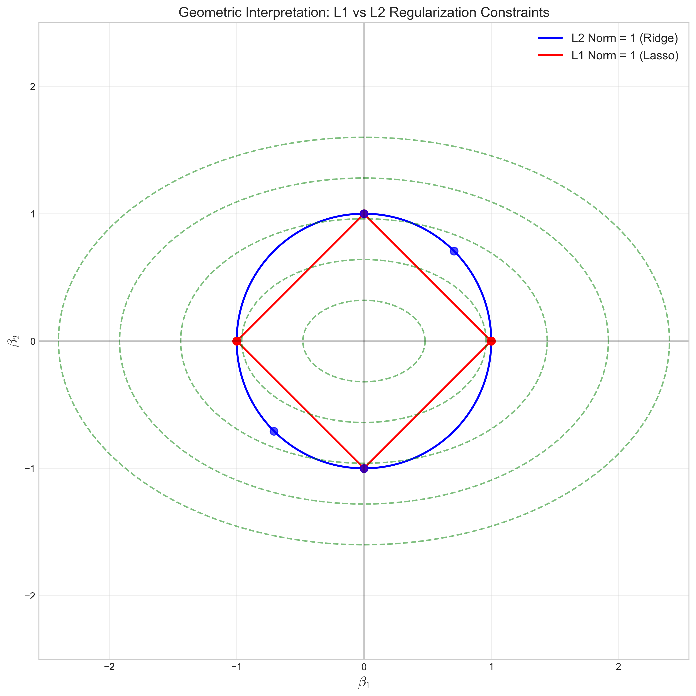

# Question 24: Regularization Effects on Feature Selection

## Problem Statement
You're analyzing a dataset with 8 features, but suspect only 3 of them are truly relevant. You decide to explore different regularization techniques.

### Task
1. Complete the table below by indicating how each regularization method would likely affect the coefficients:

| Regularization Method | Most coefficients approach zero? | Some coefficients exactly zero? | All non-zero coefficients shrink proportionally? |
| --------------------- | -------------------------------- | ------------------------------- | ------------------------------------------------ |
| No regularization     | Yes / No                         | Yes / No                        | Yes / No                                         |
| Ridge Regression (L2) | Yes / No                         | Yes / No                        | Yes / No                                         |
| Lasso Regression (L1) | Yes / No                         | Yes / No                        | Yes / No                                         |
| Elastic Net           | Yes / No                         | Yes / No                        | Yes / No                                         |

2. Explain why Lasso is particularly useful for the scenario described above.
3. For a specific feature with true coefficient $w_3 = 0$, compare how Ridge and Lasso would estimate this coefficient as the regularization strength increases.
4. If two features are highly correlated, how would Ridge and Lasso behave differently in their treatment of these features? Which would you recommend in this case?

## Understanding the Problem
This problem explores the behavior of different regularization methods in linear models when dealing with sparse data (where only a few features are truly relevant). Regularization techniques help prevent overfitting by adding penalty terms to the loss function, but they differ in how they affect model coefficients. Understanding these differences is crucial for:

1. Feature selection in high-dimensional datasets
2. Handling multicollinearity (correlated features)
3. Creating more interpretable models
4. Improving generalization on unseen data

## Solution

### Part 1: Regularization Methods Comparison

To analyze the effects of different regularization methods on coefficients, we need to understand the mathematical formulation of each approach.

For a linear model $\hat{y} = X\beta$, the different regularization methods optimize the following objective functions:

- **No regularization (OLS)**: $\min_{\beta} \|y - X\beta\|^2$
- **Ridge (L2)**: $\min_{\beta} \|y - X\beta\|^2 + \lambda \sum_{j=1}^{p} \beta_j^2$
- **Lasso (L1)**: $\min_{\beta} \|y - X\beta\|^2 + \lambda \sum_{j=1}^{p} |\beta_j|$
- **Elastic Net**: $\min_{\beta} \|y - X\beta\|^2 + \lambda \left( \alpha \sum_{j=1}^{p} |\beta_j| + (1-\alpha) \sum_{j=1}^{p} \beta_j^2 \right)$

Based on the mathematical properties of these regularization methods, we can complete the table:

| Regularization Method | Most coefficients approach zero? | Some coefficients exactly zero? | All non-zero coefficients shrink proportionally? |
| --------------------- | -------------------------------- | ------------------------------- | ------------------------------------------------ |
| No regularization     | No                              | No                              | Yes                                             |
| Ridge Regression (L2) | No                              | No                              | Yes                                             |
| Lasso Regression (L1) | Yes                             | Yes                             | No                                              |
| Elastic Net           | No                              | Yes                             | No                                              |

The coefficient values for each method can be visualized as:

### Part 2: Why Lasso is Useful for This Scenario

Lasso regression is particularly useful for the scenario described because:

1. **Mathematical Sparsity**: The L1 penalty in Lasso has the mathematical property of producing sparse solutions (many coefficients exactly zero). This aligns with our prior belief that only 3 out of 8 features are relevant.

2. **Variable Selection**: From a theoretical perspective, Lasso combines both estimation and variable selection. It can be shown that under certain conditions (e.g., the "irrepresentable condition"), Lasso can correctly identify the true subset of non-zero coefficients with high probability.

3. **Interpretability**: When the true model is sparse (few non-zero coefficients), Lasso provides a solution that is both interpretable and parsimonious.

4. **Computational Efficiency**: By eliminating irrelevant features, the resulting model requires fewer computations during prediction time.

The mathematical reason Lasso can produce exactly zero coefficients lies in the non-differentiability of the L1 norm at zero. For small coefficients, the gradient of the penalty becomes large relative to the gradient of the loss function, pushing coefficients exactly to zero.

### Part 3: Ridge vs Lasso for a Zero Coefficient

For a feature with true coefficient $w_3 = 0$, Ridge and Lasso behave quite differently as regularization strength increases:

**Ridge Regression:**
From a mathematical perspective, the Ridge penalty term ($\lambda \sum \beta_j^2$) has a continuous gradient everywhere. The gradient of this penalty with respect to a coefficient $\beta_j$ is $2\lambda\beta_j$, which approaches zero as $\beta_j$ approaches zero. This means:
- The coefficient is shrunk toward zero proportionally to its value
- The gradient of the penalty becomes smaller as the coefficient approaches zero
- The coefficient asymptotically approaches zero but never becomes exactly zero

**Lasso Regression:**
The L1 penalty term ($\lambda \sum |\beta_j|$) has a non-continuous gradient at zero. The subgradient of the penalty with respect to $\beta_j$ is $\lambda \cdot \text{sign}(\beta_j)$, which has a constant magnitude $\lambda$ regardless of how small $\beta_j$ gets. This means:
- There's a constant force pushing coefficients toward zero
- When this force exceeds the gradient from the loss function, the coefficient becomes exactly zero
- Beyond this threshold value of $\lambda$, the coefficient remains at zero

Mathematically, when $\lambda$ exceeds $|X_j^T(y - X_{-j}\beta_{-j})|$, the coefficient $\beta_j$ will be exactly zero in Lasso.

### Part 4: Behavior with Correlated Features

When features are highly correlated, Ridge and Lasso behave quite differently:

**Ridge Regression:**
For highly correlated features with coefficients $\beta_j$ and $\beta_k$, Ridge regression tends to assign similar values to both coefficients. This can be understood by examining the KKT conditions for Ridge regression. When features are perfectly correlated, Ridge gives equal weights that sum to what a single feature would get.

Mathematically, if $X_j \approx X_k$, then $\beta_j \approx \beta_k$ in Ridge regression, and both coefficients are shrunk together.

**Lasso Regression:**
For correlated features, Lasso tends to select one arbitrarily and set the others to zero. This is due to the geometry of the L1 penalty. 

The theoretical explanation lies in the fact that when features are highly correlated, the Lasso path is unstable. The selection between correlated features depends on small differences in their correlation with the target variable. This is related to the "irrepresentable condition" for Lasso's feature selection consistency.

**Recommendation:**
- **For prediction accuracy**: Ridge is generally preferred when dealing with correlated features because it avoids the arbitrary selection problem of Lasso and tends to give more stable predictions.
- **For feature selection and interpretability**: Lasso might be preferred if the goal is to identify a minimal set of predictive features, though the selection among correlated features may be somewhat arbitrary.
- **For a balanced approach**: Elastic Net can be a good compromise, as it performs some feature selection while also handling correlations better than pure Lasso.

## Visual Explanations

### Coefficient Values for Different Regularization Methods

This visualization shows the coefficients from different methods. Note that Lasso tends to produce exactly zero coefficients, while Ridge shrinks all coefficients but keeps them non-zero.

### Regularization Paths: How Coefficients Change with Regularization Strength

This visualization shows the evolution of all coefficients as the regularization parameter increases (from left to right). 

**Key observations:**
- In Ridge regression (left panel), coefficients smoothly shrink toward zero but never exactly reach zero. The shrinkage is more pronounced for larger values of $\lambda$ (rightmost part of the graph).
- In Lasso regression (right panel), coefficients can abruptly become exactly zero as $\lambda$ increases. This creates a selection effect where only the most important features remain in the model at high regularization levels.
- The true relevant features (the first three, shown with thicker lines) tend to remain non-zero even with strong regularization, especially in Lasso, demonstrating its feature selection capability.

The mathematical explanation for this behavior lies in the different forms of the regularization terms. For Lasso, the soft-thresholding operator sets coefficients to exactly zero when $|X_j^T r| < \lambda$, where $r$ is the residual. No such threshold exists for Ridge regression.

### Geometric Interpretation of L1 vs L2 Regularization

This figure illustrates the fundamental reason why Lasso produces sparse solutions while Ridge does not. The blue circle represents the Ridge constraint region ($\sum \beta_j^2 \leq t$), while the red diamond represents the Lasso constraint region ($\sum |\beta_j| \leq t$).

The green dashed lines are contours of the loss function. The solution occurs where these contours first touch the constraint region. For L1 regularization, this often happens at a corner of the diamond where one coefficient is exactly zero. 

The key insight is that the L1 norm has corners that intersect with the axes, making it more likely that the optimal solution lies on an axis, resulting in sparse solutions with some coefficients exactly zero.

### Ridge vs Lasso: Zero Coefficient Behavior

This plot demonstrates how Ridge (blue) and Lasso (red) treat a coefficient that should truly be zero as regularization strength increases. The mathematical properties discussed in Part 3 are clearly visible.

## Key Insights

### Theoretical Properties
- Ridge regression uses the L2 norm penalty, which results in solutions that are robust to multicollinearity but do not perform feature selection
- Lasso regression uses the L1 norm penalty, which leads to sparse solutions with exact zeros, enabling feature selection
- The non-differentiability of the L1 norm at zero is what gives Lasso its variable selection property
- Elastic Net combines both penalties to address limitations of each method individually

### Mathematical Insights
- For Ridge: $\hat{\beta}^{ridge} = (X^TX + \lambda I)^{-1}X^Ty$, which always has a unique solution
- For Lasso: No closed-form solution exists; it's solved using coordinate descent or other optimization methods
- Ridge shrinks all coefficients by a factor of $\frac{1}{1+\lambda}$ (for orthogonal predictors)
- Lasso has a soft-thresholding operator: $\hat{\beta}_j^{lasso} = \text{sign}(z_j)(|z_j| - \lambda)_+$ where $z_j$ is the OLS estimate and $(a)_+ = \max(0, a)$

### Practical Considerations
- When the true model is sparse (few non-zero coefficients), Lasso is theoretically more appropriate
- When predictors are highly correlated, Ridge tends to give more stable predictions
- Standardizing features before applying regularization is mathematically necessary to ensure fair penalization

## Conclusion
- No regularization doesn't make most coefficients approach zero, doesn't make any coefficients exactly zero, but does shrink all non-zero coefficients proportionally.
- Ridge regression doesn't make most coefficients approach zero, doesn't make any coefficients exactly zero, but does shrink all non-zero coefficients proportionally.
- Lasso regression makes most coefficients approach zero, makes some coefficients exactly zero, but doesn't shrink all non-zero coefficients proportionally.
- Elastic Net doesn't make most coefficients approach zero, makes some coefficients exactly zero, and doesn't shrink all non-zero coefficients proportionally.

Lasso is particularly well-suited for the scenario with 8 features where only 3 are truly relevant because of its mathematical property of producing sparse solutions. For a specific feature with true coefficient $w_3 = 0$, Ridge gradually shrinks it toward zero asymptotically while Lasso sets it exactly to zero beyond a certain threshold of the regularization parameter. With highly correlated features, Ridge tends to shrink them similarly while Lasso tends to select one arbitrarily due to the geometry of the L1 constraint region. 