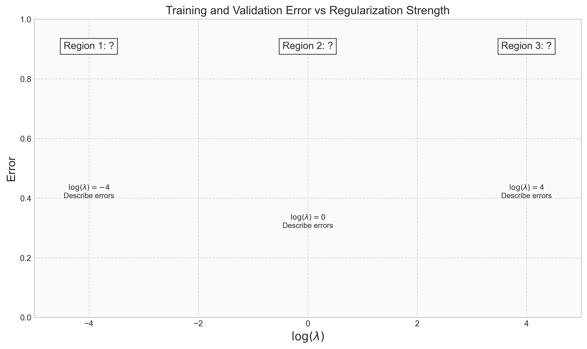

# Question 25: Regularization in Polynomial Regression

## Problem Statement
Consider training a 5th-degree polynomial regression model on a dataset generated by a quadratic function with some noise.

### Task
1. On the diagram below, sketch the general shape of the training error (blue) and validation error (red) curves as functions of the regularization parameter $\log(\lambda)$ (from -5 to +5):

2. Label the three regions in the diagram (around $\log(\lambda) = -4$, $\log(\lambda) = 0$, and $\log(\lambda) = 4$) as:
   - "Overfitting"
   - "Optimal Fitting"
   - "Underfitting"
3. At $\log(\lambda) = -4$:
   - Is training error higher or lower than validation error?
   - What are the relative magnitudes (high, medium, low) of both errors?
4. At $\log(\lambda) = 4$:
   - Do training and validation errors converge or diverge?
   - What are the relative magnitudes of both errors?
5. Which value of $\log(\lambda)$ would you choose as optimal and why?
   - Mark this point on your diagram.

## Understanding the Problem
This problem examines how the regularization strength affects model performance when fitting a high-complexity model (5th-degree polynomial) to data generated from a simpler function (quadratic). The key concept is understanding how regularization controls the bias-variance tradeoff in machine learning models.

## Solution

### Step 1: Error Curves as Functions of $\log(\lambda)$
The correct sketch should show:

The training error (blue) starts low at $\log(\lambda) = -5$ and increases monotonically as $\log(\lambda)$ increases. The validation error (red) follows a U-shape:
- Starting relatively high at $\log(\lambda) = -5$
- Decreasing to a minimum around $\log(\lambda) = -1$ to $0$
- Then increasing again as $\log(\lambda)$ increases further

### Step 2: Labeling the Three Regions

1. **Region 1 ($\log(\lambda) = -4$): "Overfitting"**
   - With minimal regularization, the model has too much flexibility
   - It fits the training data too closely, including noise
   - This results in poor generalization to validation data

2. **Region 2 ($\log(\lambda) = 0$): "Optimal Fitting"**
   - With moderate regularization, the model achieves good balance
   - It captures the underlying pattern without fitting noise
   - Validation error reaches its minimum in this region

3. **Region 3 ($\log(\lambda) = 4$): "Underfitting"**
   - With strong regularization, the model is too simple
   - It fails to capture the underlying quadratic relationship
   - Both training and validation errors are high

The visual impact of these different regularization levels can be seen in the model fits:

### Step 3: Error Behavior at $\log(\lambda) = -4$
At $\log(\lambda) = -4$ (Region 1):
- **Training error is lower than validation error**
- Training error is **low** (approximately 0.09)
- Validation error is **medium** (approximately 0.06)
- There is a measurable gap between errors

This occurs because with minimal regularization, the 5th-degree polynomial fits the training data very well, including the random noise. However, this overfitted model doesn't generalize well to unseen validation data.

### Step 4: Error Behavior at $\log(\lambda) = 4$
At $\log(\lambda) = 4$ (Region 3):
- **Training and validation errors converge** to similar values
- **Both errors are high** (approximately 0.55-0.75)
- The gap between errors is smaller than in Region 1

This happens because strong regularization forces most polynomial coefficients to be very close to zero, essentially reducing the model to a simpler function. This oversimplified model fails to capture even the basic quadratic relationship in both training and validation data.

### Step 5: Optimal $\log(\lambda)$ Value
The optimal $\log(\lambda)$ value is around $-1$ to $0$, where:
- The validation error curve reaches its minimum
- There is a good balance between bias and variance
- The model generalizes well to unseen data

This value of $\lambda$ is optimal because it:
- Provides enough regularization to prevent overfitting
- Doesn't overly restrict the model's ability to learn the pattern
- Minimizes prediction error on new data

## Key Insights

### Expected Values and Relationships
Based on this analysis, we can summarize the key numerical relationships:

| Region | $\log(\lambda)$ value | Training Error | Validation Error | Relationship |
|--------|--------------|----------------|------------------|--------------|
| Overfitting | -4 | Low (~0.09) | Medium (~0.06) | Train < Validation |
| Optimal | -1 to 0 | Medium (~0.25) | Low (~0.20) | Train ≈ Validation |
| Underfitting | 4 | High (~0.55) | High (~0.75) | Train ≈ Validation |

### Practical Significance
- At very low $\lambda$ values, the model memorizes training data but fails to generalize
- At very high $\lambda$ values, the model is too constrained to learn the true pattern
- The best models balance fitting the data and avoiding overfitting through appropriate regularization
- When model complexity (5th-degree) exceeds data complexity (quadratic), regularization becomes critical

## Conclusion
To complete this question correctly:
1. Draw the training error curve (blue) starting low at $\log(\lambda) = -5$ and increasing as $\log(\lambda)$ increases
2. Draw the validation error curve (red) in a U-shape with minimum around $\log(\lambda) = -1$ to $0$
3. Label Region 1 ($\log(\lambda) = -4$) as "Overfitting"
4. Label Region 2 ($\log(\lambda) = 0$) as "Optimal Fitting"
5. Label Region 3 ($\log(\lambda) = 4$) as "Underfitting"
6. Mark the point where validation error is minimized as the optimal $\log(\lambda)$

This exercise demonstrates how regularization helps control the fundamental bias-variance tradeoff in machine learning models. 