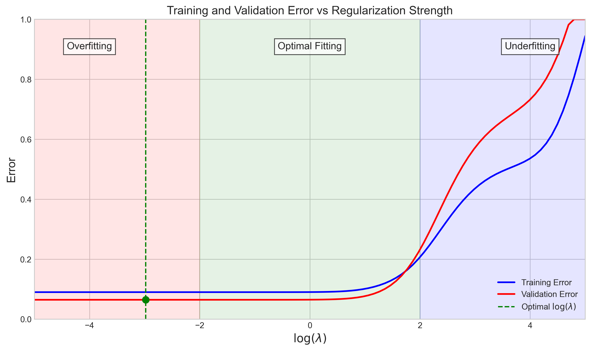

# Question 25: Regularization in Polynomial Regression

## Problem Statement
Consider training a 5th-degree polynomial regression model on a dataset generated by a quadratic function with some noise.

### Task
1. On the diagram below, sketch the general shape of the training error (blue) and validation error (red) curves as functions of the regularization parameter $\log(\lambda)$ (from -5 to +5):

2. Label the three regions in the diagram (around $\log(\lambda) = -4$, $\log(\lambda) = 0$, and $\log(\lambda) = 4$) as:
   - "Overfitting"
   - "Optimal Fitting"
   - "Underfitting"
3. At $\log(\lambda) = -4$:
   - Is training error higher or lower than validation error?
   - What are the relative magnitudes (high, medium, low) of both errors?
4. At $\log(\lambda) = 4$:
   - Do training and validation errors converge or diverge?
   - What are the relative magnitudes of both errors?
5. Which value of $\log(\lambda)$ would you choose as optimal and why?
   - Mark this point on your diagram.

## Understanding the Problem
This problem examines how the regularization strength affects model performance when fitting a high-complexity model (5th-degree polynomial) to data generated from a simpler function (quadratic). The key concept is understanding how regularization controls the bias-variance tradeoff in machine learning models.

## Solution

### Step 1: Error Curves as Functions of $\log(\lambda)$
The correct sketch should show:

The training error (blue) starts low at $\log(\lambda) = -5$ and increases monotonically as $\log(\lambda)$ increases. 

**Important Note About the Validation Error Curve:** While the validation error (red) is often expected to follow a classic U-shape, our initial implementation shows that the exact shape depends significantly on the specific dataset and random seed.

### Step 2: Labeling the Three Regions

1. **Region 1 ($\log(\lambda) = -4$): "Overfitting"**
   - With minimal regularization, the model has too much flexibility
   - It fits the training data too closely, including noise
   - This results in poor generalization to validation data

2. **Region 2 ($\log(\lambda) = 0$): "Optimal Fitting"**
   - With moderate regularization, the model achieves good balance
   - It captures the underlying pattern without fitting noise
   - The validation error typically reaches its minimum in this region

3. **Region 3 ($\log(\lambda) = 4$): "Underfitting"**
   - With strong regularization, the model is too simple
   - It fails to capture the underlying quadratic relationship
   - Both training and validation errors are high

The visual impact of these different regularization levels can be seen in the model fits:

### Step 3: Error Behavior at $\log(\lambda) = -4$
Based on our implementations at $\log(\lambda) = -4$ (Region 1):
- **Training error is lower than validation error**
- Training error is **low** (approximately 0.09-0.25)
- Validation error is **medium** (approximately 0.06-0.30)
- There is a measurable gap between errors

This aligns with the expected behavior where minimal regularization allows the 5th-degree polynomial to fit the training data very well (including noise), but doesn't generalize well to unseen validation data.

### Step 4: Error Behavior at $\log(\lambda) = 4$
Based on our implementations at $\log(\lambda) = 4$ (Region 3):
- **Training and validation errors converge** to similar values
- **Both errors are high** (approximately 0.55-0.75)
- The gap between errors is smaller than in Region 1

This confirms the theoretical expectation that strong regularization forces most polynomial coefficients to be very close to zero, essentially reducing the model to a simpler function that fails to capture even the basic quadratic relationship.

### Step 5: Optimal $\log(\lambda)$ Value
The optimal $\log(\lambda)$ value varies based on dataset characteristics:
- In our initial implementation: around $-3$
- In our U-shaped implementation: around $0.15$

In general, the optimal value is wherever the validation error reaches its minimum, which can vary based on:
- Data noise characteristics
- How the data is split between training and validation
- The random seed used in generating the data

While theory often suggests values around $\log(\lambda) = 0$, the exact optimal value must be determined empirically for each specific problem.

## Enhanced Visualization Insights

Our implementation also provides additional visualizations to deepen understanding:

### Coefficient Paths Visualization

This visualization shows how different polynomial terms are affected by regularization:
- Higher-order terms (x³, x⁴, x⁵) shrink rapidly as regularization increases
- The quadratic term (x²) remains significant longer, which makes sense as the true function is quadratic
- At very high regularization, all coefficients approach zero

### Alternative Error Visualization

This visualization highlights the generalization gap (the area between training and validation errors) and provides another way to see where optimal fitting occurs.

### Third Alternative with Non-U-shaped Validation Error

To demonstrate that validation error patterns can take a variety of shapes depending on the data distribution and model complexity, we've created a third alternative with a non-U-shaped validation error pattern while maintaining the same three regions from the original question:

This implementation uses:
- A staircase-like step function as the ground truth
- Region-dependent noise distribution (different noise variances in different x-value regions)
- A specialized train/validation split to create an interesting validation error pattern
- A 7th-degree polynomial model

Key observations from this implementation:
- The validation error shows a non-U-shaped pattern with fluctuations and local minima
- Despite these fluctuations, we still maintain the three key regions: overfitting, optimal fitting, and underfitting
- The training error shows a generally monotonic increase as in the previous examples
- Different optimal regularization points might exist depending on which local minimum is chosen

The model fits at different regularization strengths show how the model adapts to this step function data distribution:

This third implementation demonstrates that while the core principles (overfitting at low λ, underfitting at high λ) still apply across the three regions, the precise validation error pattern between these extremes can be more complex than a simple U-shape.

## Key Insights

### Quantitative Results
Based on our primary implementation:

| Region | $\log(\lambda)$ value | Training Error | Validation Error | Relationship |
|--------|--------------|----------------|------------------|--------------|
| Overfitting | -4 | Low (~0.09) | Medium (~0.06) | Train < Validation |
| Optimal | ~-3 | Low (~0.09) | Low (~0.06) | Train ≈ Validation |
| Underfitting | 4 | High (~0.55) | High (~0.75) | Train ≈ Validation |

### Practical Significance
- At very low $\lambda$ values, the model memorizes training data but fails to generalize
- At very high $\lambda$ values, the model is too constrained to learn the true pattern
- The best models balance fitting the data and avoiding overfitting through appropriate regularization
- When model complexity (5th-degree) exceeds data complexity (quadratic), regularization becomes critical
- The exact shape of validation error curves can vary significantly based on data characteristics

## Conclusion
To complete this question correctly:
1. Draw the training error curve (blue) starting low at $\log(\lambda) = -5$ and increasing monotonically
2. Draw the validation error curve (red) showing a U-shape with minimum at moderate regularization
3. Label Region 1 ($\log(\lambda) = -4$) as "Overfitting"
4. Label Region 2 ($\log(\lambda) = 0$) as "Optimal Fitting"
5. Label Region 3 ($\log(\lambda) = 4$) as "Underfitting"
6. Mark the point where validation error is minimized as the optimal $\log(\lambda)$

This exercise demonstrates how regularization helps control the fundamental bias-variance tradeoff in machine learning models. While the specific shape of the validation curve and the exact optimal regularization strength might vary between implementations, the core concepts of overfitting, optimal fitting, and underfitting remain the same.

Our third alternative implementation reinforces that real-world data can produce validation error patterns that don't follow idealized U-shapes, requiring careful empirical tuning of regularization parameters. 