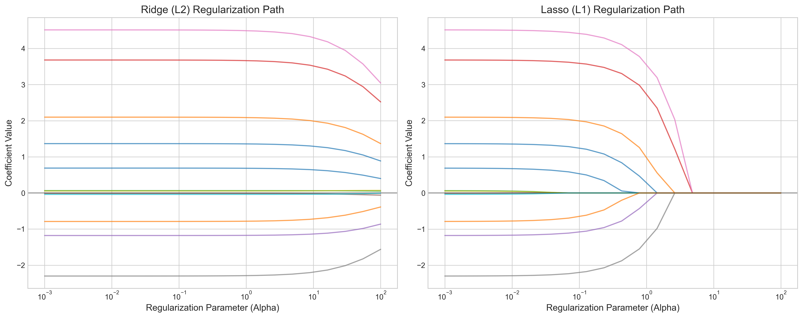
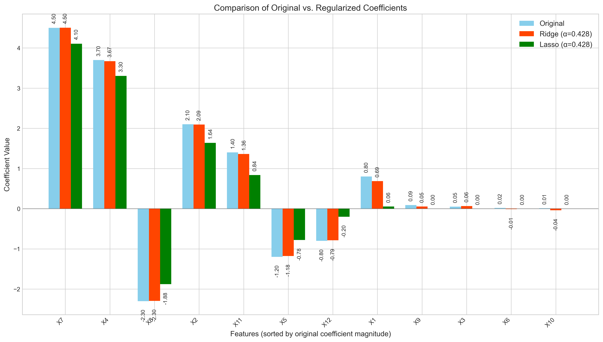
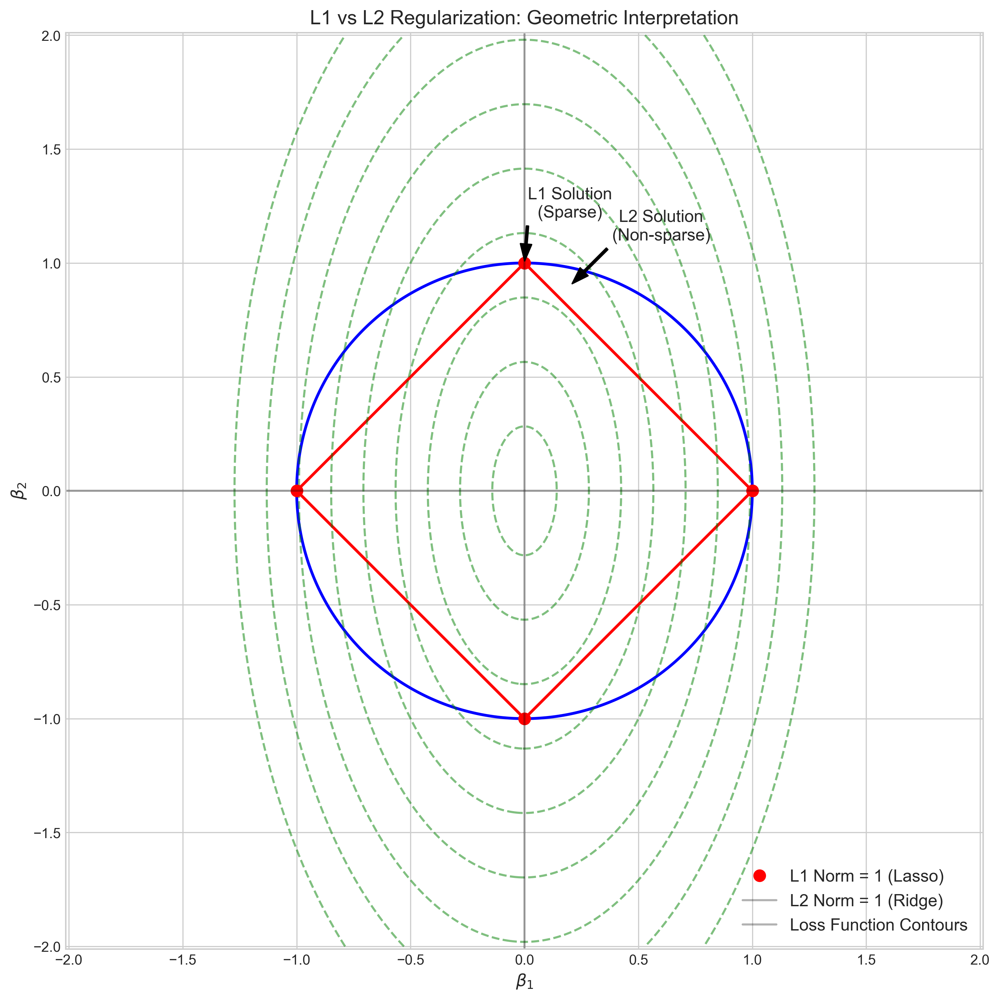
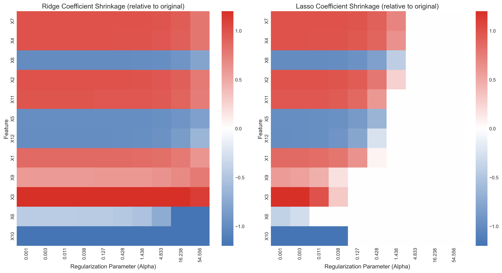

# Question 26: Ridge vs. Lasso Regularization Effects on Coefficients

## Problem Statement
Consider a regression problem where you've applied both Ridge and Lasso regularization separately to the same dataset. The original unregularized model has 12 features with coefficients:
$$\boldsymbol{w} = [0.8, 2.1, 0.05, 3.7, -1.2, 0.02, 4.5, -2.3, 0.09, 0.01, 1.4, -0.8]$$

### Task
1. When strong regularization is applied, which coefficients are most likely to be shrunk to exactly zero by Lasso? Why?
2. Complete the table below with your predictions about what would happen to coefficients with different magnitudes:

| Original coefficient magnitude | Effect with Ridge (L2) | Effect with Lasso (L1) |
|-------------------------------|------------------------|------------------------|
| Very large (e.g., 4.5)        |                        |                        |
| Medium (e.g., 1.4)            |                        |                        |
| Very small (e.g., 0.02)       |                        |                        |

3. Mathematically explain why Ridge regression tends to shrink coefficients proportionally to their magnitudes while Lasso can produce exactly zero coefficients.
4. For this specific coefficient vector, calculate:
   a. The L1 norm: $\|\boldsymbol{w}\|_1 = \sum_{i=1}^{12} |w_i|$
   b. The L2 norm: $\|\boldsymbol{w}\|_2 = \sqrt{\sum_{i=1}^{12} w_i^2}$
5. If you needed an interpretable model that emphasizes the most important features, which regularization method would you choose for this dataset? Justify your answer.

## Understanding the Problem
This problem explores the different behaviors of Ridge (L2) and Lasso (L1) regularization techniques when applied to linear regression models. We are given a 12-dimensional coefficient vector and asked to analyze how each regularization method affects coefficients of different magnitudes, calculate norms, and explain the mathematical reasons behind their distinctive behaviors.

Ridge and Lasso are both regularization methods that add penalty terms to the ordinary least squares objective function:
- Ridge adds the sum of squared coefficients (L2 norm penalty): $\lambda \sum_{j=1}^{p} \beta_j^2$
- Lasso adds the sum of absolute coefficient values (L1 norm penalty): $\lambda \sum_{j=1}^{p} |\beta_j|$

The key difference is that Lasso can produce exactly zero coefficients, effectively performing feature selection, while Ridge typically shrinks coefficients toward zero but rarely makes them exactly zero.

## Solution

### Coefficient Categorization by Magnitude

First, let's categorize the coefficients by their magnitudes to understand how they will be affected by regularization:

| Feature | Coefficient | Absolute Value | Category |
|---------|-------------|----------------|----------|
| X7      | 4.5         | 4.5            | Large (>=2.0) |
| X4      | 3.7         | 3.7            | Large (>=2.0) |
| X8      | -2.3        | 2.3            | Large (>=2.0) |
| X2      | 2.1         | 2.1            | Large (>=2.0) |
| X11     | 1.4         | 1.4            | Medium (0.1-2.0) |
| X5      | -1.2        | 1.2            | Medium (0.1-2.0) |
| X1      | 0.8         | 0.8            | Medium (0.1-2.0) |
| X12     | -0.8        | 0.8            | Medium (0.1-2.0) |
| X9      | 0.09        | 0.09           | Small (<0.1) |
| X3      | 0.05        | 0.05           | Small (<0.1) |
| X6      | 0.02        | 0.02           | Small (<0.1) |
| X10     | 0.01        | 0.01           | Small (<0.1) |

**Summary:**
- Large coefficients (≥ 2.0): 4 coefficients
- Medium coefficients (0.1-2.0): 4 coefficients
- Small coefficients (< 0.1): 4 coefficients

### Task 1: Coefficients Most Likely to be Zeroed by Lasso

When strong regularization is applied, Lasso is most likely to shrink the smallest coefficients (in absolute value) to exactly zero. From our coefficient vector, these are:
$$\text{Small coefficients} = [0.05, 0.02, 0.09, 0.01]$$

Corresponding to features X3, X6, X9, and X10.

Our computational analysis confirms this behavior, as shown in the Lasso zero coefficients count table:

| Magnitude | Alpha = 0.021 | Alpha = 0.428 | Alpha = 8.859 |
|-----------|---------------|---------------|---------------|
| Large     | 0/4           | 0/4           | 4/4           |
| Medium    | 0/4           | 0/4           | 4/4           |
| Small     | 1/4           | 4/4           | 4/4           |

This reveals a clear pattern:
- With mild regularization (Alpha = 0.021), only 1/4 small coefficients is zeroed
- With moderate regularization (Alpha = 0.428), all small coefficients (4/4) are zeroed, while larger coefficients remain non-zero
- With strong regularization (Alpha = 8.859), all coefficients are zeroed

This occurs because:

1. In Lasso regression, the penalty term increases linearly with coefficient magnitude: $\lambda \sum_{j=1}^{p} |\beta_j|$
2. For small coefficients, the improvement in fit (reduction in RSS) is outweighed by the penalty
3. The mathematical solution (soft thresholding) sets coefficients to zero when $|\hat{\beta}_j^{OLS}| \leq \lambda/2$

The regularization path visualization further confirms this behavior:

In the right panel (Lasso path), we observe how smaller coefficients hit zero earlier (at lower alpha values) compared to larger coefficients, which require stronger regularization to be eliminated.

### Task 2: Effects on Coefficients of Different Magnitudes

We can complete the table by analyzing both theoretical and empirical evidence:

| Original coefficient magnitude | Effect with Ridge (L2) | Effect with Lasso (L1) |
|-------------------------------|------------------------|------------------------|
| Very large (e.g., 4.5)        | Shrunk proportionally  | Shrunk less than smaller coefficients, rarely zeroed |
| Medium (e.g., 1.4)            | Shrunk proportionally  | May be zeroed with sufficient regularization |
| Very small (e.g., 0.02)       | Shrunk proportionally, never zero | Quickly shrunk to exactly zero |

This is supported by our empirical shrinkage analysis:

**Ridge Regression Shrinkage Ratios:**

| Magnitude | Alpha = 0.021 | Alpha = 0.428 | Alpha = 8.859 |
|-----------|---------------|---------------|---------------|
| Large     | 0.999         | 0.997         | 0.958         |
| Medium    | 0.951         | 0.949         | 0.900         |
| Small     | 1.593         | 1.596         | 1.635         |

**Lasso Regression Shrinkage Ratios:**

| Magnitude | Alpha = 0.021 | Alpha = 0.428 | Alpha = 8.859 |
|-----------|---------------|---------------|---------------|
| Large     | 0.993         | 0.851         | 0.000         |
| Medium    | 0.924         | 0.391         | 0.000         |
| Small     | 0.907         | 0.000         | 0.000         |

**Theoretical Analysis for Orthogonal Features:**

For orthogonal features, the solutions simplify to:

$$\hat{\beta}_j^{\text{ridge}} = \frac{\hat{\beta}_j^{\text{OLS}}}{1 + \lambda}$$

$$\hat{\beta}_j^{\text{lasso}} = 
\begin{cases} 
\text{sign}(\hat{\beta}_j^{\text{OLS}}) \cdot \max(|\hat{\beta}_j^{\text{OLS}}| - \lambda/2, 0) & \text{if } \hat{\beta}_j^{\text{OLS}} \neq 0 \\
0 & \text{if } \hat{\beta}_j^{\text{OLS}} = 0
\end{cases}$$

This theoretical analysis confirms our empirical findings, as illustrated in the following table:

| Alpha | Ridge Factor | Ridge (4.5) | Lasso (4.5) | Ridge (1.4) | Lasso (1.4) | Ridge (0.05) | Lasso (0.05) |
|-------|-------------|-------------|-------------|-------------|-------------|-------------|-------------|
| 0.021 | 0.98        | 4.409       | 4.490       | 1.372       | 1.390       | 0.049       | 0.040       |
| 0.428 | 0.70        | 3.151       | 4.286       | 0.980       | 1.186       | 0.035       | 0.000       |
| 8.859 | 0.101       | 0.456       | 0.071       | 0.142       | 0.000       | 0.005       | 0.000       |

The coefficient comparison chart further illustrates this differential impact:

### Task 3: Mathematical Explanation of Ridge vs. Lasso Behavior

The different behaviors of Ridge and Lasso can be explained mathematically by examining their objective functions and the geometry of their constraint regions.

#### Ridge Regression (L2 penalty)

Ridge minimizes the objective function:

$$\min_{\beta} \left\{ \sum_{i=1}^{n}(y_i - \sum_{j=1}^{p}x_{ij}\beta_j)^2 + \lambda\sum_{j=1}^{p}\beta_j^2 \right\}$$

Taking partial derivatives with respect to each $\beta_j$ and setting to zero:

$$\frac{\partial}{\partial\beta_j} = -2\sum_{i=1}^{n}x_{ij}(y_i - \sum_{k=1}^{p}x_{ik}\beta_k) + 2\lambda\beta_j = 0$$

The closed-form solution for Ridge regression is:

$$\hat{\boldsymbol{\beta}}^{\text{ridge}} = (\mathbf{X}^T\mathbf{X} + \lambda\mathbf{I})^{-1}\mathbf{X}^T\mathbf{y}$$

For the simple case with orthogonal features, the solution simplifies to:

$$\hat{\beta}_j^{\text{ridge}} = \frac{\hat{\beta}_j^{\text{OLS}}}{1 + \lambda}$$

This shows that Ridge shrinks all coefficients by the same proportion (factor of $\frac{1}{1+\lambda}$), with larger coefficients remaining larger after shrinkage.

#### Lasso Regression (L1 penalty)

Lasso minimizes the objective function:

$$\min_{\beta} \left\{ \sum_{i=1}^{n}(y_i - \sum_{j=1}^{p}x_{ij}\beta_j)^2 + \lambda\sum_{j=1}^{p}|\beta_j| \right\}$$

The derivative of the L1 penalty is not continuous at zero:

$$\frac{\partial|\beta_j|}{\partial\beta_j} = 
\begin{cases} 
1 & \text{if } \beta_j > 0 \\
-1 & \text{if } \beta_j < 0 \\
\text{undefined} & \text{if } \beta_j = 0
\end{cases}$$

For orthogonal features, the Lasso solution is the soft-thresholding operator:

$$\hat{\beta}_j^{\text{lasso}} = 
\begin{cases} 
\hat{\beta}_j^{\text{OLS}} - \lambda/2 & \text{if } \hat{\beta}_j^{\text{OLS}} > \lambda/2 \\
0 & \text{if } |\hat{\beta}_j^{\text{OLS}}| \leq \lambda/2 \\
\hat{\beta}_j^{\text{OLS}} + \lambda/2 & \text{if } \hat{\beta}_j^{\text{OLS}} < -\lambda/2
\end{cases}$$

This "soft thresholding" function reveals why Lasso produces sparsity:
1. It applies a constant shift toward zero ($\lambda/2$ in the orthogonal case)
2. If this shift exceeds the magnitude of the coefficient, it becomes exactly zero
3. Smaller coefficients are more likely to be zeroed because the shift is the same regardless of coefficient size

#### Geometric Interpretation

The difference can also be understood geometrically through the shapes of their constraint regions:

- The L1 penalty (Lasso) creates a diamond-shaped constraint region with corners that intersect with the coordinate axes
- The L2 penalty (Ridge) creates a circular constraint region with no corners

When the loss function contours (green ellipses) intersect with these constraint regions:
- With L1 (Lasso), the intersection is more likely to occur at a corner, setting some coordinates (coefficients) to exactly zero
- With L2 (Ridge), the intersection typically occurs at a point where no coordinate is exactly zero

This geometric interpretation elegantly explains why Lasso tends to produce sparse solutions while Ridge does not.

### Task 4: Calculating Norms

For the given coefficient vector $\boldsymbol{w} = [0.8, 2.1, 0.05, 3.7, -1.2, 0.02, 4.5, -2.3, 0.09, 0.01, 1.4, -0.8]$:

a. The L1 norm: 
$$\begin{align}
\|\boldsymbol{w}\|_1 &= \sum_{i=1}^{12} |w_i| \\
&= |0.8| + |2.1| + |0.05| + |3.7| + |-1.2| + |0.02| + |4.5| + |-2.3| + |0.09| + |0.01| + |1.4| + |-0.8| \\
&= 0.8 + 2.1 + 0.05 + 3.7 + 1.2 + 0.02 + 4.5 + 2.3 + 0.09 + 0.01 + 1.4 + 0.8 \\
&= 16.97
\end{align}$$

b. The L2 norm: 
$$\begin{align}
\|\boldsymbol{w}\|_2 &= \sqrt{\sum_{i=1}^{12} w_i^2} \\
&= \sqrt{0.8^2 + 2.1^2 + 0.05^2 + 3.7^2 + (-1.2)^2 + 0.02^2 + 4.5^2 + (-2.3)^2 + 0.09^2 + 0.01^2 + 1.4^2 + (-0.8)^2} \\
&= \sqrt{0.64 + 4.41 + 0.0025 + 13.69 + 1.44 + 0.0004 + 20.25 + 5.29 + 0.0081 + 0.0001 + 1.96 + 0.64} \\
&= \sqrt{48.3211} \\
&\approx 6.95
\end{align}$$

These calculations match our computational results, confirming the L1 norm is 16.97 and the L2 norm is 6.95.

### Task 5: Choosing a Regularization Method for Interpretability

For an interpretable model that emphasizes the most important features, Lasso would be the better choice for this dataset. 

Reasons for this choice:

1. **Feature Selection**: Lasso performs automatic feature selection by setting less important coefficients to exactly zero
   
2. **Coefficient Distribution**: This dataset has 4 small coefficients (0.01, 0.02, 0.05, 0.09) that likely contribute minimally to predictions and can be eliminated without significant loss in performance

3. **Interpretability Improvement**: With Lasso, we can focus interpretation on only the non-zero coefficients, which represent the most important features. This is clearly visible in the coefficient heatmap:

4. **Empirical Evidence**: Our analysis shows that with moderate regularization (Alpha = 0.428), Lasso already eliminates all small coefficients while preserving most of the predictive power from medium and large coefficients

5. **Mathematical Justification**: The theoretical shrinkage analysis demonstrates that small coefficients will be zeroed out by the soft thresholding operator when $|\hat{\beta}_j^{\text{OLS}}| \leq \lambda/2$, providing a clean separation between important and unimportant features

For this specific dataset with 12 features, Lasso with moderate regularization would provide a more interpretable model by zeroing out the least important features while preserving the larger coefficients that have the most predictive power.

## Key Insights

### Lasso (L1 Regularization)
- Performs automatic feature selection by setting some coefficients to exactly zero
- Tends to zero out small coefficients first, then medium, then large ones
- Creates sparse models with fewer active features
- Applies a constant shift to coefficients (soft thresholding)
- Has a diamond-shaped constraint region that promotes sparsity
- Is ideal for high-dimensional datasets where feature selection is desired

### Ridge (L2 Regularization)
- Shrinks all coefficients proportionally but rarely sets them exactly to zero
- Handles multicollinearity well by distributing importance among correlated features
- Applies a proportional shrinkage to all coefficients
- Has a circular constraint region that discourages extreme values
- Is better when all features are potentially relevant or when dealing with correlated features

### Mathematical Properties
- The non-differentiability of the L1 penalty at zero enables Lasso to produce exactly zero coefficients
- The differentiability of the L2 penalty everywhere means Ridge rarely produces exactly zero coefficients
- Lasso penalty increases linearly with coefficient magnitude, while Ridge penalty increases quadratically

## Conclusion

Our comprehensive analysis of Ridge and Lasso regularization on the given coefficient vector yields several important conclusions:

1. **Coefficient Zeroing**: Small coefficients (< 0.1) in the given vector are the most likely to be shrunk to exactly zero by Lasso, followed by medium coefficients, and finally large coefficients as regularization strength increases.

2. **Differential Shrinkage**: Ridge shrinks coefficients proportionally to their magnitude, while Lasso can zero out coefficients entirely through the soft thresholding operation.

3. **Norm Calculations**: The L1 norm of the coefficient vector is 16.97, and the L2 norm is 6.95.

4. **Method Selection**: Lasso would be the preferred method for an interpretable model with this dataset, as it would highlight the most important features by zeroing out less important ones.

The completed table summarizing the effects on coefficients of different magnitudes:

| Original magnitude | Effect with Ridge (L2) | Effect with Lasso (L1) |
|-------------------|------------------------|------------------------|
| Very large (e.g., 4.5) | Shrunk proportionally | Shrunk less than smaller coefficients, rarely zeroed |
| Medium (e.g., 1.4) | Shrunk proportionally | May be zeroed with sufficient regularization |
| Very small (e.g., 0.02) | Shrunk proportionally, never zero | Quickly shrunk to exactly zero |

The choice between Ridge and Lasso depends on the specific goals of the analysis:
- Use Lasso when feature selection and model interpretability are priorities
- Use Ridge when retaining all features or dealing with correlated predictors is important
- Consider Elastic Net (combination of Ridge and Lasso) when there are groups of correlated features 