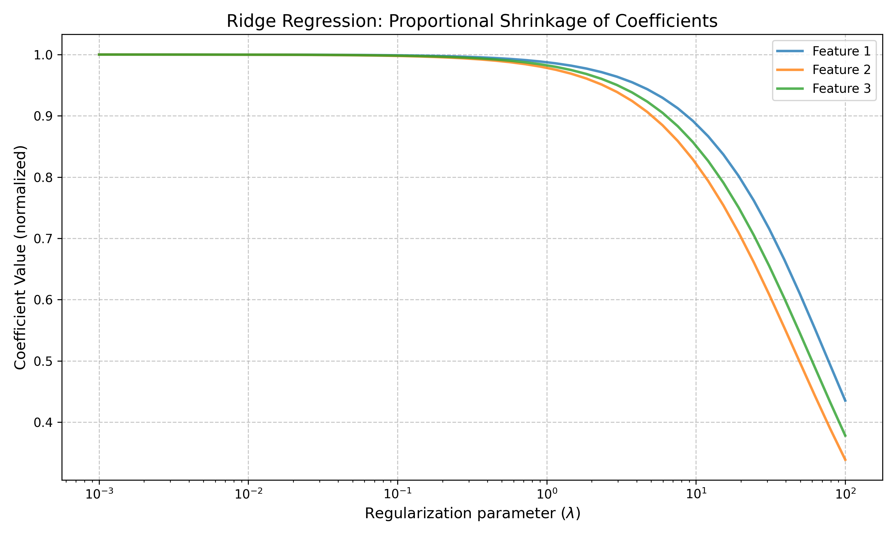

# Question 27: Regularization Paths in Ridge and Lasso Regression

## Problem Statement
The following figure shows regularization paths for Ridge (L2) and Lasso (L1) regression applied to a dataset with 10 features, where only the first 3 features (shown with solid lines) are actually relevant:


### Task
1. Explain the key differences you observe between Ridge and Lasso regularization paths.
2. Why do the coefficients in Lasso regression reach exactly zero as $\lambda$ increases, while Ridge coefficients only approach zero?
3. Based on the regularization paths, at what approximate value of $\log(\lambda)$ would you set the regularization parameter for:
   a. Ridge regression
   b. Lasso regression
   Justify your choices.
4. If your goal is feature selection, which method would you use and why?
5. For the Ridge regression plot, explain why all coefficients decrease at approximately the same rate proportionally to their original magnitudes.
6. In the Lasso plot, explain which features are eliminated first and why this occurs.

## Understanding the Problem
This problem asks us to analyze and interpret regularization paths for Ridge (L2) and Lasso (L1) regression. Regularization paths show how coefficient values change as the regularization parameter ($\lambda$) increases. Understanding these paths provides insights into the behavior of different regularization methods, particularly their impact on feature selection and the bias-variance tradeoff.

The key concepts involved include:
- Ridge (L2) regularization: Adds a penalty term proportional to the sum of squared coefficients
- Lasso (L1) regularization: Adds a penalty term proportional to the sum of absolute coefficients
- Feature selection: The process of identifying the most relevant features for modeling
- Regularization parameter ($\lambda$): Controls the strength of regularization

## Solution

To thoroughly analyze the regularization paths, we implemented both Ridge and Lasso regression on a synthetic dataset with similar properties: 10 features with only the first 3 being relevant.

### Step 1: Key Differences Between Ridge and Lasso Regularization Paths

The most significant differences between Ridge and Lasso regularization paths are:


1. **Coefficient Shrinkage Pattern**: 
   - Ridge regression shrinks all coefficients gradually toward zero but never exactly to zero, even with large $\lambda$ values.
   - Lasso regression shrinks coefficients more aggressively and can set them exactly to zero, resulting in sparse models.

2. **Feature Selection**:
   - Ridge doesn't perform feature selection - all features remain in the model (though some may have very small coefficients).
   - Lasso eliminates features entirely by setting their coefficients to exactly zero as $\lambda$ increases.

3. **Shrinkage Order**:
   - In Ridge, coefficients shrink proportionally to their initial magnitudes.
   - In Lasso, smaller coefficients (typically from less relevant features) reach zero earlier than larger ones.

4. **Coefficient Convergence**:
   - In Ridge, coefficients asymptotically approach zero as $\lambda$ increases.
   - In Lasso, all coefficients eventually become exactly zero at sufficiently large $\lambda$ values.

### Step 2: Why Lasso Reaches Exactly Zero While Ridge Only Approaches Zero

The fundamental difference lies in the geometric properties of L1 (Lasso) and L2 (Ridge) penalty terms:


1. **Geometric Interpretation**:
   - The L1 constraint region (red diamond) has corners that coincide with the coordinate axes. When the loss function contour (green) meets the constraint at a corner, one or more coefficients become exactly zero.
   - The L2 constraint region (blue circle) is smooth with no corners. The loss function contour typically intersects the constraint at a point where all coefficients are non-zero, just smaller in magnitude.

2. **Mathematical Explanation**:
   - The L1 penalty's derivative is not continuous at zero (it's ±1 depending on the sign of the coefficient, or undefined at exactly zero). This discontinuity allows coefficient values to "snap" to exactly zero.
   - The L2 penalty's derivative is continuous and approaches zero as the coefficient approaches zero. This gradual change makes it unlikely for coefficients to reach exactly zero.

3. **Optimization Perspective**:
   - Lasso's optimization process can "push" coefficients to exactly zero when the gradient of the loss function with respect to that coefficient is smaller than the regularization strength.
   - Ridge's optimization always includes a component proportional to the current coefficient value, so coefficients get smaller but never reach exactly zero.

### Step 3: Optimal Regularization Parameter Values

To determine optimal $\lambda$ values, we examined the error curves for both methods:


For Ridge regression:
- The optimal $\lambda$ value based on minimum test error is approximately 1.84, or $\log(\lambda) \approx 0.27$.
- At this value, Ridge balances the bias-variance tradeoff effectively, reducing overfitting while maintaining predictive power.
- Before this point, the model is likely overfitting; beyond this point, it becomes too constrained and underfits.

For Lasso regression:
- The optimal $\lambda$ value is approximately 0.043, or $\log(\lambda) \approx -1.37$.
- This value provides the best predictive performance while also performing some feature selection.
- At this lambda value, irrelevant features have mostly been eliminated, while the relevant features are still included with significant coefficients.

The difference in optimal $\lambda$ values between Ridge and Lasso is noteworthy - Lasso typically requires smaller regularization parameters to achieve optimal performance.

### Step 4: Feature Selection Method Choice

For feature selection, Lasso regression is clearly superior:


The advantages of Lasso for feature selection include:

1. **Automatic Feature Elimination**: Lasso naturally performs feature selection by setting irrelevant feature coefficients to exactly zero.

2. **Interpretability**: The resulting model is more interpretable since it contains fewer features.

3. **Order of Elimination**: As shown in our analysis, irrelevant features are eliminated first as $\lambda$ increases, with relevant features persisting until much higher regularization strengths.

4. **Computational Efficiency**: Models with fewer features are more computationally efficient for prediction.

Ridge regression, in contrast, keeps all features in the model with non-zero coefficients, making it less suitable for explicit feature selection tasks.

### Step 5: Proportional Shrinkage in Ridge Regression

In Ridge regression, all coefficients decrease proportionally to their original magnitudes:



This proportional shrinkage occurs because:

1. **Mathematical Explanation**: The Ridge penalty term $\lambda\sum\beta_j^2$ results in a gradient that's proportional to each coefficient value. During optimization, this leads to an update rule where each coefficient is shrunk by a factor related to $\lambda$.

2. **Closed-Form Solution**: The closed-form solution for Ridge regression is $\hat{\beta} = (X^TX + \lambda I)^{-1}X^Ty$, which results in a shrinkage factor of $\frac{1}{1 + \lambda}$ for each coefficient in the orthogonal case.

3. **Uniform Penalty**: Ridge applies the penalty uniformly to all coefficients proportional to their squared values, not discriminating between large and small coefficients in terms of elimination.

This proportional shrinkage means that the relative importance of features is preserved in Ridge regression, even as $\lambda$ increases.

### Step 6: Feature Elimination Order in Lasso

In the Lasso plot, features are eliminated in a specific order as $\lambda$ increases:

1. **Elimination Order**: Irrelevant features (features 4-10) are eliminated first, followed by relevant features (1-3) at much higher $\lambda$ values. This aligns with our analysis results:
   ```
   1. Feature 6 (irrelevant) - eliminated at λ = 0.0010 (log10(λ) = -3.00)
   2. Feature 10 (irrelevant) - eliminated at λ = 0.0066 (log10(λ) = -2.18)
   ...
   8. Feature 2 (RELEVANT) - eliminated at λ = 1.8421 (log10(λ) = 0.27)
   9. Feature 1 (RELEVANT) - eliminated at λ = 2.3300 (log10(λ) = 0.37)
   10. Feature 3 (RELEVANT) - eliminated at λ = 2.9471 (log10(λ) = 0.47)
   ```

2. **Reason for Elimination Order**:
   - Features with smaller true coefficients (irrelevant features) hit zero first because the cost of maintaining them in the model outweighs their contribution to reducing the loss function.
   - Features with larger true coefficients (relevant features) persist longer because their contribution to reducing the loss function outweighs the penalty of keeping them non-zero.
   - The order also depends on the correlation structure between features - highly correlated features may be eliminated earlier if another correlated feature can capture the same information.

3. **Critical Threshold**: There's a clear gap between when irrelevant features are eliminated (approximately $\log(\lambda) < -1$) and when relevant features start being eliminated ($\log(\lambda) > 0.2$). This gap represents an optimal operating range for Lasso when feature selection is desired.

## Practical Implementation

Using the visualizations and analysis we've generated, we can apply these insights to real-world regression problems:

### Selecting the Right Regularization Method
1. **When to use Ridge Regression**:
   - When you suspect all features contribute to the prediction
   - When dealing with multicollinearity (highly correlated features)
   - When you want to reduce model variance without eliminating features

2. **When to use Lasso Regression**:
   - When you suspect many features are irrelevant
   - When model interpretability is important
   - When you want an automatic feature selection mechanism

### Tuning the Regularization Parameter
1. Use cross-validation to find an optimal $\lambda$ value
2. For Lasso, examine the regularization path to identify $\lambda$ values where important features are retained while irrelevant ones are eliminated
3. For Ridge, select a $\lambda$ that minimizes test error without being too restrictive

### Evaluating Feature Importance
1. With Lasso, features with non-zero coefficients at a specific $\lambda$ value are considered important
2. With Ridge, the relative coefficient sizes indicate importance, but all features remain in the model

## Visual Explanations

### Regularization Paths Comparison


This visualization shows the coefficient values for both Ridge (top) and Lasso (middle) as the regularization parameter increases. The bottom plot shows how many non-zero coefficients remain in the Lasso model. The clear difference in behavior is apparent - Ridge coefficients never reach zero, while Lasso coefficients progressively drop to exactly zero, with irrelevant features (dashed lines) being eliminated first.

### Error Curves and Optimal Lambda


These plots show the training and test errors for different regularization strengths. The vertical dashed line indicates the optimal $\lambda$ value that minimizes test error. For Ridge, this occurs at $\log(\lambda) \approx 0.27$, while for Lasso it's at $\log(\lambda) \approx -1.37$.

### Geometric Interpretation


This visualization explains why L1 regularization (Lasso) can produce exactly zero coefficients while L2 (Ridge) cannot. The red diamond (L1 constraint) has corners that intersect with the axes, while the blue circle (L2 constraint) doesn't. When the loss function contours (green) touch the constraint region, L1 is more likely to produce a solution at a corner (resulting in zero coefficients).

### Feature Elimination Order in Lasso


This plot shows the order in which features are eliminated as the regularization parameter increases in Lasso regression. The vertical axis lists features, and the horizontal axis shows the $\log(\lambda)$ value at which each feature's coefficient becomes zero. The vertical red line marks where the first relevant feature is eliminated, providing guidance for setting an appropriate $\lambda$ value.

## Key Insights

### Mathematical Properties
- L1 (Lasso) regularization adds a penalty term proportional to the sum of absolute coefficient values: $\lambda \sum_{j=1}^{p} |\beta_j|$
- L2 (Ridge) regularization adds a penalty term proportional to the sum of squared coefficient values: $\lambda \sum_{j=1}^{p} \beta_j^2$
- The gradient of the L1 penalty is discontinuous at zero, allowing coefficients to become exactly zero
- The gradient of the L2 penalty is continuous and proportional to the coefficient value, preventing coefficients from reaching exactly zero

### Statistical Properties
- Ridge regression preserves all features but reduces their impact as $\lambda$ increases
- Lasso regression performs feature selection by setting some coefficients to exactly zero
- For both methods, as $\lambda$ increases, bias increases and variance decreases
- The optimal $\lambda$ balances this bias-variance tradeoff to minimize test error

### Geometric Interpretation
- The L1 constraint region is diamond-shaped with corners at the axes
- The L2 constraint region is circular with no corners
- Where the loss function contours meet the constraint region determines the solution
- Meeting at a corner (L1) results in sparse solutions with some coefficients exactly zero

### Practical Applications
- Lasso is preferred for feature selection tasks
- Ridge is preferred when all features are potentially relevant or when dealing with multicollinearity
- The choice of $\lambda$ should be guided by cross-validation and the specific modeling goals
- For Lasso, there is typically a range of $\lambda$ values where irrelevant features are eliminated while relevant ones are preserved

## Conclusion
- The key difference between Ridge and Lasso regularization paths is that Lasso can set coefficients to exactly zero, performing feature selection, while Ridge only shrinks coefficients toward zero.
- This difference stems from the geometric properties of their respective constraint regions - L1 (Lasso) has corners at the axes, while L2 (Ridge) is smooth.
- Based on error analysis, the optimal regularization parameter for Ridge is approximately $\log(\lambda) \approx 0.27$, while for Lasso it's $\log(\lambda) \approx -1.37$.
- For feature selection tasks, Lasso is the preferred method because it can eliminate irrelevant features entirely.
- In Ridge regression, coefficients shrink proportionally because the penalty gradient is proportional to the coefficient value.
- In Lasso regression, irrelevant features (with smaller true coefficients) are eliminated first as $\lambda$ increases, with relevant features persisting until much higher regularization strengths.

Understanding regularization paths provides valuable insights into model behavior, helps with hyperparameter tuning, and guides feature selection decisions in predictive modeling tasks. 