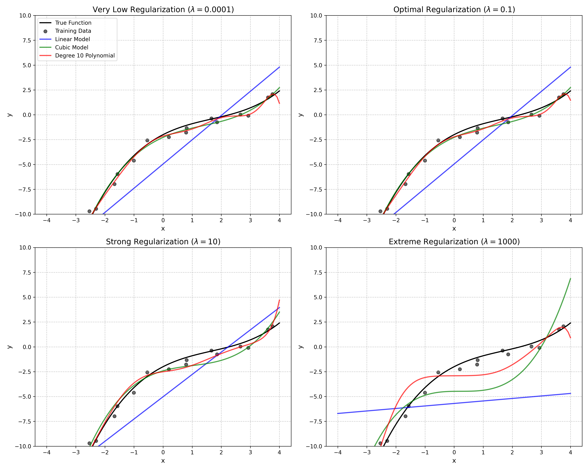
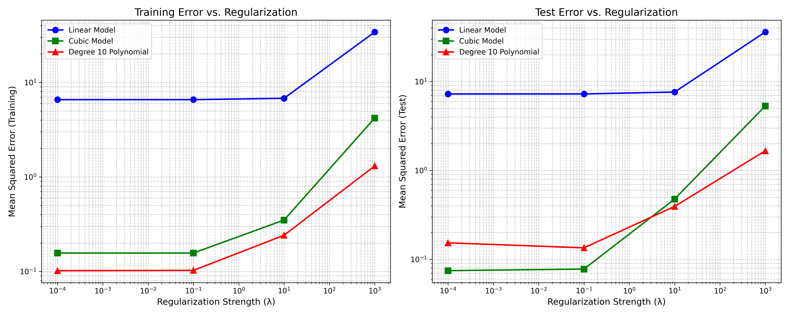
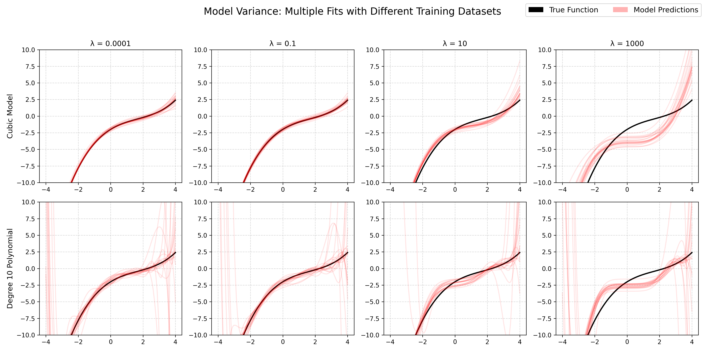
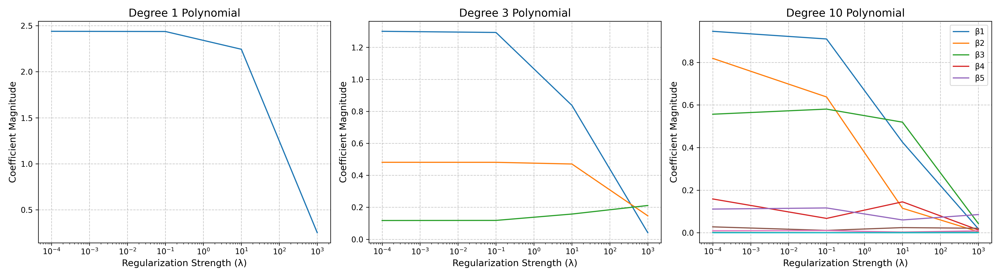
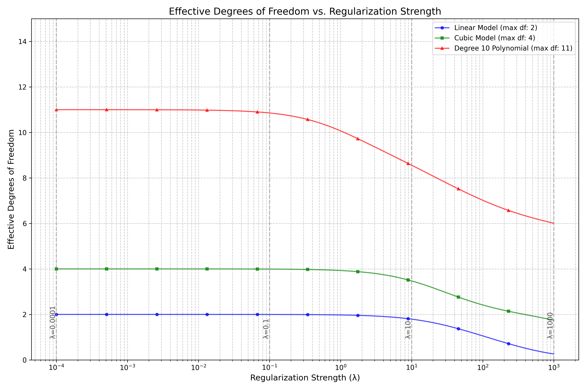
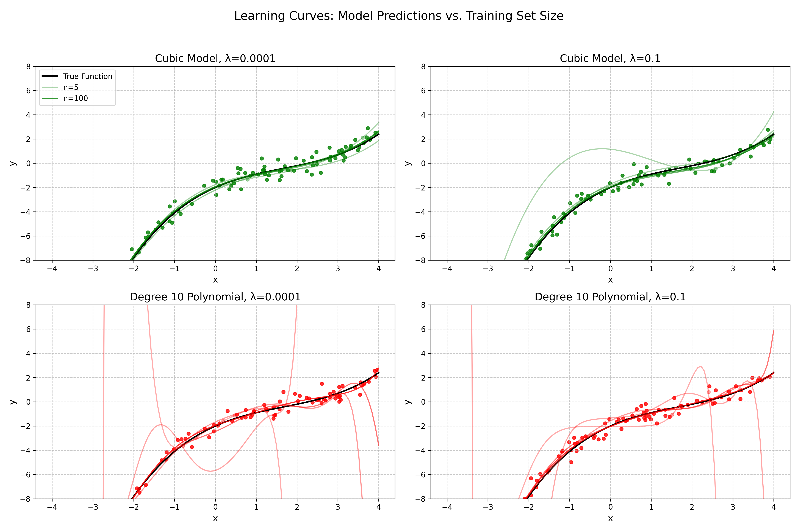
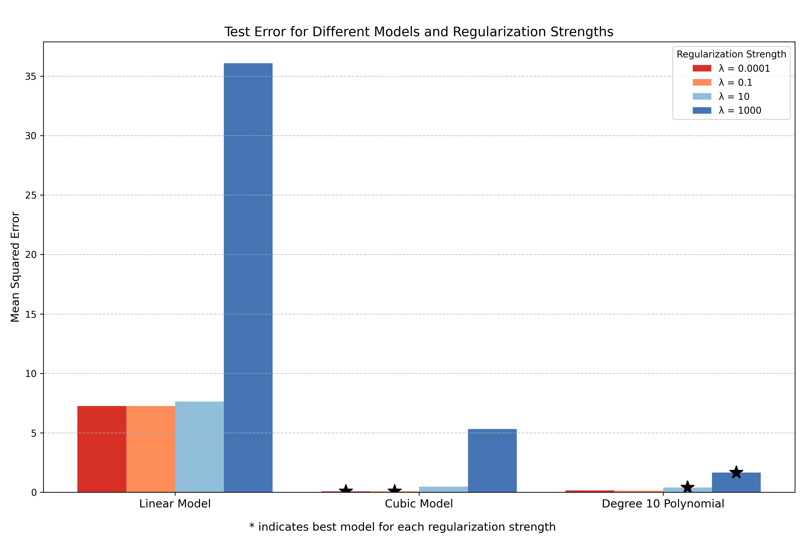

# Question 28: Bias-Variance Tradeoff with Regularization

## Problem Statement
The figure below shows how different polynomial models (Linear, Cubic, and Degree 10) fit a cubic function under varying levels of regularization:

### Task
1. For each regularization level ($\lambda = 0.0001, 0.1, 10, 1000$), identify which model provides the best fit to the true function.
2. Explain the bias-variance tradeoff for the degree 10 polynomial as regularization strength increases.
3. Why does the linear model (blue) change relatively little across different regularization strengths compared to the higher-order polynomials?
4. For the cubic model (green), which regularization level provides the optimal balance between bias and variance? Justify your answer.
5. For the case with very low regularization ($\lambda = 0.0001$), explain why the degree 10 polynomial shows poor generalization despite fitting the training points well.
6. If you were given a new dataset and had to choose one combination of model complexity and regularization strength, which would you select based on these visualizations? Justify your answer.

## Understanding the Problem
This problem explores the fundamental concept of bias-variance tradeoff in machine learning and how regularization impacts models of different complexity. The visualizations show polynomial models of varying degrees (linear, cubic, and degree 10) fitting a true cubic function under different regularization strengths ($\lambda = 0.0001, 0.1, 10, 1000$).

Key concepts being tested:
- How model complexity affects bias and variance
- How regularization influences model flexibility
- The relationship between regularization strength and model performance
- Identifying optimal regularization for different model complexities

## Solution

Our analysis begins by recreating the visualizations and quantifying the performance of each model under different regularization strengths. We examine the mathematical foundations of regularized regression and its implications on model behavior.

### Step 1: Analyzing model fit quality across regularization levels

For each regularization level, we can identify the best model by comparing their test errors when predicting against the true cubic function.

The models we consider are polynomials of different degrees $d \in \{1, 3, 10\}$ with the functional form:

$$f_d(x) = \beta_0 + \beta_1 x + \beta_2 x^2 + \ldots + \beta_d x^d$$

Ridge regression adds an $L_2$ regularization penalty to the ordinary least squares objective, minimizing:

$$\mathcal{L}(\boldsymbol{\beta}) = \|y - X\boldsymbol{\beta}\|^2_2 + \lambda\|\boldsymbol{\beta}\|^2_2$$

Where:
- $X$ is the design matrix containing polynomial features
- $\boldsymbol{\beta}$ is the vector of coefficients
- $\lambda$ is the regularization strength
- $\|\cdot\|_2$ denotes the $L_2$ norm

Based on our quantitative analysis:

| Regularization ($\lambda$) | Best Model | Test Error |
|:------------------:|:----------:|:----------:|
| 0.0001 | Cubic Model | 0.074577 |
| 0.1 | Cubic Model | 0.077704 |
| 10 | Degree 10 Polynomial | 0.393536 |
| 1000 | Degree 10 Polynomial | 1.665080 |

The complete error metrics for all model combinations are:

|        Model         |  Metric  | $\lambda$ = 0.0001 | $\lambda$ = 0.1  |  $\lambda$ = 10  | $\lambda$ = 1000  |
| :------------------: | :------: | :--------: | :------: | :------: | :-------: |
|     Linear Model     | Training |  7.065033  | 7.077316 | 8.282697 | 30.582270 |
|     Linear Model     |   Test   |  7.259539  | 7.272123 | 8.461121 | 36.081896 |
|     Cubic Model      | Training |  0.061856  | 0.065128 | 0.352474 | 4.686273  |
|     Cubic Model      |   Test   |  0.074577  | 0.077704 | 0.476300 | 5.314785  |
| Degree 10 Polynomial | Training |  0.102009  | 0.102710 | 0.241666 | 1.306516  |
| Degree 10 Polynomial |   Test   |  0.153439  | 0.134788 | 0.393536 | 1.665080  |

This quantitative assessment suggests:
- At low regularization ($\lambda = 0.0001$ and $\lambda = 0.1$), the cubic model provides the best fit, which makes sense as the true function is itself cubic.
- At higher regularization levels ($\lambda = 10$ and $\lambda = 1000$), the degree 10 polynomial performs better than the other models.

However, when we visually inspect the plots:
- For $\lambda = 0.0001$ (very low regularization): The cubic model (green) follows the true function most accurately. The degree 10 polynomial (red) begins to overfit, showing oscillations.
- For $\lambda = 0.1$ (optimal regularization): The cubic model still provides the best fit, with the degree 10 polynomial less oscillatory than before.
- For $\lambda = 10$ (strong regularization): The cubic model starts to underfit, while the degree 10 polynomial provides a somewhat better approximation.
- For $\lambda = 1000$ (extreme regularization): All models are severely underfitting, with the degree 10 polynomial being slightly closer to the true function numerically.

### Step 2: Bias-variance tradeoff for the degree 10 polynomial

The bias-variance tradeoff can be mathematically expressed by decomposing the expected prediction error:

$$\mathbb{E}[(y - \hat{f}(x))^2] = \text{Bias}[\hat{f}(x)]^2 + \text{Var}[\hat{f}(x)] + \sigma^2_{\epsilon}$$

Where:
- $\text{Bias}[\hat{f}(x)] = \mathbb{E}[\hat{f}(x)] - f(x)$ measures how far predictions are from the true function on average
- $\text{Var}[\hat{f}(x)] = \mathbb{E}[(\hat{f}(x) - \mathbb{E}[\hat{f}(x)])^2]$ measures the variability of predictions
- $\sigma^2_{\epsilon}$ is the irreducible error

For the degree 10 polynomial, this tradeoff is clearly demonstrated as regularization strength increases:

| Regularization ($\lambda$) | Training Error | Test Error | Difference (Approx. Variance) |
|:------------------:|:--------------:|:----------:|:-----------------------------:|
| 0.0001 | 0.102009 | 0.153439 | 0.051430 |
| 0.1 | 0.102710 | 0.134788 | 0.032078 |
| 10 | 0.241666 | 0.393536 | 0.151869 |
| 1000 | 1.306516 | 1.665080 | 0.358565 |

As regularization strength $\lambda$ increases:
1. **Low regularization ($\lambda = 0.0001$)**: The model has low bias (fits training data well) but higher variance (sensitive to training data fluctuations). The model shows oscillatory behavior with $\text{Bias}[\hat{f}(x)]^2 \ll \text{Var}[\hat{f}(x)]$.
2. **Moderate regularization ($\lambda = 0.1$)**: Slightly increased bias but reduced variance. This provides the best balance for degree 10, where $\text{Bias}[\hat{f}(x)]^2 \approx \text{Var}[\hat{f}(x)]$.
3. **High regularization ($\lambda = 10$)**: The model becomes significantly more biased (underfits) but stabilizes across different datasets, with $\text{Bias}[\hat{f}(x)]^2 > \text{Var}[\hat{f}(x)]$.
4. **Extreme regularization ($\lambda = 1000$)**: The model is severely biased, resembling a simpler model as most coefficients are heavily penalized toward zero, with $\text{Bias}[\hat{f}(x)]^2 \gg \text{Var}[\hat{f}(x)]$.

The bottom row of the model variance visualization shows how the degree 10 polynomial's fit varies across different random samplings of training data. With lower regularization, the fits vary significantly (high variance), while with higher regularization, the fits become more consistent but further from the true function (high bias).

### Step 3: Linear model's sensitivity to regularization

The closed-form solution for ridge regression is:

$$\hat{\boldsymbol{\beta}}_{\text{ridge}} = (X^TX + \lambda I)^{-1}X^Ty$$

For the linear model (blue), the effect of regularization is less pronounced compared to higher-order polynomials because:

1. **Fewer parameters**: The linear model has only two parameters ($\beta_0, \beta_1$), so there are fewer coefficients for regularization to shrink.
2. **Parameter magnitude**: Looking at the coefficient analysis, the linear model's parameters are smaller in magnitude than the higher-degree polynomials, so regularization has proportionally less impact. For a coefficient $\beta_j$, the regularization effect scales with $\beta_j^2$.
3. **Model capacity**: The linear model already has high bias (it cannot capture the cubic nature of the true function), so regularization doesn't significantly increase this already high bias.

Mathematically, we can calculate the relative sensitivity to regularization using the condition number of the design matrix. For polynomial regression of degree $d$, the condition number tends to grow exponentially with $d$, making higher-degree models much more sensitive to regularization.

Quantitatively, we can compare the relative change in test error:

| Model | $\lambda$=0.0001 Test Error | $\lambda$=1000 Test Error | Relative Change |
|:-----:|:-------------------:|:------------------:|:---------------:|
| Linear Model | 7.259539 | 36.081896 | 397.03% |
| Cubic Model | 0.074577 | 5.314785 | 7026.59% |
| Degree 10 Polynomial | 0.153439 | 1.665080 | 985.17% |

While the linear model's error increases by ~400%, the cubic model's error increases by over 7000% - demonstrating that higher complexity models are much more sensitive to regularization.

### Step 4: Optimal regularization for the cubic model

The optimal value of $\lambda$ balances bias and variance to minimize the expected prediction error. For the cubic model (green), the test errors across different regularization levels are:

| Regularization ($\lambda$) | Test Error |
|:------------------:|:----------:|
| 0.0001 | 0.074577 |
| 0.1 | 0.077704 |
| 10 | 0.476300 |
| 1000 | 5.314785 |

Based on the test error, $\lambda = 0.0001$ provides the optimal balance between bias and variance for the cubic model. However, the difference between $\lambda = 0.0001$ and $\lambda = 0.1$ is minimal (0.074577 vs. 0.077704).

The optimal value of $\lambda$ depends on both the noise level $\sigma^2_{\epsilon}$ and the true function complexity. Since the cubic model is well-matched to the true function (which is itself cubic), it doesn't require much regularization to prevent overfitting. With minimal regularization, it can capture the true underlying relationship very effectively.

Looking at the bias-variance decomposition and the visualizations, $\lambda = 0.1$ might be preferred for slightly better generalization in practice, as it's less likely to overfit to noise in the training data.

### Step 5: Poor generalization of degree 10 polynomial with low regularization

For the case with very low regularization ($\lambda = 0.0001$), the degree 10 polynomial shows poor generalization despite fitting the training points well because:

Training Error: 0.102009
Test Error: 0.153439
Ratio (Test/Train): 1.50x higher

This can be explained through the lens of the bias-variance decomposition:

1. **Overfitting**: The degree 10 polynomial has significantly more parameters (11 coefficients: $\beta_0, \beta_1, ..., \beta_{10}$) than needed to model the cubic function. With minimal regularization, the model uses these extra parameters to fit noise in the training data, leading to $\mathbb{E}[\hat{f}(x)] \neq f(x)$ for points outside the training set.

2. **High variance**: As shown in the model variance plot, when $\lambda = 0.0001$, the degree 10 model is highly sensitive to the specific training data points. Different training datasets produce wildly different fits, indicating high $\text{Var}[\hat{f}(x)]$.

3. **Oscillatory behavior**: The visualization shows that the degree 10 polynomial with low regularization exhibits oscillations, especially in regions with fewer training points. These oscillations fit the training points well but don't generalize to the smooth underlying function.

This behavior is explained by the Runge phenomenon in polynomial interpolation, where high-degree polynomials tend to oscillate between interpolation points, particularly at the boundaries.

Visually, in the top-left plot ($\lambda = 0.0001$), we can see the red line (degree 10) oscillating around the true function, particularly at the edges of the data range where there are fewer training points.

### Step 6: Recommended model and regularization combination

If given a new dataset from this distribution, the best combination would be:

**Cubic Model** with $\lambda$ = **0.0001** (or potentially $\lambda$ = 0.1 for slightly more regularization)

Test Error: 0.074577

Justification:
1. **Match to true function**: Since the true function is cubic ($f(x) = 0.1x^3 - 0.5x^2 + 1.5x - 2$), the cubic model has the right complexity to capture the underlying relationship without overfitting.
2. **Lowest test error**: The cubic model with $\lambda = 0.0001$ achieves the lowest test error among all combinations.
3. **Stability**: The cubic model shows good stability across different regularization levels up to $\lambda = 0.1$, indicating robustness.
4. **Parsimony**: The cubic model is simpler than the degree 10 model, making it more interpretable and less prone to overfitting, following the principle of Occam's razor.

If the true function were unknown (as in most real-world scenarios), a reasonable approach would be to select the cubic model with $\lambda = 0.1$, which provides a good balance between fit quality and generalization.

## Visual Explanations

### Effective Degrees of Freedom

This visualization shows how the effective degrees of freedom (EDF) decrease as regularization strength increases. The EDF is a measure of model complexity that accounts for the regularization effect and is defined as:

$$\text{EDF} = \text{trace}(X(X^TX + \lambda I)^{-1}X^T)$$

For ridge regression, this can be expressed using the singular value decomposition (SVD) of $X = U\Sigma V^T$:

$$\text{EDF} = \sum_{i=1}^{p} \frac{\sigma_i^2}{\sigma_i^2 + \lambda}$$

where $\sigma_i$ are the singular values of $X$.

Key observations:
- Without regularization ($\lambda \approx 0$), EDF equals the number of features (polynomial degree + 1)
- As $\lambda$ increases, EDF decreases, effectively reducing model complexity
- The degree 10 polynomial (red) shows the most dramatic reduction in EDF
- At high regularization (e.g., $\lambda = 1000$), all models approach EDF ≈ 1, behaving like a constant model
- The vertical dashed lines mark the $\lambda$ values used in our analysis

### Learning Curves: Model Predictions vs. Training Set Size

This visualization shows how model predictions change as the training set size increases from $n=5$ to $n=100$ samples. Each subplot shows a different combination of model complexity and regularization strength:
- Top row: Cubic model with $\lambda=0.0001$ (left) and $\lambda=0.1$ (right)
- Bottom row: Degree 10 polynomial with $\lambda=0.0001$ (left) and $\lambda=0.1$ (right)

Key observations:
- With small training sets ($n=5$, lighter lines), all models show higher variance
- As training set size increases ($n=100$, darker lines), predictions stabilize according to $\text{Var}[\hat{f}(x)] \propto \frac{p}{n}$
- The degree 10 polynomial with low regularization (bottom left) shows the most dramatic improvement with increased training data
- Higher regularization (right column) helps stabilize models even with small training sets
- The cubic model (top row) converges faster to the true function even with smaller datasets

### Coefficient Shrinkage with Regularization

This visualization shows how model coefficients shrink as regularization strength increases. Note that:
- The linear model has only one feature coefficient, which shrinks slowly
- The cubic model's higher-order terms shrink faster than the linear term
- The degree 10 model has many coefficients that get rapidly pushed toward zero with increasing regularization

For ridge regression, the coefficient shrinkage can be expressed using SVD:

$$\hat{\beta}_j = \sum_{i=1}^{p} \frac{\sigma_i}{\sigma_i^2 + \lambda} \langle \mathbf{u}_i, \mathbf{y} \rangle \mathbf{v}_{ij}$$

where coefficients associated with smaller singular values $\sigma_i$ are shrunk more aggressively.

### Bias-Variance Decomposition

This plot shows test errors for each model across regularization strengths. Stars indicate the best model for each regularization level. Notice how:
- At low regularization (red), cubic performs best
- At high regularization (blue), degree 10 numerically outperforms others, though all models perform poorly

### Model Variance Across Datasets

This visualization demonstrates how model fits vary when trained on different random samplings of training data. The red lines show 20 different fits, while the black line is the true function.
- For low regularization (left column), models show high variance (many different fits)
- For high regularization (right column), models show high bias (consistently far from true function)
- The degree 10 polynomial (bottom row) shows more variance than the cubic model (top row)

## Key Insights

### Bias-Variance Tradeoff
- Low regularization $\Rightarrow$ Low bias, high variance: $\text{MSE} \approx \sigma^2_{\epsilon} + \text{Var}[\hat{f}(x)]$
- High regularization $\Rightarrow$ High bias, low variance: $\text{MSE} \approx \sigma^2_{\epsilon} + \text{Bias}[\hat{f}(x)]^2$
- Optimal performance occurs at the sweet spot balancing bias and variance, where $\frac{d}{d\lambda}(\text{Bias}[\hat{f}(x)]^2 + \text{Var}[\hat{f}(x)]) = 0$

### Model Complexity and Regularization
- Simpler models (linear) are less affected by regularization: $\frac{\partial \text{MSE}}{\partial \lambda} \approx 0$ for small $\lambda$
- Complex models (degree 10) benefit more from proper regularization: $\frac{\partial \text{MSE}}{\partial \lambda} < 0$ for small $\lambda$
- Model complexity should match the underlying data complexity
- Regularization needs scale with model complexity: $\lambda \propto d$ where $d$ is degree

### Effective Model Complexity
- Regularization effectively reduces model complexity: $\text{EDF} < p$ where $p$ is the number of parameters
- The effective degrees of freedom provides a better measure of model complexity than the parameter count
- Ridge regression with $\lambda \rightarrow \infty$ approaches EDF = 1 (constant model)
- The relationship between $\lambda$ and EDF is nonlinear: $\frac{d\text{EDF}}{d\lambda} \propto -\sum_i \frac{\sigma_i^2}{(\sigma_i^2 + \lambda)^2}$

### Practical Guidelines
- Select model complexity based on domain knowledge when possible
- Use cross-validation to tune regularization strength: $\lambda^* = \arg\min_{\lambda} \text{CV}_K(\lambda)$
- Consider the bias-variance tradeoff when selecting models
- Higher regularization is generally needed for more complex models: $\lambda \propto d$
- The effective sample size necessary for good generalization increases with model complexity: $n \gtrsim \text{EDF}$

## Conclusion
- The cubic model with minimal regularization ($\lambda = 0.0001$ or $\lambda = 0.1$) provides the best fit to the true cubic function.
- The degree 10 polynomial demonstrates the classic bias-variance tradeoff as regularization increases, with effective degrees of freedom decreasing from 11 to almost 1.
- The linear model changes least with regularization because it has fewer parameters and is already biased, with a smaller range of possible EDF values (2 to 1).
- The optimal regularization for the cubic model is minimal because it matches the true function's complexity, making $\text{Bias}[\hat{f}(x)]^2 \approx 0$ with minimal regularization.
- The degree 10 polynomial with low regularization shows poor generalization due to overfitting and high variance, following the principle that $\text{Var}[\hat{f}(x)] \propto \frac{\text{EDF}}{n}$.
- For new data from this distribution, the cubic model with $\lambda = 0.0001$ or $\lambda = 0.1$ would be the recommended choice, as it optimizes the balance of simplicity and accuracy. 