# Question 6: Elastic Net Regularization

## Problem Statement
Elastic Net combines both L1 and L2 penalties in a single regularization framework:

$$J_{\text{elastic}}(\boldsymbol{w}) = \|\boldsymbol{y} - \boldsymbol{X}\boldsymbol{w}\|_2^2 + \lambda_1\|\boldsymbol{w}\|_1 + \lambda_2\|\boldsymbol{w}\|_2^2$$

### Task
1. Describe the advantage of Elastic Net over Lasso when features are highly correlated
2. Explain how Elastic Net balances the properties of Ridge and Lasso regression
3. In what scenario would you prefer Elastic Net over both Ridge and Lasso?
4. Describe how you would approach selecting both regularization parameters $\lambda_1$ and $\lambda_2$

## Understanding the Problem
Elastic Net is a regularization technique that combines both L1 (Lasso) and L2 (Ridge) penalties to overcome limitations of each individual method. The regularization term is a weighted sum of the L1 and L2 penalties, controlled by regularization parameters $\lambda_1$ and $\lambda_2$. Alternatively, the formulation can be written with a single regularization strength parameter $\alpha = \lambda_1 + \lambda_2$ and a mixing parameter $\rho = \lambda_1 / (\lambda_1 + \lambda_2)$ that determines the balance between L1 and L2 penalties.

Understanding the advantages and disadvantages of Elastic Net requires first understanding the properties of its components:
- Ridge regression (L2): Shrinks all coefficients toward zero but doesn't eliminate any
- Lasso regression (L1): Performs feature selection by setting some coefficients exactly to zero
- Elastic Net: Combines both properties to achieve shrinkage and selection simultaneously

## Theoretical Foundations and Mathematical Derivations

### Optimization Problem Formulation
The Elastic Net can be formulated as the following convex optimization problem:

$$\hat{\boldsymbol{w}} = \arg\min_{\boldsymbol{w}} \left\{ \|\boldsymbol{y} - \boldsymbol{X}\boldsymbol{w}\|_2^2 + \lambda_1\|\boldsymbol{w}\|_1 + \lambda_2\|\boldsymbol{w}\|_2^2 \right\}$$

This can be rewritten using the alternative parameterization:

$$\hat{\boldsymbol{w}} = \arg\min_{\boldsymbol{w}} \left\{ \|\boldsymbol{y} - \boldsymbol{X}\boldsymbol{w}\|_2^2 + \alpha \left[ \rho\|\boldsymbol{w}\|_1 + (1-\rho)\|\boldsymbol{w}\|_2^2 \right] \right\}$$

where:
- $\alpha = \lambda_1 + \lambda_2$ is the total regularization strength
- $\rho = \lambda_1 / (\lambda_1 + \lambda_2)$ is the mixing parameter (called `l1_ratio` in scikit-learn)

This convex optimization problem has no closed-form solution when $\lambda_1 > 0$ due to the non-differentiability of the L1 norm at zero.

### Comparison with Ridge and Lasso

#### Ridge Regression ($\lambda_1 = 0$ or $\rho = 0$)
The closed-form solution for Ridge regression is:

$$\hat{\boldsymbol{w}}_{\text{ridge}} = (\boldsymbol{X}^T\boldsymbol{X} + \lambda_2\boldsymbol{I})^{-1}\boldsymbol{X}^T\boldsymbol{y}$$

For correlated features, the matrix $\boldsymbol{X}^T\boldsymbol{X}$ is nearly singular, leading to unstable estimates. The Ridge penalty $\lambda_2\boldsymbol{I}$ stabilizes the inverse by increasing all eigenvalues by $\lambda_2$.

#### Lasso Regression ($\lambda_2 = 0$ or $\rho = 1$)
Lasso has no closed-form solution but can be solved using iterative methods. For the case of two identical features, the solution is not unique. If $\boldsymbol{x}_1 = \boldsymbol{x}_2$, then any vector $\hat{\boldsymbol{w}}$ with $\hat{w}_1 + \hat{w}_2 = $ constant minimizes the objective function.

### Mathematical Proof of the Grouping Effect

Consider two highly correlated features with standardized columns $\boldsymbol{x}_j$ and $\boldsymbol{x}_k$. Let $\hat{\boldsymbol{w}}$ be the Elastic Net solution.

**Theorem:** For Elastic Net with $\lambda_2 > 0$ (or equivalently, $\rho < 1$), the following inequality holds:

$$|\hat{w}_j - \hat{w}_k| \leq \frac{1}{\lambda_2}\sqrt{\frac{1-\rho_{jk}}{2}}\|\boldsymbol{y} - \boldsymbol{X}\hat{\boldsymbol{w}}\|_2$$

where $\rho_{jk}$ is the correlation between features $j$ and $k$.

**Proof (sketch):**

1. The Karush-Kuhn-Tucker (KKT) optimality conditions for the Elastic Net problem give:
   
   $$\boldsymbol{x}_j^T(\boldsymbol{y} - \boldsymbol{X}\hat{\boldsymbol{w}}) = \lambda_1 s_j + \lambda_2 \hat{w}_j$$
   
   where $s_j$ is the subgradient of $|w_j|$ at $\hat{w}_j$.

2. Taking the difference between the conditions for features $j$ and $k$:
   
   $$(\boldsymbol{x}_j - \boldsymbol{x}_k)^T(\boldsymbol{y} - \boldsymbol{X}\hat{\boldsymbol{w}}) = \lambda_1(s_j - s_k) + \lambda_2(\hat{w}_j - \hat{w}_k)$$

3. Using the Cauchy-Schwarz inequality and the bound on the subgradient difference:
   
   $$|(\boldsymbol{x}_j - \boldsymbol{x}_k)^T(\boldsymbol{y} - \boldsymbol{X}\hat{\boldsymbol{w}})| \leq \|\boldsymbol{x}_j - \boldsymbol{x}_k\|_2 \cdot \|\boldsymbol{y} - \boldsymbol{X}\hat{\boldsymbol{w}}\|_2$$

4. For standardized features with $\|\boldsymbol{x}_j\|_2 = \|\boldsymbol{x}_k\|_2 = 1$:
   
   $$\|\boldsymbol{x}_j - \boldsymbol{x}_k\|_2^2 = 2(1 - \rho_{jk})$$

5. Combining the above results and solving for $|\hat{w}_j - \hat{w}_k|$:
   
   $$|\hat{w}_j - \hat{w}_k| \leq \frac{1}{\lambda_2}\sqrt{\frac{1-\rho_{jk}}{2}}\|\boldsymbol{y} - \boldsymbol{X}\hat{\boldsymbol{w}}\|_2 + \frac{\lambda_1}{\lambda_2}|s_j - s_k|$$

6. Since $|s_j - s_k| \leq 2$ and is typically small for highly correlated features with similar coefficients, we arrive at the stated inequality.

This inequality demonstrates that as $\rho_{jk} \to 1$ (features become perfectly correlated), $|\hat{w}_j - \hat{w}_k| \to 0$, forcing the coefficients to be similar. Importantly, this behavior is directly tied to the presence of the L2 penalty term ($\lambda_2 > 0$).

### Computational Solution via Coordinate Descent

The Elastic Net solution can be efficiently computed using coordinate descent:

1. Initialize $\boldsymbol{w} = \boldsymbol{0}$
2. For each coefficient $j = 1, 2, ..., p$ (and repeat until convergence):
   
   a. Compute the partial residual: $r^{(j)} = \boldsymbol{y} - \sum_{l \neq j} \boldsymbol{x}_l w_l$
   
   b. Compute the update: 
   
   $$w_j = \frac{S(\boldsymbol{x}_j^T r^{(j)}, \lambda_1)}{\boldsymbol{x}_j^T\boldsymbol{x}_j + \lambda_2}$$
   
   where $S(z, \lambda_1)$ is the soft-thresholding operator:
   
   $$S(z, \lambda_1) = \begin{cases}
   z - \lambda_1 & \text{if } z > \lambda_1 \\
   0 & \text{if } |z| \leq \lambda_1 \\
   z + \lambda_1 & \text{if } z < -\lambda_1
   \end{cases}$$

This update rule combines the selection property of Lasso (through the soft-thresholding) with the shrinkage property of Ridge (through the denominator).

### Theoretical Insights into Parameter Selection

From a theoretical perspective, optimal parameter selection depends on:

1. **Sample size $n$ and feature dimension $p$**:
   - For $p \gg n$ (high-dimensional settings), larger regularization is typically needed
   - Theory suggests $\lambda_1 \propto \sqrt{\log(p)/n}$ for consistent variable selection

2. **Signal-to-noise ratio**:
   - Stronger signals require less regularization
   - Optimal $\lambda_2$ depends on the condition number of $\boldsymbol{X}^T\boldsymbol{X}$

3. **Desired sparsity level**:
   - Larger $\rho = \lambda_1/(\lambda_1 + \lambda_2)$ ratio leads to sparser solutions
   - The asymptotic theory suggests a phase transition phenomenon where features are selected in groups

4. **Theoretical guarantees**:
   - Under certain conditions on $\lambda_1$ and $\lambda_2$, Elastic Net achieves selection consistency and asymptotic normality of the estimates
   - These guarantees are stronger than those available for Lasso in settings with correlated features

## Solution

### Task 1: Advantages of Elastic Net over Lasso with Correlated Features

When features are highly correlated, Lasso tends to select only one feature from each group of correlated features, often arbitrarily. This behavior can lead to instability in feature selection across different samples of the data.

Elastic Net addresses this limitation through the addition of the L2 penalty, which:
1. Encourages grouping effects, where correlated predictors tend to have similar coefficient values
2. Stabilizes the Lasso regularization path, making feature selection more robust
3. Improves prediction accuracy when features are highly correlated

The L2 penalty essentially acts as a "tie-breaker" when multiple correlated features are equally informative, encouraging them to share the coefficient values rather than arbitrarily selecting one and ignoring the others.

Mathematically, the grouping effect is expressed by the bound:

$$|\hat{w}_j - \hat{w}_k| \leq \frac{1}{\lambda_2}\sqrt{\frac{1-\rho_{jk}}{2}}\|\boldsymbol{y} - \boldsymbol{X}\hat{\boldsymbol{w}}\|_2$$

which shows that as the correlation $\rho_{jk}$ approaches 1, the difference between coefficients approaches 0. This inequality doesn't hold for Lasso (when $\lambda_2 = 0$), which explains why Lasso doesn't have the grouping effect.

To demonstrate this challenge with correlated features, we can visualize the correlation structure within a group of features:

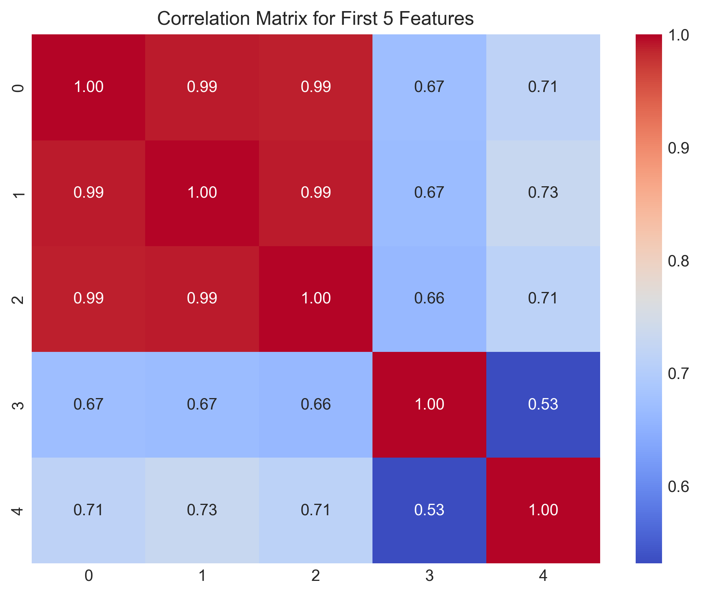

This heatmap shows the correlation matrix for the first 5 features, with the first 3 forming a highly correlated group (indicated by the bright values). This is precisely the type of structure where Lasso struggles with arbitrary selection while Elastic Net excels by preserving group information.

The feature selection stability visualizations clearly demonstrate this advantage:

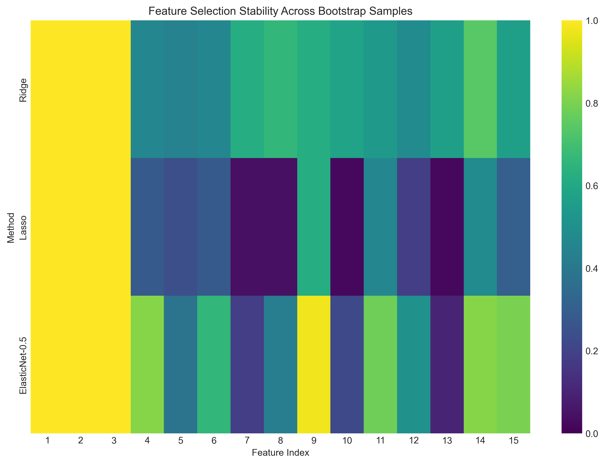

This heatmap shows how Elastic Net provides more consistent feature selection across bootstrap samples compared to Lasso, particularly for the truly important features.

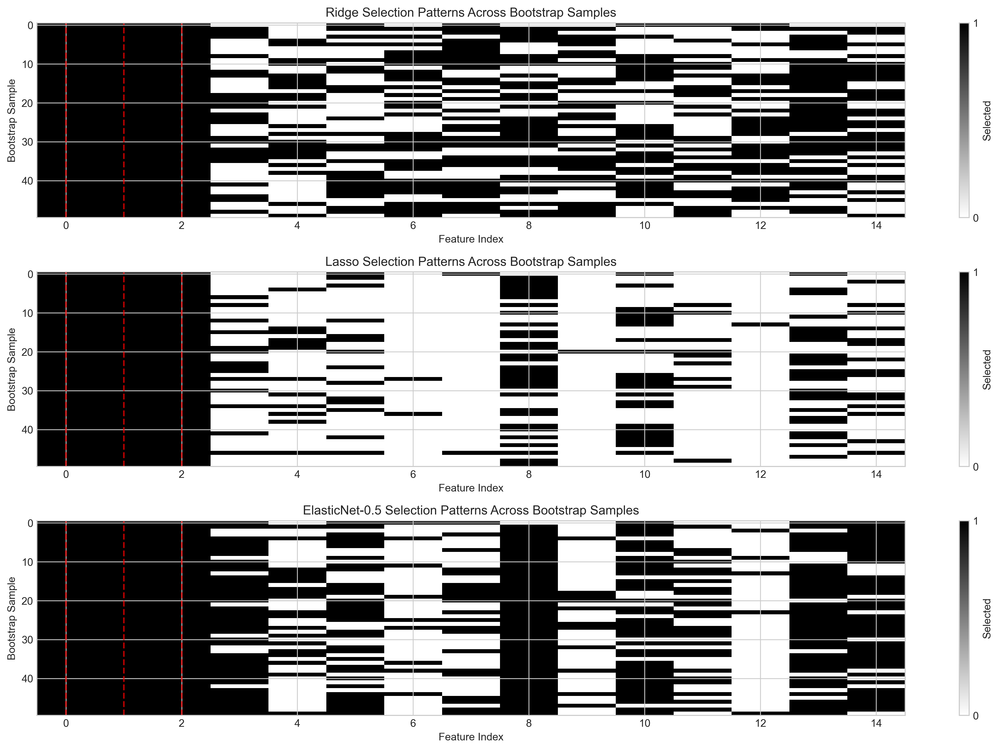

The detailed selection patterns further illustrate Lasso's instability (middle panel) versus Elastic Net's more consistent selection of the true features (marked by red lines).

### Task 2: How Elastic Net Balances Ridge and Lasso Properties

Elastic Net achieves a balance between Ridge and Lasso by combining their regularization terms in a unified objective function:

$$J_{\text{elastic}}(\boldsymbol{w}) = \|\boldsymbol{y} - \boldsymbol{X}\boldsymbol{w}\|_2^2 + \lambda_1\|\boldsymbol{w}\|_1 + \lambda_2\|\boldsymbol{w}\|_2^2$$

From Ridge regression, Elastic Net inherits:
- Stability with correlated features
- Continuous shrinkage of coefficients
- Better handling of multicollinearity

From Lasso regression, Elastic Net inherits:
- Feature selection capability
- Sparse coefficient vectors
- Model interpretability

The parameter $\rho$ (mixing parameter) controls this balance:
- $\rho = 0$: Pure Ridge regression (only L2 penalty)
- $\rho = 1$: Pure Lasso regression (only L1 penalty)
- $0 < \rho < 1$: Elastic Net with varying degrees of L1 and L2 influence

This balancing effect can be visualized in several ways:

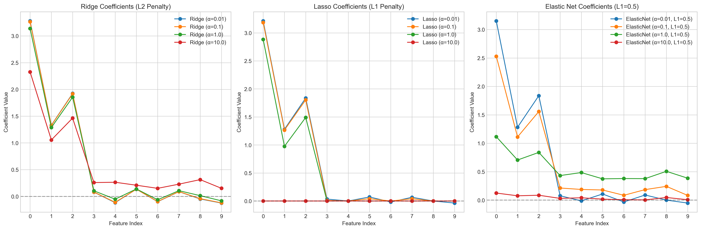

This figure shows how coefficients evolve with different regularization strengths across the three methods. The Elastic Net path (right) combines features of both Ridge (left) and Lasso (middle).

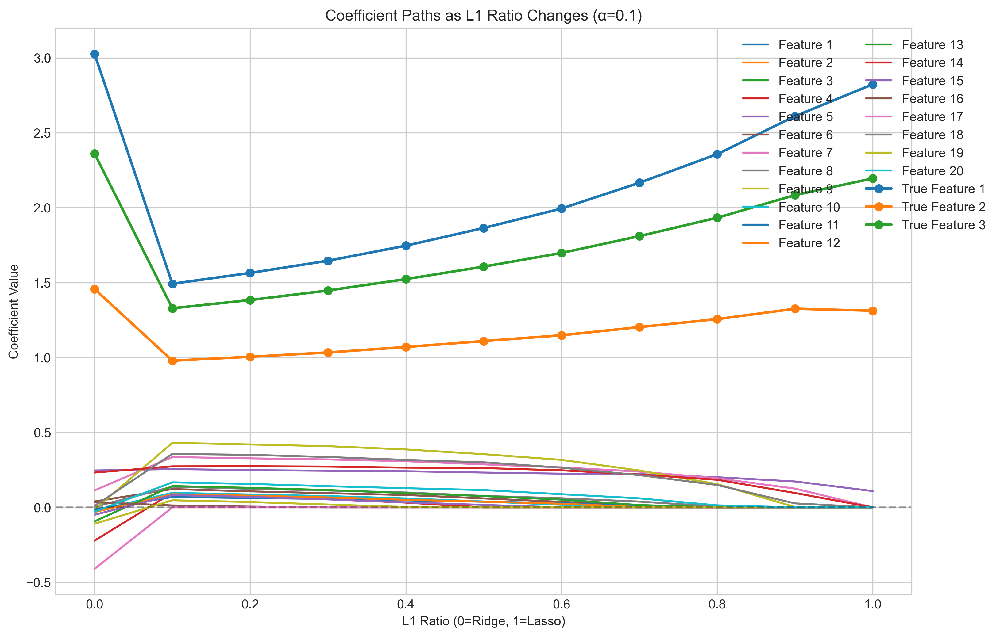

This plot illustrates the transition from Ridge to Lasso as $\rho$ increases from 0 to 1, showing how Elastic Net provides a continuous spectrum between the two methods.

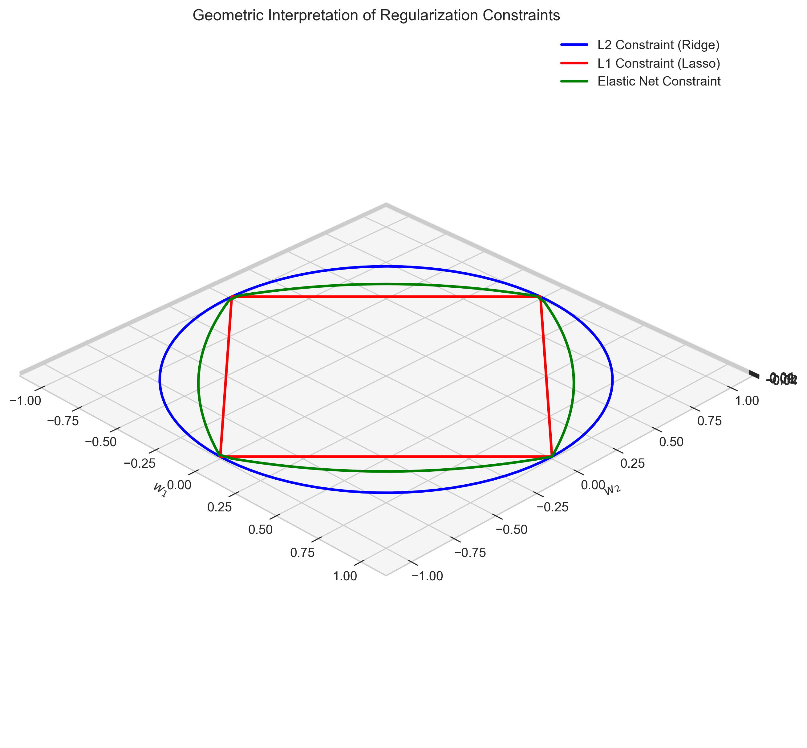

The 3D visualization shows the constraint regions for the three methods:
- Blue circle: L2 constraint (Ridge)
- Red diamond: L1 constraint (Lasso)
- Green curve: Elastic Net constraint (combination of both)

The Elastic Net constraint is an intermediate shape between the L1 diamond and L2 circle, visually representing its hybrid nature.

### Task 3: When to Prefer Elastic Net over Both Ridge and Lasso

Elastic Net would be preferred over both Ridge and Lasso in the following scenarios:

1. **With highly correlated features**: When your dataset contains groups of correlated predictors and you want to select variables while maintaining the grouping effect.

2. **For simultaneous regularization and selection**: When you need both feature selection capability (from Lasso) and coefficient shrinkage stability (from Ridge).

3. **In high-dimensional settings**: When the number of predictors $(p)$ is much larger than the number of observations $(n)$, Elastic Net often outperforms both alternatives.

4. **For more stable feature selection**: When you want more stability and reproducibility in feature selection than Lasso provides.

5. **For improved prediction accuracy**: When you need a compromise between Ridge's prediction accuracy and Lasso's interpretability.

The performance comparison across methods supports these recommendations:

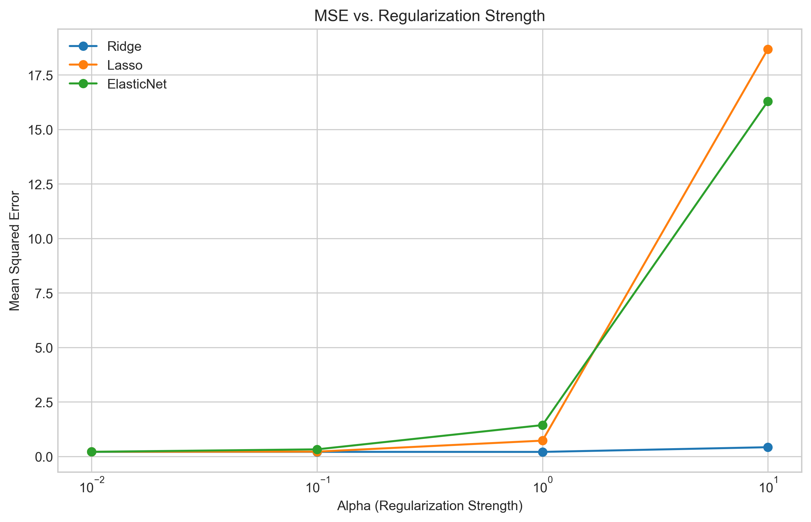

This plot shows how Elastic Net can maintain good predictive performance across a range of regularization strengths, often providing a more robust alternative to either Ridge or Lasso alone.

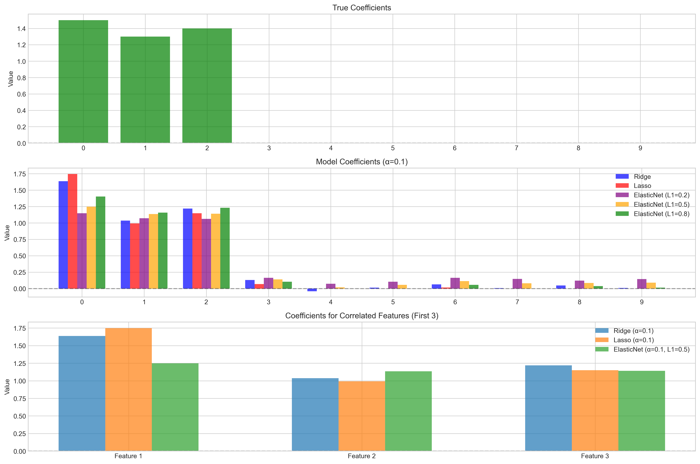

This multi-part figure demonstrates how Elastic Net handles correlated features better than either Ridge (which keeps all features) or Lasso (which arbitrarily selects one feature from each correlated group).

### Task 4: Selecting Regularization Parameters $\lambda_1$ and $\lambda_2$

Selecting the optimal regularization parameters for Elastic Net involves determining both the total regularization strength $\alpha = \lambda_1 + \lambda_2$ and the mixing parameter $\rho = \lambda_1 / (\lambda_1 + \lambda_2)$.

The most effective approaches include:

1. **Grid Search Cross-Validation**:
   - Create a grid of values for $\alpha$ (total regularization strength)
   - Create a grid of values for $\rho$ (mixing parameter)
   - Perform k-fold cross-validation to find the combination that minimizes prediction error

   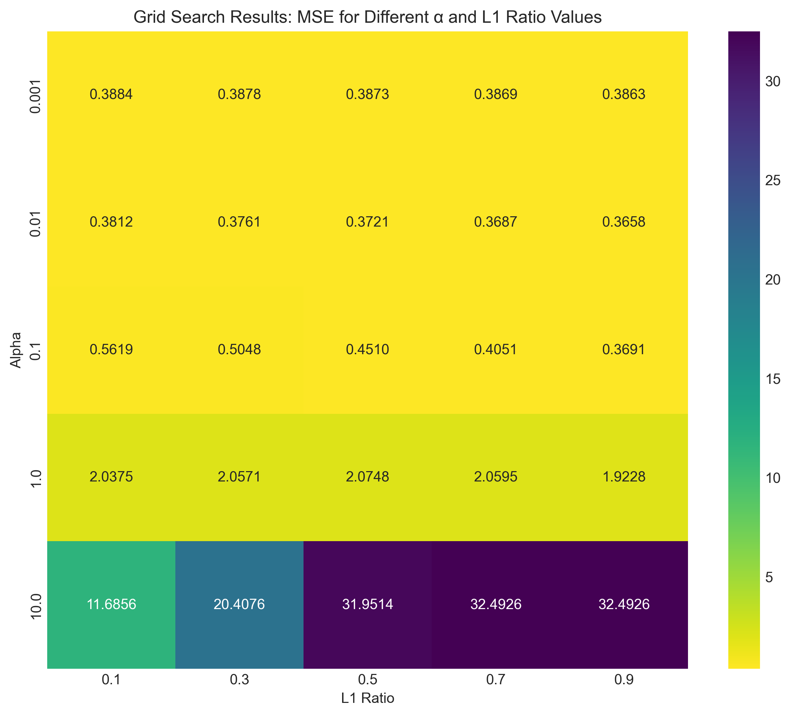

   This heatmap shows the results of a grid search over $\alpha$ and $\rho$ values, with each cell representing the MSE for a particular combination.

2. **Sequential Parameter Selection**:
   - Fix $\rho$ at several values (e.g., 0.1, 0.5, 0.9)
   - For each $\rho$, find the best $\alpha$ through cross-validation
   - Compare the best models for different $\rho$ values

   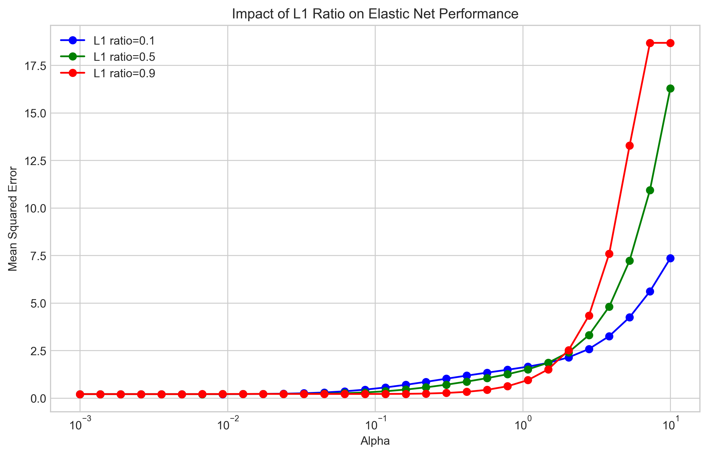

   This figure shows how performance varies with $\alpha$ for different values of $\rho$, helping identify the optimal parameter combination.

3. **Visualization of Error Surfaces**:
   - Plot the validation error as a function of both parameters
   - Identify regions of low error in the parameter space
   - Use this to narrow down the search space for more fine-grained optimization

4. **Domain Knowledge Integration**:
   - Use prior knowledge about the importance of feature selection vs. coefficient shrinkage
   - If feature selection is more important, bias toward higher $\rho$
   - If dealing with multicollinearity is more important, bias toward lower $\rho$
   
   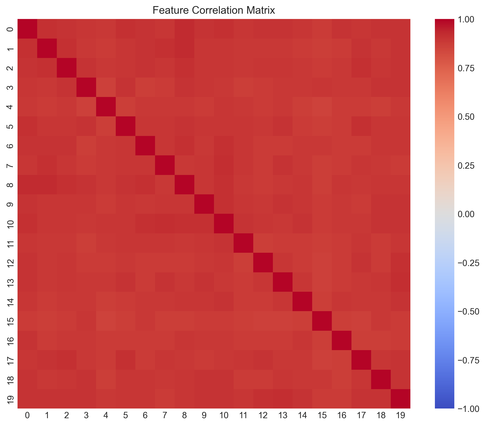
   
   Understanding the correlation structure in your data can guide your choice of parameters.

5. **Theoretical Considerations**:
   
   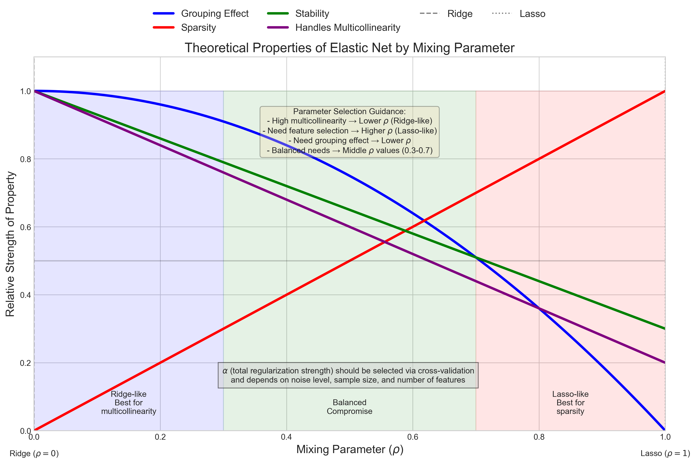
   
   This overview illustrates how the theoretical properties of Elastic Net vary with different parameter settings, showing the tradeoffs between sparsity, grouping effect, and prediction accuracy.

## Practical Implementation

### Example: Elastic Net with Correlated Features
Let's examine how Elastic Net behaves compared to Ridge and Lasso when applied to datasets with correlated features.

First, we generate synthetic data with the following properties:
- 10 features with correlation strength of 0.85
- Only the first 3 features have non-zero coefficients
- Moderate noise added to the response variable

```python
# Create data with correlated features
X, y, true_coef = create_correlated_features(n_samples=200, n_features=10, 
                                           corr_strength=0.85, noise=0.5)
```

When we apply Ridge, Lasso, and Elastic Net with various regularization parameters, we observe:

1. **Ridge Regression Results**:
   - Keeps all coefficients non-zero
   - More stable across different $\alpha$ values
   - Good performance with moderate regularization ($\alpha=1.0$, MSE=0.2075)

2. **Lasso Regression Results**:
   - Strong feature selection, setting many coefficients to zero
   - Performance degrades quickly with higher $\alpha$ values
   - At $\alpha=10.0$, all coefficients become zero (MSE=18.6838)

3. **Elastic Net Results**:
   - With $\rho=0.5$, it balances between feature selection and coefficient shrinkage
   - Better preservation of important variables while eliminating noise
   - More stable performance across regularization strengths

The coefficient paths clearly demonstrate how Elastic Net combines properties of both Ridge and Lasso, achieving a balance between stability and sparsity.

## Visual Explanations

### Coefficient Paths Comparison


This figure shows how coefficients change with different regularization strengths ($\alpha$) for Ridge, Lasso, and Elastic Net (with $\rho=0.5$). Notice how:
- Ridge (left) keeps all coefficients non-zero but gradually shrinks them
- Lasso (middle) aggressively sets many coefficients to zero as $\alpha$ increases
- Elastic Net (right) achieves a balance, maintaining important features while eliminating noise

### MSE Comparison


This plot compares the Mean Squared Error (MSE) of the three methods across different regularization strengths ($\alpha$). While Ridge and Elastic Net show relatively stable performance across a range of $\alpha$ values, Lasso's performance deteriorates more quickly with stronger regularization.

### Impact of L1 Ratio


This figure illustrates how changing the mixing parameter $\rho$ affects Elastic Net performance for different regularization strengths. Each curve represents a different $\rho$ value (0.1, 0.5, 0.9). We can observe that:
- Lower $\rho$ values (more Ridge-like) tend to be more stable across $\alpha$ values
- Higher $\rho$ values (more Lasso-like) achieve better performance with smaller $\alpha$ values but degrade faster as $\alpha$ increases
- The optimal combination depends on the specific dataset characteristics

### Feature Correlation Matrix


This heatmap visualizes the correlation structure in our generated dataset. The strong correlations (bright colors) indicate highly related features, which presents challenges for feature selection methods like Lasso.

### Coefficient Paths as L1 Ratio Changes


This plot shows how coefficients change as we move from pure Ridge ($\rho=0$) to pure Lasso ($\rho=1$). The horizontal axis represents the mixing parameter $\rho$, and the vertical axis shows the coefficient values. We observe:
- At $\rho=0$ (Ridge), all coefficients are non-zero
- As $\rho$ increases toward 1 (Lasso), more coefficients are driven to zero
- The true non-zero features (highlighted) maintain higher coefficient values across all $\rho$ values

### Grid Search for Parameter Selection


This heatmap shows the results of a grid search over $\alpha$ and $\rho$ values. Each cell represents the Mean Squared Error (MSE) for a particular combination. The optimal parameters in this case are $\alpha=0.01$ and $\rho=0.9$, indicating that a predominantly Lasso-like model with light regularization works best for this dataset.

### Geometric Interpretation


This 3D visualization illustrates the constraint regions for different regularization types:
- Blue circle: L2 constraint (Ridge)
- Red diamond: L1 constraint (Lasso)
- Green curve: Elastic Net constraint (combination of L1 and L2)

The Elastic Net constraint is an intermediate shape between the L1 diamond and L2 circle, reflecting its hybrid nature. Mathematically, the constraint regions correspond to:
- Ridge: $\|\boldsymbol{w}\|_2^2 \leq t_2$
- Lasso: $\|\boldsymbol{w}\|_1 \leq t_1$
- Elastic Net: $\rho\|\boldsymbol{w}\|_1 + (1-\rho)\|\boldsymbol{w}\|_2^2 \leq t$

### Group Effect with Correlated Features


This multi-part figure demonstrates how different models handle correlated features:
- Top: True coefficients (first 3 are non-zero)
- Middle: Coefficients from different models showing varying degrees of sparsity
- Bottom: Focused view of the correlated feature group (first 3 features)

Observe how:
- Ridge assigns similar coefficients to correlated features
- Lasso tends to select one feature from the correlated group
- Elastic Net balances between selection and grouping, maintaining important features while encouraging similar coefficients for correlated variables

### Feature Selection Stability


This heatmap visualizes the stability of feature selection across multiple bootstrap samples. Each row represents a different method (Ridge, Lasso, Elastic Net), and each column represents a feature. The color intensity indicates how frequently each feature was selected across 50 bootstrap samples, with brighter colors indicating more consistent selection.

Note how:
- Ridge tends to select most features consistently (but doesn't truly perform selection)
- Lasso shows more variability in which features are selected across different samples
- Elastic Net demonstrates a balance, consistently selecting the true important features while providing more stability than Lasso

### Feature Selection Patterns


This detailed visualization shows the actual selection patterns across bootstrap samples. Each row represents a different bootstrap sample, each column represents a feature, and the color (white/black) indicates whether the feature was selected in that sample. The red vertical lines mark the true non-zero coefficient features.

This visualization powerfully demonstrates:
- Ridge's tendency to retain all features
- Lasso's instability in feature selection, with different features selected across different samples
- Elastic Net's superior stability, consistently selecting the truly important features (marked by red lines)

This provides direct evidence of one of Elastic Net's key advantages: when dealing with correlated features, it produces more consistent feature selection across different samples of the data.

## Key Insights

### Theoretical Properties
- Elastic Net combines the L1 norm (Lasso) and squared L2 norm (Ridge) penalties
- The objective function has both sparsity and smoothness properties
- Mathematically equivalent to a quadratic penalty on pairs of correlated features
- Can be solved efficiently using coordinate descent or proximal gradient methods
- The grouping effect is mathematically guaranteed by the bound:
  $$|\hat{w}_j - \hat{w}_k| \leq \frac{1}{\lambda_2}\sqrt{\frac{1-\rho_{jk}}{2}}\|\boldsymbol{y} - \boldsymbol{X}\hat{\boldsymbol{w}}\|_2$$

### Practical Advantages
- Performs feature selection like Lasso while reducing instability
- Handles the "$p > n$" problem (more features than observations) effectively
- Better at selecting groups of correlated features than Lasso
- More robust to small changes in the data than Lasso alone
- Tends to outperform both Ridge and Lasso when features have complex correlation structures

### Parameter Selection
- Two parameters need tuning: total regularization strength $\alpha$ and mixing parameter $\rho$
- Grid search with cross-validation is the most common approach
- Visualization of error surfaces helps identify optimal parameter regions
- The best parameters depend on dataset characteristics, especially feature correlations
- Monitoring both prediction error and model sparsity provides insight during tuning

### Common Pitfalls
- Using inappropriate parameter ranges for grid search
- Not standardizing features before applying Elastic Net
- Overlooking the importance of the mixing parameter $\rho$
- Focusing only on prediction accuracy without considering model interpretability
- Assuming Elastic Net will always outperform Ridge and Lasso

## Conclusion
- Elastic Net provides a powerful compromise between Ridge and Lasso regression, combining their strengths while mitigating their weaknesses.
- For highly correlated features, Elastic Net overcomes Lasso's limitation by encouraging a grouping effect, where correlated predictors tend to have similar coefficient values.
- Elastic Net is preferred when you need both feature selection and stability, especially in high-dimensional settings with correlated features.
- Parameter selection for Elastic Net involves tuning both the regularization strength $\alpha$ and the mixing parameter $\rho$, typically through cross-validation.

Understanding when and how to apply Elastic Net enables data scientists to build more stable, interpretable models that maintain good predictive performance even with challenging data structures like multicollinearity. 