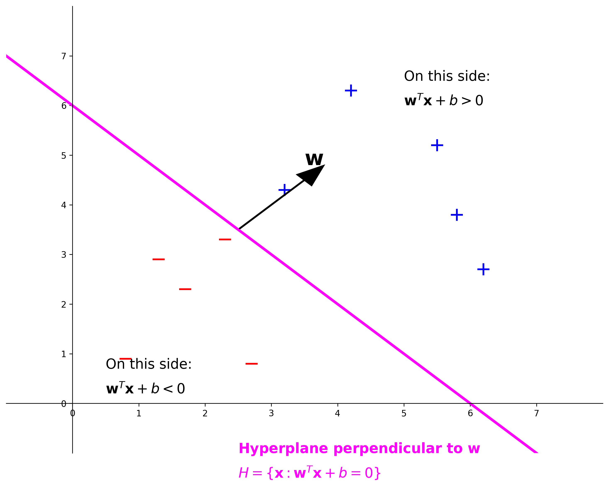

# Perceptron

The perceptron is one of the earliest and simplest types of artificial neural networks. It's a binary classifier that makes predictions based on a linear predictor function.

## Linear Decision Boundary



The perceptron creates a linear decision boundary (hyperplane) defined by:
- The weight vector **w** is perpendicular to the hyperplane
- The hyperplane equation is H = {x: w^T x + b = 0}
- Points on one side satisfy w^T x + b > 0 (positive class)
- Points on the other side satisfy w^T x + b < 0 (negative class)

## Learning Algorithm

The perceptron learning algorithm works by:
1. Initialize weights (w) and bias (b) to small random values
2. For each training example:
   - Calculate the predicted output
   - Update weights and bias if prediction is incorrect
3. Repeat until convergence or maximum iterations

## Algorithm Formula
```
w = w + y(n) x(n)
```
Where:
- w is the weight vector
- y(n) is the target label (+1 or -1)
- x(n) is the input feature vector

## Decision Boundary
- Creates a linear hyperplane defined by w^T x + b = 0
- Classifies points based on which side of hyperplane they fall

## Example (finding it step by step)
(Details for the perceptron example would be added here) 